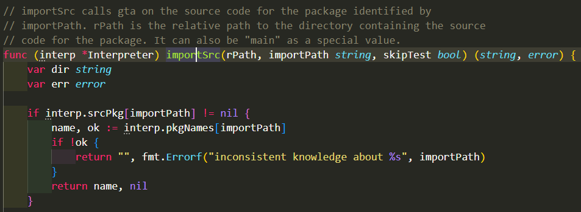
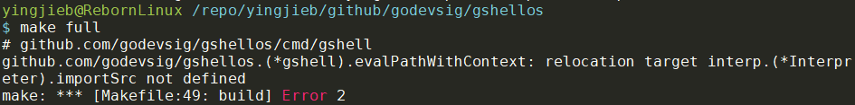
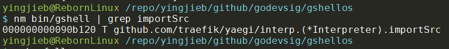

- [使用reflect的MethodByName调用方法](#使用reflect的methodbyname调用方法)
- [gob decode零值不赋值](#gob-decode零值不赋值)
  - [现象](#现象)
    - [原始数据](#原始数据)
    - [代码逻辑](#代码逻辑)
    - [问题现象](#问题现象)
  - [解释](#解释)
  - [验证](#验证)
  - [结论](#结论)
- [setuid](#setuid)
- [用linkname调用小写函数](#用linkname调用小写函数)
  - [go1.18更新](#go118更新)
  - [如何调用package的小写函数 go1.18版本](#如何调用package的小写函数-go118版本)
    - [解决](#解决)
- [使用了nohup命令启动gshelld, 还是收到signal退出](#使用了nohup命令启动gshelld-还是收到signal退出)
  - [SIGHUP](#sighup)
    - [Types of signals ¶](#types-of-signals-)
  - [推测](#推测)
  - [解决](#解决-1)
- [gshell的内存使用](#gshell的内存使用)
- [recover不能捕获SIGSEGV类型的panic](#recover不能捕获sigsegv类型的panic)
- [sigint会发给所有前台进程组](#sigint会发给所有前台进程组)
- [写已经closed的conn](#写已经closed的conn)
  - [场景](#场景)
  - [答案](#答案)
  - [结论](#结论-1)
- [读写nil channel会永远阻塞](#读写nil-channel会永远阻塞)
- [流式接口和go](#流式接口和go)
  - [流式函数链的go执行顺序](#流式函数链的go执行顺序)
    - [解读](#解读)
    - [运行结果和结论](#运行结果和结论)
- [go get和go mod](#go-get和go-mod)
  - [go get](#go-get)
  - [go list](#go-list)
  - [go mod tidy](#go-mod-tidy)
  - [总结](#总结)
- [go clean 清理编译cache](#go-clean-清理编译cache)
- [又犯了经典的goroutine引用闭包变量错误!!!!!](#又犯了经典的goroutine引用闭包变量错误)
  - [原因](#原因)
  - [解决](#解决-2)
  - [理论解释](#理论解释)
  - [总结](#总结-1)
- [if else if 共享一个变量scope](#if-else-if-共享一个变量scope)
- [经典的append地址错误](#经典的append地址错误)
- [打印指针slice](#打印指针slice)
  - [解决: 给结构体加String方法](#解决-给结构体加string方法)
- [关于wait group](#关于wait-group)
  - [反例](#反例)
- [从栈上获取变量地址](#从栈上获取变量地址)
  - [参考代码](#参考代码)
- [运行时获取函数名](#运行时获取函数名)
  - [方法1](#方法1)
  - [方法2](#方法2)
- [continue能返回N层for](#continue能返回n层for)
- [interface的理解](#interface的理解)
  - [interface{}是青出于蓝](#interface是青出于蓝)
  - [interface{}是带上下文的方法集合](#interface是带上下文的方法集合)
- [runtime.Caller获取当前运行目录](#runtimecaller获取当前运行目录)
- [An interface holding nil value is not nil](#an-interface-holding-nil-value-is-not-nil)
- [net/http导致包变大](#nethttp导致包变大)
  - [现象](#现象-1)
  - [解决](#解决-3)
  - [原因](#原因-1)
  - [结论](#结论-2)
- [Options初始化](#options初始化)
  - [总结](#总结-2)
- [空白import不会增加binary size](#空白import不会增加binary-size)
- [reflect高阶用法](#reflect高阶用法)
  - [动态构建一个struct](#动态构建一个struct)
  - [byName API -- 神奇的重名API](#byname-api----神奇的重名api)
    - [reflect.Value的MethodByName方法](#reflectvalue的methodbyname方法)
    - [reflect.Type的MethodByName方法](#reflecttype的methodbyname方法)
- [go调用外部程序](#go调用外部程序)
- [text/template代码生成举例](#texttemplate代码生成举例)
- [map的重要属性 unaddressable](#map的重要属性-unaddressable)
  - [方法1 整体给map赋值](#方法1-整体给map赋值)
  - [方法2 让value的类型为指针](#方法2-让value的类型为指针)
  - [结论](#结论-3)
- [go的树状表达](#go的树状表达)
  - [存储data](#存储data)
    - [改进存储](#改进存储)
  - [如果用key来存储data会怎样?](#如果用key来存储data会怎样)
- [golang的SIGABRT](#golang的sigabrt)
- [关于syscall](#关于syscall)
  - [标准syscall库的问题](#标准syscall库的问题)
  - [解决](#解决-4)
  - [更好的syscall库](#更好的syscall库)
    - [使用](#使用)
    - [ioctl](#ioctl)
    - [c的ioctl接口](#c的ioctl接口)
      - [cmd](#cmd)
      - [argp](#argp)
    - [go的ioctl接口](#go的ioctl接口)
    - [ioctl的宏定义在哪里?](#ioctl的宏定义在哪里)
    - [asm files](#asm-files)
    - [mmap](#mmap)
    - [mmap返回的byte切片是哪里来的?](#mmap返回的byte切片是哪里来的)
  - [fnctl](#fnctl)
- [RWLock死锁](#rwlock死锁)
- [float强转为int](#float强转为int)
- [go generate](#go-generate)
  - [go generate常使用的一些工具](#go-generate常使用的一些工具)
- [godoc安装](#godoc安装)
  - [godoc使用](#godoc使用)
- [package通配符和导入路径](#package通配符和导入路径)
  - [package通配符`...`](#package通配符)
  - [导入路径](#导入路径)
- [obj.function()中obj可以是nil](#objfunction中obj可以是nil)
  - [如何处理?](#如何处理)
- [切片的reslicing](#切片的reslicing)
- [再议目录结构](#再议目录结构)
- [具体error判断](#具体error判断)
- [函数赋值给变量](#函数赋值给变量)
- [gob encode和网络io的结合](#gob-encode和网络io的结合)
  - [单步decoder.Decode(\&msg)](#单步decoderdecodemsg)
- [protobuf里面oneof转成go结构体](#protobuf里面oneof转成go结构体)
  - [proto定义](#proto定义)
  - [转成的结构体](#转成的结构体)

# 使用reflect的MethodByName调用方法
下面的代码在`Handle()`这个方法里面, 调用了同对象的`DoHandle()`方法.

```go
// Handle handles SessionRequest.
func (msg *SessionRequest) Handle(stream as.ContextStream) (reply interface{}) {
    // ONLY use reflect when clients do not have full server functions built-in(aka lite build)
    handle := reflect.ValueOf(msg).MethodByName("DoHandle")
    if handle.IsValid() && !handle.IsZero() {
        ret := handle.Call([]reflect.Value{reflect.ValueOf(stream)})[0]
        if !ret.IsValid() {
            return nil
        }
        return ret.Interface()
    }
    return nil
}
```

* 被调用的方法必须大写开头. "DoHandle"可以, 但是如果这个函数是"handle", 就不行
* 返回值要先检查是否valid, 再检查是否是zero
* 使用`Call()`方法调用函数, 传参要自己知道该传什么, 返回值也要知道.
* 参数和返回值都是reflect.Value类型.

# gob decode零值不赋值
## 现象
我有一些cpu使用率的统计数据, 使用gob编码保存在文件中. 但decode出来的数据, 和原始数据不一样. 最典型的特征是, 似乎原值为0的时候, decode出来的数据的值可能"很随机"
### 原始数据
原始数据是如下结构体的切片
```go
type procStat struct {
    Pid  int
    Name string
    Ucpu float64
    Scpu float64
    Mem  uint64
}

type record struct {
    Time  int64
    Procs []procStat
}
```

### 代码逻辑
在一个routine里, 随机生成record数据, 不断的写入文件;
在另一个routine里, 读这个文件decode.
```go
func main() {
    rand.Seed(time.Now().Unix())
    flt := 0.01
    fmt.Println(flt)
    fmt.Printf("%x\n", *(*uint64)(unsafe.Pointer(&flt)))

    file := "gob.data"
    records := make(map[int64][]procStat, 1000)

    go func() {
        f, _ := os.Create(file)
        defer f.Close()
        enc := gob.NewEncoder(f)

        for i := 0; i < 5; i++ {
            rcd := record{Time: time.Now().Unix()}
            for i := 0; i < 10; i++ {
                ucpu, scpu := rand.Float64(), rand.Float64()
                ucpu = math.Round(ucpu*100) / 100
                scpu = math.Round(scpu*100) / 100
                if ucpu < 0.5 {
                    ucpu = 0
                }
                if scpu < 0.5 {
                    scpu = 0
                }
                ps := procStat{rand.Intn(65535), "worker", ucpu, scpu, 11985}
                rcd.Procs = append(rcd.Procs, ps)
            }
            records[rcd.Time] = rcd.Procs
            if err := enc.Encode(rcd); err != nil {
                fmt.Println(err)
                return
            }
            fmt.Println(time.Unix(rcd.Time, 0))
            //fmt.Println("++++", rcd)
            time.Sleep(2 * time.Second)
        }
        fmt.Println("enc done")
    }()

    for {
        time.Sleep(20 * time.Second)
        go func() {
            f, _ := os.Open(file)
            defer f.Close()
            dec := gob.NewDecoder(f)

            var rcd record // nok
            for {
                //var rcd record // ok
                if err := dec.Decode(&rcd); err != nil {
                    fmt.Println(err)
                    return
                }
                fmt.Println("----", rcd)
                should := records[rcd.Time]
                got := rcd.Procs
                if !reflect.DeepEqual(should, got) {
                    fmt.Println(time.Unix(rcd.Time, 0))
                    fmt.Println("Should: \n", should)
                    fmt.Println("Got:    \n", got)
                    fmt.Println()
                }
            }
        }()
    }
}
```
* 小知识: float在内存中和整形的存储方式很不一样, 比如`0.01`在内存中是`3f847ae147ae147b`

### 问题现象
运行这段程序, 会走到`reflect.DeepEqual`为假的分支, 说明encode的数据和decode的数据不一样.
但还是很有规律的:
```
$ go run gob.go
0.01
3f847ae147ae147b
2021-10-13 02:44:30 +0000 UTC
2021-10-13 02:44:32 +0000 UTC
2021-10-13 02:44:34 +0000 UTC
2021-10-13 02:44:36 +0000 UTC
2021-10-13 02:44:38 +0000 UTC
enc done
---- {1634093070 [{34730 worker 0 0.86 11985} {63668 worker 0.65 0 11985} {54333 worker 0.93 
0 11985} {45231 worker 0 0.76 11985} {19332 worker 0.82 0 11985} {51576 worker 0.59 0 11985} 
{16966 worker 0 0 11985} {17849 worker 0.84 0 11985} {18887 worker 0 0 11985} {36216 worker 0
 0.87 11985}]}
---- {1634093072 [{45159 worker 0.79 0.86 11985} {22705 worker 0.94 0 11985} {15938 worker 0.
93 0 11985} {45296 worker 0.71 0.63 11985} {8740 worker 0.82 0.93 11985} {36634 worker 0.94 0
.76 11985} {26329 worker 0 0.99 11985} {1891 worker 0.94 0 11985} {33214 worker 0.7 0 11985} 
{33629 worker 0.75 0.64 11985}]}
2021-10-13 02:44:32 +0000 UTC
Should:                  
 [{45159 worker 0.79 0 11985} {22705 worker 0.94 0 11985} {15938 worker 0 0 11985} {45296 wor
ker 0.71 0.63 11985} {8740 worker 0 0.93 11985} {36634 worker 0.94 0.76 11985} {26329 worker 
0 0.99 11985} {1891 worker 0.94 0 11985} {33214 worker 0.7 0 11985} {33629 worker 0.75 0.64 1
1985}]
Got:
 [{45159 worker 0.79 0.86 11985} {22705 worker 0.94 0 11985} {15938 worker 0.93 0 11985} {452
96 worker 0.71 0.63 11985} {8740 worker 0.82 0.93 11985} {36634 worker 0.94 0.76 11985} {2632
9 worker 0 0.99 11985} {1891 worker 0.94 0 11985} {33214 worker 0.7 0 11985} {33629 worker 0.
75 0.64 11985}]
---- {1634093074 [{1940 worker 0.87 0.62 11985} {59400 worker 0.94 0.57 11985} {10964 worker 
0.93 0 11985} {40707 worker 0.67 0.91 11985} {51810 worker 0.74 0.84 11985} {26919 worker 0.5
5 0.53 11985} {62442 worker 0 0.99 11985} {25 worker 0.97 0.78 11985} {4644 worker 0.79 0 119
85} {39752 worker 0.75 0.64 11985}]} 
```
规律:
* 第一次时间戳时, enc和dec的数据是一致的, 此时还没有错误.
* 从第二次时间戳开始, dec的数据就开始发生"跳变", 表现是结构体中`float64`类型的两个field(Ucpu和Scpu), 应该是0值的地方, 不是零值, 比如:
```
Should:
[{45159 worker 0.79 0 11985} {22705 worker 0.94 0 11985} ... ]
Got:
[{45159 worker 0.79 0.86 11985} {22705 worker 0.94 0 11985} ...]
```
上面第一个`procStat`结构体的`Scpu`, 应该是`0`, 却变成了`0.86`
* `0.86`似乎并不是"随机"的值, 经过发现, 正好是**上一次**recorde的同位置的值.

## 解释
在结论之前, 先排除几点:
* 和同时读写文件没有关系. 开始我们怀疑是文件写的同时, 又去文件读, 是否文件的内核态buffer没有"及时"写进去, 造成读文件的时候"部分"读, 造成数据异常. 但其实不是, 开始的时候我们让写的routine一直写, 后面改成写完close, 然后再读; 问题依旧
* 和float64的编解码有关吗? 似乎有关, 但如果编解码出错, 应该是全部float64的编解码都有问题. 但这里的现象是"个别"数据"跳变"

结合以上两点, 特别是第二点, 数据跳变似乎是**跳变成了以前出现过的值**.
那么这个`0.86`是哪里来的呢? 正好是上一次record的同位置的值:
```
{34730 worker 0 0.86 11985}
```
那么现在现象比较明确了: 
* 零值可能跳变
* 跳变的值是上一次同位置的值.

第49行, 在for之前定义了`var rcd record`, for里面的`dec.Decode(&rcd)`都是一直往这个地址decode.
第一次`rcd`全部是零值的时候, decode没问题; 但第二次`rcd`已经有了第一次的值了, 又如果gob在decode时候遇到零值, 比如下面Ucpu和Scpu是0, gob并不会给rcd的对应field赋值, 导致rcd的这部分值还是零值.
```go
type procStat struct {
    Pid  int
    Name string
    Ucpu float64
    Scpu float64
    Mem  uint64
}
```

## 验证
把49行换成51行, 即在for内部定义rcd, 结果就ok了. 我猜想是因为`dec.Decode(&rcd)`因为入参是`interface{}`, 导致rcd逃逸到堆. 因为是for内部定义的, 每次运行到`var rcd record`, 都会在堆里**新分配**rcd, 这样就不受前值影响.

把float64改成int, 按照上面的理论, 0值也会"跳变"
```go
type procStat struct {
    Pid  int
    Name string
    Ucpu int
    Scpu int
    Mem  uint64
}
```
经过验证, 确实零值也会跳变. 说明和float64编码没有关系.

## 结论
* `dec.Decode(&rcd)`gob遇到零值, 不会给`rcd`相应的field赋值
* 所以, 需要**每一次**在使用rcd之前, 都要保证它为零值
    * 要么在for里面定义rcd, 还要观察rcd是否真的逃逸到堆
    * 要么手动给rcd赋值为0
* 所以, 在go里面, 涉及到解码, 或者对变量指针操做, 要特别注意一个变量在内存里的表达:
    * 这个变量是同一个内存地址时, 通常都有bug
    * 补充: 冒号定义变量`var v := ...`和new变量都不能保证分配新的变量地址
* 补充, 改成json编解码不会有这个问题, 估计json在遇到零值依然有赋值动作.


# setuid
https://dustinspecker.com/posts/setuid-elevating-privileges/

一个文件可以有setuid属性:
> Setuid, which stands for set user ID on execution, is a special type of file permission in Unix and Unix-like operating systems such as Linux and BSD. It is a security tool that permits users to run certain programs with escalated privileges.

> When an executable file's setuid permission is set, users may execute that program with a level of access that matches the user who owns the file. For instance, when a user wants to change their password, they run the passwd command. The passwd program is owned by the root account and marked as setuid, so the user is temporarily granted root access for that limited purpose.

命令:
```
chmod u+s myfile
chmod u+x myfile
chmod g+s myfile2
```

一般都是谁执行myfile, 这个进程算谁的. 但如果由setuid属性的文件, 执行算这个文件的owner的. 比如这个文件的owner是root, 那普通用户执行这个带`s`属性的文件, 也有root权限.

# 用linkname调用小写函数
一般的, package的小写函数是没法直接调用的, 但有个办法可以绕过这个限制.
用`go:linkname`
比如标准库里
```go
package reflect

//go:linkname call runtime.reflectcall
func call(argtype *rtype, fn, arg unsafe.Pointer, n uint32, retoffset uint32)
```

reflect的call被link成了`runtime.reflectcall`, 也就是说, 调用`reflect.call`就是调用小写的`runtime.reflectcall`.

另见: [补充-go-linkname用法](https://bai-yingjie.github.io/notes/golang_gvisor%E4%BB%A3%E7%A0%81_KVM.html#%E8%A1%A5%E5%85%85-go-linkname%E7%94%A8%E6%B3%95)

## go1.18更新
上面的方法从go1.17开始失效了. 见下面的讨论:
* https://github.com/golang/go/issues/46777
* https://groups.google.com/g/golang-nuts/c/S9Yo8v2XYn4
* https://github.com/golang/proposal/blob/master/design/27539-internal-abi.md#compatibility

这个hack的方式从来都没有被官方支持过, 不推荐用.

如果非要使用, 往下看

## 如何调用package的小写函数 go1.18版本
我想在`gshellos/shell.go`里面调用yaegi的`importSrc`函数. 这是个小写函数, 直接调用是不行的.  


按照上面的老方法调用:
```go
//go:linkname importSrc interp.(*Interpreter).importSrc
func importSrc(interp *interp.Interpreter, rPath, importPath string, skipTest bool) (string, error)
```
会报错:  


为什么会报错呢? `interp.(*Interpreter).importSrc`没有定义?  
网上查了一圈, 说法就是编译器不再支持这种hack的方式了...

注意, 这里有个小知识
* golang的方法本质上就是函数, 只是编译器会把receiver做为第一个参数传给方法. 比如这里, 我定义了本地的函数`importSrc`, 指向了`interp`的`importSrc`方法, 其receiver `interp *interp`我写在了本地函数`importSrc`的第一个参数. 这样这两个形式就是匹配的.
* `interp.(*Interpreter).importSrc`的格式是`package.(receiver).method`, 和dlv的方法断点格式相同.

### 解决
那么就没有办法了吗? 出错提示符号未定义, 那么先看看是否真的没有.  
对之前能编译过的版本查符号:  


这个符号是有的, 全名是`github.com/traefik/yaegi/interp.(*Interpreter).importSrc`

能不能写完整这个全名?  
可以的
```go
//go:linkname importSrc github.com/traefik/yaegi/interp.(*Interpreter).importSrc
func importSrc(interp *interp.Interpreter, rPath, importPath string, skipTest bool) (string, error)
```
能编过, 功能也正常^^

# 使用了nohup命令启动gshelld, 还是收到signal退出
```
nohup bin/gshell -wd rootregistry -loglevel debug daemon -registry 10.182.105.179:11985 -bcast 9923 -root -repo gitlabe1.ext.net.nokia.com/godevsig/grepo/master &
```
但gshell还是会退出
```
[2021/09/09 12:23:16.705595][daemon][WARN](adaptiveservice.go:215) signal: hangup
[2021/09/09 12:23:16.705762][daemon][INFO](server.go:350) server closing
[2021/09/09 12:23:16.705827][daemon][DEBUG](scalamsgq.go:49) msgq closed
```
## SIGHUP
### Types of signals [¶](https://pkg.go.dev/os/signal#hdr-Types_of_signals)

The signals SIGKILL and SIGSTOP may not be caught by a program, and therefore cannot be affected by this package.

Synchronous signals are signals triggered by errors in program execution: SIGBUS, SIGFPE, and SIGSEGV. These are only considered synchronous when caused by program execution, not when sent using os.Process.Kill or the kill program or some similar mechanism. In general, except as discussed below, Go programs will convert a synchronous signal into a run-time panic.

The remaining signals are asynchronous signals. They are not triggered by program errors, but are instead sent from the kernel or from some other program.

Of the asynchronous signals, the SIGHUP signal is sent when a program loses its controlling terminal. The SIGINT signal is sent when the user at the controlling terminal presses the interrupt character, which by default is ^C (Control-C). The SIGQUIT signal is sent when the user at the controlling terminal presses the quit character, which by default is ^\ (Control-Backslash). In general you can cause a program to simply exit by pressing ^C, and you can cause it to exit with a stack dump by pressing ^\.

注意上面的解释, 当主控制台丢失的时候, 会发SIGHUP给程序.
SIGHUP的默认行为是程序退出: `man 7 signal` 搜索SIGHUP

## 推测
nohup命令ignore了SIGHUP, 从而其子进程也默认继承了这个irgnore的行为.
而gshell代码里, 显式捕捉了`syscall.SIGHUP`:
```go
func initSigCleaner(lg Logger) {
    sigOnce.Do(func() {
        // handle signal
        sigChan := make(chan os.Signal, 1)
        signal.Notify(sigChan, syscall.SIGINT, syscall.SIGHUP, syscall.SIGTERM)
        go func() {
            sig := <-sigChan
            lg.Warnf("signal: %s", sig.String())
            sigCleaner.Lock()
            for _, c := range sigCleaner.closers {
                c.close()
            }
            sigCleaner.Unlock()
        }()
    })
}
```
所以明明应该ignore的SIGHUP, 又发挥了作用...

## 解决
应该去掉这个syscall.SIGHUP的捕捉就好了, 还是用nohup启动.
更好的办法, 是用Ignore API:
```go
signal.Ignore(syscall.SIGHUP)
```

# gshell的内存使用
用到的可执行文件是`bin/gshell`, 命令: 
```
cat /proc/29961/smaps
readelf -a
```

注: 

|内存\场景 | 单daemon KB | daemon + master gre|
|----|----|----|
|.text RSS | 2388 | 2388 + 2516
|.text **PSS** | 2388 | 1194 + 1322
|.rodata RSS | 2024 | 2088 + 2152
|.rodata **PSS** | 2024 | 1044 + 1108
|.go.buildinfo RSS | 144 | 144 + 144
|.go.buildinfo PSS | 144 | 96 + 96
|.bss RSS | 84 | 84 + 72
|.bss PSS | 84 | 84 + 72
|栈? RSS | 2244 | 2352 + 2772
|栈? PSS | 2244 | 2352 + 2772
|堆? RSS | 1504 | 1576 + 320
|堆? PSS | 1504 | 1576 + 320
|n个routine栈 RSS | 0/4 | 0/4 + 0/4
|n个routine栈 PSS | 0/4 | 0/4 + 0/4
|系统栈1? RSS | 68 | 68 + 68
|系统栈1? PSS | 68 | 68 + 68
|系统栈2? RSS | 12 | 12 + 12
|系统栈2? PSS | 12 | 12 + 12
|vdso RSS | 4 | 4 + 4
|vdso **PSS** | 0 | 0 + 0

结论: 同一个go的binary, 多次单独启动的情况下: 
* 代码段.text是共享的
* 只读数据段.rodata是共享的
* vdso等kernel so是共享的
* 其他好像都不共享

# recover不能捕获SIGSEGV类型的panic
比如下面的代码:
```go
func() {
    defer func() {
        if err := recover(); err != nil {
            lg.Errorf("broken stream chan: %v", err)
        }
    }()
    streamChan := *(*chan *streamTransportMsg)(unsafe.Pointer(uintptr(tm.dstChan)))
    // swap src and dst
    streamChan <- &streamTransportMsg{srcChan: tm.dstChan, dstChan: tm.srcChan, msg: tm.msg}
}()
```
defer的函数中, recover并不能捕获下面的panic:
```
fatal error: unexpected signal during runtime execution
[signal SIGSEGV: segmentation violation code=0x80 addr=0x0 pc=0x40bbee]

...
```

# sigint会发给所有前台进程组
gshell daemon起了子进程gre-master, 在前台ctrl+c daemon, gre-master也会收到sigint, 两个进程都会消失.
但如果daemon进程自己panic挂掉, gre-master还会继续运行.

值得注意的是, 如果用kill命令指定向daemon进程发送signit, 那就指定pid才会收到信号, 也不会导致gre-master挂掉.
见[system 原理杂记](notes/system_原理杂记.md)

# 写已经closed的conn
## 场景
机器A的进程a和机器B的进程b建立了TCP的conn
a一直读, b一直写.
a被杀掉, b会怎么样? 会写失败吗? 写会一直阻塞吗?

## 答案
b会写失败, error信息为:
`writev tcp 172.17.0.1:40757->172.17.0.4:34458: use of closed network connection`

## 结论
不管是socket读, 还是socket写, 都能感知到connection已经关闭.
但前提是机器A不是突然断电. 在机器A还在但进程a被杀掉的情况下, A的kernel会关闭和B的连接, B的kernel和进程b都是知道对方(也就是A)连接中断了.

# 读写nil channel会永远阻塞
并且调用栈里面, 会明显的标识: `[chan send (nil chan)]`
比如:
```
goroutine 34 [chan send (nil chan)]:
github.com/godevsig/adaptiveservice.(*streamTransport).receiver.func1(0x5e7c48, 0xc0000c2ba0, 0xc0000a7140)
        /repo/yingjieb/github/godevsig/adaptiveservice/streamtransport.go:213 +0x49
created by github.com/godevsig/adaptiveservice.(*streamTransport).receiver
        /repo/yingjieb/github/godevsig/adaptiveservice/streamtransport.go:206 +0x8a
```

参考go规范:
> Receiving from a `nil` channel blocks forever
> A send on a `nil` channel blocks forever.

# 流式接口和go
我们知道流式接口就是说返回其自身的方法.
比如:
```go
// NewClient creates a client which discovers services.
func NewClient() *Client {
    return &Client{
        base:            newBase(),
        discoverTimeout: -1,
    }
}
// WithinScopeOS sets the discover scope in same OS.
func (c *Client) WithinScopeOS() *Client {
    c.withinScopeOS()
    return c
}
```
这样就可以"流式"的初始化:
```go
c := NewClient().WithinScopeOS().WithDiscoverTimeout(0)
```

那么如果我向go这个流式函数链呢? 比如
```go
go NewClient().WithinScopeOS().WithDiscoverTimeout(0)
```
其执行顺序是怎么样的?

## 流式函数链的go执行顺序
先看代码:
```go
package main

import (
    "fmt"
    "time"
)

type test struct {
    name string
}

func NewTest(f func() string) *test {
    fmt.Println("in NewTest")
    return &test{f()}
}

func (t *test) fa() *test {
    fmt.Println(t.name, "in fa")
    return t
}

func (t *test) fb(f func()) *test {
    fmt.Println("fb")
    f()
    return t
}

func main() {
    fmt.Println("Hello, playground")

    go NewTest(
        func() func() string {
            fmt.Println("before go? -- YES")
            return func() string {
                return "San"
            }
        }()).
        fa().
        fb(
            func() func() {
                fmt.Println("before go? -- NO")
                return func() { fmt.Println("in go? -- YES") }
            }())

    time.Sleep(time.Second)
}
```

### 解读
* NewTest函数入参是个函数, 传入的时候返回闭包函数传给它
* fa函数是普通的函数链上的一个
* fb函数也是函数链上的, 但传入一个闭包函数给它.
* 大的调用关系是`go NewTest(入参).fa().fb(入参)`

### 运行结果和结论
结果:
```
Hello, playground
before go? -- YES
in NewTest
San in fa
before go? -- NO
fb
in go? -- YES
```
结论是: 只有第一级函数, 即NewTest()的入参, 在这里是个函数, 是在go之前执行, 对应打印`before go? -- YES`
要注意, fb的入参函数, 是在go里面执行的. 所以说只有第一级的函数的入参才会在go之前被计算

# go get和go mod
测试环境 go1.16, go mod模式
## go get
* `go get -u`: 升级所有依赖, 递归包括依赖的依赖
  * 如果只是想更新go.mod, 可以用`go get -u -d`
  * 用`go get ./...`可以通配所有子目录
  * 连起来用就是`go get -u -d ./...`
* `go get -u all`: 首先`all`会被扩展成main的所有依赖, 然后升级所有依赖. `all`是关键词, 详见`go help packages`

## go list
`go list -m all`能列出当前用的所有的module(包括版本号)
`go list all`能列出当前用的所有的package(import路径)

## go mod tidy
清理go.mod用的, 但似乎go.sum还是有很多"历史"版本, 这些版本并没有使用.

## 总结
* `go list -m all`查看main的所有递归依赖版本
* go的编译系统一般只有一个版本号. 当出现不同版本依赖时, 比如A依赖(X@v0.0.2), 但某个依赖指定了不同的版本号(比如X@v0.0.1), 我猜测根据兼容性公约, go的编译系统会选择新的版本号(v0.0.1)来编译.

# go clean 清理编译cache
```
go clean -cache -i -r

The -cache flag causes clean to remove the entire go build cache.
The -i flag causes clean to remove the corresponding installed archive or binary (what 'go install' would create).

The -r flag causes clean to be applied recursively to all the dependencies of the packages named by the import paths.

The -n flag causes clean to print the remove commands it would execute, but not run them.

The -modcache flag causes clean to remove the entire module download cache, including unpacked source code of versioned dependencies.
```

# 又犯了经典的goroutine引用闭包变量错误!!!!!
这是个比较隐蔽的先for在switch的结构, 很容易忘记go引用的闭包变量会异步的变化.
```go
for _, vc := range vcs {
    switch cmd.Cmd {
    case "restart":
        if vc.stat == vmStatExited {
            vm := vc.VM
            vm.In = null{}
            logFile, err := os.Create(vc.outputFile)
            if err != nil {
                greLogger.Errorln(errorHere(err))
                break
            }
            vm.Out = logFile
            go func() {
                defer logFile.Close()
                vc.RestartedNum++
                vc.runVM()
            }()
            ids = append(ids, vc.ID)
        }
    }
}
```
现象是第15和16行, 在10次for循环里, 每次都是对同一个vc对象进行操做.

## 原因
这里第15和16行引用的是for的循环变量vc, 会被for循环更改.

## 解决
只在进入goroutine之前, 重新定义局部变量`vc := vc`, 这样goroutine里面的vc就引用的是局部变量vc.第13行定义的vc每次for循环都是个新的vc.
```go
for _, vc := range vcs {
    switch cmd.Cmd {
    case "restart":
        if vc.stat == vmStatExited {
            vm := vc.VM
            vm.In = null{}
            logFile, err := os.Create(vc.outputFile)
            if err != nil {
                greLogger.Errorln(errorHere(err))
                break
            }
            vm.Out = logFile
            vc := vc
            go func() {
                defer logFile.Close()
                vc.RestartedNum++
                vc.runVM()
            }()
            ids = append(ids, vc.ID)
        }
    }
}
```

## 理论解释
参考https://stackoverflow.com/questions/39208162/why-i-can-redefine-the-same-variable-multiple-times-in-a-for-loop-but-cant-outs
有人问为什么在循环里可以:
```go
func main() {
    for i := 0; i < 2; i++ {
        x := 77
        fmt.Println(x)
    }
}
```
但自己手动写就编译不过:
```go
func main() {
    a := 77
    fmt.Println(a)
    a := 77
    fmt.Println(a)
}
```
为啥?

专家的解答是:
for循环每次进入循环体大括号块`{}`, 都是一个新的scope

> The reason is each time you enter a block of curly braces `{}` you're creating a new nested scope. When you declare the variable `x` at the top of the loop it is a new variable and it goes out of scope at the end of the loop. When the program comes back around to the top of the loop again it's another new scope.

有人给出了证据:
```go
func main() {
    for i := 0; i < 2; i++ {
        x := 77
        fmt.Println(&x)
    }
}
```
output
```
0x1040e0f8
0x1040e0fc
```

可以手动加`{}`来添加scope:
```go
func main() {
    a := 77
    fmt.Println(&a)
    {
        a := 77
        fmt.Println(&a)
    }
}
```
output
```
0x1040e0f8
0x1040e0fc
```
上面的例子就可以"连续"定义`a`两次, 但第二次是个新的变量地址

## 总结
* for循环同一行的变量作用域在for里面没错, 但更像是在进入循环前定义的一样: for循环里面对循环变量的引用都是指向同一个东西
* for循环里面用`var v int`或`vc := vc`定义的变量, 并非同一个地址, 每次循环都是"临时"生成的. 所以上面在第13行的修改可以解决问题.
* 以后检查go出去的函数是否有这个问题, **只检查循环变量**就行了


# if else if 共享一个变量scope
比如
```
var msg interface{}
if ... {
} else if msg, ok := msg.(ExclusiveMessage); ok {
} else if msg, ok := msg.(Message); ok {
}
```
第二个`else if`中的`msg.(Message)`实际上引用的是第一个`else if`中的`msg, ok`变量.

解决: 给if的变量取个不同的名字, 不要总叫msg

# 经典的append地址错误
背景是在vm运行的过程中, 调用`callers()`保存当下的调用栈所有栈帧.

下面的代码有错误:
```go
func (v *VM) callers() (frames []*frame) {
    curFrame := *v.curFrame
    curFrame.ip = v.ip - 1
    frames = append(frames, &curFrame)
    for i := v.framesIndex - 1; i >= 1; i-- {
        //值复制, 避免v.frames变动造成curFrame变动
        //v.frames是个数组
        curFrame = v.frames[i-1]
        //注意这里搞错了, 每次都append同一个地址!!! 这个因为curFrame变量只有一个.
        frames = append(frames, &curFrame)
    }
    return frames
}
```

改正: 这种情况下, 返回值的slice, 而不是指针slice.
```go
func (v *VM) callers() (frames []frame) {
    curFrame := *v.curFrame
    curFrame.ip = v.ip - 1
    frames = append(frames, curFrame)
    for i := v.framesIndex - 1; i >= 1; i-- {
        curFrame = v.frames[i-1]
        frames = append(frames, curFrame)
    }
    return frames
}
```

# 打印指针slice
我有个结构体, 现在想打印一个`var wants []*want`的slice
```go
type want struct {
    content   []string
    unordered bool
}
```

直接`fmt.Printf("%v", wants)`会输出一个slice, 但元素都是指针. 怎么才能打印这些指针的值呢? 
用`fmt.Printf("%+v", wants)`和`fmt.Printf("%#v", wants)`都不行.

## 解决: 给结构体加String方法
```go
func (wt *want) String() string {
    var sb strings.Builder
    if wt.unordered {
        sb.WriteString("//unordered output:\n")
    } else {
        sb.WriteString("//output:\n")
    }
    for _, str := range wt.content {
        sb.WriteString(str + "\n")
    }
    return sb.String()
}
```
这样`fmt.Printf("%v", wants)`就可以输出我们想要的内容了. 其原理是如果一个类型有自定义`String()`方法, Printf会调用这个自定义`String()`方法.
注意, 这里要用引用的receiver方式, 因为我们要打印指针.


# 关于wait group
sync包的wait group用于主routine等待所有子routine退出. 在使用上需要注意:
* `wg.Add(1)`需要在go之前.
* `wg.Done()`需要在go里面.

即要严格按照官网的例子来写:
```go
var wg sync.WaitGroup
var urls = []string{
    "http://www.golang.org/",
    "http://www.google.com/",
    "http://www.somestupidname.com/",
}
for _, url := range urls {
    // Increment the WaitGroup counter.
    wg.Add(1) //注意这里, 在go之前Add()
    // Launch a goroutine to fetch the URL.
    go func(url string) {
        // Decrement the counter when the goroutine completes.
        defer wg.Done() //注意这里, 在go里面Done()
        // Fetch the URL.
        http.Get(url)
    }(url)
}
// Wait for all HTTP fetches to complete.
wg.Wait()
```

下面解释一下: 
* 在go之前Add(), 是要这个`wg.Add(1)` **一定** 能被主routine调用到.
* 在go里面调`wg.Done()`很好理解, 表示事情在这个异步的goroutine里已经完成.

## 反例
通常大家容易犯的错误是把`wg.Add(1)`放到go的里面去做. 比如下面代码:
clone一个VM, 然后在新的goroutine中run这个新的VM. 父VM需要记录这个新VM到其childVM map里面.
```go
func govm(fn) {
    newVM := vm.ShallowClone()
    gvm := &goroutineVM{
        VM:       newVM,
        waitChan: make(chan ret, 1),
    }

    vm.addChildVM(gvm.VM)
    go func() {
        //vm.addChildVM(gvm.VM) //不能在里面Add()
        val, err := gvm.RunCompiled(fn, args[1:]...)
        gvm.waitChan <- ret{val, err}
        vm.delChildVM(gvm.VM)
    }()
}

func (v *VM) addChildVM(cvm *VM) {
    v.childCtl.Add(1)
    v.childCtl.Lock()
    v.childCtl.vmMap[cvm] = struct{}{}
    v.childCtl.Unlock()
}

func (v *VM) delChildVM(cvm *VM) {
    v.childCtl.Lock()
    delete(v.childCtl.vmMap, cvm)
    v.childCtl.Unlock()
    v.childCtl.Done()
}
```
如果第8行放到第10行做, 好像也在干活之前加了1, 干完活减1.

但实际情况是, 比如:
在父VM Abort时, 需要abort其所有的子VM.
```go
// Abort aborts the execution of current VM and all its descendant VMs.
func (v *VM) Abort() {
    atomic.StoreInt64(&v.aborting, 1)
    close(v.abortChan) // broadcast to all receivers
    v.childCtl.Lock()
    for cvm := range v.childCtl.vmMap {
        cvm.Abort()
    }
    v.childCtl.Unlock()
    v.childCtl.Wait() // waits for all child VMs to exit
}
```
现在假设父这样的操做序列: 新起3个VM然后马上abort
```
govm(fn1)
govm(fn2)
govm(fn3)
abort()
```
3个govm是异步在跑的, 当父VM routine运行到第4行`abort()`的时候, 在`abort()`跑到第10行`v.childCtl.Wait()`等待这个wait group的时候, 不能保证它的3个子VM都跑到了`Add(1)`, 因为子VM的Add()可能还没有运行.
这样会导致在父routine的`Wait()`得到wait的个数小于实际的VM routine个数, 虽然VM起来以后这个wait个数是能够加到3的, 但已经过了父VM routine 的wait点(`Abort()`函数第10行), 最后的结果就是父VM routine不能把这3个VM routine都`abort()`掉.


# 从栈上获取变量地址
比如我要从下面的栈中, 取传递给`github.com/d5/tengo/v2.(*VM).run`的地址
```go
goroutine 1 [running]:
github.com/d5/tengo/v2.builtinGo(0xc0001360b0, 0x1, 0x1, 0x0, 0x0, 0xc0001360b0, 0x1)
        /repo/yingjieb/github/godevsig/tengo/builtins.go:409 +0x69
github.com/d5/tengo/v2.(*BuiltinFunction).Call(0x7993b0, 0xc0001360b0, 0x1, 0x1, 0xc000178010, 0x1, 0x7ff, 0x1)
        /repo/yingjieb/github/godevsig/tengo/objects.go:349 +0x48
github.com/d5/tengo/v2.(*VM).run(0xc00013e0d0)
        /repo/yingjieb/github/godevsig/tengo/vm.go:652 +0x3323
github.com/d5/tengo/v2.(*VM).Run(0xc00013e0d0, 0xc00013e0d0, 0x400)
        /repo/yingjieb/github/godevsig/tengo/vm.go:96 +0xc7
github.com/godevsig/gshellos.(*shell).runREPL(0xc000099ec8)
        /repo/yingjieb/github/godevsig/gshellos/gshellbuilder.go:101 +0x825
github.com/godevsig/gshellos.ShellMain(0x786a60, 0xc00005e750)
        /repo/yingjieb/github/godevsig/gshellos/gshellbuilder.go:197 +0x660
main.main()
        /repo/yingjieb/github/godevsig/gshellos/cmd/gshell/gshell.go:12 +0x26
```
下面是方法
首先在`vm.go`里面
```go
var stackIdentifierVM string //应该是github.com/d5/tengo/v2.(*VM).run

func init() {
    stackIdentifierVM = runtime.FuncForPC(reflect.ValueOf((*VM).run).Pointer()).Name()
}
```
然后在需要用到VM地址的函数里:
```go
func builtinGo(args ...Object) (Object, error) {
    ...
    var buf [1024]byte
    n := runtime.Stack(buf[:], false) //取stack, 看从哪里调的. 本函数离(*VM).Run不远, 1024的buf够了
    stk := string(buf[:n])
    idx := strings.Index(stk, stackIdentifierVM) //找到stackIdentifierVM字符串, 也就是上面的"github.com/d5/tengo/v2.(*VM).run"
    stk2 := stk[idx+len(stackIdentifierVM)+1:]
    idx = strings.Index(stk2, ")")

    addr, err := strconv.ParseUint(stk2[:idx], 0, 64) //转为int64
    vm := (*VM)(unsafe.Pointer(uintptr(addr))) //用unsafe强制转为*VM
    
    newVM := vm.ShallowClone() //然后就可以使用这个vm的方法了
}
```

## 参考代码
```go
# in vm.go
var stackIdentifierVM = runtime.FuncForPC(reflect.ValueOf((*VM).run).Pointer()).Name()

# in group.go
func getVM() (*VM, error) {
    var buf [1024]byte
    n := runtime.Stack(buf[:], false)
    stk := string(buf[:n])
    // find "github.com/d5/tengo/v2.(*VM).run"
    idx := strings.Index(stk, stackIdentifierVM)
    stk2 := stk[idx+len(stackIdentifierVM)+1:]
    idx = strings.Index(stk2, ")")

    addr, err := strconv.ParseUint(stk2[:idx], 0, 64)
    if err != nil {
        return nil, fmt.Errorf("failed to get current VM from %s: %w\n", stk, err)
    }

    vm := (*VM)(unsafe.Pointer(uintptr(addr)))
    return vm, nil
}
```

# 运行时获取函数名
比如我有个方法
```go
func (v *VM) run() {
}
```
现在想在另外一个函数里, 打印这个上面这个方法的名字:

## 方法1
```go
fmt.Println(runtime.FuncForPC(reflect.ValueOf((*VM)(nil).run).Pointer()).Name())

//结果
github.com/d5/tengo/v2.(*VM).run-fm
```

## 方法2
```go
fmt.Println(runtime.FuncForPC(reflect.ValueOf((*VM).run).Pointer()).Name())

//结果
github.com/d5/tengo/v2.(*VM).run
```
注意方法2和方法1的区别只是传入reflect.ValueOf的值不一样:
* `(*VM)(nil).run`的意思是先把nil强转成`(*VM)`, 然后这个对象的run方法做为入参
* `(*VM).run`直接就是方法, 说明本质上go把(receiver).method当成一个func定义.

# continue能返回N层for
continue能够指定跳转lable(只能是for的lable)
```go
RowLoop:
    for y, row := range rows {
        for x, data := range row {
            if data == endOfRow {
                continue RowLoop
            }
            row[x] = data + bias(x, y)
        }
    }
```

# interface的理解
## interface{}是青出于蓝
一个典型情况是, 底层对象实现了某些方法集合(蓝方法集合), 通过wrapper层, 提供给用户"扩展"版本的方法集合(青方法集合).
举例如下:
mangos代码中, 底层通道的pipe抽象是transport.Pipe(TranPipe的别名),提供如下方法(蓝色接口): 
```go
// TranPipe behaves like a full-duplex message-oriented connection between two
// peers.  Callers may call operations on a Pipe simultaneously from
// different goroutines.  (These are different from net.Conn because they
// provide message oriented semantics.)
//
// Pipe is only intended for use by transport implementors, and should
// not be directly used in applications.
type TranPipe interface {

    // Send sends a complete message.  In the event of a partial send,
    // the Pipe will be closed, and an error is returned.  For reasons
    // of efficiency, we allow the message to be sent in a scatter/gather
    // list.
    Send(*Message) error

    // Recv receives a complete message.  In the event that either a
    // complete message could not be received, an error is returned
    // to the caller and the Pipe is closed.
    //
    // To mitigate Denial-of-Service attacks, we limit the max message
    // size to 1M.
    Recv() (*Message, error)

    // Close closes the underlying transport.  Further operations on
    // the Pipe will result in errors.  Note that messages that are
    // queued in transport buffers may still be received by the remote
    // peer.
    Close() error

    // GetOption returns an arbitrary transport specific option on a
    // pipe.  Options for pipes are read-only and specific to that
    // particular connection. If the property doesn't exist, then
    // ErrBadOption should be returned.
    GetOption(string) (interface{}, error)
}
```

在internal/core/socket.go中, 用一个结构体"包装"了底层的transport.Pipe
```go
// pipe wraps the Pipe data structure with the stuff we need to keep
// for the core.  It implements the Pipe interface.
type pipe struct {
    id        uint32
    p         transport.Pipe //这个就是transport.Pipe的接口实例
    l         *listener
    d         *dialer
    s         *socket
    closeOnce sync.Once
    data      interface{} // Protocol private
    added     bool
    closing   bool
    lock      sync.Mutex // held across calls to remPipe and addPipe
}
```
这个pipe实现了protocol.ProtocolPipe接口(青色接口):
```go
// ProtocolPipe represents the handle that a Protocol implementation has
// to the underlying stream transport.  It can be thought of as one side
// of a TCP, IPC, or other type of connection.
type ProtocolPipe interface {
    // ID returns a unique 31-bit value associated with this.
    // The value is unique for a given socket, at a given time.
    ID() uint32

    // Close does what you think.
    Close() error

    // SendMsg sends a message.  On success it returns nil. This is a
    // blocking call.
    SendMsg(*Message) error

    // RecvMsg receives a message.  It blocks until the message is
    // received.  On error, the pipe is closed and nil is returned.
    RecvMsg() *Message

    // SetPrivate is used to set protocol private data.
    SetPrivate(interface{})

    // GetPrivate returns the previously stored protocol private data.
    GetPrivate() interface{}
}
```

通过"青出于蓝"的操作, `pipe struct`对外屏蔽了`transport.Pipe`实例, 但对外提供了该有的函数. 即"青出于蓝"的核心不在于暴露蓝的实例, 而是提供青的功能函数.
所以interface{}的本质是提供方法规约, 同时隐藏了实例细节. 这是一个高度接口化(或者说是标准化)的世界, 比如在纺织厂语境下, 你提供的只有纺织工的操作的双手, 你的个性, 比如喜欢王菲的歌, 根本没必要也不值得被外人知道.

相对C++, go的interface概念摒弃了对象的"数据"属性, 只保留"方法"规约. 对象的"数据"自己来cook, 外人不关心; 外人只要你提供方法"服务"就行了.

注: 这里的`pipe struct`是小写, 其内部所有的field都是小写, 这个pipe不能被外部"直接"使用. 但可以通过调用核心层的函数, `s.proto.AddPipe(p)`, "注册"自己:
AddPipe是protocol实例的规定函数, 原型如下:
```go
AddPipe(ProtocolPipe) error
```
上面的`p`代表一个ProtocolPipe实例, 虽然全部都是小写, 但也不妨碍能被当作ProtocolPipe的interface来赋值. 即这里就把一个完全"私有"的实例, 通过满足ProtocolPipe规定的方法, 当作ProtocolPipe的实例被"导出"到外部使用.

## interface{}是带上下文的方法集合
带方法的interface{}的典型的使用场景是: 该interface{}变量是带上下文的函数集合.
比如mangos里面创建REQ的socket:
```go
func NewSocket() (protocol.Socket, error) {
    return protocol.MakeSocket(NewProtocol()), nil
}
```
其中`protocol.MakeSocket(proto Protocol) Socket`的入参就是一个规定方法的interface{}
```go
type ProtocolBase interface {
    ProtocolContext

    // Info returns the information describing this protocol.
    Info() ProtocolInfo

    // XXX: Revisit these when we can use Pipe natively.

    // AddPipe is called when a new Pipe is added to the socket.
    // Typically this is as a result of connect or accept completing.
    // The pipe ID will be unique for the socket at this time.
    // The implementation must not call back into the socket, but it
    // may reject the pipe by returning a non-nil result.
    AddPipe(ProtocolPipe) error

    // RemovePipe is called when a Pipe is removed from the socket.
    // Typically this indicates a disconnected or closed connection.
    // This is called exactly once, after the underlying transport pipe
    // is closed.  The Pipe ID will still be valid.
    RemovePipe(ProtocolPipe)

    // OpenContext is a request to create a unique instance of the
    // protocol state machine, allowing concurrent use of states on
    // a given protocol socket.  Protocols that don't support this
    // should return ErrProtoOp.
    OpenContext() (ProtocolContext, error)
}
```

所以:
* 核心层(比如这里的`protocol`层), 给其下辖的模块规定方法集, 满足这些方法集的实现就能享受核心层提供的好处(比如子模块享受核心层的`MakeSocket()`方法)
* 核心层是框架, 框架定好规矩(方法集)
* 子模块是实现, 实现了规定的方法集, 就能融入框架, 享受框架.
* 这里的例子是, 子模块调用核心层的函数`protocol.MakeSocket(自己的接口实例)`, 传入自己的interface{}实现.

总结:
* 核心层定义接口, 针对接口做框架
* 子模块实现接口, 调用核心层的函数来完成任务.

# runtime.Caller获取当前运行目录
`runtime.Caller(0)`的第二个返回值是文件名, 对文件名的路径操作得到当前目录, 定位文件等等.
```go
_, f, _, _ := runtime.Caller(0)
topDir := f[:strings.Index(f, "extension")]
covFile := filepath.Base(strings.TrimSuffix(file, filepath.Ext(file)))
covFileArg := fmt.Sprintf("-test.coverprofile=%sl2_%s.cov", topDir, covFile)
```

# An interface holding nil value is not nil
```go
func main() {
    var a interface{}
    fmt.Printf("a == nil is %t\n", a == nil)
    var b interface{}
    var p *int = nil
    b = p
    fmt.Printf("b == nil is %t\n", b == nil)
}
```
结果:
```
a == nil is true
b == nil is false
```
b被赋值为p, p是nil. 但b不是nil
因为interface为nil的条件是2个: 值和类型都必须是nil
"An interface equals nil only if both type and value are nil."

这里b的值是nil, 但类型不是nil.
* 只声明没赋值的接口变量是nil
* 显式赋值为nil的接口变量是nil. 注意必须是`b = nil`这样的赋值才行.

补充: nil既是值, 也是一种类型.
另外, 可以对接口进行类型断言来查看其"值"是否为nil
```go
    var v interface{}
    var a map[string]int
    v = a
    //此时v已经不是nil了, 因为v的类型变成了map[string]int
    //对v断言成mv, 那么mv就又是nil了
    mv := v.(map[string]int)
    if mv == nil {
        return nil, nil
    }
```

# net/http导致包变大
## 现象
我import了网上的库, abs. 编译后发现有8.2M. 用`nm`命令查看二进制, 发现有很多net/http的符号.
但实际上, 我并没有**显式**引用任何网络相关的函数. 

## 解决
调查发现, abs内部的一个package `util`中, 有一个文件引用了`"net/http"`包, 提供了一个函数从http`Download()`.
删除这个文件, 二进制的size直接减小了**4M**! 编译时间也缩短了很多. 而且还不影响功能

## 原因
那为什么代码里没有实际引用`Download()`函数, `net/http`还是被编译进去了呢? 是go的编译器不够聪明, 不能把"dead code"删掉吗?

-- 不是. 虽然在编译阶段, 是按照packge来编译成.a的, 但这个阶段一般都会缓存到一个cache目录下. 在链接阶段, go的链接器能做到**只链接**用得到的符号.

但即使只是空引用`import _ "net/http"`, 二进制的size就会增加4M, 说明`net/http`内部一定是有全局变量或者init()函数, 引用了自身的符号. 这个引用进一步把全部符号都拖入泥潭.

## 结论
* 不要引用`net/http`, 初非必须要http功能.
* 用nm查看二进制, 排查是否有`net/http`出现.


# Options初始化
`readlineutil.go`是`github.com/chzyer/readline`的一个简单封装, 提供一个类似bufio.Scaner的迭代器.
它的初始化很有设计感.
要点是
* 入参是变长的
* 入参的形式是函数
* 参数在函数里面执行

```go
type Term struct {
    inst *readline.Instance
    io.Writer
    line       string
    err        error
    prevPrompt string
}

type Option func(*conf)

type conf struct {
    rc *readline.Config
}

//options是个变长的入参, 格式是Option, 后者是个函数.
func NewTerm(options ...Option) (*Term, error) {
    var c conf
    c.rc = new(readline.Config)
    c.rc.DisableAutoSaveHistory = true
    //执行入参函数
    for _, o := range options {
        o(&c)
    }
    inst, err := readline.NewEx(c.rc)
    t := new(Term)
    t.inst = inst
    t.Writer = inst.Stdout()
    return t, nil
}

//返回闭包函数
func WithHistoryFile(filename string) Option {
    return func(c *conf) {
        c.rc.HistoryFile = filename
    }
}

//使用:
t := NewTerm(WithHistoryFile("history"))
```

相对于普通的设计:
1. 多个入参, 类型不同, 显式指定. 比如`func NewTerm(history string, prompt string, search bool, 等等) (*Term, error)` 这样做的缺点很多:
    * 如果是对外的API, 那这个API可能会经常变化; 比如增加个属性, 调用者要改代码才能编过 -- 即使老用户并不关心这个新增的属性, 也不准备用这个新功能.
    * 参数通过位置传递, 多了不好看
1. 入参是个结构体, 结构体的字段表述不同的属性; 这样入参不需要变长, 靠结构体的定义, 以及不同field的赋值来传入"变化"
    * 解决了上面方案的变化问题, 部分解决了API更改的问题. -- 此时API的更改变更为struct{}的更改, 部分解决了老用户希望代码不变的问题 -- 部分赋值的struct是允许的. 但调用者还是要关心这个入参结构体的定义
    * 结构体字段的赋值没有明显的位置感, key: value的形式可读性好点
1. 入参变长, 全部是interface{}
    * 足够灵活, 如果实在是外部需求变化大, 需要适应变化
    * 繁琐: 需要在实现里不断的搞类型断言
    * 对于本例的场景, 并不适合. 传入的参数需要表明目的.
1. 本例范式: `func NewTerm(options ...Option)`
    * 是对"结构体"入参的一种扩展, Option本质上是一个函数, 这个函数对"cfg入参结构体"中的一个字段进行配置
    * 这样定义的对外API有良好的扩展性: 用户不必修改代码; cfg结构体对用户不可见.

go-micro中, 就大量使用了`Options`范式:
```go
// Service is an interface for a micro service
type Service interface {
    ...
    // Init initialises options
    Init(...Option)
    // Options returns the current options
    Options() Options
    ...
}

type Option func(*Options)
type Options struct {
    A string
    B int
    C bool
}
```

## 总结
设计一个对外的API时, 比较典型的是NewXxx的API, 或者Init()的API, 最好不用`1`, 简单点的场景用`2`, 复杂点的框架用`4`; 特殊情况用`3`

# 空白import不会增加binary size
比如一个empty.go, 本来不需要pidinfo包.
但还是引入了这个包
```go
import _ "pidinfo"
```
可以编译, 编译后的binary只包括一点点pidinfo的代码. 整个size并没有变化. 还是2M.
如果调用了有限几个pidinfo里面的函数, 感觉go的编译器会自动remove dead code.

# reflect高阶用法
## 动态构建一个struct
用reflect可以创建一个"任意没有定义过"的结构体
核心是`func StructOf(fields []StructField) Type` API
```go
typ := reflect.StructOf([]reflect.StructField{
    {
        Name: "Height",
        Type: reflect.TypeOf(float64(0)),
        Tag:  `json:"height"`,
    },
    {
        Name: "Age",
        Type: reflect.TypeOf(int(0)),
        Tag:  `json:"age"`,
    },
})

v := reflect.New(typ).Elem()
v.Field(0).SetFloat(0.4)
v.Field(1).SetInt(2)
s := v.Addr().Interface()

w := new(bytes.Buffer)
if err := json.NewEncoder(w).Encode(s); err != nil {
    panic(err)
}

fmt.Printf("value: %+v\n", s)
fmt.Printf("json:  %s", w.Bytes())

r := bytes.NewReader([]byte(`{"height":1.5,"age":10}`))
if err := json.NewDecoder(r).Decode(s); err != nil {
    panic(err)
}
fmt.Printf("value: %+v\n", s)
```
结果:
```
value: &{Height:0.4 Age:2}
json:  {"height":0.4,"age":2}
value: &{Height:1.5 Age:10}
```

## byName API -- 神奇的重名API
### reflect.Value的MethodByName方法
从一个反射对象`reflect.Value`可以用方法名查到它的方法对象:
`func (v Value) MethodByName(name string) Value`
返回一个"function value". 传参给返回的function不能带receiver, 因为它把Value v当作默认的receiver
> MethodByName returns a function value corresponding to the method of v with the given name. The arguments to a Call on the returned function should not include a receiver; the returned function will always use v as the receiver. It returns the zero Value if no method was found.

[stack over flow](https://stackoverflow.com/questions/33006628/how-to-call-method-of-another-package-from-string-method-name-in-go)有个讨论, 里面由示例代码.

还有个[更简单的](https://stackoverflow.com/questions/8103617/call-a-struct-and-its-method-by-name-in-go)
```go
package main

import "fmt"
import "reflect"

type T struct {}

func (t *T) Foo() {
    fmt.Println("foo")
}

func main() {
    var t T
    reflect.ValueOf(&t).MethodByName("Foo").Call([]reflect.Value{})
}
```

### reflect.Type的MethodByName方法
reflect.Type的反射对象也有个同名的方法
reflect.Type是个接口, 它底层的具体类型必须实现一系列的函数
```go
    // MethodByName returns the method with that name in the type's
    // method set and a boolean indicating if the method was found.
    //
    // For a non-interface type T or *T, the returned Method's Type and Func
    // fields describe a function whose first argument is the receiver.
    //
    // For an interface type, the returned Method's Type field gives the
    // method signature, without a receiver, and the Func field is nil.
    MethodByName(string) (Method, bool)
```
返回的Method是个结构体
```go
type Method struct {
    // Name is the method name.
    // PkgPath is the package path that qualifies a lower case (unexported)
    // method name. It is empty for upper case (exported) method names.
    // The combination of PkgPath and Name uniquely identifies a method
    // in a method set.
    // See https://golang.org/ref/spec#Uniqueness_of_identifiers
    Name    string
    PkgPath string

    Type  Type  // method type
    Func  Value // func with receiver as first argument
    Index int   // index for Type.Method
}
```
用返回的Method怎么调用函数???

# go调用外部程序
这里以go解释器yaegi为例.
dotCmd是`dot -Tdot -o ast.dot`
```go
// dotWriter returns an output stream to a dot(1) co-process where to write data in .dot format.
func dotWriter(dotCmd string) io.WriteCloser {
    if dotCmd == "" {
        return nopCloser{ioutil.Discard}
    }
    fields := strings.Fields(dotCmd)
    //构建cmd
    cmd := exec.Command(fields[0], fields[1:]...)
    //cmd有StdinPipe函数, 返回
    dotin, err := cmd.StdinPipe()
    if err != nil {
        log.Fatal(err)
    }
    //开始这个cmd, 但还没有输入
    if err = cmd.Start(); err != nil {
        log.Fatal(err)
    }
    //返回输入的句柄
    return dotin
}
```
外部对`dotWriter`返回的`io.WriteCloser`写就可以pipe到cmd的输入.

# text/template代码生成举例
```go
const model = `// Code generated by 'yaegi extract {{.PkgName}}'. DO NOT EDIT.

{{.License}}

{{if .BuildTags}}// +build {{.BuildTags}}{{end}}

package {{.Dest}}

import (
{{- range $key, $value := .Imports }}
    {{- if $value}}
    "{{$key}}"
    {{- end}}
{{- end}}
    "{{.PkgName}}"
    "reflect"
)

func init() {
    Symbols["{{.PkgName}}"] = map[string]reflect.Value{
        {{- if .Val}}
        // function, constant and variable definitions
        {{range $key, $value := .Val -}}
            {{- if $value.Addr -}}
                "{{$key}}": reflect.ValueOf(&{{$value.Name}}).Elem(),
            {{else -}}
                "{{$key}}": reflect.ValueOf({{$value.Name}}),
            {{end -}}
        {{end}}

        {{- end}}
        {{- if .Typ}}
        // type definitions
        {{range $key, $value := .Typ -}}
            "{{$key}}": reflect.ValueOf((*{{$value}})(nil)),
        {{end}}

        {{- end}}
        {{- if .Wrap}}
        // interface wrapper definitions
        {{range $key, $value := .Wrap -}}
            "_{{$key}}": reflect.ValueOf((*{{$value.Name}})(nil)),
        {{end}}
        {{- end}}
    }
}
{{range $key, $value := .Wrap -}}
    // {{$value.Name}} is an interface wrapper for {{$key}} type
    type {{$value.Name}} struct {
        {{range $m := $value.Method -}}
        W{{$m.Name}} func{{$m.Param}} {{$m.Result}}
        {{end}}
    }
    {{range $m := $value.Method -}}
        func (W {{$value.Name}}) {{$m.Name}}{{$m.Param}} {{$m.Result}} { {{$m.Ret}} W.W{{$m.Name}}{{$m.Arg}} }
    {{end}}
{{end}}
`
```

使用的时候
```go
    base := template.New("extract")
    parse, err := base.Parse(model)
    
    b := new(bytes.Buffer)
    data := map[string]interface{}{
        "Dest":      e.Dest,
        "Imports":   imports, //这里的imports是个map
        "PkgName":   importPath,
        "Val":       val,
        "Typ":       typ,
        "Wrap":      wrap,
        "BuildTags": buildTags,
        "License":   e.License,
    }
    err = parse.Execute(b, data)
    
    // gofmt
    source, err := format.Source(b.Bytes())
    
    //此时source里面就是替换后的代码
```
注:
* 替换的变量是通过`map[string]interface{}`传入的, 其值为万能interface
* 值可以是map, 比如上面的imports; 对应模板里面用range来遍历.


# map的重要属性 unaddressable
这样操作map是可以的:
```go
type User struct {
    name string
}

users := make(map[int]User)

users[5] = User{"Steve"}
```

但下面这样不行:
```go
users[5].name = "Mark"
//cannot assign to struct field users[5].name in map
```
为什么呢? [问答在这里](https://stackoverflow.com/questions/17438253/accessing-struct-fields-inside-a-map-value-without-copying)
答: map的value是不能被寻址的(by语言设计), 虽然`users[5]`看起来像是寻找到了一个`User`, 但在go里面所有的传递都是值传递, `users[5].name = "Mark"`也隐含发生了值拷贝: 从原User拷到了临时的不可见的User. 对后者的赋值`= Mmark"`是没有任何意义的, 即使可以, 也不会改变原User的name. 所以在编译阶段, 就会提示错误.
同样的, 这样也会报错:
```go
(&users[5]).name = "Mark"

//cannot take the address of users[5]
```

那如何更改value呢?

## 方法1 整体给map赋值
```go
t := users[5]
t.name = "Mark"
users[5] = t
```
上面的代码中, 首先显式的值拷贝到t, 更改t, 再把t拷贝进users这个map. 这里User类型的实例的拷贝都发生了2次.

## 方法2 让value的类型为指针
`users := make(map[int]*User)`
此时`users[5]`虽然也是值拷贝, 但拷贝出来的指针还是指向底层数据, 就可以更改了.

## 结论
* map的value为值类型时, 不能被寻址; 所以不能"原地"修改
* 可以把map的value设计为指针类型, 支持"原地"修改. 但这样会给gc带来压力
* 也可以用copy-改-copy进map的方式修改


# go的树状表达
在C里面, 定义一个node时, next域必须是ListNode的指针
```go
struct ListNode{
    int val;
    ListNode* next;
};
```

在go里面, 一个tree的最简单, 最天然的表达是map: map的value还是个tree
`type astTree map[string]astTree`
注意到这里, value实际上是它对自己的表达: 自己包括自己(而不是指针), 能行吗?
--可以. 下面的例子说明这么写没有任何问题
```go
    var ast astTree = nil
    ast = astTree{"hello":nil, "wolrd":{"111":nil}}
    
    fmt.Println(ast)
```
结果是
```go
map[hello:map[] wolrd:map[111:map[]]]
```

解释:
实际上, map是个**固定**size的结构体, 有着类似指针的性质, 比如上面代码中, `var ast astTree =  nil`, map可以赋值为nil. 既然是固定size, 那`astTree`的value就可以是自身`astTree`

但是, `type astTree map[string]astTree`这样树的表达, 语法上可以, 但没有实际意义: 这个树的节点上, 只有做为string的key能存储有意义的数据 -- 一个树, 除了结构表达, 还需要存储data才能发挥实际的作用.

## 存储data
把ast定义成一个结构体:
```go
type astTree struct {
    data int
    ast map[string]astTree
}
```
初始化:
```go
func main() {
    fmt.Println("Hello, playground")
    
    //var ast astTree = nil
    ast := astTree{23, map[string]astTree{"hello":astTree{}, "nihao":astTree{}}}
    ast.ast["world"] = astTree{}
    
    fmt.Println(ast)
}

//输出
Hello, playground
{23 map[hello:{0 map[]} nihao:{0 map[]} world:{0 map[]}]}
```
但这样有点太丑了. 而且因为map的value元素为值类型的undressable因素, 不能用`ast.ast["world"].data =100`这样的原地修改方法.

### 改进存储
按照map的value为指针类型可以寻址的特点, 改进如下:
```go
type asTree struct {
    data int
    subTrees map[string]*asTree
}

func main() {
    fmt.Println("Hello, playground")
    ast := asTree{23, map[string]*asTree{"hello":&asTree{}, "nihao":&asTree{}}}
    ast.subTrees["world"] = &asTree{}
    ast.subTrees["world"].data =100
    ast.subTrees["world"].subTrees = map[string]*asTree{"shanghai":&asTree{}}
    ast.subTrees["world"].subTrees["shanghai"].subTrees = map[string]*asTree{"pudong":&asTree{}}
    
    fmt.Println(ast)
    fmt.Println(ast.subTrees["world"])
    ast.subTrees["world"].subTrees["shanghai"].data = 2013
    fmt.Println(ast.subTrees["world"].subTrees["shanghai"])
}

//输出
Hello, playground
{23 map[hello:0xc000010200 nihao:0xc000010210 world:0xc000010220]}
&{100 map[shanghai:0xc000010230]}
&{2013 map[pudong:0xc000010240]}
```

## 如果用key来存储data会怎样?
```go
type useFullData struct {
    data1 int
    data2 string
}
type asTree map[useFullData]asTree
```
这样遍历是可以用`k, v := range(asTree)`来遍历的
但key本质上是种索引, key应该是某种不变的东西. key用来查询并得到数据. 用key来存储数据的问题是, 如果要存储的数据会变化, 那key就变了.

# golang的SIGABRT
在配置了`GOTRACEBACK=crash`的情况下, go程序会在panic的时候, 打印所有goroutine的调用栈(这个和`GOTRACEBACK=system`效果一样), 而且还会发SIGABRT(6号signal)触发core dump.
`man 7 signal`说的很清楚, 每个signal都有默认的性情(disposition):
```
       Signal     Value     Action   Comment
       ──────────────────────────────────────────────────────────────────────
       SIGHUP        1       Term    Hangup detected on controlling terminal
                                     or death of controlling process
       SIGINT        2       Term    Interrupt from keyboard
       SIGQUIT       3       Core    Quit from keyboard
       SIGILL        4       Core    Illegal Instruction
       SIGABRT       6       Core    Abort signal from abort(3)
       SIGFPE        8       Core    Floating-point exception
       SIGKILL       9       Term    Kill signal
       SIGSEGV      11       Core    Invalid memory reference
       SIGPIPE      13       Term    Broken pipe: write to pipe with no
                                     readers; see pipe(7)
       SIGALRM      14       Term    Timer signal from alarm(2)
       SIGTERM      15       Term    Termination signal
       SIGUSR1   30,10,16    Term    User-defined signal 1
       SIGUSR2   31,12,17    Term    User-defined signal 2
       SIGCHLD   20,17,18    Ign     Child stopped or terminated
       SIGCONT   19,18,25    Cont    Continue if stopped
       SIGSTOP   17,19,23    Stop    Stop process
       SIGTSTP   18,20,24    Stop    Stop typed at terminal
       SIGTTIN   21,21,26    Stop    Terminal input for background process
       SIGTTOU   22,22,27    Stop    Terminal output for background process

```
SIGABRT的性情就是触发core dump机制. 内核会走core dump流程.

所以, 在`GOTRACEBACK=crash`情况下
* go程序会先打印panic调用栈(所有go routine)
* 然后主动调用类似c的abort()函数触发SIGABRT给自己
* 然后kernel会走core dump流程.

# 关于syscall
syscall提供了对底层os的原始封装.
从go1.4开始 官方推荐使用`golang.org/x/sys`来代替syscall.

标准库的syscall提供了一些基本的const常量.
比如
```
    EPOLLERR                         = 0x8
    EPOLLET                          = -0x80000000
    EPOLLHUP                         = 0x10
    EPOLLIN                          = 0x1
    EPOLLMSG                         = 0x400
    EPOLLONESHOT                     = 0x40000000
    EPOLLOUT                         = 0x4
    EPOLLPRI                         = 0x2
    EPOLLRDBAND                      = 0x80
    EPOLLRDHUP                       = 0x2000
    EPOLLRDNORM                      = 0x40
    EPOLLWRBAND                      = 0x200
    EPOLLWRNORM                      = 0x100
    EPOLL_CLOEXEC                    = 0x80000
    EPOLL_CTL_ADD                    = 0x1
    EPOLL_CTL_DEL                    = 0x2
    EPOLL_CTL_MOD                    = 0x3
```

syscall和CPU arch强相关, 默认显示GOARCH的对应的包. 一般是amd64
用 `$GOOS` and `$GOARCH`来切换其他的组合.
实际的代码在对应的组合, 比如`/usr/local/go/src/syscall/zerrors_linux_arm64.go`

## 标准syscall库的问题
* 复杂, 维护的很差, 表现在难于测试, 必须跟随OS的ARCH的改动
* 缺少文档, 兼容性难以保证

## 解决
* syscall在go1.3code freeze
* 从go1.4开始, 使用一个新库, 新库分为plan9, unix, windows三个子类
* 在2014年左右就完成了

> Note that we cannot clean up the existing syscall package to any meaningful extent because of the compatibility guarantee. We can freeze and, in effect, deprecate it, however.


## 更好的syscall库
[简介在此, 这个简介在2014年左右](https://docs.google.com/document/d/1QXzI9I1pOfZPujQzxhyRy6EeHYTQitKKjHfpq0zpxZs/edit)

库地址: https://github.com/golang/sys

### 使用
`go get -u golang.org/x/sys`

### ioctl
`unix/zsyscall_linux.go`中
```go
func ioctl(fd int, req uint, arg uintptr) (err error) {
    _, _, e1 := Syscall(SYS_IOCTL, uintptr(fd), uintptr(req), uintptr(arg))
    if e1 != 0 {
        err = errnoErr(e1)
    }
    return
}
```
注意到这里的ioctl是小写的, 外面不能引用.

### c的ioctl接口
```c
#include <sys/ioctl.h>
int ioctl(int fd, unsigned long request, ...);
```
ioctl是对设备文件用的. 第二个参数是设备相关的request code, 第三个参数是个指针(`char *argp`).
这个request是个编码, 指示argp是入参还是出参, argp的字节数

ioctl对应驱动的实现:
`int (*ioctl) (struct inode * node, struct file *filp, unsigned int cmd, unsigned long arg);`
[这篇文章](https://blog.csdn.net/coolwriter/article/details/78242256)讲的比较清楚.

#### cmd
cmd为32bit, 是个组合, 包括几个部分
* 分类:8bit
* 类内序号: 8bit
* 数据传输方向: 2bit
```c
_IOC_NONE
_IOC_READ
_IOC_WRITE
_IOC_READ|_IOC_WRITE
```
* 数据大小: 剩下的14bit

#### argp
应用层的ioctl的第三个参数是"..."，这个跟printf的"..."可不一样，printf中是意味这你可以传任意个数的参数，而ioctl最多也只能传一个，"..."的意思是让内核不要检查这个参数的类型。也就是说，从用户层可以传入任何参数，只要你传入的个数是1.

一般会有两种的传参方法：
1. 整数，那可是省力又省心，直接使用就可以了。
2. 指针，通过指针的就传什么类型都可以了，当然用起来就比较烦。在驱动里使用copy_xx_user函数从用户态传输数据

### go的ioctl接口
前面说过, go的ioctl是小写的, "内部专供"
但在`unix/ioctl.go`中, 封装了几个对外开放的接口:
```go
// ioctl itself should not be exposed directly, but additional get/set
// functions for specific types are permissible.

// IoctlSetInt performs an ioctl operation which sets an integer value
// on fd, using the specified request number.
func IoctlSetInt(fd int, req uint, value int) error

// IoctlSetPointerInt performs an ioctl operation which sets an
// integer value on fd, using the specified request number. The ioctl
// argument is called with a pointer to the integer value, rather than
// passing the integer value directly.
func IoctlSetPointerInt(fd int, req uint, value int) error

// IoctlSetWinsize performs an ioctl on fd with a *Winsize argument.
//
// To change fd's window size, the req argument should be TIOCSWINSZ.
func IoctlSetWinsize(fd int, req uint, value *Winsize) error

// IoctlSetTermios performs an ioctl on fd with a *Termios.
//
// The req value will usually be TCSETA or TIOCSETA.
func IoctlSetTermios(fd int, req uint, value *Termios) error

// IoctlGetInt performs an ioctl operation which gets an integer value
// from fd, using the specified request number.
//
// A few ioctl requests use the return value as an output parameter;
// for those, IoctlRetInt should be used instead of this function.
func IoctlGetInt(fd int, req uint) (int, error)
func IoctlGetWinsize(fd int, req uint) (*Winsize, error)
func IoctlGetTermios(fd int, req uint) (*Termios, error)
```

结合C版本的ioctl分析, 这几个API怕是不够.
`IoctlSetInt`和`IoctlSetPointerInt`能cover简单的int传输的需求
`IoctlGetWinsize`和`IoctlGetTermios`都是传递特殊功能结构体的.
`unix/syscall_linux.go`中, 还有几个API:
```go
func IoctlRetInt(fd int, req uint) (int, error)
func IoctlSetRTCTime(fd int, value *RTCTime) error
func IoctlGetUint32(fd int, req uint) (uint32, error)
func IoctlGetRTCTime(fd int) (*RTCTime, error)

```


### ioctl的宏定义在哪里?
在`unix/zerrors_linux.go`和`unix/zerrors_linux_amd64.go`
不用的OS和ARCH对应不同的文件
比如
```
//unix/zerrors_linux.go
EPOLLIN                                     = 0x1

//unix/zerrors_linux_amd64.go
RTC_RD_TIME                      = 0x80247009
```

### asm files
ioctl调用的Syscall是在asm里面手写的
见`https://github.com/golang/sys/tree/master/unix`

The hand-written assembly file at `asm_${GOOS}_${GOARCH}.s` implements system call dispatch. There are three entry points:

```go
  func Syscall(trap, a1, a2, a3 uintptr) (r1, r2, err uintptr)
  func Syscall6(trap, a1, a2, a3, a4, a5, a6 uintptr) (r1, r2, err uintptr)
  func RawSyscall(trap, a1, a2, a3 uintptr) (r1, r2, err uintptr)
```

The first and second are the standard ones; they differ only in how many arguments can be passed to the kernel. The third is for low-level use by the ForkExec wrapper. Unlike the first two, it does not call into the scheduler to let it know that a system call is running.

When porting Go to an new architecture/OS, this file must be implemented for each GOOS/GOARCH pair.

### mmap
`unix/syscall_linux.go`
```go
//返回一个byte切片
func Mmap(fd int, offset int64, length int, prot int, flags int) (data []byte, err error) {
    return mapper.Mmap(fd, offset, length, prot, flags)
}
```

使用:
```go
// +build aix darwin dragonfly freebsd linux netbsd openbsd solaris

package unix_test

import (
    "runtime"
    "testing"

    "golang.org/x/sys/unix"
)

func TestMmap(t *testing.T) {
    b, err := unix.Mmap(-1, 0, unix.Getpagesize(), unix.PROT_NONE, unix.MAP_ANON|unix.MAP_PRIVATE)
    if err != nil {
        t.Fatalf("Mmap: %v", err)
    }
    if err := unix.Mprotect(b, unix.PROT_READ|unix.PROT_WRITE); err != nil {
        t.Fatalf("Mprotect: %v", err)
    }
    //可以直接使用这个byte切片来修改内容
    b[0] = 42

    if runtime.GOOS == "aix" {
        t.Skip("msync returns invalid argument for AIX, skipping msync test")
    } else {
        //msync系统调用是用来flush内容copy到真正的文件, mumap也有这个功能.
        if err := unix.Msync(b, unix.MS_SYNC); err != nil {
            t.Fatalf("Msync: %v", err)
        }
    }

    //msync以后, 这块内存就可以"建议"内核, 不需要了
    if err := unix.Madvise(b, unix.MADV_DONTNEED); err != nil {
        t.Fatalf("Madvise: %v", err)
    }
    //最后使用munmap解除映射
    if err := unix.Munmap(b); err != nil {
        t.Fatalf("Munmap: %v", err)
    }
}
```

百度上的结论写的不错:
1. 最终被映射文件的内容的长度不会超过文件本身的初始大小，即映射不能改变文件的大小；
2. 可以用于进程通信的有效地址空间大小大体上受限于被映射文件的大小，但不完全受限于文件大小。打开文件被截短为5个people结构大小，而在 map_normalfile1中初始化了10个people数据结构，在恰当时候（map_normalfile1输出initialize over 之后，输出umap ok之前）调用map_normalfile2会发现map_normalfile2将输出全部10个people结构的值，后面将给出详细讨论。
　　注：在linux中，内存的保护是以页为基本单位的，即使被映射文件只有一个字节大小，内核也会为映射分配一个页面大小的内存。当被映射文件小于一个页面大小时，进程可以对从mmap()返回地址开始的一个页面大小进行访问，而不会出错；但是，如果对一个页面以外的地址空间进行访问，则导致错误发生，后面将进一步描述。因此，可用于进程间通信的有效地址空间大小不会超过文件大小及一个页面大小的和。
3. 文件一旦被映射后，调用mmap()的进程对返回地址的访问是对某一内存区域的访问，暂时脱离了磁盘上文件的影响。所有对mmap()返回地址空间的操作只在内存中有意义，只有在调用了munmap()后或者msync()时，才把内存中的相应内容写回磁盘文件，所写内容仍然不能超过文件的大小。

### mmap返回的byte切片是哪里来的?
`unix/syscall_linux.go`中, Mmap的实现是
```go
func Mmap(fd int, offset int64, length int, prot int, flags int) (data []byte, err error) {
    return mapper.Mmap(fd, offset, length, prot, flags)
}
```
而这个mapper的实现在`unix/syscall_unix.go`
```go
func (m *mmapper) Mmap(fd int, offset int64, length int, prot int, flags int) (data []byte, err error) {
    if length <= 0 {
        return nil, EINVAL
    }

    // Map the requested memory.
    //这里的mmap是在unix/zsyscall_linux_amd64.go, 调用的是Syscall6
    //注意到Syscall的参数和返回值都是uintptr类型的
    //返回的地址就是addr
    addr, errno := m.mmap(0, uintptr(length), prot, flags, fd, offset)
    if errno != nil {
        return nil, errno
    }

    // Use unsafe to convert addr into a []byte.
    var b []byte
    //这里就是黑科技了. unsafeheader.Slice是切片的内部表达
    //unsafe.Pointer可以在指针之间互转
    //这里利用已有的addr, 构造了一个slice出来: hdr就是b
    hdr := (*unsafeheader.Slice)(unsafe.Pointer(&b))
    //addr是uintptr, 可以转成unsafe.Pointer
    hdr.Data = unsafe.Pointer(addr)
    hdr.Cap = length
    hdr.Len = length

    // Register mapping in m and return it.
    //p是*byte, 指向b的最后一个元素
    p := &b[cap(b)-1]
    m.Lock()
    defer m.Unlock()
    m.active[p] = b
    return b, nil
}
```
可以看到
* Syscall交互的数据都是uintptr类型
* Mmap返回的`data []byte`, 并不是通常动态申请的buffer, 而是用Syscall返回的地址, 经过黑科技构造成的切片.

注: 复习一下指针转换的知识
unsafe.Pointer有如下性质:
* unsafe.Pointer和任意的指针类型能互相转换
* unsafe.Pointer和uintptr能互相转换
* 指针和uintptr不能直接互转

## fnctl
`unix/fcntl.go`中, 对fnctl也有个简单的封装

# RWLock死锁
在持有mtx.Lock()的时候, 在里面再次获取RLock会死锁
比如下面的结构会死锁.
```go
mtx.Lock()
调用一个函数()
    函数里面再次获取读锁
    mtx.RLock()
    ...
    mtx.RUnlock()
mtx.Unlock()
```

死锁发生时, goroutine会显示semacquire状态
```
goroutine 1 [semacquire]:
其调用栈路径上能看到是重复获取锁
```

[官方文档](https://golang.org/pkg/sync/#RWMutex.RLock)说的很清楚, RLock()不支持重复获取(recursive lock)

# float强转为int
go的强转和C的表现是一致的, 比如把`3.1415926`强转为int, C和go都是得到`3`, 即浮点的整数部分.

# go generate
go generate用于执行go代码注释中的动作
[中文说明](https://studygolang.com/articles/22984?fr=sidebar)
[官方说明](https://blog.golang.org/generate)

执行go generate时，有一些环境变量可以使用:

```
$GOARCH
    体系架构 (arm、amd64等待)
$GOOS
    OS环境(linux、windows等)
$GOFILE
    当前处理中的文件名
$GOLINE
    当前命令在文件中的行号
$GOPACKAGE
    当前处理文件的包名
$DOLLAR
    固定的"$",不清楚用途
```

假设我们有个main.go文件，内容如下：

```go
package main

import "fmt"

//go:generate echo hello
//go:generate go run main.go
//go:generate  echo file=$GOFILE pkg=$GOPACKAGE
func main() {
    fmt.Println("main func")
}
```

执行“go generate”后，输出如下：

```sh
$ go generate
hello
main func
file=main.go pkg=main
```

最后的build步骤就两步
```
all:
    go generate && go build .
```

## go generate常使用的一些工具

在学习go generate的过程中，我还看到了一篇generate的常用工具的wiki，我并没有全部使用过，在此与大家分享，希望能提升开发效率，[https://github.com/golang/go/wiki/GoGenerateTools](https://links.jianshu.com/go?to=https%3A%2F%2Fgithub.com%2Fgolang%2Fgo%2Fwiki%2FGoGenerateTools)。

[`go generate`](https://links.jianshu.com/go?to=https%3A%2F%2Fblog.golang.org%2Fgenerate)仅在您有使用它的工具时才有用！这是生成代码的有用工具的不完整列表。

*   [goyacc](https://links.jianshu.com/go?to=https%3A%2F%2Fgodoc.org%2Fgolang.org%2Fx%2Ftools%2Fcmd%2Fgoyacc) – Go的Yacc。
*   [stringer](https://links.jianshu.com/go?to=https%3A%2F%2Fgodoc.org%2Fgolang.org%2Fx%2Ftools%2Fcmd%2Fstringer) – 实现`fmt.Stringer`枚举的接口。
*   [gostringer](https://links.jianshu.com/go?to=https%3A%2F%2Fgodoc.org%2Fgithub.com%2Fsourcegraph%2Fgostringer) – `fmt.GoStringer`为枚举实现接口。
*   [jsonenums](https://links.jianshu.com/go?to=https%3A%2F%2Fgithub.com%2Fcampoy%2Fjsonenums) – 枚举的实现`json.Marshaler`和`json.Unmarshaler`接口。
*   [go-syncmap](https://links.jianshu.com/go?to=https%3A%2F%2Fgodoc.org%2Fgithub.com%2FsearKing%2Fgolang%2Ftools%2Fcmd%2Fgo-syncmap) – 使用软件包作为的通用模板生成Go代码`sync.Map`。
*   [go-syncpool](https://links.jianshu.com/go?to=https%3A%2F%2Fgodoc.org%2Fgithub.com%2FsearKing%2Fgolang%2Ftools%2Fcmd%2Fgo-syncpool) – 使用软件包作为的通用模板生成Go代码`sync.Pool`。
*   [go-atomicvalue](https://links.jianshu.com/go?to=https%3A%2F%2Fgodoc.org%2Fgithub.com%2FsearKing%2Fgolang%2Ftools%2Fcmd%2Fgo-atomicvalue) – 使用软件包作为的通用模板生成Go代码`atomic.Value`。
*   [go-nulljson](https://links.jianshu.com/go?to=https%3A%2F%2Fgodoc.org%2Fgithub.com%2FsearKing%2Fgolang%2Ftools%2Fcmd%2Fgo-nulljson) – 使用包作为实现`database/sql.Scanner`和的通用模板生成Go代码`database/sql/driver.Valuer`。
*   [go-enum](https://links.jianshu.com/go?to=https%3A%2F%2Fgodoc.org%2Fgithub.com%2FsearKing%2Fgolang%2Ftools%2Fcmd%2Fgo-enum) – 使用包作为实现接口的通用模板生成Go代码`fmt.Stringer`| `binary`| `json`| `text`| `sql`| `yaml`枚举。
*   [go-import](https://links.jianshu.com/go?to=https%3A%2F%2Fgodoc.org%2Fgithub.com%2FsearKing%2Fgolang%2Ftools%2Fcmd%2Fgo-import) – 执行非go文件的自动导入。
*   [gojson](https://links.jianshu.com/go?to=https%3A%2F%2Fgithub.com%2FChimeraCoder%2Fgojson) – 从示例json文档生成go结构定义。
*   [vfsgen](https://links.jianshu.com/go?to=https%3A%2F%2Fgithub.com%2FshurcooL%2Fvfsgen) – 生成静态实现给定虚拟文件系统的vfsdata.go文件。
*   [goreuse](https://links.jianshu.com/go?to=https%3A%2F%2Fgithub.com%2Fdc0d%2Fgoreuse) – 使用包作为通用模板通过替换定义来生成Go代码。
*   [embedfiles](https://links.jianshu.com/go?to=https%3A%2F%2F4d63.com%2Fembedfiles) – 将文件嵌入Go代码。
*   [ragel](https://links.jianshu.com/go?to=https%3A%2F%2Fwww.colm.net%2Fopen-source%2Fragel%2F) – 状态机编译器
*   [peachpy](https://links.jianshu.com/go?to=https%3A%2F%2Fgithub.com%2FMaratyszcza%2FPeachPy) – 嵌入在Python中的x86-64汇编器，生成Go汇编
*   [bundle](https://links.jianshu.com/go?to=https%3A%2F%2Fgodoc.org%2Fgolang.org%2Fx%2Ftools%2Fcmd%2Fbundle) – Bundle创建适用于包含在特定目标软件包中的源软件包的单一源文件版本。
*   [msgp](https://links.jianshu.com/go?to=https%3A%2F%2Fgithub.com%2Ftinylib%2Fmsgp) – MessagePack的Go代码生成器
*   [protobuf](https://links.jianshu.com/go?to=https%3A%2F%2Fgithub.com%2Fgolang%2Fprotobuf) – protobuf
*   [thriftrw](https://links.jianshu.com/go?to=https%3A%2F%2Fgithub.com%2Fthriftrw%2Fthriftrw-go) – thrift
*   [gogen-avro](https://links.jianshu.com/go?to=https%3A%2F%2Fgithub.com%2Factgardner%2Fgogen-avro) – avro
*   [swagger-gen-types](https://links.jianshu.com/go?to=https%3A%2F%2Fgithub.com%2Fdnephin%2Fswagger-gen-types) – 从swagger定义中去生成代码
*   [avo](https://links.jianshu.com/go?to=https%3A%2F%2Fgithub.com%2Fmmcloughlin%2Favo) – 使用Go生成汇编代码
*   [Wire](https://links.jianshu.com/go?to=https%3A%2F%2Fgithub.com%2Fgoogle%2Fwire) – Go的编译时依赖注入
*   [sumgen](https://links.jianshu.com/go?to=https%3A%2F%2Fgithub.com%2Fsmasher164%2Fsumgen) – 从sum-type声明生成接口方法实现
*   [interface-extractor](https://links.jianshu.com/go?to=https%3A%2F%2Fgithub.com%2Furandom%2Finterface-extractor) – 生成所需类型的接口，仅在包内使用方法。
*   [deep-copy](https://links.jianshu.com/go?to=https%3A%2F%2Fgithub.com%2Fglobusdigital%2Fdeep-copy) – 为给定类型创建深度复制方法。


# godoc安装
godoc属于`golang.org/x/tools/`
根据`https://github.com/golang/tools`的说法, 最简单的安装:
`go get -u golang.org/x/tools/...`
注意后面的三个点也是要的.
安装完毕后, 在GOPATH的bin下面, 会有很多tools
```
$ ls /repo/yingjieb/go/bin/
authtest  callgraph     cover    findcall    gitauth          godoc      gopackages  gotype  helper        lostcancel  present     shadow      stress         toolstash
benchcmp  compilebench  digraph  fiximports  go-contrib-init  goimports  gorename    goyacc  html2article  netrcauth   present2md  splitdwarf  stringer       unmarshal
bundle    cookieauth    eg       getgo       godex            gomvpkg    gostacks    guru    ifaceassert   nilness     server      ssadump     stringintconv
```

注: go get是先下载后安装packages, 包括依赖的包

## godoc使用
在自己的repo下面敲
```
yingjieb@godev-server /repo/yingjieb/godevsig/compatible
$ /repo/yingjieb/go/bin/godoc -http 0.0.0.0:6060
using module mode; GOMOD=/repo/yingjieb/godevsig/compatible/go.mod

# 我的repo下面有go.mod, godoc支持gomod
yingjieb@godev-server /repo/yingjieb/godevsig/compatible
$ ls
go.mod  LICENSE  log  msgdriven  README.md

```

# package通配符和导入路径
## package通配符`...`
比如go get, go install命令最后的packages, 是个import路径. 如果包含特殊的通配格式`...`, 这个路径就是pattern匹配模式.
`...`匹配任何字符串, 包括空串.
有两个特例:
* 结尾的`/...`匹配任何东西. 比如`net/...`匹配`net` `net/http`
* `...`不匹配vendor. 比如`./...`不匹配 `./vendor` `./mycode/vendor`. 想匹配vendor要显式写. 比如`./vendor/...`

## 导入路径
支持本地导入路径和远程导入路径
导入路径可以重命名
比如
```go
import "example.org/pkg/foo"
```
go get会请求如下的page
```
https://example.org/pkg/foo?go-get=1 (preferred)
http://example.org/pkg/foo?go-get=1  (fallback, only with -insecure)
```
如果取下来的page有如下的元数据
```
<meta name="go-import" content="example.org git https://code.org/r/p/exproj">
```
指示`example.org`实际上是`code.org/r/p/exproj`, go tool会clone后面这个库, 但路径是example.org
> the go tool will verify that https://example.org/?go-get=1 contains the
same meta tag and then git clone https://code.org/r/p/exproj into
GOPATH/src/example.org.

go mod模式下, 支持类似的机制: 元数据格式为
```
<meta name="go-import" content="example.org mod https://code.org/moduleproxy">
```

# obj.function()中obj可以是nil
通常我们会认为如果obj是空指针, 那么这个调用会产生空指针引用, 进而panic.
实际上不是的, obj是nil, 不影响堆function()的调用.
代码如下:
```go
type people struct {
    name string
}

func (p *people) who() {
    //注意这一行, 即使p是nil, 这个函数也是会被调用.
    fmt.Println("me")
    //访问p.name会panic, 但如果没有下面这一行, 整个程序可以正常执行.
    //fmt.Println(p.name)
}

var team map[string]*people = make(map[string]*people)

func main() {
    team["wang"].who()

    san := people{"zhang san"}
    
    san.who()
}
```

## 如何处理?
在C里面, 代码里经常要判断指针是否为空. 那么是不是这里我们也要判断? **答案是不需要**.
首先, 如果对象都已经是空了, 说明哪里肯定出了问题. 那不如就让它panic, go会打印调用栈来帮助分析问题.
而为什么在C里面, 我们要判断? 因为C程序只能segmentation fault, 除了coredump没有更多的信息. 而分析coredump成本比较大. 所以C程序员习惯自己来处理空指针错误, 通常也是打印错误.
对于GO程序员, runtime会接管SIGSEGV, 在空指针访问的时候, 自动打印调用栈.

所以, go的理念是: **如果确实有问题, 程序要崩要趁早; 崩在第一现场**

# 切片的reslicing
对于一个切片, 比如`ss = ["stdout"]`, 其len为1.
对它进行re slicing的操作`ss[1:]`是合法的.

即`slice[len():len()]`是合法的, 比如`ss[1:1:1]`, 本身这样写, 就是矛盾的: 最左边的1要求从1开始, 包括1; 但是中间的1要求到1结束, 不包括1; 最后的1表示只有1个容量.
go语法支持这种re slicing, 结果就是len()为0的切片.

# 再议目录结构
> Go 语言项目中的每一个文件目录都代表着一个独立的命名空间，也就是一个单独的包，当我们想要引用其他文件夹的目录时，首先需要使用 import 关键字引入相应的文件目录，再通过 pkg.xxx 的形式引用其他目录定义的结构体、函数或者常量

* 不要使用src目录
* 命令行执行程序放在/cmd里: /cmd/server/main.go直接编译出来的文件就是server
* api定义给外部的接口
```
api
└── protobuf-spec
    └── oceanbookpb
        ├── oceanbook.pb.go
        └── oceanbook.proto
```

参考: [如何写出优雅的 Go 语言代码](https://draveness.me/golang-101/)

# 具体error判断
下面的代码里, 返回的err不为nil, 但也不好用类型断言来判断err具体类型(可能出错函数直接返回的是errors.New())
那么还可以通过判断字符串来得到具体的错误, 下面第6行.
```go
    var err error
    e.epollFd, err = syscall.EpollCreate(1)
    switch {
    case err == nil:
        break
    case err.Error() == "function not implemented":
        // Some arch (arm64) do not implement EpollCreate().
        if e.epollFd, err = syscall.EpollCreate1(0); err != nil {
            e.mu.Unlock()
            return err
        }
    default:
        e.mu.Unlock()
        return err
    }
```

# 函数赋值给变量
`openFileOrig`是个函数, 可以直接赋值给变量`openFile`, 相当于C里面的函数指针.
```go
var (
    mu       sync.Mutex
    maxSpeed int64 = -1
    openFile       = openFileOrig
)

func openFileOrig(path string, flag int) (io.ReadCloser, error) {
    f, err := fs.Open(path, flag)
    if err != nil {
        return nil, err
    }
    return f, nil
}
```

# gob encode和网络io的结合
```
goroutine 5 [IO wait]:
internal/poll.runtime_pollWait(0x7f1c3dbe3ec8, 0x72, 0xffffffffffffffff)
        /usr/local/go/src/runtime/netpoll.go:184 +0x55
internal/poll.(*pollDesc).wait(0xc000104218, 0x72, 0x1000, 0x1000, 0xffffffffffffffff)
        /usr/local/go/src/internal/poll/fd_poll_runtime.go:87 +0x45
internal/poll.(*pollDesc).waitRead(...)
        /usr/local/go/src/internal/poll/fd_poll_runtime.go:92
internal/poll.(*FD).Read(0xc000104200, 0xc000149000, 0x1000, 0x1000, 0x0, 0x0, 0x0)
        /usr/local/go/src/internal/poll/fd_unix.go:169 +0x1cf
net.(*netFD).Read(0xc000104200, 0xc000149000, 0x1000, 0x1000, 0xc0001c9c50, 0x42e031, 0x5a4478)
        /usr/local/go/src/net/fd_unix.go:202 +0x4f
net.(*conn).Read(0xc000010018, 0xc000149000, 0x1000, 0x1000, 0x0, 0x0, 0x0)
        /usr/local/go/src/net/net.go:184 +0x68
bufio.(*Reader).Read(0xc0000c86c0, 0xc0000c47d0, 0x1, 0x9, 0x4ad2d8, 0x0, 0x0)
        /usr/local/go/src/bufio/bufio.go:226 +0x26a
io.ReadAtLeast(0x5cb4e0, 0xc0000c86c0, 0xc0000c47d0, 0x1, 0x9, 0x1, 0x6bfea0, 0xc0000fc000, 0x0)
        /usr/local/go/src/io/io.go:310 +0x87
io.ReadFull(...)
        /usr/local/go/src/io/io.go:329
encoding/gob.decodeUintReader(0x5cb4e0, 0xc0000c86c0, 0xc0000c47d0, 0x9, 0x9, 0x30, 0x27, 0x0, 0x0)
        /usr/local/go/src/encoding/gob/decode.go:120 +0x6f
encoding/gob.(*Decoder).recvMessage(0xc000104380, 0x0)
        /usr/local/go/src/encoding/gob/decoder.go:81 +0x57
encoding/gob.(*Decoder).decodeTypeSequence(0xc000104380, 0xc0000c6000, 0x59b95d)
        /usr/local/go/src/encoding/gob/decoder.go:143 +0x10c
encoding/gob.(*Decoder).DecodeValue(0xc000104380, 0x54f1c0, 0xc0000ad900, 0x16, 0x0, 0x0)
        /usr/local/go/src/encoding/gob/decoder.go:211 +0x10b
encoding/gob.(*Decoder).Decode(0xc000104380, 0x54f1c0, 0xc0000ad900, 0x0, 0x0)
        /usr/local/go/src/encoding/gob/decoder.go:188 +0x16d
main.inputDispacher(0x5cdb60, 0xc0000d7840, 0x5cec80, 0xc000010018)
        /repo/yingjieb/godev/practice/src/tools/topid.go:334 +0x12d
created by main.main
        /repo/yingjieb/godev/practice/src/tools/topid.go:558 +0xe22
```

## 单步decoder.Decode(&msg)
* gob decode使用了反射
* gob是二进制编码, 在解码时, 先从io stream读出count, 再根据count读出对应的字节数来解码.

```go
var msg messageIn
dec.Decode(&msg) // 入参e interface{}被赋值为&msg
    value := reflect.ValueOf(e)
    //value.Type().Kind() 必须是reflect.Ptr
    dec.DecodeValue(value) //入参v reflect.Value被赋值为value
        dec.mutex.Lock()
        defer dec.mutex.Unlock()
        dec.buf.Reset()
        dec.err = nil
        id := dec.decodeTypeSequence(false)
            for dec.err == nil
                if dec.buf.Len() == 0
                    if !dec.recvMessage() //先从底层io.Reader读count, 再按照count读具体的字节数
                            比如典型的:n, err := io.ReadFull(r, buf[0:1])
                            b := buf[0] // gob编码中, 小于128的用一个字节表示
                            if b <= 0x7f
                                return uint64(b)
                            else
                                //读取更多的字节来确定count
                                n = -int(int8(b))
                                width, err = io.ReadFull(r, buf[0:n])
                                ...
                            //确定count后,读出相应的nbytes
                            dec.readMessage(int(nbytes))
                            //举例来说, 到这里时, dec.buf里面就有64字节的数据了
                        break
                ...
                // 解码TypeSequence
        if dec.err == nil
            dec.decodeValue(id, v)
                根据情况, 可以是结构体
                dec.decodeStruct(engine, value)
                也可以是标准type
                dec.decodeSingle(engine, value)
        return dec.err    
```

# protobuf里面oneof转成go结构体
* oneof对应go结构里的interface, 并且自动生成isMessageName_MyField的interface, 和响应格式的签名方法
* 自动生成GetXxx方法
* 生成的结构体里面还有些隐藏的字段:XXX_开头的, 可能是protobuf自己用的.

参考: [https://developers.google.com/protocol-buffers/docs/reference/go-generated](https://developers.google.com/protocol-buffers/docs/reference/go-generated)

## proto定义
```go
// Messages specifically used to retrieve and configure BIP PM counters for GPON
message GPONBIPWrapper
{
    string onu_name = 1;            // vOnuMgmt -> vProxy
    uint32 chnl_term_id = 2;        // vProxy -> Device (to be changed later to chnl_term_name)
    uint32 onu_id = 3;              // vProxy -> Device
    oneof msg
    {
        ConfigureBERInterval            config_ber_interval = 4;                  // vOnuMgmt -> vProxy -> Device
        ConfigureBERIntervalResponse    config_ber_interval_response = 5;         // Device -> vProxy -> vOnuMgmt
        GetBIPCounters                  get_bip_counters = 6;                     // vOnuMgmt -> vProxy -> Device
        GetBIPCountersResponse          get_bip_counters_response = 7;            // Device -> vProxy -> vOnuMgmt
    }
}
```

## 转成的结构体
```go
// Messages specifically used to retrieve and configure BIP PM counters for GPON
type GPONBIPWrapper struct {
    OnuName    string `protobuf:"bytes,1,opt,name=onu_name,json=onuName,proto3" json:"onu_name,omitempty"`
    ChnlTermId uint32 `protobuf:"varint,2,opt,name=chnl_term_id,json=chnlTermId,proto3" json:"chnl_term_id,omitempty"`
    OnuId      uint32 `protobuf:"varint,3,opt,name=onu_id,json=onuId,proto3" json:"onu_id,omitempty"`
    // Types that are valid to be assigned to Msg:
    //  *GPONBIPWrapper_ConfigBerInterval
    //  *GPONBIPWrapper_ConfigBerIntervalResponse
    //  *GPONBIPWrapper_GetBipCounters
    //  *GPONBIPWrapper_GetBipCountersResponse
    Msg                  isGPONBIPWrapper_Msg `protobuf_oneof:"msg"`
    XXX_NoUnkeyedLiteral struct{}             `json:"-"`
    XXX_unrecognized     []byte               `json:"-"`
    XXX_sizecache        int32                `json:"-"`
}
type isGPONBIPWrapper_Msg interface {
    isGPONBIPWrapper_Msg()
}

func (*GPONBIPWrapper_ConfigBerInterval) isGPONBIPWrapper_Msg() {}

func (*GPONBIPWrapper_ConfigBerIntervalResponse) isGPONBIPWrapper_Msg() {}

func (*GPONBIPWrapper_GetBipCounters) isGPONBIPWrapper_Msg() {}

func (*GPONBIPWrapper_GetBipCountersResponse) isGPONBIPWrapper_Msg() {}

func (m *GPONBIPWrapper) GetMsg() isGPONBIPWrapper_Msg {
    if m != nil {
        return m.Msg
    }
    return nil
}
```
