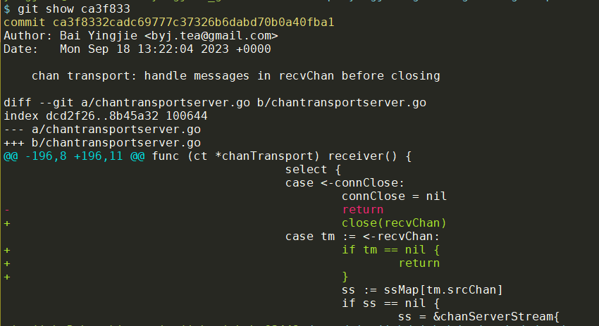
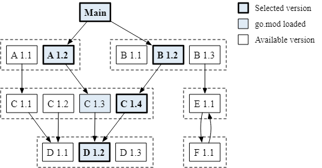

- [使能cgo的同时也生成static build](#使能cgo的同时也生成static-build)
- [setns系统调用和`runtime.LockOSThread()`](#setns系统调用和runtimelockosthread)
  - [setns](#setns)
    - [函数原型](#函数原型)
    - [七种名字空间类型](#七种名字空间类型)
    - [PID 名字空间](#pid-名字空间)
    - [权限](#权限)
  - [其他](#其他)
  - [mount名字空间的问题以及golang的解决方案](#mount名字空间的问题以及golang的解决方案)
- [select随机选择ready的case](#select随机选择ready的case)
  - [问题背景](#问题背景)
  - [server端的处理逻辑](#server端的处理逻辑)
  - [如何修改](#如何修改)
- [交叉编译指定cc](#交叉编译指定cc)
- [go mod tidy总是pull老版本](#go-mod-tidy总是pull老版本)
- [update所有依赖的版本](#update所有依赖的版本)
  - [手动更新指定package的非tag版本](#手动更新指定package的非tag版本)
  - [go mod的版本选择算法 Minimal version selection (MVS)](#go-mod的版本选择算法-minimal-version-selection-mvs)
- [fmt打印颜色](#fmt打印颜色)
- [升级go1.18遇到的问题](#升级go118遇到的问题)
  - [mips64运行时崩溃](#mips64运行时崩溃)
    - [解决](#解决)
- [如何正确静态链接](#如何正确静态链接)
  - [结论](#结论)
- [不能在for range里删除slice元素](#不能在for-range里删除slice元素)
- [什么时候用buffer为1的channel](#什么时候用buffer为1的channel)
- [go按位取反(bitwise not)](#go按位取反bitwise-not)
- [go的相等性(==)](#go的相等性)
  - [普通类型的比较](#普通类型的比较)
  - [指针的相等性](#指针的相等性)
    - [`errors.New("EOF")`**不等于**`io.EOF`](#errorsneweof不等于ioeof)
  - [channel的相等性](#channel的相等性)
  - [interface的相等性](#interface的相等性)
  - [结构体的相等性](#结构体的相等性)
  - [Array的相等性](#array的相等性)
  - [string](#string)
  - [\[\]byte用bytes.Equal比较](#byte用bytesequal比较)
  - [reflect.DeepEqual万能比较](#reflectdeepequal万能比较)
  - [cmp包](#cmp包)
- [通过unix socket发送fd](#通过unix-socket发送fd)
  - [发送](#发送)
  - [接收](#接收)
  - [发送2](#发送2)
  - [接收2](#接收2)
- [创建临时文件并mmap成结构体](#创建临时文件并mmap成结构体)
  - [memfd\_create()系统调用](#memfd_create系统调用)
  - [gvisor中的使用场景](#gvisor中的使用场景)
- [用正则表达式 遍历`/proc/self/maps`](#用正则表达式-遍历procselfmaps)
- [递归缩进打印error](#递归缩进打印error)
- [读go micro](#读go-micro)
  - [cmd](#cmd)
    - [cmd.APP()](#cmdapp)
    - [已经注册的cmd](#已经注册的cmd)
  - [cli相关的cmd](#cli相关的cmd)
    - [cli子命令](#cli子命令)
    - [client接口](#client接口)
- [pattern match](#pattern-match)
- [读fs\_linux.go](#读fs_linuxgo)
- [善用字符串库函数--strings.Join](#善用字符串库函数--stringsjoin)
- [切片的插入](#切片的插入)
- [匿名函数执行](#匿名函数执行)

# 使能cgo的同时也生成static build
```
LDFLAGS += -linkmode=external -extldflags=-static
CGO_ENABLED=1 go build -ldflags="$(LDFLAGS)"
```

要点:
* gcc要是musl based, 比如
  * 直接使用alpine linux
  * 在ubuntu上安装musl: 
```
sudo apt-get install -y --no-install-recommends musl-dev musl-tools
LDFLAGS += -linkmode=external -extldflags=-static
CC=musl-gcc CGO_ENABLED=1 go build -ldflags="$(LDFLAGS)"
```

# setns系统调用和`runtime.LockOSThread()`
## setns
### 函数原型
```c
#define _GNU_SOURCE             /* See feature_test_macros(7) */
#include <sched.h>

int setns(int fd, int nstype);
```

### 七种名字空间类型
`setns`系统调用重新绑定caller**线程**到目标名字空间. 目标名字空间由`fd`指定, 这个`fd`是目标pid下面的`/proc/[pid]/ns/`的7种名字空间之一.
```
Namespace   Constant          Isolates
Cgroup      CLONE_NEWCGROUP   Cgroup root directory
IPC         CLONE_NEWIPC      System V IPC, POSIX message queues
Network     CLONE_NEWNET      Network devices, stacks, ports, etc.
Mount       CLONE_NEWNS       Mount points
PID         CLONE_NEWPID      Process IDs
User        CLONE_NEWUSER     User and group IDs
UTS         CLONE_NEWUTS      Hostname and NIS domain name
```
`clone`, `setns`, `unshare`系统调用能处理`CLONE_NEW*` flag.
```
$ ls /proc/1770/ns -lh
total 0
lrwxrwxrwx 1 yingjieb platform 0 Apr  2 01:02 cgroup -> 'cgroup:[4026531835]'
lrwxrwxrwx 1 yingjieb platform 0 Apr  2 01:02 ipc -> 'ipc:[4026531839]'
lrwxrwxrwx 1 yingjieb platform 0 Apr  2 01:02 mnt -> 'mnt:[4026531840]'
lrwxrwxrwx 1 yingjieb platform 0 Apr  2 01:02 net -> 'net:[4026531993]'
lrwxrwxrwx 1 yingjieb platform 0 Apr  2 01:02 pid -> 'pid:[4026531836]'
lrwxrwxrwx 1 yingjieb platform 0 Apr  2 01:02 pid_for_children -> 'pid:[4026531836]'
lrwxrwxrwx 1 yingjieb platform 0 Apr  2 01:02 user -> 'user:[4026531837]'
lrwxrwxrwx 1 yingjieb platform 0 Apr  2 01:02 uts -> 'uts:[4026531838]'
```

可以看到, linux的名字空间都是和pid绑定的, 但7个名字空间是独立的. 但是, 即使该名字空间里面的所有进程都退出了, 这个名字空间还可能继续存在:
* 如果`/proc/pid/ns`下面的文件被bind mount
* 如果`/proc/pid/ns`下面的文件还在被其他进程open

名字空间的个数有限制, 比如
```
$ ls /proc/sys/user
max_cgroup_namespaces  max_ipc_namespaces  max_pid_namespaces
max_inotify_instances  max_mnt_namespaces  max_user_namespaces
max_inotify_watches    max_net_namespaces  max_uts_namespaces

$ cat /proc/sys/user/max_mnt_namespaces
289679
```

### PID 名字空间
PID名字空间有点特殊, setns不会把calling线程put到目标PID空间, 而是把calling线程的接下来的子进程放到目标PID空间.

### 权限
调用线程需要有`CAP_SYS_ADMIN`权限


## 其他
查看所有名字空间
```
lsns
```

## mount名字空间的问题以及golang的解决方案
多线程的程序可能不能`setns`到mount名字空间. 另外, 除了`CAP_SYS_ADMIN`, mount名字空间还需要`CAP_SYS_CHROOT`权限.

golang里面, 因为goroutine可以在不同线程间被调度, 而`setns`需要以线程为基础, 所以`setns`到mount名字空间会返回`invalid argument`

```c
#include <errno.h>
#include <sched.h>
#include <stdio.h>
#include <stdlib.h>
#include <string.h>
#include <fcntl.h>

main(int argc, char* argv[]) {
    int i;
    char nspath[1024];
    char *namespaces[] = { "ipc", "uts", "net", "pid", "mnt" };

    if (geteuid()) { fprintf(stderr, "%s\n", "abort: you want to run this as root"); exit(1); }

    if (argc != 2) { fprintf(stderr, "%s\n", "abort: you must provide a PID as the sole argument"); exit(2); }

    for (i=0; i<5; i++) {
        sprintf(nspath, "/proc/%s/ns/%s", argv[1], namespaces[i]);
        int fd = open(nspath, O_RDONLY);

        if (setns(fd, 0) == -1) { 
            fprintf(stderr, "setns on %s namespace failed: %s\n", namespaces[i], strerror(errno));
        } else {
            fprintf(stdout, "setns on %s namespace succeeded\n", namespaces[i]);
        }

        close(fd);
    }
}

//sudo ./checkns <PID>
//output:
setns on ipc namespace succeeded
setns on uts namespace succeeded
setns on net namespace succeeded
setns on pid namespace succeeded
setns on mnt namespace succeeded
```

对应的go代码会出现错误
```go
package main

import (
    "fmt"
    "os"
    "path/filepath"
    "syscall"
)

func main() {
    if syscall.Geteuid() != 0 {
        fmt.Println("abort: you want to run this as root")
        os.Exit(1)
    }

    if len(os.Args) != 2 {
        fmt.Println("abort: you must provide a PID as the sole argument")
        os.Exit(2)
    }

    namespaces := []string{"ipc", "uts", "net", "pid", "mnt"}

    for i := range namespaces {
        fd, _ := syscall.Open(filepath.Join("/proc", os.Args[1], "ns", namespaces[i]), syscall.O_RDONLY, 0644)
        err, _, msg := syscall.RawSyscall(308, uintptr(fd), 0, 0) // 308 == setns

        if err != 0 {
            fmt.Println("setns on", namespaces[i], "namespace failed:", msg)
        } else {
            fmt.Println("setns on", namespaces[i], "namespace succeeded")
        }

    }
}

//sudo go run main.go <PID>
//output:
setns on ipc namespace succeeded
setns on uts namespace succeeded
setns on net namespace succeeded
setns on pid namespace succeeded
setns on mnt namespace failed: invalid argument
```
[stackoverflow的讨论](https://stackoverflow.com/questions/25704661/calling-setns-from-go-returns-einval-for-mnt-namespace)

在`runc`的源代码中, 
`https://github.com/opencontainers/runc/blob/main/libcontainer/process_linux.go`  
函数`func (p *initProcess) goCreateMountSources(ctx context.Context) (mountSourceRequestFn, context.CancelFunc, error)`中似乎解决了这个问题:
```go
// goCreateMountSources spawns a goroutine which creates open_tree(2)-style
// mountfds based on the requested configs.Mount configuration. The returned
// requestFn and cancelFn are used to interact with the goroutine.
//
// The caller of the returned mountSourceRequestFn is responsible for closing
// the returned file.
func (p *initProcess) goCreateMountSources(ctx context.Context) (mountSourceRequestFn, context.CancelFunc, error) {
	type response struct {
		src *mountSource
		err error
	}

	errCh := make(chan error, 1)
	requestCh := make(chan *configs.Mount)
	responseCh := make(chan response)

	ctx, cancelFn := context.WithTimeout(ctx, 1*time.Minute)
	go func() {
		// We lock this thread because we need to setns(2) here. There is no
		// UnlockOSThread() here, to ensure that the Go runtime will kill this
		// thread once this goroutine returns (ensuring no other goroutines run
		// in this context).
		runtime.LockOSThread()

		// Detach from the shared fs of the rest of the Go process in order to
		// be able to CLONE_NEWNS.
		if err := unix.Unshare(unix.CLONE_FS); err != nil {
			err = os.NewSyscallError("unshare(CLONE_FS)", err)
			errCh <- fmt.Errorf("mount source thread: %w", err)
			return
		}

		// Attach to the container's mount namespace.
		nsFd, err := os.Open(fmt.Sprintf("/proc/%d/ns/mnt", p.pid()))
		if err != nil {
			errCh <- fmt.Errorf("mount source thread: open container mntns: %w", err)
			return
		}
		defer nsFd.Close()
		if err := unix.Setns(int(nsFd.Fd()), unix.CLONE_NEWNS); err != nil {
			err = os.NewSyscallError("setns", err)
			errCh <- fmt.Errorf("mount source thread: join container mntns: %w", err)
			return
		}

		// No errors during setup!
		close(errCh)
		logrus.Debugf("mount source thread: successfully running in container mntns")

		nsHandles := new(userns.Handles)
		defer nsHandles.Release()
	loop:
		for {
			select {
			case m, ok := <-requestCh:
				if !ok {
					break loop
				}
				src, err := mountFd(nsHandles, m)
				logrus.Debugf("mount source thread: handling request for %q: %v %v", m.Source, src, err)
				responseCh <- response{
					src: src,
					err: err,
				}
			case <-ctx.Done():
				break loop
			}
		}
		logrus.Debugf("mount source thread: closing thread: %v", ctx.Err())
		close(responseCh)
	}()

	// Check for setup errors.
	err := <-errCh
	if err != nil {
		cancelFn()
		return nil, nil, err
	}

	// TODO: Switch to context.AfterFunc when we switch to Go 1.21.
	var requestChCloseOnce sync.Once
	requestFn := func(m *configs.Mount) (*mountSource, error) {
		var err error
		select {
		case requestCh <- m:
			select {
			case resp, ok := <-responseCh:
				if ok {
					return resp.src, resp.err
				}
			case <-ctx.Done():
				err = fmt.Errorf("receive mount source context cancelled: %w", ctx.Err())
			}
		case <-ctx.Done():
			err = fmt.Errorf("send mount request cancelled: %w", ctx.Err())
		}
		requestChCloseOnce.Do(func() { close(requestCh) })
		return nil, err
	}
	return requestFn, cancelFn, nil
}
```

关键在go出去的routine里, 首先调用`runtime.LockOSThread()`
这里的注释
```
// We lock this thread because we need to setns(2) here. There is no
// UnlockOSThread() here, to ensure that the Go runtime will kill this
// thread once this goroutine returns (ensuring no other goroutines run
// in this context).
```
以及`https://github.com/opencontainers/runc/tree/main/libcontainer/nsenter`的readme:
> The nsenter package registers a special init constructor that is called before the Go runtime has a chance to boot. This provides us the ability to setns on existing namespaces and avoid the issues that the Go runtime has with multiple threads. This constructor will be called if this package is registered, imported, in your go application.
> 
> The nsenter package will import "C" and it uses cgo package. In cgo, if the import of "C" is immediately preceded by a comment, that comment, called the preamble, is used as a header when compiling the C parts of the package. So every time we import package nsenter, the C code function nsexec() would be called. And package nsenter is only imported in init.go, so every time the runc init command is invoked, that C code is run.
> 
> Because nsexec() must be run before the Go runtime in order to use the Linux kernel namespace, you must import this library into a package if you plan to use libcontainer directly. Otherwise Go will not execute the nsexec() constructor, which means that the re-exec will not cause the namespaces to be joined. You can import it like this:
> 
> `import _ "github.com/opencontainers/runc/libcontainer/nsenter"`

# select随机选择ready的case
adaptiveservice的chan transport实现里, 出现来的一个bug. 现象是丢消息. 最后调查下来和select的随机选择case有关.
## 问题背景
client和server通过adaptiveservice的channel transport通信. client主动发起建立连接, 并在结束后关闭连接.

client代码逻辑简化如下:
```go
//发现并连接server
c := NewClient().SetDiscoverTimeout(0)
conn := <-c.Discover(BuiltinPublisher, SrvMessageTracing)

//发送
tracedMsg := tracedMessageRecord{...}
conn.Send(&tracedMsg)
conn.Close()
```

bug现象是client发送的`tracedMsg`并没有被server处理.

## server端的处理逻辑
server端遇到client发过来的握手请求, 会新建goroutine处理:
```go
go func() {
    for {
        select {
            //监测是否client主动关闭了通道.
            //connClose由client持有
            case <-connClose:
                //关闭连接
                return
            //recvChan是server端给这个client新建的接收队列
            case tm := <-recvChan:
                //处理消息
        }
    }
}()
```

问题出在`case <-connClose`后的那个`return`上.  
client几乎是发了消息马上关闭连接, 那么server端的`select`背后的`epoll`很可能会看到两个case几乎同时ready.
根据go的[spec](https://go.dev/ref/spec#Select_statements)
> If one or more of the communications can proceed, a single one that can proceed is chosen via a uniform pseudo-random selection. Otherwise, if there is a default case, that case is chosen. If there is no default case, the "select" statement blocks until at least one of the communications can proceed.

case的选择是随机的. 那么如果选择了`case <-connClose`, 走return流程, 那么`recvChan`里面还没来得及处理的消息都会丢失.

## 如何修改


在这个修改中, `case <-connClose`只是关闭`recvChan`; 而`recvChan`里面读空才return.

# 交叉编译指定cc
```
CGO_ENABLED=1 GOARCH=arm64 CC=aarch64-alpine-linux-musl-gcc go build -buildmode=plugin -ldflags="-extld=aarch64-alpine-linux-musl-ld"
```

# go mod tidy总是pull老版本
原因是go工具链使用了proxy, 有cache.  
用`GOPRIVATE`指定`github`不走proxy可以解决:
```
GOPRIVATE=github.com go get github.com/godevsig/grepo@master
```

# update所有依赖的版本
```shell
GOPRIVATE=github.com go get -u ./...
GOPRIVATE=github.com go mod tidy
```

## 手动更新指定package的非tag版本
用`go get -u`只能更新package到tag版本, 如果需要更新的版本, 需要手动修改`go.mod`文件, 比如修改指定package为master分支:
```shell
github.com/godevsig/glib master
```
再用`go mod tidy`就可以更新到最新版本. 比如这里运行后, `go.mod`被自动修改为:
```shell
github.com/godevsig/glib v0.1.2-0.20230826061212-649e5e40e117
```

## go mod的版本选择算法 Minimal version selection (MVS)
基本假设就是package满足向前兼容性原则, 新版本总是比老版本好.

所以MVS虽然名字里有minimal字样, 但实际上它倾向于选择新版本, 比如下图:  

> MVS produces the build list as output, the list of module versions used for a build.
>
> MVS starts at the main modules (special vertices in the graph that have no version) and traverses the graph, tracking the highest required version of each module. At the end of the traversal, the highest required versions comprise the build list: they are the minimum versions that satisfy all requirements.
>
> MVS visits and loads the go.mod file for each of the module versions highlighted in blue. At the end of the graph traversal, MVS returns a build list containing the bolded versions: A 1.2, B 1.2, C 1.4, and D 1.2. Note that higher versions of B and D are available but MVS does not select them, since nothing requires them.



**用`go list -m all`可以查看这个build list.**
> The build list may be inspected with the command go list -m all. Unlike other dependency management systems, the build list is not saved in a “lock” file. MVS is deterministic, and the build list doesn’t change when new versions of dependencies are released, so MVS is used to compute it at the beginning of every module-aware command.

详见:
* https://go.dev/ref/mod#minimal-version-selection
* https://research.swtch.com/vgo-mvs

# fmt打印颜色
```go
func main() {
	// Print colored text
	fmt.Println("\x1b[31mRed Text\x1b[0m")
	fmt.Println("\x1b[32mGreen Text\x1b[0m")
	fmt.Println("\x1b[33mYellow Text\x1b[0m")
	fmt.Println("\x1b[34mBlue Text\x1b[0m")
	fmt.Println("\x1b[35mMagenta Text\x1b[0m")
	fmt.Println("\x1b[36mCyan Text\x1b[0m")
}
```

# 升级go1.18遇到的问题
## mips64运行时崩溃
运行环境: octeon3 CPU(mips64)  
我把gshell的toolchain从1.16升级到了1.18, 小的程序运行没问题.  
但gshell daemon运行出错:
```shell
~/gshell # bin_latest/gshell -loglevel info daemon -registry 10.182.105.179:11985 -bcast 9923
trap:5111, a123456=[0,0,0,0,0,0]
results: got {r1=0,r2=5111,errno=0}, want {r1=0,r2=0,errno=0
fatal error: AllThreadsSyscall6 results differ between threads; runtime corrupted
trap:5111, a123456=[0,0,0,0,0,0]
results: got {r1=0,r2=5111,errno=0}, want {r1=0,r2=0,errno=0
fatal error: AllThreadsSyscall6 results differ between threads; runtime corrupted


goroutine 0 [idle]:
runtime: unexpected return pc for runtime.sigtramp called from 0xffeccc3580
stack: frame={sp:0xc00004fc88, fp:0xc00004fcd0} stack=[0xc000048000,0xc000050000)
//省略栈打印
runtime.throw({0x649b1f, 0x44})
        /usr/local/go/src/runtime/panic.go:992 +0x6c
runtime.runPerThreadSyscall()
        /usr/local/go/src/runtime/os_linux.go:874 +0x410
runtime.sighandler(0x21, 0xc00004fce8, 0xc00004fd68, 0xc0000029c0)
        /usr/local/go/src/runtime/signal_unix.go:631 +0x770
runtime.sigtrampgo(0x21, 0xc00004fce8, 0xc00004fd68)
        /usr/local/go/src/runtime/signal_unix.go:477 +0x228
runtime: unexpected return pc for runtime.sigtramp called from 0xffeccc3580
stack: frame={sp:0xc00004fc88, fp:0xc00004fcd0} stack=[0xc000048000,0xc000050000)
//省略栈打印
runtime.sigtramp()
        /usr/local/go/src/runtime/sys_linux_mips64x.s:435 +0x54

goroutine 1 [running]:
        goroutine running on other thread; stack unavailable
trap:5111, a123456=[0,0,0,0,0,0]

goroutine 0 [idle]:
runtime: unexpected return pc for runtime.sigtramp called from 0xffeccc3580
stack: frame={sp:0xc00003fc88, fp:0xc00003fcd0} stack=[0xc000038000,0xc000040000)

runtime.throw({0x649b1f, 0x44})
        /usr/local/go/src/runtime/panic.go:992 +0x6c
runtime.runPerThreadSyscall()
        /usr/local/go/src/runtime/os_linux.go:874 +0x410
runtime.sighandler(0x21, 0xc00003fce8, 0xc00003fd68, 0xc0000024e0)
        /usr/local/go/src/runtime/signal_unix.go:631 +0x770
runtime.sigtrampgo(0x21, 0xc00003fce8, 0xc00003fd68)
        /usr/local/go/src/runtime/signal_unix.go:477 +0x228
runtime: unexpected return pc for runtime.sigtramp called from 0xffeccc3580
stack: frame={sp:0xc00003fc88, fp:0xc00003fcd0} stack=[0xc000038000,0xc000040000)
runtime.sigtramp()
        /usr/local/go/src/runtime/sys_linux_mips64x.s:435 +0x54

```
这个error message意思是说r2寄存器应该是0, 但实际却是5111

### 解决

根据https://github.com/golang/go/issues/56426, 这是go1.18引入的bug, 1.20+才fix. 看来要backporting [这个patch](https://github.com/golang/go/commit/2c7c98c3ad719aa9d6d2594827a6894ff9950042)了.

> All mips variant perform syscalls similarly. R2 (v0) holds r1 and R3 (v1) holds r2 of a syscall. The latter is only used by 2-ret syscalls. A 1-ret syscall would not touch R3 but keeps it as is, making r2 be a random value. Always reset it to 0 before SYSCALL to fix the issue.

# 如何正确静态链接
参考: 
* https://mt165.co.uk/blog/static-link-go/
* https://www.arp242.net/static-go.html

## 结论
|                      | Dynamically-linked binary | Statically-linked binary                                         |
| -------------------- | ------------------------- | ---------------------------------------------------------------- |
| **Libc functions**   | `go build`                | `go build -ldflags "-linkmode 'external' -extldflags '-static'"` |
| **Golang functions** | n/a                       | `CGO_ENABLED=0 go build`                                         |

I.e.

* To get a static binary, under most circumstances: `CGO_ENABLED=0 go build`
* To use the libc functions for `net` and `os/user`, and still get a static binary (for containers): `go build -ldflags "-linkmode 'external' -extldflags '-static'"`


# 不能在for range里删除slice元素
我问chatgpt如何在for range里删除slice元素, chatgpt给出的代码:
```go
package main

import "fmt"

func main() {
	// Create a slice of integers
	nums := []int{1, 2, 3, 4, 5}

	// Iterate over the slice using range
	for i, num := range nums { // for range在一开始就定好了要interate多少次
		fmt.Println(i, num, len(nums)) // 而且不受index越界限制
		//fmt.Println(i, num, nums[i], len(nums)) // 我加的这行会panic
		// Check if the element should be deleted
		if num == 3 || num == 4 {
			// Delete the element from the slice using append
			nums = append(nums[:i], nums[i+1:]...)
		}
	}

	// Print the updated slice
	fmt.Println(nums)
}

//结果
0 1 5
1 2 5
2 3 5
3 5 4
4 5 4 //注意看这行, 实际上新的nums已经没有index 4了, for range里面的i和num还是能在这一轮取到值
[1 2 4 5]
```

如果告诉chatgpt答案是错的, 它会修正代码:
```
ME: the output is [1 2 4 5], which is not correct

CHATGPT: You are correct, I apologize for the mistake in my previous answer. When you delete elements from a slice while iterating over it with range, you need to adjust the index variable to account for the removed elements.
```
再给出的答案是对的:
```go
package main

import "fmt"

func main() {
	// Create a slice of integers
	nums := []int{1, 2, 3, 4, 5}

	// Iterate over the slice using range
	for i := 0; i < len(nums); i++ {
		num := nums[i]
		// Check if the element should be deleted
		if num == 3 || num == 4 {
			// Delete the element from the slice
			nums = append(nums[:i], nums[i+1:]...)
			// Adjust the index variable to account for the removed element
			i--
		}
	}

	// Print the updated slice
	fmt.Println(nums)
}
```

# 什么时候用buffer为1的channel
比如下面的代码:
```go
package main

import (
	"errors"
	"fmt"
	"time"
)

func main() {
	errorChan := make(chan error, 1)
	fmt.Println("start")
	time.AfterFunc(time.Second*5, func() { errorChan <- nil; fmt.Println("time out") })

	go func() {
		time.Sleep(time.Second * 3) // 实际场景可以是cmd.Wait()
		errorChan <- errors.New("new error")
		fmt.Println("error happened")
	}()

	fmt.Println(<-errorChan)

	time.Sleep(time.Second * 10)
	fmt.Println("done")
}
```


# go按位取反(bitwise not)
go没有专用的取反操作符, 但用异或可以取反:
```go
func main() {
    var bitwisenot byte = 0x0F

    // printing the number in 8-Bit
    fmt.Printf("%08b\n", bitwisenot) // 00001111

    fmt.Printf("%08b\n", ^bitwisenot) // 11110000
    fmt.Printf("%08b\n", 1^bitwisenot) // 00001110 和上面结果不一样

    fmt.Printf("%08b\n", ^0x0F) // -0010000 默认数字都是int
    fmt.Printf("%08b\n", ^(int)(0x0F)) // -0010000
    fmt.Printf("%08b\n", ^(uint)(0x0F)) // 1111111111111111111111111111111111111111111111111111111111110000 不带符号位
}
```
结果:
```
00001111
11110000
00001110
-0010000
-0010000
1111111111111111111111111111111111111111111111111111111111110000
```

# go的相等性(==)
首先, map和slice不能用`==`比较
function也不能比较.
```go
f := func(int) int { return 1 }
g := func(int) int { return 2 }
f == g
//这样比较会编译错误
```
但function可以跟nil比较.

## 普通类型的比较
boo, int, float, complex的比较就是普通比较. 但需要注意的是float的NaN不等于NaN
```go
nan := math.NaN()
pos_inf := math.Inf(1)
neg_inf := math.Inf(-1)
fmt.Println(nan == nan)         // false
fmt.Println(pos_inf == pos_inf) // true
fmt.Println(neg_inf == neg_inf) // true
fmt.Println(pos_inf == neg_inf) // false
```

## 指针的相等性
要么两个指针都是nil, 要么两个指针指向同样的地址:
```go
var p1, p2 *string
name := "foo"
fmt.Println(p1 == p2) // true
p1 = &name
p2 = &name
fmt.Println(p1)       // 0x40c148
fmt.Println(p2)       // 0x40c148
fmt.Println(&p1)      // 0x40c138
fmt.Println(&p2)      // 0x40c140
fmt.Println(*p1)      // foo
fmt.Println(*p2)      // foo
fmt.Println(p1 == p2) // true
```
需要注意的是, 两个不同的empty struct(即空的struct实例)的地址可能相等
> A struct or array type has size zero if it contains no fields (or elements, respectively) that have a size greater than zero. Two distinct zero-size variables may have the same address in memory.

```go
type S struct{}
func main() {
    var p1, p2 *S
    s1 := S{}
    s2 := S{}
    p1 = &s1
    p2 = &s2
    fmt.Printf("%p\n", p1) // 0x1e52bc
    fmt.Printf("%p\n", p2) // 0x1e52bc
    fmt.Println(p1)        // &{}
    fmt.Println(p2)        // &{}
    fmt.Println(&p1)       // 0x40c138
    fmt.Println(&p2)       // 0x40c140
    fmt.Println(*p1)       // {}
    fmt.Println(*p2)       // {}
    fmt.Println(p1 == p2)  // true 本来s1和s2不是一个东西, 当都是空, 他们的地址相同, 所以相等.
}
```
如果结构体非空, `S struct {f int}`, `p1`和`p2`就不相等了.

### `errors.New("EOF")`**不等于**`io.EOF`
`io.EOF`在io包里定义为
```go
var EOF = errors.New("EOF")
```
New出来的对象是个指针
```go
package errors

// New returns an error that formats as the given text.
// Each call to New returns a distinct error value even if the text is identical.
func New(text string) error {
	return &errorString{text}
}

// errorString is a trivial implementation of error.
type errorString struct {
	s string
}

func (e *errorString) Error() string {
	return e.s
}
```

根据指针的相等性, 其指向的地址相等才算相等.  
下面的代码显示虽然myErr和io.EOF都是同样的内容, 但二者**并不相等**.
```
package main

import (
	"errors"
	"fmt"
	"io"
)

func main() {
	myErr := errors.New("EOF")
	fmt.Printf("%#v\n", myErr)
	fmt.Printf("%#v\n", io.EOF)
	if myErr == io.EOF {
		fmt.Println("equal")
	} else {
		fmt.Println("not equal")
	}
}

//输出
&errors.errorString{s:"EOF"}
&errors.errorString{s:"EOF"}
not equal
```

## channel的相等性
满足下面条件之一
* 两个chnnel都是nil
* 两个都是从同一个make函数生成的

```go
func f(ch1 chan int, ch2 *chan int) {
    fmt.Println(ch1 == *ch2) // true
}
func main() {
    var ch1, ch2 chan int
    fmt.Println(ch1 == ch2) // true
    ch1 = make(chan int)
    ch2 = make(chan int)
    fmt.Println(ch1 == ch2) // false
    ch2 = ch1
    fmt.Printf("%p\n", &ch1) // 0x40c138
    fmt.Printf("%p\n", &ch2) // 0x40c140
    fmt.Println(ch1 == ch2)  // true
    f(ch1, &ch1)
}
```

## interface的相等性
* 两个interface都是nil(注意动态类型也要是nil)
```go
type I interface{ m() }
type T []byte
func (t T) m() {}
func main() {
    var t T
    fmt.Println(t == nil) // true
    var i I = t
    fmt.Println(i == nil)                   // false
    fmt.Println(reflect.TypeOf(i))          // main.T
    fmt.Println(reflect.ValueOf(i).IsNil()) // true
}
```
* 动态类型相同, 并且动态值相等
```go
type A int
type B = A
type C int
type I interface{ m() }
func (a A) m() {}
func (c C) m() {}
func main() {
    var a I = A(1)
    var b I = B(1)
    var c I = C(1)
    fmt.Println(a == b) // true 这里A和B是强别名(=号别名), 类型是一样的.
    fmt.Println(b == c) // false 类型不同不相等
    fmt.Println(a == c) // false 类型不同不相等
}
```

类型I的interface变量i可以和普通类型X的实例x比较, 只要
* 类型X实现了接口I
* 类型X可以比较

所以i和x比较, 如果i的动态类型是X, i的动态值又等于x, 那么i和x相等
```go
type I interface{ m() }
type X int
func (x X) m() {}
type Y int
func (y Y) m() {}
type Z int
func main() {
    var i I = X(1)
    fmt.Println(i == X(1)) // true
    fmt.Println(i == Y(1)) // false
    // fmt.Println(i == Z(1)) // mismatched types I and C
    // fmt.Println(i == 1) // mismatched types I and int
}
```
如果动态类型相等, 但这个类型不能比较, 则会产生panic:
```go
type A []byte
func main() {
    var i interface{} = A{}
    var j interface{} = A{}
    fmt.Println(i == j)
}

panic: runtime error: comparing uncomparable type main.A
```

如果动态类型不一样, 那就直接不等:
```go
type A []byte
type B []byte
func main() {
    // A{} == A{} // slice can only be compared to nil
    var i interface{} = A{}
    var j interface{} = B{}
    fmt.Println(i == j) // false
}
```

## 结构体的相等性
首先, 结构体可以直接用`==`操作符比较.
如果里面的非`_`域都相等, 则两个结构体相等. 注意, 结构体里面的大写, 小写域都要相等.
```go
type A struct {
    _ float64
    f1 int
    F2 string
}
type B struct {
    _ float64
    f1 int
    F2 string
}
func main() {
    fmt.Println(A{1.1, 2, "x"} == A{0.1, 2, "x"}) // true
    // fmt.Println(A{} == B{}) // mismatched types A and B 
}
```

当判断`x==y`时, 只有x可以赋值给y或者y可以赋值给x才能用`==`操做符.
所以下面的判断是不行的, 编译时就会报错.
```go
A{} == B{}
```

## Array的相等性
注意这里说的是Array, 不是slice.
Array里面的每个元素都相等的话, 两个array相等.
```go
type T struct {
    name string
    age int
    _ float64
}
func main() {
   x := [...]float64{1.1, 2, 3.14}
   fmt.Println(x == [...]float64{1.1, 2, 3.14}) // true
   y := [1]T{{"foo", 1, 0}}
   fmt.Println(y == [1]T{{"foo", 1, 1}}) // true
}
```

## string
string的比较按照`[]byte`按字节比较.
```go
fmt.Println(strings.ToUpper("ł") == "Ł")     // true
fmt.Println("foo" == "foo")                  // true
fmt.Println("foo" == "FOO")                  // false
fmt.Println("Michał" == "Michal")            // false
fmt.Println("żondło" == "żondło")            // true
fmt.Println("żondło" != "żondło")            // false
fmt.Println(strings.EqualFold("ąĆź", "ĄćŹ")) // true
```

## []byte用bytes.Equal比较
切片不能直接比较. 但`bytes.Equal`可以比较两个`[]byte`
```go
s1 := []byte{'f', 'o', 'o'}
s2 := []byte{'f', 'o', 'o'}
fmt.Println(bytes.Equal(s1, s2)) // true
s2 = []byte{'b', 'a', 'r'}
fmt.Println(bytes.Equal(s1, s2)) // false
s2 = []byte{'f', 'O', 'O'}
fmt.Println(bytes.EqualFold(s1, s2)) // true
s1 = []byte("źdźbło")
s2 = []byte("źdŹbŁO")
fmt.Println(bytes.EqualFold(s1, s2)) // true
s1 = []byte{}
s2 = nil
fmt.Println(bytes.Equal(s1, s2)) // true
```

## reflect.DeepEqual万能比较
`func DeepEqual(x, y interface{}) bool`可以比较任意两个值.
比如map
```go
m1 := map[string]int{"foo": 1, "bar": 2}
m2 := map[string]int{"foo": 1, "bar": 2}
// fmt.Println(m1 == m2) // map can only be compared to nil
fmt.Println(reflect.DeepEqual(m1, m2)) // true
m2 = map[string]int{"foo": 1, "bar": 3}
fmt.Println(reflect.DeepEqual(m1, m2)) // false
m3 := map[string]interface{}{"foo": [2]int{1,2}}
m4 := map[string]interface{}{"foo": [2]int{1,2}}
fmt.Println(reflect.DeepEqual(m3, m4)) // true
var m5 map[float64]string
fmt.Println(reflect.DeepEqual(m5, nil)) // false
fmt.Println(m5 == nil) // true
```
比如slice
```go
s := []string{"foo"}
fmt.Println(reflect.DeepEqual(s, []string{"foo"})) // true
fmt.Println(reflect.DeepEqual(s, []string{"bar"})) // false
s = nil
fmt.Println(reflect.DeepEqual(s, []string{})) // false
s = []string{}
fmt.Println(reflect.DeepEqual(s, []string{})) // true
```
比如结构体
```go
type T struct {
    name string
    Age  int
}
func main() {
    t := T{"foo", 10}
    fmt.Println(reflect.DeepEqual(t, T{"bar", 20})) // false
    fmt.Println(reflect.DeepEqual(t, T{"bar", 10})) // false
    fmt.Println(reflect.DeepEqual(t, T{"foo", 10})) // true
}
```

## cmp包
google提供了cmp包, 可以打印两个值的差异
```go
import (
    "fmt"
    "github.com/google/go-cmp/cmp"
)
type T struct {
    Name string
    Age  int
    City string
}
func main() {
    x := T{"Michał", 99, "London"}
    y := T{"Adam", 88, "London"}
    if diff := cmp.Diff(x, y); diff != "" {
        fmt.Println(diff)
    }
}
```
输出
```diff
  main.T{
-       Name: "Michał",
+       Name: "Adam",
-       Age:  99,
+       Age:  88,
        City: "London",
  }
```

# 通过unix socket发送fd
gvisor的`pkg/unet/unet.go`里面提供了listen, accept等方法
unet是给server端用的. 比如read和write方法, 先尝试用阻塞式的`unix.RawSyscall(unix.SYS_RECVMSG, ...)`, 不行再用对fd的poll`unix.Syscall6(unix.SYS_PPOLL, ...)`

还提供了通过unix socket发送/接收fd的方法:
```go
// PackFDs packs the given list of FDs in the control message.
//
// This must be used prior to WriteVec.
func (c *ControlMessage) PackFDs(fds ...int) {
    *c = ControlMessage(unix.UnixRights(fds...))
}

// ExtractFDs returns the list of FDs in the control message.
//
// Either this or CloseFDs should be used after EnableFDs.
func (c *ControlMessage) ExtractFDs() ([]int, error) {
    msgs, err := unix.ParseSocketControlMessage(*c)
    if err != nil {
        return nil, err
    }
    var fds []int
    for _, msg := range msgs {
        thisFds, err := unix.ParseUnixRights(&msg)
        if err != nil {
            // Different control message.
            return nil, err
        }
        for _, fd := range thisFds {
            if fd >= 0 {
                fds = append(fds, fd)
            }
        }
    }
    return fds, nil
}
```

被extract出来的fd可以用比如下面的函数来生成一个File对象.
```go
//比如调用
os.NewFile(uintptr(fd), "urpc")

// NewFile returns a new File with the given file descriptor and
// name. The returned value will be nil if fd is not a valid file
// descriptor. On Unix systems, if the file descriptor is in
// non-blocking mode, NewFile will attempt to return a pollable File
// (one for which the SetDeadline methods work).
//
// After passing it to NewFile, fd may become invalid under the same
// conditions described in the comments of the Fd method, and the same
// constraints apply.
func NewFile(fd uintptr, name string) *File
```

## 发送
```go
//@pkg/lisafs/sock.go
// writeTo writes the passed iovec to the UDS and donates any passed FDs.
func writeTo(sock *unet.Socket, iovec [][]byte, dataLen int, fds []int) error {
    w := sock.Writer(true)
    //这里的fds是可选的, 会做为control msg来发送
    if len(fds) > 0 {
        w.PackFDs(fds...)
    }
    for n := 0; n < dataLen; {
        cur, err := w.WriteVec(iovec)
        ...
    }
}
```

## 接收
```go
//@pkg/lisafs/sock.go
// readFrom fills the passed buffer with data from the socket. It also returns
// any donated FDs.
func readFrom(sock *unet.Socket, buf []byte, wantFDs uint8) ([]int, error) {
    r := sock.Reader(true)
    r.EnableFDs(int(wantFDs))
    n := len(buf)
    for got := 0; got < n; {
        cur, err := r.ReadVec([][]byte{buf[got:]})
        ...
    }
}
```

## 发送2
```go
//@pkg/urpc/urpc.go
// marshal sends the given FD and json struct.
func marshal(s *unet.Socket, v interface{}, fs []*os.File) error {
    // Marshal to a buffer.
    data, err := json.Marshal(v)
    if err != nil {
        log.Warningf("urpc: error marshalling %s: %s", fmt.Sprintf("%v", v), err.Error())
        return err
    }

    // Write to the socket.
    w := s.Writer(true)
    if fs != nil {
        var fds []int
        for _, f := range fs {
            fds = append(fds, int(f.Fd()))
        }
        w.PackFDs(fds...)
    }
    ...
}
```
## 接收2
```go
//@pkg/urpc/urpc.go
// unmarhsal receives an FD (optional) and unmarshals the given struct.
func unmarshal(s *unet.Socket, v interface{}) ([]*os.File, error) {
    // Receive a single byte.
    r := s.Reader(true)
    r.EnableFDs(maxFiles)
    firstByte := make([]byte, 1)

    // Extract any FDs that may be there.
    if _, err := r.ReadVec([][]byte{firstByte}); err != nil {
        return nil, err
    }
    fds, err := r.ExtractFDs()
    ...
}
```

# 创建临时文件并mmap成结构体
## memfd_create()系统调用
```c
       #include <sys/memfd.h>

       int memfd_create(const char *name, unsigned int flags);
```
用tmpfs创建一个临时文件, 这个文件和通常文件系统没关系, 但可以支持所有文件操做.
可以用这个文件来共享内存:
* 进程A调用memfd_create(), 返回fd
* 进程B去打开`/proc/<pid>/fd/<fd>`(pid是进程A的pid, fd是A调用memfd_create()返回的fd号.), 打开后可以mmap, 就看到进程A一样的内容了.

## gvisor中的使用场景
```go
//RTMemoryStats是要被mmap的结构体
// RTMemoryStatsSize is the size of the RTMemoryStats struct.
var RTMemoryStatsSize = unsafe.Sizeof(RTMemoryStats{})

// RTMemoryStatsPointer casts addr to a RTMemoryStats pointer.
func RTMemoryStatsPointer(addr uintptr) *RTMemoryStats {
    return (*RTMemoryStats)(unsafe.Pointer(addr))
}


const name = "memory-usage"
fd, err := memutil.CreateMemFD(name, 0)
    p, err := unix.BytePtrFromString(name)
    fd, _, e := unix.Syscall(unix.SYS_MEMFD_CREATE, uintptr(unsafe.Pointer(p)), uintptr(flags), 0)
file := os.NewFile(uintptr(fd), name)
//设置文件大小为结构体RTMemoryStatsSize的大小
file.Truncate(int64(RTMemoryStatsSize))

//mmap这个文件
mmap, err := memutil.MapFile(0, RTMemoryStatsSize, unix.PROT_READ|unix.PROT_WRITE, unix.MAP_SHARED, file.Fd(), 0)

//现在全局变量MemoryAccounting.RTMemoryStats就指向了这个文件.
//直接用那个结构体不香吗?
MemoryAccounting = &MemoryLocked{
    File:          file,
    RTMemoryStats: RTMemoryStatsPointer(mmap),
}
```

# 用正则表达式 遍历`/proc/self/maps`
比如一个程序想解析当前进程的进程空间:
```shell
$ cat /proc/self/maps
55cb9cb6b000-55cb9cb73000 r-xp 00000000 fc:02 396                        /bin/cat
55cb9cd72000-55cb9cd73000 r--p 00007000 fc:02 396                        /bin/cat
55cb9cd73000-55cb9cd74000 rw-p 00008000 fc:02 396                        /bin/cat
55cb9e7a2000-55cb9e7c3000 rw-p 00000000 00:00 0                          [heap]
7f3367281000-7f336754d000 r--p 00000000 fc:02 7228                       /usr/lib/locale/locale-archive
7f336754d000-7f3367734000 r-xp 00000000 fc:02 44721                      /lib/x86_64-linux-gnu/libc-2.27.so
7f3367734000-7f3367934000 ---p 001e7000 fc:02 44721                      /lib/x86_64-linux-gnu/libc-2.27.so
7f3367934000-7f3367938000 r--p 001e7000 fc:02 44721                      /lib/x86_64-linux-gnu/libc-2.27.so
7f3367938000-7f336793a000 rw-p 001eb000 fc:02 44721                      /lib/x86_64-linux-gnu/libc-2.27.so
7f336793a000-7f336793e000 rw-p 00000000 00:00 0
7f336793e000-7f3367967000 r-xp 00000000 fc:02 44717                      /lib/x86_64-linux-gnu/ld-2.27.so
7f3367b33000-7f3367b57000 rw-p 00000000 00:00 0
7f3367b67000-7f3367b68000 r--p 00029000 fc:02 44717                      /lib/x86_64-linux-gnu/ld-2.27.so
7f3367b68000-7f3367b69000 rw-p 0002a000 fc:02 44717                      /lib/x86_64-linux-gnu/ld-2.27.so
7f3367b69000-7f3367b6a000 rw-p 00000000 00:00 0
7fff4ad74000-7fff4ad95000 rw-p 00000000 00:00 0                          [stack]
7fff4adda000-7fff4addd000 r--p 00000000 00:00 0                          [vvar]
7fff4addd000-7fff4addf000 r-xp 00000000 00:00 0                          [vdso]
ffffffffff600000-ffffffffff601000 r-xp 00000000 00:00 0                  [vsyscall]
```

可以用regex
```go
// mapsLine matches a single line from /proc/PID/maps.
var mapsLine = regexp.MustCompile("([0-9a-f]+)-([0-9a-f]+) ([r-][w-][x-][sp]) ([0-9a-f]+) [0-9a-f]{2,3}:[0-9a-f]{2,} [0-9]+\\s+(.*)")

func parseMaps() {
    f, err := os.Open("/proc/self/maps")
    r := bufio.NewReader(f)
    for {
        b, err := r.ReadBytes('\n')
        m := mapsLine.FindSubmatch(b)
        start, err := strconv.ParseUint(string(m[1]), 16, 64)
        end, err := strconv.ParseUint(string(m[2]), 16, 64)
        read := m[3][0] == 'r'
        write := m[3][1] == 'w'
        execute := m[3][2] == 'x'
        shared := m[3][3] == 's'
        offset, err := strconv.ParseUint(string(m[4]), 16, 64)
    }
}
```

# 递归缩进打印error
```go
type vmError struct {
    self     error
    children []error
}

func (vme vmError) Error() string {
    var b strings.Builder
    fmt.Fprintf(&b, "----\n")
    if vme.self != nil {
        fmt.Fprintf(&b, "%v\n", vme.self)
    }
    for _, err := range vme.children {
        for _, s := range strings.Split(err.Error(), "\n") {
            if s != "\tat -" {
                fmt.Fprintf(&b, "\t%s\n", s)
            }
        }
    }
    return b.String()
}
```

# 读go micro
## cmd
micro的入口命令, 只调用了一个函数
这里import中的的v2选择了v2的tag.
```go
package main

import (
    "github.com/micro/micro/v2/cmd"
)

func main() {
    cmd.Init()
}
```
这里的Init原型很特别:
`cmd/cmd.go`中, 
```go
// Init initialised the command line
func Init(options ...micro.Option) {
    Setup(cmd.App(), options...)

    cmd.Init(
        cmd.Name(name),
        cmd.Description(description),
        cmd.Version(buildVersion()),
    )
}
```
这里面的`Option`是`type Option func(*Options)`, 一个函数签名, 入参是`*Options`
`Options`是个巨大的结构体, 包含了所有的micro的概念.
```go
type Options struct {
    Auth      auth.Auth
    Broker    broker.Broker
    Cmd       cmd.Cmd
    Config    config.Config
    Client    client.Client
    Server    server.Server
    Store     store.Store
    Registry  registry.Registry
    Runtime   runtime.Runtime
    Transport transport.Transport
    Profile   profile.Profile

    // Before and After funcs
    BeforeStart []func() error
    BeforeStop  []func() error
    AfterStart  []func() error
    AfterStop   []func() error

    // Other options for implementations of the interface
    // can be stored in a context
    Context context.Context

    Signal bool
}
```
  

### cmd.APP()
```go
func App() *cli.App {
    //这里的DefaultCmd是个interface, 由newCmd实例化
    //即var DefaultCmd = newCmd()
    return DefaultCmd.App()
}

type cmd struct {
    opts Options
    app  *cli.App
}

//newCmd返回的是Cmd这个interface
func newCmd(opts ...Option) Cmd {
    //实际的cmd是上面的结构体
    cmd := new(cmd)
    cmd.opts = options
    cmd.app = cli.NewApp()
    //返回cmd实例, 但从外面看起来是Cmd interface
    return cmd
}

//综上, DefaultCmd.App()实际上就是
func (c *cmd) App() *cli.App {
    return c.app
}
//那么c.app实际上就是cli.NewApp()的实例化结果.
```
上面的`cli.NewApp()`在[`github.com/micro/cli/v2`](https://github.com/asim/cli), 它实际上是`urfave/cli`的fork.

### 已经注册的cmd
`cmd/cmd.go`
```go
    app.Commands = append(app.Commands, new.Commands()...)
    app.Commands = append(app.Commands, runtime.Commands(options...)...)
    app.Commands = append(app.Commands, store.Commands(options...)...)
    app.Commands = append(app.Commands, config.Commands(options...)...)
    app.Commands = append(app.Commands, api.Commands(options...)...)
    app.Commands = append(app.Commands, auth.Commands()...)
    app.Commands = append(app.Commands, bot.Commands()...)
    app.Commands = append(app.Commands, cli.Commands()...)
    app.Commands = append(app.Commands, broker.Commands(options...)...)
    app.Commands = append(app.Commands, health.Commands(options...)...)
    app.Commands = append(app.Commands, proxy.Commands(options...)...)
    app.Commands = append(app.Commands, router.Commands(options...)...)
    app.Commands = append(app.Commands, tunnel.Commands(options...)...)
    app.Commands = append(app.Commands, network.Commands(options...)...)
    app.Commands = append(app.Commands, registry.Commands(options...)...)
    app.Commands = append(app.Commands, debug.Commands(options...)...)
    app.Commands = append(app.Commands, server.Commands(options...)...)
    app.Commands = append(app.Commands, service.Commands(options...)...)
    app.Commands = append(app.Commands, build.Commands()...)
    app.Commands = append(app.Commands, web.Commands(options...)...)
```

## cli相关的cmd
cli除了注册了自己的cmd, 还注册了call stream publish等命令.
而且`cli.Commands()中`, cli命令本身和所有的子命令都是同级的. 只是cli被安排在了第一个
```go
func Commands() []*cli.Command {
    commands := []*cli.Command{
        {
            Name:   "cli",
            Usage:  "Run the interactive CLI",
            Action: Run,
        },
        {
            Name:   "call",
            Usage:  "Call a service e.g micro call greeter Say.Hello '{\"name\": \"John\"}",
            //注意这里的Print是个闭包函数, 返回callService的包装. 类似装饰器
            Action: Print(callService),
            Flags: []cli.Flag{
                &cli.StringFlag{
                    Name:    "address",
                    Usage:   "Set the address of the service instance to call",
                    EnvVars: []string{"MICRO_ADDRESS"},
                },
                &cli.StringFlag{
                    Name:    "output, o",
                    Usage:   "Set the output format; json (default), raw",
                    EnvVars: []string{"MICRO_OUTPUT"},
                },
                &cli.StringSliceFlag{
                    Name:    "metadata",
                    Usage:   "A list of key-value pairs to be forwarded as metadata",
                    EnvVars: []string{"MICRO_METADATA"},
                },
            },
        },
        ...
    }
}
```

cli命令对应的Action是Run.
这个Run是个典型的Read-Eval-Print-Loop, 基本上是
```go
for {
    //先readline()
    args, err := r.Readline()
    //准备参数
    args = strings.TrimSpace(args)
    parts := strings.Split(args, " ")
    //找到cmd
    cmd, ok := commands[name]
    //执行cmd
    rsp, err := cmd.exec(c, parts[1:])
    println(string(rsp))
}
```

micro的交互式cli很简单, 就是在顶层有个循环来readline, 执行cmd.
没有其他功能.

### cli子命令
这些子命令, 比如call, publish, 实际调用的是`internal/command/cli/command.go`中的
```go
func CallService(c *cli.Context, args []string) ([]byte, error) {
    参数和返回值都通过json格式编码
    d := json.NewDecoder(strings.NewReader(req))
    ctx := callContext(c)
    creq := (*cmd.DefaultOptions().Client).NewRequest(service, endpoint, request, client.WithContentType("application/json"))
    
    //实际调用的是client的call接口, 这是个同步调用, 发req, 等rsp
    err = (*cmd.DefaultOptions().Client).Call(ctx, creq, &rsp, opts...)
    //等待rsp并打印结果.
}
```

### client接口
client是micro的核心抽象, 接口定义如下:
```go
// Client is the interface used to make requests to services.
// It supports Request/Response via Transport and Publishing via the Broker.
// It also supports bidirectional streaming of requests.
type Client interface {
    Init(...Option) error
    Options() Options
    NewMessage(topic string, msg interface{}, opts ...MessageOption) Message
    NewRequest(service, endpoint string, req interface{}, reqOpts ...RequestOption) Request
    Call(ctx context.Context, req Request, rsp interface{}, opts ...CallOption) error
    Stream(ctx context.Context, req Request, opts ...CallOption) (Stream, error)
    Publish(ctx context.Context, msg Message, opts ...PublishOption) error
    String() string
}

```
client支持Req/Rsp(通过Transport抽象), 支持Pub/Sub(通过Broker)抽象, 还支持stream模式.

# pattern match
简单的`*`通配符匹配
```go
func patternMatchs(str, pattern string) bool {
    if len(pattern) == 0 {
        return false
    }
    strs := strings.Split(pattern, "*")
    //fmt.Println(strs, len(strs))
    var pos, index int
    if index = strings.Index(str, strs[0]); index != 0 {
        return false
    }
    end := strs[len(strs)-1]
    if index = strings.LastIndex(str, end); index+len(end) != len(str) {
        return false
    }
    for i, substr := range strs {
        if i == 0 || i == len(strs)-1 || len(substr) == 0 {
            continue
        }
        index = strings.Index(str[pos:], substr)
        if index == -1 {
            return false
        }
        pos += index + len(substr)
    }
    return true
}
```

# 读fs_linux.go
`periph.io/x/periph@v3.6.2+incompatible/host/sysfs/fs_linux.go`


# 善用字符串库函数--strings.Join
比如解析或`|`关系, 普通的思路是自己组类似`flag1|flag2|flag3`的字符串.
实际上, 下面的代码片段先把`flag1 flag2 flag3`分别append到`[]string`切片, 最后用`strings.Join(out, "|")`加或`|`操作符.
```go
func (e epollEvent) String() string {
    var out []string
    for _, b := range bitmaskString {
        if e&b.e != 0 {
            out = append(out, b.s)
            e &^= b.e
        }
    }
    if e != 0 {
        out = append(out, "0x"+strconv.FormatUint(uint64(e), 16))
    }
    if len(out) == 0 {
        out = []string{"0"}
    }
    return strings.Join(out, "|")
}
```

# 切片的插入
这个切片是个二叉树的顺序表的表达, 和sort包的思路一致.
先找到`r.Name`的位置`i`, 然后用`append`一个`nil`的方式把切片扩一个位置出来, 然后用内置的`copy`函数把`i`后面的元素往后都挪一个位置; 最后把位置`i`的元素填上.

为了把位置`i`后面的元素都挪一个位置, 代价是把这后面的所有元素都copy一遍
这里的copy实际上是overlap的, copy的时候, 源为`l[i:]`, 目的是`l[i+1:]`, 目的比源向后移动一个位置, 而且目的的元素个数也少了一个.
注意, 如果按照普通的for循环式的copy思路, src和dst重叠时不能正常工作的.
有人讨论说[golang的copy语义类似memmove](https://github.com/golang/go/issues/4142)
* memcpy: 当src和dst重叠时, 结果不确定
* memmove: src和dst可以重叠, 结果是正确的拷贝; 可以理解成有个临时缓冲做中转. 实际上并不需要中间buffer, [只需要在开始的时候判断是从前往后拷贝还是从后往前拷贝就行了.](https://vgable.com/blog/2008/05/24/memcopy-memmove-and-speed-over-safety/#:~:text=The%20difference%20between%20memcpy%20and,It%20might%20work.&text=memcpy%20can%20be%20faster%2C%20and%20usually%20is.)
* 结论: golang的copy支持overlap, 可以正确的拷贝

```go
func insertRef(l []*Ref, r *Ref) []*Ref {
    n := r.Name
    i := search(len(l), func(i int) bool { return l[i].Name > n })
    l = append(l, nil)
    copy(l[i+1:], l[i:])
    l[i] = r
    return l
}
```
下面是对应的快排
注意在search函数里, 并不需要传入要查找的切片; search调用f的时候, `f`会比较切片元素, f会访问切片.
在本例中, `f`能访问insertRef函数的`l []*Ref`变量, 这也是一种闭包形式?
```go
// search implements the same algorithm as sort.Search().
//
// It was extracted to to not depend on sort, which depends on reflect.
func search(n int, f func(int) bool) int {
    lo := 0
    for hi := n; lo < hi; {
        if i := int(uint(lo+hi) >> 1); !f(i) {
            lo = i + 1
        } else {
            hi = i
        }
    }
    return lo
}
```

# 匿名函数执行
下面的例子中, 匿名行数在定义后就执行, 就像普通的代码块执行一样: 变量`r`和`err`都能直接被匿名函数引用到.
那为什么要用`func(){}()`这种形式呢? 
首先, 匿名函数也是要函数栈的, 多了匿名函数性能上不会更好;
但是, 因为遍历全局的map `byName` `byNumber` 有锁操作, 那么使用匿名函数配合defer关键词来加锁和解锁, 代码更优雅.
如果不要这个匿名的壳子, 要么不用defer, 自己找地方加`unlock`; 还想用defer的话, defer会在`r.Open()`后执行. 
估计这里的逻辑是: 一定要在`r.Open()`前`unlock`
```go
func Open(name string) (i2c.BusCloser, error) {
    var r *Ref
    var err error
    func() {
        mu.Lock()
        defer mu.Unlock()
        if len(byName) == 0 {
            err = errors.New("i2creg: no bus found; did you forget to call Init()?")
            return
        }
        if len(name) == 0 {
            r = getDefault()
            return
        }
        // Try by name, by alias, by number.
        if r = byName[name]; r == nil {
            if r = byAlias[name]; r == nil {
                if i, err2 := strconv.Atoi(name); err2 == nil {
                    r = byNumber[i]
                }
            }
        }
    }()
    if err != nil {
        return nil, err
    }
    if r == nil {
        return nil, errors.New("i2creg: can't open unknown bus: " + strconv.Quote(name))
    }
    return r.Open()
}
```
