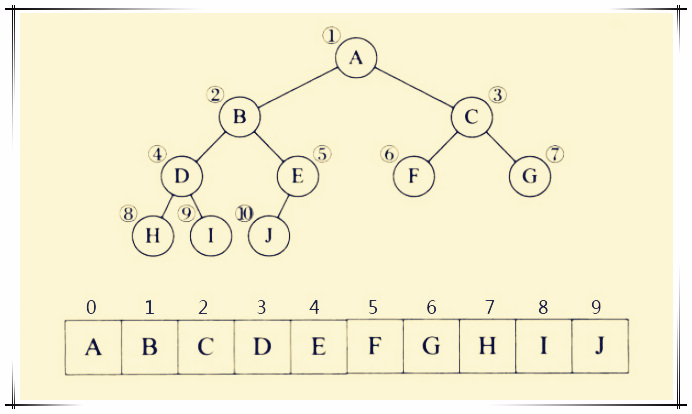
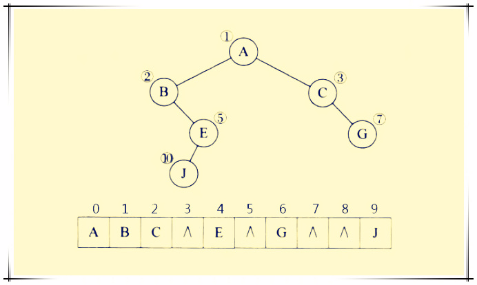
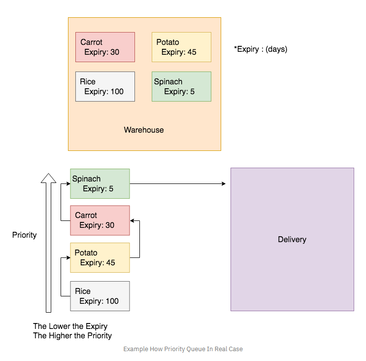

- [text/template](#texttemplate)
  - [Execute原型](#execute原型)
  - [actions](#actions)
    - [arguments](#arguments)
    - [Pipelines](#pipelines)
    - [Variables](#variables)
  - [举例](#举例)
  - [builtin函数](#builtin函数)
- [rand](#rand)
- [unsafe](#unsafe)
  - [unsafe.Pointer类型](#unsafepointer类型)
    - [float64转uint64](#float64转uint64)
- [strconv](#strconv)
- [sync](#sync)
  - [Cond](#cond)
  - [Map](#map)
  - [Mutex](#mutex)
  - [RWMutex](#rwmutex)
  - [Once](#once)
  - [Pool](#pool)
  - [重点WaitGroup](#重点waitgroup)
- [net](#net)
  - [ip tcp和udp](#ip-tcp和udp)
    - [IP datagrams](#ip-datagrams)
    - [UDP](#udp)
    - [TCP](#tcp)
  - [代码](#代码)
    - [TCP](#tcp-1)
    - [UDP](#udp-1)
  - [raw socket](#raw-socket)
  - [名字解析](#名字解析)
  - [api](#api)
- [path](#path)
  - [filepath](#filepath)
- [encoding](#encoding)
  - [二进制](#二进制)
  - [UTF8](#utf8)
  - [encoding/gob](#encodinggob)
    - [api](#api-1)
    - [简单例子](#简单例子)
    - [自定义encode和decode](#自定义encode和decode)
    - [传输interface对象](#传输interface对象)
  - [encoding/binary](#encodingbinary)
    - [varint](#varint)
- [time](#time)
  - [Time](#time-1)
  - [时间格式和单位](#时间格式和单位)
  - [Duration](#duration)
  - [api](#api-2)
  - [Ticker](#ticker)
  - [Timer](#timer)
- [context](#context)
  - [api](#api-3)
    - [整数发生器 generator](#整数发生器-generator)
    - [带超时的Context](#带超时的context)
- [syscall](#syscall)
- [runtime](#runtime)
  - [runtime相关的环境变量](#runtime相关的环境变量)
  - [api](#api-4)
  - [runtime/pprof](#runtimepprof)
  - [runtime/debug](#runtimedebug)
  - [runtime/trace](#runtimetrace)
- [os](#os)
  - [os/exec](#osexec)
  - [os/signal](#ossignal)
    - [cgo](#cgo)
    - [go作为so](#go作为so)
    - [方法](#方法)
  - [os/user](#osuser)
- [builtin](#builtin)
  - [函数](#函数)
  - [类型](#类型)
- [strings](#strings)
- [bytes](#bytes)
  - [Buffer](#buffer)
- [log/syslog](#logsyslog)
- [log](#log)
  - [type logger](#type-logger)
  - [logger支持多种格式, 用flag来配置](#logger支持多种格式-用flag来配置)
- [fmt](#fmt)
  - [方法](#方法-1)
  - [Stringer类型](#stringer类型)
  - [格式化标志符](#格式化标志符)
    - [通用](#通用)
    - [布尔值](#布尔值)
    - [整型](#整型)
    - [浮点](#浮点)
    - [字符串](#字符串)
    - [切片](#切片)
    - [指针](#指针)
    - [默认格式化](#默认格式化)
    - [宽度 精度 对齐](#宽度-精度-对齐)
  - [举例](#举例-1)
    - [scanf](#scanf)
- [bufio](#bufio)
  - [error对象](#error对象)
  - [Reader的方法](#reader的方法)
  - [Writer的方法](#writer的方法)
  - [Scanner的方法](#scanner的方法)
    - [Scanner的方法](#scanner的方法-1)
    - [按行读](#按行读)
    - [统计字符个数](#统计字符个数)
    - [也可以自定义分割函数](#也可以自定义分割函数)
- [io/ioutil](#ioioutil)
- [io](#io)
  - [变量](#变量)
  - [以Reader为例, 看golang的派生](#以reader为例-看golang的派生)
  - [PipeReader, 派生类](#pipereader-派生类)
  - [ReadWriter](#readwriter)
    - [WriterTo](#writerto)
  - [ReaderAt](#readerat)
  - [其他基类](#其他基类)
  - [Seeker](#seeker)
  - [io包的方法](#io包的方法)
    - [Copy](#copy)
    - [Pipe](#pipe)
    - [TeeReader](#teereader)
- [container/ring](#containerring)
  - [api](#api-5)
  - [例子: 连接两个ring](#例子-连接两个ring)
- [container/list](#containerlist)
  - [api](#api-6)
  - [使用举例](#使用举例)
- [container/heap](#containerheap)
  - [树的数组表达](#树的数组表达)
  - [min-int树](#min-int树)
  - [可以用heap来实现优先级队列](#可以用heap来实现优先级队列)
- [sort](#sort)
  - [支持对基本类型的排序](#支持对基本类型的排序)
  - [对struct排序](#对struct排序)
  - [通用排序](#通用排序)
  - [对外接口](#对外接口)

# text/template

注: gitbook对模板关键字`{{ }}`有特殊处理. 下文中为了规避这个问题, 在两个大括号中间都加了空格.

* `{ {.var} }`: 要被替换的模板变量. 
* `"{ {23 -} } < { {- 45} }"`: `-`用来去掉空格 `"23<45"`

传入模板的数据一般是个结构体, 或者map.
> Templates are executed by applying them to a data structure. Annotations in the template refer to elements of the data structure (typically a field of a struct or a key in a map) to control execution and derive values to be displayed. Execution of the template walks the structure and sets the cursor, represented by a period '.' and called "dot", to the value at the current location in the structure as execution proceeds.

## Execute原型
入参data可以是结构体, map等. 把结果写入io.Writer(这个设计很好, 结果写入接口, 代码的组合性就很强)
```go
func (t *Template) Execute(wr io.Writer, data interface{}) error
```

## actions
`{ { } }`包起来的叫action.
```go
{ {/* a comment */} }
{ {- /* a comment with white space trimmed from preceding and following text */ -} }
    A comment; discarded. May contain newlines.
    Comments do not nest and must start and end at the
    delimiters, as shown here.

{ {pipeline} }
    The default textual representation (the same as would be
    printed by fmt.Print) of the value of the pipeline is copied
    to the output.

{ {if pipeline} } T1 { {end} }
    If the value of the pipeline is empty, no output is generated;
    otherwise, T1 is executed. The empty values are false, 0, any
    nil pointer or interface value, and any array, slice, map, or
    string of length zero.
    Dot is unaffected.

{ {if pipeline} } T1 { {else} } T0 { {end} }
    If the value of the pipeline is empty, T0 is executed;
    otherwise, T1 is executed. Dot is unaffected.

{ {if pipeline} } T1 { {else if pipeline} } T0 { {end} }
    To simplify the appearance of if-else chains, the else action
    of an if may include another if directly; the effect is exactly
    the same as writing
        { {if pipeline} } T1 { {else} }{ {if pipeline} } T0 { {end} }{ {end} }

{ {range pipeline} } T1 { {end} }
    The value of the pipeline must be an array, slice, map, or channel.
    If the value of the pipeline has length zero, nothing is output;
    otherwise, dot is set to the successive elements of the array,
    slice, or map and T1 is executed. If the value is a map and the
    keys are of basic type with a defined order ("comparable"), the
    elements will be visited in sorted key order.

{ {range pipeline} } T1 { {else} } T0 { {end} }
    The value of the pipeline must be an array, slice, map, or channel.
    If the value of the pipeline has length zero, dot is unaffected and
    T0 is executed; otherwise, dot is set to the successive elements
    of the array, slice, or map and T1 is executed.

{ {block "name" pipeline} } T1 { {end} }
    A block is shorthand for defining a template
        { {define "name"} } T1 { {end} }
    and then executing it in place
        { {template "name" pipeline} }
    The typical use is to define a set of root templates that are
    then customized by redefining the block templates within.

{ {with pipeline} } T1 { {end} }
    If the value of the pipeline is empty, no output is generated;
    otherwise, dot is set to the value of the pipeline and T1 is
    executed.

{ {with pipeline} } T1 { {else} } T0 { {end} }
    If the value of the pipeline is empty, dot is unaffected and T0
    is executed; otherwise, dot is set to the value of the pipeline
    and T1 is executed.
```
特别的, 模板可以引用其他命名模板: New模板的时候会给每个模板起个名字, 用这个名字来引用它. -- 关联模板
```go
{ {template "name"} }
    The template with the specified name is executed with nil data.

{ {template "name" pipeline} }
    The template with the specified name is executed with dot set
    to the value of the pipeline.
```

### arguments
action里面的概念: argument
模板支持
* struct的.Field引用
* map的.Key引用
* 对象的.Method方法引用 -- 即调用dot.Method()函数
* 也可以是普通函数func

```
- A boolean, string, character, integer, floating-point, imaginary
  or complex constant in Go syntax. These behave like Go's untyped
  constants. Note that, as in Go, whether a large integer constant
  overflows when assigned or passed to a function can depend on whether
  the host machine's ints are 32 or 64 bits.
- The keyword nil, representing an untyped Go nil.
- The character '.' (period):
    .
  The result is the value of dot.
- A variable name, which is a (possibly empty) alphanumeric string
  preceded by a dollar sign, such as
    $piOver2
  or
    $
  The result is the value of the variable.
  Variables are described below.
- The name of a field of the data, which must be a struct, preceded
  by a period, such as
    .Field
  The result is the value of the field. Field invocations may be
  chained:
    .Field1.Field2
  Fields can also be evaluated on variables, including chaining:
    $x.Field1.Field2
- The name of a key of the data, which must be a map, preceded
  by a period, such as
    .Key
  The result is the map element value indexed by the key.
  Key invocations may be chained and combined with fields to any
  depth:
    .Field1.Key1.Field2.Key2
  Although the key must be an alphanumeric identifier, unlike with
  field names they do not need to start with an upper case letter.
  Keys can also be evaluated on variables, including chaining:
    $x.key1.key2
- The name of a niladic method of the data, preceded by a period,
  such as
    .Method
  The result is the value of invoking the method with dot as the
  receiver, dot.Method(). Such a method must have one return value (of
  any type) or two return values, the second of which is an error.
  If it has two and the returned error is non-nil, execution terminates
  and an error is returned to the caller as the value of Execute.
  Method invocations may be chained and combined with fields and keys
  to any depth:
    .Field1.Key1.Method1.Field2.Key2.Method2
  Methods can also be evaluated on variables, including chaining:
    $x.Method1.Field
- The name of a niladic function, such as
    fun
  The result is the value of invoking the function, fun(). The return
  types and values behave as in methods. Functions and function
  names are described below.
- A parenthesized instance of one the above, for grouping. The result
  may be accessed by a field or map key invocation.
    print (.F1 arg1) (.F2 arg2)
    (.StructValuedMethod "arg").Field
```

### Pipelines
顾名思义, 模板支持pipe操作.即多个commands可以用`|`连接, 最后命令的值是pipeline的值
```
Argument
    The result is the value of evaluating the argument.
.Method [Argument...]
    The method can be alone or the last element of a chain but,
    unlike methods in the middle of a chain, it can take arguments.
    The result is the value of calling the method with the
    arguments:
        dot.Method(Argument1, etc.)
functionName [Argument...]
    The result is the value of calling the function associated
    with the name:
        function(Argument1, etc.)
    Functions and function names are described below.
```

### Variables
Action里面可以声明变量:
```go
#用variable来获取pipeline的输出; 和shell里面一样, pipeline输出到变量里, 而不是展开
$variable := pipeline

range $index, $element := pipeline
```
特别的, `$`的默认值为传入Execute的值.
When execution begins, `$` is set to the data argument passed to Execute, that is, to the starting value of dot.

## 举例
下面所有例子都是一行的模板, 全部生成`"output"`输出.
```go
{ {"\"output\""} }
    A string constant.
{ {`"output"`} }
    A raw string constant.
{ {printf "%q" "output"} }
    A function call.
{ {"output" | printf "%q"} }
    A function call whose final argument comes from the previous
    command.
{ {printf "%q" (print "out" "put")} }
    A parenthesized argument.
{ {"put" | printf "%s%s" "out" | printf "%q"} }
    A more elaborate call.
{ {"output" | printf "%s" | printf "%q"} }
    A longer chain.
{ {with "output"} }{ {printf "%q" .} }{ {end} }
    A with action using dot.
{ {with $x := "output" | printf "%q"} }{ {$x} }{ {end} }
    A with action that creates and uses a variable.
{ {with $x := "output"} }{ {printf "%q" $x} }{ {end} }
    A with action that uses the variable in another action.
{ {with $x := "output"} }{ {$x | printf "%q"} }{ {end} }
    The same, but pipelined.
```

## builtin函数
模板提供了一些预定义的函数:
```
and
    Returns the boolean AND of its arguments by returning the
    first empty argument or the last argument, that is,
    "and x y" behaves as "if x then y else x". All the
    arguments are evaluated.
call
    Returns the result of calling the first argument, which
    must be a function, with the remaining arguments as parameters.
    Thus "call .X.Y 1 2" is, in Go notation, dot.X.Y(1, 2) where
    Y is a func-valued field, map entry, or the like.
    The first argument must be the result of an evaluation
    that yields a value of function type (as distinct from
    a predefined function such as print). The function must
    return either one or two result values, the second of which
    is of type error. If the arguments don't match the function
    or the returned error value is non-nil, execution stops.
html
    Returns the escaped HTML equivalent of the textual
    representation of its arguments. This function is unavailable
    in html/template, with a few exceptions.
index
    Returns the result of indexing its first argument by the
    following arguments. Thus "index x 1 2 3" is, in Go syntax,
    x[1][2][3]. Each indexed item must be a map, slice, or array.
slice
    slice returns the result of slicing its first argument by the
    remaining arguments. Thus "slice x 1 2" is, in Go syntax, x[1:2],
    while "slice x" is x[:], "slice x 1" is x[1:], and "slice x 1 2 3"
    is x[1:2:3]. The first argument must be a string, slice, or array.
js
    Returns the escaped JavaScript equivalent of the textual
    representation of its arguments.
len
    Returns the integer length of its argument.
not
    Returns the boolean negation of its single argument.
or
    Returns the boolean OR of its arguments by returning the
    first non-empty argument or the last argument, that is,
    "or x y" behaves as "if x then x else y". All the
    arguments are evaluated.
print
    An alias for fmt.Sprint
printf
    An alias for fmt.Sprintf
println
    An alias for fmt.Sprintln
urlquery
    Returns the escaped value of the textual representation of
    its arguments in a form suitable for embedding in a URL query.
    This function is unavailable in html/template, with a few
    exceptions.
    
eq
    Returns the boolean truth of arg1 == arg2
ne
    Returns the boolean truth of arg1 != arg2
lt
    Returns the boolean truth of arg1 < arg2
le
    Returns the boolean truth of arg1 <= arg2
gt
    Returns the boolean truth of arg1 > arg2
ge
    Returns the boolean truth of arg1 >= arg2
```
bool值是任何类型的0值.

调用函数不用加括号, 举例:
```
{ {printf "%q" "output"} }
    A function call.
{ {printf "%q" (print "out" "put")} }
    A parenthesized argument.
```

# rand
```go
import "math/rand"
func main() {
    rand.Seed(time.Now().UnixNano())
    min := 10
    max := 30
    fmt.Println(rand.Intn(max - min + 1) + min)
}
```

# unsafe
如包名所指, unsafe不怎么safe, 但它提供了更底层的操作能力
比如timer的实现里, 调用了unsafe.Sizeof获取一个结构体的大小.
```go
//返回任意类型的x的字节对齐要求
func Alignof(x ArbitraryType) uintptr

//返回x在结构体里的offset常量, x必须是structValue.field格式
func Offsetof(x ArbitraryType) uintptr
//比如
dataOffset = unsafe.Offsetof(struct {
        b bmap
        v int64
    }{}.v)

//返回类型的字节数常量
func Sizeof(x ArbitraryType) uintptr
```

## unsafe.Pointer类型
unsafe.Pointer uintptr 和任意类型的指针都可以互相转换.
用了Pointer类型, 可以绕过类型系统, 直接读写任意内存.
用Pointer可以实现C的类型强转
几个例子:
### float64转uint64
```go
package main

import (
    "fmt"
    "unsafe"
)

func main() {
    var v float64 = 1.1
    //类型强转
    fmt.Println(uint64(v))
    //通过指针强转, 结果是不一样的.
    fmt.Println(*(*uint64)(unsafe.Pointer(&v)))
}

//结果
1
4607632778762754458
```

# strconv
提供字符串到其他基本类型的转换
比如Atoi, Itoa

# sync
一般的同步用channel就好. 
sync包同时也提供了更底层的同步方法.
Once和WaitGroup类型应该是用的比较多的.
注意, 包含这个包里定义的类型的数据不能拷贝.

## Cond
Cond是用来保护并发条件下的条件变量x的. 使用时候需要
* 变量x来表示业务条件
* mutex保护这个变量的修改. 并不是用来休眠的
* 前面两个是程序已经有了的. 那么用Cond的目的是用来等待和通知的. 比如程序要等待x变成比如说100, 就用cond.wait; 到达条件的routine负责通知或者广播等待者.

**设计思路和pthread_cond一毛一样** 另见`并发 任务 事件 和锁.md`

```go
type Cond struct {

    // L is held while observing or changing the condition
    L Locker
    // contains filtered or unexported fields
}
// 其中, Locker是个接口
type Locker interface {
    Lock()
    Unlock()
}

//返回一个Cond结构的变量, 需要传入一个Locker
func NewCond(l Locker) *Cond

//唤醒所有等在这个Cond上的routine, 不需要持有锁
func (c *Cond) Broadcast()

//唤醒在c上等待的一个go routine, 不需要持有锁
func (c *Cond) Signal()

//调用Wait时, Wait自动unlock c.L, 然后挂起该go routine
//恢复的时候, Wait自动lock c.L, 然后return
//除非Broadcast或者Signal, Wait不会返回
func (c *Cond) Wait()
```

> 没看懂: Because c.L is not locked when Wait first resumes, the caller typically cannot assume that the condition is true when Wait returns. Instead, the caller should Wait in a loop:
```go
c.L.Lock()
for !condition() {
    c.Wait()
}
... make use of condition ...
c.L.Unlock()
```

## Map
内置的带锁保护的map. 
普通的map不是并发安全的, 需要自己保护临界区.
```go
type Map struct {
    // contains filtered or unexported fields
}
func (m *Map) Delete(key interface{})
func (m *Map) Load(key interface{}) (value interface{}, ok bool)
func (m *Map) LoadOrStore(key, value interface{}) (actual interface{}, loaded bool)
func (m *Map) Range(f func(key, value interface{}) bool)
func (m *Map) Store(key, value interface{})
```

## Mutex
初始状态时unlock态
```go
type Mutex struct {
    // contains filtered or unexported fields
}
func (m *Mutex) Lock()
func (m *Mutex) Unlock()
```

## RWMutex
```go
type RWMutex struct {
    // contains filtered or unexported fields
}
func (rw *RWMutex) Lock()
func (rw *RWMutex) RLock()
func (rw *RWMutex) RLocker() Locker
func (rw *RWMutex) RUnlock()
func (rw *RWMutex) Unlock()
```

## Once
Once只执行一次
```go
type Once struct {
    // contains filtered or unexported fields
}
func (o *Once) Do(f func())

//因为f没有参数, 下面的形式更常见
config.once.Do(func() { config.init(filename) })
```

## Pool
Pool是个cache, 是个并发安全的free list. 被put进pool的对象可能没有任何通知的被移除.
```go
type Pool struct {

    // New optionally specifies a function to generate
    // a value when Get would otherwise return nil.
    // It may not be changed concurrently with calls to Get.
    New func() interface{}
    // contains filtered or unexported fields
}

//随机从pool里选一个对象, 并把该对象从pool里移除. 不保证被put过的对象能够被get
//没有对象的时候, 会调用p.New方法.
func (p *Pool) Get() interface{}

//add对象到pool
func (p *Pool) Put(x interface{})
```

## 重点WaitGroup
给main routine来等待所有其他go routine结束用的.
和shell的wait差不多
```go
type WaitGroup struct {
    // contains filtered or unexported fields
}
//给counter加delta, delta可以是负值.
func (wg *WaitGroup) Add(delta int)
//子routine调用done表示自己干完了, counter减一
func (wg *WaitGroup) Done()
//main routine调用Wait等待里面的counter减到0
func (wg *WaitGroup) Wait()
```
例子:
```go
package main

import (
    "sync"
)

type httpPkg struct{}

func (httpPkg) Get(url string) {}

var http httpPkg

func main() {
    var wg sync.WaitGroup
    var urls = []string{
        "http://www.golang.org/",
        "http://www.google.com/",
        "http://www.somestupidname.com/",
    }
    for _, url := range urls {
        // Increment the WaitGroup counter.
        wg.Add(1)
        // Launch a goroutine to fetch the URL.
        go func(url string) {
            // Decrement the counter when the goroutine completes.
            defer wg.Done()
            // Fetch the URL.
            http.Get(url)
        }(url)
    }
    // Wait for all HTTP fetches to complete.
    wg.Wait()
}
```

# net
net提供tcp/ip和unix socket接口
net提供了原始的socket接口, 也提供了一层更简便的接口. 
对client来说, 是Dial
```go
conn, err := net.Dial("tcp", "golang.org:80")
if err != nil {
    // handle error
}
fmt.Fprintf(conn, "GET / HTTP/1.0\r\n\r\n")
status, err := bufio.NewReader(conn).ReadString('\n')
// ...
```

对server来说, 是Listen
```go
ln, err := net.Listen("tcp", ":8080")
if err != nil {
    // handle error
}
for {
    conn, err := ln.Accept()
    if err != nil {
        // handle error
    }
    go handleConnection(conn)
}
```
## ip tcp和udp
总的来说, ip是面向报文的, udp也是面向报文的, 只是比ip多加了port.  
tcp是面向流的.  
udp有广播.
都有api可以set os的发送接收buffer

### IP datagrams

The IP layer provides a connectionless and unreliable delivery system. It considers each datagram independently of the others. Any association between datagrams must be supplied by the higher layers.

The IP layer supplies a checksum that includes its own header. The header includes the source and destination addresses.

The IP layer handles routing through an Internet. It is also responsible for breaking up large datagrams into smaller ones for transmission and reassembling them at the other end.

### UDP

UDP is also connectionless and unreliable. What it adds to IP is a checksum for the contents of the datagram and port numbers. These are used to give a client/server model - see later.

### TCP

TCP supplies logic to give a reliable connection-oriented protocol above IP. It provides a virtual circuit that two processes can use to communicate. It also uses port numbers to identify services on a host.

## 代码
### TCP
```go
func DialTCP(net string, laddr, raddr *TCPAddr) (c *TCPConn, err os.Error)
func (c *TCPConn) Write(b []byte) (n int, err os.Error)
func (c *TCPConn) Read(b []byte) (n int, err os.Error)

func ListenTCP(net string, laddr *TCPAddr) (l *TCPListener, err os.Error)
func (l *TCPListener) Accept() (c Conn, err os.Error)

func (c *TCPConn) SetTimeout(nsec int64) os.Error
func (c *TCPConn) SetKeepAlive(keepalive bool) os.Error
```

### UDP
```go
func ResolveUDPAddr(net, addr string) (*UDPAddr, os.Error)
func DialUDP(net string, laddr, raddr *UDPAddr) (c *UDPConn, err os.Error)
//对client来说, 还是read write:
func (c *UDPConn) Read(b []byte) (int, error)
func (c *UDPConn) Write(b []byte) (int, error)

//对server来说, 有点不一样: 因为UDP的server没有"连接"的概念, 只能从每个报文里看到对端的地址.
func ListenUDP(net string, laddr *UDPAddr) (c *UDPConn, err os.Error)
func (c *UDPConn) ReadFromUDP(b []byte) (n int, addr *UDPAddr, err os.Error
func (c *UDPConn) WriteToUDP(b []byte, addr *UDPAddr) (n int, err os.Error)
```
比如server端的读写是:
```go
func handleClient(conn *net.UDPConn) {
    var buf [512]byte

    _, addr, err := conn.ReadFromUDP(buf[0:])
    if err != nil {
        return
    }

    daytime := time.Now().String()
    conn.WriteToUDP([]byte(daytime), addr)
}
```

## raw socket
IPConn就是raw socket
比如要写个ping
```go
addr, err := net.ResolveIPAddr("ip", os.Args[1])
conn, err := net.DialIP("ip4:icmp", addr, addr)
_, err = conn.Write(msg[0:len])
_, err = conn.Read(msg[0:])
```

## 名字解析
名字解析有两个方式: 纯go方式和cgo方式
默认是纯go. 使能了cgo就会用cgo. 
环境变量可以选择用哪种方式:
```sh
export GODEBUG=netdns=go # force pure Go resolver
export GODEBUG=netdns=cgo # force cgo resolver    
```

## api
```go
type Buffers
    func (v *Buffers) Read(p []byte) (n int, err error)
    func (v *Buffers) WriteTo(w io.Writer) (n int64, err error)
    
//Conn是个interface, 面向流的. 有Read和Write方法. Conn对多个goroutine并发安全
type Conn
    func Dial(network, address string) (Conn, error)
    func DialTimeout(network, address string, timeout time.Duration) (Conn, error)
    
//Listener是个接口
type Listener
    func FileListener(f *os.File) (ln Listener, err error)
    func Listen(network, address string) (Listener, error)

//PacketConn是个接口, 面向datagram的, 有ReadFrom和WriteTo方法.
type PacketConn
    func FilePacketConn(f *os.File) (c PacketConn, err error)
    func ListenPacket(network, address string) (PacketConn, error)

//IPConn is the implementation of the Conn and PacketConn interfaces for IP network connections.
//IPConn是Conn的一种实现
type IPConn
    func DialIP(network string, laddr, raddr *IPAddr) (*IPConn, error)
    func ListenIP(network string, laddr *IPAddr) (*IPConn, error)
    func (c *IPConn) Close() error
    func (c *IPConn) File() (f *os.File, err error)
    func (c *IPConn) LocalAddr() Addr
    func (c *IPConn) Read(b []byte) (int, error)
    func (c *IPConn) ReadFrom(b []byte) (int, Addr, error)
    func (c *IPConn) ReadFromIP(b []byte) (int, *IPAddr, error)
    func (c *IPConn) ReadMsgIP(b, oob []byte) (n, oobn, flags int, addr *IPAddr, err error)
    func (c *IPConn) RemoteAddr() Addr
    func (c *IPConn) SetDeadline(t time.Time) error
    func (c *IPConn) SetReadBuffer(bytes int) error
    func (c *IPConn) SetReadDeadline(t time.Time) error
    func (c *IPConn) SetWriteBuffer(bytes int) error
    func (c *IPConn) SetWriteDeadline(t time.Time) error
    func (c *IPConn) SyscallConn() (syscall.RawConn, error)
    func (c *IPConn) Write(b []byte) (int, error)
    func (c *IPConn) WriteMsgIP(b, oob []byte, addr *IPAddr) (n, oobn int, err error)
    func (c *IPConn) WriteTo(b []byte, addr Addr) (int, error)
    func (c *IPConn) WriteToIP(b []byte, addr *IPAddr) (int, error)
type TCPConn
    func DialTCP(network string, laddr, raddr *TCPAddr) (*TCPConn, error)
    func (c *TCPConn) Close() error
    func (c *TCPConn) CloseRead() error
    func (c *TCPConn) CloseWrite() error
    func (c *TCPConn) File() (f *os.File, err error)
    func (c *TCPConn) LocalAddr() Addr
    func (c *TCPConn) Read(b []byte) (int, error)
    func (c *TCPConn) ReadFrom(r io.Reader) (int64, error)
    func (c *TCPConn) RemoteAddr() Addr
    func (c *TCPConn) SetDeadline(t time.Time) error
    func (c *TCPConn) SetKeepAlive(keepalive bool) error
    func (c *TCPConn) SetKeepAlivePeriod(d time.Duration) error
    func (c *TCPConn) SetLinger(sec int) error
    func (c *TCPConn) SetNoDelay(noDelay bool) error
    func (c *TCPConn) SetReadBuffer(bytes int) error
    func (c *TCPConn) SetReadDeadline(t time.Time) error
    func (c *TCPConn) SetWriteBuffer(bytes int) error
    func (c *TCPConn) SetWriteDeadline(t time.Time) error
    func (c *TCPConn) SyscallConn() (syscall.RawConn, error)
    func (c *TCPConn) Write(b []byte) (int, error)
type TCPListener
    func ListenTCP(network string, laddr *TCPAddr) (*TCPListener, error)
    func (l *TCPListener) Accept() (Conn, error)
    func (l *TCPListener) AcceptTCP() (*TCPConn, error)
    func (l *TCPListener) Addr() Addr
    func (l *TCPListener) Close() error
    func (l *TCPListener) File() (f *os.File, err error)
    func (l *TCPListener) SetDeadline(t time.Time) error
    func (l *TCPListener) SyscallConn() (syscall.RawConn, error)
type UDPConn
    func DialUDP(network string, laddr, raddr *UDPAddr) (*UDPConn, error)
    func ListenMulticastUDP(network string, ifi *Interface, gaddr *UDPAddr) (*UDPConn, error)
    func ListenUDP(network string, laddr *UDPAddr) (*UDPConn, error)
    func (c *UDPConn) Close() error
    func (c *UDPConn) File() (f *os.File, err error)
    func (c *UDPConn) LocalAddr() Addr
    func (c *UDPConn) Read(b []byte) (int, error)
    func (c *UDPConn) ReadFrom(b []byte) (int, Addr, error)
    func (c *UDPConn) ReadFromUDP(b []byte) (int, *UDPAddr, error)
    func (c *UDPConn) ReadMsgUDP(b, oob []byte) (n, oobn, flags int, addr *UDPAddr, err error)
    func (c *UDPConn) RemoteAddr() Addr
    func (c *UDPConn) SetDeadline(t time.Time) error
    func (c *UDPConn) SetReadBuffer(bytes int) error
    func (c *UDPConn) SetReadDeadline(t time.Time) error
    func (c *UDPConn) SetWriteBuffer(bytes int) error
    func (c *UDPConn) SetWriteDeadline(t time.Time) error
    func (c *UDPConn) SyscallConn() (syscall.RawConn, error)
    func (c *UDPConn) Write(b []byte) (int, error)
    func (c *UDPConn) WriteMsgUDP(b, oob []byte, addr *UDPAddr) (n, oobn int, err error)
    func (c *UDPConn) WriteTo(b []byte, addr Addr) (int, error)
    func (c *UDPConn) WriteToUDP(b []byte, addr *UDPAddr) (int, error)
type UnixConn
    func DialUnix(network string, laddr, raddr *UnixAddr) (*UnixConn, error)
    func ListenUnixgram(network string, laddr *UnixAddr) (*UnixConn, error)
    func (c *UnixConn) Close() error
    func (c *UnixConn) CloseRead() error
    func (c *UnixConn) CloseWrite() error
    func (c *UnixConn) File() (f *os.File, err error)
    func (c *UnixConn) LocalAddr() Addr
    func (c *UnixConn) Read(b []byte) (int, error)
    func (c *UnixConn) ReadFrom(b []byte) (int, Addr, error)
    func (c *UnixConn) ReadFromUnix(b []byte) (int, *UnixAddr, error)
    func (c *UnixConn) ReadMsgUnix(b, oob []byte) (n, oobn, flags int, addr *UnixAddr, err error)
    func (c *UnixConn) RemoteAddr() Addr
    func (c *UnixConn) SetDeadline(t time.Time) error
    func (c *UnixConn) SetReadBuffer(bytes int) error
    func (c *UnixConn) SetReadDeadline(t time.Time) error
    func (c *UnixConn) SetWriteBuffer(bytes int) error
    func (c *UnixConn) SetWriteDeadline(t time.Time) error
    func (c *UnixConn) SyscallConn() (syscall.RawConn, error)
    func (c *UnixConn) Write(b []byte) (int, error)
    func (c *UnixConn) WriteMsgUnix(b, oob []byte, addr *UnixAddr) (n, oobn int, err error)
    func (c *UnixConn) WriteTo(b []byte, addr Addr) (int, error)
    func (c *UnixConn) WriteToUnix(b []byte, addr *UnixAddr) (int, error)
type UnixListener
    func ListenUnix(network string, laddr *UnixAddr) (*UnixListener, error)
    func (l *UnixListener) Accept() (Conn, error)
    func (l *UnixListener) AcceptUnix() (*UnixConn, error)
    func (l *UnixListener) Addr() Addr
    func (l *UnixListener) Close() error
    func (l *UnixListener) File() (f *os.File, err error)
    func (l *UnixListener) SetDeadline(t time.Time) error
    func (l *UnixListener) SetUnlinkOnClose(unlink bool)
    func (l *UnixListener) SyscallConn() (syscall.RawConn, error)
```

# path
path是个辅助包, 用于解析路径的, 基本上带斜杠的路径常用的方法都有.
针对URL地址的, 对unix路径也有效. windows路径无效.
```go
func Base(path string) string
func Clean(path string) string
func Dir(path string) string
func Ext(path string) string
func IsAbs(path string) bool
func Join(elem ...string) string
func Match(pattern, name string) (matched bool, err error)
func Split(path string) (dir, file string)
```
## filepath
filepath提供OS无关的路径, 正斜杠和反斜杠都支持.
filepath提供基本的path方法, 还提供了一个很好的目录遍历方法: Walk, 对目录下的所有文件调用WalkFunc
```go
func Abs(path string) (string, error)
func Base(path string) string
func Clean(path string) string
func Dir(path string) string
func EvalSymlinks(path string) (string, error)
func Ext(path string) string
func FromSlash(path string) string
func Glob(pattern string) (matches []string, err error)
func HasPrefix(p, prefix string) bool
func IsAbs(path string) bool
func Join(elem ...string) string
func Match(pattern, name string) (matched bool, err error)
func Rel(basepath, targpath string) (string, error)
func Split(path string) (dir, file string)
func SplitList(path string) []string
func ToSlash(path string) string
func VolumeName(path string) string
func Walk(root string, walkFn WalkFunc) error
type WalkFunc
```


# encoding
encoding下面有好几种encode方法, 但都能用到下面两对接口.

## 二进制
```go
type BinaryMarshaler interface {
    MarshalBinary() (data []byte, err error)
}
type BinaryUnmarshaler interface {
    UnmarshalBinary(data []byte) error
}
```

## UTF8
```go
type TextMarshaler interface {
    MarshalText() (text []byte, err error)
}
type TextUnmarshaler interface {
    UnmarshalText(text []byte) error
}
```

## encoding/gob
gob提供在发送和接收双方传输二进制流的方法. 比较常用于rpc
gob流是自解释的. 每个gob数据前面都有个类型, 是预定义好的. 
在gob流中, 指针会被变成其指向的内容.
使用gob的时候, Encoder把本地变量变成gob流,Decoder把流数据还原到本地变量.

----
接收端和发送端不一定要完全一样. 结构体的成员按名字来匹配.
比如发送一个结构体: `struct { A, B int }`
那下面的形式都可以:
```go
struct { A, B int }    // the same
*struct { A, B int }    // extra indirection of the struct
struct { *A, **B int }    // extra indirection of the fields
struct { A, B int64 }    // different concrete value type; see below
```
接受方可以是:
```go
struct { A, B int }    // the same
*struct { A, B int }    // extra indirection of the struct
struct { *A, **B int }    // extra indirection of the fields
struct { A, B int64 }    // different concrete value type; see below
```
接收下面的形式是错误的:
```go
struct { A int; B uint }    // change of signedness for B
struct { A int; B float }    // change of type for B
struct { }    // no field names in common
struct { C, D int }    // no field names in common
```

传输的过程不是很简单, 比如对整形来说, int是以变长方式传输的, 并不区分int32, int64等.
string和byte切片, 数组和map, 都可以被Encode然后send.

也可以自定义Encode方法来发送自定义数据.

### api
```go
func Register(value interface{})
func RegisterName(name string, value interface{})
type CommonType
type Decoder
    func NewDecoder(r io.Reader) *Decoder
    func (dec *Decoder) Decode(e interface{}) error
    func (dec *Decoder) DecodeValue(v reflect.Value) error
type Encoder
    func NewEncoder(w io.Writer) *Encoder
    func (enc *Encoder) Encode(e interface{}) error
    func (enc *Encoder) EncodeValue(value reflect.Value) error
type GobDecoder
type GobEncoder
```

注意:
* type Decoder和type Encoder都是struct, 而不是interface
返回struct, 是要调用这个对象的方法.
而实现interface, 是实现一个派生类
* 入参都是`e interface{}`, 这是个万能对象. 可以是指针, 也可以是值. 看怎么用.

### 简单例子
```go
package main

import (
    "bytes"
    "encoding/gob"
    "fmt"
    "log"
)

type P struct {
    X, Y, Z int
    Name    string
}

type Q struct {
    X, Y *int32
    Name string
}

// This example shows the basic usage of the package: Create an encoder,
// transmit some values, receive them with a decoder.
func main() {
    // Initialize the encoder and decoder. Normally enc and dec would be
    // bound to network connections and the encoder and decoder would
    // run in different processes.
    var network bytes.Buffer        // Stand-in for a network connection
    enc := gob.NewEncoder(&network) // Will write to network.
    dec := gob.NewDecoder(&network) // Will read from network.

    // Encode (send) some values.
    err := enc.Encode(P{3, 4, 5, "Pythagoras"})
    if err != nil {
        log.Fatal("encode error:", err)
    }
    err = enc.Encode(P{1782, 1841, 1922, "Treehouse"})
    if err != nil {
        log.Fatal("encode error:", err)
    }

    // Decode (receive) and print the values.
    var q Q
    err = dec.Decode(&q)
    if err != nil {
        log.Fatal("decode error 1:", err)
    }
    fmt.Printf("%q: {%d, %d}\n", q.Name, *q.X, *q.Y)
    err = dec.Decode(&q)
    if err != nil {
        log.Fatal("decode error 2:", err)
    }
    fmt.Printf("%q: {%d, %d}\n", q.Name, *q.X, *q.Y)
}
```

结果
```
"Pythagoras": {3, 4}
"Treehouse": {1782, 1841}
```

### 自定义encode和decode
Vector里面有私有成员, gob无法直接访问, 必须通过Vector自己的方法.
gob会调用encoding的MarshalBinary和UnmarshalBinary来完成这个任务.

```go
package main

import (
    "bytes"
    "encoding/gob"
    "fmt"
    "log"
)

// The Vector type has unexported fields, which the package cannot access.
// We therefore write a BinaryMarshal/BinaryUnmarshal method pair to allow us
// to send and receive the type with the gob package. These interfaces are
// defined in the "encoding" package.
// We could equivalently use the locally defined GobEncode/GobDecoder
// interfaces.
type Vector struct {
    x, y, z int
}

func (v Vector) MarshalBinary() ([]byte, error) {
    // A simple encoding: plain text.
    var b bytes.Buffer
    fmt.Fprintln(&b, v.x, v.y, v.z)
    return b.Bytes(), nil
}

// UnmarshalBinary modifies the receiver so it must take a pointer receiver.
//因为下面Decode()入参是Vector的地址, 所以这里要引用方式.
func (v *Vector) UnmarshalBinary(data []byte) error {
    // A simple encoding: plain text.
    b := bytes.NewBuffer(data)
    _, err := fmt.Fscanln(b, &v.x, &v.y, &v.z)
    return err
}

// This example transmits a value that implements the custom encoding and decoding methods.
func main() {
    var network bytes.Buffer // Stand-in for the network.

    // Create an encoder and send a value.
    enc := gob.NewEncoder(&network)
    err := enc.Encode(Vector{3, 4, 5})
    if err != nil {
        log.Fatal("encode:", err)
    }

    // Create a decoder and receive a value.
    dec := gob.NewDecoder(&network)
    var v Vector
    err = dec.Decode(&v)
    if err != nil {
        log.Fatal("decode:", err)
    }
    fmt.Println(v)

}

结果:
{3 4 5}
```

### 传输interface对象
interface, channel等默认不能传输. 但可以注册interface的concrete 类型来传输.
比如: Point是个struct, 可以直接gob; 但Pythagoras是interface, 要传输它必须要注册它对应的concrete类型:
`gob.Register(Point{})`
```go
package main

import (
    "bytes"
    "encoding/gob"
    "fmt"
    "log"
    "math"
)

type Point struct {
    X, Y int
}

func (p Point) Hypotenuse() float64 {
    return math.Hypot(float64(p.X), float64(p.Y))
}

type Pythagoras interface {
    Hypotenuse() float64
}

// This example shows how to encode an interface value. The key
// distinction from regular types is to register the concrete type that
// implements the interface.
func main() {
    var network bytes.Buffer // Stand-in for the network.

    // We must register the concrete type for the encoder and decoder (which would
    // normally be on a separate machine from the encoder). On each end, this tells the
    // engine which concrete type is being sent that implements the interface.
    gob.Register(Point{})

    // Create an encoder and send some values.
    enc := gob.NewEncoder(&network)
    for i := 1; i <= 3; i++ {
        //这里传入Point实例, 但实际上, 这个实例是作为Pythagoras接口类型传递的.
        interfaceEncode(enc, Point{3 * i, 4 * i})
    }

    // Create a decoder and receive some values.
    dec := gob.NewDecoder(&network)
    for i := 1; i <= 3; i++ {
        result := interfaceDecode(dec)
        fmt.Println(result.Hypotenuse())
    }

}

// interfaceEncode encodes the interface value into the encoder.
func interfaceEncode(enc *gob.Encoder, p Pythagoras) {
    // The encode will fail unless the concrete type has been
    // registered. We registered it in the calling function.

    // Pass pointer to interface so Encode sees (and hence sends) a value of
    // interface type. If we passed p directly it would see the concrete type instead.
    // See the blog post, "The Laws of Reflection" for background.
    err := enc.Encode(&p)
    if err != nil {
        log.Fatal("encode:", err)
    }
}

// interfaceDecode decodes the next interface value from the stream and returns it.
func interfaceDecode(dec *gob.Decoder) Pythagoras {
    // The decode will fail unless the concrete type on the wire has been
    // registered. We registered it in the calling function.
    var p Pythagoras
    err := dec.Decode(&p)
    if err != nil {
        log.Fatal("decode:", err)
    }
    return p
}

```


## encoding/binary
binary提供对字节序列到任意格式的转换.
比如下面的例子, 把一个字节序列, "读"到一个结构体里面.

```go
func main() {
    b := []byte{0x18, 0x2d, 0x44, 0x54, 0xfb, 0x21, 0x09, 0x40, 0xff, 0x01, 0x02, 0x03, 0xbe, 0xef}
    r := bytes.NewReader(b)

    var data struct {
        PI   float64
        Uate uint8
        Mine [3]byte
        Too  uint16
    }
    //对字符数组来说, 大小端没关系. 但对uint16来说, 要知道大小端才知道如何解读.
    if err := binary.Read(r, binary.LittleEndian, &data); err != nil {
        fmt.Println("binary.Read failed:", err)
    }

    fmt.Println(data.PI)
    fmt.Println(data.Uate)
    fmt.Printf("% x\n", data.Mine)
    fmt.Println(data.Too)
}

//输出. 
3.141592653589793
255
01 02 03
61374
```

下面是个写的例子:
```go
func main() {
    buf := new(bytes.Buffer)
    var data = []interface{}{
        uint16(61374),
        int8(-54),
        uint8(254),
    }
    for _, v := range data {
        err := binary.Write(buf, binary.LittleEndian, v)
        if err != nil {
            fmt.Println("binary.Write failed:", err)
        }
    }
    fmt.Printf("%x", buf.Bytes())
}

```

### varint
varint是种对int的变长存储策略, 越小的数, 用越少的字节存储.


# time
底层OS一般提供
* 墙上(wall clock)时间: 用来报告时间, 表示绝对时间; 墙上时间可能由于设定时间等操作, 造成跳变.
* 单一(monotonic)时间: 用来测量时间, 表示相对时间
time.Now()返回的就是Time类型的值, 这个值既包括墙上时间, 又包括单一时间.

下面的代码保证即使墙上时间跳变了, 比如时间被校准了, 但相对时间elapsed是实际的delta时间.
```go
start := time.Now()
... operation that takes 20 milliseconds ...
t := time.Now()
elapsed := t.Sub(start)
```
在api中, 应该说有相对概念的api, 比如Time.sub, Time.before等等, 都用的是单一时间. 
相对时间只对当前的进程有效.

## Time
首先, Time是个结构体; 但其内部结构对外是不可见的. 我们知道的, 只是Time是对绝对时间的表达, 精度是ns
Time是值, 不是指针.
Time的0值是1年1月1号0点
比较符号==可以比较两个Time, 但推荐用t1.Equal(t2), 后者更精确.

```go
type Time struct {
    // contains filtered or unexported fields
}
```
Time有如下方法:
`func Date(year int, month Month, day, hour, min, sec, nsec int, loc *Location) Time`
比如: `t := time.Date(2009, time.November, 10, 23, 0, 0, 0, time.UTC)`, 这样初始化一个time
有Now(), 有从字符串解析时间的Parse()方法.
有Add(), After(), Before()
还有给定Time t, 有解析到Date, Day的方法
比如:
```go
    d := time.Date(2000, 2, 1, 12, 30, 0, 0, time.UTC)
    year, month, day := d.Date()

    fmt.Printf("year = %v\n", year)
    fmt.Printf("month = %v\n", month)
    fmt.Printf("day = %v\n", day)
```
还有把Time转为json格式的方法.

## 时间格式和单位
```go
const (
    ANSIC = "Mon Jan _2 15:04:05 2006"
    UnixDate = "Mon Jan _2 15:04:05 MST 2006"
    RubyDate = "Mon Jan 02 15:04:05 -0700 2006"
    RFC822 = "02 Jan 06 15:04 MST"
    RFC822Z = "02 Jan 06 15:04 -0700" // RFC822 with numeric zone
    RFC850 = "Monday, 02-Jan-06 15:04:05 MST"
    RFC1123 = "Mon, 02 Jan 2006 15:04:05 MST"
    RFC1123Z = "Mon, 02 Jan 2006 15:04:05 -0700" // RFC1123 with numeric zone
    RFC3339 = "2006-01-02T15:04:05Z07:00"
    RFC3339Nano = "2006-01-02T15:04:05.999999999Z07:00"
    Kitchen = "3:04PM"
    // Handy time stamps.
    Stamp = "Jan _2 15:04:05"
    StampMilli = "Jan _2 15:04:05.000"
    StampMicro = "Jan _2 15:04:05.000000"
    StampNano = "Jan _2 15:04:05.000000000"
)

//这些时间都是以ns为单位的
const (
    Nanosecond Duration = 1
    Microsecond = 1000 * Nanosecond
    Millisecond = 1000 * Microsecond
    Second = 1000 * Millisecond
    Minute = 60 * Second
    Hour = 60 * Minute
)
```

## Duration
Duration是个时间delta, `type Duration int64`, 时间单位是ns, 是64位的int, 最大能表示290年.
比如
```go
t0 := time.Now()
expensiveCall()
t1 := time.Now()
fmt.Printf("The call took %v to run.\n", t1.Sub(t0))
```
Duration的值有几个方法, 比如 d Duration, d.Hours, d.Senconds等, 把Duration转换为相应的单位.其String方法返回类似的字符串:  "72h3m0.5s"


## api
`func Now() Time` : 返回当前local时间
`func After(d Duration) <-chan Time` : 提供一个简单的超时机制, 它返回一个channel, 超时后可读. 超时后可以被垃圾回收. 
```go
var c chan int

func handle(int) {}
func main() {
    select {
    case m := <-c:
        handle(m)
    case <-time.After(10 * time.Second):
        fmt.Println("timed out")
    }
}

```
`time.Sleep(100 * time.Millisecond)` : sleep
`time.Tick` 返回一个channel, 这个channel不会close, 一直能读到Time, 它是对NewTicker的封装
比如下面的代码一直会打印, 每5秒一次. 这个是不是和while 1里面sleep差不多.
```go
func main() {
    c := time.Tick(5 * time.Second)
    for now := range c {
        fmt.Printf("%v %s\n", now, statusUpdate())
    }
}
```
`func Since(t Time) Duration` : 和`time.Now().Sub(t)`一样. 从t到现在的Duration

## Ticker
```go
type Ticker struct {
    //C是给外部用的channel
    C <-chan Time // The channel on which the ticks are delivered.
    // contains filtered or unexported fields
}
```
使用`func NewTicker(d Duration) *Ticker`来获得一个Ticker实例
Ticker是周期的tick, 有NewTicker(), Stop()等方法.

## Timer
```go
type Timer struct {
    //外部可以用C这个channel
    C <-chan Time
    // contains filtered or unexported fields
}
```
使用`func NewTimer(d Duration) *Timer`先生成一个Timer对象
和Ticker不同的是, Timer是一次性的事件. 有NewTimer() Stop等方法.

# context
```go
//Context是个interface
type Context interface {
    Deadline() (deadline time.Time, ok bool)
    //这是个空结构体的channel
    Done() <-chan struct{}
    Err() error
    Value(key interface{}) interface{}
}
```
顾名思义, 上下文. 提供通用的deadline, cancel等API, 用于多个go routine之间协作的.
context不应该被包含在任何struct里, 而是应该直接传入函数, 通常应该是第一个参数, 叫ctx.
一个context可能会被多个go routine使用, context保证并发安全.
context对象都有个Done()方法, 返回一个channel. 读这个channel就知道是否有人或有事件通知我们该结束了.

通常在服务端收到一个request时, 会新开一个goroutine来响应这个请求, 我们称其为这个请求的主routine;通常这个主routine会再开其他的goroutine用来访问数据库或者其他RPC服务, 这些子routine都会用到request的相关user的token等身份数据. 当主routine认为超时的时候, 这些子routine应该尽快结束.

所以是主routine创建Context, 设置超时时间, 把Context传入每个子routine; 主routine检测到超时, 会调用Context的Cancel函数, 触发Done的通道关闭; 子routine需要在代码里检测Done通道, 如果关闭了就马上退出.

这是一种主routine"通知"子routine退出的方法.

## api
`func Background() Context` : 返回一个空的ctx变量

### 整数发生器 generator
`func WithCancel(parent Context) (ctx Context, cancel CancelFunc)`
返回一个Context变量ctx, ctx有个Done的channel
返回的第二个值是CancelFunc函数, 用于关闭ctx.Done

----
举例: 下面的例子, main调用gen(), 后者返回个channel, 并起个 go routine不断的产生整数, 写入这个channel.
这个go routine还监视`ctx.Done()`, 这是ctx提供的channel, 能读到东西说明别人告诉他事情做完了.

```go
package main

import (
    "context"
    "fmt"
)

func main() {
    // gen generates integers in a separate goroutine and
    // sends them to the returned channel.
    // The callers of gen need to cancel the context once
    // they are done consuming generated integers not to leak
    // the internal goroutine started by gen.
    gen := func(ctx context.Context) <-chan int {
        dst := make(chan int)
        n := 1
        go func() {
            for {
                select {
                case <-ctx.Done():
                    return // returning not to leak the goroutine
                case dst <- n:
                    n++
                }
            }
        }()
        //这里return这个channel和上面的go routine是并行的.
        return dst
    }

    //Background方法返回一个空的context变量
    ctx, cancel := context.WithCancel(context.Background())
    //在本层函数返回前, 调用cancel
    defer cancel() // cancel when we are finished consuming integers

    //因为gen返回的是channel, 用range不断的读取这个channel的值. 没有值就阻塞
    //gen的go routine不断产生int给这个channel
    for n := range gen(ctx) {
        fmt.Println(n)
        if n == 5 {
            break
        }
    }
    //到这里cancel被调用, 把ctx的channel关闭. 所以gen的goroutine会收到Done, select退出, for退出, goroutine退出
    //效果是: gen的goroutine随着main的执行完毕而退出, 不会一直运行.
}

```

Context适合用于main通知子routine结束; 而WaitGroup机制是子routine通知main完成, main可以结束等待.

### 带超时的Context
`func WithDeadline(parent Context, d time.Time) (Context, CancelFunc)`
和WithCancel类似, 返回一个以time.Time为deadline的ctx. 如果时间到了, 或者ctx的CancelFunc被调用了, 或者这个Done channel本身被close了, 那这个ctx的Done channel会close.

----
举例: 下面的例子设置超时时间d为现在开始后50ms, 并以d初始化ctx. 
然后用defer关键词执行`cancel()`. 注意, 不管哪种情况, 在函数退出的时候执行cancel都是没坏处的.
然后select会阻塞, 等1秒或者是等超时, 很明显, 是超时.

```go
package main

import (
    "context"
    "fmt"
    "time"
)

func main() {
    d := time.Now().Add(50 * time.Millisecond)
    ctx, cancel := context.WithDeadline(context.Background(), d)

    // Even though ctx will be expired, it is good practice to call its
    // cancellation function in any case. Failure to do so may keep the
    // context and its parent alive longer than necessary.
    defer cancel()

    select {
    case <-time.After(1 * time.Second):
        fmt.Println("overslept")
    case <-ctx.Done():
        fmt.Println(ctx.Err()) //context deadline exceeded
    }
}

```
思考: 如果是用c写一个带超时的等待, 该怎么写呢?

WithTimeout方法是WithDeadline的简化版: 即WithTimeout = `WithDeadline(parent, time.Now().Add(timeout))`

# syscall
syscall包装了很多底层OS系统调用
但只有一部分? 比如没有ioctl?

# runtime
runtime包提供对go的runtime系统访问的功能

## runtime相关的环境变量
* GOGC: 新分配数据和老数据的比率. 默认是100. 即新老数据一样多的时候, 触发一次垃圾回收.  
这个比率越大, gc被触发次数越少, 比如说调高到500
SetGCPercent函数和GOGC环境变量作用一样, 但可以在运行时调用.

* GODEBUG: 里面有控制相关模块的debug的开关, 比如 gc, cgo, 调度, 内存分析等.  
见笔记go调试
`GODEBUG=schedtrace=10000,scheddetail=1`

* GOMAXPROCS: 控制多少个goroutine可以并行跑
* 另外还有关于调用栈的, 关于竞争的环境变量

## api
runtime很强大, 它暴露了很多go的细节. 比如
```go
#执行断点
func Breakpoint()
#调用goroutine退出, 其他不受影响
func Goexit()
#触发一次调度
func Gosched()
#绑定goroutine到底层线程
func LockOSThread()
#有MemProfile和CPUProfile等检查性能的函数, 但推荐普通用户使用
runtime/pprof
#可用cpu数
func NumCPU() int
#还有api可以获得goroutine的个数, 调用cgo的次数等
//...省略一些高端api
#返回版本号
func Version() string
#调用栈
Callers
CallersFrames
```

## runtime/pprof
管性能分析的.

## runtime/debug
顾名思义, 有打印调用栈的, 有调节gc的等等.
```go
func FreeOSMemory()
func PrintStack()
func ReadGCStats(stats *GCStats)
func SetGCPercent(percent int) int
func SetMaxStack(bytes int) int
func SetMaxThreads(threads int) int
func SetPanicOnFault(enabled bool) bool
func SetTraceback(level string)
func Stack() []byte
func WriteHeapDump(fd uintptr)
type BuildInfo
    func ReadBuildInfo() (info *BuildInfo, ok bool)
type GCStats
type Module
```

## runtime/trace
和ftrace概念类似, 在关键点上打桩.

# os
os包提供平台无关的接口. 它的错误处理方式是go的经典方式:
```go
file, err := os.Open("file.go") // For read access.
if err != nil {
     log.Fatal(err)
}
```
提供的接口包括
* Chdir Chmod Link Mkdir Pipe Remove TempDir Rename Expand环境变量等
* Getpid, ppid等
* IsExist IsTimeout等
* 文件类 type File
    * Create NewFile Open 用于创建File对象
    * 注意, Open()返回只读的File对象, OpenFile()可以指定打开模式, 和C一样.
    * 读 写 Seek Sync Close
* 进程类 type Process
    * 按pid查找进程
    * 开始进程
    * Kill Release Signal Wait等
* 定义了错误类型
    * PathError LinkError SyscallError

```go
package main

import (
    "log"
    "os"
)

func main() {
    f, err := os.OpenFile("notes.txt", os.O_RDWR|os.O_CREATE, 0755)
    if err != nil {
        log.Fatal(err)
    }
    if err := f.Close(); err != nil {
        log.Fatal(err)
    }
}
```

## os/exec
用于执行外部程序; 只能在linux上跑
和c里面的system不太一样, exec和c的exec更像, 比system简单.
Run和Start的区别是: Run要等待命令返回, 而Start只管开始, 不等待返回, 要和Wait连用.

```go
package main

import (
    "log"
    "os/exec"
)

func main() {
    //一般的模式是先生成一个cmd对象.
    cmd := exec.Command("sleep", "1")
    log.Printf("Running command and waiting for it to finish...")
    //后面都用这个cmd对象来操作
    err := cmd.Run()
    log.Printf("Command finished with error: %v", err)
}
```
## os/signal
用来处理go的signal
* SIGKILL and SIGSTOP不能被捕获, 所以这里的东西都管不了它们
* 同步的signal, 一般是SIGBUS, SIGFPE, and SIGSEGV, 是由正在执行的go程序引起的
在go里, 这些signal被转换为运行时的panic
* 剩下的signal, 是其他进程异步通知的signal, 用这里的接口处理

----
默认行为:
> By default, a synchronous signal is converted into a run-time panic. A SIGHUP, SIGINT, or SIGTERM signal causes the program to exit. A SIGQUIT, SIGILL, SIGTRAP, SIGABRT, SIGSTKFLT, SIGEMT, or SIGSYS signal causes the program to exit with a stack dump. A SIGTSTP, SIGTTIN, or SIGTTOU signal gets the system default behavior (these signals are used by the shell for job control). The SIGPROF signal is handled directly by the Go runtime to implement runtime.CPUProfile. Other signals will be caught but no action will be taken.

### cgo
一般go程序在启动的时候, runtime会先安装默认的sighandler, cgo如果自己有处理signal的需求, 要用SA_ONSTACK标记. 否则程序会crash
这种情况要当心, 详见: 
https://golang.google.cn/pkg/os/signal/#hdr-Go_programs_that_use_cgo_or_SWIG

### go作为so
当go编译为-buildmode=c-shared时, 一般调用这个so的非go程序, 已经安装了sighandler, 那go runtime有相关处理.
https://golang.google.cn/pkg/os/signal/#hdr-Non_Go_programs_that_call_Go_code

### 方法
```go
func Ignore(sig ...os.Signal)
func Ignored(sig os.Signal) bool
func Notify(c chan<- os.Signal, sig ...os.Signal)
func Reset(sig ...os.Signal)
func Stop(c chan<- os.Signal)
```
比如
```go
package main

import (
    "fmt"
    "os"
    "os/signal"
)

func main() {
    // Set up channel on which to send signal notifications.
    // We must use a buffered channel or risk missing the signal
    // if we're not ready to receive when the signal is sent.
    c := make(chan os.Signal, 1)
    // 在os包中, var Interrupt Signal = syscall.SIGINT
    signal.Notify(c, os.Interrupt)

    // Block until a signal is received.
    s := <-c
    fmt.Println("Got signal:", s)
}
```
## os/user
提供用户name id等查询的功能.

# builtin
builtin里预定义了golang的常用函数和类型
比如
## 函数
```
append
cap
close
copy
delete
len
make
new
panic
recover
print
```
## 类型
`bool byte error int u/int8/16/32/64 float32/64 rune string uintptr`

# strings
strings和bytes的方法差不多, 不同在于
* strings是UTF8编码, 变长的
* bytes是C里的字符数组

----
举例: Builder是strings包提供的一个struct, 实现了Write方法. 它尽量少copy
```go
package main

import (
    "fmt"
    "strings"
)

func main() {
    var b strings.Builder
    for i := 3; i >= 1; i-- {
        fmt.Fprintf(&b, "%d...", i)
    }
    b.WriteString("ignition")
    fmt.Println(b.String())

}

//输出
3...2...1...ignition
```

# bytes
bytes可以有
* 两个byte切片可以比较: `func Compare(a, b []byte) int`
* 可以判断是否有子串: Contains
* 子串计数: Count
* 字串位置: Index
* 相等: Equal
* 前后缀: HasPrefix HasSuffix
* 字符串逐个map: Map
* 重复N次字符串: Repeat
* 替换: Replace
* 分割: Split
* 大小写转换: ToUpper ToLower
* 去掉空白: Trim
* 连接: Join

## Buffer
Buffer是个struct, 是动态大小的byte切片. 有Read和Write方法, 符合io.Reaer和io.Writer
NewBuffer返回一个Buffer对象, 但通常`new(Buffer)`或者`var b bytes.Buffer`就够实例化一个Buffer了.
Buffer的所有方法, 都是引用方式. 比如:
`func (b *Buffer) Read(p []byte) (n int, err error)`
`func (b *Buffer) Write(p []byte) (n int, err error)`

# log/syslog
虽然这个包已经停止维护, 但它提供了一个参考设计
这个包通过unix socket, 发送记录到syslog守护进程; 只需要调用一次Dial方法来连接到syslog守护进程, 如果有问题, 会自动重连.
```go
package main

import (
    "fmt"
    "log"
    "log/syslog"
)

func main() {
    sysLog, err := syslog.Dial("tcp", "localhost:1234",
        syslog.LOG_WARNING|syslog.LOG_DAEMON, "demotag")
    if err != nil {
        log.Fatal(err)
    }
    fmt.Fprintf(sysLog, "This is a daemon warning with demotag.")
    sysLog.Emerg("And this is a daemon emergency with demotag.")
}

```
新的第三方的syslog更好用

# log
log包实现了一个logger类型, 并提供基础的log功能. log还提供了一个"标准"的logger, 用来记录log到stdout
log给每个message都加换行.
Fatal()会调用os.Exit()
Panic()会调用内置函数panic()
Print()家族函数用来打印到log

## type logger
logger是个struct, 提供在io.Writer基础上的log功能. 它不是个interface, 并不抽象, 它是实实在在的一个对象.
用`func New(out io.Writer, prefix string, flag int) *Logger`来实例化一个logger
这个New很精髓, 实例化一个对象来对外提供功能.
```go
package main

import (
    "bytes"
    "fmt"
    "log"
)

func main() {
    var (
        buf    bytes.Buffer
        logger = log.New(&buf, "logger: ", log.Lshortfile)
    )

    logger.Print("Hello, log file!")

    fmt.Print(&buf)
}
```

## logger支持多种格式, 用flag来配置
比如`Ldate | Ltime | Lmicroseconds | Llongfile`产生这样的打印
```
2009/01/23 01:23:23.123123 /a/b/c/d.go:23: message
```
我们注意到, logger的一个功能就是打印当前的文件名和行数
有个Output()函数, 地一个参数是skip多少级的意思, 因为打印当前行, 也就是打印语句本身所在的行, 并没有什么实际意义.
这和callstack函数会skip几个层级道理一样.

# fmt
与python不同的是, 字符串格式化不是语言级别的. 在go里, 用fmt包提供这类功能.

## 方法
比较常用的有
```go
//接受格式化字符串, 返回error对象
func Errorf(format string, a ...interface{}) error
//Fprintf/Fprintln家族, 输出到io.Writer
func Fprintf(w io.Writer, format string, a ...interface{}) (n int, err error)
//格式化输入, 输入源是io.Reader
func Fscanf(r io.Reader, format string, a ...interface{}) (n int, err error)

//去掉F的是 标准输入输出
Printf/Scanf
```

## Stringer类型
Stringer类型的String方法是默认的打印方法, 有String方法的类型都能被Print家族打印, 不用显式给出格式化串.
```go
type Stringer interface {
    String() string
}
```
```go
package main

import (
    "fmt"
)

// Animal has a Name and an Age to represent an animal.
type Animal struct {
    Name string
    Age  uint
}

// String makes Animal satisfy the Stringer interface.
func (a Animal) String() string {
    return fmt.Sprintf("%v (%d)", a.Name, a.Age)
}

func main() {
    a := Animal{
        Name: "Gopher",
        Age:  2,
    }
    fmt.Println(a)
}
```

## 格式化标志符
### 通用
```go
%v    the value in a default format
    when printing structs, the plus flag (%+v) adds field names
%#v   a Go-syntax representation of the value
%T    a Go-syntax representation of the type of the value
%%    a literal percent sign; consumes no value
```
### 布尔值
`%t    the word true or false`

### 整型
```go
%b    base 2
%c    the character represented by the corresponding Unicode code point
%d    base 10
%o    base 8
%O    base 8 with 0o prefix
%q    a single-quoted character literal safely escaped with Go syntax.
%x    base 16, with lower-case letters for a-f
%X    base 16, with upper-case letters for A-F
%U    Unicode format: U+1234; same as "U+%04X"
```

### 浮点
```go
%b    decimalless scientific notation with exponent a power of two,
    in the manner of strconv.FormatFloat with the 'b' format,
    e.g. -123456p-78
%e    scientific notation, e.g. -1.234456e+78
%E    scientific notation, e.g. -1.234456E+78
%f    decimal point but no exponent, e.g. 123.456
%F    synonym for %f
%g    %e for large exponents, %f otherwise. Precision is discussed below.
%G    %E for large exponents, %F otherwise
%x    hexadecimal notation (with decimal power of two exponent), e.g. -0x1.23abcp+20
%X    upper-case hexadecimal notation, e.g. -0X1.23ABCP+20
```

### 字符串
```go
%s    the uninterpreted bytes of the string or slice
%q    a double-quoted string safely escaped with Go syntax
%x    base 16, lower-case, two characters per byte
%X    base 16, upper-case, two characters per byte
```

### 切片
`%p    address of 0th element in base 16 notation, with leading 0x`

### 指针
```go
%p    base 16 notation, with leading 0x
The %b, %d, %o, %x and %X verbs also work with pointers,
formatting the value exactly as if it were an integer.
```

### 默认格式化
```go
bool:                    %t
int, int8 etc.:          %d
uint, uint8 etc.:        %d, %#x if printed with %#v
float32, complex64, etc: %g
string:                  %s
chan:                    %p
pointer:                 %p

struct:             {field0 field1 ...}
array, slice:       [elem0 elem1 ...]
maps:               map[key1:value1 key2:value2 ...]
pointer to above:   &{}, &[], &map[]
```

### 宽度 精度 对齐 
```go
%f     default width, default precision
%9f    width 9, default precision
%.2f   default width, precision 2
%9.2f  width 9, precision 2
%9.f   width 9, precision 0

+    always print a sign for numeric values;
    guarantee ASCII-only output for %q (%+q)
-    pad with spaces on the right rather than the left (left-justify the field)
#    alternate format: add leading 0b for binary (%#b), 0 for octal (%#o),
    0x or 0X for hex (%#x or %#X); suppress 0x for %p (%#p);
    for %q, print a raw (backquoted) string if strconv.CanBackquote
    returns true;
    always print a decimal point for %e, %E, %f, %F, %g and %G;
    do not remove trailing zeros for %g and %G;
    write e.g. U+0078 'x' if the character is printable for %U (%#U).
' '    (space) leave a space for elided sign in numbers (% d);
    put spaces between bytes printing strings or slices in hex (% x, % X)
0    pad with leading zeros rather than spaces;
    for numbers, this moves the padding after the sign
```

## 举例
fmt格式的详细例子, 在golang的doc上都有:
[https://golang.org/pkg/fmt/#example__formats](https://golang.org/pkg/fmt/#example__formats)

### scanf
```go
package main

import (
    "fmt"
    "os"
    "strings"
)

func main() {
    var (
        i int
        b bool
        s string
    )
    r := strings.NewReader("5 true gophers")
    n, err := fmt.Fscanf(r, "%d %t %s", &i, &b, &s)
    if err != nil {
        fmt.Fprintf(os.Stderr, "Fscanf: %v\n", err)
    }
    fmt.Println(i, b, s)
    fmt.Println(n)
}
```

# bufio
bufio是在io层之上的, 提供带buffer的io
New家族的方法有

* 使用io.Reader初始化一个bufio.Reader
`func NewReader(rd io.Reader) *Reader`
* 使用io.Writer初始化一个bufio.Writer
`func NewWriter(w io.Writer) *Writer`
* 使用bufio的Reader和Writer创建一个ReadWriter
`func NewReadWriter(r *Reader, w *Writer) *ReadWriter`

## error对象
这个模式在go里很常见: 把错误定义为变量, 错误用error.New创建, 可以被当作error返回.
```go
var (
    ErrInvalidUnreadByte = errors.New("bufio: invalid use of UnreadByte")
    ErrInvalidUnreadRune = errors.New("bufio: invalid use of UnreadRune")
    ErrBufferFull        = errors.New("bufio: buffer full")
    ErrNegativeCount     = errors.New("bufio: negative count")
)
```

## Reader的方法
bufio的Reader, 可以
* 看当前buffer的可读取byte数: Buffered
* 可以丢弃当前buffer的n个字节: Discard
* 临时读n个byte: Peek
* 调用底层io.Reader, 读一次: Read
* 读一个字节: ReadByte
* 读n个字节, 直到分隔符: `func (b *Reader) ReadBytes(delim byte) ([]byte, error)`
* 读一行: ReadLine
* 读一个符文: ReadRune
* 读出一个切片, 直到某个字符: ReadSlice
* 读出一个字符串, 直到某个字符: ReadString
* 重置buffer: Reset
* 大小: Size
* 取消上次读: UnreadByte
* 写到别处: WriteTo

## Writer的方法
* 有多少个字节在buffer里未被使用: Available
* 已经用了多少: Buffered
* 从一个Reader里读: ReadFrom
* 重置buffer: Reset
* 写字符切片, 写单个字符, 写单个符文, 写utf8字符串

## Scanner的方法
bufio提供了对文件遍历的方案: 按行(默认行为), 按空白字符, 按指定的rune, 按制定的byte等方式.

### Scanner的方法
这里的Scanner是个很好的迭代器的参考
New: `func NewScanner(r io.Reader) *Scanner`
常用的方法:
* Scan: 根据split的定义, 内部保存本次token, 返回是否结束.
* Text或者Bytes : 获取最后一次Scan到的token
我觉得其实Scan可以返回两个值, 第一个是token, 第二个才是表示结束的bool值.
那么`for scanner.Scan() {...}`
就可以写成`for token, finish := scanner.Scan(); finish != ture; token, finish := scanner.Scan(); {...}`, 不是省掉了`scanner.Text()`调用?
似乎人家这么设计是有原因的, 可能和go没有do while结构有关.
* SplitFunc方法
用来定义分割符的
`type SplitFunc func(data []byte, atEOF bool) (advance int, token []byte, err error)`
被Scan调用. data是Scan传给SplitFunc的数据, 是剩下未被扫描的字符数组, 和一个底层io.Reader是否已经是EOF的标记.
返回的avance是本次在buffer里前进了多少个字节, token是本次扫描到的token.

### 按行读
```go
package main

import (
    "bufio"
    "fmt"
    "os"
)

func main() {
    scanner := bufio.NewScanner(os.Stdin)
    //这里像个迭代器, 实际是每次for都调用一次Scan, Scan返回这次的token, 即被分割后的字符
    //用Text或者Bytes方法返回token.
    for scanner.Scan() {
        fmt.Println(scanner.Text()) // Println will add back the final '\n'
    }
    if err := scanner.Err(); err != nil {
        fmt.Fprintln(os.Stderr, "reading standard input:", err)
    }
}

```

### 统计字符个数
```go
package main

import (
    "bufio"
    "fmt"
    "os"
    "strings"
)

func main() {
    // An artificial input source.
    const input = "Now is the winter of our discontent,\nMade glorious summer by this sun of York.\n"
    scanner := bufio.NewScanner(strings.NewReader(input))
    // Set the split function for the scanning operation.
    scanner.Split(bufio.ScanWords)
    // Count the words.
    count := 0
    for scanner.Scan() {
        count++
    }
    if err := scanner.Err(); err != nil {
        fmt.Fprintln(os.Stderr, "reading input:", err)
    }
    fmt.Printf("%d\n", count)
}

```

### 也可以自定义分割函数
```go
package main

import (
    "bufio"
    "fmt"
    "strconv"
    "strings"
)

func main() {
    // An artificial input source.
    const input = "1234 5678 1234567901234567890"
    scanner := bufio.NewScanner(strings.NewReader(input))
    // Create a custom split function by wrapping the existing ScanWords function.
    split := func(data []byte, atEOF bool) (advance int, token []byte, err error) {
        advance, token, err = bufio.ScanWords(data, atEOF)
        if err == nil && token != nil {
            _, err = strconv.ParseInt(string(token), 10, 32)
        }
        return
    }
    // Set the split function for the scanning operation.
    scanner.Split(split)
    // Validate the input
    for scanner.Scan() {
        fmt.Printf("%s\n", scanner.Text())
    }

    if err := scanner.Err(); err != nil {
        fmt.Printf("Invalid input: %s", err)
    }
}
```


# io/ioutil
包括了ReadAll ReadDir ReadFile WriteFile等方法.
还包括一个`/dev/null`对象:
`var Discard io.Writer = devNull(0)`
```go
func NopCloser(r io.Reader) io.ReadCloser
func ReadAll(r io.Reader) ([]byte, error)
func ReadDir(dirname string) ([]os.FileInfo, error)
func ReadFile(filename string) ([]byte, error)
func TempDir(dir, prefix string) (name string, err error)
func TempFile(dir, pattern string) (f *os.File, err error)
func WriteFile(filename string, data []byte, perm os.FileMode) error
```

# io
io包提供底层的io原语, 主要的工作是对os包的一层封装, 提供接口的抽象
## 变量
io包里, 定义了一些变量. 是io包持有的一些对象.
主要是一些错误的对象, 其他程序可以直接用. 比如:
```go
var EOF = errors.New("EOF")
var ErrClosedPipe = errors.New("io: read/write on closed pipe")
...
```

## 以Reader为例, 看golang的派生
io里面的方法和结构, 充分展示了golang实现基类和派生类的方式.
C++的派生是靠血缘方式, 家族式的
Go的派生是党派方式, 只要你的方法和我的一样, 就是自己人.

Reader, 可以认为是个基类
比如, 只要实现了Read方法的类型, 都是Reader:

```go
//read到p里, 最大len(p)
type Reader interface {
    Read(p []byte) (n int, err error)
}
```
注:
* Read, 就是从什么地方, 把data读出来, 放到一个buf里. 
和C的read一样, 用户要传入一个buf, 在这里是个切片`p []byte`, go的切片自带大小, 所以不用传size
* Read不用等到到最大size, 即len(p)才返回. 只要这次的data到位了, 就返回.
* Read的实现中, 不能持有p, 即不能对p增加引用.
 
## PipeReader, 派生类
Reader的派生类, PipeReader实现了Read方法. 
所以虽然形式上PipeReader是个struct, 而Reader是interface, 但因为interface可以是任何东西, 有点类似C语言的`void *`
所以, PipeReader也是Reader. 所有Reader能适用的地方, PipeReader一样适用.

```go
type PipeReader struct {
    // contains filtered or unexported fields
}
func (r *PipeReader) Read(data []byte) (n int, err error)
```

----
Writer和Reader类似, 它有派生类:
`PipeWriter StringWriter ByteWriter`等等

## ReadWriter
ReadWriter是Reader和Writer的组合
```go
type ReadWriter interface {
    Reader
    Writer
}
```

### WriterTo
一个实现了Reader的类型, 也可以实现WriteTo方法, 从而也是WriterTo
定义这个WriterTo类型, 类型断言会用到.
```go
type WriterTo interface {
    WriteTo(w Writer) (n int64, err error)
}
```

## ReaderAt
带offset的Reader, 是个接口.

## 其他基类
* Closer: 包装了Close方法的interface
```go
type Closer interface {
    Close() error
}
```
* 从C的概念来的, 指定下次的读写从哪里开始 
```go
type Seeker interface {
    Seek(offset int64, whence int) (int64, error)
}
```
等等

## Seeker
Seeker决定下次读写的offset. whence表示offset的相对位置, 可以相对文件开头, 当前, 和结尾.
```go
type Seeker interface {
    Seek(offset int64, whence int) (int64, error)
}
```

## io包的方法
### Copy
```go
func Copy(dst Writer, src Reader) (written int64, err error)
```
举例, 这里只是演示, 把一段字符串, copy到标准输出.
因为标准输出也是一个Writer
```go
package main

import (
    "io"
    "log"
    "os"
    "strings"
)

func main() {
    r := strings.NewReader("some io.Reader stream to be read\n")
    if _, err := io.Copy(os.Stdout, r); err != nil {
        log.Fatal(err)
    }
}

```

----
Copy的实现:
上面提到过, WriterTo和Reader可以是同一个类型, 在Copy的实现中, 有这样的类型断言
```go
// copyBuffer is the actual implementation of Copy and CopyBuffer.
// if buf is nil, one is allocated.
func copyBuffer(dst Writer, src Reader, buf []byte) (written int64, err error) {
    // If the reader has a WriteTo method, use it to do the copy.
    // Avoids an allocation and a copy.
    if wt, ok := src.(WriterTo); ok {
        return wt.WriteTo(dst)
    }
    // Similarly, if the writer has a ReadFrom method, use it to do the copy.
    if rt, ok := dst.(ReaderFrom); ok {
        return rt.ReadFrom(src)
    }
    if buf == nil {
        //默认32K的buf
        buf = make([]byte, 32*1024)
    }
    for {
        nr, er := src.Read(buf)
        if nr > 0 {
            //这里直接传入切片 buf[0:nr]
            nw, ew := dst.Write(buf[0:nr])
            if nw > 0 {
                written += int64(nw)
            }
            if ew != nil {
                err = ew
                break
            }
            if nr != nw {
                err = ErrShortWrite
                break
            }
        }
        if er == EOF {
            break
        }
        if er != nil {
            err = er
            break
        }
    }
    return written, err
}

```

### Pipe
Pipe返回一个管道对, 一个用来读, 一个用来写
```go
func Pipe() (*PipeReader, *PipeWriter)
```
举例, 创建一对读写pipe, 一个go routine写, 主程序读.
```go
package main

import (
    "bytes"
    "fmt"
    "io"
)

func main() {
    r, w := io.Pipe()

    go func() {
        fmt.Fprint(w, "some text to be read\n")
        w.Close()
    }()

    buf := new(bytes.Buffer)
    buf.ReadFrom(r)
    fmt.Print(buf.String())
}

```

### TeeReader
```go
package main

import (
    "bytes"
    "fmt"
    "io"
    "io/ioutil"
    "log"
    "strings"
)

func main() {
    r := strings.NewReader("some io.Reader stream to be read\n")
    var buf bytes.Buffer
    tee := io.TeeReader(r, &buf)

    printall := func(r io.Reader) {
        b, err := ioutil.ReadAll(r)
        if err != nil {
            log.Fatal(err)
        }

        fmt.Printf("%s", b)
    }

    printall(tee)
    printall(&buf)
}

//输出:
some io.Reader stream to be read
some io.Reader stream to be read
```

# container/ring
ring是个循环链表. 里面的任何一个元素都可以被用来引用这个ring.
所以不像链表有元素和list两个概念, ring只有一个类型: Ring

## api
```go
type Ring struct {
    Value interface{} // for use by client; untouched by this library
    // contains filtered or unexported fields
}

type Ring
    func New(n int) *Ring
    //对每个元素执行f, f不能改变ring本身
    func (r *Ring) Do(f func(interface{}))
    func (r *Ring) Len() int
    //链接连个ring
    func (r *Ring) Link(s *Ring) *Ring
    func (r *Ring) Move(n int) *Ring
    func (r *Ring) Next() *Ring
    func (r *Ring) Prev() *Ring
    func (r *Ring) Unlink(n int) *Ring
```

## 例子: 连接两个ring
```go
package main

import (
    "container/ring"
    "fmt"
)

func main() {
    // Create two rings, r and s, of size 2
    r := ring.New(2)
    s := ring.New(2)

    // Get the length of the ring
    lr := r.Len()
    ls := s.Len()

    // Initialize r with 0s
    for i := 0; i < lr; i++ {
        r.Value = 0
        r = r.Next()
    }

    // Initialize s with 1s
    for j := 0; j < ls; j++ {
        s.Value = 1
        s = s.Next()
    }

    // Link ring r and ring s
    rs := r.Link(s)

    // Iterate through the combined ring and print its contents
    rs.Do(func(p interface{}) {
        fmt.Println(p.(int))
    })

}

//输出
0
0
1
1

```

# container/list
实现了一个双向链表
对这个链表的遍历:
```go
for e := l.Front(); e != nil; e = e.Next() {
    // do something with e.Value
}
```

## api
```go
//这是个struct, Value并不关心具体的数据类型, 只是以万能类型interface存储.
type Element struct {
    // The value stored with this element.
    Value interface{}
    // contains filtered or unexported fields
}

type Element
    func (e *Element) Next() *Element
    func (e *Element) Prev() *Element

//也是个struct
type List
    func New() *List
    func (l *List) Back() *Element
    func (l *List) Front() *Element
    func (l *List) Init() *List
    func (l *List) InsertAfter(v interface{}, mark *Element) *Element
    func (l *List) InsertBefore(v interface{}, mark *Element) *Element
    func (l *List) Len() int
    func (l *List) MoveAfter(e, mark *Element)
    func (l *List) MoveBefore(e, mark *Element)
    func (l *List) MoveToBack(e *Element)
    func (l *List) MoveToFront(e *Element)
    func (l *List) PushBack(v interface{}) *Element
    func (l *List) PushBackList(other *List)
    func (l *List) PushFront(v interface{}) *Element
    func (l *List) PushFrontList(other *List)
    func (l *List) Remove(e *Element) interface{}
```

## 使用举例
```go
package main

import (
    "container/list"
    "fmt"
)

func main() {
    // Create a new list and put some numbers in it.
    l := list.New()
    e4 := l.PushBack(4)
    e1 := l.PushFront(1)
    l.InsertBefore(3, e4)
    l.InsertAfter(2, e1)

    // Iterate through list and print its contents.
    for e := l.Front(); e != nil; e = e.Next() {
        fmt.Println(e.Value)
    }
}

```

# container/heap
参考: [https://golang.org/pkg/container/heap/](https://golang.org/pkg/container/heap/)
heap是个树, 每个node的值都是它的子树的"最小值". 所以根节点是最小的. 
```go
import "container/heap"
type Interface interface {
        sort.Interface
        Push(x interface{}) // add x as element Len()
        Pop() interface{} // remove and return element Len()
}
```
注意, 这里的"最小值"的英文表述为"minimum-valued" node, 何为最小值? 由heap.Interface里面的sort.Interface说了算.
就是说, heap包的逻辑是, 按照sort的方法, 做成一个最小树.
实现了heap.Interface的任何type都可以是heap

* Push把一个元素排序后放入树中.
* Pop把树中的一个元素返回. Less()方法决定返回哪个元素. 

## 树的数组表达
> 节点在数组中的位置对应它在树中的位置,下标为0 的节点为根节点,下标为1是根的左节点,2为根节点的右节点,依次类推,从左到右的顺序存储树的每一层,包括空节点.

  

  

## min-int树
```go
// This example demonstrates an integer heap built using the heap interface.
package main

import (
    "container/heap"
    "fmt"
)

// An IntHeap is a min-heap of ints.
type IntHeap []int

func (h IntHeap) Len() int           { return len(h) }
func (h IntHeap) Less(i, j int) bool { return h[i] < h[j] }
func (h IntHeap) Swap(i, j int)      { h[i], h[j] = h[j], h[i] }

//注意: 这里的Push和Pop是给heap包调动用的, 和heap.Push, heap.Pop不一样.
func (h *IntHeap) Push(x interface{}) {
    // Push and Pop use pointer receivers because they modify the slice's length,
    // not just its contents.
    *h = append(*h, x.(int))
}

func (h *IntHeap) Pop() interface{} {
    old := *h
    n := len(old)
    x := old[n-1]
    *h = old[0 : n-1]
    //根据下文的解释, 在调用这个实例i的Pop之前, heap.Pop已经重新排序了
    //这里重新排序的逻辑是, 把底层数组的第n个空出来, 放最小值; 这个很容易, 就把0号和n-1号互换就行.
    //然后把剩下的n-1个重新排序.
    //最后底层数组的序号n-1就是最小值, 会被heap.Pop返回.
    return x
}

// This example inserts several ints into an IntHeap, checks the minimum,
// and removes them in order of priority.
func main() {
    h := &IntHeap{2, 1, 5}
    heap.Init(h)
    heap.Push(h, 3)
    fmt.Printf("minimum: %d\n", (*h)[0])
    for h.Len() > 0 {
        fmt.Printf("%d ", heap.Pop(h))
    }
}

//结果
minimum: 1
1 2 3 5 
```

## 可以用heap来实现优先级队列
  
```go
// This example demonstrates a priority queue built using the heap interface.
package main

import (
    "container/heap"
    "fmt"
)

// An Item is something we manage in a priority queue.
type Item struct {
    value    string // The value of the item; arbitrary.
    priority int    // The priority of the item in the queue.
    // The index is needed by update and is maintained by the heap.Interface methods.
    index int // The index of the item in the heap.
}

//这个heap来存储上是建立在slice上的?
// A PriorityQueue implements heap.Interface and holds Items.
type PriorityQueue []*Item

func (pq PriorityQueue) Len() int { return len(pq) }

//原本head是node的值比其子树要小, 这里"重载"了Less方法, 返回大的值, 从而实现先pop大的
func (pq PriorityQueue) Less(i, j int) bool {
    // We want Pop to give us the highest, not lowest, priority so we use greater than here.
    return pq[i].priority > pq[j].priority
}

//为什么不是指针传递? 因为pq是slice吗?
func (pq PriorityQueue) Swap(i, j int) {
    pq[i], pq[j] = pq[j], pq[i]
    pq[i].index = i
    pq[j].index = j
}

//实现了Push和Pop就是heap
func (pq *PriorityQueue) Push(x interface{}) {
    n := len(*pq)
    //类型断言
    item := x.(*Item)
    item.index = n
    //用append就能push进树结构?

    *pq = append(*pq, item)
}

//实现了Push和Pop就是heap
func (pq *PriorityQueue) Pop() interface{} {
    //怎么隐约感觉这里是deep copy

    old := *pq
    n := len(old)
    //这样就行了?

    item := old[n-1]
    item.index = -1 // for safety
    //返回一个切片?

    *pq = old[0 : n-1]
    return item
}

// update modifies the priority and value of an Item in the queue.
func (pq *PriorityQueue) update(item *Item, value string, priority int) {
    item.value = value
    item.priority = priority
    heap.Fix(pq, item.index)
}

// This example creates a PriorityQueue with some items, adds and manipulates an item,
// and then removes the items in priority order.
func main() {
    // Some items and their priorities.
    items := map[string]int{
        "banana": 3, "apple": 2, "pear": 4,
    }
    // Create a priority queue, put the items in it, and
    // establish the priority queue (heap) invariants.
    pq := make(PriorityQueue, len(items))
    i := 0
    for value, priority := range items {
        pq[i] = &Item{
            value:    value,
            priority: priority,
            index:    i,
        }
        i++
    }
    heap.Init(&pq)
    // Insert a new item and then modify its priority.
    item := &Item{
        value:    "orange",
        priority: 1,
    }
    heap.Push(&pq, item)
    pq.update(item, item.value, 5)
    // Take the items out; they arrive in decreasing priority order.
    for pq.Len() > 0 {
        item := heap.Pop(&pq).(*Item)
        fmt.Printf("%.2d:%s ", item.priority, item.value)
    }
}

```
对上面几个问题的解释:
* 这里的head用数组slice做底层存储
* heap.Push()先调用具体实例的Push()实现, 再调用up()排序
* heap.Pop()先调用具体实例的Swap()方法, 再用down方法排序, 再调用具体实例的Pop()
* up()和down()是`src/container/heap/heap.go`的排序实现

```go
// Push pushes the element x onto the heap.
// The complexity is O(log n) where n = h.Len().
func Push(h Interface, x interface{}) {
    h.Push(x)
    up(h, h.Len()-1)
}

// Pop removes and returns the minimum element (according to Less) from the heap.
// The complexity is O(log n) where n = h.Len().
// Pop is equivalent to Remove(h, 0).
func Pop(h Interface) interface{} {
    n := h.Len() - 1
    //这里把0号node和len()-1互换了, 正好对应上面的item := old[n-1]直接取

    h.Swap(0, n)
    //头节点没了, 肯定要重新排序
    down(h, 0, n)
    return h.Pop()
}

```

# sort
提供对切片和自定义的结构的排序.

## 支持对基本类型的排序
排序是原地排序, 即直接修改底层的数组
```go
func Float64s(a []float64)
func Ints(a []int)
func IsSorted(data Interface) bool
//返回满足条件的下标
func Search(n int, f func(int) bool) int
//在已经排好序的slice里search
func SearchInts(a []int, x int) int
func SearchStrings(a []string, x string) int

func Strings(a []string)
```
比如:
```go
package main

import (
    "fmt"
    "math"
    "sort"
)

func main() {
    s := []float64{5.2, -1.3, 0.7, -3.8, 2.6} // unsorted
    //对s排序, 升序排序
    sort.Float64s(s)
    //排好序后还是s
    fmt.Println(s)

    s = []float64{math.Inf(1), math.NaN(), math.Inf(-1), 0.0} // unsorted
    sort.Float64s(s)
    fmt.Println(s)

}

[-3.8 -1.3 0.7 2.6 5.2]
[NaN -Inf 0 +Inf]

```

## 对struct排序
```go
//传入一个slice, 按照less函数排序
func Slice(slice interface{}, less func(i, j int) bool)
//带stable字眼的表示排序是稳定的
func SliceStable(slice interface{}, less func(i, j int) bool)
```
比如:
```go
package main

import (
    "fmt"
    "sort"
)

func main() {
    people := []struct {
        Name string
        Age  int
    }{
        {"Gopher", 7},
        {"Alice", 55},
        {"Vera", 24},
        {"Bob", 75},
    }
    sort.Slice(people, func(i, j int) bool { return people[i].Name < people[j].Name })
    fmt.Println("By name:", people)

    sort.Slice(people, func(i, j int) bool { return people[i].Age < people[j].Age })
    fmt.Println("By age:", people)
}
```

## 通用排序
```go
//通过调用data.Len, data.Less, data.Swap来进行排序
func Sort(data Interface)
func Stable(data Interface)
```

## 对外接口
一个用户自定义的数据表达, 要满足sort.Interface要求, 就能被排序.
要求底层承载数据的东西, 是按整数index寻址的. 也就是说, 必须是数组.
```go
type Interface interface {
    // Len is the number of elements in the collection.
    Len() int
    // Less reports whether the element with
    // index i should sort before the element with index j.
    Less(i, j int) bool
    // Swap swaps the elements with indexes i and j.
    Swap(i, j int)
}
```
