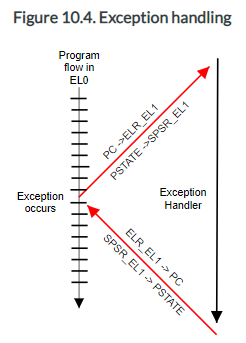
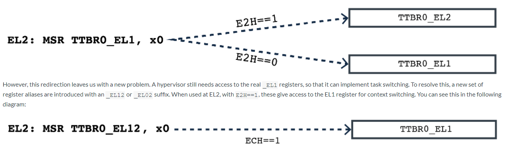

golang汇编语法参考: https://go.dev/doc/asm

- [pseudo寄存器](#pseudo寄存器)
- [函数](#函数)
- [arm64汇编](#arm64汇编)
  - [Register mapping rules](#register-mapping-rules)
- [ARM64异常处理过程](#arm64异常处理过程)
- [ARM64上下文切换](#arm64上下文切换)
- [什么是VHE](#什么是vhe)

# pseudo寄存器
* SB: Static base pointer 全局基地址. 比如foo(SB)就是foo这个symbol的地址
* FP: 帧指针. 用来传参的, 比如
    * `first_arg+0(FP)`: 第一个参数
    * `second_arg+8(FP)`: 第二个参数(64bit CPU)
* SP: 栈指针. 指向栈顶. 用于局部变量. CPU都有物理SP, 语法上看前缀来区分:
    * `x-8(SP)`, `y-4(SP)`: 使用pseudo SP
    * `-8(SP)`使用物理SP
* PC: 程序指针

# 函数
格式: `TEXT symbol(SB), [flags,] $framesize[-argsize]`
* symbol: 函数名
* SB: SB伪寄存器
* flags: 可以是
    * NOSPLIT: 不让编译器插入栈分裂的代码
    * WRAPPER: 不增加函数帧计数
    * NEEDCTXT: 需要上下文参数, 一般用于闭包
* framesize: 局部变量大小, 包含要传给子函数的参数部分
* argsize: 参数+返回值的大小, 可以省略由编译器自己推导

比如
```go
//go:nosplit
func swap(a, b int) (int, int)
```
可以写为:
```go
TEXT ·swap(SB), NOSPLIT, $0-32
或者
TEXT ·swap(SB), NOSPLIT, $0
```
这里`-32`是4个8字节的int, 即入参a, b和两个出参.  
注意go并不区分入参和出参
```go
func swap(a, b int) (int, int)
或
func swap(a, b, c, d int)
或
func swap() (a, b, c, d int)
或
func swap() (a, []int, d int)
```
汇编都一样

# arm64汇编
https://pkg.go.dev/cmd/internal/obj/arm64#pkg-overview

## [Register mapping rules](https://pkg.go.dev/cmd/internal/obj/arm64#hdr-Register_mapping_rules)

1. All basic register names are written as Rn.
2. Go uses ZR as the zero register and RSP as the stack pointer.
3. Bn, Hn, Dn, Sn and Qn instructions are written as Fn in floating-point instructions and as Vn in SIMD instructions.

# [ARM64异常处理过程](https://developer.arm.com/documentation/den0024/a/AArch64-Exception-Handling/Exception-handling-registers?lang=en)

> When an event which causes an exception occurs, the processor hardware automatically performs certain actions. The `SPSR_ELn` is updated, (where n is the Exception level where the exception is taken), to store the `PSTATE` information required to correctly return at the end of the exception. `PSTATE` is updated to reflect the new processor status (and this may mean that the Exception level is raised, or it may stay the same). The return address to be used at the end of the exception is stored in `ELR_ELn`.

异常发生的时候, CPU会自动的实施如下动作:
* 将`PSTATE`保存到`SPSR_ELn`  
比如异常发生在EL0, 一般会在EL1处理. 那`PSTATE`会保存在`SPSR_EL1`
* 更新`PSTATE`以反映新的CPU状态, 比如已经进入EL1
* 硬件会将返回地址保存在`ELR_Eln`.  
还是比如异常发生在EL0, 但在EL1处理, 那返回地址保存在`ELR_EL1`  
  

> The processor has to be told when to return from an exception by software. This is done by executing the ERET instruction. This restores the pre-exception `PSTATE` from `SPSR_ELn` and returns program execution back to the original location by restoring the PC from `ELR_ELn`.

eret指令用来从异常处理返回:
* 从`SPSR_ELn`恢复异常前的`PSTATE`
* 从`ELR_ELn`恢复PC
* 异常返回, 从恢复的PC和`PSTATE`继续执行

> `ELR_ELn` contains the return address which is preferred for the specific exception type. For some exceptions, this is the address of the next instruction after the one which generated the exception. For example, when an SVC (system call) instruction is executed, we simply wish to return to the following instruction in the application. In other cases, we may wish to re-execute the instruction that generated the exception.

在发生异常时, 硬件会自动更新ELR, 根据情况, 返回地址有几种可能:
* 比如SVC指令触发的同步异常, ELR里保存的是其下一条指令
* 比如异步异常(即外部中断), ELR里保存的是下一个没被执行(或完全执行)的指令

ELR可以在异常处理程序里面被更改.

> In addition to the `SPSR` and `ELR` registers, each Exception level has its own dedicated Stack Pointer register. These are named `SP_EL0`, `SP_EL1`, `SP_EL2` and `SP_EL3`. These registers are used to point to a dedicated stack that can, for example, be used to store registers which are corrupted by the exception handler, so that they can be restored to their original value before returning to the original code.

> Handler code may switch from using `SP_ELn` to `SP_EL0`. For example, it may be that `SP_EL1` points to a piece of memory which holds a small stack that the kernel can guarantee to always be valid. `SP_EL0` might point to a kernel task stack which is larger, but not guaranteed to be safe from overflow. This switching is controlled by writing to the `[SPSel]` bit, as shown in the following code:
```go
  MSR SPSel, #0  // switch to SP_EL0
  MSR SPSel, #1  // switch to SP_ELn
```

每个EL都有独立的SP, 并且异常处理程序可以切换使用`SP_EL0`和`SP_ELn`.

# ARM64上下文切换
> Processors that implement the ARMv8-A Architecture are typically used in systems running a complex operating system with many applications or tasks that run concurrently. Each process has its own unique translation tables residing in physical memory. When an application starts, the operating system allocates it a set of translation table entries that map both the code and data used by the application to physical memory. These tables can subsequently be modified by the kernel, for example, to map in extra space, and are removed when the application is no longer running.

> There might therefore be multiple tasks present in the memory system. The kernel scheduler periodically transfers execution from one task to another. This is called a context switch and requires the kernel to save all execution state associated with the process and to restore the state of the process to be run next. The kernel also switches translation table entries to those of the next process to be run. The memory of the tasks that are not currently running is completely protected from the task that is running.

每个进程都有自己的translation table, 这个table是kernel分配的, 把其物理地址配置到ttbr0寄存器.
上下文切换的时候, kernel会保存/恢复如下上下文:
*   general-purpose registers X0-X30.
*   Advanced SIMD and Floating-point registers V0 - V31.
*   Some status registers.
*   `TTBR0_EL1` and `TTBR0`.
*   Thread Process ID (`TPIDxxx`) Registers.
*   Address Space ID (`ASID`).

> For EL0 and EL1, there are two translation tables. `TTBR0_EL1` provides translations for the bottom of Virtual Address space, which is typically application space and `TTBR1_EL1` covers the top of Virtual Address space, typically kernel space. This split means that the OS mappings do not have to be replicated in the translation tables of each task.

EL0和EL1有两个translation table, `TTBR0_EL1`负责bottom空间(用户空间), `TTBR1_EL1`负责top空间(kernel空间). 大家都用`TTBR1_EL1`做kernel空间, 所以进程切换的时候, `TTBR1_EL1`不用变, 所以kernel的映射不用变.

> Translation table entries contain a non-global (nG) bit. If the nG bit is set for a particular page, it is associated with a specific task or application. If the bit is marked as 0, then the entry is global and applies to all tasks.

页表entry里有个nG位, 用来表示non-global, 为0的时候, 这个页表entry就是全局的, 对所有task都有效.

> For non-global entries, when the TLB is updated and the entry is marked as non-global, a value is stored in the TLB entry in addition to the normal translation information. This value is called the Address Space ID (ASID), which is a number assigned by the OS to each individual task. Subsequent TLB look-ups only match on that entry if the current ASID matches with the ASID that is stored in the entry. This permits multiple valid TLB entries to be present for a particular page marked as non-global, but with different ASID values. In other words, we do not necessarily need to flush the TLBs when we context switch.

ASID(_Address Space ID_)寄存器用来标记页表entry所属的task, 由kernel分配. 当TLB更新的时候, TLB entry除了保存地址翻译信息, 还会包括这个ASID. TLB查询的时候, 只有当前的ASID和TLB entry保存的ASID匹配的时候, 才算TLB命中. 所以上下文切换的时候不需要flush TLB.

> In AArch64, this ASID value can be specified as either an 8-bit or 16-bit value, controlled by the `TCR_EL1`.AS bit. The current ASID value is specified in either `TTBR0_EL1` or TTBR1_EL1. `TCR_EL1` controls which TTBR holds the ASID, but it is normally `TTBR0_EL1`, as this corresponds to application space.

ASID可以8位或16位. 一般配置在`TTBR0_EL1`中.

> Having the current value of the ASID stored in the translation table register means that you can atomically modify both the translation tables as well as the ASID in a single instruction. This simplifies the process of changing the table and ASID when compared with the ARMv7-A Architecture.

把ASID值放在`TTBR0_EL1`里的好处是, 一个指令就可以原子的更改ASID和页表.

> Additionally, the ARMv8-A Architecture provides Thread ID registers for use by operating system software. These have no hardware significance and are typically used by threading libraries as a base pointer to per-thread data. This is often referred to as Thread Local Storage (TLS). For example, the pthreads library uses this feature and includes the following registers:
* User Read and Write Thread ID Register (`TPIDR_EL0`).
* User Read-Only Thread ID Register (`TPIDRRO_EL0`).
* Thread ID Register, privileged accesses only (`TPIDR_EL1`).

TPIDR(Thread ID registers)是给系统软件保存Thread Local Storage (TLS)用的.
EL0可以用`TPIDR_EL0`
EL1还有`TPIDR_EL1`

# 什么是VHE
**Note**: The DynamIQ processors (Cortex-A55, Cortex-A75 and Cortex-A76) support Virtualization Host Extensions (VHEs).

通常kernel运行在EL1, 一个同样的kernel, 如果运行在VHE使能了, 硬件会重定向寄存器访问:
> We saw in the section on Virtualizing generic timers that enabling VHE changes the layout of the EL2 virtual address space. However, we still have a problem with the configuration of the MMU. This is because our kernel will try to access _EL1 registers, such as `TTBR0_EL1`, rather than `_EL2` registers such as `TTBR0_EL2`.

> To run the same binary at EL2, we need to redirect the accesses from the EL1 registers to the EL2 equivalents. Setting E2H will do this, so that accesses to `_EL1` system registers are redirected to their EL2 equivalents. This redirection illustrated in the following diagram:

  