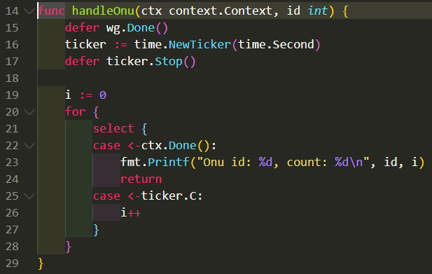

- [命令记录](#命令记录)
- [dlv使用](#dlv使用)
  - [dlv headless模式](#dlv-headless模式)
  - [修改内存](#修改内存)
  - [打印unsafe.Pointer](#打印unsafepointer)
- [记录debug gvisor](#记录debug-gvisor)
  - [设置package级别的断点](#设置package级别的断点)
  - [gvisor syscall调试](#gvisor-syscall调试)
  - [为什么`date -s`命令返回Operation not permitted](#为什么date--s命令返回operation-not-permitted)
- [记录debug adaptiveservice](#记录debug-adaptiveservice)
- [记录tengo debug](#记录tengo-debug)
- [go-prompt 性能问题调查](#go-prompt-性能问题调查)
- [内存还给OS](#内存还给os)
  - [MADV\_FREE和MADV\_DONTNEED](#madv_free和madv_dontneed)
  - [GOGC比例](#gogc比例)
- [topid申请内存错误](#topid申请内存错误)
  - [背景](#背景)
    - [错误1](#错误1)
    - [错误2](#错误2)
    - [错误3](#错误3)
  - [调查](#调查)
    - [释放内存后运行 重启后运行 -- nok](#释放内存后运行-重启后运行----nok)
    - [golang版本1.13换到1.16问题依旧](#golang版本113换到116问题依旧)
    - [和版本相关?](#和版本相关)
- [gshell server内存调试](#gshell-server内存调试)
  - [问题场景](#问题场景)
    - [操做1: 首次运行50个govm\_test](#操做1-首次运行50个govm_test)
    - [操做2: 50个govm\_test同时restart](#操做2-50个govm_test同时restart)
  - [第一次内存优化](#第一次内存优化)
    - [操做1 加上第90行的效果](#操做1-加上第90行的效果)
    - [操做2 加上第90行的效果](#操做2-加上第90行的效果)
    - [进一步优化思路](#进一步优化思路)
- [goroutine泄漏调试](#goroutine泄漏调试)
- [vscode debug模式](#vscode-debug模式)
  - [为何dlv总是提示Could not load source](#为何dlv总是提示could-not-load-source)
  - [正常的dlv使用](#正常的dlv使用)
- [一次空指针访问的panic](#一次空指针访问的panic)
  - [调用栈解析和参数解读](#调用栈解析和参数解读)
    - [切片, 字符串, 和int](#切片-字符串-和int)
    - [变长参数](#变长参数)
    - [interface](#interface)
    - [方法](#方法)
    - [参数packing](#参数packing)
    - [返回值](#返回值)
    - [结构体](#结构体)
    - [指针](#指针)
- [slice的make和append性能](#slice的make和append性能)
  - [只声明切片 -- 400 ns/op](#只声明切片----400-nsop)
  - [make 1 -- 444 ns/op](#make-1----444-nsop)
  - [make 10 -- 604 ns/op](#make-10----604-nsop)
  - [make 100 -- 2527 ns/op](#make-100----2527-nsop)
  - [更正](#更正)
  - [更正后最终版](#更正后最终版)
  - [最终版结果](#最终版结果)
  - [结论](#结论)
- [pidinfo调试](#pidinfo调试)
  - [执行测试](#执行测试)
    - [in docker](#in-docker)
    - [out docker](#out-docker)
  - [打开cpu分析](#打开cpu分析)
    - [host上profile CPU](#host上profile-cpu)
    - [pprof的refine功能](#pprof的refine功能)
- [tooManyTimer调试](#toomanytimer调试)
  - [命令记录](#命令记录-1)
  - [go tool pprof的http方式](#go-tool-pprof的http方式)
    - [内存](#内存)
    - [goroutine的情况](#goroutine的情况)
    - [同步 锁 阻塞应该也支持, 待调查](#同步-锁-阻塞应该也支持-待调查)
    - [trace](#trace)
    - [代码打开trace](#代码打开trace)
    - [不同的profile文件对比](#不同的profile文件对比)
  - [传统火焰图方式](#传统火焰图方式)
  - [代码里加调试支持](#代码里加调试支持)
    - [命令行调试: "runtime/pprof"](#命令行调试-runtimepprof)
    - [网页调试: "net/http/pprof"](#网页调试-nethttppprof)
  - [使用debug网页](#使用debug网页)
  - [使用go tool pprof](#使用go-tool-pprof)
    - [top命令](#top命令)
    - [list命令](#list命令)
    - [svg命令和perf火焰图对比](#svg命令和perf火焰图对比)
  - [对照代码片段分析: handleOnu, 主要是select](#对照代码片段分析-handleonu-主要是select)
    - [pprof svg](#pprof-svg)
    - [perf 火焰图](#perf-火焰图)
  - [对照代码片段分析: timerproc](#对照代码片段分析-timerproc)
    - [notetsleepg](#notetsleepg)
    - [问题: futex唤醒路径是干啥用的?](#问题-futex唤醒路径是干啥用的)
  - [对照代码片段分析:sysmon](#对照代码片段分析sysmon)
  - [结论](#结论-1)
- [打印调用栈](#打印调用栈)
  - [以json\_load为例](#以json_load为例)
  - [pstack打印不了go的调用栈](#pstack打印不了go的调用栈)
  - [用-SIGQUIT](#用-sigquit)
  - [注册信号handler](#注册信号handler)
  - [结果](#结果)
    - [goroutine 0](#goroutine-0)
    - [goroutine 1](#goroutine-1)
    - [用taskset -c 1强制一个核跑](#用taskset--c-1强制一个核跑)
  - [如果只有两个goroutine, 但为什么要起6个线程呢?](#如果只有两个goroutine-但为什么要起6个线程呢)

# 命令记录
```shell
# 手动访问随机debug端口
http://10.182.105.138:41259/debug/pprof
# pprof生成内存视图服务
go tool pprof -http=0.0.0.0:8000 http://10.182.105.138:41259/debug/pprof/heap
# 访问内存视图
http://10.182.105.138:64321/ui/?si=inuse_space

# debug gshell内存申请导致CPU 100%的问题.
perf record -g -p `pidof gshell` -- sleep 60
perf script | /repo/yingjieb/FlameGraph/stackcollapse-perf.pl | /repo/yingjieb/FlameGraph/flamegraph.pl > gshell.svg

go tool pprof -http=0.0.0.0:8000 http://10.182.105.138:9998/debug/pprof/profile?seconds=30
最后访问 http://10.182.105.138:60080/ui/

go test -c -o pidinfotest
./pidinfotest -test.run xxxxxx -test.bench BenchmarkP1InfoUpdate
./pidinfotest -test.run xxxxxx -test.bench .  -test.benchtime 10s

go test -run xxxxxx -bench BenchmarkP1InfoUpdate -cpuprofile cpuiter.out
go test -run xxxxxx -bench BenchmarkMapInter -cpuprofile cpuiter.out
go test -run xxxxxx -bench BenchmarkMapInter -benchtime 30s -cpuprofile cpuiter.out
go tool pprof -http=0.0.0.0:8000 cpuiter.out

go tool pprof -http=0.0.0.0:8000 --base cpuiter1.out cpuiter10.out
```

# dlv使用

## dlv headless模式
启动dlv调试server
```shell
dlv --headless exec bin/runsc -- -h
#成功后会打印
API server listening at: 127.0.0.1:37619
```
也可以指定port:
```
dlv --headless -l 127.0.0.1:37619 exec bin/runsc -- -h
```

在client侧:
```shell
dlv connect 127.0.0.1:37619
(dlv) 
# 像正常使用dlv一样
```

## 修改内存
比如我要修改一个地址的内存
```c
(dlv) x -fmt hex -size 4 0x7bf6c
0x7bf6c:   0x97ff9ee9
//也可以这样显示
(dlv) p %x *(*uint32)(0x7bf6c)

//改为0x17ff9ee8
set *(*uint32)(0x7bf6c) = 0x17ff9ee9
```

修改前:  
  
修改后:  
  

可以看到, call指令换成了jmp指令

参考: [arm64指令查看在线工具](https://armconverter.com/)

## 打印unsafe.Pointer
我在这个函数里:
`func bluepillHandler(context unsafe.Pointer)`
我想打印context
```go
(dlv) p context
unsafe.Pointer(0x4000460e20)
```
context类型实际上是`*arch.UContext64`, 但直接p会报错:
```go
(dlv)  p *(*arch.UContext64)(context)
Command failed: can not convert "context" to *struct gvisor.dev/gvisor/pkg/sentry/arch.UContext64
```
但这样可以:
```go
(dlv) p *(*arch.UContext64)(0x4000460e20)
gvisor.dev/gvisor/pkg/sentry/arch.UContext64 {
    Flags: 0,
    Link: 0,
    Stack: gvisor.dev/gvisor/pkg/abi/linux.SignalStack {Addr: 274882469888, Flags: 0, _:64, Size: 32768},
    Sigset: 0,
    _pad: [120]uint8 [88,245,3,0,64,0,0,0,0,0,0,0,0,0,0,0,8,0,0,0,0,0,0,0,0,16,0,0,0,0,0,0,8,0,0,0,0,0,0,0,8,0,0,0,0,0,0,0,8,0,0,0,0,0,0,0,32,4,7,0,64,0,0,0,...+56 more],
    _pad2: [8]uint8 [72,15,70,0,64,0,0,0],
    MContext: gvisor.dev/gvisor/pkg/sentry/arch.SignalContext64 {
        FaultAddr: 0,
        Regs: [31]uint64 [274879089664,0,2,274878169088,0,274882992368,1,1,274879089664,18446462873611930624,0,1648372627,815018159,0,0,0,274879438312,274879438160,0,0,274879438648,274879437192,274882469888,0,0,0,274879436488,25907712,274882992224,274879437992,9805828],
        Sp: 274879438000,
        Pc: 9815768,
        Pstate: 536875008,
        _pad: [8]uint8 [24,16,70,0,64,0,0,0],
        Fpsimd64: (*"gvisor.dev/gvisor/pkg/sentry/arch.FpsimdContext")(0x4000460ff0),
    },
}
```
还可以16进制显示:
```go
p %x *(*arch.UContext64)(0x4000460e20)
```

# 记录debug gvisor
## 设置package级别的断点
比如调试gvisor, 要给这个函数打断点:
```
package kernel
//@pkg/sentry/kernel/task_syscall.go
func (t *Task) executeSyscall(sysno uintptr, args arch.SyscallArguments) (rval uintptr, ctrl *SyscallControl, err error) {
    ...
}
```

在dlv里: 断点的格式是`b package.(type).func`
```go
b pkg/sentry/kernel.(*Task).executeSyscall
```
## gvisor syscall调试

先用runsc启动一个docker container
```shell
docker run --cpus=2 -m 2g --rm --runtime=runsc -it --name=test centos:7 bash
```

```go
// 先找到runsc-sandbox进程pid
./dlv attach 7014
(dlv) b kernel.(*Task).executeSyscall
//在container里面敲个回车都会触发断点
//next执行几次
(dlv) p s.Table
//设置print命令显示array的个数, 用config -list看具体各项的值
(dlv) config max-array-values 1000
(dlv) next next next ...
(dlv) p sysno                                         
1                                                     
(dlv) p s.lookup[1]                                   
gvisor.dev/gvisor/pkg/sentry/syscalls/linux/vfs2.Write

```
对应代码
```go
func (t *Task) executeSyscall(sysno uintptr, args arch.SyscallArguments) (rval uintptr, ctrl *SyscallControl, err error) {
    s := t.SyscallTable()
}
```

解释`p s.Table`的部分结果:
```go
20: {                                                               
        Name: "writev",                                             
        Fn: gvisor.dev/gvisor/pkg/sentry/syscalls/linux/vfs2.Writev,
        SupportLevel: 3,                                            
        Note: "Fully Supported.",                                   
        URLs: []string len: 0, cap: 0, nil,},            
59: {                                                               
        Name: "execve",                                             
        Fn: gvisor.dev/gvisor/pkg/sentry/syscalls/linux/vfs2.Execve,
        SupportLevel: 3,                                            
        Note: "Fully Supported.",                                   
        URLs: []string len: 0, cap: 0, nil,},                       
41: {                                                               
        Name: "socket",                                             
        Fn: gvisor.dev/gvisor/pkg/sentry/syscalls/linux/vfs2.Socket,
        SupportLevel: 3,                                            
        Note: "Fully Supported.",                                   
        URLs: []string len: 0, cap: 0, nil,},                       
321: {                                                           
        Name: "bpf",                                             
        Fn: gvisor.dev/gvisor/pkg/sentry/syscalls.CapError.func1,
        SupportLevel: 1,                                         
        Note: "Returns \"operation not permitted\" if the process
        URLs: []string len: 0, cap: 0, nil,},                    
9: {                                                              
        Name: "mmap",                                             
        Fn: gvisor.dev/gvisor/pkg/sentry/syscalls/linux/vfs2.Mmap,
        SupportLevel: 3,                                          
        Note: "Fully Supported.",                                 
        URLs: []string len: 0, cap: 0, nil,},                     
96: {                                                                
        Name: "gettimeofday",                                        
        Fn: gvisor.dev/gvisor/pkg/sentry/syscalls/linux.Gettimeofday,
        SupportLevel: 3,                                             
        Note: "Fully Supported.",                                    
        URLs: []string len: 0, cap: 0, nil,},                        
227: {                                                               
        Name: "clock_settime",                                       
        Fn: gvisor.dev/gvisor/pkg/sentry/syscalls/linux.ClockSettime,
        SupportLevel: 3,                                             
        Note: "Fully Supported.",                                    
        URLs: []string len: 0, cap: 0, nil,},                        
14: {                                                                 
        Name: "rt_sigprocmask",                                       
        Fn: gvisor.dev/gvisor/pkg/sentry/syscalls/linux.RtSigprocmask,
        SupportLevel: 3,                                              
        Note: "Fully Supported.",                                     
        URLs: []string len: 0, cap: 0, nil,},                         

```

## 为什么`date -s`命令返回Operation not permitted
首先, `date -s`调用的是系统调用`clock_settime()`, 由上面的表得知, gvisor对应的函数是`gvisor.dev/gvisor/pkg/sentry/syscalls/linux.ClockSettime`
打断点到这个函数, 然后在container里执行`date -s 12:00:00`, 就会触发断点:
```
> gvisor.dev/gvisor/pkg/sentry/syscalls/linux.ClockSettime() pkg/sentry/syscalls/linux/sys_time.go:160 (hits goroutine(600):1 total:1) (PC: 0xa140c0)                                     
Warning: debugging optimized function                                                        
(dlv) bt                                                                                     
0  0x0000000000a140c0 in gvisor.dev/gvisor/pkg/sentry/syscalls/linux.ClockSettime            
   at pkg/sentry/syscalls/linux/sys_time.go:160                                              
1  0x000000000096b776 in gvisor.dev/gvisor/pkg/sentry/kernel.(*Task).executeSyscall          
   at pkg/sentry/kernel/task_syscall.go:103                                                  
2  0x000000000096c2ed in gvisor.dev/gvisor/pkg/sentry/kernel.(*Task).doSyscallInvoke         
   at pkg/sentry/kernel/task_syscall.go:238                                                  
3  0x000000000096bfa5 in gvisor.dev/gvisor/pkg/sentry/kernel.(*Task).doSyscallEnter          
   at pkg/sentry/kernel/task_syscall.go:198                                                  
4  0x000000000096bcda in gvisor.dev/gvisor/pkg/sentry/kernel.(*Task).doSyscall               
   at pkg/sentry/kernel/task_syscall.go:173                                                  
5  0x0000000000960c45 in gvisor.dev/gvisor/pkg/sentry/kernel.(*runApp).execute               
   at pkg/sentry/kernel/task_run.go:254                                                      
6  0x000000000095f78c in gvisor.dev/gvisor/pkg/sentry/kernel.(*Task).run                     
   at pkg/sentry/kernel/task_run.go:95                                                       
7  0x000000000096a2ca in gvisor.dev/gvisor/pkg/sentry/kernel.(*Task).Start·dwrap·230         
   at pkg/sentry/kernel/task_start.go:339                                                    
8  0x0000000000469321 in runtime.goexit                                                

```

而这个函数直接返回`linuxerr.EPERM`
```go
// ClockSettime implements linux syscall clock_settime(2).
func ClockSettime(*kernel.Task, arch.SyscallArguments) (uintptr, *kernel.SyscallControl, error) {
    return 0, nil, linuxerr.EPERM
}
```


# 记录debug adaptiveservice
```shell
# 注意要用./binary的形式
# 给binary传参数用--
dlv exec ./echo -- -c -cmd timeout -d

# 断点
b main.main
b (*timeouter).SetTimeout
```

# 记录tengo debug
```shell
# dlv exec执行一个程序, 可以带参数
dlv exec bin/gshell example/govm_test.gsh
# 程序停在最开始阶段

# 设断点
(dlv) b SourcePos
Breakpoint 1 set at 0x52670f for github.com/d5/tengo/v2.(*CompiledFunction).SourcePos() /repo/yingjieb/github/godevsig/tengo/objects.go:609

# continue, 程序停在断点
(dlv) c

# 开始debug, bt, p等常用gdb命令是一样的
(dlv) l
> github.com/d5/tengo/v2.(*CompiledFunction).SourcePos() /repo/yingjieb/github/godevsig/tengo/objects.go:610 (PC: 0x52671d)
Warning: debugging optimized function
   605:         return false
   606: }
   607:
   608: // SourcePos returns the source position of the instruction at ip.
   609: func (o *CompiledFunction) SourcePos(ip int) parser.Pos {
=> 610:         for ip >= 0 {
   611:                 if p, ok := o.SourceMap[ip]; ok {
   612:                         return p
   613:                 }
   614:                 ip--
   615:         }

(dlv) p o
*github.com/d5/tengo/v2.CompiledFunction {
        ObjectImpl: github.com/d5/tengo/v2.ObjectImpl {},
        Instructions: []uint8 len: 43, cap: 64, [22,0,3,0,0,2,18,0,0,8,20,1,0,2,34,33,0,0,6,0,0,6,0,0,6,0,0,6,0,0,6,20,5,0,2,30,0,20,0,0,2,21,0],
        NumLocals: 0,
        NumParameters: 0,
        VarArgs: false,
        SourceMap: map[int]github.com/d5/tengo/v2/parser.Pos nil,
        Free: []*github.com/d5/tengo/v2.ObjectPtr len: 1, cap: 1, [
                *(*"github.com/d5/tengo/v2.ObjectPtr")(0xc00000e938),
        ],}
(dlv) p ip
32

# 可以调用任意函数
(dlv) call FormatInstructions(o.Instructions, 0)
> github.com/d5/tengo/v2.(*CompiledFunction).SourcePos() /repo/yingjieb/github/godevsig/tengo/objects.go:610 (PC: 0x52671d)
Warning: debugging optimized function
Values returned:
        ~r2: []string len: 18, cap: 32, [
                "0000 GETG    3    ",
                "0003 CONST   2    ",
                "0006 INDEX  ",
                "0007 CONST   8    ",
                "0010 CALL    1     0    ",
                "0013 POP    ",
                "0014 BUILTIN 33   ",
                "0016 CONST   6    ",
                "0019 CONST   6    ",
                "0022 CONST   6    ",
                "0025 CONST   6    ",
                "0028 CONST   6    ",
                "0031 CALL    5     0    ",
                "0034 POP    ",
                "0035 GETF    0    ",
                "0037 CALL    0     0    ",
                "0040 POP    ",
                "0041 RET     0    ",
        ]

# 新增断点, 重新run这个程序
(dlv) b postRun
(dlv) restart //会停在刚开始
(dlv) c
# 停在func (v *VM) postRun() (err error)
(dlv) p v.framesIndex
3
(dlv) p v.curFrame
*github.com/d5/tengo/v2.frame {
        fn: *github.com/d5/tengo/v2.CompiledFunction {
                ObjectImpl: github.com/d5/tengo/v2.ObjectImpl {},
                Instructions: []uint8 len: 43, cap: 64, [22,0,3,0,0,2,18,0,0,8,20,1,0,2,34,33,0,0,6,0,0,6,0,0,6,0,0,6,0,0,6,20,5,0,2,30,0,20,0,0,2,21,0],
                NumLocals: 0,
                NumParameters: 0,
                VarArgs: false,
                SourceMap: map[int]github.com/d5/tengo/v2/parser.Pos nil,
                Free: []*github.com/d5/tengo/v2.ObjectPtr len: 1, cap: 1, [
                        *(*"github.com/d5/tengo/v2.ObjectPtr")(0xc00000e9b0),
                ],},
        freeVars: []*github.com/d5/tengo/v2.ObjectPtr len: 1, cap: 1, [
                *(*"github.com/d5/tengo/v2.ObjectPtr")(0xc00000e9b0),
        ],
        ip: 0,
        basePointer: 5,}
(dlv) p v.ip
33
```

# go-prompt 性能问题调查
go-prompt时一个交互式cli框架, 但似乎性能有点问题. 一个简单的cli例子程序CPU就占了10%.  
基于go-prompt的abs也一样空跑都占比10%以上.
看火焰图似乎是timer的使用问题.  
  
原因在于  
```go
func (p *Prompt) Run() {
    for {
        select {
            default:
            //有default就是非阻塞, 这里sleep 10ms
                time.Sleep(10 * time.Millisecond)
        }
    }
}
```

# 内存还给OS
## MADV_FREE和MADV_DONTNEED
go1.12版本中, gc把不用的内存还给OS时, 调用了`int madvise(void *addr, size_t length, int advice)`, 使用了`MADV_FREE`标记. `man madvise`说的很清楚, 虽然内存还给了OS, 但OS只有在系统内存不够时才回收. 导致go程序虽然认为自己已经还了内存给OS, 但其RSS一直居高不下.
> On Linux, the runtime now uses MADV_FREE to release unused memory. This is more efficient but may result in higher reported RSS. The kernel will reclaim the unused data when it is needed. To revert to the Go 1.11 behavior (MADV_DONTNEED), set the environment variable GODEBUG=madvdontneed=1.

go1.11及之前, gc用`MADV_DONTNEED`来还内存给OS, RSS会马上下降.
理论说法是, `MADV_FREE`性能更好, 但会导致RSS的值不准确. 实际上, 随着gc算法的提高, OS的`MADV_FREE` lazy回收模式, 就没有太大意义了.
go1.16版本又把`MADV_DONTNEED`的行为做为默认了.

注意: 如果用`GODEBUG=madvdontneed=1`还是不能让RSS下降, 需要搭配强制gc的方法, 否则一般情况下, gc要很长时间, 比如几分钟, 才工作.

go1.13里面有个优化提到: 之前, gc会持有内存5分钟或更长时间才开始还给OS, 但1.13会更积极的还内存.
> The runtime is now more aggressive at returning memory to the operating system to make it available to co-tenant applications. Previously, the runtime could retain memory for five or more minutes following a spike in the heap size. It will now begin returning it promptly after the heap shrinks. However, on many OSes, including Linux, the OS itself reclaims memory lazily, so process RSS will not decrease until the system is under memory pressure.

参考:
https://golang.org/pkg/runtime/ 搜索`madvdontneed`
下面就是最新的1.16版本的说法:
> madvdontneed: setting madvdontneed=0 will use MADV_FREE
instead of MADV_DONTNEED on Linux when returning memory to the
kernel. This is more efficient, but means RSS numbers will
drop only when the OS is under memory pressure.

[https://golang.org/doc/go1.12#runtime](https://golang.org/doc/go1.12#runtime "https://golang.org/doc/go1.12#runtime")
https://vec.io/posts/golang-and-memory

## GOGC比例
GOGC默认是100, 即新分配的内存和上次gc完成时剩下的内存的比例是1:1时, gc才启动. 也就是说, 只有内存翻了一倍时, gc才开始收集垃圾.
想控制RSS占用的话, GOGC设置小一点.

# topid申请内存错误
## 背景
某次版本后, topid启动马上出错:
每次栈还不一样, 但最后都是`runtime.mallocgc`的栈
### 错误1
```shell
~ # ./topid -tag ZAPPING_MCASTV4_v2 -p 1 -tree
Hello 你好 Hola Hallo Bonjour Ciao Χαίρετε こんにちは 여보세요
Version: 0.1.4
runtime: s.allocCount= 3 s.nelems= 5
fatal error: s.allocCount != s.nelems && freeIndex == s.nelems

goroutine 1 [running]:
runtime.throw(0x1a8caa, 0x31)
        runtime/panic.go:774 +0x54 fp=0x40000a0ca0 sp=0x40000a0c70 pc=0x3bc84
runtime.(*mcache).nextFree(0x7f82a2a6d0, 0xa2f47, 0x4000000180, 0x200000003, 0x4000000180)
        runtime/malloc.go:852 +0x204 fp=0x40000a0cf0 sp=0x40000a0ca0 pc=0x1aa44
runtime.mallocgc(0x600, 0x15d600, 0x1, 0x0)
        runtime/malloc.go:1022 +0x688 fp=0x40000a0db0 sp=0x40000a0cf0 pc=0x1b0e8
runtime.makeslice(0x15d600, 0x600, 0x600, 0x0)
        runtime/slice.go:49 +0x74 fp=0x40000a0de0 sp=0x40000a0db0 pc=0x51364
bytes.makeSlice(0x600, 0x0, 0x0, 0x0)
        bytes/buffer.go:229 +0x64 fp=0x40000a0e50 sp=0x40000a0de0 pc=0x7af84
bytes.(*Buffer).grow(0x40000a0f80, 0x200, 0x200)
        bytes/buffer.go:142 +0x12c fp=0x40000a0ea0 sp=0x40000a0e50 pc=0x7aabc
bytes.(*Buffer).ReadFrom(0x40000a0f80, 0x1d39e0, 0x4000081268, 0x3, 0x0, 0x0)
        bytes/buffer.go:202 +0x48 fp=0x40000a0f10 sp=0x40000a0ea0 pc=0x7ada8
io/ioutil.readAll(0x1d39e0, 0x4000081268, 0x200, 0x0, 0x0, 0x0, 0x0, 0x0)
        io/ioutil/ioutil.go:36 +0xb0 fp=0x40000a0fb0 sp=0x40000a0f10 pc=0x12bb80
io/ioutil.ReadAll(...)
        io/ioutil/ioutil.go:45
pidinfo.(*TidInfo).updateStat(0x40001830e0, 0x0, 0x0)
        pidinfo/pidinfo.go:486 +0x190 fp=0x40000a10f0 sp=0x40000a0fb0 pc=0x12d510
pidinfo.(*PidInfo).update(0x40001830e0, 0x40001472a0, 0x0)
        pidinfo/pidinfo.go:799 +0x2c fp=0x40000a1190 sp=0x40000a10f0 pc=0x13017c
pidinfo.newPidInfo(0x28e, 0x40000bee10, 0x28e, 0x2f4f20, 0x0)
        pidinfo/pidinfo.go:631 +0x2f8 fp=0x40000a1280 sp=0x40000a1190 pc=0x12e478
```

### 错误2
```shell
~ # Hello 你好 Hola Hallo Bonjour Ciao Χαίρετε こんにちは 여보세요
Version: 0.1.4
Visit below URL to get the chart:
http://10.182.105.138:9888/ZAPPING_MCASTV4_v2/1992780262
runtime: s.allocCount= 3 s.nelems= 5
fatal error: s.allocCount != s.nelems && freeIndex == s.nelems

goroutine 1 [running]:
runtime.throw(0x1a8caa, 0x31)
        runtime/panic.go:774 +0x54 fp=0x40000a0b00 sp=0x40000a0ad0 pc=0x3bc84
runtime.(*mcache).nextFree(0x7f887a26d0, 0xa2f47, 0x4000000180, 0x200000003, 0x4000000180)
        runtime/malloc.go:852 +0x204 fp=0x40000a0b50 sp=0x40000a0b00 pc=0x1aa44
runtime.mallocgc(0x600, 0x15d600, 0x1, 0x0)
        runtime/malloc.go:1022 +0x688 fp=0x40000a0c10 sp=0x40000a0b50 pc=0x1b0e8
runtime.makeslice(0x15d600, 0x600, 0x600, 0x0)
        runtime/slice.go:49 +0x74 fp=0x40000a0c40 sp=0x40000a0c10 pc=0x51364
bytes.makeSlice(0x600, 0x0, 0x0, 0x0)
        bytes/buffer.go:229 +0x64 fp=0x40000a0cb0 sp=0x40000a0c40 pc=0x7af84
bytes.(*Buffer).grow(0x40000a0de0, 0x200, 0x200)
        bytes/buffer.go:142 +0x12c fp=0x40000a0d00 sp=0x40000a0cb0 pc=0x7aabc
bytes.(*Buffer).ReadFrom(0x40000a0de0, 0x1d39e0, 0x40000851b8, 0xb7bc4, 0x40001354e0, 0x12)
        bytes/buffer.go:202 +0x48 fp=0x40000a0d70 sp=0x40000a0d00 pc=0x7ada8
io/ioutil.readAll(0x1d39e0, 0x40000851b8, 0x200, 0x0, 0x0, 0x0, 0x0, 0x0)
        io/ioutil/ioutil.go:36 +0xb0 fp=0x40000a0e10 sp=0x40000a0d70 pc=0x12bb80
io/ioutil.ReadFile(0x40001354e0, 0x12, 0x0, 0x0, 0x0, 0x0, 0x0)
        io/ioutil/ioutil.go:73 +0xc4 fp=0x40000a0eb0 sp=0x40000a0e10 pc=0x12bcf4
pidinfo.(*PidInfo).init(0x40001a84b0, 0xa, 0x1d6860)

```

### 错误3
```shell
./topid -tag ZAPPING_MCASTV4_v2 -p 1 -chartserver 10.182.105.138:9887 -i 3 -c 3600 -record -sys -child &
~ # Hello \xe4\xbd\xa0\xe5\xa5\xbd Hola Hallo Bonjour Ciao \xce\xa7\xce\xb1\xce\xaf\xcf\x81\xce\xb5\xcf\x84\xce\xb5 \xe3\x81\x93\xe3\x82\x93\xe3\x81\xab\xe3\x81\xa1\xe3\x81\xaf \xec\x97\xac\xeb\xb3\xb4\xec\x84\xb8\xec\x9a\x94
Version: 0.1.4
Visit below URL to get the chart:
http://10.182.105.138:9888/ZAPPING_MCASTV4_v2/2938934727
runtime: s.allocCount= 492 s.nelems= 512
fatal error: s.allocCount != s.nelems && freeIndex == s.nelems

goroutine 1 [running]:
runtime.throw(0x1a8caa, 0x31)
    runtime/panic.go:774 +0x54 fp=0x4000040b50 sp=0x4000040b20 pc=0x3bc84
runtime.(*mcache).nextFree(0x7f9c7ab6d0, 0x51305, 0x4000040c08, 0x38e8c, 0x4000040c18)
    runtime/malloc.go:852 +0x204 fp=0x4000040ba0 sp=0x4000040b50 pc=0x1aa44
runtime.mallocgc(0x8, 0x15d400, 0x0, 0x0)
    runtime/malloc.go:998 +0x4f4 fp=0x4000040c60 sp=0x4000040ba0 pc=0x1af54
runtime.convT64(0x1, 0x7f9a53ef28)
    runtime/iface.go:352 +0x5c fp=0x4000040c90 sp=0x4000040c60 pc=0x18d0c
internal/poll.errnoErr(...)
    internal/poll/errno_unix.go:32
internal/poll.(*pollDesc).init(0x4000219338, 0x4000219320, 0x1, 0x4000219320)
    internal/poll/fd_poll_runtime.go:45 +0x8c fp=0x4000040cd0 sp=0x4000040c90 pc=0xb312c
internal/poll.(*FD).Init(0x4000219320, 0x19fa28, 0x4, 0x1, 0x40001fe800, 0x0)
    internal/poll/fd_unix.go:63 +0x68 fp=0x4000040d00 sp=0x4000040cd0 pc=0xb3888
os.newFile(0x5, 0x40001fe7e0, 0x12, 0x1, 0x4000000000)
    os/file_unix.go:151 +0xe8 fp=0x4000040d60 sp=0x4000040d00 pc=0xb6ed8
os.openFileNolog(0x40001fe7e0, 0x12, 0x0, 0x0, 0x8, 0x12, 0x40001fe7e0)
    os/file_unix.go:222 +0x19c fp=0x4000040dc0 sp=0x4000040d60 pc=0xb715c
os.OpenFile(0x40001fe7e0, 0x12, 0x0, 0x0, 0x2, 0x40001fe7e0, 0x40001fe7ea)
    os/file.go:300 +0x54 fp=0x4000040e10 sp=0x4000040dc0 pc=0xb6964
os.Open(...)
    os/file.go:280
io/ioutil.ReadFile(0x40001fe7e0, 0x12, 0x0, 0x0, 0x0, 0x0, 0x0)
    io/ioutil/ioutil.go:53 +0x48 fp=0x4000040eb0 sp=0x4000040e10 pc=0x12bc78
pidinfo.(*PidInfo).init(0x400020d1d0, 0xa, 0x1d6860)
    pidinfo/pidinfo.go:587 +0x130 fp=0x4000040f50 sp=0x4000040eb0 pc=0x12dfe0
```

## 调查
### 释放内存后运行 重启后运行 -- nok
看起来是内存申请失败, 那么先系统内存的情况:
```shell
~ # free -m
              total        used        free      shared  buff/cache   available
Mem:            853         533           8         115         312         179
Swap:             0           0           0
```
强制释放内存试一下:
```shell
echo 3 > /proc/sys/vm/drop_caches
```
再看一下内存:
```shell
~ # free -m
              total        used        free      shared  buff/cache   available
Mem:            853         537         103         115         212         175
Swap:             0           0           0
```
有103M了, topid通常是占用RSS 6M, 那么100M应该是够了.
但运行还是一样的`runtime.mallocgc`之后`runtime.(*mcache).nextFree`错误.

重启板子再运行, 也是出错.

### golang版本1.13换到1.16问题依旧
注意1.16默认使用go mod, 需要手动off掉
```shell
export GOPATH=`pwd`
GOARCH=arm64 GO111MODULE=off go build topid.go
```

### 和版本相关?
288版本是好的, 289版本就不行了..
kernel改了什么?

# gshell server内存调试
## 问题场景
正常一个govm_test应该是11秒结束. 这里的问题主要是内存问题.  
有人可能问了, go不是自动gc的吗? 为什么内存还有问题?  
这个要仔细看下面的内容了.

### 操做1: 首次运行50个govm_test
起50个govm_test  
htop显示内存46M  
显示 Inuse 62M  
```
# HeapAlloc = 59398296
# HeapSys = 133005312
# HeapIdle = 70754304
# HeapInuse = 62251008
# HeapReleased = 64618496
# HeapObjects = 31588
```

`go tool pprof -http=0.0.0.0:8000 http://10.182.105.138:42459/debug/pprof/heap`得到:  
  
大部分是shallowClone产生的  
  

### 操做2: 50个govm_test同时restart
现象是同时restart后, 系统24核CPU占用100%持续大概1分钟, 每个govm_test的结束时间长至50秒左右.  
htop显示物理内存上升到129M, 多做几次restart会升到200多M. 200多M的时候, 有的时候就不会100%CPU了.
```shell
perf record -g -p `pidof gshell` -- sleep 60
perf script | /repo/yingjieb/FlameGraph/stackcollapse-perf.pl | /repo/yingjieb/FlameGraph/flamegraph.pl > gshell.svg
```
火焰图显示  
  
绝大部分时间在`runtime.newobject`函数里.  
用go tool的objdump可以看到, `runtime.newobject`是从堆分配的关键函数, 由编译器插入.

## 第一次内存优化
源码的逻辑是新建个clone的VM来运行, 运行结束后其实就不用了.  
注意:第90行是新加的, 上面的实验数据是没有第90行的数据.  
  
这个函数在最后把gvm返回了, 被当作一个对象保存在上级VM的stack上.  
  

### 操做1 加上第90行的效果
既然gvm会被引用到, 那gvm.VM也不会被gc. 但实际上, 这个子VM已经执行完毕, 可以安全的释放了.  
加了第90行来让gc可以回收这个VM.

同样运行50个govm_test, htop显示物理内存45M, 和之前一样.  
但pprof显示, Inuse小了不少, 整体的HeapSys也比之前小了一半.
```
# HeapAlloc = 34263112
# HeapSys = 65961984
# HeapIdle = 29892608
# HeapInuse = 36069376
# HeapReleased = 18497536
# HeapObjects = 46161
```
有经过一小会, 稳定后Inuse更小了, 为11M左右.
```
# HeapAlloc = 9485592
# HeapSys = 65994752
# HeapIdle = 54206464
# HeapInuse = 11788288
# HeapReleased = 52912128
# HeapObjects = 25051
```

pprof的top也显示, 没有了50M的shallowClone的占用. 效果非常明显!

  

### 操做2 加上第90行的效果
运行2次后, 还是会100%, 但感觉时间短了些. govm_test会在15秒左右结束.  
看火焰图还是在`runtime.newobject`  
  

pprof显示HeapInuse为14M.也不是多很多, 但HeapIdle为117M, 说明有大量的内存申请过但已经使用完毕.
```
# HeapAlloc = 10403200
# HeapSys = 131563520
# HeapIdle = 117334016
# HeapInuse = 14229504
# HeapReleased = 116457472
# HeapObjects = 37464
```

第三次以后再全部restart, 占用就很低了, 最多只占单核的10%左右, 一般2%. 内存稳定再110M左右.  
我很好奇现在的火焰图, 于是抓了一个:  
  
`runtime.newobject`变得非常小了

govm_test的"应用逻辑"其实占比非常小, 占的多的主要是:
* park_m stop_m等熟悉的goroutine和M的结合动作.
* time.Sleep
* futext相关.

### 进一步优化思路
需要在VM运行结束后, 重置stack和frame的空间.去掉object的引用, 触发gc的回收.
固定size的array
```
stack       [StackSize]Object
frames      [MaxFrames]frame
```
变为slice, 按需append
```
stack       []Object
frames      []frame
```

* 把静态的内存分配改成动态append方式, 给个比较小的初始值, 动态扩展.
* 在VM运行完毕后, 通过把frame和stack置为nil的方式, 告诉gc释放内存.

具体修改见[这个commit](https://github.com/godevsig/tengo/commit/4cfaeebd522880ab8b5f8ed2123b333c8b3a5cb4)

结果是全部restart场景下, 完全没有24核100%占用的情况;htop观察到物理内存稳定峰值从之前的200M降低到20M.  
实际上, idle后使用的内存大约为10M.  
但并发的峰值减小更能说明, 在重启50个VM时候, 由于govm_test内部会起大概10个VM, 一共500个 VM, 并没有同时申请大量内存.


# goroutine泄漏调试
topid程序改成goroutine版本之后, 出了很多很典型的并发问题. 其中有channel和goroutine的生命周期没配合好, 导致的卡死问题. 即channel发送或者读取的"对端"goroutine异常条件退出了, 但没有处理好channel的善后, 导致对方卡住在channel操作. 

但goroutine还是在泄漏.

问题的根源在于, 靠树形结构的上一级节点来触发下一级动作的时候, 程序的思路是:  
假设进程A的子进程有[B1 B2 B3], 在下一次触发的时候, A的子进程变成了[B2 B3 B4]  
其内在逻辑是, kernel报告B1进程退出了, 但是这里的逻辑是只新建B4的pidinfo结构.  
那么B1的守护进程处于什么状态呢?  
答案是B1会永远等待触发channel, 但永远没有人会写这个channel. 因为B1已经从A的子树里拿掉了.  
这样就造成了goroutine的泄漏.  
解决办法是在B1的守护进程里, 同时监听(select) cleanup channel, A除了要处理新建的B4, 还要负责触发B1的cleanup

另外一个场景是 A -> B -> C的进程链, 如果B和C同时(一秒内)都消亡了, 那么按照A触发B, B再触发C的cleanup逻辑, C永远不能被触发, 因为树从顶向下, 先触发B的cleanup, 而C就没有机会被B cleanup.  
解决办法是再A触发B的cleanup时, 递归的触发B的所有子树的cleanup.

# vscode debug模式
参考文档: https://github.com/golang/vscode-go/blob/master/docs/debugging.md#remote-debugging

修改lauch.json
```json
{
    // Use IntelliSense to learn about possible attributes.
    // Hover to view descriptions of existing attributes.
    // For more information, visit: https://go.microsoft.com/fwlink/?linkid=830387
    "version": "0.2.0",
    "configurations": [
        {
            "name": "Launch",
            "type": "go",
            "request": "launch",
            "mode": "auto",
            "program": "/repo/yingjieb/godev/practice/src/tools/topid.go",
            "env": {"GOPATH":"/go:/repo/yingjieb/godev/practice"},
            "args": ["-p", "1", "-tree"]
        }
    ]
}
```
注意env和args的用法

另外一个更通用的配置:
下面这个默认的配置直接就能用.
```json
{
    // Use IntelliSense to learn about possible attributes.
    // Hover to view descriptions of existing attributes.
    // For more information, visit: https://go.microsoft.com/fwlink/?linkid=830387
    "version": "0.2.0",
    "configurations": [
        {
            "name": "Launch",
            "type": "go",
            "request": "launch",
            "mode": "auto",
            "program": "${fileDirname}",
            "env": {},
            "args": []
        }
    ]
}
```
还是这个链接有详细的说明: https://github.com/golang/vscode-go/blob/master/docs/debugging.md#using-vs-code-variables

## 为何dlv总是提示Could not load source
即使直接启动dlv也有这个问题:
```go
dlv exec examples/interoperability/interoperability
(dlv) b main.main
Breakpoint 1 set at 0x5014eb for main.main() github.com/d5/tengo/v2@/examples/interoperability/main.go:185
(dlv) c
//能断点, 能bt
(dlv) bt
0  0x00000000005014eb in main.main
   at github.com/d5/tengo/v2@/examples/interoperability/main.go:185
1  0x000000000042cbf6 in runtime.main
   at runtime/proc.go:203
2  0x0000000000456c31 in runtime.goexit
   at runtime/asm_amd64.s:1357
//但不能看代码, why????
(dlv) l
> main.main() github.com/d5/tengo/v2@/examples/interoperability/main.go:185 (hits goroutine(1):1 total:1) (PC: 0x5014eb)
Warning: debugging optimized function
Command failed: open github.com/d5/tengo/v2@/examples/interoperability/main.go: no such file or directory
```
因为我hack了go命令, 添加了`-trimpath`, 这个选项把文件名搞成了相对路径了(短路径). 而dlv依赖绝对路径来debug...
去掉`-trimpath`就好了.

## 正常的dlv使用
```go
dlv exec ./interoperability
(dlv) b main.main
Breakpoint 1 set at 0x5014eb for main.main() ./main.go:185
(dlv) c
> main.main() ./main.go:185 (hits goroutine(1):1 total:1) (PC: 0x5014eb)
Warning: debugging optimized function
//能直接显示代码

```

# 一次空指针访问的panic
```go
yingjieb@3a9f377eee5d /repo/yingjieb/godev/practice/src/pidinfo
$ go test -run xxxxxx -bench BenchmarkP1InfoUpdate -cpuprofile cpuiter.out
goos: linux
goarch: amd64
pkg: pidinfo
BenchmarkP1InfoUpdate-23        panic: runtime error: invalid memory address or nil pointer dereference
[signal SIGSEGV: segmentation violation code=0x1 addr=0x50 pc=0x5046c9]

goroutine 54 [running]:
pidinfo.(*PidInfo).updateTime(0x0, 0x0, 0x0)
        /repo/yingjieb/godev/practice/src/pidinfo/pidinfo.go:227 +0x59
pidinfo.(*PidInfo).Update(0x0, 0xc0000905d0, 0x6f7e)
        /repo/yingjieb/godev/practice/src/pidinfo/pidinfo.go:302 +0x32
pidinfo.(*PidInfo).updateChildren(0xc0001e03c0, 0x0, 0x0)
        /repo/yingjieb/godev/practice/src/pidinfo/pidinfo.go:206 +0x35e
pidinfo.(*PidInfo).Update(0xc0001e03c0, 0xc000090570, 0x4507)
        /repo/yingjieb/godev/practice/src/pidinfo/pidinfo.go:307 +0x70
pidinfo.(*PidInfo).updateChildren(0xc0001e0320, 0x0, 0x0)
        /repo/yingjieb/godev/practice/src/pidinfo/pidinfo.go:206 +0x35e
pidinfo.(*PidInfo).Update(0xc0001e0320, 0xc000090450, 0x11)
        /repo/yingjieb/godev/practice/src/pidinfo/pidinfo.go:307 +0x70
pidinfo.(*PidInfo).updateChildren(0xc0001e00a0, 0x0, 0x0)
        /repo/yingjieb/godev/practice/src/pidinfo/pidinfo.go:206 +0x35e
pidinfo.(*PidInfo).Update(0xc0001e00a0, 0xc000090270, 0xc000451d68)
        /repo/yingjieb/godev/practice/src/pidinfo/pidinfo.go:307 +0x70
pidinfo.(*PidInfo).updateChildren(0xc0001e0000, 0x0, 0x0)
        /repo/yingjieb/godev/practice/src/pidinfo/pidinfo.go:216 +0x2c1
pidinfo.(*PidInfo).Update(0xc0001e0000, 0x0, 0x0)
        /repo/yingjieb/godev/practice/src/pidinfo/pidinfo.go:307 +0x70
pidinfo.BenchmarkP1InfoUpdate(0xc0001f41c0)
        /repo/yingjieb/godev/practice/src/pidinfo/pidinfo_test.go:77 +0x16f
testing.(*B).runN(0xc0001f41c0, 0x5b8)
        /usr/local/go/src/testing/benchmark.go:190 +0xcc
testing.(*B).launch(0xc0001f41c0)
        /usr/local/go/src/testing/benchmark.go:320 +0x10c
created by testing.(*B).doBench
        /usr/local/go/src/testing/benchmark.go:275 +0x55
exit status 2
FAIL    pidinfo 0.592s
```
* error应该是占两个"位置"
* 能打出调用栈来的, 那返回值的位置**没有**意义, 因为底层函数还没有返回.

## 调用栈解析和参数解读
经常看到, 调用栈打印的参数比函数定义时的参数个数要多, 为什么呢?  
原文: https://www.ardanlabs.com/blog/2015/01/stack-traces-in-go.html

这要理解不同类型参数的传递规则:
### 切片, 字符串, 和int
```go
// Declaration
main.Example(slice []string, str string, i int)

// Call to Example by main.
slice := make([]string, 2, 4)
Example(slice, "hello", 10)

// Stack trace
main.Example(0x2080c3f50, 0x2, 0x4, 0x425c0, 0x5, 0xa)

//解释切片:
// Slice header values
Pointer:  0x2080c3f50
Length:   0x2
Capacity: 0x4

//解释字符串
// String parameter value
"hello"

// String header values
Pointer: 0x425c0
Length:  0x5
```

我实验的版本
```go
package main

import "fmt"

func main() {
    slice := make([]string, 2, 4)
    m := map[string]int{"1st": 1, "2nd": 100}
    Example(slice, "hello", 0x88, m)
}

func Example(slice []string, str string, i int, m map[string]int) {
    fmt.Println(slice, str, i, m) //没有这行fmt, 似乎结果里的参数只显示..., 应该是编译器自动优化过了
    panic("Want stack trace")
}

//结果:
$ ./tmp
[ ] hello 136 map[1st:1 2nd:100]
panic: Want stack trace

goroutine 1 [running]:
main.Example(0xc0000c8040, 0x2, 0x4, 0x4c24f9, 0x5, 0x88, 0xc0000cc000)
        /repo/yingjieb/godev/practice/src/misc/tmp.go:13 +0x16c
main.main()
        /repo/yingjieb/godev/practice/src/misc/tmp.go:8 +0x114
```
注意0x88后面那个map, 只占一个位置, 所以map是个指针.

* 切片是个三个值的结构, 指针, len和cap  
  
* 字符串是2个值的结构, 指针, len  
  
* 整型参数就是一个值
* map参数是一个位置

### 变长参数
比如
```go
func panicFmt(v ...interface{}) {
    ...
    主动panic
}
#在main里调用
panicFmt(1,2,3)
或
panicFmt(1, 2, 3, 4, "hello")

#结果
goroutine 1 [running]:
main.panicFmt(0xc0000a2150, 0x3, 0x3)
```

结论: 不管有多少个入参, 都是先组成一个slice, 再传给panicFmt函数.
slice的表达是3个值.

### interface
interface是2个值, 准确的说是两个指针
```go
type eface struct { // 16 bytes
    _type *_type
    data  unsafe.Pointer
}

type iface struct { // 16 bytes
    tab  *itab
    data unsafe.Pointer
}
```


### 方法
对象的方法调用, call trace的第一个参数是那个对象

### 参数packing
如果参数拼在一起能够放在一个word里, 那么go会自动的把这几个参数**pack**在一个word里, 放在栈上传递  
下面的例子中, 3个bool变量和一个uint8被拼在一个32位的"参数"里
bool类型也是8bit
```go
01 package main
02
03 func main() {
04     Example(true, false, true, 25)
05 }
06
07 func Example(b1, b2, b3 bool, i uint8) {
08     panic("Want stack trace")
09 }

//结果:
01 goroutine 1 [running]:
02 main.Example(0x19010001)
           /Users/bill/Spaces/Go/Projects/src/github.com/goinaction/code/
           temp/main.go:8 +0x64
03 main.main()
           /Users/bill/Spaces/Go/Projects/src/github.com/goinaction/code/
           temp/main.go:4 +0x32
```
解释: 感觉是先拼第一个原始参数, 移位, 再拼第二个原始参数...
```go
// Parameter values
true, false, true, 25

// Word value
Bits    Binary      Hex   Value
00-07   0000 0001   01    true
08-15   0000 0000   00    false
16-23   0000 0001   01    true
24-31   0001 1001   19    25

// Declaration
main.Example(b1, b2, b3 bool, i uint8)

// Stack trace
main.Example(0x19010001)
```

### 返回值
返回值在对象, 入参之后. 这个例子来说, 最后的两个值就是返回值. 如果是返回int和string, 那string是两个值(指针和长度)
```go
func f(a, b int) (sum int, tag int) {
    c := a + b
    fmt.Println(c)
    if c > 64 {
        panic("aaaaa")
    }

    fmt.Printf("%p\n", &c)
    return c, c+10
}

func main() {
    f(2, 5)
    f(64, 8)
}

//输出:
7
0xc000020028
72
panic: aaaaa

goroutine 1 [running]:
//返回值好像也是在栈里的, 第三个值和第四个值其实是上次的返回值.
//本次还没有返回值就panic了, 返回值是栈里的值. 正好是上次留下来的返回值
main.f(0x40, 0x8, 0x7, 0x11)
    /repo/yingjieb/godev/practice/src/benchmarks/hashmap/pidinfomap.go:9 +0x167
main.main()
    /repo/yingjieb/godev/practice/src/benchmarks/hashmap/pidinfomap.go:18 +0x49
exit status 2
```

### 结构体
结构体(非结构体指针)不管是入参还是返回值, 都直接展开在栈上传递
比如
```go
type eee struct {
    a,b,c,d,e int
    s string
}

func f(a, b int, e eee)  {
    c := a + b
    fmt.Println(c)
    if c > 64 {
        panic("aaaaa")
    }

    fmt.Printf("%p\n", &c)
    //return eee{1, 2, 3, 4, 5, "sssssss"}
}

f(64, 8, eee{1, 2, 3, 4, 5, "sssssss"})
//panic的时候
goroutine 1 [running]:
main.f(0x40, 0x8, 0x1, 0x2, 0x3, 0x4, 0x5, 0x4c3839, 0x7)
```

### 指针
callstack里面, 指针只占一个位置.

# slice的make和append性能
还是在pidinfo代码里面
被测函数根据map, 创建个切片返回
```go
// Children returns first level children nodes
func (pi *PidInfo) Children() []*PidInfo {
    //后面的几个测试都只改这里, 主要是改children切片的初始化方法
    //不同的方式差别非常大
    var children []*PidInfo
    //children := make([]*PidInfo, 100)

    for _, child := range pi.children {
        children = append(children, child)
    }
    return children
}
```
其测试代码如下:
```go
func BenchmarkMapInter(b *testing.B) {
    pi, err := NewPidInfo(1, true)
    if err != nil {
        b.Errorf("main: %v\n", err)
        return
    }
    if err := pi.Update(); err != nil {
        b.Errorf("main: %v\n", err)
        return
    }
    b.ResetTimer()
    for i := 0; i < b.N; i++ {
        _ = pi.Children()
    }
}
```

本意是想测试map表的遍历效率, 没想到切片的make和append效率才是瓶颈. 应该和切片的类型是结构体指针有关.

## 只声明切片 -- 400 ns/op
  
迭代map占比25%, 切片操作占比56%. 为什么切片比map还费事呢?  
看起来对切片的操作append是runtime.growslice, 而它会调用mallocgc申请内存.  
为什么要创建gc呢? 所有类型的切片都要创建GC吗? 这个创建gc的动作和切片的size有关吗?
```go
// growslice handles slice growth during append.
// It is passed the slice element type, the old slice, and the desired new minimum capacity,
// and it returns a new slice with at least that capacity, with the old data
// copied into it.
// The new slice's length is set to the old slice's length,
// NOT to the new requested capacity.
// This is for codegen convenience. The old slice's length is used immediately
// to calculate where to write new values during an append.
// TODO: When the old backend is gone, reconsider this decision.
// The SSA backend might prefer the new length or to return only ptr/cap and save stack space.
func growslice(et *_type, old slice, cap int) slice {
    //根据et的类型确定扩大比例
    //et.ptrdata的解释是 size of memory prefix holding all pointers
    if et.ptrdata == 0
        p = mallocgc(capmem, nil, false)
    else
        p = mallocgc(capmem, et, true)
    memmove(p, old.array, lenmem)
    return slice{p, old.len, newcap}
}

// Allocate an object of size bytes.
// Small objects are allocated from the per-P cache's free lists.
// Large objects (> 32 kB) are allocated straight from the heap.
func mallocgc(size uintptr, typ *_type, needzero bool) unsafe.Pointer {
    //type是nil或者不包括指针, 就不用scan了
    noscan := typ == nil || typ.ptrdata == 0
    //要分配的内存大小
    dataSize := size
    c := gomcache()
    //小于32K在M的cache里面分
    //大于32K从堆里分
    
    //如果要scan
        // It is known that the type has pointers somewhere;
        //能调到这里, 说明元素类型里面某些地方有指针
        //这个函数非常非常复杂!!!!!
        // heapBitsSetType records that the new allocation [x, x+size)
        // holds in [x, x+dataSize) one or more values of type typ.
        // (The number of values is given by dataSize / typ.size.)
        //size是元素的size, datasize是刚申请的字节数
        heapBitsSetType(uintptr(x), size, dataSize, typ)
    ...省略
}
```
* append实际在运行时是growslice, 这个函数负责切片扩容
* 传入切片元素类型, 原切片, 返回最小cap大小的新切片, 并拷贝老切片
* 切片的length决定下一个元素写在哪
* mallocgc的意思是要申请内存了, go是有垃圾回收的, 那任意的内存申请都是要gc知道的
    * 小的对象被malloc到per CPU的空闲内存中
    * 大的对象(32KB以上)则从堆中分配
* malloc之后, 如果元素类型里面有指针, 要scan, 调用的heapBitsSetType函数非常复杂

## make 1 -- 444 ns/op
比上一个多了makeslice函数调用, makeslice主要也是调用mallocgc()
```go
func (pi *PidInfo) Children() []*PidInfo {
    //var children []*PidInfo
    children := make([]*PidInfo, 1)

    for _, child := range pi.children {
        children = append(children, child)
    }
    return children
}
```
对于上面的被测函数的逻辑看, make 1次, 要append好几次.  
  

## make 10 -- 604 ns/op
比make 1稍稍多了一点

## make 100 -- 2527 ns/op
平均一次的执行时间多了好几倍! 为什么呢? 下面是make 100 case的图: 
注意, 这个图默认不显示runtime.makeslice, 很奇怪, 这部分占比挺大的.
可以点下图选中函数的REFINE, 就能看全了. 起始pprof把makeslice省略也是说得通的, 因为它本身的执行时间是0, 而且和growslice都调用mallocgc, 从采样和执行时间分析的角度, 这两个通路是重叠的, 图上默认显示一个通路就好了  
  

仔细对比发现, runtime.growslice和runtime.mallocgc比make 1的时候, 从时间上看, 有所浮动, 但应该是下降了点.
* runtime.mallocgc在make 1的时候花了0.92s
* runtime.mallocgc在make 1的时候花了0.66s ~ 0.82s

但gc的占比飙升了.  
对比两个火焰图, make 100的时候, 可以看到, runtime.gcBgMarkWorker占比明显提高.
* make 100时, runtime.gcBgMarkWorker占比20%  
  
* make 1时, runtime.gcBgMarkWorker占比才0.53%  
  

改一下代码:
```go
func (pi *PidInfo) Children() []*PidInfo {
    //var children []*PidInfo
    children := make([]*PidInfo, 100)

    i := 0
    for _, child := range pi.children {
        //children = append(children, child)
        children[i] = child
        i++
    }
    return children
}
```
* 把append改成直接赋值, 快了很多!  2062 ns/op -> 461 ns/op
* 但要预先make好一个足够大的切片, 否则会运行时错误, 说超出切片的index范围

这样说, make 100的时候, 预留了足够的大小, 从执行效率上看, `make([]*PidInfo, 100)`和`make([]*PidInfo, 1)` 本身并没有差多少, 可能make 100确实稍稍快了一点, 理论上减少了切片"扩容"的次数; 但其代价是增大GC的压力. 从结果上看得不偿失.

## 更正
实际上, 对`make([]*PidInfo, 100)`和`make([]*PidInfo, 1)`的append操作是不一样的: append的元素是在len后面的, 对len=100来说, append的扩容会比初始len=1的情况, 拷贝很多元素.  
所以上面的例子的对比思路是有问题的.  
下面的例子说明, append是在10个0之后
```go
func main() {
    sl := make([]int, 10)
    
    sl = append(sl, 1)
    sl = append(sl, 2)
    fmt.Println(sl)
}

输出
[0 0 0 0 0 0 0 0 0 0 1 2]
```

## 更正后最终版
使用`make([]T, 0, max)`和append的搭配

```go
// Threads returns threads of the process
func (pi *PidInfo) Threads() []*TidInfo {
    if pi.checkLevel&CheckThread != CheckThread {
        return nil
    }
    if pi.pid == -1 {
        return nil
    }

    //threads := make([]*TidInfo, pi.threads.Len()) //申请已知的len, 结合下面的直接赋值, 理论性能最佳
    threads := make([]*TidInfo, 0, pi.threads.Len()) //申请已知cap, 从0开始append, 和上面性能差不多
    //var threads []*TidInfo //从0开始生长, 每次翻倍扩容都有开销, 性能最差.

    for i, tid := range pi.threads.Keys() {
        thrdi, _ := pi.threads.Get(tid)
        //threads[i] = thrdi.(*TidInfo)
        threads = append(threads, thrdi.(*TidInfo)) //如果没有发生slice扩容, append的性能很好, 几乎和直接赋值差不多.
    }

    return threads
}
```

## 最终版结果
| slice初始化方式                                                                   | 性能       |
| --------------------------------------------------------------------------------- | ---------- |
| `threads := make([]*TidInfo, pi.threads.Len())` + `threads[i] = thrdi.(*TidInfo)` | 726 ns/op  |
| `threads := make([]*TidInfo, 0, pi.threads.Len())` + append                       | 729 ns/op  |
| `var threads []*TidInfo` + append                                                 | 1114 ns/op |


## 结论
* `make([]T, length, capacity)`的原型中
    * make切片对应的时runtime.makeslice()
    * append切片对应runtime.growslice()
    * 如果slice的元素里面包括指针, 则slice里面的元素越多, gc压力越大
    * 如果已知length大小, 推荐make直接填入length, 在后面用for循环给切片元素赋值, 不用append. 这样理论上性能最好; 但要注意, 超过切片的len的赋值会panic. 而append则不会.
    * 切片的append操作如果不发生扩容, 和直接赋值性能差不多; 但如果有扩容, 则性能就差太多了.
* 应该说任何内存申请, 都会伴随gc相关的工作. **除非**申请的内存明确知道没有指针.
* 切片并不廉价, 初始化切片大小时, 要考虑对GC的影响
* 推荐length为0, 但设置足够的capacity方式初始化切片: `make([]*PidInfo, 0, 100)`; 后面用append"追加"元素. 这样即兼顾了性能, 又不会出现index越界的panic


# pidinfo调试
主要用testing框架来调试. 我是先写的testing, 再写package代码, 同步修改, 相辅相成.  
test case里加了benchmarking的case, 主要想测Update()的效率. 因为Update()里面有递归的创建子进程的pidinfo和更新执行时间等操作, 最复杂.
```go
func BenchmarkP1InfoUpdate(b *testing.B) {
    pi, err := NewPidInfo(1, true)
    if err != nil {
        b.Errorf("main: %v\n", err)
        return
    }
    b.ResetTimer()
    for i := 0; i < b.N; i++ {
        if err := pi.Update(); err != nil {
            b.Errorf("main: %v\n", err)
            return
        }
    }
}
```

## 执行测试

### in docker
可以直接在开发目录下执行
```shell
yingjieb@3a9f377eee5d /repo/yingjieb/godev/practice/src/pidinfo
$ go test -run xxxxxx -bench . -benchtime 10s 
goos: linux
goarch: amd64
pkg: pidinfo
BenchmarkP1InfoUpdate-23           86350            168270 ns/op
PASS
ok      pidinfo 15.962s
```
* 我不想run普通的test项, 所以用随意的xxxx来匹配test项, 匹配不到, 所以不run
* 用-bench .执行所有的benchmark项
* 用-benchtime指定稳定时间, testing框架默认1s

docker里面的pid1进程树, 大概0.2ms运行一轮

### out docker
先docker里面编译
```shell
yingjieb@3a9f377eee5d /repo/yingjieb/godev/practice/src/pidinfo
$ go test -c -o pidinfotest
```
然后在host上运行
用testing框架编译出来的测试程序, 都带了testing框架的选项, 选项比普通的go test命令要多test.前缀, 其他都一样
```shell
$ ./pidinfotest -h
Usage of ./pidinfotest:
  -test.bench regexp
        run only benchmarks matching regexp
  -test.benchmem
        print memory allocations for benchmarks
  -test.benchtime d
        run each benchmark for duration d (default 1s)
  -test.blockprofile file
        write a goroutine blocking profile to file
  -test.blockprofilerate rate
        set blocking profile rate (see runtime.SetBlockProfileRate) (default 1)
  -test.count n
        run tests and benchmarks n times (default 1)

#最后这样运行
./pidinfotest -test.run xxxxxx -test.bench . -test.benchtime 10s 
```
结果: 大概1ms
```shell
$ ./pidinfotest -test.run xxxxxx -test.bench . -test.benchtime 30s
goos: linux
goarch: amd64
pkg: pidinfo
BenchmarkP1InfoUpdate-24           37700           1066736 ns/op
PASS
```
能看到htop显示这个程序占比109%左右. 说明这个程序的主体的活只能单核干, 加上调度开销, 就是110%左右.


## 打开cpu分析
```shell
go test -run xxxxxx -bench . -benchtime 10s -cpuprofile cpu.out
go tool pprof -http=0.0.0.0:8000 cpu.out
```
大部分都是在系统调用耗时
没看到有runtime hash等函数的身影? -- 多试几次能看到  
  

用`perf top -p $(pidof pidinfotest)`能看到
runtime.mapiternext这个map迭代器的占比:
`0.58%  pidinfotest       [.] runtime.mapiternext`

### host上profile CPU
```shell
yingjieb@godev-server /repo/yingjieb/godev/practice/src/pidinfo
$ ./pidinfotest -test.run xxxxxx -test.bench . -test.benchtime 30s -test.cpuprofile cpuhost.o
ut
goos: linux
goarch: amd64
pkg: pidinfo
BenchmarkP1InfoUpdate-24           33567           1115273 ns/op
PASS
```
从pprof看来, 系统调用占比较大.

### pprof的refine功能
默认的调用图是调整过的, 比如有些占比小的函数用虚线代替, 有的就干脆不显示了.  
  

但我想看看map的迭代器在运行时的情况, 那就要用refine功能:
* 先选中要看的函数, 如上图, 我选中了runtime.mapiternext
* 点REFINE->focus
* pprof会根据采样记录的调用栈关系, 以选中的函数为主体, 重新显示调用; 之前不显示的相关调用会显示出来  
  
* 沿途的CPU占比都做过了调整, 都是根据选中的函数来调整的.

# tooManyTimer调试
## 命令记录
```
go tool pprof -http=0.0.0.0:8000 http://10.182.105.138:9999/debug/pprof/profile

wget http://10.182.105.138:9999/debug/pprof/trace?seconds=10 -O testtrace
go tool trace -http=0.0.0.0:8000 testtrace

最后访问http://10.182.105.138:60080/ui/ 
```

## go tool pprof的http方式
用`go tool pprof -http=0.0.0.0:8000 /home/yingjieb/pprof/pprof.tooManyTimer.samples.cpu.003.pb.gz`  
可以在docker实例内启动一个http,port是8000; 把8000映射到外部的一个端口号, 比如60080, 就可以从外部访问这个http服务了.  
注意, 必须要指明`0.0.0.0:port`, 否则只能在docker实例内部访问.

访问[http://10.182.105.138:60080/ui/](http://10.182.105.138:60080/ui/)  
有火焰图, 这个是go1.14版本  
  

### 内存
`go tool pprof -http=0.0.0.0:8000 http://10.182.105.138:9999/debug/pprof/heap`  
  
内存有几个视角:
* 已经分配的对象个数和内存占用, 这个好像是累加的
* 正在使用的对象个数和内存占用

### goroutine的情况
`go tool pprof -http=0.0.0.0:8000 http://10.182.105.138:9999/debug/pprof/goroutine`  
  
可以看到谁在哪里创建了多少个goroutine, 这是抓的当时时刻的情况.

### 同步 锁 阻塞应该也支持, 待调查
待调查

### trace
go test框架已经把trace功能集成进去了.  
引入`import _ "net/http/pprof"`也是很方便的触发trace的手段.  
下面是用pprof包触发并分析trace的记录:
```shell
#先触发并下载30秒的trace
wget http://10.182.105.138:9999/debug/pprof/trace?seconds=10 -O testtrace
#用trace tool来分析, 不加http就默认使用随机端口起http
go tool trace -http=0.0.0.0:8000 testtrace
```
用chrome打开链接指定链接.
需要注意的是, go tool trace使用了chrome已经不支持的技术, 导致80版本后的chrome不能显示trace.
详见: https://github.com/golang/go/issues/34374

经过我的验证, 下载个79版本的旧chrome可以显示trace页面.  
可以在docker里面打开这个工具, 在docker外面访问:  
`http://10.182.105.138:60080/`

使用wsad等快捷键来浏览.

### 代码打开trace
上面介绍的是pprof提供的网页式打开trace的方法, 好处是比较方便, 但要引入http等上层协议.
在代码里可以直接打开trace.
引入“runtime/trace”包，调用方法trace.Start()/trace.Stop()

### 不同的profile文件对比
```shell
#对比1和2的差异
go tool pprof -http=:8080 --base dumps/heap-profile-cmp-001.pb.gz dumps/heap-profile-cmp-002.pb.gz
```

## 传统火焰图方式
```shell
perf record -g -p `pidof tooManyTimer` -- sleep 60
perf script | /repo/yingjieb/FlameGraph/stackcollapse-perf.pl | /repo/yingjieb/FlameGraph/flamegraph.pl > tooManyTimer60s.svg

perf top -p `pidof tooManyTimer`
```
* x86下面`-g --call-graph dwarf`选项效果不好, 调用栈不全

## 代码里加调试支持
`go doc pprof`可以查到两种debug方式, 原理都差不多, 区别是使用方式不同.
这两种方式都能生成profile文件, 用于`go tool pprof`进一步检查

### 命令行调试: "runtime/pprof"
go test框架自带pprof支持, 用下面的命令可以得到cpu和mem的profile.
`go test -cpuprofile cpu.prof -memprofile mem.prof -bench .`
自己的程序要得到这个效果, 需要`runtime/pprof`
加类似下面的代码:
```go
    var cpuprofile = flag.String("cpuprofile", "", "write cpu profile to `file`")
    var memprofile = flag.String("memprofile", "", "write memory profile to `file`")

    func main() {
        flag.Parse()
        if *cpuprofile != "" {
            f, err := os.Create(*cpuprofile)
            if err != nil {
                log.Fatal("could not create CPU profile: ", err)
            }
            defer f.Close()
            if err := pprof.StartCPUProfile(f); err != nil {
                log.Fatal("could not start CPU profile: ", err)
            }
            defer pprof.StopCPUProfile()
        }

        // ... rest of the program ...

        if *memprofile != "" {
            f, err := os.Create(*memprofile)
            if err != nil {
                log.Fatal("could not create memory profile: ", err)
            }
            defer f.Close()
            runtime.GC() // get up-to-date statistics
            if err := pprof.WriteHeapProfile(f); err != nil {
                log.Fatal("could not write memory profile: ", err)
            }
        }
    }

```

### 网页调试: "net/http/pprof"
```go
import (
    "net/http"
    _ "net/http/pprof"
)

func main() {
    go func() {
        fmt.Println(http.ListenAndServe(":9999", nil))
    }()
    
    ...
}
```
这里的port随便填
"net/http/pprof"会注册一个default的httpHandler, 访问`http://ip:port/debug/pprof/`会使用此默认的handler

## 使用debug网页
Web网页`http://ip:port/debug/pprof/`能提供很多有用的信息:
* /debug/pprof/profile：访问这个链接会自动进行 CPU profiling，持续 30s，并生成一个文件供下载; 用`go tool pprof 这个文件`可以进行后续分析
* /debug/pprof/block：Goroutine阻塞事件的记录，默认每发生一次阻塞事件时取样一次。
* /debug/pprof/goroutine：活跃Goroutine的信息的记录，仅在获取时取样一次。
* /debug/pprof/heap： 堆内存分配情况的记录，默认每分配512K字节时取样一次。
* /debug/pprof/mutex: 查看争用互斥锁的持有者。
* /debug/pprof/threadcreate: 系统线程创建情况的记录，仅在获取时取样一次。
* /debug/pprof/trace: 和profile使用方式类似, 产生当前程序的执行trace文件. 用`go tool trace`可以分析这个trace

url后加`?debug=1`能产生文本格式的输出, 这样用curl就能查看, 比如:  
`curl http://localhost:43561/debug/pprof/goroutine?debug=1`

这个网页的基本逻辑是点一次, 产生一次数据. 结合`go tool pprof`可以做更多的事

## 使用go tool pprof
`go tool pprof`的基本命令格式是:  
`pprof <format> [options] [binary] <source> ...`  
如果没有指定output format, 则进入交互模式.  
source是网页产生的profile文件. 一般就直接写URL地址  
`go tool pprof http://10.182.105.138:9999/debug/pprof/profile`  
默认的取样时间是30s ，可以通过-seconds 命令来指定取样时间 ，取样完成后会进入命令行状态
```shell
$ go tool pprof http://10.182.105.138:9999/debug/pprof/profile
Fetching profile over HTTP from http://10.182.105.138:9999/debug/pprof/profile
Saved profile in /home/yingjieb/pprof/pprof.tooManyTimer.samples.cpu.002.pb.gz
File: tooManyTimer
Type: cpu
Time: Apr 8, 2020 at 10:56am (UTC)
Duration: 30s, Total samples = 1.35s ( 4.50%)
Entering interactive mode (type "help" for commands, "o" for options)
```
上面例子中, 会写明profile文件放在用户目录下的`~/pprof`路径下.
默认采样30s, 一共采到了1.35s, 占比4.5%

### top命令
```
(pprof) top 20
Showing nodes accounting for 1.19s, 88.15% of 1.35s total
Showing top 20 nodes out of 70
      flat  flat%   sum%        cum   cum%
     0.65s 48.15% 48.15%      0.65s 48.15%  runtime.futex
     0.09s  6.67% 54.81%      0.25s 18.52%  runtime.notetsleep_internal
     0.07s  5.19% 60.00%      0.07s  5.19%  runtime.siftdownTimer
     0.07s  5.19% 65.19%      0.07s  5.19%  runtime.usleep
     0.03s  2.22% 67.41%      0.08s  5.93%  runtime.selectgo
     0.03s  2.22% 69.63%      0.19s 14.07%  runtime.startm
     0.02s  1.48% 71.11%      0.02s  1.48%  runtime.(*gList).pop
     0.02s  1.48% 72.59%      0.19s 14.07%  runtime.findrunnable
     0.02s  1.48% 74.07%      0.02s  1.48%  runtime.gopark
     0.02s  1.48% 75.56%      0.23s 17.04%  runtime.mcall
     0.02s  1.48% 77.04%      0.02s  1.48%  runtime.osyield
     0.02s  1.48% 78.52%      0.02s  1.48%  runtime.retake
     0.02s  1.48% 80.00%      0.21s 15.56%  runtime.schedule
     0.02s  1.48% 81.48%      0.02s  1.48%  runtime.sellock
     0.02s  1.48% 82.96%      0.17s 12.59%  runtime.stopm
     0.02s  1.48% 84.44%      0.24s 17.78%  runtime.sysmon
     0.02s  1.48% 85.93%      0.67s 49.63%  runtime.timerproc
     0.01s  0.74% 86.67%      0.11s  8.15%  main.handleOnu
     0.01s  0.74% 87.41%      0.01s  0.74%  runtime.(*gList).empty
     0.01s  0.74% 88.15%      0.01s  0.74%  runtime.(*mcache).prepareForSweep
```
profile文件的基本原理还是采样, 在上面例子中:
* flat是本函数执行的时间, 不包括其他**已经被采样的**函数
* cum包括本函数及从其调用出去的所有时间, 包括所有子函数, 当然包括其他**已经被采样的**函数
* 默认按照%flat排序, 这很好理解, flat基本表示了这个函数本身的执行时间. 如果它的子函数也被采样到了, 是**不计入**本函数的时间的.
* flat和cum重要, 分别反应了本函数的效率和所有子函数的效率
* sum%只是排序累加, 没啥大意思.

### list命令
list命令和gdb的list看源码用户体验很像, 但能显示采样信息
(flat, cum)的意思是: 第一列时间是采样发生在本函数的; 第二列是采样发生在子函数里的.
```
(pprof) list runtime.timerproc
Total: 1.35s
ROUTINE ======================== runtime.timerproc in /usr/local/go/src/runtime/time.go
      20ms      670ms (flat, cum) 49.63% of Total
         .          .    260:                   delta = t.when - now
         .          .    261:                   if delta > 0 {
         .          .    262:                           break
         .          .    263:                   }
         .          .    264:                   ok := true
      10ms       10ms    265:                   if t.period > 0 {
         .          .    266:                           // leave in heap but adjust next time to fire
      10ms       10ms    267:                           t.when += t.period * (1 + -delta/t.period)
         .       70ms    268:                           if !siftdownTimer(tb.t, 0) {
         .          .    269:                                   ok = false
         .          .    270:                           }

```

### svg命令和perf火焰图对比
svg命令可以生成采样分布图和调用关系图  
  

perf的火焰图  
  

pprof和perf对比几点说明:
* svg显示的采样占比和top一致. 比如也是分自身时间和累积时间
* perf版本的火焰图调用栈解析细节不完整, 比如最左边runtime.notetsleep_internal是从timeproc调用下来的.
* perf有内核态的路径, pprof没有
* perf和pprof的图要结合看, 互补.
    

## 对照代码片段分析: handleOnu, 主要是select
### pprof svg
  
1. select会被编译器转化为运行时的`(*waitq)enqueue`和`gopark`把当前goroutine调度出去
2. select有一把锁(sellock), 锁住所有case?  
  
3. handleOnu代码占比8.15%, 大部分是在搞goroutine的切换准备.
### perf 火焰图
  
perf对go是无感知的, 它的调用栈解析相对不是那么精确, 但感觉大致是对的.
* runtime.mcall是`func mcall(fn func(*g))`, 作用是从当前g切换到g0栈, 并执行fn; mcall是CPU ARCH相关的汇编入口.
pprof的svg图里面, mcall不是在selectgo()函数里调用的, 而是一个独立的`runtime._System`入口.这个入口似乎是调度器的入口, 被单独提出来了. 但实际上, mcall(park_m)就是在selectgo里面调用的. park_m会调用schedule()触发调度.  
  
结合上面perf火焰图, 调度器最终会调用futex系统调用来触发kernel级别的调度.  
我估计这里的逻辑是: 当没有活真正要干时, 调用park_m进而层层调用futex来让M进入休眠状态. 从这点上看, perf火焰图把它放在selectgo里面是合理的. 实际上, 这里的采样点这么多, 是因为timer多, 每个timer每秒都要调这么一圈.

## 对照代码片段分析: timerproc
timerproc是goroutine, 所以在这里是个入口. pprof报告这部分占49.63%. perf报告这部分占27%. 但结合来看, 应该把perf的runtime.notetsleep_internal部分的23%也算在一起, 合起来也是差不多50%
* time.sendTime做为回调函数, 在timerproc里被调用. 它是个简单的非阻塞的channel写
```go
    select {
    //有default是非阻塞发送
    case c.(chan Time) <- Now():
    default:
    }
```
对应go代码runtime.ChanSend -> 从channel的等待队列取goroutine:`runtime.(*waitq).dequeue` 唤醒等待的goroutine:`goready` -> 放到runq:`runqput`  
  
  
这部分**没有系统调用**, 完全是用户态.并且占比不高, 只有3%.

* shiftdownTimer函数负责对timer堆排序. 在2000个timer的情况下, 占5%. 也不是很多
* 大头在notetsleep, 这是timerproc循环中处理完本次timer堆后调用的, 阻塞等待下次timer超时.再往下分, entersyscallblock占14%, exitsyscall占14%. 这个函数都要调用runtime.systemstack, 在进入系统调用阻塞前, 先handoffp和P解绑定, 然后M就休眠了; 但解绑后的P不能闲着, 会再次绑定一个M; 这就是为什么handoffp后, 马上会调用startm启动或唤醒一个新的M;
下图中, 唤醒路径(左箭头)和睡眠路径(右箭头)都是调用futex系统调用  
  

### notetsleepg
timerproc里面, 回调函数占一小部分, timer堆排序占一小部分, 大头都是在notetsleep前后的准备工作, 包括:
* entersyscallblock: 此时已经知道本G所在的M要调用阻塞的系统调用而休眠, 要做一些准备工作: 在进入休眠之前, 先交出P的使用权, 即handoffp; **此时空出来的P要求绑定一个新的M, 即上图中的startm**, 后者调用futexwakeup去唤醒其他的M.哪些M见下个小节  
  
* exitsyscall: 正常来讲, 一个M被唤醒时, 要acquirep, 也许就是刚刚让出来的P, 来绑定本M; 但上面的统计得出, 本M被唤醒后, 走fast_pidle流程, 就是说很多时候P是idle的, 这和htop的4.5%CPU占用率相符; 一个程序, 可能大部分时间比例都不真正占用CPU. P是idle的情况下, 继续走notewakeup流程, **但看起来不太对啊**, 此时不是应该真正休眠吗? 也许是个bug? **怎么有反复wakup的嫌疑?**
```go
// same as runtime·notetsleep, but called on user g (not g0)
// calls only nosplit functions between entersyscallblock/exitsyscall
func notetsleepg(n *note, ns int64) bool {
    gp := getg()
    if gp == gp.m.g0 {
        throw("notetsleepg on g0")
    }

    entersyscallblock()
    ok := notetsleep_internal(n, ns)
    exitsyscall()
    return ok
}
```

### 问题: futex唤醒路径是干啥用的?
按理说, timerproc的futex都是带超时的, 那等待超时, kernel自然会wakeup这个M.
那上文中, P和M分离后, 要选一个新的M来wakeup来干活, 那么是哪些M会被wakeup呢?  
  
首先, 从htop中看到, 一共由4个线程, 那么就是4个M
* timerproc那个routine所在的M应该最忙, 也就很可能是pid 21217
* 第二个忙的M应该是sysmon所在的M
* 其他的可能跑GC啥的
那如果timerproc让出了P, 很可能是给sysmon用.

## 对照代码片段分析:sysmon
  
  
sysmon在`<<go原理>>`中有所说明
从图上看, 几条路径都会走到阻塞的系统调用来休眠.

## 结论
* 从handleOnu的select等待路径和timerproc中time.sendTime唤醒路径看
    * goroutine的调度开销很小, 因为gopark, goready等函数都在用户态就完成了goroutine切换
    * channel的开销也比较小, 同样也是用户态. channel的send和receive会触发goroutine调度
    * M的切换和调度依赖kernel的阻塞的系统调用, go在系统调用前后都有"埋伏"函数, 这些函数是调度器的入口点.

# 打印调用栈
## 以json_load为例
  

```shell
#运行后, 有6个线程
./json_load -fileName test.json -loopNum 10000 > /dev/null
cat /proc/17212/status
Threads: 6
```
  
  

## pstack打印不了go的调用栈
提示`could not find _DYNAMIC symbol`, 因为pstack底层使用gdb, 而gdb对go的理解不好.

## 用-SIGQUIT
在go程序运行时, 用`kill -SIGQUIT 17167`给go进程发信号, 会导致go进程终止, 该进程终止时会打印调用栈  
或者在进程执行时, 按`ctrl+\`发SIGQUIT信号, 效果一样

## 注册信号handler
参考
https://www.jianshu.com/p/abbe6663b672

## 结果
显示只有2个goroutine
### goroutine 0
  
### goroutine 1
  
中间很长, 这个是个多层函数调用嵌套的过程, 因为输入test.json里面有多层嵌套  
  

### 用taskset -c 1强制一个核跑
还是2个goroutine

## 如果只有两个goroutine, 但为什么要起6个线程呢?
实际上, goroutine不止2个. 加`GOTRACEBACK=system`环境变量, 能看到系统级的goroutine
`GOTRACEBACK=system ./json_load -fileName test.json -loopNum 100000 > /dev/null`
然后按`ctrl+\`, 得到调用栈
全部goroutine如下:
```go
goroutine 0 [idle]:
//用户goroutine
goroutine 1 [runnable]:
//以下是system级别的
goroutine 2 [force gc (idle)]:
goroutine 3 [GC sweep wait]:
goroutine 4 [finalizer wait]:
goroutine 5 [GC worker (idle)]:
goroutine 17 [GC worker (idle)]:
goroutine 18 [GC worker (idle)]:
goroutine 19 [GC worker (idle)]:
```
用
`GODEBUG=schedtrace=10000,scheddetail=1`可以10s打印一次调度信息
* P: 代表CPU
* M: 代表OS线程
* G: 代表goroutine  
  
  
