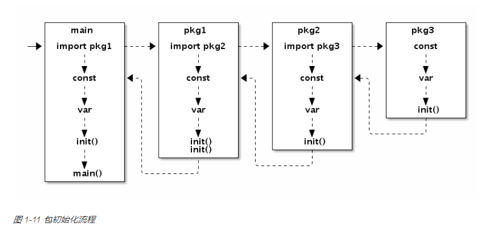
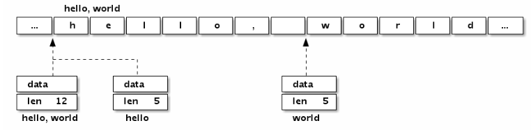
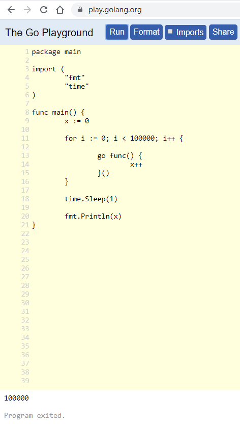
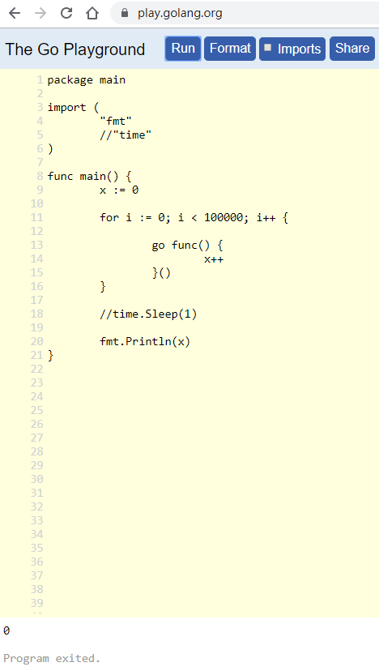
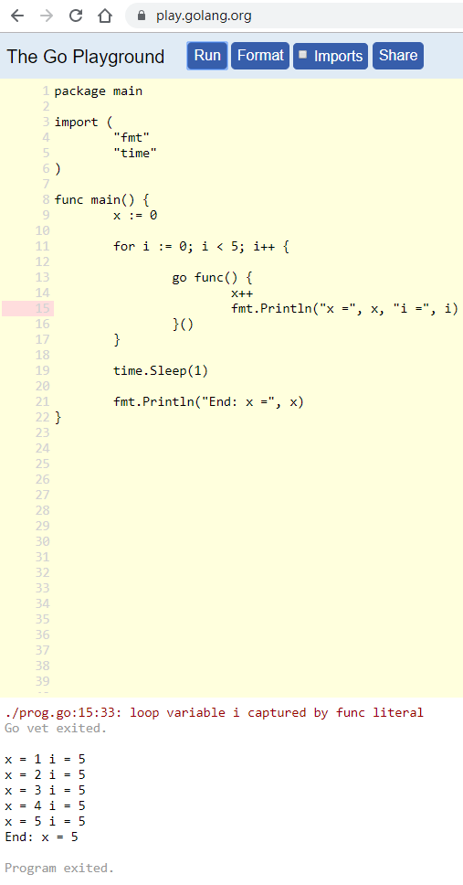
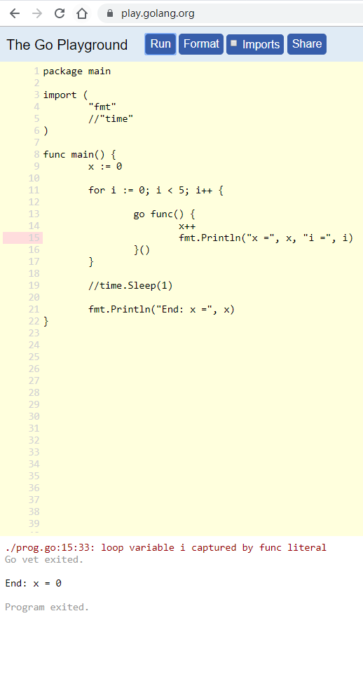
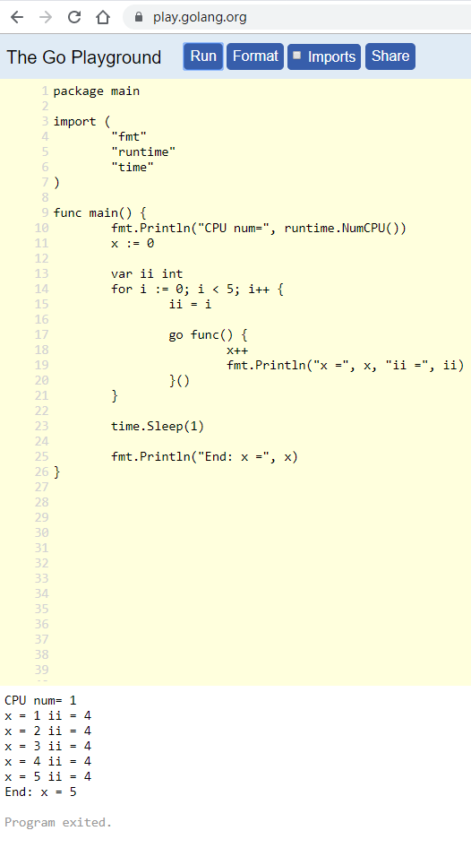
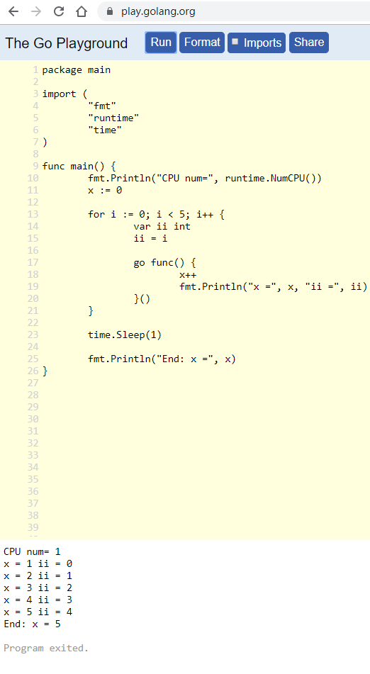

- [继承, 匿名包含2](#继承-匿名包含2)
  - [实例 StatsConn](#实例-statsconn)
  - [总结](#总结)
- [继承, 匿名包含](#继承-匿名包含)
  - [总结](#总结-1)
- [interface的赋值](#interface的赋值)
  - [第一种情况: 如果方法的receiver类型不是引用方式](#第一种情况-如果方法的receiver类型不是引用方式)
  - [第二种情况: 方法的receiver是引用方式声明的](#第二种情况-方法的receiver是引用方式声明的)
  - [总结](#总结-2)
- [go FAQ](#go-faq)
  - [go1.3是c写的, 后面的编译器是go写的 工具自动把C转成go的](#go13是c写的-后面的编译器是go写的-工具自动把c转成go的)
  - [interface的签名必须完全一样](#interface的签名必须完全一样)
    - [例子1](#例子1)
    - [例子2](#例子2)
  - [nil error不是nil](#nil-error不是nil)
- [map的元素不能取地址](#map的元素不能取地址)
- [内置println](#内置println)
- [空结构体](#空结构体)
- [迭代器样板](#迭代器样板)
  - [scanner样板](#scanner样板)
  - [range样板](#range样板)
- [关于copy](#关于copy)
- [函数级并发](#函数级并发)
  - [顺序版本](#顺序版本)
  - [goroutine并发版本](#goroutine并发版本)
- [channel的广播](#channel的广播)
  - [close广播](#close广播)
  - [交换机复制式广播](#交换机复制式广播)
  - [改进](#改进)
  - [代码心得](#代码心得)
- [再看testing](#再看testing)
  - [例子](#例子)
- [再议reflect](#再议reflect)
  - [打印变量信息](#打印变量信息)
  - [测试代码](#测试代码)
- [包初始化](#包初始化)
- [再说切片和数组](#再说切片和数组)
  - [数组是值](#数组是值)
  - [GO的数组表达和C一样](#go的数组表达和c一样)
  - [切片](#切片)
- [动态链接](#动态链接)
  - [支持动态链接的平台](#支持动态链接的平台)
  - [动态链接支持的架构](#动态链接支持的架构)
- [交叉编译go](#交叉编译go)
  - [支持交叉编译的平台](#支持交叉编译的平台)
- [一次运行时异常打印](#一次运行时异常打印)
- [goroutine和共享变量](#goroutine和共享变量)
  - [理论](#理论)
  - [实践](#实践)
- [调试环境变量](#调试环境变量)
  - [举例](#举例)
  - [GODEBUG](#godebug)
  - [GOTRACEBACK](#gotraceback)
  - [名字冲突和type别名](#名字冲突和type别名)
    - [type定义新类型](#type定义新类型)
    - [type别名](#type别名)
- [goroutine vs thread](#goroutine-vs-thread)
  - [默认的thread数](#默认的thread数)
  - [goroutine介绍](#goroutine介绍)
- [json和万能interface{}](#json和万能interface)
  - [已知结构体](#已知结构体)
  - [不知道结构体情况下](#不知道结构体情况下)
  - [encoder和decoder](#encoder和decoder)

# 继承, 匿名包含2
我们都知道, 一个结构体匿名包含另一个结构体, 就能继承其方法.
其实, 匿名包含一个interface, 也能继承.

比如:
```go
//Fooer是个interface
type Fooer interface {
    Foo() string
}

//Container匿名包含了Fooer
type Container struct {
    Fooer
}

// TheRealFoo is a type that implements the Fooer interface.
type TheRealFoo struct {
}
// TheRealFoo真正实现了Fooer
func (trf TheRealFoo) Foo() string {
    return "TheRealFoo Foo"
}

// sink takes a value implementing the Fooer interface.
func sink(f Fooer) {
    fmt.Println("sink:", f.Foo())
}

//shilhuaContainer的时候, 初始化Fooer域
co := Container{Fooer: TheRealFoo{}}
//下面申请的一幕来了, co也是Fooer
//co因为是Container的实例, 后者匿名包含了Fooer(底层实现是TheRealFoo{})
sink(co)

//输出:
sink: TheRealFoo Foo
```

由以上得知, 匿名包含interface的效果和匿名包含结构体类似, 但interface变量要正确的初始化.
如果没有正确初始化, 编译是能通过的, 但会运行时错误, 比如下面的错误实例:
```go
co := Container{}
sink(co)
```
会打印`runtime error: invalid memory address or nil pointer dereference`

## 实例 StatsConn
这里例子里, StatsConn匿名包含了net.Conn, 从而继承了net.Conn的所有函数, 但它重载了Read方法, 目的是增加字节数统计
```go
type StatsConn struct {
    net.Conn //注意这里的net.Conn是个interface

    BytesRead uint64
}

func (sc *StatsConn) Read(p []byte) (int, error) {
    n, err := sc.Conn.Read(p)
    sc.BytesRead += uint64(n)
    return n, err
}
```
实例化StatsConn的时候, 用tcp的net.Conn实例来初始化.
```go
conn, err := net.Dial("tcp", u.Host+":80")
if err != nil {
    log.Fatal(err)
}
sconn := &StatsConn{conn, 0}
```
从此以后, sconn拥有net.Conn的所有属性, 所有net.Conn能用的地方, 都可以用sconn, 比如:
```go
resp, err := ioutil.ReadAll(sconn)
if err != nil {
    log.Fatal(err)
}
```

## 总结
* 匿名包含interface和匿名包含struct都能继承
* 需要注意被包含的interface域应该正确的实例化

参考: https://eli.thegreenplace.net/2020/embedding-in-go-part-3-interfaces-in-structs/


# 继承, 匿名包含
```go
package main

import "fmt"

/*
继承
一个结构体嵌到另一个结构体，称作组合
匿名和组合的区别
如果一个struct嵌套了另一个匿名结构体，那么这个结构可以直接访问匿名结构体的方法，从而实现继承
如果一个struct嵌套了另一个【有名】的结构体，那么这个模式叫做组合
如果一个struct嵌套了多个匿名结构体，那么这个结构可以直接访问多个匿名结构体的方法，从而实现多重继承
*/

type Car struct {
    weight int
    name string
}

func (p *Car) Run() {
    fmt.Println("running")
}

type Bike struct {
    Car //注意这里, 虽然Car的receiver是引用方式, 而这里Car做为"值"被包含, 但是Bike依然继承了Car的方法.
    lunzi int
}
type Train struct {
    Car
}

func (p *Train) String() string {
    str := fmt.Sprintf("name=[%s] weight=[%d]", p.name, p.weight)
    return str
}

func main() {
    var a Bike
    a.weight = 100
    a.name = "bike"
    a.lunzi = 2
    fmt.Println(a)
    a.Run()

    var b Train
    b.weight = 100
    b.name = "train"
    b.Run()
    fmt.Printf("%s", &b)
}
```

## 总结
* 不管一个type是用receiver方式实现的方法, 还是值方式. 我们都说这个type实现了这个方法, 从而满足了某类interface的要求
* 对引用方式的receiver来说, 只要这个对象是addressable的, 编译器就会自动取地址. 换个说法是, 只要这个"值"对象, 在传递的过程中(比如赋值)不被赋值, 对其取地址不会取到其"拷贝对象"上去, 就可以搞.

# interface的赋值
比如最简单的interface
```go
type Phone interface {
    call()
}
```
只要实现了call()方法的类型, 都可以是Phone
声明一个Phone类型的变量
```go
//这是interface类型的变量
var phone Phone
```
对interface类型的变量赋值, 要看方法的实现情况

## 第一种情况: 如果方法的receiver类型不是引用方式
```go
type NokiaPhone struct {
}

func (nokiaPhone NokiaPhone) call() {
    fmt.Println("I am Nokia, I can call you!")
}
```
那么对phone变量的赋值, 地址和值都可以
```
    //new返回一个指针, 并对其内存清零;
    //以下都对
    phone = new(NokiaPhone)
    phone = &NokiaPhone{}
    phone = NokiaPhone{}

    phone.call()
```
更进一步, 其实取不取引用, 是不一样的. 但都能直接用`phone.call()`, 因为go对指针也是用点方式调用其方法.

```go
func main() {
    //这是interface类型的变量
    var phone Phone
        
    var nokiaPhone NokiaPhone
    fmt.Printf("addr: %p, value: %v, type: %T \n", &nokiaPhone, nokiaPhone, nokiaPhone)
        
    phone = &nokiaPhone
    fmt.Printf("\naddr: %p, value: %v, type: %T \n", phone, phone, phone)
    phone.call()
        
    phone = nokiaPhone
    fmt.Printf("\naddr: %p, value: %v, type: %T \n", phone, phone, phone)
    phone.call()
}

//输出
addr: 0x1e529c, value: {}, type: main.NokiaPhone 

addr: 0x1e529c, value: &{}, type: *main.NokiaPhone 
I am Nokia, I can call you!

addr: %!p(main.NokiaPhone={}), value: {}, type: main.NokiaPhone 
I am Nokia, I can call you!
```

## 第二种情况: 方法的receiver是引用方式声明的
```go
type NokiaPhone struct {
}

func (nokiaPhone *NokiaPhone) call() {
    fmt.Println("I am Nokia, I can call you!")
}
```
这种情况下, `phone = &nokiaPhone`是合法的.
而`phone = nokiaPhone`不行
错误是: NokiaPhone 没有实现Phone方法.
```
./prog.go:30:8: cannot use nokiaPhone (type NokiaPhone) as type Phone in assignment:
 NokiaPhone does not implement Phone (call method has pointer receiver)
```

注意, 虽然当receiver是引用方式时, 不能`phone = nokiaPhone`, 但是可以`nokiaPhone`可以调用call()函数, 即这样写没有任何问题:
```go
type NokiaPhone struct {
}

func (nokiaPhone *NokiaPhone) call() {
    fmt.Println("I am Nokia, I can call you!")
}

func main() {
    var nokiaPhone NokiaPhone
    //即使receiver是引用方式, 也能直接用"值"来调用
    nokiaPhone.call()
}
```
不是说`NokiaPhone does not implement Phone (call method has pointer receiver)`吗? 怎么矛盾了?
-- 不矛盾. 编译器做了语法糖, 实际调用的是:
```go
(&nokiaPhone).call()
```
在call()函数看来, receiver还是地址.

那为什么上面的interface赋值`phone = nokiaPhone`不行呢?
-- 因为interface赋值也是值拷贝. 如果这里可以的话, 后面对`phone.call()`的调用, 实际上最终是`(&拷贝后的nokiaPhone).call()`, 对拷贝后的对象取地址没有任何意义, 所以编译器禁止这样搞.

## 总结
* 方法的receiver是`pointer receiver`类型时, interface变量只接受引用方式赋值.
* 方法的receiver是非指针方式, interface变量的赋值既可以是值, 也可以是引用.
* 即使是receiver方式, "值"对象也可以直接调用其方法.

# go FAQ
[官方faq](https://golang.org/doc/faq)
[101FAQ](https://go101.org/article/unofficial-faq.html)

## go1.3是c写的, 后面的编译器是go写的 工具自动把C转成go的
[go编译器实现背景](https://golang.org/doc/faq#What_compiler_technology_is_used_to_build_the_compilers)
[工具把gc编译器从C转成go](https://docs.google.com/document/d/1P3BLR31VA8cvLJLfMibSuTdwTuF7WWLux71CYD0eeD8/edit)

## interface的签名必须完全一样
### 例子1
```go
type Equaler interface {
    Equal(Equaler) bool
}

type T int
func (t T) Equal(u T) bool { return t == u } // does not satisfy Equaler

type T2 int
func (t T2) Equal(u Equaler) bool { return t == u.(T2) }  // satisfies Equaler
```

### 例子2
```go
type Opener interface {
   Open() Reader
}

func (t T3) Open() *os.File //T3 does not satisfy Opener
```

## nil error不是nil
error是个interface{}, 而interface{}是{类型 值}的表达, 两个都是nil的时候, interface才是nil
```go
//这里return的error永远不是nil, 因为其类型是*MyError
func returnsError() error {
    var p *MyError = nil
    if bad() {
        p = ErrBad
    }
    return p // Will always return a non-nil error.
}
```

# map的元素不能取地址
因为map是hash表, 随着map大小的动态增减, 里面的元素可能会重新算hash, 改变存储位置, 那地址就变了.
> In Go, a map is designed as a container which can contain unlimited number of entries if memory is available. And, in the official Go runtime implementation, to ensure good map element indexing efficiency, each map value only maintains one continuous memory segment for the entire entries stored in that map. Therefor, Go runtime needs to allocate larger memory segments for a map from time to time when there are more and more entries being put into the map. In the process, the entries stored on older memory segments will be moved to newer memory segments. There might be also some other reasons caausing entry memory movements. In other words, the addresses of map elements will change from time to time on need. If map elements are allowed to be taken addresses, then when some map entries are moved, Go runtime must update all pointers which are storing the addresses of the moved elements, which brings many difficulties in implemnting Go compilers and runtimes and decreases Go program running performance much. So, currently, map elements are disallowed to be taken addresses.


# 内置println
内置的println是debug时候用的, 输出到stderr
另外, println不会导致变量逃逸
> Currently (Go Toolchain 1.15), for the standard Go compiler, calls to the built-in `print`/`println` functions will not make the values referenced by the arguments of the calls escape to heap, whereas the print functions in the `fmt` and `log` standard packages will.

参考: [print-builtin-fmt-log](https://go101.org/article/unofficial-faq.html#print-builtin-fmt-log)

# 空结构体
一般来说, 空结构体`struct{}`是0字节大小的. 但放在另外一个结构体的最后, 编译器会pad一些字节.
```go
func main() {
    type T1 struct {
        a struct{}
        x int64
    }
    fmt.Println(unsafe.Sizeof(T1{})) // 8

    type T2 struct {
        x int64
        a struct{}
    }
    fmt.Println(unsafe.Sizeof(T2{})) // 16
}
```

解释是: 一个结构体如果可以取地址, 那里面的每个field都应该能被取地址. 而如果T2不pad8个字节, 那对T2的a取地址就是其他对象的地址了, 就超过了T2结构体的范围了.
所以后面要加8字节. 而T1不会有这个越结构体问题.
参考: [空结构体在最后](https://go101.org/article/unofficial-faq.html#final-zero-size-field)


# 迭代器样板

## scanner样板
bufio的scanner是个很好的迭代器样板. 
下面的代码使用scanner扫描一个文件, 比对每一行, 如果不是msg就判定错误.
```go
    file := "test/testc.log"
    f, err := os.Open(file)
    if err != nil {
        t.Fatal(err)
    }
    defer f.Close()

    scanner := bufio.NewScanner(f)
    var i int
    pos := len("[2020/08/09 14:47:41.769979][testfile][INFO] ")
    for i = 0; scanner.Scan(); i++ {
        if scanner.Text()[pos:pos+len(msg)] != msg {
            break
        }
    }

    if err := scanner.Err(); err != nil {
        t.Fatal(err)
    }
    if i != routineNum*lineNum {
        t.Fatalf("Unexpected line number: got %d, expect %d", i, routineNum*lineNum)
    }
```
关于scanner迭代器:
* scanner.Scan()返回bool, 利于for判断, 为true继续, 为false则退出for
* scanner本身是个NewScanner()出来的对象, 在for循环里scanner.xxx()来反应本次迭代的更新的内容
* for循环退出, 判断scanner.Err()就能知道是异常终止还是for循环自然结束.

## range样板
对于自己定义的结构体, 不能用内置的range关键词来迭代; 但可以自己模拟一个, 比如sync/map包, 提供了对map的同步访问API
```go
type Map
    func (m *Map) Delete(key interface{})
    func (m *Map) Load(key interface{}) (value interface{}, ok bool)
    func (m *Map) LoadAndDelete(key interface{}) (value interface{}, loaded bool)
    func (m *Map) LoadOrStore(key, value interface{}) (actual interface{}, loaded bool)
    func (m *Map) Range(f func(key, value interface{}) bool)
    func (m *Map) Store(key, value interface{})
```
这里的Range()函数就是一个迭代器. 它接受一个函数f, f返回false则停止迭代.

# 关于copy
比如对一个slice做copy, 这样的代码能work
```go
copy(l[i+1:], l[i:])
```
为了把位置`i`后面的元素都挪一个位置, 代价是把这后面的所有元素都copy一遍
这里的copy实际上是overlap的, copy的时候, 源为`l[i:]`, 目的是`l[i+1:]`, 目的比源向后移动一个位置, 而且目的的元素个数也少了一个.

golang的copy允许overlap
```go
$ go doc builtin.copy
package builtin // import "builtin"

func copy(dst, src []Type) int
    The copy built-in function copies elements from a source slice into a
    destination slice. (As a special case, it also will copy bytes from a string
    to a slice of bytes.) The source and destination may overlap. Copy returns
    the number of elements copied, which will be the minimum of len(src) and
    len(dst).

```

注意, 如果按照普通的for循环式的copy思路, src和dst重叠时不能正常工作的.
有人讨论说[golang的copy语义类似memmove](https://github.com/golang/go/issues/4142)
* memcpy: 当src和dst重叠时, 结果不确定
* memmove: src和dst可以重叠, 结果是正确的拷贝; 可以理解成有个临时缓冲做中转. 实际上并不需要中间buffer, [只需要在开始的时候判断是从前往后拷贝还是从后往前拷贝就行了.](https://vgable.com/blog/2008/05/24/memcopy-memmove-and-speed-over-safety/#:~:text=The%20difference%20between%20memcpy%20and,It%20might%20work.&text=memcpy%20can%20be%20faster%2C%20and%20usually%20is.)
* 结论: golang的copy支持overlap, 可以正确的拷贝

举例:
```go
func main() {
    l := []int{0,1,2,3,4,5,6,7,8,9}
    l = append(l, 100)
    copy(l[4+1:], l[4:])
    fmt.Println(l)
}

输出:
[0 1 2 3 4 4 5 6 7 8 9]
可以看到从i=4开始, 整个slice向右平移了一个位置, 是符合预期的.
```

# 函数级并发
## 顺序版本
```go
piMap := make(map[int]*pidinfo.PidInfo, len(tgtPids))
    collect := func() {
        for _, pid := range tgtPids {
            pi := piMap[pid]
            if pi != nil {
                if err := pi.Update(); err != nil {
                    //fmt.Printf("main: %v\n", err)
                    piMap[pid] = nil
                    continue
                }
            }
        }
    }
```
piMap是个全局的map.
现在想把第6行`pi.Update()`routine化调用, 达到并发执行这个函数的效果.
要解决的问题:
1. piMap全局map的修改不是并发安全的
2. 主程序怎么等待多个pi.Update()完成

参考下面的并发化实现

## goroutine并发版本
1. 使用unbuffered channel传递结果
2. 使用计数器控制等待次数
3. 程序的效果是第10行的for代码块可以并发执行, 第22行的for代码块等待上面的routine执行完
4. 并发的版本比顺序版本代码逻辑更复杂点, goroutine的创建 调度和channel的同步都有开销, 但如果并发的收益很大的化还是值得的.

```go
piMap := make(map[int]*pidinfo.PidInfo, len(tgtPids))
collect := func() {
    //可以在函数内部type定义类型
    type result struct {
        pid int
        err error
    }

    resultCh := make(chan result)
    //计数器, 记录go了多少次
    cnt := 0
    for _, pid := range tgtPids {
        pid := pid
        pi := piMap[pid]
        if pi != nil {
            cnt++
            go func() {
                err := pi.Update()
                //结果写回channel
                resultCh <- result{pid, err}
            }()
        }
    }

    //每go一次, 就会有一次结果
    //阻塞等待每次结果
    for cnt != 0 {
        //阻塞读
        r := <-resultCh
        if r.err != nil {
            piMap[r.pid] = nil
        }
        cnt--
    }
}
```

# channel的广播
## close广播
close()一个channel, 所有read这个channel的routine都会被唤醒. 注意, 对同一个channel的操作都会有加锁操作, 因而在多核环境下, 锁竞争的开销会变得非常大.
除了这个锁的缺点, close()广播的实现的好处是比较简洁.
```go
//代码片段, "监听"的goroutine
//这样的goroutine可以有很多
//goroutine n
    for {
        //update from rootCheck pointer
        //ti.rootCheck是个指向channel的指针
        //关键是用临时变量保存这个channel的一个拷贝
        check := *ti.rootCheck
        select {
        case <-check:
            err := doWork()
            ti.rootWg.Done()
        }
    }

    //初始化goroutine时
    //ti.rootCheck来自同一个指针的赋值: 
    ti.rootCheck = pi.rootCheck
    
    //而pi.rootCheck最开始指向一个channel
    check := make(chan int)
    pi.rootCheck = &check
    

//下面是关键的trigger
//trigger的关键是先"原地"另建一个channel
//然后close()原channel
//这个close()会"广播"到上面第9行
//这个select执行完毕后, 第8行check会新得到更新后的channel的一份拷贝
func (pi *PidInfo) triggerStatUpdateAll() {
    pi.rootWg.Add(int(*pi.rootCounter))
    check := *pi.rootCheck
    //must make a new channel first
    *pi.rootCheck = make(chan int)
    //then close the old one, broadcasting
    close(check)
    //will the above 2 code lines run out of order?
}
```

## 交换机复制式广播
如何让channel做到1对多的广播? 我们知道close一个channel, 那么它的所有reader都会返回一个零值, 这就是广播.

还有别的方法吗? 下面的例子使用订阅模式模仿了广播的api.
详见:[stackoverflow](https://stackoverflow.com/questions/36417199/how-to-broadcast-message-using-channel)
[github](https://github.com/go-x-pkg/hub/blob/master/hub.go)

A more elegant solution is a "broker", where clients may subscribe and unsubscibe to messages.

To also handle subscribing and unsubscribing elegantly, we may utilize channels for this, so the main loop of the broker which receives and distributes the messages can incorporate all these using a single `select` statement, and synchronization is given from the solution's nature.

Another trick is to store the subscribers in a map, mapping from the channel we use to distribute messages to them. So use the channel as the key in the map, and then adding and removing the clients is "dead" simple. This is made possible because channel values are [comparable](https://golang.org/ref/spec#Comparison_operators), and their comparison is very efficient as channel values are simple pointers to channel descriptors.

Without further ado, here's a simple broker implementation:
```go
type Broker struct {
    stopCh    chan struct{}
    publishCh chan interface{}
    subCh     chan chan interface{}
    unsubCh   chan chan interface{}
}

func NewBroker() *Broker {
    return &Broker{
        stopCh:    make(chan struct{}),
        publishCh: make(chan interface{}, 1),
        subCh:     make(chan chan interface{}, 1),
        unsubCh:   make(chan chan interface{}, 1),
    }
}

func (b *Broker) Start() {
    subs := map[chan interface{}]struct{}{}
    for {
        select {
        case <-b.stopCh:
            return
        case msgCh := <-b.subCh:
            subs[msgCh] = struct{}{}
        case msgCh := <-b.unsubCh:
            delete(subs, msgCh)
        case msg := <-b.publishCh:
            for msgCh := range subs {
                // msgCh is buffered, use non-blocking send to protect the broker:
                select {
                case msgCh <- msg:
                default:
                }
            }
        }
    }
}

func (b *Broker) Stop() {
    close(b.stopCh)
}

func (b *Broker) Subscribe() chan interface{} {
    msgCh := make(chan interface{}, 5)
    b.subCh <- msgCh
    return msgCh
}

func (b *Broker) Unsubscribe(msgCh chan interface{}) {
    b.unsubCh <- msgCh
}

func (b *Broker) Publish(msg interface{}) {
    b.publishCh <- msg
}
```

Example using it:
```go
func main() {
    // Create and start a broker:
    b := NewBroker()
    go b.Start()

    // Create and subscribe 3 clients:
    clientFunc := func(id int) {
        msgCh := b.Subscribe()
        for {
            fmt.Printf("Client %d got message: %v\n", id, <-msgCh)
        }
    }
    for i := 0; i < 3; i++ {
        go clientFunc(i)
    }

    // Start publishing messages:
    go func() {
        for msgId := 0; ; msgId++ {
            b.Publish(fmt.Sprintf("msg#%d", msgId))
            time.Sleep(300 * time.Millisecond)
        }
    }()

    time.Sleep(time.Second)
}
```
Output of the above will be
```
Client 2 got message: msg#0
Client 0 got message: msg#0
Client 1 got message: msg#0
Client 2 got message: msg#1
Client 0 got message: msg#1
Client 1 got message: msg#1
Client 1 got message: msg#2
Client 2 got message: msg#2
Client 0 got message: msg#2
Client 2 got message: msg#3
Client 0 got message: msg#3
Client 1 got message: msg#3
```

## 改进
You may consider the following improvements. These may or may not be useful depending on how / to what you use the broker.

`Broker.Unsubscribe()` may close the message channel, signalling that no more messages will be sent on it:

```go
func (b *Broker) Unsubscribe(msgCh chan interface{}) {
    b.unsubCh <- msgCh
    close(msgCh)
}
```

This would allow clients to `range` over the message channel, like this:

```go
msgCh := b.Subscribe()
for msg := range msgCh {
    fmt.Printf("Client %d got message: %v\n", id, msg)
}
```

Then if someone unsubscribes this `msgCh` like this:

```go
b.Unsubscribe(msgCh)
```

The above range loop will terminate after processing all messages that were sent before the call to `Unsubscribe()`.

If you want your clients to rely on the message channel being closed, and the broker's lifetime is narrower than your app's lifetime, then you could also close all subscribed clients when the broker is stopped, in the `Start()` method like this:

```go
case <-b.stopCh:
    for msgCh := range subs {
        close(msgCh)
    }
    return
```

## 代码心得
* `go b.Start()`起了单独的routine来维护b(即中转线程), 主要是subscribe和unsubscribe的map维护, 和msg的分发; 用单独的goroutine可以避免锁.
* 订阅和取消订阅实际上是对内部map的添加和删除key, `subs[msgCh]  =  struct{}{}`和`delete(subs, msgCh)`. 这里把新make的channel当作map的key, 因为channel是可比较的, 而且比较效率高.关键是插入和删除key非常简单.
* 中转线程是关键, 类似个交换机; 为了避免在select里面等待, msg都是bufferred模式.而且写都带default, 是非阻塞的.

# 再看testing
格式`go test [build/test flags] [packages] [build/test flags & test binary flags]`

* 帮助文档`go help test`和`go doc testing`
* testdata目录会被go tool忽略, 留给测试case使用
* 测试case的输出全部走stdout, 即使case里输出到stderr; stderr是留给testing框架用的
* 默认跑test, 但不跑benchamrk
* go test除了支持全部go build参数外, 还支持

```
#基础选项
-args 传个测试case的
-c 只编译不运行, 生成pkg.test
-exec xprog 用外部程序xprog来运行test二进制
-i 只安装不运行
-o 输出test二进制

#测试过程控制
-bench regexp 运行正则匹配到的benchmark; -bench .除了会运行test项, 还会运行所有benchmark项
-run regexp 只运行正则的case, 只匹配test项和example项: 
-benchtime t 默认是1s, 可以指定其他的time.Duration比如1h30s
-count n 重复执行所有case n次
-cover 使能coverage 分析
-cpu 1,2,4 指定CPU列表
-parallel n 对调用t.Parallel的case, 指定并发为n; 默认为GOMAXPROCS
-short 减小测试时间, 自己在case里判断是否if testing.Short()
-timeout d 默认超时时间是10m, 可以改
-list regexp 列出正则匹配的项

#profiling相关
-benchmem: 打印内存使用情况
-blockprofile block.out: 打印goroutine的阻塞情况
-coverprofile cover.out: 打印coverage 
-memprofile mem.out: mem profile
-cpuprofile cpu.out: cpu profile
-trace trace.out: 输出trace profile

# 命令举例
//不跑test项, 跑所有的benchmark项:
go test -run 任意匹配不到的正则 -bench . -benchtime 10s
```

## 例子
```go
    func TestAbs(t *testing.T) {
        got := Abs(-1)
        if got != 1 {
            t.Errorf("Abs(-1) = %d; want 1", got)
        }
    }
    
    func BenchmarkHello(b *testing.B) {
        for i := 0; i < b.N; i++ {
            fmt.Sprintf("hello")
        }
    }
    
    //准备时间太长时, 可以重置时间
    func BenchmarkBigLen(b *testing.B) {
        big := NewBig()
        b.ResetTimer()
        for i := 0; i < b.N; i++ {
            big.Len()
        }
    }

    //默认benchmakr是串行执行的, b.RunParallel可以并发
    func BenchmarkTemplateParallel(b *testing.B) {
        templ := template.Must(template.New("test").Parse("Hello, {{.}}!"))
        b.RunParallel(func(pb *testing.PB) {
            var buf bytes.Buffer
            for pb.Next() {
                buf.Reset()
                templ.Execute(&buf, "World")
            }
        })
    }

    //Example打头的函数, 用// Output来指明应该有的输出, 框架会自动比较
    func ExampleHello() {
        fmt.Println("hello")
        // Output: hello
    }
    func ExampleSalutations() {
        fmt.Println("hello, and")
        fmt.Println("goodbye")
        // Output:
        // hello, and
        // goodbye
    }

    //跳过时间太久的
    func TestTimeConsuming(t *testing.T) {
        if testing.Short() {
            t.Skip("skipping test in short mode.")
        }
        ...
    }

    //单独run子项
    func TestFoo(t *testing.T) {
        // <setup code>
        t.Run("A=1", func(t *testing.T) { ... })
        t.Run("A=2", func(t *testing.T) { ... })
        t.Run("B=1", func(t *testing.T) { ... })
        // <tear-down code>
    }
    go test -run ''      # Run all tests.
    go test -run Foo     # Run top-level tests matching "Foo", such as "TestFooBar".
    go test -run Foo/A=  # For top-level tests matching "Foo", run subtests matching "A=".
    go test -run /A=1    # For all top-level tests, run subtests matching "A=1".

    // 用TestMain来接管test执行, 必须先做一些复杂的初始化; 然后调用m.Run
    func TestMain(m *testing.M) {
        // call flag.Parse() here if TestMain uses flags
        os.Exit(m.Run())
    }
```


# 再议reflect
reflect.Type是个interface, 而reflect.Value是个结构体.
Type更抽象, 而Value是实例.

## 打印变量信息
```go
func desc(i interface{}) {
    t := reflect.TypeOf(i)

    if t.Kind() != reflect.Ptr {
        //加下面的代码会panic, 提示 panic: reflect.Value.Addr of unaddressable value
        //我理解是这样的: 传参的时候, 把对象赋值给interface{}, 也是值传递;
        //reflect.ValueOf(i)其实是有地址的, 但它是个"临时的拷贝", 它的地址没有意义
        //所以下面的语句不让获取这个临时拷贝的地址; 这个临时的拷贝被认为是unaddressable
        //fmt.Println(reflect.ValueOf(i).Addr())
        fmt.Printf("(%v, %T)@<%d>\n", i, i, t.Size())
    } else {
        //这个case对应desc(&a), 此时i实际上是个指针.
        //那么v.Elem()和t.Elem()就是解引用
        //用v.Elem().UnsafeAddr()代替i, 也能正确打印地址(需换成%x打印)
        v := reflect.ValueOf(i)
        fmt.Printf("(%v, %v)@[%p]<%d>\n", v.Elem(), t.Elem(), i, t.Elem().Size())
    }
}
```
其中
* t是Type类型的对象, t本身是interface类型
* t.Kind()是底层实例的类型, 与reflect包里的常量类型可比较
* t.Size()返回类型t的大小
* v是Value类型的对象, 代表了实际的value
* v.Elem()指v是指针的时候, 其指向的对象的值
* t.Elem()是t是指针的时候, 其指向对象的类型
* t.Elem().Size是其指向对象类型的大小

## 测试代码
```go
func main() {
    a := 55
    fmt.Printf("(%v, %T)@(%p, %d)\n", a, a, &a, unsafe.Sizeof(a))

    desc(a)
    desc(&a)

    m := struct {
        int
        string
    }{6, "hello"}
    fmt.Printf("(%v, %T)@[%p, %d]\n", m, m, &m, unsafe.Sizeof(m))
    desc(m)
    desc(&m)
}

//结果:
(55, int)@(0xc0000c0020, 8)
(55, int)@<8>
(55, int)@[0xc0000c0020]<8>
({6 hello}, struct { int; string })@[0xc0000b8040, 24]
({6 hello}, struct { int; string })@<24>
({6 hello}, struct { int; string })@[0xc0000b8040]<24>
```

# 包初始化
再main执行之前, 被依赖的包会递归的包含, 并执行里面的全局变量, init()函数等.  
  

# 再说切片和数组
## 数组是值
数组是值类型, 参数里传数组会复制整个数组.
Go语言中数组是值语义。一个数组变量即表示整个数组，它并不是隐式的指向第一个元素的指针（比如C语言的数组），而是一个完整的值。当一个数组变量被赋值或者被传递的时候，实际上会复制整个数组。如果数组较大的话，数组的赋值也会有较大的开销。为了避免复制数组带来的开销，可以传递一个指向数组的指针，但是数组指针并不是数组。
```go
var a = [...]int{1, 2, 3} // a 是一个数组
var b = &a // b 是指向数组的指针

fmt.Println(a[0], a[1]) // 打印数组的前2个元素
fmt.Println(b[0], b[1]) // 通过数组指针访问数组元素的方式和数组类似

for i, v := range b { // 通过数组指针迭代数组的元素
    fmt.Println(i, v)
}
```

## GO的数组表达和C一样
注意, go里面数组是数组, 切片是切片; 上面说到切片的表达是个结构体, 包括了数组的指针和大小, 但数组还是和C一样的"原始"样子: 指向首元素的指针可以代表这个数组.

```go
func main() {
    // s是个切片
    s := []int{1,2,3,4,5,6,7}
    sp := &s
    fmt.Println(sp)
    //&s[0]已经是对底层数组的元素了, 前面说过, go的底层数组和c表达一样
    //所以可以强转成*[3]int, 注意这个是个数组; 只能转成数组
    sp3 := (*[3]int)(unsafe.Pointer(&s[0]))
    fmt.Println(sp3)
}
//结果
&[1 2 3 4 5 6 7]
&[1 2 3]
```

## 切片
切片是对数组的表达, 带有个header; header里面有底层数组的指针和数组的大小;  
字符串是只读的int数组,  有个和切片类似的头, 行为和切片有点像.  
  

```go
func main() {
    type MyInt int

    var a = []int{7, 8, 9}
    //b也是切片, 但和a共享底层数组
    var b = *(*[]MyInt)(unsafe.Pointer(&a))
    b[0]= 123
    fmt.Println(a) // [123 8 9]
    fmt.Println(b) // [123 8 9]
    fmt.Printf("%T \n", a) // []int
    fmt.Printf("%T \n", b) // []main.MyInt
}
```

# 动态链接
应该是从go1.8左右开始, go支持动态链接
This is possible now using -linkshared flag

What you need to do is to first run this command:

`go install -buildmode=shared -linkshared std`
(Above code makes all common packages shareable!) then
这个命令在mint下面, 会生成一个36M的libstd.so; 用xz压缩后是8M左右.
```
Linux Mint 19.1 Tessa $ llh ./go/pkg/linux_amd64_dynlink/libstd.so
-rw-rw-r-- 1 yingjieb yingjieb 36M Oct  9 09:15 ./go/pkg/linux_amd64_dynlink/libstd.so
```

`go install -buildmode=shared -linkshared userownpackage`
finally when compiling your code you need to run:

`go build -linkshared yourprogram`
What the above those is now it rather than statically linking everything only dynamically links them and you will end up with much smaller compiled files. Just to give you an idea my "hello.go" file with static linking is 2.3MB while the same code using dynamic linking is just 12KB!

我在mint上, 用共享模式, hello的可执行大小是20K. 静态模式是2M.
```
Linux Mint 19.1 Tessa $ ldd hello
        linux-vdso.so.1 (0x00007ffea79b8000)
        libstd.so => /home/yingjieb/repo/gorepo/go/pkg/linux_amd64_dynlink/libstd.so (0x00007f8189201000)
        libc.so.6 => /lib/x86_64-linux-gnu/libc.so.6 (0x00007f8188e10000)
        libdl.so.2 => /lib/x86_64-linux-gnu/libdl.so.2 (0x00007f8188c0c000)
        libpthread.so.0 => /lib/x86_64-linux-gnu/libpthread.so.0 (0x00007f81889ed000)
        /lib64/ld-linux-x86-64.so.2 (0x00007f818bdda000)

Linux Mint 19.1 Tessa $ ldd /home/yingjieb/repo/gorepo/go/pkg/linux_amd64_dynlink/libstd.so
        linux-vdso.so.1 (0x00007fff4b3cb000)
        libdl.so.2 => /lib/x86_64-linux-gnu/libdl.so.2 (0x00007f065b410000)
        libpthread.so.0 => /lib/x86_64-linux-gnu/libpthread.so.0 (0x00007f065b1f1000)
        libc.so.6 => /lib/x86_64-linux-gnu/libc.so.6 (0x00007f065ae00000)
        /lib64/ld-linux-x86-64.so.2 (0x00007f065dfe9000)

```
说明:
* go程序的静态编译时按需编译.
* 共享编译std, 会把go的库全部编译, 引入全部依赖, 比如libc
* 看起来hello依赖libc, 但其实是go的共享库libstd.so依赖libc等动态库.
* 如果说MIPS上n32不支持cgo的话, 那静态编译用MIPS64的libc.a行吗? 这个东西编译的时候有.

buildmode详细说明
`go help buildmode`
```
        -buildmode=shared
                Combine all the listed non-main packages into a single shared
                library that will be used when building with the -linkshared
                option. Packages named main are ignored.

```

## 支持动态链接的平台
go1.12只有下面的平台支持:
`"linux/386", "linux/amd64", "linux/arm", "linux/arm64", "linux/ppc64le", "linux/s390x"`

## 动态链接支持的架构
`src/cmd/go/internal/work/init.go`
只有`case "linux/386", "linux/amd64", "linux/arm", "linux/arm64", "linux/ppc64le", "linux/s390x":`
MIPS和PPC大端都不支持

# 交叉编译go
go的交叉编译很简单, 只要配置两个环境变量
`GOOS GOARCH`
比如:
```
//就用x86的gc go编译器

//默认编译出native的go程序, 那这里就是x86-64
go build goweb.go

//加环境变量, 就能交叉编译
GOOS=linux GOARCH=mips64 go build goweb.go
//编译很顺利, 直接生成mips64的可执行文件
Linux Mint 19.1 Tessa $ file goweb
goweb: ELF 64-bit MSB executable, MIPS, MIPS-III version 1 (SYSV), statically linked, not stripped
```
[网上说用gcc go编译器不行:最后一个回复]([https://github.com/golang/go/issues/18942](https://github.com/golang/go/issues/18942)


## 支持交叉编译的平台
```
Linux Mint 19.1 Tessa # go tool dist list | grep linux
linux/386
linux/amd64
linux/arm
linux/arm64
linux/mips
linux/mips64
linux/mips64le
linux/mipsle
linux/ppc64
linux/ppc64le
linux/s390x
```


# 一次运行时异常打印
```go
func main() {
    flag.Parse()
    http.Handle("/", http.HandlerFunc(QR))
    err := http.ListenAndServe(*addr, nil)
    if err != nil {
        log.Fatal("ListenAndServe:", err)
    }
}
```
在`err := http.ListenAndServe(*addr, nil)`, 打印出死锁异常
能看出来:
* go的crash报告很清楚: 有调用链, 行数, 参数
* 这个http的调用, 大体上经过了net/http, net, poll, syscall, sync等模块的调用, 分层很清楚

```go
fatal error: all goroutines are asleep - deadlock!

goroutine 1 [sync.Cond.Wait]:
runtime.goparkunlock(...)
    /usr/local/go/src/runtime/proc.go:310
sync.runtime_notifyListWait(0x8407f0, 0x0)
    /usr/local/go/src/runtime/sema.go:510 +0x120
sync.(*Cond).Wait(0x8407e8, 0x8407e0)
    /usr/local/go/src/sync/cond.go:56 +0xe0
syscall.(*queue).waitRead(0x8407e0, 0x1, 0x0, 0x0, 0x8001e0, 0x4b6bb0, 0x864c8c, 0x0)
    /usr/local/go/src/syscall/net_nacl.go:292 +0xe0
syscall.(*msgq).read(0x8407e0, 0x4296e0, 0x0, 0x0, 0x0, 0x0, 0x0, 0x0)
    /usr/local/go/src/syscall/net_nacl.go:409 +0xc0
syscall.(*netFile).accept(0x832240, 0x0, 0x832240, 0x0, 0x0, 0x4c49, 0x70, 0x4382e0)
    /usr/local/go/src/syscall/net_nacl.go:571 +0x40
syscall.Accept(0x3, 0x0, 0xff800000, 0x7ff, 0x56f40, 0x4c49, 0xf8ea81ab, 0x850848)
    /usr/local/go/src/syscall/net_nacl.go:799 +0xa0
internal/poll.accept(0x3, 0x4c01, 0x1, 0x83f000, 0x2, 0x2, 0x8, 0x743800, 0x2, 0x0)
    /usr/local/go/src/internal/poll/sys_cloexec.go:24 +0x40
internal/poll.(*FD).Accept(0x850840, 0x4c49, 0x0, 0x0, 0x0, 0x0, 0x0, 0x0, 0x0, 0x0)
    /usr/local/go/src/internal/poll/fd_unix.go:377 +0x140
net.(*netFD).accept(0x850840, 0x864e20, 0x7321c0, 0x4c49, 0xfefc0008, 0x0)
    /usr/local/go/src/net/fd_unix.go:238 +0x40
net.(*TCPListener).accept(0x83efa0, 0x4c49, 0x20, 0x44c9a0, 0x83c201, 0x0)
    /usr/local/go/src/net/tcpsock_posix.go:139 +0x40
net.(*TCPListener).Accept(0x83efa0, 0x0, 0x83f040, 0x4c49, 0x4242e0, 0x725e08)
    /usr/local/go/src/net/tcpsock.go:261 +0x40
net/http.(*Server).Serve(0x8526c0, 0x5194d0, 0x83efa0, 0x5, 0x0, 0x0)
    /usr/local/go/src/net/http/server.go:2896 +0x2e0
net/http.(*Server).ListenAndServe(0x8526c0, 0x469211, 0x8526c0, 0x516bb0)
    /usr/local/go/src/net/http/server.go:2825 +0xe0
net/http.ListenAndServe(...)
    /usr/local/go/src/net/http/server.go:3080
main.main()
    /tmp/sandbox101442177/prog.go:17 +0x160
```

# goroutine和共享变量
## 理论
在loop里使用goroutine时, 比如
```go
for _, val := range values {
    go func() {
        fmt.Println(val)
    }()
}
```
首先, goroutine是能使用变量val的; 因为goroutine底层也是运行在线程上的, 每个go进程有自己的"worker"线程, 一般在启动时和CPU核数相等, 它们的地址空间是一样的.
但goroutine会等待调度执行, 可能在主线程的loop结束后才开始执行.
此时的val被"捕获"进goroutine(有时也叫闭包), 但val只有一个值, 在for里改变, 那很可能总是捕获到最后一次的值.
后面的实验也验证了这一点.
一般不这样直接用loop变量, 而是把loop变量当做参数传入goroutine, 这样这个参数在传递的时候, 就保存在goroutine的栈里了, 不用等goroutine被调度执行才evaluate这个值.
```go
for _, val := range values {
    go func(val interface{}) {
        fmt.Println(val)
    }(val)
}
```

## 实践
对比左右两个代码, 左边在循环结束后sleep了, 右边没有.
输出就不一样, 为什么呢?  
    
注:
* 这个网站提供的环境, 只有一个核.`fmt.Println("CPU num = ", runtime.NumCPU())`打出来是1. 所以goroutine"并行"`x++`, 不存在并发的问题, 结果是对的.
* `x++`并不是原子的, 一般C里面要用编译器提供的原子操作宏: `__sync_fetch_and_add( &x, 1 );`或`atomic`系列宏
* 为什么sleep和不sleep结果不同?
    * sleep时, goroutine们先运行
    * 不sleep时, 大概率主线程先运行, 此时goroutine们还没有开始
    * 后面加了打印x的版本看的更清楚: 不sleep时, goroutine都没有开始执行.

----
我们改一下代码:  
    
注:
* 在最后是不能打印`i`的值的, 因为`i`的作用域只在循环里面, 出了循环就没有了.
* 这里首先有个警告: 是go vet打印出来的, 大意是说循环变量`i`被goroutine函数func捕获. 一般这样用容易出问题.
这也说明go提供里vet机制, 能做代码静态检查
* 每个goroutine的x, 都是同一个x, 没有私有拷贝. 在`x++`的时候, 从同一个地址取值, 加一, 再放回同一个内存地址.
所以现象上是正常的, 但前提是单核运行才正常.
* 每个goroutine都打印循环变量`i`, 但都是`5`; 因为`i`在for里改变, 等到goroutine被调度执行时, 这个变量已经是5了.

----
把i在循环里赋值给ii, 结果又不一样:  
    
注:
* 区别在于变量`ii`的位置:
    * 在循环外定义, 则`ii`只是一个地址.
    * 在循环里面定义, 则`ii`每次进循环都要重新创建, 地址不一样.
* 地址不变, 则goroutine取值的时候, 就只能拿到一个值.
* 地址变了, 则每个goroutine都能取到对应的值.
* goroutine知道自己要"捕获"哪个`ii`
* 把17行的go关键词去掉, 只留闭包函数func, 则这个func会在loop里依次被调用, 打印正常的0到4.

# 调试环境变量
## 举例
```
#10s钟打印一次调度信息
GODEBUG=schedtrace=10000,scheddetail=1 GOTRACEBACK=system ./json_load -fileName test.json -loopNum 100000 > /dev/null
```
## GODEBUG
GODEBUG环境变量包括子变量, 用`name=val, name=val`的形式, 详见https://golang.org/pkg/runtime/
```
#GC相关的
allocfreetrace=1
gctrace=1
#cgo
cgocheck=1
#调度, 每X ms打印信息
schedtrace=X and scheddetail=1
```
## GOTRACEBACK 
默认在程序出错时打印调用栈, 
```
#依次加强
GOTRACEBACK=none
GOTRACEBACK=single 默认
GOTRACEBACK=all
GOTRACEBACK=system
GOTRACEBACK=crash 触发coredump
```

## 名字冲突和type别名
在匿名继承过程中, 我遇到了一个问题:
tengo.String类型, 有String()方法. 如果我想继承这个类型, 通常是这样写:
```go
package extension

type String struct {
    tengo.String
}
```
但编译不通过, 大意是String是个field name, 但我们这里需要String()方法.
原因是extension.String, 有String属性, 也有String()方法, 重名了. go编译器**不允许**field name和method name重名, 否则会冲突.

### type定义新类型
下面的代码也是不行的, 甚至更糟:
```go
package extension

type tString tengo.String 

type String struct {
    tString
}
```
因为tString是个新的类型, 没有任何方法; 匿名包含tString继承不到任何东西

### type别名
这里要用type的别名机制: 定义type的时候用`=`号
```go
package extension

type tString = tengo.String 

type String struct {
    tString
}
```
别名保留原名的所有东西. 所以这里tSting就是tengo.String, 只是拼写不一样了. [原始解释](https://yourbasic.org/golang/type-alias/)
> An alias declaration doesn’t create a new distinct type different from the type it’s created from. It just introduces an alias name T1, an alternate spelling, for the type denoted by T2.

> Type aliases are not meant for everyday use. They were introduced to support gradual code repair while moving a type between packages during large-scale refactoring. Codebase Refactoring (with help from Go) covers this in detail.


# goroutine vs thread
## 默认的thread数
一个go进程会起GOMAXPROCS 个线程, 从go1.5之后, 这个值默认是CPU核数.
可以在环境变量改, 也可以用runtime.GOMAXPROCS来在运行时改.
```
GOMAXPROCS=4 goapp
```
注意GOMAXPROCS 是指同时running的线程数, 不包括被block的线程. go进程对block的线程数没有限制. 

## goroutine介绍
参考
https://codeburst.io/why-goroutines-are-not-lightweight-threads-7c460c1f155f
https://medium.com/@riteeksrivastava/a-complete-journey-with-goroutines-8472630c7f5c

goroutine并不是linux thread, 但建立在thread上, 受go runtime scheduler调度的任务单位.
对比linux thread, 它更轻量, 表现在如下几个方面:
* thread的stack比较大, > 1M, 所以如果有1000个thread, 要占1G的内存;
goroutine默认stack是2K, 如果有goroutine需要更大的stack, 会分配新的内存区域.
* goroutine不受OS调度, 而是受go runtime scheduler调度, 所以不需要比如100Hz的中断来调度
基本上, 调度的策略类似linux的非抢占模式, 主动让出或阻塞时让出CPU.
goroutine阻塞是阻塞在当前运行它的线程, go scheduler会运行其他thread来运行其他goroutine.
不需要等线程阻塞才调度, 比如goroutine用channel和另一个goroutine通信, 本身并不会导致goroutine所在线程阻塞, 但go scheduler会调度其他goroutine来在当前线程替代之前的goroutine运行.
一个goroutine被调度运行, 只发生在当前的goroutine
    * 调用了channel send, 并阻塞
    * 用go关键词启动一个goroutine
    * 在file access或network相关系统调用上阻塞
    * 被Gc停住后
* thread上下文切换的代价偏大, 要保存很多寄存器, 除了常见的通用寄存器, 还包括AVX, SSE, 浮点等.
goroutine则不需要保存这么多的寄存器, 因为调度都在特定的点上, 那保存的寄存器也是按需的.

# json和万能interface{}
普通的结构体和[]byte的转换, 用`json.Marshal()`和`json.Unmarshal()`
## 已知结构体
```go
b := []byte(`{"Name":"Wednesday","Age":6,"Parents":["Gomez","Morticia"]}`)

type FamilyMember struct {
    Name string
    Age int
    Parents []string
}
    var m FamilyMember
    err := json.Unmarshal(b, &m)
```
注意:
* 用var声明FamilyMember变量m的时候, Parents还只是个nil
* 而Unmarshal会再后台申请新的切片来放Parents 
* 同样的, 比如下面, 如果结构体中包括指针, 则Unmarshal会申请Bar的空间.
```go
type Foo struct {
    Bar *Bar
}
```

## 不知道结构体情况下
那不知道结构体的json, 怎么解析呢?
这就要用到万能的interface{}接口了.
> The json package uses map[string]interface{} and []interface{} values to store arbitrary JSON objects and arrays; it will happily unmarshal any valid JSON blob into a plain interface{} value. 

```go
//比如b是json, 但不知道对应的结构体
b := []byte(`{"Name":"Wednesday","Age":6,"Parents":["Gomez","Morticia"]}`)

var f interface{}
err := json.Unmarshal(b, &f)
fmt.Printf("%#v\n", f)

//输出, 可以看到, 这个map的key是string, value是interface{}, 因为只有interface{}可以是任何东西.
map[string]interface {}{"Age":6, "Name":"Wednesday", "Parents":[]interface {}{"Gomez", "Morticia"}}

//此时用类型断言得到这个类型的"值", 也就是这个map
m := f.(map[string]interface{})

//然后就可以用range来遍历了
for k, v := range m {
    switch vv := v.(type) {
    case string:
        fmt.Println(k, "is string", vv)
    case float64:
        fmt.Println(k, "is float64", vv)
    case []interface{}:
        fmt.Println(k, "is an array:")
        for i, u := range vv {
            fmt.Println(i, u)
        }
    default:
        fmt.Println(k, "is of a type I don't know how to handle")
    }
}
```
常见的json类型对照:
```
bool for JSON booleans,
float64 for JSON numbers,
string for JSON strings, and
nil for JSON null.
```

## encoder和decoder
```go
func NewDecoder(r io.Reader) *Decoder
func NewEncoder(w io.Writer) *Encoder
```
```go
package main

import (
    "encoding/json"
    "log"
    "os"
)

func main() {
    dec := json.NewDecoder(os.Stdin)
    enc := json.NewEncoder(os.Stdout)
    for {
        var v map[string]interface{}
        if err := dec.Decode(&v); err != nil {
            log.Println(err)
            return
        }
        for k := range v {
            if k != "Name" {
                delete(v, k)
            }
        }
        if err := enc.Encode(&v); err != nil {
            log.Println(err)
        }
    }
}
```

