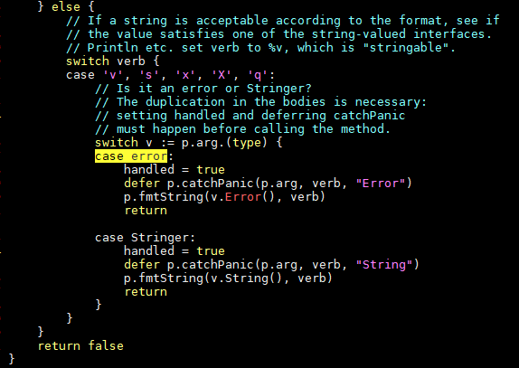
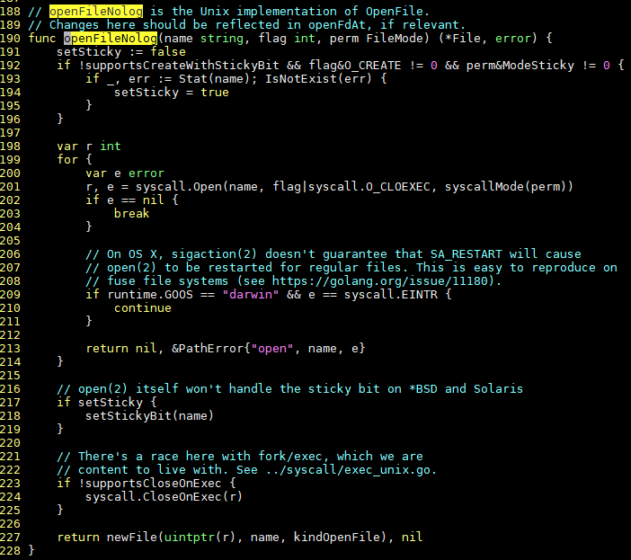

- [高效go](#高效go)
- [web服务器例子](#web服务器例子)
  - [代码](#代码)
  - [运行](#运行)
- [panic流程和普通执行流程](#panic流程和普通执行流程)
- [panic](#panic)
  - [recover](#recover)
  - [recover里面可以改变量值](#recover里面可以改变量值)
  - [总结](#总结)
- [错误处理](#错误处理)
  - [error定义和使用](#error定义和使用)
    - [errors包](#errors包)
    - [自己实现error接口](#自己实现error接口)
  - [error和类型断言的例子](#error和类型断言的例子)
  - [进一步看error如何返回的](#进一步看error如何返回的)
  - [错误处理化简](#错误处理化简)
- [channel和并发](#channel和并发)
  - [channel](#channel)
    - [channel用于同步](#channel用于同步)
    - [channel用于semaphore](#channel用于semaphore)
    - [一个channel有多个goroutine接收](#一个channel有多个goroutine接收)
  - [函数和channel都是first class值: channel in channel](#函数和channel都是first-class值-channel-in-channel)
  - [通道in通道的另一个例子](#通道in通道的另一个例子)
  - [分割和并发](#分割和并发)
  - [用channel管理message buffer](#用channel管理message-buffer)
- [接口嵌套](#接口嵌套)
- [结构体嵌套](#结构体嵌套)
  - [例子 logger](#例子-logger)
- [接口和方法](#接口和方法)
  - [即使一个int类型也可以带方法](#即使一个int类型也可以带方法)
  - [chan带方法](#chan带方法)
  - [函数也可以带方法!!!](#函数也可以带方法)
- [多态](#多态)
- [接口和类型断言](#接口和类型断言)
- [方法](#方法)
- [接口](#接口)
- [gofmt](#gofmt)
- [注释即文档](#注释即文档)
- [if可以有初始化语句](#if可以有初始化语句)
- [for是三种C循环的统一](#for是三种c循环的统一)
- [switch接受非常量](#switch接受非常量)
- [多返回值](#多返回值)
- [defer](#defer)
  - [用defer做函数trace](#用defer做函数trace)
  - [在panic场景下, defer的最大好处是panic链上的defer都会被调用到](#在panic场景下-defer的最大好处是panic链上的defer都会被调用到)
- [new和make分配数据](#new和make分配数据)
  - [new](#new)
  - [数组和切片的区别](#数组和切片的区别)
  - [make](#make)
- [数组](#数组)
- [切片](#切片)
- [map](#map)
- [打印](#打印)
- [append和...扩展](#append和扩展)
- [全局变量初始化和init](#全局变量初始化和init)

# 高效go
https://golang.org/doc/effective_go.html#concurrency

# web服务器例子
这个web服务器, 利用了chart.apis.google.com提供的api, 把文本转化成二维码.
但你需要把data都放到URL中去做query.

## 代码
下面的代码, 可以把文本的输入, 通过google的api, 转换成一个QR code.
然后你就可以用手机扫描这个文本类型的QR码, 就能看到对应的文本

```go
package main

//这几个库都是标准库
import (
    "flag"
    "html/template"
    "log"
    "net/http"
)

//这里设置默认的http port是1718
var addr = flag.String("addr", ":1718", "http service address") // Q=17, R=18

//根据下面的描述生成模板, 这个模板html被server执行来显示这个页面
var templ = template.Must(template.New("qr").Parse(templateStr))

func main() {
    flag.Parse()
    //把函数QR挂到http的根目录
    http.Handle("/", http.HandlerFunc(QR))
    //开始运行这个server
    err := http.ListenAndServe(*addr, nil)
    
    //QR函数接收到http的request, 里面包含了data
    
    if err != nil {
        log.Fatal("ListenAndServe:", err)
    }
}

func QR(w http.ResponseWriter, req *http.Request) {
    //data从一个叫s的表格而来
    templ.Execute(w, req.FormValue("s"))
}


// html/template很强大, 这里只用了一点点.
// 它把req.FormValue("s")返回来的data, 写入下面的模板中
const templateStr = `
<html>
    <head>
        <title>QR Link Generator</title>
    </head>
    <body>
        {{if .}}
            
            <br>
            {{.}}
            <br>
            <br>
        {{end}}
        <form action="/" name=f method="GET"><input maxLength=1024 size=70
            name=s value="" title="Text to QR Encode"><input type=submit
            value="Show QR" name=qr>
        </form>
    </body>
</html>
```
[具体的template用法在此](https://golang.org/pkg/html/template/)

## 运行
```sh
#把上面的代码保存为goweb.go

#代码格式化
gofmt -w goweb.go
#编译
go build goweb.go
#直接运行
./goweb
```

浏览器打开`http://192.168.56.101:1718/`, 这个ip就是运行goweb的机器的ip.
会有个很简单的输入框, 输入一些文本后点Show QR就能显示二维码
手机扫描二维码就能还原文本.
  

# panic流程和普通执行流程
比如下面的流程:
```go
a{
    b{
        defer c{
                recover()
        }()
        d{
            e{
            }
            f{
            }
        }
    }
    g{
    }
}
```
比如`d()`里面panic了
* 正常的执行流程, 是有上有下的: 先深度执行到`f()`, 然后return路径沿途返回
* panic流程一定是**一直向上**的, 如果沿途的defer里面没有recover, panic流程向上回溯到这个goroutine的顶层函数停止. 比如在`e()`里面panic, 它后面的函数就不执行了, 直接向上回溯, 而且只有沿途的defer函数会被执行:
> While executing a function `F`, an explicit call to `panic` or a [run-time panic](https://golang.org/ref/spec#Run_time_panics) terminates the execution of `F`. Any functions [deferred](https://golang.org/ref/spec#Defer_statements) by `F` are then executed as usual. Next, any deferred functions run by `F's` caller are run, and so on up to any deferred by the top-level function in the executing goroutine. At that point, the program is terminated and the error condition is reported, including the value of the argument to `panic`. This termination sequence is called _panicking_.

* recover()阻止了panic的向上的流程, 还是比如`e()`中panic了, 但在`b()`的defer列表里, 要执行的`c()`里面recover, 那么`b()`正常返回到`a()`, 接着正常**向下**执行`g()`


# panic
`panic`是go的内建函数, 用于在程序无法运行下去的时候退出
```go
var user = os.Getenv("USER")

func init() {
    if user == "" {
        panic("no value for $USER")
    }
}
```

那么panic的时候, 执行了什么?
panic立即终止执行当前的函数, 向上回溯当前goroutine的调用栈, 依次执行沿途的deferred函数, 然后die.

什么时候隐含有panic? 比如:
* 类型断言失败, 且没有用ok捕捉第二个返回值
* slice越界

## recover
可以在panic之后, 用recover恢复go的控制权. 这要求recover要在defer的函数里执行, 因为只有沿途的deferred函数会被panic执行.
在这个例子中: server的一个worker挂了, 调用了panic, 在它的defer函数里, 用recover重新获取执行权.
recover函数停止panic发起的unwinding调用栈, 返回当时传给panic的参数.
这里recover停止panic, 效果是干净的关闭失败的goroutine, 其他的goroutien不受影响.
recover只在defer的函数**里**调用才有用. 不是defer的函数, recover什么都不做, 直接返回nil.
```go
func server(workChan <-chan *Work) {
    for work := range workChan {
        // safeyDo函数退出, goroutine就干净的退出了.
        go safelyDo(work)
    }
}

func safelyDo(work *Work) {
    defer func() {
        if err := recover(); err != nil {
            log.Println("work failed:", err)
        }
    }()
    //比如do调用了panic, 不管它的调用链多长, 最后还是要返回到上面的defer函数中
    //defer里面调用改了recover, panic停止unwinding, 程序控制权从这个函数退出开始
    do(work)
}
```
注意, 上面的表述中, recover只有在defer的函数**里面**被调用, 才能生效. 
比如下面的代码, recover()什么都不做. 因为它本身就是defer的函数, 而不是被defer的函数调用.
```go
package main

func main() {
    defer recover()
    panic("panic")
}
```

正确的写法是
```go
package main

func main() {
    defer func() { recover() }()
    panic("panic")
}
```
> If recover is called **outside** the deferred function it will **not** stop a panicking sequence.

所以go的panic加recover的效果, 和C的longjump有点像.
这里补充一下, 如果没有这个recover, 很可能因为这个goroutine调用了panic, 导致整个程序退出.
因为panic会依次回溯defer的函数, 遇到这里的recover, 就停止回溯. 效果就是在safelyDo这一层级停止panic, 程序从此返回, 这个goroutine终结, 但整个程序继续运行.

## recover里面可以改变量值
```go
// Error is the type of a parse error; it satisfies the error interface.
type Error string
func (e Error) Error() string {
    return string(e)
}

// error is a method of *Regexp that reports parsing errors by
// panicking with an Error.
func (regexp *Regexp) error(err string) {
    panic(Error(err))
}

// re模块调用error方法时, 就会调用panic
// error方法时小写的, 它是个私有方法.和builtin的error重名了, 但没影响?
if pos == 0 {
    re.error("'*' illegal at start of expression")
}

// Compile returns a parsed representation of the regular expression.
func Compile(str string) (regexp *Regexp, err error) {
    regexp = new(Regexp)
    // doParse will panic if there is a parse error.
    defer func() {
        if e := recover(); e != nil {
            //recover里面, 依然可以改变量值
            regexp = nil    // Clear return value.
            //如果断言失败, 会再次触发panic
            //这里的作用是, 其他错误情况下, 会继续panic
            err = e.(Error) // Will re-panic if not a parse error.
        }
    }()
    return regexp.doParse(str), nil
}
```
这里的第二次panic, 和第一次panic一起, 会被crash report记录, 但他们的值不通.

## 总结
panic和recover常组合用来**错误**处理, 而不是真正的停止程序运行.

# 错误处理
先看看C语言版本的open: 成功返回fd, 失败返回-1; 需要单独查errno才能知道失败的原因
```c
Linux Mint 19.1 Tessa $ man 2 open
OPEN(2) Linux Programmer's Manual OPEN(2)

NAME
       open, openat, creat - open and possibly create a file

SYNOPSIS
       #include <sys/types.h>
       #include <sys/stat.h>
       #include <fcntl.h>

       int open(const char *pathname, int flags);
       int open(const char *pathname, int flags, mode_t mode);

RETURN VALUE
       open(), openat(), and creat() return the new file descriptor, or -1 if an error occurred (in which case, errno is set appropriately).

```

go的函数支持多返回值, 在错误处理时能返回更多的信息. 
比如go的os.Open方法: 失败的时候不仅返回nil, 还返回一个error值
```go
Linux Mint 19.1 Tessa $ go doc os.Open
func Open(name string) (*File, error)
    Open opens the named file for reading. If successful, methods on the
    returned file can be used for reading; the associated file descriptor has
    mode O_RDONLY. If there is an error, it will be of type *PathError.
```

## error定义和使用
在go传统中, error是个builtin的interface, 即任何实现了Error()方法的类型, 都可以被看作是error对象.
`src/builtin/builtin.go`, 里面还有close(), len()等内建函数.
```go
type error interface {
    Error() string
}
```
在使用时, 一种方式是: 如果open失败, `log.Fatal(err)`记下log然后程序退出.
```go
f, err := os.Open("filename.ext")
if err != nil {
    log.Fatal(err)
}
// do something with the open *File f
```

### errors包
errors包提供了对error简单的封装:
注意`errorString `是个私有结构, 对外不可见
```go
// errorString is a trivial implementation of error.
type errorString struct {
    s string
}

func (e *errorString) Error() string {
    return e.s
}
```
使用errors.New函数, 可以返回`errorString`, 但是以error类型返回的.
外部不知道有`errorString`
```go
// New returns an error that formats as the given text.
func New(text string) error {
    return &errorString{text}
}
```

在你的函数里, 你不用自己实现Error()方法, 用errors.New就可以了:
```go
func Sqrt(f float64) (float64, error) {
    if f < 0 {
        return 0, errors.New("math: square root of negative number")
    }
    // implementation
}
```
在后面, 我们会用`fmt.Errorf`来代替`errors.New`

你的函数最终被别人调用, 出错时, 可以调用err.Error()方法返回字符串, 
也可以直接print:
```go
f, err := Sqrt(-1)
if err != nil {
    fmt.Println(err)
}
```
err是个error类型的接口变量, 根据上文, 它又为什么能直接print呢?
见下面, 类型断言. 动态判断类型, 如果是error类型, 调用它的Error()方法.
比如这样: 这段代码在`go/src/fmt/print.go`  
  
具体来说, fmt.Println会先看类型, 先是基础类型, 不是基础类型default是走上面的代码.

----
前面说过, 用`errors.New`返回一个error对象, 但New()只接受一个字符串.
用`fmt.Errorf`可以接受一个带格式化的字符串, 按照Printf的格式打印成字符串,
内部再调用errors.New()返回error.
所以可以这样写: 能带更多的信息
```go
func Sqrt(f float64) (float64, error) {
    if f < 0 {
        return 0, fmt.Errorf("math: square root of negative number %g", f)
    }
    // implementation
}
```

### 自己实现error接口
通常, 用`fmt.Errorf`就足够好了, 但还有更高级的写法.
实现了error的Error()方法, 就是error类型
比如json包里, 定义了一个`SyntaxError`类型, 如果解析json文件出错时, 就把它作为error类型返回.
注意, `SyntaxError`带一个叫Offset的数据, 后面要用到.
```go
type SyntaxError struct {
    msg    string // description of error
    Offset int64  // error occurred after reading Offset bytes
}

func (e *SyntaxError) Error() string { return e.msg }
```
当调用`json.Decode`的人, 发现出错的时候, 他可以检查这个Offset:
这要用到类型断言
```go
if err := dec.Decode(&val); err != nil {
    if serr, ok := err.(*json.SyntaxError); ok {
        line, col := findLine(f, serr.Offset)
        return fmt.Errorf("%s:%d:%d: %v", f.Name(), line, col, err)
    }
    return err
}
```
为啥要在调用函数里搞这些呢? 在SyntaxError的Error()直接写好不就完了吗?

## error和类型断言的例子
通过类型断言, 可以从err中提取更多的信息:
```go
for try := 0; try < 2; try++ {
    file, err = os.Create(filename)
    if err == nil {
        return
    }
    if e, ok := err.(*os.PathError); ok && e.Err == syscall.ENOSPC {
        deleteTempFiles()  // Recover some space.
        continue
    }
    return
}
```

## 进一步看error如何返回的
前面说了, os.Open返回的error会是os.PathError的指针. 

```go
Linux Mint 19.1 Tessa $ go doc os.PathError
type PathError struct {
        Op string
        Path string
        Err error
}
    PathError records an error and the operation and file path that caused it.

func (e *PathError) Error() string
func (e *PathError) Timeout() bool
```
解释如下:
```go
// PathError records an error and the operation and
// file path that caused it.
type PathError struct {
    Op string // "open", "unlink", etc.
    Path string // The associated file.
    Err error // Returned by the system call.
}

func (e *PathError) Error() string {
    return e.Op + " " + e.Path + ": " + e.Err.Error()
}
```
open失败的meesage像这样:
`open /etc/passwx: no such file or directory`

os.Open()最终会调用私有函数:`func openFileNolog(name string, flag int, perm FileMode) (*File, error)`
open失败的时候, 返回`return nil, &PathError{"open", name, e}`
前面说了, PathError实现了Error()方法, 就可以被当做error类型使用.  
  

注:
* 为什么要对`PathError{"open", name, e}`取地址呢?
答: 对error类型来说, 它是interface, 既可以接受值, 也可以是取地址后的引用. 取决于对应方法的实现方式.
这里PathError实现Error原型是: `func (e *PathError) Error() string `
它的receiver是`pointer receiver`, 是指针, 这里要返回PathError取地址; 否则编译不过.
如果receiver的声明是非指针方式, 那么取不取地址都行.

```go
type Phone interface {
 call()
}
type NokiaPhone struct {
}

func (nokiaPhone NokiaPhone) call() {
 fmt.Println("I am Nokia, I can call you!")
}

//这是interface类型的变量
var phone Phone
//可以写成phone = NokiaPhone{}, 或phone = &NokiaPhone{}
//结果是一样的
phone.call()
```

参考:
https://blog.golang.org/error-handling-and-go

## 错误处理化简
go的错误处理是类似C的, 在出错时记录, 调用者来检查. 这样的好处是, 错误能被及时的处理;
但相比于python等语言的try catch机制, go的代码会繁琐.
比如http的处理函数里面, 第10行和第14行, 有一样的错误打印. 代码逻辑按步骤, 调用不同的处理函数, 
出错时都要给user返回http错误码: `500 ("Internal Server Error")`
如果后面处理的步骤增多, 会有大量的重复代码.
```go
func init() {
    http.HandleFunc("/view", viewRecord)
}

func viewRecord(w http.ResponseWriter, r *http.Request) {
    c := appengine.NewContext(r)
    key := datastore.NewKey(c, "Record", r.FormValue("id"), 0, nil)
    record := new(Record)
    if err := datastore.Get(c, key, record); err != nil {
        http.Error(w, err.Error(), 500)
        return
    }
    if err := viewTemplate.Execute(w, record); err != nil {
        http.Error(w, err.Error(), 500)
    }
}
```
在C里面, 可以定义宏函数, 或者wrapper函数, 把要调用的函数包装一下, 统一返回错误码.

在go里, 用函数的方法可以解决这个问题:
http的`ServeHTTP`方法的格式没有返回值
```go
type Handler interface {
    ServeHTTP(ResponseWriter, *Request)
}
```
通过函数的方法, 可以实际上带上返回值:
```go
//定义一个带返回error的函数类型
type appHandler func(http.ResponseWriter, *http.Request) error

//实现ServeHTTP方法, 满足http.Handler
func (fn appHandler) ServeHTTP(w http.ResponseWriter, r *http.Request) {
    if err := fn(w, r); err != nil {
        http.Error(w, err.Error(), 500)
    }
}

//实现具体的viewRecord函数, 从形式上, 它是有error返回值的. 
func viewRecord(w http.ResponseWriter, r *http.Request) error {
    c := appengine.NewContext(r)
    key := datastore.NewKey(c, "Record", r.FormValue("id"), 0, nil)
    record := new(Record)
    if err := datastore.Get(c, key, record); err != nil {
        return err
    }
    return viewTemplate.Execute(w, record)
}
```

上面实现了带error返回的`viewRecord`, 它符合`appHandler`类型的形式, 所以有ServeHTTP方法: 即函数的方法(方法的receiver是函数)
这里的`ServeHTTP`方法调用了它的receiver函数, 统一处理错误, 通过http发送给user错误码500;
`ServeHTTP`会被http框架调用, 进而receiver函数被调用.

那么如何注册`viewRecord`函数为`http.Handler`呢?
```go
package http // import "net/http"
func Handle(pattern string, handler Handler)
    Handle registers the handler for the given pattern in the DefaultServeMux.
    The documentation for ServeMux explains how patterns are matched.

//按照上面的说明, 注册viewRecord: 强制转换为appHandler即可
func init() {
    http.Handle("/view", appHandler(viewRecord))
}
```

注: 此例子充分说明了: **go中的函数是一等公民**

----
上面的例子可以更进一步, 不只返回error, 还返回更多的信息:
```go
//返回一个专用结构: 包含error接口
type appError struct {
    Error   error
    Message string
    Code    int
}
//现在appHandler类型返回appError对象指针
type appHandler func(http.ResponseWriter, *http.Request) *appError

func (fn appHandler) ServeHTTP(w http.ResponseWriter, r *http.Request) {
    if e := fn(w, r); e != nil { // e is *appError, not os.Error.
        c := appengine.NewContext(r)
        c.Errorf("%v", e.Error)
        http.Error(w, e.Message, e.Code)
    }
}
//现在返回的错误信息更丰富了
func viewRecord(w http.ResponseWriter, r *http.Request) *appError {
    c := appengine.NewContext(r)
    key := datastore.NewKey(c, "Record", r.FormValue("id"), 0, nil)
    record := new(Record)
    if err := datastore.Get(c, key, record); err != nil {
        return &appError{err, "Record not found", 404}
    }
    if err := viewTemplate.Execute(w, record); err != nil {
        return &appError{err, "Can't display record", 500}
    }
    return nil
}
```

# channel和并发
go处理并发的哲学很简单: 不共享内存, 所有共享走channel
这个哲学能从设计上, 就避免了竞争.
> Do not communicate by sharing memory; instead, share memory by communicating.

比如:
`go list.Sort() // run list.Sort concurrently; don't wait for it.`
这有点像shell的后台运行`&`
单独这样除了能在后台跑sort, 没有特别的好处. 一般还要配合某种同步机制, 通知其他相关线程.
go里面用channel来通知.

----
一个func里面, 也可以用go来运行goroutine
```go
func Announce(message string, delay time.Duration) {
    go func() {
        time.Sleep(delay)
        fmt.Println(message)
    }() // Note the parentheses - must call the function.
}
```
go的函数, 实际上都是闭包, 它需要的变量, 比如上面的message, 只要在用就会存在.

## channel
默认的size是0, 表示unbuffered通道
```go
ci := make(chan int) // unbuffered channel of integers
cj := make(chan int, 0) // unbuffered channel of integers
cs := make(chan *os.File, 100) // buffered channel of pointers to Files
```
unbuffered通道是同步安全的.

### channel用于同步
接上面sort的例子, sort完成后, 通过channel发送完成的"通知".
主程序在某个地方等待这个"通知".
```go
c := make(chan int) // Allocate a channel.
// Start the sort in a goroutine; when it completes, signal on the channel.
go func() {
    list.Sort()
    c <- 1 // Send a signal; value does not matter.
}()
doSomethingForAWhile()
<-c // Wait for sort to finish; discard sent value.
```
* 如果是unbufferd的通道, 发送者阻塞, 直到接收方接收到这个值.
* 如果是buffered模式, 则发送方只阻塞到值被拷贝进通道. 如果这个buffer满了, 则发送方一直阻塞到接收方收到值.

### channel用于semaphore
下面的例子中, serve函数把进入的请求, 分发给handle执行. handle是并发执行的.
它们都先写channel, 直到到达最大并发数:`MaxOutstanding`
这演示了`sem`这个channel的容量, 决定了这个生产-消费模型的最大并发数.
在到达并发数之前, handle都是并发的; 到达之后, 只有等有的handle退出, 才能执行新的handle.
```go
var sem = make(chan int, MaxOutstanding)

func handle(r *Request) {
    //这里并不是和自己互斥; 而是可能会有最多MaxOutstanding个handle同时运行, 它们之间互斥.
    sem <- 1 // Wait for active queue to drain.
    process(r) // May take a long time.
    <-sem // Done; enable next request to run.
}

func Serve(queue chan *Request) {
    for {
        req := <-queue
        go handle(req) // Don't wait for handle to finish.
    }
}
```
这个design有个问题, Serve为每个请求起个goroutine来处理, 虽然最大并发被限制为MaxOutstanding, 但新的goroutine还是在被创建.
如果进来的请求太快, 资源消耗会很快.

----
可以在Serve里面限制goroutine的生成速度: 用range.  
range遍历通道queue, 如果通道不关闭, 那么range不会结束; 只在没有数据时阻塞.
但这个修改有个bug, 见下文 
```go
func Serve(queue chan *Request) {
    for req := range queue {
        //并不是range来控制go routine的生成速度
        //而是说把sem <- 1移到外面来. 从而控制生成速度.
        sem <- 1
        go func() {
            process(req) // Buggy; see explanation below.
            <-sem
        }()
    }
}
```
这里的bug在于, 作为循环变量, for里的req只有一个地址, 会被所有goroutine共享.
导致最后这些"handle"都在处理同一个req.

那么需要把req复制一份, 传给handle
这个req是个Request指针, 每次range得到一个新的req指针.
闭包函数增加个参数, 然后把req传进去: go是值传递, 所以req指针的值对每个goroutine都是unique的.
```go
func Serve(queue chan *Request) {
    for req := range queue {
        sem <- 1
        go func(req *Request) {
            process(req)
            <-sem
        }(req) //这里传递req到闭包的参数, 会有值拷贝.
    }
}
```

还有一个写法:
在循环体里面: `req := req`形成一个新的副本. 名字都一样, 作用域不同.
看着有点怪, 但很合法, 也是go的一种常见写法.
```go
func Serve(queue chan *Request) {
    for req := range queue {
        req := req // Create new instance of req for the goroutine.
        sem <- 1
        go func() {
            process(req)
            <-sem
        }()
    }
}
```

### 一个channel有多个goroutine接收
channel应该是天然支持多对多的模型. 对channel做range也支持多个goroutine对同一个channel做range
其实range就是个iterator?
上面的Serve例子, 用一个更省资源的方法来实现:
起固定个数的goroutine, 每个goroutine都直接从req通道读请求.
quit是bool类型的通道, 主线程等待这个信号退出.
```go
func handle(queue chan *Request) {
    //每个handle都会对这个queue做range, 如果都等待, 那唤醒谁呢?
    for r := range queue {
        process(r)
    }
}

func Serve(clientRequests chan *Request, quit chan bool) {
    // Start handlers
    for i := 0; i < MaxOutstanding; i++ {
        go handle(clientRequests)
    }
    <-quit // Wait to be told to exit.
}
```

## 函数和channel都是first class值: channel in channel
first class意思是, 函数和channel级别和int是一样的, 可以在任何地方传递.  
比如: channels of channels  
这里的f是个函数变量, resultChan是个chan int类型的变量  
这个Request被client用来发送请求, 它发一个切片, 一个函数, 和通过chennal传递的结果
```go
type Request struct {
    args []int
    f func([]int) int
    resultChan chan int
}
```
为什么不直接用个int放结果呢? 比如`result int`
因为client要用通道来等待server返回结果.
client提供一个sum方法, 当做f, `make(chan int)`当做resultChan 
```go
func sum(a []int) (s int) {
    for _, v := range a {
        s += v
    }
    return
}

request := &Request{[]int{3, 4, 5}, sum, make(chan int)}
// Send request
//这里是go重要的特征: request里面包括了函数变量和channel变量, 它们通过clientRequests 这个channel传递
clientRequests <- request
// Wait for response.
fmt.Printf("answer: %d\n", <-request.resultChan)
```

----
 在server端: 每个handle按照request里面的f方法, 计算出结果, 传递给request内部的通道. 这个结果会"直达"给对应的client.
不需要锁.
```go
func handle(queue chan *Request) {
    for req := range queue {
        req.resultChan <- req.f(req.args)
    }
}

func Serve(clientRequests chan *Request, quit chan bool) {
    // Start handlers
    for i := 0; i < MaxOutstanding; i++ {
        go handle(clientRequests)
    }
    <-quit // Wait to be told to exit.
}
```
虽然只是演示代码, 但这个是个支持rate限制, 并发, 无锁的RPC框架.

## 通道in通道的另一个例子
```go
package main

import (
    "fmt"
    "math/rand"
    "sync"
    "time"
)

func main() {
    reqs := []int{1, 2, 3, 4, 5, 6, 7, 8, 9}

    // 存放结果的channel的channel
    outs := make(chan chan int, len(reqs))
    var wg sync.WaitGroup
    wg.Add(len(reqs))
    for _, x := range reqs {
        o := handle(&wg, x)
        outs <- o
    }

    go func() {
        wg.Wait()
        close(outs)
    }()

    // 读取结果，结果有序
    for o := range outs {
        fmt.Println(<-o)
    }
}

// handle 处理请求，耗时随机模拟
func handle(wg *sync.WaitGroup, a int) chan int {
    out := make(chan int)
    go func() {
        time.Sleep(time.Duration(rand.Intn(3)) * time.Second)
        out <- a
        wg.Done()
    }()
    return out
}
```

## 分割和并发
比如一个切片, 如果对每个元素的操作都是独立的, 那么这个结构就是很理想的可以多核并行的结构.
```go
type Vector []float64

// Apply the operation to v[i], v[i+1] ... up to v[n-1].
func (v Vector) DoSome(i, n int, u Vector, c chan int) {
    for ; i < n; i++ {
        v[i] += u.Op(v[i])
    }
    c <- 1 // signal that this piece is done
}
```
这时可以用一个buffered channel来实现并发, channel的size为CPU个数.
```go
const numCPU = 4 // number of CPU cores

func (v Vector) DoAll(u Vector) {
    c := make(chan int, numCPU) // Buffering optional but sensible.
    for i := 0; i < numCPU; i++ {
        //分割为4部分并行执行
        go v.DoSome(i*len(v)/numCPU, (i+1)*len(v)/numCPU, u, c)
    }
    // Drain the channel.
    for i := 0; i < numCPU; i++ {
        //每个核执行完了, 这里就能返回
        <-c // wait for one task to complete
    }
    // All done. 全部返回了, 说明所有的CPU都执行完了.
}
```
这里的CPU个数是hardcode, 可以动态获取:
```go
var numCPU = runtime.NumCPU()
//传入0是查询, 传入个正数是设置
var numCPU = runtime.GOMAXPROCS(0)
```

## 用channel管理message buffer
虽然go有垃圾回收, 但有时候还是希望能维护一个机制, 可以不用一直alloc buffer, 尽可能的reuse buffer.
用buffered channel可以实现, 把它当做一个free list. 比如:
client端, 从freeList取buffer, freeList为空时申请新的buffer. 然后从网络读消息填充buffer, 再通过和server的通道serverChan 传递.
```go
//100个room的freeList
var freeList = make(chan *Buffer, 100)
var serverChan = make(chan *Buffer)

func client() {
    for {
        var b *Buffer
        // Grab a buffer if available; allocate if not.
        //有default的select不会阻塞
        select {
        //从freeList取buffer, 如果有, 就直接用
        case b = <-freeList:
            // Got one; nothing more to do.
        default:
            // None free, so allocate a new one.
            //freeList空了, 要重新alloc buffer
            b = new(Buffer)
        }
        load(b) // Read next message from the net.
        serverChan <- b // Send to server.
    }
}
```
结合下面的server代码, server从serverChan 读buffer, 处理完还到freeList里面.
```go
func server() {
    for {
        b := <-serverChan // Wait for work.
        process(b)
        // Reuse buffer if there's room.
        select {
        case freeList <- b:
            // Buffer on free list; nothing more to do.
        default:
            //freeList满了, 说明曾经buffer数多于100
            // Free list full, just carry on.
        }
    }
}
```
仔细想想, 这段代码有几个问题:
* serverChan 是个unbuffered的通道, 如果只有一个client和一个server, 实际是用不到100个元素的freeList通道的. 因为client和server会串行在通道上.  
答: 是的. 一个client和一个server是的.
我理解这里可以有多个client和多个server, 虽然通过serverChan 是串行的, 但通过channel很快, 多个server都能得到buffer同时进行处理. 多个client也基本不用等待serverChan, 有请求丢过去就行, 会有server马上响应. 
通道的两端是多对多的情况下, 通道本身永远不会是瓶颈;
* 极端情况下, 100个server都在处理buffer, 这时freeList为空, 此时client需要重新alloc buffer.
这样buffer数会多于100, 这多出来的buffer 在哪里被丢弃? 内存泄漏了吗?  
答: 在server的select的default分支里丢弃; 内存不会泄漏, 因为go有垃圾回收
* 有垃圾回收为啥还要这样搞? 全部新申请buffer不行吗?  
答: 可以. 但这样垃圾回收任务变繁重, 性能差点. 对高吞吐的网络buffer来说, 一般都要reuse buffer.

# 接口嵌套
比如下面的ReadWriter 就是Reader和Writer的组合. 只有接口才能被嵌套进接口.
```go
type Reader interface {
    Read(p []byte) (n int, err error)
}

type Writer interface {
    Write(p []byte) (n int, err error)
}

// ReadWriter is the interface that combines the Reader and Writer interfaces.
type ReadWriter interface {
    Reader
    Writer
}
```

# 结构体嵌套
比如bufio的ReadWriter, 包括一个Reader类型的指针, 和一个Writer类型的指针.
但没有名字, 只有类型. 这就叫嵌入.
go编译器会默认把类型名当做变量名, 所以可以用`ReadWriter.Reader`来访问它包含的Reader成员.

```go
// ReadWriter stores pointers to a Reader and a Writer.
// It implements io.ReadWriter.
type ReadWriter struct {
    *Reader // *bufio.Reader
    *Writer // *bufio.Writer
}
```

嵌入的好处是, ReadWriter **直接**就有了Reader和writer的方法.
注意是, 直接, 即`ReadWriter.Read`和`ReadWriter.Write`
这里的Reader和Writer结构体分别实现的Read和Write方法, 是符合`io.Reader`和`io.Writer`接口的.
所以ReadWriter符合所有3个接口: `io.Reader`, `io.Writer`, 和 `io.ReadWriter`

需要注意的是, 比如`var rw ReadWriter`, 虽然调用方法的形式是`rw.Read`, 但实际的receive对象是
`rw.Reader.Read`, 也就是说, outer类型(ReadWriter)直接"拥有"Read方法, 但实际传入的还是inner类型(Reader)

一个啰嗦的写法是: named方式包含对象, 然后定义一个"forward"方法, 比如这样:
效果是一样的.
```go
type ReadWriter struct {
    reader *Reader
    writer *Writer
}

func (rw *ReadWriter) Read(p []byte) (n int, err error) {
    return rw.reader.Read(p)
}
```

## 例子 logger
```go
type Job struct {
    Command string
    *log.Logger
}
```
因为嵌入了log.Logger, Job可以直接使用Print, Printf, Println等log.Logger方法
在初始化后, 就可以使用了:
`job.Println("starting now...")`

初始化Job就像一般的初始化一样: 定义一个"构造"函数, go没有构造函数机制, 一般都是一个初始化函数.
```go
func NewJob(command string, logger *log.Logger) *Job {
    return &Job{command, logger}
}
```
或者这样初始化:
```go
job := &Job{command, log.New(os.Stderr, "Job: ", log.Ldate)}
```

----
如果需要引用其内嵌的域, 前面说过, 直接用`job.Logger`
注意这里, Job实现了自己的Printf, 所以引用Logger的Printf就要通过Logger
```go
func (job *Job) Printf(format string, args ...interface{}) {
    job.Logger.Printf("%q: %s", job.Command, fmt.Sprintf(format, args...))
}
```
这里的Job和它的嵌入对象都有Printf方法, 有类似冲突的时候, 看嵌套层级:
层级少的方法会被使用.  
但有时候同一个层级的嵌套可能有同名的方法, 如果最外层不用这个同名的方法, 也没问题;  
如果调用, 那通常是错误.

# 接口和方法
几乎任何东西都可以满足一个interface定义的接口, 比如, 任何实现了Handler接口的对象, 都可以处理http请求.
在http包里:
```go
type Handler interface {
    ServeHTTP(ResponseWriter, *Request)
}
//调用http.Handle来使用这个interface
func Handle(pattern string, handler Handler)
```
* `ResponseWriter`被http handler用来构建http 响应, `go doc http.ResponseWriter`看到:
```go
type ResponseWriter interface {
    Header() Header
    Write([]byte) (int, error)
    WriteHeader(statusCode int)
```
`ResponseWriter`实现了Write方法, 这个方法满足`io.Writer`要求, 可以在任何`io.Writer`可以使用的地方使用.

* `Request`是对client的http请求的抽象.

----
下面是个很简单但完整的http handler实现, 可以统计http请求的次数:
```go
// Simple counter server.
type Counter struct {
    n int
}

func (ctr *Counter) ServeHTTP(w http.ResponseWriter, req *http.Request) {
    ctr.n++
    //注意, 这里Fprintf是向w里面打印, 即直接打印到http的response
    fmt.Fprintf(w, "counter = %d\n", ctr.n)
}
```
如何attach这个ctr到一个url地址.
```go
import "net/http"
...
ctr := new(Counter)
http.Handle("/counter", ctr)
```

## 即使一个int类型也可以带方法
```go
// Simpler counter server.
type Counter int

func (ctr *Counter) ServeHTTP(w http.ResponseWriter, req *http.Request) {
    *ctr++
    fmt.Fprintf(w, "counter = %d\n", *ctr)
}
```

## chan带方法
有时你希望在url被访问的时候, 得到通知, 可以在chan上挂这个http的handler
```go
// A channel that sends a notification on each visit.
// (Probably want the channel to be buffered.)
type Chan chan *http.Request

func (ch Chan) ServeHTTP(w http.ResponseWriter, req *http.Request) {
    ch <- req
    fmt.Fprint(w, "notification sent")
}
```

## 函数也可以带方法!!!
比如想访问`/args`来得到运行这个http server时的参数, 在http包里, 是这样写的:
把`func(ResponseWriter, *Request)`作为一个type, 可以带方法

```go
// The HandlerFunc type is an adapter to allow the use of
// ordinary functions as HTTP handlers. If f is a function
// with the appropriate signature, HandlerFunc(f) is a
// Handler object that calls f.
type HandlerFunc func(ResponseWriter, *Request)

// ServeHTTP calls f(w, req).
func (f HandlerFunc) ServeHTTP(w ResponseWriter, req *Request) {
    f(w, req)
}
```
这可能开起来有点奇怪, 在f的方法中, 调用了f本身. 但这和chan作为receiver本质上差不多.
所以, 这么写的好处是, 符合`func(ResponseWriter, *Request)`形式的函数, 都可以使用`ServeHTTP`方法
```go
// Argument server.
func ArgServer(w http.ResponseWriter, req *http.Request) {
    fmt.Fprintln(w, os.Args)
}
//把ArgServer转换为http.HandlerFunc类型, 就有ServeHTTP方法.
http.Handle("/args", http.HandlerFunc(ArgServer))
```
注: 在使用时, 要把ArgServer转换成HandlerFunc类型才能使用这个类型带的方法.

这是否也可以理解成修饰器? 
用type关键字定义一个函数类的类型, 这个类型可以实现别的接口规定的方法, 在这个方法里, 再调用函数自身.
函数还是这个函数, 但可以被不同的人(接口), 用不同的形式(接口方法)来调用.

# 多态
多态的意思是, 一个通用方法, 在各个子类里面实现, 但对外接口统一, 通常是父类定义好的(虚函数).
> 在基类中定义了一个虚拟函数，然后在派生类中又定义一个同名，同参数表的函数，这就是多态。多态是这3种情况中唯一采用动态绑定技术的一种情况。也就是说，通过一个基类指针来操作对象，如果对象是基类对象，就会调用基类中的那个函数，如果对象实际是派生类对象，就会调用派声类中的那个函数，调用哪个函数并不由函数的参数表决定，而是由函数的实际类型决定.
> **一个操作随着所传递或捆绑的对象类型的不同能够做出不同的反应，其行为模式称为多态。**

在go里, 天然就是多态的: 只要实现了interface定义的方法, 就隐含了是该interface类型.
比如: NewCTR是`counter mode (CTR) stream`, 功能是把block cipher转换成stream cipher.

```go
// NewCTR returns a Stream that encrypts/decrypts using the given Block in
// counter mode. The length of iv must be the same as the Block's block size.
func NewCTR(block Block, iv []byte) Stream
```
这两个cipher都是通用格式, 比如只要实现了Block接口的三个函数, 都可以作为NewCTR的输入.
只要实现了Stream 接口, 就能作为输出.
```go
type Block interface {
    BlockSize() int
    Encrypt(dst, src []byte)
    Decrypt(dst, src []byte)
}

type Stream interface {
    XORKeyStream(dst, src []byte)
}
```

# 接口和类型断言
fmt.Printf接受各种类型的入参, 它怎么知道怎么打印呢?
```go
Linux Mint 19.1 Tessa $ go doc fmt.Printf
func Printf(format string, a ...interface{}) (n int, err error)
    Printf formats according to a format specifier and writes to standard
    output. It returns the number of bytes written and any write error
    encountered.
```
答案是类型断言
类型断言是对interface{}来说的, 对fmt.Printf来说, 它判断如果入参是string, 就直接打印.
如果有String方法, 那就是Stringer类型, 就调用它的String方法.
```go
type Stringer interface {
    String() string
}

var value interface{} // Value provided by caller.
switch str := value.(type) {
case string:
    return str
case Stringer:
    return str.String()
}
```

# 方法
方法的接收Type不限于结构体
在前面, 有个append方法:
```go
type ByteSlice []byte

func (slice ByteSlice) Append(data []byte) []byte {
    // Body exactly the same as the Append function defined above.
}
```
这个方法需要用return返回一个新的slice, 有点笨
用*Type, 即指针形式, 可以直接改caller的切片; 前面说过, 切片结构体有三个filed, 是对其底层数组的描述.
```go
func (p *ByteSlice) Append(data []byte) {
    slice := *p
    // Body as above, without the return.
    *p = slice
}
```
更进一步, 可以写成Write的标准格式:
```go
func (p *ByteSlice) Write(data []byte) (n int, err error) {
    slice := *p
    // Again as above.
    *p = slice
    return len(data), nil
}
```
有了这个方法, 就符合`io.Writer`接口, 就可以用标准的接口调用:
```go
var b ByteSlice
//这里一定要用&对b取地址,因为只有*ByteSlice才符合io.Writer的要求
fmt.Fprintf(&b, "This hour has %d days\n", 7)

//go doc fmt 看Fprintf原型如下:
func Fprintf(w io.Writer, format string, a ...interface{}) (n int, err error)
//继续用go doc io.Writer看详细定义
type Writer interface {
    Write(p []byte) (n int, err error)
}
```
> The rule about pointers vs. values for receivers is that value methods can be invoked on pointers and values, but pointer methods can only be invoked on pointers.

这里如果直接传b, 传值会发生slice的拷贝(浅拷贝, 只拷贝slice结构体本身), 那对这个拷贝的修改就没有任何意义了.
python是共享传参(不变的拷贝, 可变的相当于传指针), 而go的参数传递都是传值:
* 其实都是拷贝值
    * 对int string来说, 就是拷贝值
    * 对slice, map, channel来说, 拷贝"描述", 但底层数据不拷贝. -- 浅拷贝

有个特殊的地方, 虽然方法被声明为指针形式, `func (p *ByteSlice) Write(data []byte) (n int, err error)`
但`b.Write`和`(&b).Write`效果是一样的, 因为为了更好看, 编译器会把前者转换为后者.

# 接口
上面说了方法, 这里说接口
比如sort, 任何实现了`sort.Interface`的东东, 都能被sort包里的函数排序
```go
//go doc sort
type Interface interface{ ... }
//go doc sort.Interface
type Interface interface {
    Len() int
    Less(i, j int) bool
    Swap(i, j int)
}
```
----
下面这个例子就实现了sort的Interface
```go
//这个Sequence是切片, 定义时[]里面没东西的是切片
type Sequence []int

// Methods required by sort.Interface.
func (s Sequence) Len() int {
    return len(s)
}
func (s Sequence) Less(i, j int) bool {
    return s[i] < s[j]
}
func (s Sequence) Swap(i, j int) {
    s[i], s[j] = s[j], s[i]
}

// Copy returns a copy of the Sequence.
func (s Sequence) Copy() Sequence {
    copy := make(Sequence, 0, len(s))
    return append(copy, s...)
}

// Method for printing - sorts the elements before printing.
func (s Sequence) String() string {
    s = s.Copy() // Make a copy; don't overwrite argument.
    //注意调用形式是: sort.Sort(s), 而不是s.Sort
    sort.Sort(s)
    str := "["
    for i, elem := range s { // Loop is O(N²); will fix that in next example.
        if i > 0 {
            str += " "
        }
        str += fmt.Sprint(elem)
    }
    return str + "]"
}
```
在上面Sequence的方法String中, 对每个元素(`range s`)调用fmt.Sprint, 是挺啰嗦的操作, 效率低.
实际上, fmt.Sprint支持直接传入slice, 在调用之前Sequence强转成slice
```go
func (s Sequence) String() string {
    s = s.Copy()
    sort.Sort(s)
    return fmt.Sprint([]int(s))
}
```
强制转换`[]int(s)`并没有创建新的值, 只是把s当做int切片使用; 在有些情况下, 强制转换会创建新的值, 比如把int转成float

----
sort包提供了对int切片的排序: IntSlice
除了实现了sort的Interface方法, IntSlice 还包装了自己的Sort方法, 这样可以用
`p.Sort()`
的形式调用.
```go
Linux Mint 19.1 Tessa $ go doc -src sort.IntSlice
// IntSlice attaches the methods of Interface to []int, sorting in increasing order.
type IntSlice []int

func (p IntSlice) Len() int
func (p IntSlice) Less(i, j int) bool
func (p IntSlice) Search(x int) int
func (p IntSlice) Sort()
func (p IntSlice) Swap(i, j int)
yingjieb@yingjieb-VirtualBox ~
Linux Mint 19.1 Tessa $ go doc -src sort.IntSlice.Sort
// Sort is a convenience method.
func (p IntSlice) Sort() { Sort(p) }
```
最后我们的Sequence可以简化成这样:
```go
type Sequence []int

// Method for printing - sorts the elements before printing
func (s Sequence) String() string {
    s = s.Copy()
    //这里是把s强转成IntSlice
    sort.IntSlice(s).Sort()
    return fmt.Sprint([]int(s))
}
```

----
一个东西可以实现多个接口, 比如这个Sequence类型的东东, 既实现了sort的接口, 又实现了fmt包里的Stringer接口
```go
type Stringer interface {
    String() string
}
```
使用时
```go
package main
import "fmt"

type Person struct {
    Name string
    Age int
}

func (p Person) String() string {
    return fmt.Sprintf("%v (%v years)", p.Name, p.Age)
}

func main() {
    a := Person{"Arthur Dent", 42}
    z := Person{"Zaphod Beeblebrox", 9001}
    fmt.Println(a, z)
}
```

# gofmt
gofmt是编译器自带的格式化代码工具
写代码的时候不需要手动对齐, 用gofmt会自动对齐
不需要关心行宽, go没有限制; gofmt全部搞定

# 注释即文档
godoc会自动提取下面的注释为package的文档
top level的注释是doc commet

# if可以有初始化语句
go的if允许和for类似的语法, 有个初始化语句
```go
if err := file.Chmod(0664); err != nil {
    log.Print(err)
    return err
}
```

# for是三种C循环的统一
```go
// Like a C for
for init; condition; post { }

// Like a C while
for condition { }

// Like a C for(;;)
for { }

// Reverse a
for i, j := 0, len(a)-1; i < j; i, j = i+1, j-1 {
    a[i], a[j] = a[j], a[i]
}
```

# switch接受非常量
从上到下依次对case求值, 直到为ture. 空的case是ture.
```go
func unhex(c byte) byte {
    switch {
    case '0' <= c && c <= '9':
        return c - '0'
    case 'a' <= c && c <= 'f':
        return c - 'a' + 10
    case 'A' <= c && c <= 'F':
        return c - 'A' + 10
    }
    return 0
}
func shouldEscape(c byte) bool {
    switch c {
    case ' ', '?', '&', '=', '#', '+', '%':
        return true
    }
    return false
}
```
switch和类型断言联用:
```go
var t interface{}
t = functionOfSomeType()
switch t := t.(type) {
default:
    fmt.Printf("unexpected type %T\n", t) // %T prints whatever type t has
case bool:
    fmt.Printf("boolean %t\n", t) // t has type bool
case int:
    fmt.Printf("integer %d\n", t) // t has type int
case *bool:
    fmt.Printf("pointer to boolean %t\n", *t) // t has type *bool
case *int:
    fmt.Printf("pointer to integer %d\n", *t) // t has type *int
}
```

# 多返回值
C语言只有一个返回值, 有的时候只能用指针作为参数获取
```go
//C语言版本, 出错时, 返回-1, 然后还要用errno来看具体错误.
ssize_t write(int fd, const void *buf, size_t count);

//go语言版本, 同时返回已经写入的个数和错误,
func (file *File) Write(b []byte) (n int, err error)
```
正如上面的例子, go的返回值可以有名字, 初始值为"零值"; 不带参数的return, 就返回它们的当前值.
这样程序可读性更好.

# defer
defer关键词, 声明一个函数, 在defer return时调用(我理解就是函数返回前).
比如函数`return someValue`, defer的函数在`someValue`被计算之后, 在return之前被调用.

```go
// Contents returns the file's contents as a string.
func Contents(filename string) (string, error) {
    f, err := os.Open(filename)
    if err != nil {
        return "", err
    }

    defer f.Close() // f.Close will run when we're finished.

    var result []byte
    buf := make([]byte, 100)
    for {
        n, err := f.Read(buf[0:])
        result = append(result, buf[0:n]...) // append is discussed later.
        if err != nil {
            if err == io.EOF {
                break
            }
            return "", err // f will be closed if we return here.
        }
    }
    return string(result), nil // f will be closed if we return here.
}
```
defer声明时对参数求值, 而不是在退出时再求值;
执行是LIFO顺序的
```go
for i := 0; i < 5; i++ {
    defer fmt.Printf("%d ", i)
}

//defer的时候是 0 1 2 3 4
//执行的时候是 4 3 2 1 0
```

## 用defer做函数trace
```go
func trace(s string) { fmt.Println("entering:", s) }
func untrace(s string) { fmt.Println("leaving:", s) }

// Use them like this:
func a() {
    trace("a")
    defer untrace("a")
    // do something....
}
```
因为defer语句是在声明的时候求值的, 所以先求值"trace"函数, 打印"entering"; 然后在defer return的时候, 执行"un"函数
```go
func trace(s string) string {
    fmt.Println("entering:", s)
    return s
}

func un(s string) {
    fmt.Println("leaving:", s)
}

func a() {
    defer un(trace("a"))
    fmt.Println("in a")
}

func b() {
    defer un(trace("b"))
    fmt.Println("in b")
    a()
}

func main() {
    b()
}
```
结果:
```
entering: b
in b
entering: a
in a
leaving: a
leaving: b
```

## 在panic场景下, defer的最大好处是panic链上的defer都会被调用到
比如`RunCompiled`中的错误处理, 如果`v.run()`中出现panic, 这个defer的函数还是会被调用到, 做错误处理.

```go
// RunCompiled run the VM with user supplied function fn.
func (v *VM) RunCompiled(fn *CompiledFunction, args ...Object) (val Object, err error) {

    ...
    
    defer func() {
        v.childCtl.Wait() // waits for all child VMs to exit
        if err = v.postRun(); err != nil {
            fmt.Println(err)
            return
        }
        if fn != nil && atomic.LoadInt64(&v.aborting) == 0 {
            val = v.stack[v.sp-1]
        }
    }()

    val = UndefinedValue
    v.run()
    return
}
```

# new和make分配数据
## new
new的数据会被初始化为0, **返回指针**. 这个方式虽然没有调用构造函数或这init之类的函数来初始化结构体, 但new保证这块数据都是0. 很多时候, 0可以直接使用. 比如下面的sync.Mutex初值为0, 就表示是unlock状态, 可以直接用; bytes.Buffer也是全0, 是空的buffer, 可以直接用.
```go
type SyncedBuffer struct {
    lock sync.Mutex
    buffer bytes.Buffer
}
p := new(SyncedBuffer) // type *SyncedBuffer
var v SyncedBuffer // type SyncedBuffer
```
有时候结构体初始化需要非0值, 可以new一个结构体, 然后对每个filed单独赋值
```go
func NewFile(fd int, name string) *File {
    if fd < 0 {
        return nil
    }
    f := new(File)
    f.fd = fd
    f.name = name
    f.dirinfo = nil
    f.nepipe = 0
    return f
}
```
但这样显得很啰嗦, "There's a lot of boilerplate in there", 有很多样板
此时可以用
```go
func NewFile(fd int, name string) *File {
    if fd < 0 {
        return nil
    }
    f := File{fd, name, nil, 0}
    //返回一个"局部"变量的地址是合法的, f会在函数返回后继续存在.
    return &f
    //也可以写成: return &File{fd, name, nil, 0}
    //结构体赋值可以加tag, 没有显式赋值的filed会是0值: return &File{fd: fd, name: name}
    //一个空的结构体赋值效果和new一样: new(File) 和 &File{}相同
}
```
数组, 切片, map都可以这样赋值
```go
//这里Enone Eio Einval应该是int类型
a := [...]string {Enone: "no error", Eio: "Eio", Einval: "invalid argument"}
s := []string {Enone: "no error", Eio: "Eio", Einval: "invalid argument"}
m := map[int]string{Enone: "no error", Eio: "Eio", Einval: "invalid argument"}
```

## 数组和切片的区别
* 定义不一样
```go
//数组定义
var a1 [3]int
var a2 [...]int{1,2,3}
//切片定义
var b1 []int
b2 := make([]int, 3, 5)
```

* 初始化不同
```
//数组
a1 := [...]int{1,2,3}
a2 := [5]int{1,2,3}
//切片
b1 := make([]int,3,5)
```

## make
make用于slice map 和channel, 返回初始化后的`type T`, 而非`*T`;
这里的初始化不是指0值, 而是初始化其内部表达. 比如slice的内部结构包括一个指针(指向内部数组), 还有长度和容量; 这些就不是填0值.
比如
`make([]int, 10, 100)` 创建一个100大小的int数组, 然后创建一个切片结构体, 指向int数组, 长度为10, 容量为100.
`new([]int)` 创建一个0值切片, 也就是nil切片, 这样一个空切片没啥实际作用.
```go
var p *[]int = new([]int) // allocates slice structure; *p == nil; rarely useful
var v []int = make([]int, 100) // the slice v now refers to a new array of 100 ints

// Unnecessarily complex:
var p *[]int = new([]int)
*p = make([]int, 100, 100)

// Idiomatic:
v := make([]int, 100)
```

# 数组
和C的数组相比, go的array有如下特点:
* array是值, 数组赋值会拷贝数组所有元素; 所以, 如果数组作为函数参数传参, 会造成数组拷贝
* 数组的大小也是其类型的一部分; 所以`[10]int`和`[20]int`是不同的类型
* 在go里, 数组是切片的底层承载; 能用slice就不要用数组

# 切片
切片是对数组的包装和引用
* 对切片的赋值不会复制数组, 只会引用同一个数组
* 传入切片到函数, 是传引用. 对数组的改变会被caller看到; 和传数组的指针效果差不多.

因为切片本身就有大小, 所以这个Read原型不需要C里面的nbyte参数.
```go
//go版本
func (f *File) Read(buf []byte) (n int, err error)
//只readbuf的前32字节, 数组的切片buf[i:j]从0开始编号, 表示从i到(j-1)的元素, 不包括j; 所以这里是0到31的元素
n, err := f.Read(buf[0:32])

//C版本
ssize_t read(int fildes, void *buf, size_t nbyte);
```

# map
map里面没有的key, 返回0值.
```go
attended := map[string]bool{
    "Ann": true,
    "Joe": true,
    ...
}

if attended[person] { // will be false if person is not in the map
    fmt.Println(person, "was at the meeting")
}
```
因为没有的元素也返回0值, 但有的时候map里存在的元素的值就是0值, 那怎么区分?
可以这样, if支持初始化语句:
`if seconds, ok := timeZone[tz]; ok`

# 打印
```go
fmt.Printf("Hello %d\n", 23)
fmt.Fprint(os.Stdout, "Hello ", 23, "\n")
fmt.Println("Hello", 23)
fmt.Println(fmt.Sprint("Hello ", 23))
```

# append和...扩展
```go
//原型
func append(slice []T, elements ...T) []T
//append接受变长参数
x := []int{1,2,3}
x = append(x, 4, 5, 6)
fmt.Println(x)

//append另外一个slice, 用...扩展
x := []int{1,2,3}
y := []int{4,5,6}
//没有...的话, y的类型错误
x = append(x, y...)
fmt.Println(x)
```

# 全局变量初始化和init
const变量是编译时初始化的, 只能是常量
而普通变量在运行时初始化, 比C更方便的是, 可以在声明的时候就调用函数来初始化.
```go
var (
    home = os.Getenv("HOME")
    user = os.Getenv("USER")
    gopath = os.Getenv("GOPATH")
)
```
每个文件都可以有一个或多个init函数, 它在全局变量初始化后被调用
一个常见的场景是, 在main执行之前, 用init来检查运行环境:
```go
func init() {
    if user == "" {
        log.Fatal("$USER not set")
    }
    if home == "" {
        home = "/home/" + user
    }
    if gopath == "" {
        gopath = home + "/go"
    }
    // gopath may be overridden by --gopath flag on command line.
    flag.StringVar(&gopath, "gopath", gopath, "override default GOPATH")
}
```
