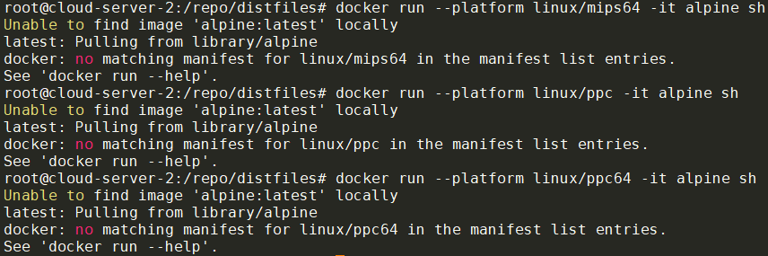

- [chroot到aarch64的alpine minirootfs](#chroot到aarch64的alpine-minirootfs)
- [docker 支持multi-arch](#docker-支持multi-arch)
  - [其实不需要`--platform`](#其实不需要--platform)
- [其他arch参考](#其他arch参考)
  - [mips64](#mips64)
  - [ppc](#ppc)
  - [ppc64](#ppc64)
  - [aarch64](#aarch64)
- [解决"not installed setuid"问题](#解决not-installed-setuid问题)
  - [背景](#背景)
  - [解决](#解决)
- [在ubuntu host上使用qemu-user](#在ubuntu-host上使用qemu-user)
- [abuild rootbld命令和bwrap](#abuild-rootbld命令和bwrap)
  - [bwrap](#bwrap)

Linux Kernel提供了binfmt_misc机制来[执行任意类型的文件](profiling_调试和分析记录3.md#linux执行文件的过程).

简单来说
* 对于ELF可执行文件, Linux执行一个ELF文件的过程, 其实是执行ld.so, 再由后者去真正完成加载和执行.
* 对于其他文件可执行文件, 内核首先读这个文件的头128字节, 来确定用哪个handler来执行这个文件. 对不同类型的文件, 可以注册不同的handler.
  * 脚本文件一般都在文件第一行, 比如有`#!/bin/python2`的, 是用python2来执行.
  * 用binfmt_misc机制可以注册handler, 比如注册.jpg用feh打开: `echo ':fehjpg:E::jpg::/usr/bin/feh:' > /proc/sys/fs/binfmt_misc/register`

# chroot到aarch64的alpine minirootfs
思路是在x86_64的host上先起个container, 在container里面使用binfmt_misc机制注册qemu user mode来执行aarch64的bin.

首先, `binfmt_misc`可以在container里面使用. 一般的container是没有`/proc/sys/fs/binfmt_misc/register`文件的, 因为在container内部, `binfmt_misc`需要手动mount.

在alpine container里面操作:
```shell
$ lsmod | grep binfmt
binfmt_misc            20480  1

# 在container里面需要手动mount, 需要privileged选项
$ sudo mount binfmt_misc -t binfmt_misc /proc/sys/fs/binfmt_misc

# 我使用alpine系统, 安装qemu-aarch64
$ sudo apk add qemu-aarch64

$ which qemu-aarch64
/usr/bin/qemu-aarch64

# 注册qemu-aarch64
sudo sh -c 'echo ":qemu-aarch64:M::\x7fELF\x02\x01\x01\x00\x00\x00\x00\x00\x00\x00\x00\x00\x02\x00\xb7\x00:\xff\xff\xff\xff\xff\xff\xff\x00\xff\xff\xff\xff\xff\xff\xff\xff\xfe\xff\xff\xff:/usr/bin/qemu-aarch64:F" > /proc/sys/fs/binfmt_misc/register'

# 注册成功后可以看到多了qemu-aarch64文件.
$ ls /proc/sys/fs/binfmt_misc/qemu-aarch64
/proc/sys/fs/binfmt_misc/qemu-aarch64

# 这个文件用rm是删不掉的., 只有取消注册才能删掉.
sudo sh -c 'echo -1 > /proc/sys/fs/binfmt_misc/qemu-aarch64'
```

在container内部下载aarch64版本的minirootfs, 准备chroot
```shell
$ wget https://dl-cdn.alpinelinux.org/alpine/v3.18/releases/aarch64/alpine-minirootfs-3.18.6-aarch64.tar.gz

$ mkdir rootfs && cd rootfs && tar xvf ../alpine-minirootfs-3.18.6-aarch64.tar.gz

# 可以看到, rootfs下面的bin都是ARM aarch64的
$ file bin/busybox
bin/busybox: ELF 64-bit LSB pie executable, ARM aarch64, version 1 (SYSV), dynamically linked, interpreter /lib/ld-musl-aarch64.so.1, stripped
```

最后一步, chroot, 我用了unshare做了简单的名字空间隔离:
```shell
# bind mount当前的proc -- 这里不推荐, 因为外面的系统是x86_64的
#sudo mount --bind /proc proc

# 方法1: 直接指定chroot后, 执行/usr/bin/qemu-aarch64 /bin/sh
$ unshare -mprf env -i /usr/sbin/chroot . /usr/bin/qemu-aarch64 /bin/sh

# 方法2: 直接执行/bin/sh, 因为我们注册了qemu-aarch64的binfmt_misc handler
unshare -mprf env -i /usr/sbin/chroot . /bin/sh
# 如果想继承父进程的env, 就把env -i去掉.
unshare -mprf chroot . /bin/sh

# 经过验证, 下面的命令更好用
sudo unshare -mpf --setgroups allow chroot . /bin/sh

# 进入aarch64的chroot环境后, 可以直接执行shell命令
which sh
/bin/sh

# 做其他有意义的事情之前, 要mount proc, dev, sys等文件系统
mount -t devtmpfs none /dev
mkdir -p /dev/pts
mount -t devpts none /dev/pts
mount -t proc none /proc
mount -t sysfs none /sys
```


`unshare`的选项含义:
* `-m`: Unshare  the  mount  namespace
* `-p`: Unshare the PID namespace
* `-r`: 在内部使用root用户
* `-f`: 先fork一个子进程再run指定的命令. 否则直接在当前进程执行命令.
注意, 如果只用`unshare -mr`, chroot环境中则不能`mount -t proc none /proc`, 会报错`mount: permission denied (are you root?)`, 是因为在当前进程下已经不能再mount proc了, 解决办法是用`-f --fork`选项.
* `--mount-proc`: 这也是一个常用选项. 在执行命令之前mount proc. 但上面的例子里没有使用, 因为我们chroot进入的是aarch64系统, 用了这个选项也不起作用, 还是要在chroot里面自己mount proc. 如果是host native的命令, 比如`unshare -mprf --mount-proc ls /proc`, 则`--mount-proc`是管用的.

尝试在aarch64 rootfs里面编译成功:
```shell
apk add musl-dev gcc file
echo 'int main(){return 0;}' > main.c
gcc -O2 main.c
file a.out
a.out: ELF 64-bit LSB pie executable, ARM aarch64, version 1 (SYSV), dynamically linked, interpreter /lib/ld-musl-aarch64.so.1, with debug_info, not stripped
```

注: 
* 所有container, 包括host, 共享binfmt_misc的配置, 操作会互相影响. 因为只有一个binfmt_misc驱动.
* binfmt_misc的`F`标记的含义, 即使是在container里面注册的`/usr/bin/qemu-aarch64`, container退出后, 还可以继续使用, 因为该文件在kernel已经被open了, 不关闭.
> The usual behaviour of binfmt_misc is to spawn the binary lazily when the misc format file is invoked. However, this doesn’t work very well in the face of mount namespaces and changeroots, so the F mode opens the binary as soon as the emulation is installed and uses the opened image to spawn the emulator, meaning it is always available once installed, regardless of how the environment changes.

参考:
* [qemu binfmt的magic查表](https://github.com/qemu/qemu/blob/master/scripts/qemu-binfmt-conf.sh)
* [binfmt_misc用法](https://www.kernel.org/doc/Documentation/admin-guide/binfmt-misc.rst)
* [alpine chroot参考](https://wiki.alpinelinux.org/wiki/How_to_make_a_cross_architecture_chroot)

# docker 支持multi-arch
docker run, build等命令支持`--platform`参数来运行其他arch的docker image

```shell
docker run --platform linux/arm64 -it docker-registry-remote.artifactory-blr1.int.net.nokia.com/alpine sh
```


如上图, 加了`--platform linux/arm64`后, docker会自动pull对应arch的image, 然后启动, 并成功运行了aarch64的alpine.

platform支持:
* linux/amd64: 64-bit x86 architecture (commonly referred to as x86_64 or AMD64)
* linux/arm64: 64-bit ARM architecture (ARMv8)
* linux/arm/v7: 32-bit ARM architecture (ARMv7)
* linux/arm/v6: 32-bit ARM architecture (ARMv6)
* linux/ppc64le: 64-bit PowerPC little-endian architecture
* linux/ppc64: 64-bit PowerPC architecture
* linux/s390x: 64-bit IBM Z architecture
* linux/386: 32-bit x86 architecture
* linux/riscv64: 64-bit RISC-V architecture

## 其实不需要`--platform`
`--platform`是告诉docker, 目标image的arch是什么类型的, 用于pull到目标arch的image.

其实如果已经pull下来了image, 用`docker images`是能够看到不同arch的image的. 比如刚刚使用的`alpine:latest`, 现在已经是arm64架构了:
```shell
$ docker inspect ace17d5d883e | grep "Architecture"
        "Architecture": "arm64",
```

直接`docker run`这个image, 也是可以的. 只是会有个warning
```shell
$ docker run -it ace17d5d883e sh
WARNING: The requested image's platform (linux/arm64/v8) does not match the detected host platform (linux/amd64) and no specific platform was requested
/ # ldd
musl libc (aarch64)
Version 1.2.4_git20230717
Dynamic Program Loader
Usage: /lib/ld-musl-aarch64.so.1 [options] [--] pathname
```

所以:
* 只要注册了`binfmt_misc`handler, 可以直接`docker run`目标image
* 用了`--platform`的好处是让docker自动pull对应arch的image

结论: 可以自己build不同arch的image, 然后直接`docker run`这个image id.

参考:
* https://docs.docker.com/build/guide/multi-platform/
* https://docs.docker.com/build/building/multi-platform/
* https://github.com/multiarch/qemu-user-static

# 其他arch参考
使用root用户执行
## mips64
```shell
mkdir -p ~/rootfs && cd ~/rootfs

apk add qemu-mips64

sh -c 'echo ":qemu-mips64:M::\x7fELF\x02\x02\x01\x00\x00\x00\x00\x00\x00\x00\x00\x00\x00\x02\x00\x08:\xff\xff\xff\xff\xff\xff\xff\x00\x00\xff\xff\xff\xff\xff\xff\xff\xff\xfe\xff\xff:/usr/bin/qemu-mips64:F" > /proc/sys/fs/binfmt_misc/register'

ARCH=mips64
mkdir -p $ARCH/etc/apk/
cp /etc/apk/repositories $ARCH/etc/apk/
apk add -p $ARCH --initdb -U --arch $ARCH --allow-untrusted alpine-base

unshare -mpf --setgroups allow chroot $ARCH /bin/sh

#在里面看到
# ldd
musl libc (mips64-sf)
Version 1.2.4
Dynamic Program Loader
Usage: /lib/ld-musl-mips64-sf.so.1 [options] [--] pathname
```

## ppc
```shell
mkdir -p ~/rootfs && cd ~/rootfs

apk add qemu-ppc

sh -c 'echo ":qemu-ppc:M::\x7fELF\x01\x02\x01\x00\x00\x00\x00\x00\x00\x00\x00\x00\x00\x02\x00\x14:\xff\xff\xff\xff\xff\xff\xff\x00\xff\xff\xff\xff\xff\xff\xff\xff\xff\xfe\xff\xff:/usr/bin/qemu-ppc:F" > /proc/sys/fs/binfmt_misc/register'

ARCH=ppc
mkdir -p $ARCH/etc/apk/
cp /etc/apk/repositories $ARCH/etc/apk/
apk add -p $ARCH --initdb -U --arch $ARCH --allow-untrusted alpine-base

unshare -mpf --setgroups allow chroot $ARCH /bin/sh

#在里面看到
# ldd
musl libc (powerpc)
Version 1.2.4
Dynamic Program Loader
Usage: /lib/ld-musl-powerpc.so.1 [options] [--] pathname
```

## ppc64
```shell
mkdir -p ~/rootfs && cd ~/rootfs

apk add qemu-ppc64

sh -c 'echo ":qemu-ppc64:M::\x7fELF\x02\x02\x01\x00\x00\x00\x00\x00\x00\x00\x00\x00\x00\x02\x00\x15:\xff\xff\xff\xff\xff\xff\xff\x00\xff\xff\xff\xff\xff\xff\xff\xff\xff\xfe\xff\xff:/usr/bin/qemu-ppc64:F" > /proc/sys/fs/binfmt_misc/register'

ARCH=ppc64
mkdir -p $ARCH/etc/apk/
cp /etc/apk/repositories $ARCH/etc/apk/
apk add -p $ARCH --initdb -U --arch $ARCH --allow-untrusted alpine-base

unshare -mpf --setgroups allow chroot $ARCH /bin/sh

#在里面看到
# ldd
musl libc (powerpc64)
Version 1.2.4
Dynamic Program Loader
Usage: /lib/ld-musl-powerpc64.so.1 [options] [--] pathname
```

## aarch64
```shell
mkdir -p ~/rootfs && cd ~/rootfs

apk add qemu-aarch64

sh -c 'echo ":qemu-aarch64:M::\x7fELF\x02\x01\x01\x00\x00\x00\x00\x00\x00\x00\x00\x00\x02\x00\xb7\x00:\xff\xff\xff\xff\xff\xff\xff\x00\xff\xff\xff\xff\xff\xff\xff\xff\xfe\xff\xff\xff:/usr/bin/qemu-aarch64:F" > /proc/sys/fs/binfmt_misc/register'

ARCH=aarch64
mkdir -p $ARCH/etc/apk/
cp /etc/apk/repositories $ARCH/etc/apk/
apk add -p $ARCH --initdb -U --arch $ARCH --allow-untrusted alpine-base

unshare -mpf --setgroups allow chroot $ARCH /bin/sh

#在里面看到
# ldd
musl libc (aarch64)
Version 1.2.4
Dynamic Program Loader
Usage: /lib/ld-musl-aarch64.so.1 [options] [--] pathname
```

如果有这样的error`00000040028F5B10:error:0A000086:SSL routines:tls_post_process_server_certificate:certificate verify failed:ssl/statem/statem_clnt.c:1889:`
需要:
```shell
apk add -p $ARCH --initdb -U --arch $ARCH --allow-untrusted ca-certificates
```

# 解决"not installed setuid"问题
## 背景
当准备好sysroot-aarch64目录后, 我们可以chroot到该目录. 因为之前注册过qemu-aarch64的binfmt_misc handler, 所以我们可以直接在x86_64机器上运行aarch64的最小系统
```
# 在x86_64 host上
doas unshare -mpf --setgroups allow chroot sysroot-aarch64 /bin/sh

# 已经进入到chroot环境, 里面是aarch64的系统
# 默认是root用户, 切换到reborn用户.
su reborn

# 但在reborn用户下, 运行doas命令会返回错误
doas ls
doas: not installed setuid
```

这个错误和setuid bit有关.
```
ls -l `which doas`
-rwsr-xr-x    1 root     root         67280 Sep 24  2023 /usr/bin/doas
```
上面`/usr/bin/doas`这个bin有个`s`权限, 这个权限就是setuid标记, 有了这个bit, `/usr/bin/doas`就可以以root身份来运行.

现在的问题是, `/usr/bin/doas`已经有了`s`权限, 但为什么会报错`not installed setuid`?

问题出现在我们是用`qemu-aarch64`来运行的`doas`, 而`qemu-aarch64`不带`s`标记, 理论上`qemu-aarch64`不能以root运行, 那么以它来调用`qemu-aarch64 doas ls`就不能以root运行, 报错是合理的.

## 解决
根据[binfmt-misc](https://www.kernel.org/doc/Documentation/admin-guide/binfmt-misc.rst)的说明, 增加`C`标记可以解决:

```
sh -c 'echo ":qemu-aarch64:M::\x7fELF\x02\x01\x01\x00\x00\x00\x00\x00\x00\x00\x00\x00\x02\x00\xb7\x00:\xff\xff\xff\xff\xff\xff\xff\x00\xff\xff\xff\xff\xff\xff\xff\xff\xfe\xff\xff\xff:/usr/bin/qemu-aarch64:CF" > /proc/sys/fs/binfmt_misc/register'
```
我在注册binfmt-misc的qemu-aarch64 handler时, 最后加了`CF`标记.

最后在chroot到sysroot-aarch64后, 用reborn用户可以正常执行`doas`命令.

总结: 在用qemu-aarch64来执行带`s`标记的binary时, 如果出现`not installed setuid`错误, 要在注册binfmt_misc handler时, 加上`C`标记.

即:
```
cat /proc/sys/fs/binfmt_misc/qemu-aarch64
enabled
interpreter /usr/bin/qemu-aarch64
flags: F
offset 0
magic 7f454c460201010000000000000000000200b700
mask ffffffffffffff00fffffffffffffffffeffffff
```
要变成
```
cat /proc/sys/fs/binfmt_misc/qemu-aarch64
enabled
interpreter /usr/bin/qemu-aarch64
flags: CF
offset 0
magic 7f454c460201010000000000000000000200b700
mask ffffffffffffff00fffffffffffffffffeffffff
```

实际上, 通常最终的标记是:
```
cat /proc/sys/fs/binfmt_misc/qemu-aarch64
enabled
interpreter /usr/libexec/qemu-binfmt/aarch64-binfmt-P
flags: POCF
offset 0
magic 7f454c460201010000000000000000000200b700
mask ffffffffffffff00fffffffffffffffffeffffff
```

`POCF`标记的含义:
> P - preserve-argv[0]
Legacy behavior of binfmt_misc is to overwrite the original argv[0] with the full path to the binary. When this flag is included, binfmt_misc will add an argument to the argument vector for this purpose, thus preserving the original argv[0]. e.g. If your interp is set to /bin/foo and you run blah (which is in /usr/local/bin), then the kernel will execute /bin/foo with argv[] set to ["/bin/foo", "/usr/local/bin/blah", "blah"]. The interp has to be aware of this so it can execute /usr/local/bin/blah with argv[] set to ["blah"].

> O - open-binary
Legacy behavior of binfmt_misc is to pass the full path of the binary to the interpreter as an argument. When this flag is included, binfmt_misc will open the file for reading and pass its descriptor as an argument, instead of the full path, thus allowing the interpreter to execute non-readable binaries. This feature should be used with care - the interpreter has to be trusted not to emit the contents of the non-readable binary.

> C - credentials
Currently, the behavior of binfmt_misc is to calculate the credentials and security token of the new process according to the interpreter. When this flag is included, these attributes are calculated according to the binary. It also implies the O flag. This feature should be used with care as the interpreter will run with root permissions when a setuid binary owned by root is run with binfmt_misc.

> F - fix binary
The usual behaviour of binfmt_misc is to spawn the binary lazily when the misc format file is invoked. However, this doesn’t work very well in the face of mount namespaces and changeroots, so the F mode opens the binary as soon as the emulation is installed and uses the opened image to spawn the emulator, meaning it is always available once installed, regardless of how the environment changes.


参考:
* https://stackoverflow.com/questions/75954301/using-sudo-in-podman-with-qemu-architecture-emulation-leads-to-sudo-effective-u?noredirect=1&lq=1

# 在ubuntu host上使用qemu-user
```shell
# 安装qemu-user-static, 会自动注册binfmt_misc handler
apt install qemu-user-static
# 可以查看注册的handler详细信息
update-binfmts --display
```
安装后, 多个binfmt_misc handler被自动注册好了: 


随后用
```shell
docker run --platform linux/arm64 -it alpine sh
```
就可以直接执行aarch64的docker image了

但是alpine并没有提供mips64, ppc, ppc64的image: 


参考:
* https://wiki.debian.org/QemuUserEmulation

# abuild rootbld命令和bwrap
abuild提供了rootbld命令, 可以在`bwrap`创建的类chroot环境里运行`abuild build`.
其具体的实现是`/usr/bin/abuild`的`rootbld`函数:
* 首先要求CBUILD=$CHOST
* 其次要求qemu的handler已经注册, 即存在文件`"/proc/sys/fs/binfmt_misc/qemu-$(rootbld_qemu_arch)"`
* 创建临时目录`BUILD_ROOT=$(mktemp -d /var/tmp/abuild.XXXXXXXXXX)`
* 其他准备工作
* 调用bwrap
```shell
    bwrap --new-session --unshare-ipc --unshare-uts $bwrap_opts \
        --ro-bind "$BUILD_ROOT" / \
        --proc /proc \
        --dev-bind /dev /dev \
        --bind "$BUILD_ROOT/$HOME" "$HOME" \
        --ro-bind "$ABUILD_USERDIR" "$ABUILD_USERDIR" \
        --ro-bind "$aportsgit" "$aportsgit" \
        ${USE_CCACHE:+ --bind "$HOME/.ccache" "$HOME/.ccache"} \
        --bind "$SRCDEST" "$SRCDEST" \
        --bind "$BUILD_ROOT/tmp" /tmp \
        --bind "$BUILD_ROOT/tmp/src" "$srcdir" \
        --bind "$BUILD_ROOT/tmp/pkg" "$pkgbasedir" \
        --bind "$REPODEST" "$REPODEST" \
        --hostname "build-$buildhost-$CARCH" \
        --chdir "$startdir" \
        --clearenv \
        --setenv HOME "$HOME" \
        --setenv REPODEST "$REPODEST" \
        ${ABUILD_BOOTSTRAP:+--setenv ABUILD_BOOTSTRAP "$ABUILD_BOOTSTRAP"} \
        --setenv SOURCE_DATE_EPOCH "$SOURCE_DATE_EPOCH" \
        --setenv ABUILD_LAST_COMMIT "$ABUILD_LAST_COMMIT" \
        --setenv PATH ${USE_CCACHE:+/usr/lib/ccache/bin:}/bin:/usr/bin:/sbin:/usr/sbin \
        --setenv FAKEROOTDONTTRYCHOWN 1 \
        --unsetenv CBUILD \
        /usr/bin/abuild $force rootbld_actions
```
* update_abuildrepo_index

## bwrap
[Bubblewrap](https://github.com/containers/bubblewrap)致力于给非特权用户提供一个sandbox环境. 可以认为bwrap是一个非特权用户的chroot, 最早起源于[linux-user-chroot](https://gitlab.gnome.org/Archive/linux-user-chroot)
