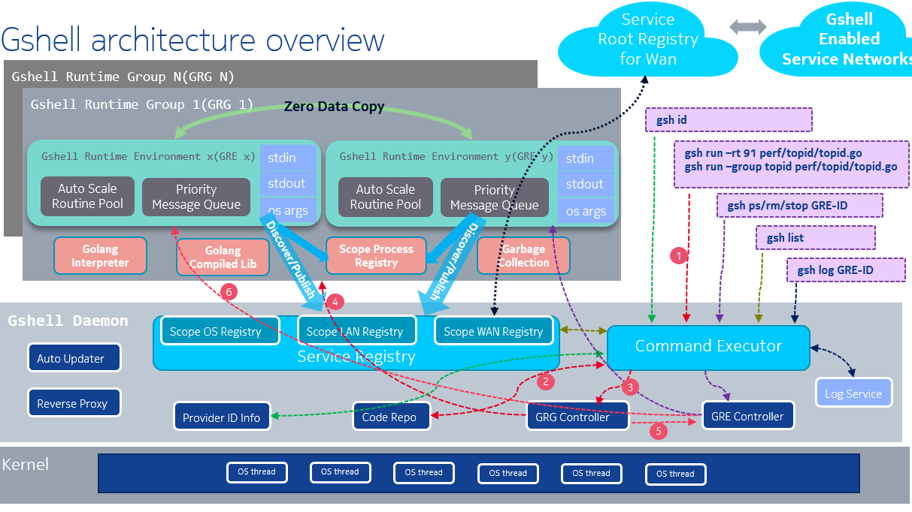

- [adaptiveservice](#adaptiveservice)
  - [hello例子](#hello例子)
    - [client端](#client端)
    - [server端](#server端)
- [gshell](#gshell)
- [topid](#topid)

# adaptiveservice
[godevsig/adaptiveservice](https://github.com/godevsig/adaptiveservice)是用golang实现的一个简单的服务发现框架.
* 服务端发布服务, 客户端发现服务.
* 服务使用{"publisher", "service"}来标识.
  * publisher类似github repo中的组织名或用户名, 标识这个服务的代码拥有者.
  * service就是服务的名字, 类似github repo的repo名.
  * 在一个服务网络中, 可以有同名服务的多个实例, 对客户端来说, 无论哪个实例, 都提供一样的服务. 客户端可以根据策略, 比如随机策略, 或者延迟最小策略, 选择其中一个实例来通信.
* 支持root registry和局域网广播发现.
* 消息的交互只有三个API.
  * Send(msg)  
msg一般定义于服务端, 是golang的struct, 表示服务端可以处理哪些struct. client import后就可以直接使用.
  * Recv(msgPtr)  
msgPtr是要接收的msg的指针. 在golang中, 由于gc, 并不需要提前申请内存.
  * SendRecv(msg, msgPtr)  
这个形式的API可以当作RPC来使用.
* server端的消息处理使用弹性伸缩的worker pool, 自动支持并发.
* client端支持多路复用, 提高并发.
* 支持在同一个进程内使用, 支持在同一个系统内使用, API都一样.
* 内置反向代理, 从而NAT内的服务也能被外部发现并连接.

参考:
* [README](https://github.com/godevsig/adaptiveservice/blob/master/README.md)
* [使用说明](https://github.com/godevsig/gshellos/blob/master/docs/adaptiveservice.md)

## hello例子
### client端
client要先发现并连接到服务, 然后就可以收发消息.
```go
package main

import (
	"fmt"

	as "github.com/godevsig/adaptiveservice"
	msg "github.com/godevsig/adaptiveservice/examples/hello/message"
)

func main() {
	c := as.NewClient()

	conn := <-c.Discover("example", "hello")
	if conn == nil {
		fmt.Println(as.ErrServiceNotFound("example", "hello"))
		return
	}
	defer conn.Close()

	request := msg.HelloRequest{Who: "John", Question: "who are you"}
	var reply msg.HelloReply
	if err := conn.SendRecv(request, &reply); err != nil {
		fmt.Println(err)
		return
	}
	fmt.Println(reply.Answer)
}
```

### server端
server端需要定义可以处理的struct, 以及其handler. 在这个struct到达server端的时候, 框架在worker pool里分配worker, handler被框架在worker中调用.

message.go中定义消息struct如下:
```go

package message

import (
	"strings"

	as "github.com/godevsig/adaptiveservice"
)

// HelloRequest is the request from clients
type HelloRequest struct {
	Who      string
	Question string
}

// HelloReply is the reply of HelloRequest to clients
type HelloReply struct {
	Answer string
}

// Handle handles msg.
func (msg HelloRequest) Handle(stream as.ContextStream) (reply interface{}) {
	answer := "I don't know"

	question := strings.ToLower(msg.Question)
	switch {
	case strings.Contains(question, "who are you"):
		answer = "I am hello server"
	case strings.Contains(question, "how are you"):
		answer = "I am good"
	}
	return HelloReply{answer + ", " + msg.Who}
}

func init() {
	as.RegisterType(HelloRequest{})
	as.RegisterType(HelloReply{})
}
```

helloserver.go中启动service:
```go
package main

import (
	"fmt"

	as "github.com/godevsig/adaptiveservice"
	msg "github.com/godevsig/adaptiveservice/examples/hello/message"
)

func main() {
	s := as.NewServer().SetPublisher("example")

	knownMsgs := []as.KnownMessage{msg.HelloRequest{}}
	if err := s.Publish("hello", knownMsgs); err != nil {
		fmt.Println(err)
		return
	}

	if err := s.Serve(); err != nil { // ctrl+c to exit
		fmt.Println(err)
	}
}
```

# gshell
[godevsig/gshellos](https://github.com/godevsig/gshellos)是基于adaptive service的一个go服务编排的框架. gshellos使用了go解释器[yaegi](https://github.com/traefik/yaegi), 使gshell框架得以在任意gshell节点运行位于中央仓库[grepo](https://github.com/godevsig/grepo)下的go代码.

  

文档:
* [README](https://github.com/godevsig/gshellos/blob/master/README.md)

# topid
topid是基于gshell的一个app, 代码位于[grepo](https://github.com/godevsig/grepo), 可以采集linux的进程信息, 并配合topid chart服务, 可以在web上实时显示CPU和MEM的占用.

得益于gshell, topid很方便在各个CPU arch下面运行, 没有运行时依赖.

[topid usage](perf/topid/README.md)

[topid chart usage](perf/topidchart/cmd/README.md)


