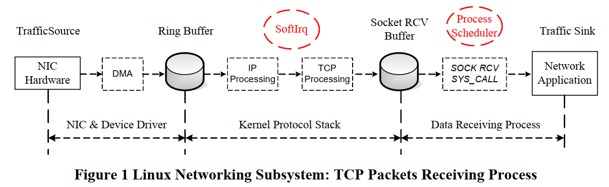
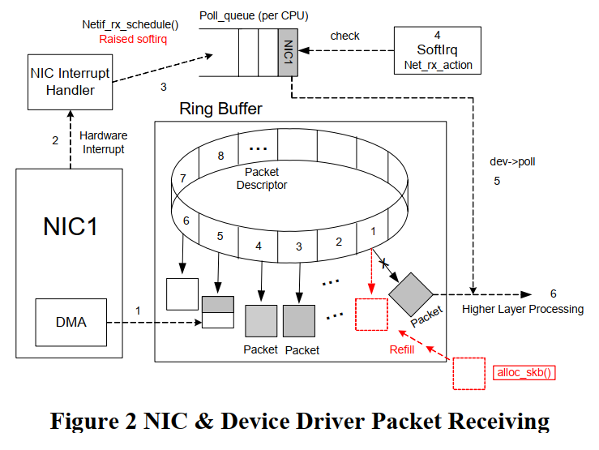
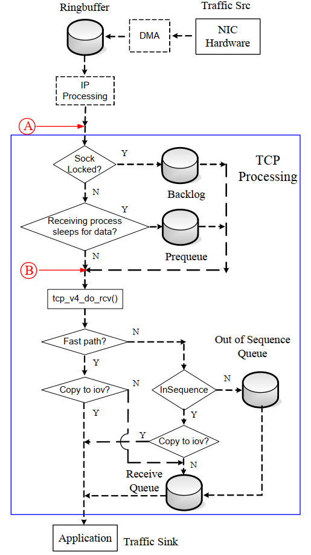
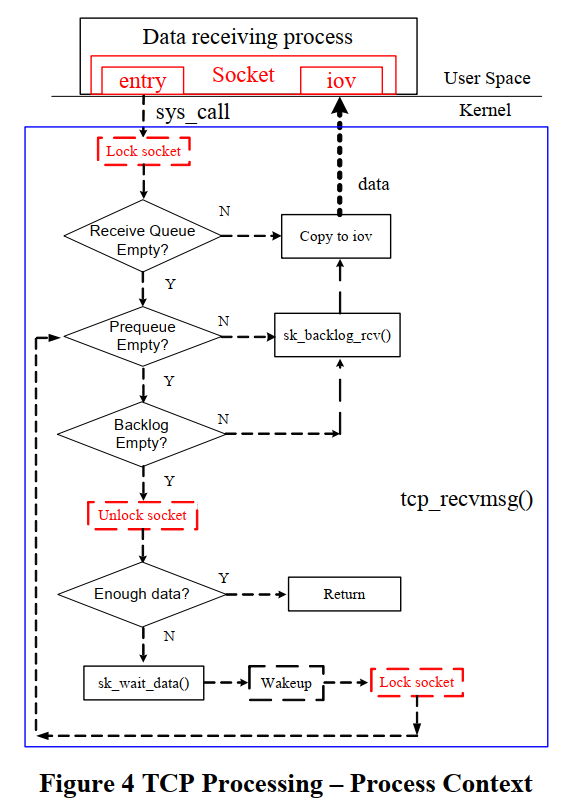
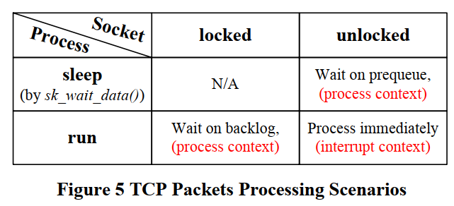
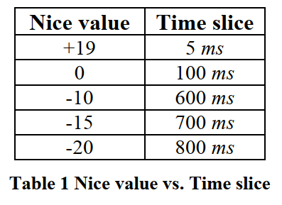
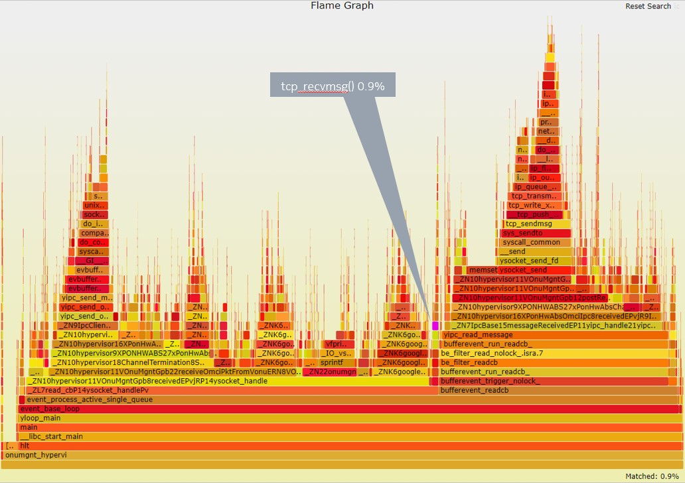

- [TCP特点](#tcp特点)
- [TCP性能](#tcp性能)
- [TCP收报流程](#tcp收报流程)
  - [NIC收报](#nic收报)
  - [IP流程](#ip流程)
  - [TCP流程](#tcp流程)
    - [进程上下文的流程](#进程上下文的流程)
- [TCP性能分析](#tcp性能分析)
  - [linux进程调度](#linux进程调度)
  - [调度对收报的影响](#调度对收报的影响)
- [提高性能的方法](#提高性能的方法)
- [和火焰图对照](#和火焰图对照)

本文是2006年一篇论文的学习笔记: https://lss.fnal.gov/archive/2006/pub/fermilab-pub-06-432-cd.pdf

基于linux2.6.14

# TCP特点
* 大部分traffic都是走的TCP
* 慢启动, 拥塞窗口, 指数避让, 快重传
* 提高TCP性能的方向
    * 流控: flow control
    * 拥塞控制算法
    * 硬件offloading

# TCP性能
从linux2.6开始, linux允许内核抢占, 提高了响应速度. 但在某些情况下, 抢占会大幅降低网络协议栈的处理速度.

# TCP收报流程
可参考另一篇笔记`Networking杂记`  
假设L2是eth, eth的驱动用了NAPI. NAPI降低了CPU的中断负载.

一个packet从ingress进linux, 到deliver到应用, 其data在沿着协议栈向上的传递过程中, 始终保存在内存的同一个地方. 流程包括三部分:
* NIC驱动收报到ring buffer
* packet从ring buffer转移到socket buffer(skb), 沿着协议栈处理. 这部分是在softirq上下文执行的.
* packet的data被拷贝到app的接收buffer. 这个app是数据接收进程.

  

## NIC收报
linux使用sk_buff承载一个最大到MTU的packet. NIC driver使用一个ring buffer 描述符来收报.

  

在refill的时候, 新建一个空的skb, 把含有这个skb的描述符挂到ring中.

skb在主内存中, 被驱动配置为NIC可以直接DMA访问, 通常通过PCIe总线.

NIC物理层收到packet, 就使用一个描述符, 把packet DMA到skb, 把这个描述符标记为已用. 

**如果描述符已经用完, 则新的packet会被丢弃**  
所以要尽快的refill描述符.

这个skb在向上沿着协议栈传递过程中, 内存位置保持不变(在kernel中没有重复拷贝)

简要流程
1. NIC物理层收报, DMA到skb
2. 发中断, 驱动维护ring buff, 在所有ring的描述符处理完之前, 关闭中断.
3. 驱动调用`netif_rx_schedule()`, 触发softirq  
> It puts a reference to the device into the poll queue of the interrupted CPU
4. 还是当前CPU, 稍后处理softirq, 这也是中断上下文. CPU调用dev->poll()收报.  
> The CPU polls each device in its poll queue to get the received packets from the ring buffer by calling the poll method dev->poll() of the device driver.
5. `dev->poll()`调用`netif_receive_skb()`沿协议栈传递
6. skb被poll()出来后, 对应的ring描述符就空出来了, 就可以refill了.
7. 所有描述符处理完, 开中断.

## IP流程
此时还是在softirq上下文(注: 比较新的kernel是ksoftirqd内核线程, 每个核一个)

1. `netif_receive_skb()`里
    * tcpdump工作在这
    * vlan工作在这
    * 网桥工作在这
2. `netif_receive_skb()`调用`ip_rcv()`; 如果是arp, 就调用arp_rcv()
3. `ip_rcv()`检查ip头, checksum, 确保这个packet是好的;
    * 这里有netfilter hook
    * 处理多播
    * `ip_rcv_finish()`处理路由
        * `ip_forward()` 目的不是本机, 查路由后直接调用neighbour的output接口
        * `ip_local_deliver()` 本地报文: IP层的分片重组发生在这里. 先调用raw_local_deliver()来给raw socket deliver报文, 然后去掉IP头, 调用4层处理函数, 对TCP来说, 是`tcp_v4_rcv()`
        * 另外一个netfilter hook

## TCP流程
到这里的packet就是TCP segment.对应的L4入库函数是`tcp_v4_rcv()`:
* 先做TCP头的检查
* `__tcp_v4_lookup()`找对应的socket: 到TCP这一层, packet就要对应到socket了. 没有找到socket的packet就会被丢弃.
* socket是有锁保护的. 对socket的访问都要持有这个锁. packet走到这里是个关键点, 后面的处理**可能**会转到数据接收进程上下文.
    * 如果socket被锁了, 说明数据接收进程正在处理之前的packet, 就会把现在这个packet放到`backlog queue`里.
    * 如果socket没锁, 数据接收进程在sleep等待, 则这个packet会被加到`prequeue`; 放第一个packet到`prequeue`会唤醒数据接收进程.
    * `prequeue`里面的packets(复数)会在进程上下文被`tcp_v4_do_rcv()`处理. 这个函数也用于drain `backlog queue`
    * 如果`prequeue`溢出了, 会在softirq里面调用`tcp_v4_do_rcv()`
    * `tcp_v4_do_rcv()`流程(可能在进程上下文, 也可能在中断上下文)
        * `tcp_rcv_established()`: 处理已经建立好的连接, 大部分packet是这里. 包括检查packet序号, RTT估计, 应答, 和数据处理. 其中数据处理部分包括:
            * fast path: packet可以**直接diliver**到用户态buffer. 用户态调用系统调用`recvmsg()`的时候就准备好了一个`iovec`结构, 如果packet同时满足如下条件:
                * 这个packet属于当前active的进程. AND
                * 这个packet 的sequence号正好是socket的下一个sequence号. AND
                * 这个packetk可以完整的放到iovec里面
            * slow path: sequence号对的packet(顺序的), 放到`receive queue`里(这个queue保证顺序, 并且已经应答过了); 乱序的packet放到`out-of-sequence queue`, 当后面的packet把顺序补上以后, 这个queue里面的packet就会被转到`receive queue`
        * `tcp_rcv_state_process() `: 建立连接或者关闭连接等TCP状态转换

  

### 进程上下文的流程
通常`backlog`和`prequeue`是在用户态drain的. 收报的用户态API, 比如`recv()`, 都最终会调到内核的`tcp_recvmsg()`(`net/ipv4/tcp.c`)
* `tcp_recvmsg()`先lock这个socket
* 检查`receive queue`, 这个queue里的packet是在中断上下文已经处理好的(已经调用过`tcp_v4_do_rcv()`), 是保序的, 已应答的. 直接拷贝到用户态就行了
* 检查`prequeue`和`backlog queue`, 调用`tcp_v4_do_rcv()`来处理, 参考上面的fast path和slow path流程.
* `tcp_recvmsg()`通常都至少读`SO_RCVLOWAT`(通常为1个字节)才能返回; 如果没读到就会`sk_wait_data()`等待
* 返回用户态之前unlock这个socket.

  

# TCP性能分析
前面说了, `tcp_v4_do_rcv()`可能在中断上下文执行, 也可能在进程上下文执行.  
一个packet被IP层传递过来的时候, 总是要找个出口来处理, 要么是进程, 要么还是softirq, 总之不能停:
* 如果进程在`sk_wait_data()`睡眠, 说明进程还在`recv()`系统调用, 根据流程图, socket已经被unlock, 那softirq过来的packet就会被放到`prequeue`, 进程会被唤醒.
* 如果进程调用了`recv()`系统调用, socket就已经被lock, 并且进程在runnable状态(不一定就是在run, 也可能是在run queue里等待cpu时间片), 就放到`backlog queue`
* 以上两种情况, 进程会在进程上下文调用`tcp_v4_do_rcv()`来处理`prequeue`和`backlog queue`
* 如果进程处于running状态, 但在做其他处理, 还没有调用`recv()`, 那么softirq过来的packet会直接在softirq内调用`tcp_v4_do_rcv()`来处理, 处于中断上下文
* 如果`prequeue`溢出了, 还是softirq来处理.

**疑问**: 在softirq的IP层处理完, packet向上传递给TCP的时候, 已经确定了和socket的绑定关系(ip+tcp端口号), 为什么不干脆直接全部放到接收进程的receive queue里? 让`tcp_v4_do_rcv()`全部在进程上下文里做?

为什么进程正在做其他事情的时候, softirq要帮进程做`tcp_v4_do_rcv()`? 

是因为进程在做其他事情的时候, 对应的CPU核在忙. 但对SMP系统来说, 还有其他核可以**同时**处理packet?

最大限度提高packet处理能力吗? 照这么讲, 再多开几个核并发处理packet岂不是更快?

  
注: 图上的`sk_backlog_rcv()`实际上调用的就是`tcp_v4_do_rcv()`

中断上下文的优先级是最高的, 和system load没有关系, 在中断上下文处理的packet总是立即被协议栈处理.

而进程上下文的报文, 需要等待进程的时间片才能处理. 那么再系统繁忙的时候, 进程得到的调度少, 时间少, 会影响TCP处理性能.

## linux进程调度
从2.6内核开始, 已经支持内核抢占. 0-99是实时优先级, 100-140是普通优先级.  
高优先级进程一旦ready, 就会抢占低优先级的进程. 同一个优先级按时间片轮转.  
每个CPU都有一个`runqueue`, 这个`runqueue`包括两个数组:
* `active priority array`: 活动优先级数组, 一个进程用完时间片后, 就挪到过期优先级数组(非interactive情况); 或者重新插入到活动优先级数组.
* `expired priority array`: 过期优先级数组. 进程被move进来的时候会重新计算动态优先级和时间片.

活动优先级数组里面没有东西的时候, 就整个和过期优先级数组交换.

下面是不同优先级的时间片, 这个文章比较老了, 现在可能默认是10ms级别.

  

调度器对interactive的进程(即IO比较多的进程), 倾向于使用小的时间片. 这样, 同其他也是interactive的进程(时间片也小了), 一起调度的轮转速度就快了, 提高了interactive的响应效率.

## 调度对收报的影响
调度对softirq没啥影响, 所以对收报的影响体现在进程调用了`recve()`系统调用的两个状态.

比如进程`tcp_recvmsg()`在路径上, socket已经lock了, 但进程时间片用完了, 被调度器放到过期优先级数组了, 这个时候这个socket依然是lock状态. 那么在这个进程被重新调度执行的期间(即要等待所有`active priority array`的进程执行完, swap优先级数组, 再等待比它优先级高的进程执行完), TCP报文会被放到`backlog queue`里, 没有被协议栈处理, 没有应答.

没有应答时间长了, 会导致对端packet定时器超时重传, 见[RTT RTO等概念](https://blog.csdn.net/qq_35733751/article/details/80173022)  
RTT时间和报文大小, 通信双方的距离, 中间的路由时间, 和对端的处理时间相关.

总的来说, 如果系统繁忙的时候, packet在`prequeue`和`backlog queue`里面等待时间过长得不到处理, 对端就会启动packet超时重传, 进一步增加系统开销, 是情况更恶化.

# 提高性能的方法
前面说了, packet在`prequeue`和`backlog queue`里面等待时间过长得不到处理, 导致对端RTO报文重传会影响性能.

那如果都放到中断上下文处理呢? 貌似不太好.

那只有想办法减少packet在`prequeue`和`backlog queue`里面等待的时间.  
可以在调度器上想办法: 让`prequeue`和`backlog queue`里面有packet的进程尽快得到调度.

# 和火焰图对照
对一个基于TCP通信的app做火焰图, 其`tcp_recvmsg()`占比才0.9%, 说明大部分收报处理都不是在进程上下文执行的.

  

