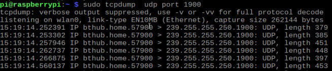
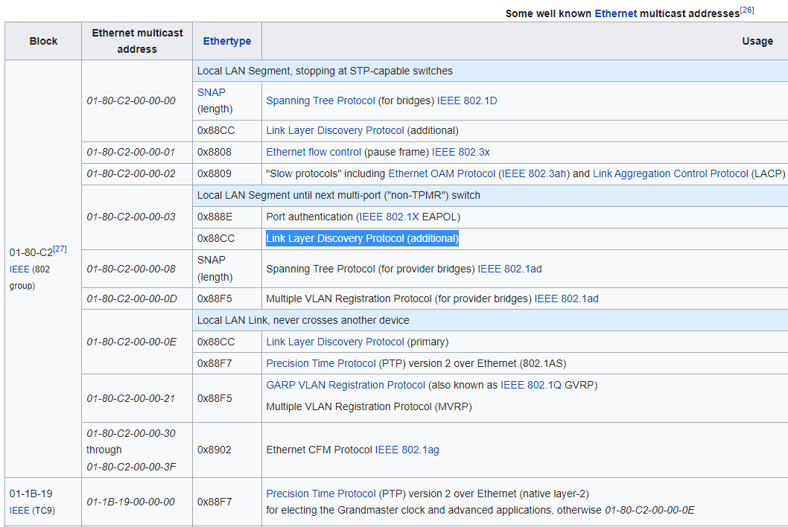
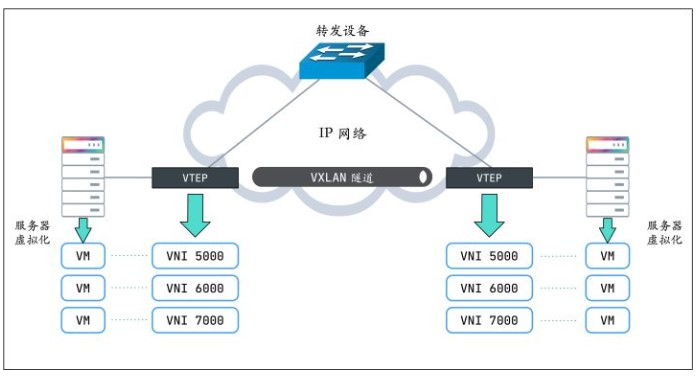
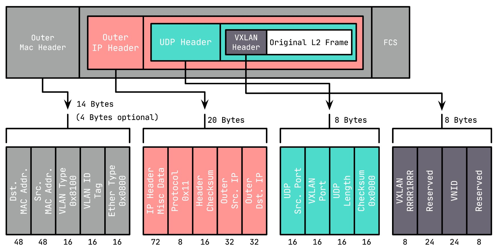
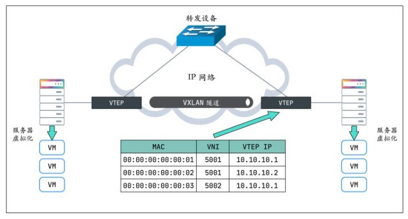
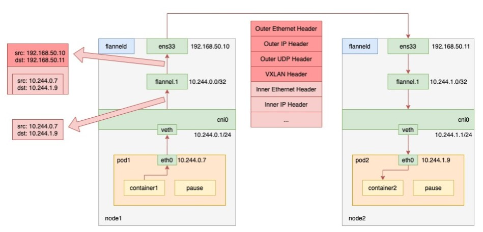

- [multicast介绍](#multicast介绍)
  - [组播网段](#组播网段)
  - [组播特点](#组播特点)
  - [组播举例](#组播举例)
  - [LLDP也是组播的一种](#lldp也是组播的一种)
- [vxlan介绍](#vxlan介绍)
  - [https://zhuanlan.zhihu.com/p/130277008](#httpszhuanlanzhihucomp130277008)
    - [VXLAN 协议原理](#vxlan-协议原理)
    - [vxlan报文格式](#vxlan报文格式)
    - [VTEP有转发表](#vtep有转发表)
- [k8s网络cni介绍](#k8s网络cni介绍)
  - [在集群的扁平网络里run nginx pods, 直接ip:port访问](#在集群的扁平网络里run-nginx-pods-直接ipport访问)
  - [使用service来处理IP变化](#使用service来处理ip变化)
- [flannel使用vxlan做backend](#flannel使用vxlan做backend)
  - [代码](#代码)
    - [历史](#历史)
      - [版本1](#版本1)
      - [版本2](#版本2)
      - [版本3](#版本3)
    - [创建vxlan设备](#创建vxlan设备)
    - [用到的库](#用到的库)
  - [vxlan如何broadcast](#vxlan如何broadcast)
    - [一个专门的实现](#一个专门的实现)

# multicast介绍
参考:
https://tldp.org/HOWTO/Multicast-HOWTO-2.html
http://www.steves-internet-guide.com/introduction-multicasting/

## 组播网段
ipv4里面, 传统上分为A B C D类地址, 组播属于D类:
```
   Bit -->  0                           31            Address Range:
           +-+----------------------------+
           |0|       Class A Address      |       0.0.0.0 - 127.255.255.255
           +-+----------------------------+
           +-+-+--------------------------+
           |1 0|     Class B Address      |     128.0.0.0 - 191.255.255.255
           +-+-+--------------------------+
           +-+-+-+------------------------+
           |1 1 0|   Class C Address      |     192.0.0.0 - 223.255.255.255
           +-+-+-+------------------------+
           +-+-+-+-+----------------------+
           |1 1 1 0|  MULTICAST Address   |     224.0.0.0 - 239.255.255.255
           +-+-+-+-+----------------------+
           +-+-+-+-+-+--------------------+
           |1 1 1 1 0|     Reserved       |     240.0.0.0 - 247.255.255.255
           +-+-+-+-+-+--------------------+
```
D类地址里面也分了多个区间, 见:https://en.wikipedia.org/wiki/Multicast_address  
一般`239.0.0.0` to `239.255.255.255`用的比较多.

特别的:
* `224.0.0.1` is the _all-hosts_ group. If you ping that group, all multicast capable hosts on the network should answer, as every multicast capable host _must_ join that group at start-up on all it's multicast capable interfaces.
* `224.0.0.2` is the _all-routers_ group. All multicast routers must join that group on all it's multicast capable interfaces.
* `224.0.0.4` is the _all DVMRP routers_, `224.0.0.5` the _all OSPF routers_, `224.0.013` the _all PIM routers_, etc.

## 组播特点
* 组播是基于UDP的, datagram
* 不需要加入组播组就可以发送多播
* 发送多播的datagram只需要open一个udp的socket, 填入多播的group地址就可以发送了
* 想接收组播报文, 必须先join一个组播组
* 目的mac是01-00-5e-00-00-00 to 01-00-5e-ff-ff-ff会被认为是组播报文
* router会转发组播报文, 而广播报文不会被router转发

## 组播举例
The **SSDP** (Simple Service Discovery Protocol) uses multicast address **239.255.255.250 **on** UDP port 1900.**  
  

## LLDP也是组播的一种
  

# vxlan介绍
vxlan是一种overlay的网络技术, 在udp之上封装了vxlan的报文, 通过ip层传输, 组成一个跨网络的L2子网.
```sh
#在eth0接口(我这里是192.168.0.14)的udp port上建立vxlan0
#上层来的到vxlan0的报文会被加上外层L2, src ip是192.168.0.14, dst port是4789
#kernel接收到dst port是4789的udp报文, 会被kernel"发送到"这个vxlan0接口
sudo ip link add vxlan0 type vxlan id 42 dev eth0 dstport 4789

1. Create vxlan device
 # ip link add vxlan0 type vxlan id 42 group 239.1.1.1 dev eth1 dstport 4789

This creates a new device named vxlan0.  The device uses the multicast
group 239.1.1.1 over eth1 to handle traffic for which there is no
entry in the forwarding table.  The destination port number is set to
the IANA-assigned value of 4789.  The Linux implementation of VXLAN
pre-dates the IANA's selection of a standard destination port number
and uses the Linux-selected value by default to maintain backwards
compatibility.

# Delete vxlan device
ip link delete vxlan0

# Show vxlan info
ip -d link show vxlan0

# 用bridge命令可以查看vxlan0的转发表
bridge fdb show dev vxlan0

# 转发表fdb可以add和remove
# bridge fdb add <remote_host_mac> dev <vxlan_interface> dst <remote_host_ip>
bridge fdb add to 00:17:42:8a:b4:05 dst 192.19.0.2 dev vxlan0
bridge fdb delete 00:17:42:8a:b4:05 dev vxlan0
```
这里的vxlan0就是VTEP

## https://zhuanlan.zhihu.com/p/130277008

`VXLAN` 不仅支持一对一，也支持一对多，一个 `VXLAN` 设备能通过像网桥一样的学习方式学习到其他对端的 IP 地址，还可以直接配置静态转发表。

VXLAN 将二层以太网帧封装在 `UDP` 中（上面说过了），相当于在三层网络上构建了二层网络。这样不管你物理网络是二层还是三层，都不影响虚拟机（或容器）的网络通信，也就无所谓部署在哪台物理设备上了，可以随意迁移。

### VXLAN 协议原理
* **VTEP**（VXLAN Tunnel Endpoints，VXLAN 隧道端点）

    VXLAN 网络的边缘设备，用来进行 VXLAN 报文的处理（封包和解包）。VTEP 可以是网络设备（比如交换机），也可以是一台机器（比如虚拟化集群中的宿主机）。

*   **VNI**（VXLAN Network Identifier，VXLAN 网络标识符）

    `VNI` 是每个 VXLAN 段的标识，是个 24 位整数，一共有 $2^{24} = 16777216$（一千多万），一般每个 `VNI` 对应一个租户，也就是说使用 `VXLAN` 搭建的公有云可以理论上可以支撑千万级别的租户。
    
  

### vxlan报文格式
  

*   **VXLAN Header** : 在原始二层帧的前面增加 `8` 字节的 VXLAN 的头部，其中最主要的是 `VNID`，占用 `3` 个字节（即 24 bit），类似 VLAN ID，可以具有 $2^{24}$ 个网段。

*   **UDP Header** : 在 VXLAN 和原始二层帧的前面使用 `8` 字节 `UDP` 头部进行封装（MAC IN UDP），目的端口号缺省使用 4789，源端口按流随机分配（通过 MAC，IP，四层端口号进行 hash 操作）， 这样可以更好的做 `ECMP`。

    > `IANA`（Internet As-signed Numbers Autority）分配了 `4789` 作为 VXLAN 的默认目的端口号。

在上面添加的二层封装之后，再添加底层网络的 IP 头部（`20` 字节）和 MAC 头部（`14` 字节），**这里的 IP 和 MAC 是宿主机的 IP 地址和 MAC 地址**。

同时，这里需要注意 `MTU` 的问题，传统网络 MTU 一般为 `1500`，这里加上 VXLAN 的封装多出的（36+14/18，对于 `14` 的情况为 `access` 口，省去了 `4` 字节的 VLAN Tag）`50` 或 `54` 字节，需要调整 MTU 为 `1550` 或 `1554`，防止频繁分包。

### VTEP有转发表
*   哪些 `VTEP` 需要加到一个相同的 VNI 组？
*   发送方如何知道对方的 `MAC` 地址？
*   如何知道目的服务器在哪个节点上（即目的 VTEP 的地址）？

第一个问题简单，VTEP 通常由网络管理员来配置。要回答后面两个问题，还得回到 VXLAN 协议的报文上，看看一个完整的 VXLAN 报文需要哪些信息：

*   **内层报文** : 通信双方的 IP 地址已经明确，只需要 VXLAN 填充对方的 `MAC` 地址，因此需要一个机制来实现 `ARP` 功能。

*   **VXLAN 头部** : 只需要知道 `VNI`。一般直接配置在 VTEP 上，要么提前规划，要么根据内层报文自动生成。

*   **UDP 头部** : 需要知道源端口和目的端口，源端口由系统自动生成，目的端口默认是 `4789`。

*   **IP 头部** : 需要知道对端 `VTEP` 的 IP 地址，**这个是最关键的部分**。

    实际上，`VTEP` 也会有自己的转发表，转发表通过泛洪和学习机制来维护，对于目标 MAC 地址在转发表中不存在的未知单播，广播流量，都会被泛洪给除源 VTEP 外所有的 VTEP，目标 VTEP 响应数据包后，源 VTEP 会从数据包中学习到 `MAC`，`VNI` 和 `VTEP` 的映射关系，并添加到转发表中，后续当再有数据包转发到这个 MAC 地址时，VTEP 会从转发表中直接获取到目标 VTEP 地址，从而发送单播数据到目标 VTEP。

      
*   VTEP 转发表的学习可以通过以下两种方式：
    *   多播
    *   外部控制中心（如 Flannel、Cilium 等 CNI 插件）
* **MAC 头部** : 确定了 `VTEP` 的 IP 地址，后面就好办了，MAC 地址可以通过经典的 `ARP` 方式获取。

# k8s网络cni介绍
k8s的每个pod都有个ip, 用这个ip可以和集群里的其他pod通信(不经过NAT), pod内的containers共享这个epod的网络, 通过localhost通信.
> Every [`Pod`](https://kubernetes.io/docs/concepts/workloads/pods/) in a cluster gets its own unique cluster-wide IP address. This means you do not need to explicitly create links between `Pods` and you almost never need to deal with mapping container ports to host ports.

> Kubernetes gives every pod its own cluster-private IP address, so you do not need to explicitly create links between pods or map container ports to host ports. This means that containers within a Pod can all reach each other's ports on localhost, and all pods in a cluster can see each other without NAT.

*   pods can communicate with all other pods on any other [node](https://kubernetes.io/docs/concepts/architecture/nodes/) without NAT
*   agents on a node (e.g. system daemons, kubelet) can communicate with all pods on that node

参考: https://kubernetes.io/docs/concepts/services-networking/#the-kubernetes-network-model

正是因为所有pod都在一个扁平的ip网络里, pod内部用localhost, pod之间直接用ip:port来通信, 如果通信的各方都在一个集群内, 那完全不需要port exposing. 

这点和docker不一样. docker的container是在"子网"里面, 每个container的ns都不一样. port需要转换才能在host上使用.

而k8s的每个pod都有独立的IP, 内部container的port能直接作用在这个IP上, 而且这个IP可以被集群内部访问到.

## 在集群的扁平网络里run nginx pods, 直接ip:port访问
用下面的yaml `run-my-nginx.yaml`
```yaml
apiVersion: apps/v1
kind: Deployment
metadata:
  name: my-nginx
spec:
  selector:
    matchLabels:
      run: my-nginx
  replicas: 2
  template:
    metadata:
      labels:
        run: my-nginx
    spec:
      containers:
      - name: my-nginx
        image: nginx
        ports:
        - containerPort: 80
```
开启两个nginx的pod, 每个pod都有独立IP, 而且都使用相同的80端口
```sh
kubectl apply -f ./run-my-nginx.yaml
kubectl get pods -l run=my-nginx -o wide

NAME                        READY     STATUS    RESTARTS   AGE       IP            NODE
my-nginx-3800858182-jr4a2   1/1       Running   0          13s       10.244.3.4    kubernetes-minion-905m
my-nginx-3800858182-kna2y   1/1       Running   0          13s       10.244.2.5    kubernetes-minion-ljyd
```

## 使用service来处理IP变化
设想一个场景, 我用pod ip:80访问一个nginx好好的, 但突然node挂了, 里面的pods也挂了, k8s重新拉起来新的pods, 但IP变了. 我该怎么继续访问?

k8s用service来解决这个问题:
> A Kubernetes Service is an abstraction which defines a logical set of Pods running somewhere in your cluster, that all provide the same functionality. When created, each Service is assigned a unique IP address (also called clusterIP). This address is tied to the lifespan of the Service, and will not change while the Service is alive. Pods can be configured to talk to the Service, and know that communication to the Service will be automatically load-balanced out to some pod that is a member of the Service.

即多个pod可以同时提供同样的一个功能. k8s为这个功能分配一个IP, 所有访问这个IP的通信会被负载均衡的分发到后面的某个pod上去.
用命令:
`kubectl expose deployment/my-nginx`
或者`kubectl apply -f`下面的yaml
```yaml
apiVersion: v1
kind: Service
metadata:
  name: my-nginx
  labels:
    run: my-nginx
spec:
  ports:
  - port: 80
    protocol: TCP
  selector:
    run: my-nginx
```
查看svc
```sh
# kubectl get svc my-nginx
NAME       TYPE        CLUSTER-IP     EXTERNAL-IP   PORT(S)   AGE
my-nginx   ClusterIP   10.0.162.149   <none>        80/TCP    21s
```

详细信息:
```sh
# kubectl describe svc my-nginx
Name:                my-nginx
Namespace:           default
Labels:              run=my-nginx
Annotations:         <none>
Selector:            run=my-nginx
Type:                ClusterIP
IP:                  10.0.162.149
Port:                <unset> 80/TCP
Endpoints:           10.244.2.5:80,10.244.3.4:80
Session Affinity:    None
Events:              <none>

# kubectl get ep my-nginx
NAME       ENDPOINTS                     AGE
my-nginx   10.244.2.5:80,10.244.3.4:80   1m
```

需要说明的是, service的IP是虚拟的, 详见[service proxy](https://kubernetes.io/docs/concepts/services-networking/service/#virtual-ips-and-service-proxies)

# flannel使用vxlan做backend
入下图所示, 用的是vxlan做为backend的flannel网络:

  

上图的flannel.1就是VTEP.
When pod1 on node1 requests pod2 on node2, the traffic goes as follows.

1.  the process in pod1 initiates the request and sends an IP packet.
2.  the IP packet enters the cni0 bridge based on the veth device pair in pod1.
3.  since the destination ip of the IP packet is not on node1, it enters flannel.1 according to the routing rules created by the flannel on the node.
4.  flannel.1 encapsulates the original IP packet with a destination MAC address into a layer 2 data frame; the kernel then encapsulates the data frame into a UDP packet;
5.  finally, through the gateway on node1, to node2.

参考: https://www.sobyte.net/post/2022-03/how-the-kubernetes-network-plugin-works/

注:
* flannel.1(VTEP)相当于路由
* 在node上能看到其他node的arp, 比如在node1上能看到node2.flannel.1.mac对应的IP是10.244.1.0. 没错, 对vxlan来说, 是网段的IP(x.x.x.0)对应一个MAC, 这个mac就是flannel.1的mac
* fdb里面记录的是flannel.1的mac对应node IP(192.168.50.x)

## 代码
`https://github.com/flannel-io/flannel/blob/master/backend/vxlan/vxlan.go`
### 历史
#### 版本1
The first versions of vxlan for flannel registered the flannel daemon as a handler for both "L2" and "L3" misses
- When a container sends a packet to a new IP address on the flannel network (but on a different host) this generates an L2 miss (i.e. an ARP lookup)
- The flannel daemon knows which flannel host the packet is destined for so it can supply the VTEP MAC to use.
  This is stored in the ARP table (with a timeout) to avoid constantly looking it up.
  这里说的是内层的L的目的MAC
- The packet can then be encapsulated but the host needs to know where to send it. This creates another callout from the kernal vxlan code to the flannel daemon to get the public IP that should be used for that VTEP (this gets called an L3 miss). The L2/L3 miss hooks are registered when the vxlan device is created. At the same time a device route is created to the whole flannel network so that non-local traffic is sent over the vxlan device.
  内核需要封装外层L2的时候, 需要知道发送到哪里. 内核产生L3 miss到flannel daemon, 因为daemon注册了L2/L3 miss的hook(通过netlink消息).

In this scheme the scaling of table entries (per host) is:
 - 1 route (for the configured network out the vxlan device)
 - One arp entry for each remote container that this host has recently contacted
 - One FDB entry for each remote host

#### 版本2
The second version of flannel vxlan removed the need for the L3MISS callout. When a new remote host is found (either during startup or when it's created), flannel simply adds the required entries so that no further lookup/callout is required.
某个新的remote host启动的时候, 应该会通知其他的daemon, daemon就马上添加一个entry.

#### 版本3
The latest version of the vxlan backend removes the need for the L2MISS too, which means that the flannel deamon is not listening for any netlink messages anymore. This improves reliability (no problems with timeouts if flannel crashes or restarts) and simplifies upgrades.
How it works:
Create the vxlan device but don't register for any L2MISS or L3MISS messages
Then, as each remote host is discovered (either on startup or when they are added), do the following
1. Create routing table entry for the remote subnet. It goes via the vxlan device but also specifies a next hop (of the remote flannel host).
2. Create a static ARP entry for the remote flannel host IP address (and the VTEP MAC)
3. Create an FDB entry with the VTEP MAC and the public IP of the remote flannel daemon.

In this scheme the scaling of table entries is linear to the number of remote hosts - 1 route, 1 arp entry and 1 FDB entry per host

### 创建vxlan设备
```go
    if config.EnableIPv4 {
        devAttrs := vxlanDeviceAttrs{
            vni:       uint32(cfg.VNI),
            name:      fmt.Sprintf("flannel.%v", cfg.VNI),
            vtepIndex: be.extIface.Iface.Index,
            vtepAddr:  be.extIface.IfaceAddr,
            vtepPort:  cfg.Port,
            gbp:       cfg.GBP,
            learning:  cfg.Learning,
        }

        //调用netlink包创建vxlan
        dev, err = newVXLANDevice(&devAttrs)
        if err != nil {
            return nil, err
        }
        dev.directRouting = cfg.DirectRouting
    }
```

vxlan设备提供AddFDB()和DelFDB()等API来管理转发表.
```go
func (dev *vxlanDevice) AddFDB(n neighbor) error {
    log.V(4).Infof("calling AddFDB: %v, %v", n.IP, n.MAC)
    return netlink.NeighSet(&netlink.Neigh{
        LinkIndex:    dev.link.Index,
        State:        netlink.NUD_PERMANENT,
        Family:       syscall.AF_BRIDGE,
        Flags:        netlink.NTF_SELF,
        IP:           n.IP.ToIP(),
        HardwareAddr: n.MAC,
    })
}
```
### 用到的库
```go
import (
    "encoding/json"
    "fmt"
    "net"
    "sync"

    "github.com/flannel-io/flannel/backend"
    "github.com/flannel-io/flannel/pkg/ip"
    "github.com/flannel-io/flannel/subnet"
    "golang.org/x/net/context"
    log "k8s.io/klog"
)
```

## vxlan如何broadcast
https://techhub.hpe.com/eginfolib/networking/docs/switches/5710/5200-5004_vxlan_cg/content/517705095.htm
https://vincent.bernat.ch/en/blog/2017-vxlan-linux#without-multicast

基本上有两种方式来处理BUM报文(broadcast, unknown, multicast):
* 组播
* head end方式

We can replace multicast by head-end replication of BUM frames to a statically configured lists of remote VTEPs:
```
ip -6 link add vxlan100 type vxlan \
  id 100 \
  dstport 4789 \
  local 2001:db8:1::1
bridge fdb append 00:00:00:00:00:00 dev vxlan100 dst 2001:db8:2::1
bridge fdb append 00:00:00:00:00:00 dev vxlan100 dst 2001:db8:3::1
```
The VXLAN is defined without a remote multicast group. **Instead, all the remote VTEPs are associated with the all-zero address: a BUM frame will be duplicated to all these destinations.** The VXLAN device will still learn remote addresses automatically using source-address learning.

It is a very simple solution. With a bit of automation, you can keep the default FDB entries up-to-date easily. However, the host will have to duplicate each BUM frame (head-end replication) as many times as there are remote VTEPs. This is quite reasonable if you have a dozen of them. This may become out-of-hand if you have thousands of them.

Cumulus vxfld daemon is an example of this strategy (in the head-end replication mode). “Keepalived and unicast over multiple interfaces” shows another usage.

比如在三个pod中(比如A B C), 由pod ip生成vxlan100, 经过验证这个方法可以:
* BUM可以在是3个pod中广播
* A ping B, B可以学到A的vxlan100的mac, 会在fdb表中自动学习.

### 一个专门的实现
https://github.com/CumulusNetworks/vxfld
