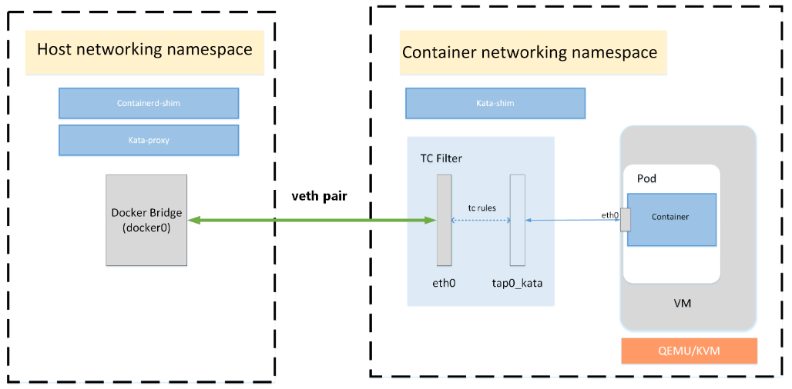

- [背景知识](#背景知识)
- [Connecting a veth device to tap](#connecting-a-veth-device-to-tap)
  - [Redirecting traffic between the two devices](#redirecting-traffic-between-the-two-devices)
- [解释](#解释)
- [应用场景](#应用场景)
  - [Networking](#networking)
- [go代码](#go代码)

# 背景知识
tc是iproute2安装的命令行工具, 用于配置linux 出端口流量shaping系统, 一般叫tc filter.

# Connecting a veth device to tap

*   veth device from CNI/CNM plugin: eth0
*   tap device that connects to the VM: tap0

## [Redirecting traffic between the two devices](https://gist.github.com/mcastelino/7d85f4164ffdaf48242f9281bb1d0f9b#redirecting-traffic-between-the-two-devices)

```
tc qdisc add dev eth0 ingress
tc filter add dev eth0 parent ffff: protocol all u32 match u8 0 0 action mirred egress redirect dev tap0
tc qdisc add dev tap0 ingress
tc filter add dev tap0 parent ffff: protocol all u32 match u8 0 0 action mirred egress redirect dev eth0
```

`tc qdisc add dev eth0 ingress`

*   Add a queuing discipline
*   on `dev eth0`
*   attach the `ingress qdisc` Here the handle defaults to ffff:

`tc filter add dev eth0 parent ffff: protocol all u32 match u8 0 0 action mirred egress redirect dev tap0`

*   Add a filter
*   to device `dev eth0`
*   to parent (class) handle to which we are attaching, ffff: i.e. ingress which we created before (there is no need for `tc class add` in the ingress case as it does not support classful queuing discplines).
*   protocol all
*   classifier u32
*   parameters to the classifier u8 0 0, and the first byte of the packet with 0 and if the result is 0 (which it always will be) (i.e. always true)
*   action mirred egress redirect dev eth0, redirect the packet to egress of dev eth0

# 解释
> create a new qdisc called "ingress". qdiscs normally don't work on ingress so this is really a special qdisc that you can consider an "alternate root" for inbound packets
add a new filter, and attach it to node "ffff:". The ID "ffff:" is the fixed ID of the ingress qdisc

> we use the "u32" matcher, with arguments "u8 0 0". This means match any packet where the first byte, when ANDed with the value 0, returns 0. In other words, all packets are selected

据说能mirror所有流量.
> Hi, thank you for that nice trick.
> Do you know if this tc based redirect will allow transparent forwarding of layer 2 frames which are filtered on linux bridge by default (like stp bpdu and LACP frames)?

[@hellt](https://github.com/hellt) yes. All traffic should passthro. We use this in Kata containers will all types of CNI interfaces without issues. The performance drop is negleible.

# 应用场景
## Networking

Containers will typically live in their own, possibly shared, networking namespace. At some point in a container lifecycle, container engines will set up that namespace to add the container to a network which is isolated from the host network, but which is shared between containers

In order to do so, container engines will usually add one end of a virtual ethernet (`veth`) pair into the container networking namespace. The other end of the `veth` pair is added to the host networking namespace.

This is a very namespace-centric approach as many hypervisors/VMMs cannot handle `veth` interfaces. Typically, `TAP` interfaces are created for VM connectivity.

To overcome incompatibility between typical container engines expectations and virtual machines, `kata-runtime` networking transparently connects `veth` interfaces with `TAP` ones using Traffic Control:

  

With TC filter in place, a redirection is created between the container network and the virtual machine. As an example, the CNI may create a device, `eth0`, in the container's network namespace, which is a VETH device. Kata Containers will create a tap device for the VM, `tap0_kata`, and setup a TC redirection filter to mirror traffic from `eth0`'s ingress to `tap0_kata`'s egress, and a second to mirror traffic from `tap0_kata`'s ingress to `eth0`'s egress.

Kata maintains support for MACVTAP, which was an earlier implementation used in Kata. TC-filter is the default because it allows for simpler configuration, better CNI plugin compatibility, and performance on par with MACVTAP.

Kata has deprecated support for bridge due to lacking performance relative to TC-filter and MACVTAP.

Kata Containers supports both [CNM](https://github.com/docker/libnetwork/blob/master/docs/design.md#the-container-network-model) and [CNI](https://github.com/containernetworking/cni) for networking management.

# go代码
```go
package main

import (
    "fmt"
    "github.com/vishvananda/netlink"
    "os"
    "strconv"

    "golang.org/x/sys/unix"
)

func main() {
    args := os.Args[1:]

    if len(args) != 2 {
        fmt.Println("Incorrect number of args")
        os.Exit(1)
    }

    index1, _ := strconv.Atoi(args[0])
    index2, _ := strconv.Atoi(args[1])

    fmt.Printf("network index1 : %d\n", index1)
    fmt.Printf("network index2 : %d\n", index2)

    qdisc1 := &netlink.Ingress{
        QdiscAttrs: netlink.QdiscAttrs{
            LinkIndex: index1,
            Parent:    netlink.HANDLE_INGRESS,
        },
    }

    err := netlink.QdiscAdd(qdisc1)
    if err != nil {
        fmt.Printf("Failed to add qdisc for index %d : %s", index1, err)
        os.Exit(1)
    }

    qdisc2 := &netlink.Ingress{
        QdiscAttrs: netlink.QdiscAttrs{
            LinkIndex: index2,
            Parent:    netlink.HANDLE_INGRESS,
        },
    }

    err = netlink.QdiscAdd(qdisc2)
    if err != nil {
        fmt.Printf("Failed to add qdisc for index %d : %s", index2, err)
        os.Exit(1)
    }

    filter1 := &netlink.U32{
        FilterAttrs: netlink.FilterAttrs{
            LinkIndex: index1,
            Parent:    netlink.MakeHandle(0xffff, 0),
            Protocol:  unix.ETH_P_ALL,
        },
        Actions: []netlink.Action{
            &netlink.MirredAction{
                ActionAttrs: netlink.ActionAttrs{
                    Action: netlink.TC_ACT_STOLEN,
                },
                MirredAction: netlink.TCA_EGRESS_REDIR,
                Ifindex:      index2,
            },
        },
    }

    if err := netlink.FilterAdd(filter1); err != nil {
        fmt.Printf("Failed to add filter for index %d : %s", index1, err)
        os.Exit(1)
    }

    filter2 := &netlink.U32{
        FilterAttrs: netlink.FilterAttrs{
            LinkIndex: index2,
            Parent:    netlink.MakeHandle(0xffff, 0),
            Protocol:  unix.ETH_P_ALL,
        },
        Actions: []netlink.Action{
            &netlink.MirredAction{
                ActionAttrs: netlink.ActionAttrs{
                    Action: netlink.TC_ACT_STOLEN,
                },
                MirredAction: netlink.TCA_EGRESS_REDIR,
                Ifindex:      index1,
            },
        },
    }

    if err := netlink.FilterAdd(filter2); err != nil {
        fmt.Printf("Failed to add filter for index %d : %s", index2, err)
        os.Exit(1)
    }
}
```