- [参考(按顺序阅读):](#参考按顺序阅读)
- [vhost-net后端和virtio-net前端介绍](#vhost-net后端和virtio-net前端介绍)
- [virtio场景](#virtio场景)
  - [inside qemu](#inside-qemu)
  - [vhost-net](#vhost-net)
  - [vhost-user](#vhost-user)
  - [前端也可以在guest用户态](#前端也可以在guest用户态)
  - [VFIO pci passthrough](#vfio-pci-passthrough)
- [深入理解virtio和vhost](#深入理解virtio和vhost)
  - [QEMU and device emulation](#qemu-and-device-emulation)
  - [KVM](#kvm)
  - [Virtio specification: devices and drivers](#virtio-specification-devices-and-drivers)
  - [Virtio specification: virtqueues](#virtio-specification-virtqueues)
  - [virtio net device inside qemu](#virtio-net-device-inside-qemu)
  - [Vhost protocol](#vhost-protocol)
  - [vhost-net in host kernel](#vhost-net-in-host-kernel)
  - [OVS Communication with the outside world](#ovs-communication-with-the-outside-world)
- [sriov和vPDA](#sriov和vpda)
  - [SR-IOV for isolating VM traffic](#sr-iov-for-isolating-vm-traffic)
  - [SR-IOV for mapping NIC to guest](#sr-iov-for-mapping-nic-to-guest)
  - [Virtio full HW offloading](#virtio-full-hw-offloading)
  - [vDPA - standard data plane](#vdpa---standard-data-plane)
  - [Comparing virtio architectures](#comparing-virtio-architectures)

# 参考(按顺序阅读): 
* [Introduction to virtio-networking and vhost-net](https://www.redhat.com/en/blog/introduction-virtio-networking-and-vhost-net)
* [Deep dive into Virtio-networking and vhost-net](https://www.redhat.com/en/blog/deep-dive-virtio-networking-and-vhost-net)
* [Hands on vhost-net: Do. Or do not. There is no try](https://www.redhat.com/en/blog/hands-vhost-net-do-or-do-not-there-no-try)
* [Virtio devices and drivers overview: The headjack and the phone](https://www.redhat.com/en/blog/virtio-devices-and-drivers-overview-headjack-and-phone)
* [Achieving network wirespeed in an open standard manner: introducing vDPA](https://www.redhat.com/en/blog/achieving-network-wirespeed-open-standard-manner-introducing-vdpa)

# [vhost-net后端和virtio-net前端介绍](https://www.redhat.com/en/blog/introduction-virtio-networking-and-vhost-net)
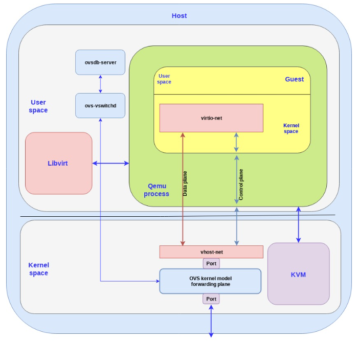  

# virtio场景
virtio的前端是driver, 后端是概念上的device.
前端没啥好说的, 就是guest里面的virtio-net
后端就有很多场景:

## inside qemu
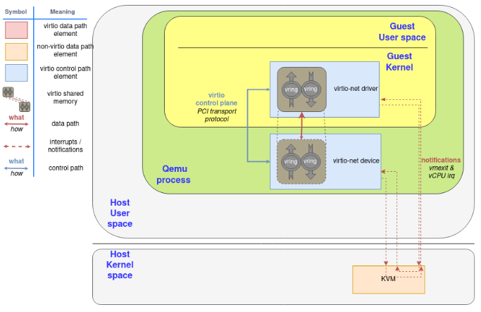  

这个device是qemu模拟的.
数据在qemu用户态和guest kernel申请的ring buffer中流动.
qemu通过kvm来实现中断通知.

Since the notification now needs to travel from the guest (KVM), to QEMU, and then to the kernel for the latter to forward the network frame, we can spawn a thread in the kernel with access to the guest’s shared memory mapping and then let it handle the virtio dataplane.

In that context, QEMU initiates the device using the virtio dataplane, and then forwards the virtio device status to vhost-net, delegating the data plane to it. In this scenario, KVM will use an event file descriptor (eventfd) to communicate the device interruptions, and expose another one to receive CPU interruptions. The guest does not need to be aware of this change, it will operate as the previous scenario.

## vhost-net
Also, in order to increase the performance, we created an in-kernel virtio-net device (called vhost-net) to offload the data plane directly to the kernel, where packet forwarding takes place:

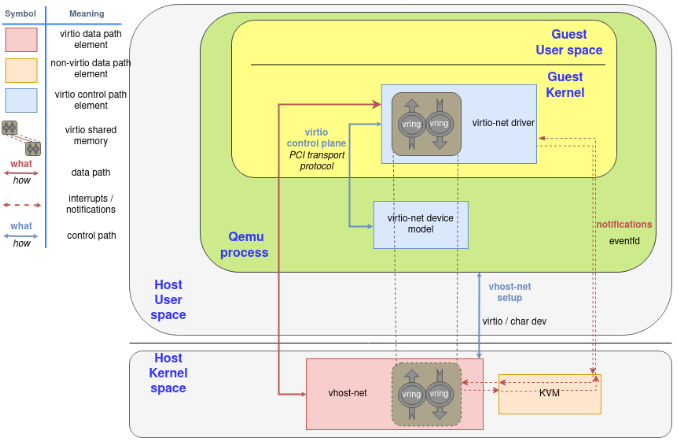  
为了提高性能, 数据流动发生在guest kernel和host kernel中, 但通知还是要经过qemu和kvm.

## vhost-user
Later on, we moved the virtio device from the kernel to an userspace process in the host (covered in the post "[A journey to the vhost-users realm](https://www.redhat.com/en/blog/journey-vhost-users-realm)") that can run a packet forwarding framework like DPDK. The protocol to set all this up is called virtio-user.
vhost-user后端是另外一个进程, ovs-dpdk中有使用.

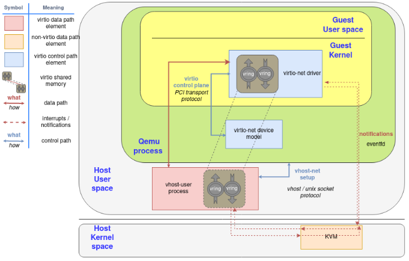  

## 前端也可以在guest用户态
It even allows guests to run virtio drivers in guest’s userland, instead of the kernel! In this case, virtio names driver the process that is managing the memory and the virtqueues, not the kernel code that runs in the guest.

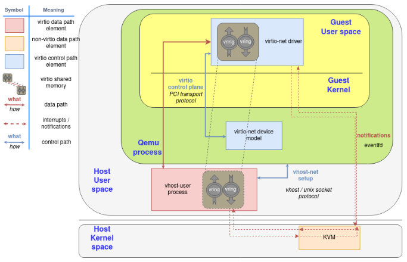  
和上图的区别是, 这里guest里的virtio-net驱动是在用户态的.

## VFIO pci passthrough
Lastly, we can directly do a virtio device passthrough with the proper hardware. If the NIC supports the virtio data plane, we can expose it directly to the guest with proper hardware (IOMMU device, able to translate between the guest’s and device’s memory addresses) and software (for example, VFIO linux driver, that enables the host to directly give the control of a PCI device to the guest). The device uses the typical hardware signals for notifications infrastructure, like PCI and CPU interruptions (IRQ).

If a hardware NIC wants to go this way, the easiest approach is to build its driver on top of [vDPA](https://www.redhat.com/en/blog/achieving-network-wirespeed-open-standard-manner-introducing-vdpa), also explained in earlier posts of this series.

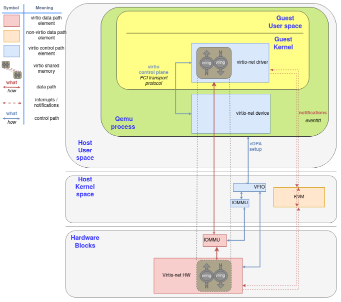  

# [深入理解virtio和vhost](https://www.redhat.com/en/blog/deep-dive-virtio-networking-and-vhost-net)
原文一定要读!

## QEMU and device emulation

QEMU is a hosted virtual machine emulator that provides a set of different hardware and device models for the guest machine. For the host, qemu appears as a regular process scheduled by the standard Linux scheduler, with its own process memory. In the process, QEMU allocates a memory region that the guest see as physical, and executes the virtual machine’s CPU instructions.

To perform I/O on bare metal hardware, like storage or networking, the CPU has to interact with physical devices performing special instructions and accessing particular memory regions, such as the ones that the device is mapped to.

When the guests access these memory regions, control is returned to QEMU, which performs the device’s emulation in a transparent manner for the guest.

## KVM

Kernel-based Virtual Machine (KVM) is an open source[ virtualization](https://www.redhat.com/en/topics/virtualization/what-is-virtualization) technology built into Linux. It provides hardware assist to the virtualization software, using built-in CPU virtualization technology to reduce virtualization overheads (cache, I/O, memory) and improving security.

With KVM, QEMU can just create a virtual machine with virtual CPUs (vCPUs) that the processor is aware of, that runs native-speed instructions. When a special instruction is reached by KVM, like the ones that interacts with the devices or to special memory regions, vCPU pauses and informs QEMU of the cause of pause, allowing hypervisor to react to that event.

In the regular KVM operation, the hypervisor opens the device /dev/kvm, and communicates with it using ioctl calls to create the VM, add CPUs, add memory (allocated by qemu, but physical from the virtual machine’s point of view), send CPU interrupts (as an external device would send), etc. For example, one of these ioctl runs the actual KVM vCPU,, blocking QEMU and making the vCPU run until it found an instruction that needs hardware assistance. In that moment, the ioctl returns (this is called vmexit) and QEMU knows the cause of that exit (for example, the offending instruction).

For special memory regions, KVM follows a similar approach, marking memory regions as Read Only or not mapping them at all, causing a vmexit with the KVM_EXIT_MMIO reason.

## Virtio specification: devices and drivers
Virtio is an open specification for virtual machines' data I/O communication, offering a straightforward, efficient, standard and extensible mechanism for virtual devices, rather than boutique per-environment or per-OS mechanisms. It uses the fact that the guest can share memory with the host for I/O to implement that.

The virtio specification is based on two elements: devices and drivers. In a typical implementation, the hypervisor exposes the virtio devices to the guest through a number of transport methods. By design they look like physical devices to the guest within the virtual machine.

The most common transport method is PCI or PCIe bus. However, the device can be available at some predefined guest’s memory address (MMIO transport). These devices can be completely virtual with no physical counterpart or physical ones exposing a compatible interface.

The typical (and easiest) way to expose a virtio device is through a PCI port since we can leverage the fact that PCI is a mature and well supported protocol in QEMU and Linux drivers. Real PCI hardware exposes its configuration space using a specific physical memory address range (i.e., the driver can read or write the device’s registers by accessing that memory range) and/or special processor instructions. In the VM world, the hypervisor captures accesses to that memory range and performs device emulation, exposing the same memory layout that a real machine would have and offering the same responses. The virtio specification also defines the layout of its PCI Configuration space, so implementing it is straightforward.

When the guest boots and uses the PCI/PCIe auto discovering mechanism, the virtio devices identify themselves with with the PCI vendor ID and their PCI Device ID. The guest’s kernel uses these identifiers to know which driver must handle the device. In particular, the linux kernel already includes virtio drivers.

The virtio drivers must be able to allocate memory regions that both the hypervisor and the devices can access for reading and writing, i.e., via memory sharing. We call data plane the part of the data communication that uses these memory regions, and control plane the process of setting them up. We will provide further details on the virtio protocol implementation and memory layout in future posts.

The virtio kernel drivers share a generic transport-specific interface (e.g: virtio-pci), used by the actual transport and device implementation (such as virtio-net, or virtio-scsi).

## Virtio specification: virtqueues
Virtqueues are the mechanism for bulk data transport on virtio devices. Each device can have zero or more virtqueues ([link](https://docs.oasis-open.org/virtio/virtio/v1.1/cs01/virtio-v1.1-cs01.html#x1-230005)). It consists of a queue of guest-allocated buffers that the host interacts with either by reading them or by writing to them. In addition, the virtio specification also defines bi-directional notifications:

*   Available Buffer Notification: Used by the driver to signal there are buffers that are ready to be processed by the device
*   Used Buffer Notification: Used by the device to signal that it has finished processing some buffers.

In the PCI case, the guest sends the available buffer notification by writing to a specific memory address, and the device (in this case, QEMU) uses a vCPU interrupt to send the used buffer notification.

The virtio specification also allows the notifications to be enabled or disabled dynamically. That way, devices and drivers can batch buffer notifications or even actively poll for new buffers in virtqueues (busy polling). This approach is better suited for high traffic rates.

In summary, the virtio driver interface exposes:

*   Device’s feature bits (which device and guest have to negotiate)
*   Status bits
*   Configuration space (that contains device specific information, like MAC address)
*   Notification system (configuration changed, buffer available, buffer used)
*   Zero or more virtqueues
*   Transport specific interface to the device

## virtio net device inside qemu
The virtio network device is a virtual ethernet card, and it supports multiqueue for TX/RX. Empty buffers are placed in N virtqueues for receiving packets, and outgoing packets are enqueued into another N virtqueues for transmission. Another virtqueue is used for driver-device communication outside of the data plane, like to control advanced filtering features, settings like the mac address, or the number of active queues. As a physical NIC, the virtio device supports features such as many offloadings, and can let the real host’s device do them.

To send a packet, the driver sends to the device a buffer that includes metadata information such as desired offloadings for the packet, followed by the packet frame to transmit. The driver can also split the buffer into multiple gather entries, e.g. it can split the metadata header from the packet frame.

These buffers are managed by the driver and mapped by the device. In this case the device is "inside" the hypervisor. Since the hypervisor (qemu) has access to all the guests’ memory it is capable of locating the buffers and reading or writing them.

The following flow diagram shows the virtio-net device configuration and the sending of a packet using virtio-net driver, that communicates with the virtio-net device over PCI. After filling the packet to be sent, it triggers an "available buffer notification", returning the control to QEMU so it can send the packet through the TAP device.

Qemu then notifies the guest that the buffer operation (reading or writing) is done, and it does that by placing the data in the virtqueue and sending a used notification event, triggering an interruption in the guest vCPU.

The process of receiving a packet is similar to that of sending it. The only difference is that, in this case, empty buffers are pre-allocated by the guest and made available to the device so it can write the incoming data to them.

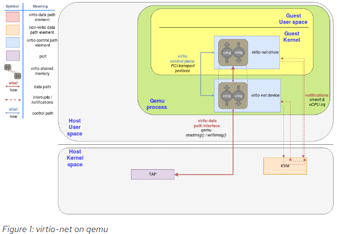  
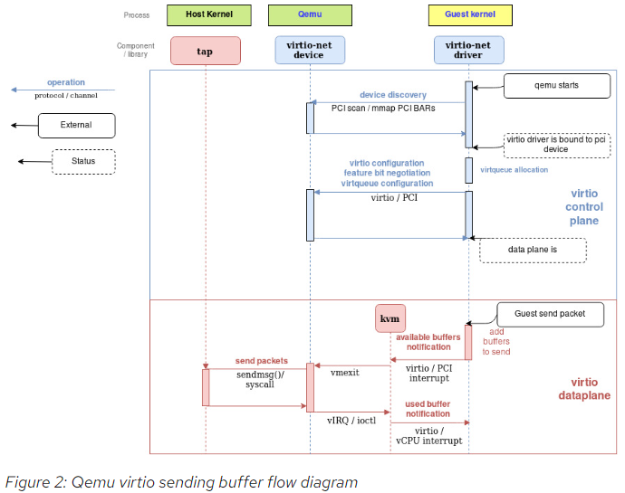  

## Vhost protocol
The previous approach contains a few inefficiencies:

*   After the virtio driver sends an Available Buffer Notification, the vCPU stops running and control is returned to the hypervisor causing an expensive context switch.
*   QEMU additional tasks/threads synchronization mechanisms.
*   The syscall and the data copy for each packet to actually send or receive it via tap (no batching).
*   The ioctl to send the available buffer notification (vCPU interruption).
*   We also need to add another syscall to resume vCPU execution, with all the associated mapping switching, etc.

In order to address these limitations, the vhost protocol was designed. The vhost API is a message based protocol that allows the hypervisor to offload the data plane to another component (handler) that performs data forwarding more efficiently. Using this protocol, the master sends the following configuration information to the handler: 

*   The hypervisor’s memory layout. This way, the handler can locate the virtqueues and buffer within the hypervisor’s memory space.
*   A pair of file descriptors that are used for the handler to send and receive the notifications defined in the virtio spec. These file descriptors are shared between the handler and KVM so they can communicate directly without requiring the hypervisor’s intervention. Note that this notifications can still be dynamically disabled per virtqueue.

After this process, the hypervisor will no longer process packets (read or write to/from the virtqueues). Instead, the dataplane will be completely offloaded to the handler, which can now access the virtqueues’ memory region directly as well as send and receive notifications directly to and from the guest.

The vhost messages can be exchanged in any host-local transport protocol, such as Unix sockets or character devices and the hypervisor can act as a server or as a client (in the context of the communication channel). The hypervisor is the leader of the protocol, the offloading device is a handler and any of them can send messages.

In order to further understand the benefits of this protocol, we will analyze the details of a kernel-based implementation of the vhost protocol: the vhost-net kernel driver.

## vhost-net in host kernel
The vhost-net is a kernel driver that implements the handler side of the vhost protocol to implement an efficient data plane, i.e., packet forwarding. In this implementation, qemu and the vhost-net kernel driver (handler) use ioctls to exchange vhost messages and a couple of eventfd-like file descriptors called irqfd and ioeventfd are used to exchange notifications with the guest.

When vhost-net kernel driver is loaded, it exposes a character device on /dev/vhost-net. When qemu is launched with vhost-net support it opens it and initializes the vhost-net instance with several ioctl(2) calls. These are necessary to associate the hypervisor process with the vhost-net instance, prepare for virtio feature negotiation and pass the guest physical memory mapping to the vhost-net driver.

During the initialization the vhost-net kernel driver creates a kernel thread called vhost-$pid, where $pid is the hypervisor process pid. This thread is called the "vhost worker thread".

A tap device is still used to communicate the VM with the host but now the worker thread handles the I/O events i.e. it polls for driver notifications or tap events, and forwards data.

Qemu allocates one [eventfd](http://man7.org/linux/man-pages/man2/eventfd.2.html) and registers it to both vhost and KVM in order to achieve the notification bypass. The vhost-$pid kernel thread polls it, and KVM writes to it when the guest writes in a specific address. This mechanism is named ioeventfd. This way, a simple read/write operation to a specific guest memory address does not need to go through the expensive QEMU process wakeup and can be routed to the vhost worker thread directly. This also has the advantage of being asynchronous, no need for the vCPU to stop (so no need to do an immediate context switch).

On the other hand, qemu allocates another eventfd and registers it to both KVM and vhost again for direct vCPU interruption injection. This mechanism is called irqfd, and it allows any process in the host to inject vCPU interrupts to the guest by writing to it, with the same advantages (asynchronous, no need for immediate context switching, etc).

Note that such changes in the virtio packet processing backend are completely transparent to the guest who still uses the standard virtio interface.

The following block and flow diagrams show the datapath offloading from qemu to the vhost-net kernel driver:

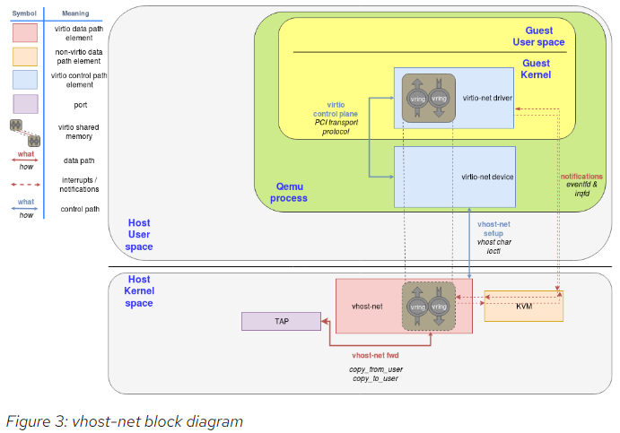  
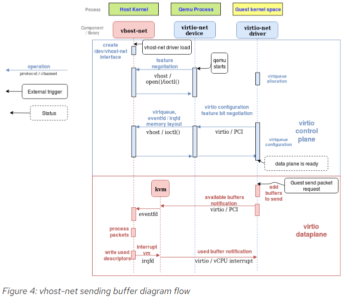  

## OVS Communication with the outside world
We could achieve this by using any forwarding or routing mechanism provided by the kernel networking stack, like standard Linux bridges. However, a more advanced solution is to use a fully virtualized, distributed, managed switch, such as [Open Virtual Switch](http://www.openvswitch.org/) (OVS).

As said in the overview post, OVS datapath is running as a kernel module in this scenario, ovs-vswitchd as a userland control and managing daemon and ovsdb-server as the forwarding database.

As illustrated in the following figure, OVS datapath is running in the kernel and is forwarding the packets between the physical NIC and the virtual TAP device:

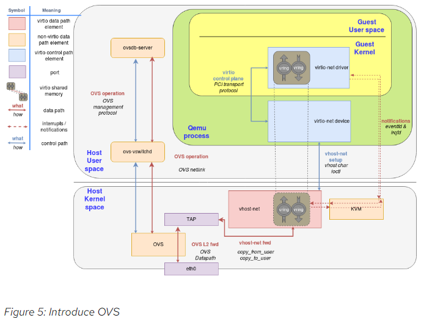  

# sriov和vPDA
## SR-IOV for isolating VM traffic
In the vhost-net/virtio-net and vhost-user/virto-pmd architectures we had a software switch (OVS or other) which could take a single NIC on a phy-facing port and distribute it to several VMs with a VM-facing port per VM.

The most straight-forward way to attach a NIC directly to a guest is a device-assignment, where we assign a full NIC to the guest kernel driver.

The problem is that we have a single physical NIC on the server exposed through PCI thus the question is how can we create "virtual ports" on the physical NIC as well?

Single root I/O virtualization (SR-IOV) is a standard for a type of PCI device assignment that can share a single device to multiple virtual machines. In other words, it allows different VMs in a virtual environment to share a single NIC. This means we can have a single root function such as an Ethernet port appear as multiple separated physical devices which address our problem of creating "virtual ports" in the NIC.

SR-IOV has two main functions:

1.  Physical functions (PFs) which are a full PCI device including discovery, managing and configuring as normal PCI devices. There is a single PF pair per NIC and it provides the actual configuration for the full NIC device

2.  Virtual functions (VFs) are simple PCI functions that only control part of the device and are derived from physical functions. Multiple VFs can reside on the same NIC.

We need to configure both the VFs representing virtual interfaces in the NIC and the PF which is the main NIC interface. For example, we can have a 10GB NIC with a single external port and 8 VF. The speed and duplex for the external port are PF configurations while rate limiters are VF configurations.

The hypervisor is the one mapping virtual functions to virtual machines and each VF can be mapped to a single guest at a time (a VM can have multiple VFs).

Let’s see how SR-IOV can be mapped to the guest kernel, userspace DPDK or directly to the host kernel:

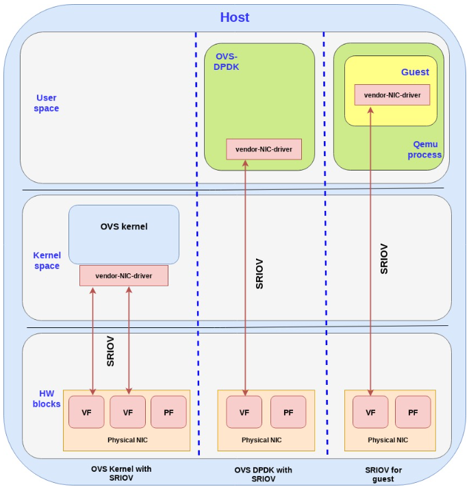  

1.  **OVS kernel with SR-IOV**: we are using the SR-IOV to provide multiple phy-facing ports from the OVS perspective (with separate MACs for example) although in practice we have a single physical NIC. This is done through the VFs.
We are a section of the kernel memory (for each VF) to the specific VF on the NIC.

1.  **OVS DPDK with SR-IOV**: Bypassing the host kernel directly from the NIC to the OVS DPDK on the user space which SR-IOV provides. We are mapping the host user space memory to the VF on the NIC.

1.  **SR-IOV for guests**: mapping the memory area from the guest to the NIC (bypassing the host all together). It should be noted that

Note that when using device assignment, the ring layout is shared between the physical NIC and the guest. However it’s proprietary to the specific NIC being used, hence it can only be implemented using the specific NIC driver provided by the NIC vendor

Another note: there is also a fourth option which is common, and that is to assign the device to a dpdk application inside the guest userspace.

以上说的是虽然VF能够assign给guest, 但guest里面要用这个PF厂家的驱动. 因为只有厂家的驱动才能理解硬件的ring layout

## SR-IOV for mapping NIC to guest
Focusing on SR-IOV to the guest use case, another question is how to effectively send/receive packets to the NIC once memory is mapped directly.

We have two approaches to solve this:

1.  **Using the guest kernel driver: **In this approach we use the NIC (vendor specific) driver in the kernel of the guest, while directly mapping the IO memory, so that the HW device can directly access the memory on the guest kernel.

2.  **Using the DPDK pmd driver in the guest:** In this approach we use the NIC (vendor specific) DPDK pmd driver in the guest userspace, while directly mapping the IO memory, so that the HW device can directly access the memory on the specific userspace process in the guest.

In this section we will focus on the DPDK pmd driver in the guest approach.

The following diagram brings this all together:

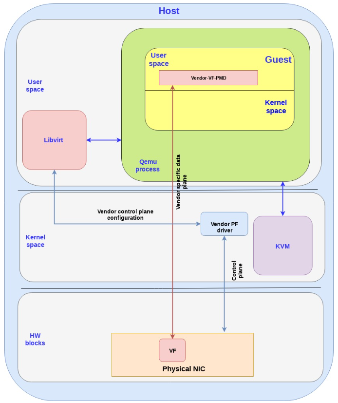  

Note the following points:

*   The data plane is vendor specific and goes directly to the VF.

*   For SRIOV, Vendor NIC specific drivers are required both in the host kernel (PF driver) and the guest userspace (VF PMD) to enable this solution.

*   The host kernel driver and the guest userspace PMD driver don’t communicate directly. The PF/VF drivers are configured through other interfaces (_e.g._ the host PF driver can be configured by libvirt).

*   The vendor-VF-pmd in the guest userspace is responsible for configuring the NICs VF while the vendor-PF-driver in the host kernel space is managing the full NIC.

Summarizing this approach we are able to provide wirespeed from the guest to the NIC by leveraging SR-IOV and DPDK PMD. However, this approach comes at an expense.

The solution described is vendor specific, meaning that it requires a match between the drivers running in the guest and the actual physical NIC. This implies for example that if the NIC firmware is upgraded, the guest application driver may need to be upgraded as well. If the NIC is replaced with a NIC from another vendor, the guest must use another PMD to drive the NIC. Moreover, migration of a VM can only be done to a host with the exact same configuration. This implies the same NIC with the same version, in the same physical place and some vendor specific tailored solution for migration

So the question we want to address is how to provide the SRIOV wirespeed to the VM while using a standard interface and most importantly, using generic driver in the guest to decouple it from specific host configurations or NICs.

In the next two solutions we will show how virtio could be used to solve that problem.

## Virtio full HW offloading

The first approach we present is the virtio full HW offloading were both the virtio data plane and virtio control plane are offloaded to the HW. This implies that the physical NIC (while still using VF to expose multiple virtual interfaces) supports the virtio control spec including discovery, feature negotiation, establishing/terminating the data plane, and so on. The device also support the virtio ring layout thus once the memory is mapped between the NIC and the guest they can communicate directly.

要求硬件支持virtio协议.
In this approach the guest can communicate directly with the NIC via PCI so there is no need for any additional drivers in the host kernel. The approach however requires the NIC vendor to implement the virtio spec fully inside its NIC (each vendor with its proprietary implementation) including the control plane implementation (which is usually done in SW on the host OS, but in this case needs to be implemented inside the NIC)

The following diagram shows the virtio full HW offloading architecture:

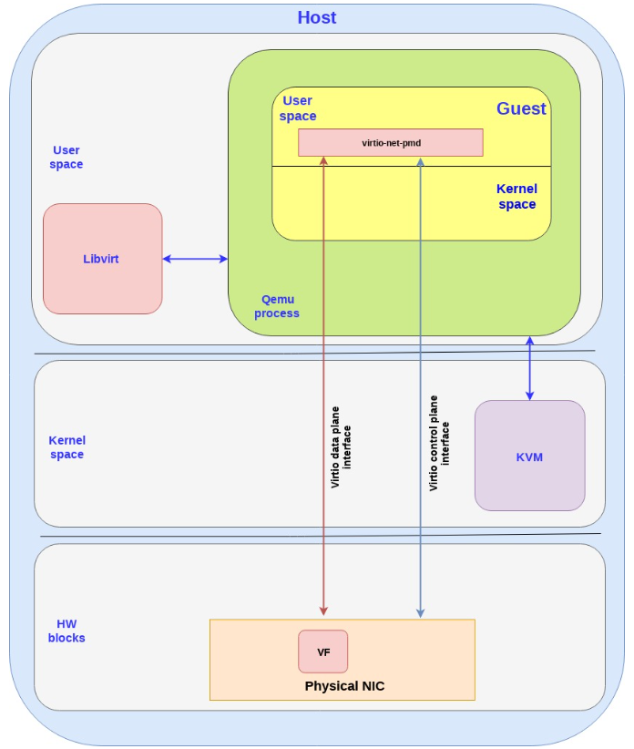  

Note the following:

*   In reality the control plane is more complicated and requires interactions with memory management units (IOMMU and vIOMMU) which will be described in the next technical deep dive post.

*   There are additional blocks in the host kernel, `qemu` process and guest kernel which have been dropped in order to simplify the flow.

*   There is also an option to pull the virtio data plane and control plane to the kernel instead of the user space (as described in the SRIOV case as well) which means we use the virtio-net driver in the guest kernel to talk directly with the NIC (instead of using the virtio-pmd in the guest userspace as shown above).

## vDPA - standard data plane

Virtual data path acceleration (vDPA) in essence is an approach to standardize the NIC SRIOV data plane using the virtio ring layout and placing a single standard virtio driver in the guest decoupled from any vendor implementation, while adding a generic control plane and SW infrastructure to support it. Given that it’s an abstraction layer on top of SRIOV it is also future proof to support emerging technologies such as scalable IOV ([See the relevant spec](https://software.intel.com/en-us/download/intel-scalable-io-virtualization-technical-specification).).

Similar to the virtio full HW offloading the data plane goes directly from the NIC to the guest using the virtio ring layout. However each NIC vendor can now continue using its own driver (with a small vDPA add-on) and a generic vDPA driver is added to the kernel to translate the vendor NIC driver/control-plane to the virtio control plane.

The vDPA is a much more flexible approach than the virtio full HW offloading enabling NIC vendors to support virtio ring layout with significant smaller effort and still achieving wire speed performance on the data plane.

The next diagram presents this approach:

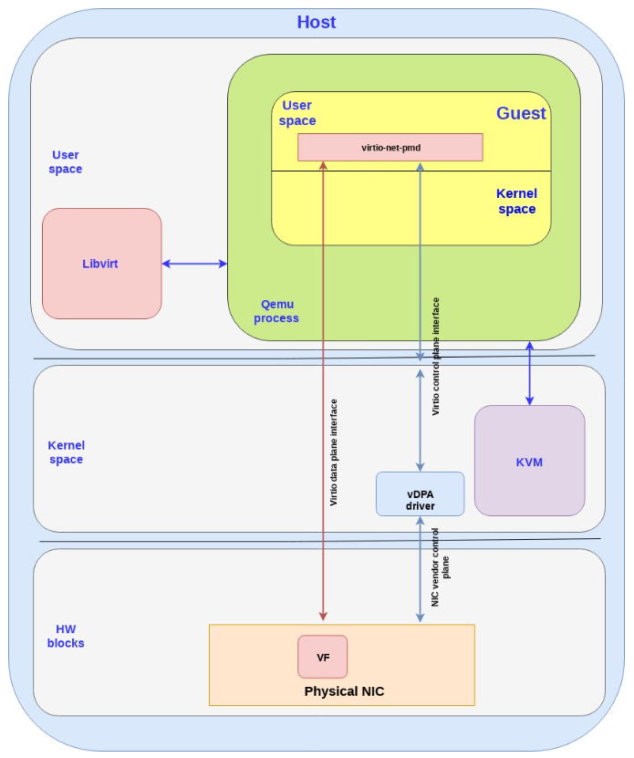  

Note the following:

*   There are additional blocks in the host kernel, QEMU process and guest kernel which have been dropped in order to simplify the flow.

*   Similar to the SRIOV and virtio full HW offloading the data plane and control plane can enter in the guest kernel and not the guest user space (same pros and cons previously mentioned).

vDPA has the potential of being a powerful solution for providing wirespeed Ethernet interfaces to VMs:

1.  **Open public specification**—anyone can see, consume and be part of enhancing the specifications (the Virtio specification) without being locked to a specific vendor.

2.  **Wire speed performance**—similar to SRIOV, no mediators or translator between.

3.  **Future proof for additional HW platform technologies**—ready to also support Scalable IOV and similar platform level enhancements.

4.  **Single VM certification**—Single standard generic guest driver independent of a specific NIC vendor means that you can now certify your VM consuming an acceleration interface only once regardless of the NICs and versions used (both for your Guest OS and or for your Container/userspace image).

5.  **Transparent protection**—the guest uses a single interface which is protected on the host side by 2 interfaces (AKA backend-protection). If for example the vDPA NIC is disconnected then the host kernel is able to identify this quickly and automagically switch the guest to use another virtio interface such as a simple vhost-net backend.

6.  **Live migration**—Providing live migration between different vendor NICs and versions given the ring layout is now standard in the guest.

7.  **Providing a standard accelerated interface for containers**—will be discussed in future posts.

8.  **The bare-metal vision**—a single generic NIC driver—Forward looking, the virtio-net driver can be enabled as a bare-metal driver, while using the vDPA SW infrastructure in the kernel to enable a single generic NIC driver to drive different HW NICs (similar, e.g. to the NVMe driver for storage devices).

## Comparing virtio architectures

Summarizing what we have learned in the previous posts in this serious, and in this post, we have covered four virtio architectures for providing Ethernet networks to VMs: vhost-net/virito-net, vhost-user/virito-pmd, virtio full HW offloading and vDPA.

Let’s compare the pros and cons of each of the approaches:

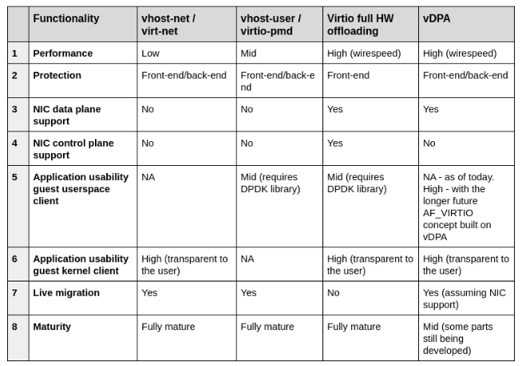  
