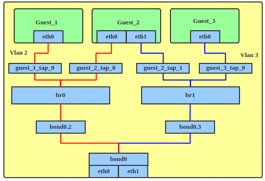
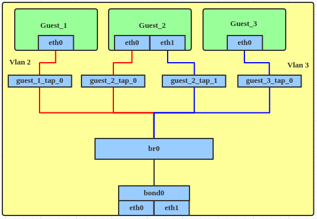
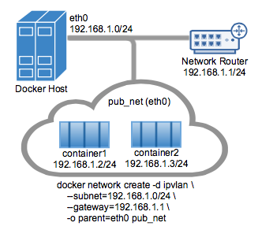
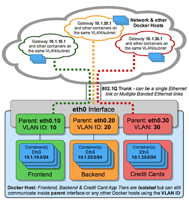

- [bridge的VLAN filter功能](#bridge的vlan-filter功能)
  - [old way](#old-way)
  - [使用VLAN filter功能](#使用vlan-filter功能)
- [docker内部ping 宿主机外部ip](#docker内部ping-宿主机外部ip)
  - [docker内eth0](#docker内eth0)
  - [docker0网桥](#docker0网桥)
  - [host eth0](#host-eth0)
  - [在docker内ping 10.182.105.138](#在docker内ping-10182105138)
    - [过程第一步](#过程第一步)
    - [过程第二步](#过程第二步)
    - [第三步](#第三步)
  - [在docker内ping 192.168.0.14](#在docker内ping-192168014)
- [linux网桥 veth 等等](#linux网桥-veth-等等)
  - [ip netns 网络名字空间](#ip-netns-网络名字空间)
  - [veth](#veth)
- [docker网络](#docker网络)
  - [docker网桥命令](#docker网桥命令)
  - [docker iptable](#docker-iptable)

# bridge的VLAN filter功能
参考: https://developers.redhat.com/blog/2017/09/14/vlan-filter-support-on-bridge#

## old way
如果用linux bridge配置带vlan的网络, 以前的做法是创建多个br, 每个br对应一个vlan, 例如:  
  
命令:  
Create a bond device.
```
# ip link add bond0 type bond
# ip link set bond0 type bond miimon 100 mode balance-alb
# ip link set eth0 down
# ip link set eth0 master bond0
# ip link set eth1 down
# ip link set eth1 master bond0
# ip link set bond0 up
```

Create VLANs on bond. We need to create more VLANs if dictated by requirements.
```
# ip link add link bond0 name bond0.2 type vlan id 2
# ip link set bond0.2 up

# ip link add link bond0 name bond0.3 type vlan id 3
# ip link set bond0.3 up
```
Add a bridge device, to which we can attach the VLAN interface.
```
# ip link add br0 type bridge
# ip link set bond0.2 master br0
# ip link set br0 up

# ip link add br1 type bridge
# ip link set bond0.3 master br1
# ip link set br1 up
```
Attach tap device to bridge.
```
# ip link set guest_1_tap_0 master br0
# ip link set guest_2_tap_0 master br0

# ip link set guest_2_tap_1 master br1
# ip link set guest_3_tap_0 master br1
```

## 使用VLAN filter功能
> This feature was introduced in Linux kernel 3.8 and was added to RHEL in version 7.0.
> Let's take an example that is widely used in virtualization: different subnets on a bridge with bond load balance.

  

Create a bond device, the same as above.
```
# ip link add bond0 type bond
# ip link set bond0 type bond miimon 100 mode balance-alb
# ip link set eth0 down
# ip link set eth0 master bond0
# ip link set eth1 down
# ip link set eth1 master bond0
# ip link set bond0 up
```

Create the bridge interface, enable VLAN filter and attach the bond interface to the bridge directly.
```
# ip link add br0 type bridge
# ip link set br0 up
# ip link set br0 type bridge vlan_filtering 1

# ip link set bond0 master br0
```

Attach the tap device to the bridge.
```
# ip link set guest_1_tap_0 master br0
# ip link set guest_2_tap_0 master br0

# ip link set guest_2_tap_1 master br0
# ip link set guest_3_tap_0 master br0
```

Set the tap interface with the VLAN filter.
```
# bridge vlan add dev guest_1_tap_0 vid 2 pvid untagged master
# bridge vlan add dev guest_2_tap_0 vid 2 pvid untagged master

# bridge vlan add dev guest_2_tap_1 vid 3 pvid untagged master
# bridge vlan add dev guest_3_tap_0 vid 3 pvid untagged master

# bridge vlan add dev bond0 vid 2 master
# bridge vlan add dev bond0 vid 3 master
```

To dump the VLAN information from the bridge interface.
```
# bridge vlan show
port    vlan ids
bond0    1 PVID Egress Untagged
         2
         3

br0      1 PVID Egress Untagged

guest_1_tap_0    1 Egress Untagged
         2 PVID Egress Untagged

guest_2_tap_0    1 Egress Untagged
         2 PVID Egress Untagged

guest_2_tap_1    1 Egress Untagged
         3 PVID Egress Untagged

guest_3_tap_0    1 Egress Untagged
         3 PVID Egress Untagged
```

# docker内部ping 宿主机外部ip

## docker内eth0
```
mac: 02:42:ac:11:00:02
ip: 172.17.0.2/16
默认路由: default via 172.17.0.1 dev eth0
```

## docker0网桥
```
mac: 02:42:29:ac:5c:40
ip: 172.17.0.1/16
```

## host eth0
```
mac: fa:16:3e:cf:b4:34
ip: 192.168.0.14/24
默认路由: default via 192.168.0.1 dev eth0

对外ip: 10.182.105.138
```

## 在docker内ping 10.182.105.138
现象: 能ping通
### 过程第一步
在docker0抓包看到:
```
发送icmp请求
02:42:ac:11:00:02 > 02:42:29:ac:5c:40
172.17.0.2 > 10.182.105.138: ICMP echo request

回复icmp响应:
02:42:29:ac:5c:40 > 02:42:ac:11:00:02
10.182.105.138 > 172.17.0.2: ICMP echo reply
```
所以第一步: docker内部协议栈没有找到138的路由, 走默认路由, 即docker0网桥, 目的ip为138不变, mac地址改为docker0的mac地址

### 过程第二步
现在报文来到host的docker0网桥上, 但依然没有找到138的路由. 在通过默认路由前, 需要做NAT转换: 把内网ip(172.17.0.2)换成host ip(192.168.0.14)
```shell
#这里很有意思的出现了2次icmp request
#第一次是host ip发给138
fa:16:3e:cf:b4:34 > fa:16:3e:36:da:c0
192.168.0.14 > 10.182.105.138: ICMP echo request

#第二次是138发给host ip
fa:16:3e:36:da:c0 > fa:16:3e:cf:b4:34
10.182.105.138 > 192.168.0.14: ICMP echo request

#以上出现两次request的原因是, 138和192.168.0.14是同一个主机. 

#类似的, icmp reply也有两个
fa:16:3e:cf:b4:34 > fa:16:3e:36:da:c0
192.168.0.14 > 10.182.105.138: ICMP echo reply

fa:16:3e:36:da:c0 > fa:16:3e:cf:b4:34
10.182.105.138 > 192.168.0.14: ICMP echo reply
```

### 第三步
给`192.168.0.14`的icmp echo reply: `10.182.105.138 > 192.168.0.14`  
经过NAT转换为:  
`10.182.105.138 > 172.17.0.2`, 协议栈查到`172.17.0.2`走docker0这个interface, 随后这报文被送到docker内部的ping程序. 

## 在docker内ping 192.168.0.14
`192.168.0.14`即host的eth0的ip  
能ping通, 但在host的eth0抓不到包. 说明报文没有从eth0口出来.  
从docker0能抓到包
```
02:42:ac:11:00:02 > 02:42:29:ac:5c:40
172.17.0.2 > 192.168.0.14: ICMP echo request

02:42:29:ac:5c:40 > 02:42:ac:11:00:02
192.168.0.14 > 172.17.0.2: ICMP echo reply
```
说明报文在docker0网桥的协议栈中, 就知道这个icmp request报文是可以本机处理的, 然后就处理了.

# linux网桥 veth 等等
## ip netns 网络名字空间
```shell
创建网络空间：
# ip netns add ns1
查看网络空间：
# ip netns list
删除网络空间：注意网络空间有引用计数, 最后一个user删除才真正删除
# ip netns del ns1
进入网络空间执行命令：
# ip netns exec ns1 `command`
```
`ip netns ls`能看到同名的netns
netns的特性是在外面用`ip netns exec`命令进入netns空间看, 比如`sudo ip netns exec setup_standalone_board_0_1fg247_yingjieb ip a`, 和在docker实例里面看的结果, 是一模一样的.

netns是一个新的网络栈的拷贝, 有独立的路由, 规则, 和网络设备.
`man ip netns`里面说, 一个有名子的netns对应`/var/run/netns/NAME`目录下的NAME文件, 打开这个文件并传入`setns`系统调用, task就关联到这个netns了.
`ip netns exec`自动完成上述netns文件关联到进程的动作, 所以执行的命令是在指定的netns里面执行的.

```shell
ip netns set NAME NETNSID - assign an id to a peer network namespace
#看目标PID对应的netns
ip netns identify [PID] - Report network namespaces names for process
#看目标netns里面有哪些PID
ip netns pids NAME - Report processes in the named network namespace
ip netns monitor - Report as network namespace names are added and deleted
ip netns list-id - list network namespace ids (nsid)
```
上面提到, 有的netns是name, 有的是id, 它们有什么关系吗?
--可以是一一对应关系: 下面不管是list还是list-id命令, 都能打印name和id的关系
```
bash-5.0# ip netns list-id
nsid 0
nsid 1 (iproute2 netns name: pcta_0)
nsid 2 (iproute2 netns name: lt_1)

bash-5.0# ip netns list
dhcpd_1
dhcpd_0
pcta_0 (id: 1)
lt_1 (id: 2)
```

## veth
veth是个驱动, 可以用来创建虚拟网络设备对. veth总是成对出现, 用来连接网络的两端, 从一端来的报文总是立即被另一端接收.  
`ip link add <p1-name> type veth peer name <p2-name>`  
上面命令创建了p1-name和p2-name做为veth的两端.  
这时候把其中的一端move到netns中, 就能在两个netns间通信了:  
`ip link set <p2-name> netns <p2-namespace>`  
用`ethtool -S`或者直接`ip link`就能看到对应关系

# docker网络
docker网络文档写的很好: https://docs.docker.com/network/

有以下几种:
* bridge: 最常见的模式. 容器通过bridge连接到host, host提供iptable的规则可以隔离容器, 但又能上外网
又可以分为默认网桥(docker0)和自定义网桥. 自定义网桥有些高级特性
    * 自定义网桥有自动DNS解析
    * 容器可以动态的接入和断开自定义网桥
* host: 容器直接使用host网络
* overlay: 不同host之间overlay
* macvlan: 让容器的mac看起来像是网络上的物理接口. 就是说报文在host的协议栈发现mac是容器的, 直接投递给容器, 而不是交给网桥路由(个人理解).
    * bridge模式
    ```
    $ docker network create -d macvlan \
  --subnet=172.16.86.0/24 \
  --gateway=172.16.86.1 \
  -o parent=eth0 pub_net
    ```
    * trunk模式
    ```
    $ docker network create -d macvlan \
    --subnet=192.168.50.0/24 \
    --gateway=192.168.50.1 \
    -o parent=eth0.50 macvlan50
    ```
* ipvlan: 感觉是一个轻量的网络虚拟化实现: 不用网桥, 而是绑定到host的物理口eth, 或eth的vlan比如eth.10. 可以是l2模式也可以是l3模式.  
  
```shell
# IPvlan  (-o ipvlan_mode= Defaults to L2 mode if not specified)
$ docker network  create -d ipvlan \
    --subnet=192.168.1.0/24 \ 
# Start a container on the db_net network
$ docker  run --net=db_net -it --rm alpine /bin/sh
# NOTE: the containers can NOT ping the underlying host interfaces as
# they are intentionally filtered by Linux for additional isolation.
```
支持802.1q [trunk模式](https://docs.docker.com/network/ipvlan/#ipvlan-8021q-trunk-l2-mode-example-usage)  
  

## docker网桥命令
```
docker network list
docker network create my-net

$ docker create --name my-nginx \
  --network my-net \
  --publish 8080:80 \
  nginx:latest

docker network connect my-net my-nginx
docker network disconnect my-net my-nginx

$ docker network inspect bridge
```

## docker iptable
docker会修改host的iptable, 加了两个chain:
* DOCKER: 所有的默认规则加在这个chain里
* DOCKER-USER: 在DOCKER chain之前, 用户可以配置, 比如配置除了192.168.1.1的报文都丢弃.
```
iptables -I DOCKER-USER -i ext_if ! -s 192.168.1.1 -j DROP
```
