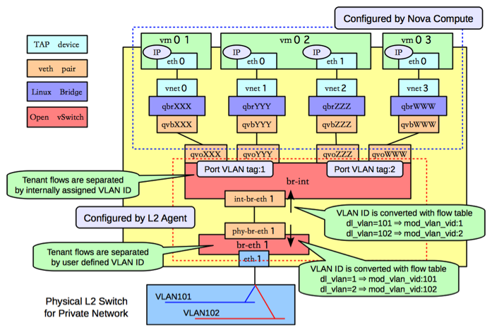
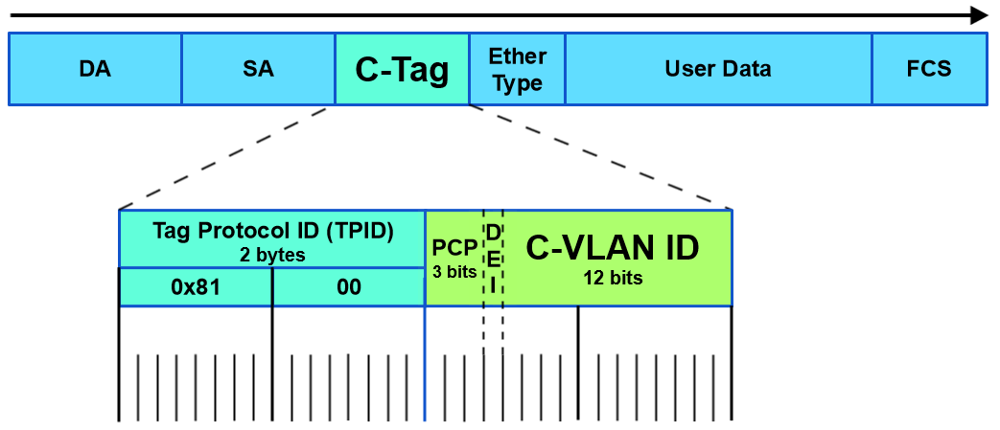

- [内核报文流程, 以tcp为例](#内核报文流程-以tcp为例)
  - [发送流程](#发送流程)
  - [接收流程](#接收流程)
- [关于sk_buff](#关于sk_buff)
- [Openstack vlan组网](#openstack-vlan组网)
- [远程mount nfs超时错误](#远程mount-nfs超时错误)
  - [试了网上的命令](#试了网上的命令)
  - [在server上查看](#在server上查看)
  - [使用nmap扫描端口情况](#使用nmap扫描端口情况)
  - [问题原因](#问题原因)
- [testpmd收发包数一样, 但字节数对不上](#testpmd收发包数一样-但字节数对不上)
- [mlx两个网卡跑dpdk有杂包](#mlx两个网卡跑dpdk有杂包)
- [关于零丢包](#关于零丢包)
- [关于NIC描述符和ring](#关于nic描述符和ring)
- [latency和光速](#latency和光速)
- [从testpmd转发看VF特性](#从testpmd转发看vf特性)
- [ethtool统计详解](#ethtool统计详解)
- [tcpdump查看完整包](#tcpdump查看完整包)
- [802.1ad 双tag](#8021ad-双tag)
- [802.1q也是双tag, 但TPID是0x8100](#8021q也是双tag-但tpid是0x8100)
- [tun tap和veth](#tun-tap和veth)
- [多播](#多播)
- [修改网卡速率](#修改网卡速率)
- [创建tap设备](#创建tap设备)
- [socket_raw原始报文](#socket_raw原始报文)
  - [SOCK_RAW, SOCK_DGRAM和SOCK_PACKET区别](#sock_raw-sock_dgram和sock_packet区别)
  - [socket怎么知道要用哪个接口?](#socket怎么知道要用哪个接口)
- [交换机access与trunk口](#交换机access与trunk口)
- [PPS计算](#pps计算)
- [NVME-oF(NVM Express over Fabrics)](#nvme-ofnvm-express-over-fabrics)
- [NFV](#nfv)
  - [SDN和NFV的关系](#sdn和nfv的关系)
- [DPDK](#dpdk)
  - [DPDK要解决的问题](#dpdk要解决的问题)
  - [主要技术](#主要技术)
  - [主核和从核](#主核和从核)
- [OVS](#ovs)
  - [SDN](#sdn)
  - [OVS场景举例](#ovs场景举例)
  - [架构](#架构)
  - [Openvswitch数据库表结构](#openvswitch数据库表结构)
  - [controller有很多](#controller有很多)

# 内核报文流程, 以tcp为例
https://wiki.linuxfoundation.org/networking/kernel_flow

## 发送流程
```c
5. Session layer (sockets and files) 
write (memory data to a file descriptor) 
sendto (memory data to a socket) 
sendmsg (a composite message to a socket) 
__sock_sendmsg() 
 
    4. Transport layer (TCP) 
    tcp_sendmsg() 
    找个sk_buff, 一般每个socket都有预先分配的sk_buff, 如果不够了就新分配 
    调用skb_add_data(), 把数据从用户空间拷贝到内核空间; 在此按照MSS(Maximum Segment Size)大小分片(一般小于mtu) 
    调用tcp_transmit_skb()向tcp queue发送 
    tcp_transmit_skb()创建tcp头, clone sk_buff用于向下层传递; 调用下层的queue_xmit发送函数指针 
     
        3. Network layer (IPv4) 
        ip_queue_xmit(): 找路由, 创建ip头 
        nf_hook()会在几个地方调用, 用于network filtering(firewall, NAT...) 
        路由的结果保存在dst_entry对象, 然后调用dst_entry的output虚函数 
        调用ip_output() (或者其他的output方法, 比如tunneling); 做post routing filtering; 
        tcp的分片会小于mtu, 所以一般不需要在ip层分片; 对udp来说应该是要的. 
        调用虚函数dev_queue_xmit()发送到device 
         
            2. Link layer (e.g. Ethernet) 
            调度packet发送, 使用的是queueing discipline (struct Qdisc)对象, 来做流控 
            Documentation/networking/multiqueue.txt 
            用qdisc->enqueue虚方法 
            如果dev不支持scattered数据, 就要copy数据到连续地址 
            qdisc有几种调度策略, 常用的是pfifo_fast 
            最后调用dev_hard_start_xmit()来发送报文 
            发送失败的话, 这个skb要重新enqueue, 用netif_schedule()来触发软中断来重新发送, 由ksoftirqd来执行net_tx_action() 
            dev_hard_start_xmit()会调用dev_queue_xmit_nit(), 检查是否有ETH_P_ALL的handler, 用于tcpdump 
            发送完成则free skbuff  
```

## 接收流程
```c
2. Link layer (e.g. Ethernet) 
NIC驱动会提前申请好一定数量的sk_buff, 放在可以DMA的地址上; 中断收包, 在NAPI出现之前, 是netif_rx(). 
这里重点看NAPI方式怎么收包: 
在中断处理函数里, 调用netif_rx_schedule(), 该函数把这个device加到softnet_data的poll_list, 然后触发软中断NET_RX_SOFTIRQ, 然后返回. 
ksoftirqd内核线程执行net_rx_action(), 在里面调用device的poll方法, 该方法管理device的buffer, 调用netif_receive_skb()来处理每个skb, 在必要时申请sk_buffer, 最后调用netif_rx_complete() 
在netif_receive_skb()找到如何传递sk_buffer到上层layer: 
* 调用netpoll_rx(), 处理Netpoll API 
* 调用ETH_P_ALL处理, 用来tcpdump 
* 调用handle_ing(), 处理入队列 
* 调用handle_bridge(), 处理网桥 
* 调用handle_macvlan(), 处理vlan 
* deliver_skb() 调用3层注册的handler 
 
    3. Network layer (IPv4, ARP) 
    报文是ARP, 调用arp_rcv(), 解析arp信息, 保存在neighbour cache, 申请新的sk_buffer发送reply 
    普通的IPv4报文, 调用ip_rcv(), 解析报文头, 调用ip_route_input()找到相应的方法, 包括: 
    * ip_mr_input() 多播 
    * ip_forward() 目的不是本机, 查路由后直接调用neighbour的output接口 
    * ip_local_deliver() 本地报文, 先调用raw_local_deliver()来给raw socket deliver报文, 然后调用4层处理函数 
     
        4. Transport layer (TCP) 
        tcp_v4_rcv(), tcp协议处理 
        收到的报文可以包含应答字段, 从而触发后续的报文发送, tcp_data_snd_check() or of acknowledgements tcp_ack_snd_check() 
        向上层传递报文, tcp_rcv_established() and tcp_data_queue(), 用skb_copy_datagram_iovec()拷贝报文到用户态, 用sk_data_ready()来唤醒等待这个socket的用户态进程. 
             
            5. Session layer (sockets and files) 
            socket收包 
            read (memory data from a file descriptor) 
            recvfrom (memory data from a socket) 
            recvmsg (a composite message from a socket) 
            都是调用__sock_recvmsg() 
```

# 关于sk_buff
sk_buff是个很大的结构体, 表示报文, 包含了报文的所有控制信息, 被组织为双向链表.
* sk_buff_head代表的链表头表示一个queue, 包含sk_buff_head的结构体都可以是个queue, 比如struct sock就包含了接收和发送的queue.
* 分配sk_buff时, 其data空间也在kernel space分配好了. 分配函数是alloc_skb()或者dev_alloc_skb(), 驱动使用dev_alloc_skb(); data空间分成head area和data area, 这样可以不用到处拷贝data area
* skb_network_header(skb), skb_transport_header(skb) and skb_mac_header(skb) return pointer to the header.
  * transport_header 4层, tcp udp
  * network_header 3层, ip ipv6 arp
  * mac_header 2层
* 每个layer都有自己私有的sk_buff, 报文在layer间移动的时候, 要clone sk_buff, 但报文的data, 即payload, 不会被反复拷贝.

# Openstack vlan组网
  
http://docs.ocselected.org/openstack-manuals/kilo/networking-guide/content/under_the_hood_openvswitch.html

# 远程mount nfs超时错误
在bj的机器上, 想mount我的nfs server:
```shell
$ sudo mount -v 10.64.17.45:/home/bai/share /home/bai/share 
mount.nfs: timeout set for Thu Dec  6 18:03:08 2018 
mount.nfs: trying text-based options 'vers=4.1,addr=10.64.17.45,clientaddr=10.5.21.125' 
mount.nfs: mount(2): Connection timed out 
mount.nfs: Connection timed out 
```
总是显示超时, 但ping 10.64.17.45是能通的, 稳定在30ms左右的延迟.

## 试了网上的命令
```shell
$ showmount -e 10.64.17.45 
clnt_create: RPC: Port mapper failure - Timed out 
#这个也超时 
$ sudo mount -t nfs -o vers=3,nolock,proto=tcp 10.64.17.45:/home/bai/share /home/bai/share 
```

## 在server上查看
```
Linux Mint 19 Tara $ rpcinfo -p 
   program vers proto   port  service 
    100000    4   tcp    111  portmapper 
    100000    3   tcp    111  portmapper 
    100000    2   tcp    111  portmapper 
    100000    4   udp    111  portmapper 
    100000    3   udp    111  portmapper 
    100000    2   udp    111  portmapper 
    100005    1   udp  55012  mountd 
    100005    1   tcp  37303  mountd 
    100005    2   udp  43996  mountd 
    100005    2   tcp  51595  mountd 
    100005    3   udp  36041  mountd 
    100005    3   tcp  54355  mountd 
    100003    3   tcp   2049  nfs 
    100003    4   tcp   2049  nfs 
    100227    3   tcp   2049 
    100003    3   udp   2049  nfs 
    100227    3   udp   2049 
    100021    1   udp  51384  nlockmgr 
    100021    3   udp  51384  nlockmgr 
    100021    4   udp  51384  nlockmgr 
    100021    1   tcp  46129  nlockmgr 
    100021    3   tcp  46129  nlockmgr 
    100021    4   tcp  46129  nlockmgr 
```

## 使用nmap扫描端口情况
```shell
# -A:打开额外的激进扫描选项 
# -T: 时间策略, 有-T paranoid|sneaky|polite|normal|aggressive|insane, 可用数字表示(0-5) 
# 下面显示 111和2049都被防火墙filter掉了, 所以连不上 
$ sudo nmap -p 111,2049 -T4 -A 10.64.17.45 
 
Starting Nmap 6.40 ( http://nmap.org ) at 2018-12-06 18:06 CST 
Nmap scan report for localhost (10.64.17.45) 
Host is up (0.029s latency). 
PORT     STATE    SERVICE VERSION 
111/tcp  filtered rpcbind 
2049/tcp filtered nfs 
Too many fingerprints match this host to give specific OS details 
Network Distance: 5 hops 
 
TRACEROUTE (using proto 1/icmp) 
HOP RTT      ADDRESS 
1   0.46 ms  10.5.21.1 
2   0.50 ms  10.128.254.145 
3   1.00 ms  10.128.254.26 
4   29.87 ms localhost (10.64.249.2) 
5   28.99 ms localhost (10.64.17.45) 
 
OS and Service detection performed. Please report any incorrect results at http://nmap.org/submit/ . 
Nmap done: 1 IP address (1 host up) scanned in 6.32 seconds 
```

## 问题原因
上面nmap的扫描可以看到, 111和2049都被防火墙filter掉了, 所以连不上.
这两个端口是rpcbind和nfs用的.

# testpmd收发包数一样, 但字节数对不上
每个包差了4个字节的CRC
```
RX-packets: 957875678  RX-missed: 0          RX-bytes:  68719476735 
TX-packets: 957875678  TX-errors: 0          TX-bytes:  64887974023 
```

# mlx两个网卡跑dpdk有杂包
通过打开pktgen的capture功能, 可以看到这些杂包是ipv6相关的, 有多播也有广播, 广播主要是ICMP;

因为mlx网卡, 内核驱动和dpdk是同时工作的, 虽然在跑dpdk程序, 但上层协议栈也是能发包的.

用nmtui把相应的interface的ipv6关掉就好了.

# 关于零丢包
转发是先RX再TX的过程, 线速零丢包的RX本质上是要把wire上的"满满的data"(线速意味着wire上的数据包是最大限度的一个挨一个的, 测试仪能保证)都一个不漏的收上来, 要求buffer足够, CPU及时收包; 在TX方向上, 要求CPU要及时把包填到硬件发送队列里, 保证wire永远被"塞满", 要求不能让硬件发送队列空闲, 因为其一旦空闲, 则wire空闲, 那就肯定不能到线速.

另外很重要的点:
Pktgen只能以平均99.99%的速率发包, 并不能完全线速, 而丢包就是在那0.01%的速率差异上.

# 关于NIC描述符和ring
https://stackoverflow.com/questions/36625892/descriptor-concept-in-nic  
https://blog.csdn.net/chen98765432101/article/details/69367633  
https://blog.csdn.net/bestboyxie/article/details/53414731

# latency和光速
光速是300000km/s, 那么光速带来的latency是3.33 us/km, 在光纤中, 因为反射, 光速要慢点, 大约是5 us/km

# 从testpmd转发看VF特性
两个机器A和B网卡直连(Mellanox CX4), A跑pktgen发包, B跑testpmd转发.
打开网卡的SR-IOV功能后, VF上跑testpmd, 有如下问题:

* pktgen构造报文的目的mac必须为VF的mac, VF才能收到包, 即使VF打开了混杂模式也一样.
* testpmd中, fwd为默认的io, VF能够收发报文, 但对端pktgen收不到报文.
原因是: 构造报文时, DST MAC为VF的MAC, VF才能够收到并转发该报文; 在--forward-mode=io模式下, 并不修改报文, 其DST MAC仍旧为VF的MAC, 虽然VF能够发出该报文, 但PF不会把报文从端口真正发送, 因为其目的mac为VF自身.

结论: SR-IOV网卡相当于内建了一个switch, VF接收/发送的报文都要查switch的转发表才能进出; VF收发的报文也是走PF, 在PF的rx_packets_phy和tx_packets_phy能查到.

# ethtool统计详解
参考: https://community.mellanox.com/docs/DOC-2532
```
watch -d -n1 'ethtool -S enP5p1s0 | grep packet | grep -v ": 0"' 
```

# tcpdump查看完整包
```shell
#抓ping包 
$ sudo tcpdump -i enP5p1s0 -vvnnXXSs 1514 
tcpdump: listening on enP5p1s0, link-type EN10MB (Ethernet), capture size 1514 bytes 
17:07:25.486422 ARP, Ethernet (len 6), IPv4 (len 4), Request who-has 192.168.1.101 tell 192.168.1.200, length 46 
        0x0000:  ffff ffff ffff 5254 00f0 25e4 0806 0001  ......RT..%..... 
        0x0010:  0800 0604 0001 5254 00f0 25e4 c0a8 01c8  ......RT..%..... 
        0x0020:  0000 0000 0000 c0a8 0165 0000 0000 0000  .........e...... 
        0x0030:  0000 0000 0000 0000 0000 0000            ............ 
         
#简化版 
$ sudo tcpdump -i enP5p1s0 -vvXX 
# -e也可以打印L2 header, icmp指定协议 
tcpdump -n -i enp0s9 icmp -e -vv 
# 更常用 
sudo tcpdump -i eth1 -nevvxx 
```
* -vv: 详细模式
* -nn: 端口号不转换成名字
* -XX: 打印header和payload, 包括二层头
* -S: absolute-tcp-sequence-numbers
* -s snaplen: 默认抓262144字节, 尽量改小点

# 802.1ad 双tag
* s-tag: Service VLAN tag  
  
* c-tag: Customer VLAN tag  
  

# 802.1q也是双tag, 但TPID是0x8100
```c
#define ETH_TYPE_IP            0x0800 
#define ETH_TYPE_ARP           0x0806 
#define ETH_TYPE_TEB           0x6558 
#define ETH_TYPE_VLAN_8021Q    0x8100 
#define ETH_TYPE_VLAN          ETH_TYPE_VLAN_8021Q 
#define ETH_TYPE_VLAN_8021AD   0x88a8 
#define ETH_TYPE_IPV6          0x86dd 
#define ETH_TYPE_LACP          0x8809 
#define ETH_TYPE_RARP          0x8035 
#define ETH_TYPE_MPLS          0x8847 
#define ETH_TYPE_MPLS_MCAST    0x8848 
#define ETH_TYPE_NSH           0x894f 
```

# tun tap和veth
  
* tun：点对点的设备，tun设备模拟网络层设备，处理三层报文，如IP报文。tun设备完全不需要物理地址的。它收到和发出的包不需要arp，也不需要有数据链路层的头。
* tap：是一个普通的以太网设备，tap设备模拟链路层设备，处理二层报文，比如以太网帧。tap设备需要有完整的物理地址和完整的以太网帧
TUN用于路由，而TAP用于创建网桥。
* VETH设备总是成对出现，送到一端请求发送的数据总是从另一端以请求接收的形式出现。创建并配置正确后，向其一端输入数据，VETH会改变数据的方向并将其送入内核网络子系统，完成数据的注入，而在另一端则能读到此数据。

# 多播
https://blog.csdn.net/dengjin20104042056/article/details/52357122

# 修改网卡速率
```shell
#一定要加上autoneg off 关闭自协商 
ethtool -s ens817 speed 10000 autoneg off 
```

# 创建tap设备
* 命令  
```
ip tuntap add mode tap port_name 
```

* 代码  
> You are supposed to open the /dev/net/tun device. A subsequent ioctl on the open fd will create the tun0 (or whatever you wish to name it) network interface.

参考  
https://stackoverflow.com/questions/1003684/how-to-interface-with-the-linux-tun-driver  
https://www.kernel.org/doc/Documentation/networking/tuntap.txt

# socket_raw原始报文
> Use AF_INET if you want to communicate using Internet protocols: TCP or UDP. This is by far the most common choice, and almost certainly what you want.  
Use PF_PACKET if you want to send and receive messages at the most basic level, below the Internet protocol layer, for example because you are implementing the protocol yourself. Your process must run as root (or with a special capability) to use PF_PACKET. This is a very advanced option.

* socket `PF_PACKET`  
  * 发送过程: `sock_raw:->packet_create->dev_add_pack Modify ptype_base|ptype_all`:二层协议
  * 接收过程: `netif_rx->process_backlog->netif_receive_skb:ptype_base|ptype_all`
* socket `AF_INET`
  * 发送过程: `sock_raw:->inet_create (list_for_each_entry_rcu(answer, &inetsw[sock->type], list) find SOCK_RAW )->hash(raw_hash_sk) Modify raw_v4_hashinfo`:IP上层协议
  * 接受过程: `ip_rcv->ip_rcv_finish->ip_route_input->ip_local_deliver->ip_local_deliver_finish->raw_local_deliver:raw_v4_hashinfo`

sock_raw（注意一定要在root下使用）原始套接字编程可以接收到本机网卡上的数据帧或者数据包,对于监听网络的流量和分析是很有作用的.一共可以有3种方式创建这种socket

* `socket(AF_INET, SOCK_RAW, IPPROTO_TCP|IPPROTO_UDP|IPPROTO_ICMP)`发送接收ip数据包，不能用IPPROTO_IP，因为如果是用了IPPROTO_IP，系统根本就不知道该用什么协议。
* `socket(PF_PACKET, SOCK_RAW, htons(ETH_P_IP|ETH_P_ARP|ETH_P_ALL))`发送接收以太网数据帧
* `socket(AF_INET, SOCK_PACKET, htons(ETH_P_IP|ETH_P_ARP|ETH_P_ALL))`过时了,不要用啊

## SOCK_RAW, SOCK_DGRAM和SOCK_PACKET区别
在socket的第一个参数使用PF_PACKET的时候，上述三种socket的类型都可以使用。但是有区别。
* 使用SOCK_RAW发送的数据必须包含链路层的协议头，接受得到的数据包，包含链路层协议头。而使用SOCK_DGRAM则都不含链路层的协议头。
* SOCK_PACKET也是可以使用的，但是已经废弃，以后不保证还能支持，不推荐使用。
* 在使用SOCK_RAW或SOCK_DGRAM和SOCK_PACKET时，在sendto和recvfrom中使用的地址类型不同，前两者使用sockaddr_ll类型的地址，而后者使用sockaddr类型的地址。
* 如socket的第一个参数使用PF_INET，第二个参数使用SOCK_RAW，则可以得到原始的IP包。

## socket怎么知道要用哪个接口?
man sendto里, send sendto sendmsg用于发送:
```c
#include <sys/types.h> 
#include <sys/socket.h> 
 
ssize_t send(int sockfd, const void *buf, size_t len, int flags); 
 
ssize_t sendto(int sockfd, const void *buf, size_t len, int flags, 
                      const struct sockaddr *dest_addr, socklen_t addrlen); 
 
ssize_t sendmsg(int sockfd, const struct msghdr *msg, int flags); 
```

* send用于有连接的发送, 因为之前bind过, 接口已经确定. 和write()效果一样.
* sendto用`sockaddr *dest_addr`比如`{sa_family=AF_INET, sin_port=htons(0), sin_addr=inet_addr("5.5.5.22")}`来确定
* sendmsg用`struct msghdr *msg`中的msg.msg_name来指定接口  
```c
struct msghdr { 
    void         *msg_name;       /* optional address */ 
    socklen_t     msg_namelen;    /* size of address */ 
    struct iovec *msg_iov;        /* scatter/gather array */ 
    size_t        msg_iovlen;     /* # elements in msg_iov */ 
    void         *msg_control;    /* ancillary data, see below */ 
    size_t        msg_controllen; /* ancillary data buffer len */ 
    int           msg_flags;      /* flags (unused) */ 
};
```

对AF_PACKET来说, msg_name是`struct sockaddr_ll`, 其中的ifindex就指定了接口, 这个index是可以根据接口名称如eth0获取的.
```c
struct sockaddr_ll sll = { .sll_family = AF_PACKET, 
                           .sll_ifindex = ifindex }; 
```

对AF_INET来说, msg_name是`struct sockaddr`, 比如`{msg_name(16)={sa_family=AF_INET, sin_port=htons(0), sin_addr=inet_addr("5.5.5.22")`

参考: https://docs.oracle.com/cd/E88353_01/html/E37851/pf-packet-4p.html

# 交换机access与trunk口
都是对交换机来说的, PC/服务器的普通报文都没有vlan tag.
* Access口: 进出交换机access口的报文都没有vlan tag(有tag的直接丢弃), 进来时根据配好的规则, 按交换的端口号打vlan tag, 并在交换机内部安装vlan进行转发, 出交换机去掉vlan.  
> Access 端口可接受并转发的数据来源：来自PC的无VLAN信息数据包；从一个Access口入打上VLAN标记在交换机内转交给相同VLAN的access口去掉标记的无VLAN信息数据包；
Access 端口发送出去的数据包无VLAN信息，可被PC接受或Access口接受。

* Trunk口: 可以转发带vlan tag的报文, 一般用于交换机和交换机连接.
> 结合Trunk口接受与发送数据包特点，可以得出经双绞线相连的一对Trunk口或同一交换机上的两个Trunk口可以将数据包（有或无VLAN信息）原封不动的从一端传到另一端。

# PPS计算
1G的网口, 理论pps的计算方法(通常用64字节小包):

`1000*1000*1000bps/8bit/(64+8+12)=1.488Mpps`

所以, 比如40G网口理论pps为40G/1G * 1.488=59.5Mpps  
  

# NVME-oF(NVM Express over Fabrics)
Nvme命令跑在RDMA的Fabric上

# NFV
CPU有虚拟化了，计算能力大大提高；但网络在拖后腿

2012年10月，13家运营商发起在ETSI组织下正式成立网络功能虚拟化工作组，即ETSI ISG NFV，致力于实现网络虚拟化的需求定义和系统架构制定。

NFV就是基于大型共享的OTS（Off-The-Shelf，成品）服务器，通过软件定义的方式，探索网络实体的虚拟化使用。在NFV中使用的虚拟机（Virtual Machines，VMs）技术是虚拟化技术的一种。

基于软件定义的虚拟机部署成本低，而且可以快速适应网络需求变化。虚拟机就像是将所有能想到的东西都放在一台物理服务器（physical server）上，有了云计算和虚拟化，那些冗余的服务器都可以部署在独立的物理服务器上，不但可以并行处理，满足网络峰值需求，还可以根据网络需求随时释放资源，方便部署，利于故障管理，快速升级，快速满足市场需求。

NFV技术颠覆了传统电信封闭专用平台的思想，同时引入灵活的弹性资源管理理念，因此，ETSI NFV提出了突破传统网元功能限制、全新通用的NFV架构下图所示

  

NFV技术主要由3个部分构成：VNF（虚拟网络层，Virtualized Network Function）、NFVI（网络功能虚拟化基础设施NFVI，NFV Infrastructure)和MANO（NFV管理与编排，Management and Orchestration)。

（1）虚拟网络层是共享同一物理OTS服务器的VNF集。对应的就是各个网元功能的软件实现，比如EPC网元、IMS网元等的逻辑实现。

（2）NFVI，你可以将它理解为基础设施层，从云计算的角度看，就是一个资源池。NFVI需要将物理计算/存储/交换资源通过虚拟化转换为虚拟的计算/存储/交换资源池。NFVI映射到物理基础设施就是多个地理上分散的数据中心，通过高速通信网连接起来。

（3）NFVMANO。基于不同的服务等级协议（Service Level Agreements ，SLAs），NFVMANO运营支撑层负责“公平”的分配物理资源，同时还负责冗余管理、错误管理和弹性调整等，相当于目前目前的OSS/BSS系统。

这样一来，现在的移动通信网络结构就变成了这样：

  

上图顶部的VNF对应了网元功能的逻辑实现，比如，由多个VNF组成的VNF-FG（VNF Forwarding Graph）定义了LTE网络服务。

## SDN和NFV的关系
NFV负责各种网元的虚拟化，而SDN负责网络本身的虚拟化（比如，网络节点和节点之间的相互连接）。我们先来看看一个典型的网络结构图。

  

如上图，一个网络由网络节点和节点间的链路组成。每一个节点都有一个控制面和与其它节点交换的网络信息。在上图中，右边的H节点获知一个新的网络（10.2.3.x/24）存在，现在它需要将这一信息告诉给网络中的其它节点。然而，节点H只和节点F和G直接相连，节点H通过链路状态通告（Link State Advertisements ，LSAs）通知节点F和G，F和G再将信息传递给它们的邻近节点，最终该消息传达到整个网络。这样，网络内每个节点都会更新自己的路由表，以确保数据可以传送到网络10.2.3.x/24。

如果节点C和E之间的链路中断，尽管C和E知道C-E链路中断，但节点A并不知道，节点A会继续通过C-E链路向网络10.2.3.x/24传送数据包。由于节点的“近视”，导致数据堆积在该节点，这需要花一些时间来向整个网络传送网络状态更新信息和完成纠错。网络越大，这种情况就越容易发生。

我们再来看看节点G，它由控制面（control plane）和数据面（data plane）组成。为了适应快速更新，控制面基本上是基于软件的，这实际上意味着控制消息的处理时长比基于硬件的逻辑单元（比如，数据面）要慢5到10倍。一直以来，我们仅要求控制面能够灵活更新，但对时延要求并不是太高。相对于数据面来讲，时延要求较高，我们希望数据包能够传送得越快越好，所以它必须是基于硬件来实现的。尽管基于软件实现的控制面能满足目前的要求，但随着设备的大量接入，特别是物联网的应用，控制面的时延也需要进一步提升。

软件定义网络（SDN）负责分离控制面和数据面，将网络控制面整合于一体。这样，网络控制面对网络数据面就有一个宏观的全面的视野。路由协议交换、路由表生成等路由功能均在统一的控制面完成。实现控制平面与数据平面分离的协议叫OpenFlow，OpenFlow是SDN一个网络协议。如下图所示：

  

从上图中，我们可以看到，首先需要通过OpenFlow将网络拓扑镜像到控制面，控制面初始化网络拓扑，初始化完成后，控制面会实时更新网络拓扑。

控制面完成初始化后，会向每个转发节点发送转发表，根据转发表用户数据在网络内传送。假设现在节点H获知新的网络 (10.2.3.x/24)。节点H将通过OpenFlow告知控制面，因为控制面统领全局，它可以快速的为每一个转发节点创建新的路由表，这样用户数据就可以传送到这个新网络。

# DPDK
## DPDK要解决的问题
与Linux网络协议栈相比, DPDK有下面的改进：

* 异步，IO复用（poll，select，epoll） --> 用户态轮询 ，绑定核：解决频繁上下文切换的问题
* 控制面走linux，数据面走DPDK：提高PPS十倍以上
* 多核的锁竞争 --> 无锁技术；每个核维护自己的数据，各干各的。
* TLB频繁失效 --> 大页，显著减小page table大小和TLB需求数；避免访问跨NUMA的内存

## 主要技术
UIO，hugepage，无锁循环队列

## 主核和从核
  

# OVS
## SDN
  
Application layer又叫北向(Northbound), Infrastructure layer又叫南向(Sourthbound).

## OVS场景举例
  

## 架构
  

## Openvswitch数据库表结构
  

## controller有很多
Beacon，Floodlight，Maestro，NodeFlow，NOX， POX，Trema
