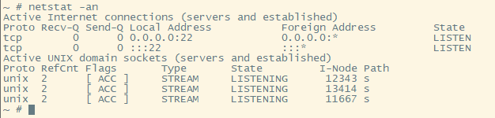

- [tc命令](#tc命令)
  - [tc命令实践](#tc命令实践)
    - [不同的interface有不同的默认qdisc配置](#不同的interface有不同的默认qdisc配置)
    - [查看filter](#查看filter)
    - [删除filter](#删除filter)
    - [tc mirror](#tc-mirror)
      - [问题解决](#问题解决)
      - [tc mirror特点](#tc-mirror特点)
      - [理论基础](#理论基础)
      - [参考](#参考)
  - [traffic control理论](#traffic-control理论)
    - [classless qdisc 无类型的qdisc](#classless-qdisc-无类型的qdisc)
    - [classfull qdisc](#classfull-qdisc)
    - [class树](#class树)
    - [命名惯例和参数惯例](#命名惯例和参数惯例)
- [raw socket](#raw-socket)
- [linux报文流程](#linux报文流程)
  - [iptable四表五链](#iptable四表五链)
    - [四表](#四表)
    - [五链](#五链)
    - [关系](#关系)
- [ebtables](#ebtables)
- [转发表(FIB)和路由表的区别](#转发表fib和路由表的区别)
- [MPLS](#mpls)
  - [MPLS帧格式](#mpls帧格式)
  - [传统路由器](#传统路由器)
  - [MPLS拓扑](#mpls拓扑)
- [网口相关的统计](#网口相关的统计)
  - [ethtool -S](#ethtool--s)
  - [/sys/class/net/eth0/statistics/](#sysclassneteth0statistics)
  - [man netstat](#man-netstat)
- [如何找到socket端口号对应的进程2 -- 使用ss命令](#如何找到socket端口号对应的进程2----使用ss命令)
- [docker内下载失败的解决](#docker内下载失败的解决)
  - [现象](#现象)
  - [调查](#调查)
  - [排查](#排查)
    - [抓包](#抓包)
      - [docker内执行curl, host上抓包](#docker内执行curl-host上抓包)
      - [本地host直接执行](#本地host直接执行)
      - [对比机器的docker内是好的](#对比机器的docker内是好的)
      - [对比机器的host上也是好的](#对比机器的host上也是好的)
    - [疑问 为什么有大于MTU的报文出现?](#疑问-为什么有大于mtu的报文出现)
    - [为什么大报文会丢?](#为什么大报文会丢)
  - [解决](#解决)
- [能ping通但tcp不能握手现象的解决](#能ping通但tcp不能握手现象的解决)
  - [现象](#现象-1)
  - [抓包及现象](#抓包及现象)
  - [可能的解释](#可能的解释)
  - [解决方案](#解决方案)
  - [后续](#后续)
- [tcp握手图示](#tcp握手图示)
- [tcpdump的filter使用](#tcpdump的filter使用)
  - [网络过滤](#网络过滤)
  - [协议过滤](#协议过滤)
- [iptable](#iptable)
  - [iptable查看规则](#iptable查看规则)
  - [iptable 清除所有的rule, 允许所有traffic](#iptable-清除所有的rule-允许所有traffic)
- [多线程能不能同时写同一个socket?](#多线程能不能同时写同一个socket)
  - [老外的问答](#老外的问答)
  - [知乎的解释](#知乎的解释)
- [eoe filter](#eoe-filter)
- [tcpdump标记的含义](#tcpdump标记的含义)
- [一次ssh登录的tcpdump](#一次ssh登录的tcpdump)
  - [建立连接握手](#建立连接握手)
  - [结束连接握手](#结束连接握手)
  - [补充观察](#补充观察)
- [如何找到socket端口号对应的进程](#如何找到socket端口号对应的进程)
  - [思路](#思路)
    - [inode和进程的fd有对应关系](#inode和进程的fd有对应关系)
    - [脚本](#脚本)
- [iproute2对应表](#iproute2对应表)
- [linux的网络报文统计](#linux的网络报文统计)
  - [驱动层](#驱动层)
  - [协议层](#协议层)
    - [netstat -s](#netstat--s)
    - [nstat替代netstat](#nstat替代netstat)
    - [netstat和nstat都是用/proc/net下面的统计](#netstat和nstat都是用procnet下面的统计)

# tc命令
tc命令是iproute2里面的用户态流量控制工具, tc是traffic control的意思.

## tc命令实践
### 不同的interface有不同的默认qdisc配置
```shell
# eth0是VM的主网口, 配了默认的pfifo_fast
$ tc qdisc show dev eth0
qdisc pfifo_fast 0: root refcnt 2 bands 3 priomap  1 2 2 2 1 2 0 0 1 1 1 1 1 1 1 1

# docker0是docker的默认网桥
$ tc qdisc show dev docker0
qdisc noqueue 0: root refcnt 2

# 下面两个命令都没有输出, 说明默认都没有classful 的qdisc
tc class show dev docker0
tc class show dev eth0
```

### 查看filter
命令格式`tc filter show [ dev STRING ] [ root | ingress | egress | parent CLASSID ]`

```shell
# 这样没输出
tc filter show dev eth-mgnt

# 后面带root | ingress | egress | parent CLASSI 才有输出
# 很奇怪在我的环境下root/ingress/egress都一样
/work # tc filter show dev eth-mgnt root
filter parent ffff: protocol all pref 49152 u32 chain 0
filter parent ffff: protocol all pref 49152 u32 chain 0 fh 800: ht divisor 1
filter parent ffff: protocol all pref 49152 u32 chain 0 fh 800::800 order 2048 key ht 800 bkt
 0 terminal flowid ??? not_in_hw
  match 00000000/00000000 at 0
        action order 1: mirred (Egress Redirect to device vmtap0) stolen
        index 1 ref 1 bind 1
```

### 删除filter
上面创建的ingress的filter好像没办法删, 但可以删除整个ingress qdisc
```shell
/work # tc qdisc show dev eth-mgnt
qdisc noqueue 0: root refcnt 2
qdisc ingress ffff: parent ffff:fff1 ----------------

# 删除整个qdisc
/work # tc qdisc del dev eth-mgnt ingress

# 删除后filter也没了, 下面命令输出为空
/work # tc filter show dev eth-mgnt root
```

### tc mirror
这里我要用tc mirror功能, 在docker中, 连接`eth-mgnt`和`vmtap0`

* `eth-mgnt`是docker的一个interface, 类型是veth
* `vmtap0`是个tap, 用来连接VM

```shell
tc qdisc add dev eth-mgnt ingress
tc filter add dev eth-mgnt parent ffff: protocol all u32 match u8 0 0 action mirred egress redirect dev vmtap0
tc qdisc add dev vmtap0 ingress
tc filter add dev vmtap0 parent ffff: protocol all u32 match u8 0 0 action mirred egress redirect dev eth-mgnt
```

#### 问题解决
`tc qdisc add dev eth-mgnt ingress`出错, 显示`RTNETLINK answers: No such file or directory`

网上普遍的说法是`modprobe sch_htb`或者`modprobe sch_red`等, 但试了都不管用. 看到都是`sch_*`格式的, 我就索性做了个搜索:

  
发现`sch_*`还挺多, 总不能一个一个试吧? 后记, 每个sch都对应一个qdisc的算法.

观察到命令里面的ingress关键字, 看到还有个`sch_ingress`, 于是试试`modprobe sch_ingress`, 再`tc qdisc add dev eth-mgnt ingress`成功.

所以, 解决方法:
需要`modprobe sch_ingress`

后面的命令还是出错, `tc filter add dev eth-mgnt parent ffff: protocol all u32 match u8 0 0 action mirred egress redirect dev vmtap0`, 同样显示`RTNETLINK answers: No such file or directory`

sch_ingress已经加载, 但还是出错. 那么应该还是有module没加载. 这次来个暴力的:
```shell
# 把/kernel/net/sched的所有ko都加载
for f in /lib/modules/`uname -r`/kernel/net/sched/*;do modprobe $(echo $(basename $f) | cut -d '.' -f1); done
```
再次执行tc filter命令成功, 说明之前确实是有的module没加载, 说明tc命令需要多个kernel module.

但总不能把有的没的module都加载放在那吧? 有没有办法只加载需要的ko呢?  
有, 如下:
```shell
# 把/kernel/net/sched的所有ko都卸载, 那些卸载不掉的就是需要的.
for f in /lib/modules/`uname -r`/kernel/net/sched/*;do modprobe -r $(echo $(basename $f) | cut -d '.' -f1); done
```
上面命令输出:
```shell
modprobe: FATAL: Module act_ife is in use.
modprobe: FATAL: Module act_mirred is in use.
modprobe: FATAL: Module cls_u32 is in use.
modprobe: FATAL: Module sch_ingress is in use.
```
我们看到`sch_ingress cls_u32 act_mirred act_ife`正在被使用, 除了ife, 其他都是命令里的关键字.

补充:内核选项:
```shell
#
# QoS and/or fair queueing
#
CONFIG_NET_SCHED=y
CONFIG_NET_SCH_CBQ=m
CONFIG_NET_SCH_HTB=m
CONFIG_NET_SCH_CSZ=m
CONFIG_NET_SCH_PRIO=m
CONFIG_NET_SCH_RED=m
CONFIG_NET_SCH_SFQ=m
CONFIG_NET_SCH_TEQL=m
CONFIG_NET_SCH_TBF=m
CONFIG_NET_SCH_GRED=m
CONFIG_NET_SCH_DSMARK=m
CONFIG_NET_SCH_INGRESS=m
CONFIG_NET_QOS=y
CONFIG_NET_ESTIMATOR=y
CONFIG_NET_CLS=y
CONFIG_NET_CLS_TCINDEX=m
CONFIG_NET_CLS_ROUTE4=m
CONFIG_NET_CLS_ROUTE=y
CONFIG_NET_CLS_FW=m
CONFIG_NET_CLS_U32=m
CONFIG_NET_CLS_RSVP=m
CONFIG_NET_CLS_RSVP6=m
CONFIG_NET_CLS_POLICE=y
```

#### tc mirror特点
我们这里用的其实不是mirror, 而是redirect.
```
docker0(bridge, 172.100.0.1) <--> eth-mgmt(veth, no ip, low up) <--tc redirect--> vmtap0(tap, no ip, low up) <--vmm forwarding--> eth0(in VM, virt-net, 172.100.0.5)
```
我在VM的eth0配了IP 172.100.0.5, ping 172.100.0.1可以ping通.  
下面我想看看tcpdump能不能在`eth-mgmt`或者`vmtap0`上抓到包.  
我猜会.

-- 没错, tcpdump在`eth-mgmt`和`vmtap0`都能抓到包.  
说明tc ingress也作用在pcap之后.

我感觉用socat在两个interface之间建立双向连接也能达到类似效果. 但socat会在用户态转发一下, 而tc mirror是在内核态直接转发.


#### 理论基础
参考:
* `man tc-mirred`
* https://access.redhat.com/documentation/en-us/red_hat_enterprise_linux/8/html/configuring_and_managing_networking/linux-traffic-control_configuring-and-managing-networking#doc-wrapper

> The mirred action allows packet mirroring (copying) or redirecting (stealing) the packet it receives.

  

#### 参考
https://gist.github.com/mcastelino/7d85f4164ffdaf48242f9281bb1d0f9b#file-tc-mirroring-md
```
tc qdisc add dev eth0 ingress
tc filter add dev eth0 parent ffff: protocol all u32 match u8 0 0 action mirred egress redirect dev tap0
tc qdisc add dev tap0 ingress
tc filter add dev tap0 parent ffff: protocol all u32 match u8 0 0 action mirred egress redirect dev eth0
```

`tc qdisc add dev eth0 ingress`

*   Add a queuing discipline
*   on `dev eth0`
*   attach the `ingress qdisc` Here the handle defaults to ffff:

`tc filter add dev eth0 parent ffff: protocol all u32 match u8 0 0 action mirred egress redirect dev tap0`

*   Add a filter
*   to device `dev eth0`
*   to parent (class) handle to which we are attaching, ffff: i.e. ingress which we created before (there is no need for `tc class add` in the ingress case as it does not support classful queuing discplines).
*   protocol all
*   classifier u32
*   parameters to the classifier u8 0 0, and the first byte of the packet with 0 and if the result is 0 (which it always will be) (i.e. always true)
*   action mirred egress redirect dev eth0, redirect the packet to egress of dev eth0

> create a new qdisc called "ingress". qdiscs normally don't work on ingress so this is really a special qdisc that you can consider an "alternate root" for inbound packets
add a new filter, and attach it to node "ffff:". The ID "ffff:" is the fixed ID of the ingress qdisc
we use the "u32" matcher, with arguments "u8 0 0". This means match any packet where the first byte, when ANDed with the value 0, returns 0\. In other words, all packets are selected

> [https://www.tldp.org/HOWTO/html_single/Traffic-Control-HOWTO/](https://www.tldp.org/HOWTO/html_single/Traffic-Control-HOWTO/)

> A source of terminology confusion is the usage of the terms root qdisc and ingress qdisc. These are not really queuing disciplines, but rather locations onto which traffic control structures can be attached for egress (outbound traffic) and ingress (inbound traffic).

> Each interface contains both. The primary and more common is the egress qdisc, known as the root qdisc. It can contain any of the queuing disciplines (qdiscs) with potential classes and class structures. The overwhelming majority of documentation applies to the root qdisc and its children. Traffic transmitted on an interface traverses the egress or root qdisc.

> For traffic accepted on an interface, the ingress qdisc is traversed. With its limited utility, it allows no child class to be created, and only exists as an object onto which a filter can be attached. For practical purposes, the ingress qdisc is merely a convenient object onto which to attach a policer to limit the amount of traffic accepted on a network interface.

## traffic control理论
流量控制包括:
* 整形SHAPING: 只作用于egress, 控制发送速率
* 调度SCHEDULING: 只作用于egress, 包括reordering或者叫prioritizing
* 策略POLICING: 只作用于ingress
* 丢弃DROPPING: 可以作用于ingress和egress

具体来说, tc通过qdisc, class和filter来控制流量
* qdisc  
是queueing discipline的缩写, 是tc的核心. 每当kernel要发送一个报文到interface, 就会把他放到为这个interface配置的qdisc. 随后kernel马上从这个qdisc拿尽可能多的packet, 放到interface的驱动里.  
最简单的qdisc是pfifo, 先进先出的队列.
* class  
qdisc可以包括class, class下面又包括qdisc, 形成两级甚至多级的qdisc. 比如优先级策略case下, qdisc可以包括多个class, kernel dequeue(即从qdisc拿报文发送到接口)的时候, 根据配置, 可以先从某些class下挂的qdisc拿报文.
* filter  
在有class的qdisc情况下, filter决定一个报文应该被放到哪个class. filter可以有多个, 按顺序匹配, 直到有个filter命中. filter从属于qdisc, 类型包括:
    * basic: 基于表达式匹配. 详见`man tc-ematch`
    * bpf: 用(e)BPF. 详见`man tc-bpf`
    * cgroup: 基于进程的cgroup. 详见`man tc-cgroup`
    * flow, flower: 基于流的key. 详见`man tc-flow` `man tc-flower`
    * fw: 基于fwmark. 详见`man tc-fw`
    * route: 基于路由表. 详见`man tc-route`
    * rsvp: Resource Reservation Protocol (RSVP)
    * tcindex: 基于traffic control index. 详见`man tc-tcindex`
    * u32: 通用的基于报文data的过滤. 详见`man tc-u32`
    * matchall: 匹配任何一个报文. 详见`man tc-matchall`

### classless qdisc 无类型的qdisc
qdisc可以有class, 也可以没有. 没有class的qdisc有如下类型:
* choke: 是RED算法的变种. 保留活动的flow, kill不活跃的flow
* codel: 也是RED算法的变种.
* [p|b]fifo: 先进先出的fifo
* fq: Fair Queue Scheduler
* fq_codel: 结合了codel的fq
* gred: Generalized Random Early Detection, 和RED结合实现丢弃优先级
* hhf: Heavy-Hitter  Filter. 检测small flow和heavy flow. 让heavy的flow使用单独的queue, 从而减小对延迟敏感的small flow的延迟.
* ingress: ingress是个特殊的qdisc, 它作用于到interface的incoming报文
* mqprio: Multiqueue Priority Qdisc. 1:1的优先级队列mapping到硬件的queue
* multiq: 作用于有多tx queue的硬件
* netem: Network Emulator, 可以加delay, 丢包, 复制等动作到出端口
* pfifo_fast: Standard qdisc for 'Advanced Router' enabled kernels
* pie: Proportional Integral controller-Enhanced (PIE). 目标是控制delay
* red: Random  Early  Detection. 当快接近配置的带宽时随机丢包
* sfb: 和red算法不同但也是为了带宽控制的一个算法.
* sfq: Stochastic Fairness Queueing
* tbf: Token Bucket Filter. 控制rate的.

无类型的qdisc只能被添加到设备的root. 语法是
```shell
tc qdisc add dev DEV root QDISC QDISC-PARAMETERS
tc qdisc del dev DEV root
```
default是pfifo_fast.
注: 我在服务器上用`tc qdisc`看到一般的qdisc默认是noqueue.

### classfull qdisc
有类型的qdisc也有很多类型:
* ATM: Map flows to virtual circuits
* CBQ: Class Based Queueing. 基于层级的class. 支持shaping和优先级属性.
* DRR: Deficit  Round  Robin Scheduler
* DSMARK: Classify packets based on TOS field
* HFSC:  Hierarchical  Fair  Service  Curve. 层级的对每个节点带宽控制的算法
* HTB: Hierarchy Token Bucket
* PRIO: 优先级
* QFQ: Quick Fair Queueing. 算法复杂度O(1)

### class树
class是个多叉树. 有些算法支持动态添加删除class, 比如CBQ,  HTB; 有的算法只能预定义树, 比如PRIO  
When a packet enters a classful qdisc it can be classified to one of the classes within.  
用如下3种方式来做分类
* tc filters: 如果这个class有tc filter, 首先做tc filter分类
* Type of Service: 有些算法有内置的规则classifying packets based on the TOS field
* skb->priority: 用户程序可以用SO_PRIORITY给报文添加优先级

### 命名惯例和参数惯例
qdiscs, classes and filters都有指定或者自动分配的ID, 格式major:minor
* qdisc可能有孩子节点, 它的ID被称为handle
* 在同一个qdisc下面的class共享一个major ID, 但minor ID不同

tc常用的参数惯例:
比如, kbit mbit gbit mbps ms等


# raw socket
`man packet`

* 纯正的raw socket. SOCK_RAW是要自己组二层头的, 驱动不会检查报文, 直接发送出去.  
`packet_socket = socket(AF_PACKET, SOCK_RAW, int protocol)`

* 也可以用SOCK_DGRAM, 二层头会被自动加上在发送.  
`packet_socket = socket(AF_PACKET, SOCK_DGRAM, int protocol)`

* AF_INET类型的raw socket是需要IP的  
`raw_socket = socket(AF_INET, SOCK_RAW, int protocol);`

# linux报文流程
  
## iptable四表五链
### 四表
* Raw表——关闭连接追踪机制。用在prerouting，output链上。
* Mangle表——拆解报文，分析报文，修改报文。用在prerouting，input，forward，output，postrouting链路上。
* Nat表——网络地址转换，用在prerouting，output，postrouting链路上。
* Filter表——负责过滤功能，用在input，forward，output链路上。

**每个表优先级：**
**Raw—>Mangle—>Nat—>Filter**

### 五链
* input——进来的数据包应用此规则链中的策略（经过了第一次路由选择的数据包）目的IP在路由器上
* output——外出的数据包应用此规则链中的策略（经过了第二次路由选择的数据包）从路由器出去的
* forward——转发数据包时应用此规则链中的策略（经过了第一次路由选择的数据包）数据包源IP和目的IP都不在路由器上的
* prerouting——对进来的数据包作路由选择前应用此链中的规则（还没有经过任何路由选择的所有数据包进来的时侯都先由这个链处理）外面进来路由器接口的数据包
* postrouting——对出去的数据包作路由选择后应用此链中的规则（经过了所有的路由选择的所有数据包出来的时侯都先由这个链处理）路由器从接口送出去的数据包

### 关系
  
**为什么要判断两次路由呢？**

其实路由是判断这个数据从哪里来到哪里去，要不要路由器出手干活，可以这么理解:

A.网关IP是路由器，但是不需要内核处理的数据，如内网对内网，只要经过一次判断就一条直线传出去了。

B.目的IP是路由器，且需要内核处理的数据，如内网对公网、公网对内网，都要拐个弯处理。因为涉及修改IP数据的处理。

所以，第一次是判断是否要路由器出手处理，第二次是修改完IP数据之后决定往哪个接口（网关）上面送数据.

# ebtables
ebtables是配置网桥规则的, 和iptable类似. 好像默认是空规则

[http://www.microhowto.info/troubleshooting/troubleshooting_ethernet_bridging_on_linux.html](http://www.microhowto.info/troubleshooting/troubleshooting_ethernet_bridging_on_linux.html "http://www.microhowto.info/troubleshooting/troubleshooting_ethernet_bridging_on_linux.html")


# 转发表(FIB)和路由表的区别
1.路由表  
　　路由信息最终要存储在用于路由器的主机或者专业路由器上，存放这些信息的地方称为路由表。其中包含三元素：目标地址，掩码，下一跳。  
　　1.1.查询路由表的开销  
　　有人认为查询路由表是一件和交换机查询MAC地址一样的事，那就大错特错了，查询MAC地址/端口对是一种固定的数据查找，MAC地址都是固定的48字节，而IP地址呢，自从CIDR出现以后，地址成了“无类”的了，因此任意位的掩码都能成为正确的掩码，另外，聪明的管理员想出了路由汇聚，这些家伙将负担转嫁给了系统的实现者，从而系统实现者必须实现“最长掩码”匹配，既然掩码是不固定的，因此查询就是不固定的，这是很麻烦的事。  
　　2.转发表  
　　数据包到达路由器的时候，要根据“指示”前往特定的端口，类似交换机的地址信息表，路由器上存放这个“指示”的地方叫做转发表  
　　3.两个表的关系  
　　3.1.联系  
　　转发表直接作用于数据包，而路由表是转发表生成的依据，转发表通过路由表生成。一个特定的进程可以通过使用路由表中的信息，加上自身的主机方面的信息-比如网卡等信息-加以综合，得到一张转发表。路由信息和主机是没有任何关系的，它只描述网络链路状态和方向。  
　　3.2.区别  
　　两表存储的信息是不同的，路由表只存储三元素-目标，掩码，下一跳；而转发表存储更详细的信息，比如输出端口信息，比如标记信息等。转发表描述了主机方面的信息，在主机内部将一个数据包从一个端口导向另一端口，而路由表描述网络信息，将数据包从一个机器导向另一机器。  
　　4.误区  
　　当前很多人都懂一个系统的实现，这些人不外乎3类，第一类精通linux内核，第二类精通Cisco设备的配置，第三类精通Windows网络编程以及NDIS。三类人一般的交集很少，因此大部分熟悉Linux内核的人都不会去区分路由表和转发表，因为Linux内核本身就不区分这两个表，每到一个数据包都会查路由表(当然前面还有一个缓存...但这不是转发表)；因此熟悉Cisco的家伙会认为两个表是一定要区分的，否则MPLS怎么实现？熟悉Windows核心的人呢？可能并不关心这些，因为Windows几乎不用于路由器。  
　　5.区分二表的好处之实例  
　　MPLS是区分路由表和转发表的一个明显的例子，首先声明，MPLS是一个网络，而不是运行特定协议的一个节点。在MPLS中，完全通过标签进行数据包转发，在MPLS网络可用于数据业务之前(中间也可以通过标签分发协议动态调整)，MPLS转发表就建好了，它的表项包含三元素：来源数据自带标签/转发到的端口/转发出去携带的标签。这个表项是通过路由表建立的，我们将之视为转发表。实现MPLS需要在入口路由器上为数据包单独打上一个标签，这样直到出去MPLS网络，数据包就可以快速被转发了，省去了直接查询路由表的开销。

# MPLS
## MPLS帧格式
  

## 传统路由器
参考: https://zhuanlan.zhihu.com/p/27232535  

传统路由器对每个数据包都独立的进行路由转发.  
以IP协议报文为例，路由决策是基于目的IP地址，路由器根据目的IP地址，选择路由条目，再做转发。路由决策可以认为是由两部分组成：
*   分类，将特定的数据包归属为一个等价转发类（Forwarding Equivalence Classes，FECs）
*   查找，查找FEC对应的[next hop](https://www.zhihu.com/search?q=next+hop&search_source=Entity&hybrid_search_source=Entity&hybrid_search_extra=%7B%22sourceType%22%3A%22article%22%2C%22sourceId%22%3A27232535%7D)

具体到[IP协议报文](https://www.zhihu.com/search?q=IP%E5%8D%8F%E8%AE%AE%E6%8A%A5%E6%96%87&search_source=Entity&hybrid_search_source=Entity&hybrid_search_extra=%7B%22sourceType%22%3A%22article%22%2C%22sourceId%22%3A27232535%7D)，当多个IP协议报文的目的地址都对应路由器的一条路由，且这条路由是所有路由里面最长匹配（longest match）的路由，那么对于这个路由器来说，就会认为这两个IP协议报文属于一个FEC。因此，这两个数据包就会走同一条路径出这个路由器。这就是我们最常见到的路由转发。

需要注意的是，这里的FEC是针对路由器的，而不是全局的。举个例子，目的地址为192.168.31.1和192.168.31.100的两个IP协议报文，第一个路由器具有192.168.31.0/24这条路由，那么在第一个路由器它们属于同一个FEC，都会被转发到第二个路由器。第二个路由器具有192.168.31.0/26和192.168.31.0/24两条路由，并且两条路由的next hop不一样。因为192.168.31.0/26能更精确的匹配192.168.31.1，所以192.168.31.1匹配第一条路由，而192.168.31.100匹配第二条路由，最终，这两个IP协议报文在第二个路由器被认为是不同的FEC，从不同的路径出去。这就是每个路由器都需要独立的做路由决策的原因之一。

  

由于每个路由器都需要独立的路由决策（虽然会有这样那样的缓存机制加速决策），而路由器的收发队列一旦满了，就会丢包。所以在一个高流量，高容量的网络里面，无疑对每个路由器的要求都很高（否则就会丢包了！）

针对这个问题，MPLS提出了类似的，但是更简单的另外一种路由决策的方法。

传统的路由决策，路由器需要对网络数据包进行解包，再根据目的IP地址计算归属的FEC。而MPLS提出，当网络数据包进入MPLS网络时，对网络数据包进行解包，计算归属的FEC，生成标签（Label）。当网络数据包在MPLS网络中传输时，路由决策都是基于Label，路由器不再需要对网络数据包进行解包。并且Label是个整数，以整数作为key，可以达到O(1)的查找时间。大大减少了路由决策的时间。这里的Label就是MPLS里面的L。需要注意的是Label在MPLS网络里面，是作为网络数据包的一部分，随着网络数据包传输的。

也就是说，在[MPLS网络](https://www.zhihu.com/search?q=MPLS%E7%BD%91%E7%BB%9C&search_source=Entity&hybrid_search_source=Entity&hybrid_search_extra=%7B%22sourceType%22%3A%22article%22%2C%22sourceId%22%3A27232535%7D)里面，数据被封装在了盒子里，上面贴了标签，每个经手的人只需要读标签就知道盒子该送到哪。而传统的路由网络里面，每个经手的人都需要打开盒子，看看里面的内容，再决定送往哪。

这里提到了MPLS网络，这是一个由相连的，支持MPLS的设备组成的网络。打上MPLS标签的数据可以在这个网络里面传输。MPLS的核心就是，**一旦进入了MPLS网络，那么网络数据包的内容就不再重要，路由决策（包括FEC归属的计算，next hop的查找）都是基于Label来进行的。**

从目前看，MPLS带来的好处是，在MPLS网络里面，除了[边界路由器](https://www.zhihu.com/search?q=%E8%BE%B9%E7%95%8C%E8%B7%AF%E7%94%B1%E5%99%A8&search_source=Entity&hybrid_search_source=Entity&hybrid_search_extra=%7B%22sourceType%22%3A%22article%22%2C%22sourceId%22%3A27232535%7D)，其他路由器可以由一些支持Label查找替换的低性能的交换机，或者路由器来完成。这一方面降低了组网的成本，另一方面提升了同样性能设备的转发效率。不过，随着路由器的发展，这方面的优势弱化了，而且，类似的问题，也不一定需要MPLS来解决。**MPLS的价值更多的在于其他方面。** 不过初步理解MPLS，就先说这些。到目前为止，MPLS里面的M，P，L都介绍过，S其实也隐含的介绍过，S是Switching的意思，即基于Label做路由决策的意思，或者说标签交换里面的交换。相信大家也明白了为什么说MPLS是一种高效的数据传输的技术。

## MPLS拓扑
  
CE：前面没有介绍过，其实就是传统路由网络中与LER连接的路由器，可以理解成客户网络的[边缘路由器](https://www.zhihu.com/search?q=%E8%BE%B9%E7%BC%98%E8%B7%AF%E7%94%B1%E5%99%A8&search_source=Entity&hybrid_search_source=Entity&hybrid_search_extra=%7B%22sourceType%22%3A%22article%22%2C%22sourceId%22%3A27232535%7D)。  
PE：服务提供商的边缘路由器，对应LER。  
P：服务提供商的路由器，对应LSR。  

为什么会有这些术语上的不同，MPLS的提出本身是中立的，但是随着发展，现在应用最多的是电信网络，所以才有了[customer provider](https://www.zhihu.com/search?q=customer+provider&search_source=Entity&hybrid_search_source=Entity&hybrid_search_extra=%7B%22sourceType%22%3A%22article%22%2C%22sourceId%22%3A27232535%7D)这些概念，其实都是对应电信运营商网络中的设备。上图中间部分就是个MPLS网络，前面介绍过，MPLS网络中的IP报文都是带有MPLS标签的。下面来过一下工作过程：

1.  在所有的网络流量之前，PE路由器需要通过MPLS网络与远端PE路由器建立LSP。
2.  客户网络从CE发来的非MPLS 报文，发送到了ingress PE路由器，也就是MPLS [ingress edge node](https://www.zhihu.com/search?q=ingress+edge+node&search_source=Entity&hybrid_search_source=Entity&hybrid_search_extra=%7B%22sourceType%22%3A%22article%22%2C%22sourceId%22%3A27232535%7D)。
3.  ingress PE 路由器通过运算得出IP协议报文归属于哪个FEC，并把相应的Label加到了IP协议报文。
4.  IP协议报文沿着LSP传输，每个P路由器都根据自身的NHLFE，替换Label，再把报文传给下一跳。
5.  在egress PE路由器，Label被从IP协议报文中删除，一个传统的IP协议报文又产生了。
6.  IP协议报文被发送到了对端的CE路由器，最终进入了另一个[客户网络](https://www.zhihu.com/search?q=%E5%AE%A2%E6%88%B7%E7%BD%91%E7%BB%9C&search_source=Entity&hybrid_search_source=Entity&hybrid_search_extra=%7B%22sourceType%22%3A%22article%22%2C%22sourceId%22%3A27232535%7D)。

# 网口相关的统计
## ethtool -S
## /sys/class/net/eth0/statistics/
注意到`/sys/class/net`下面有很多详细的接口信息
```shell
~ # cat /sys/class/net/eth0/statistics/rx_packets
23671787
~ # cat /sys/class/net/eth0/statistics/rx_dropped
0
```

## man netstat
提到说如下proc文件系统下的文件:
```shell
       /proc/net/dev -- device information
       /proc/net/raw -- raw socket information
       /proc/net/tcp -- TCP socket information
       /proc/net/udp -- UDP socket information
       /proc/net/udplite -- UDPLite socket information
       /proc/net/igmp -- IGMP multicast information
       /proc/net/unix -- Unix domain socket information
       /proc/net/ipx -- IPX socket information
       /proc/net/ax25 -- AX25 socket information
       /proc/net/appletalk -- DDP (appletalk) socket information
       /proc/net/nr -- NET/ROM socket information
       /proc/net/route -- IP routing information
       /proc/net/ax25_route -- AX25 routing information
       /proc/net/ipx_route -- IPX routing information
       /proc/net/nr_nodes -- NET/ROM nodelist
       /proc/net/nr_neigh -- NET/ROM neighbours
       /proc/net/ip_masquerade -- masqueraded connections
       /sys/kernel/debug/bluetooth/l2cap -- Bluetooth L2CAP information
       /sys/kernel/debug/bluetooth/rfcomm -- Bluetooth serial connections
       /proc/net/snmp -- statistics
```
比如:
```shell
~ # cat /proc/net/snmp
Ip: Forwarding DefaultTTL InReceives InHdrErrors InAddrErrors ForwDatagrams InUnknownProtos InDiscards InDelivers OutRequests OutDiscards OutNoRoutes ReasmTimeout ReasmReqds ReasmOKs ReasmFails FragOKs FragFails FragCreates
Ip: 1 64 27939461 0 3 0 0 0 27939458 27949181 1 4 0 0 0 0 0 0 0
Icmp: InMsgs InErrors InCsumErrors InDestUnreachs InTimeExcds InParmProbs InSrcQuenchs InRedirects InEchos InEchoReps InTimestamps InTimestampReps InAddrMasks InAddrMaskReps OutMsgs OutErrors OutDestUnreachs OutTimeExcds OutParmProbs OutSrcQuenchs OutRedirects OutEchos OutEchoReps OutTimestamps OutTimestampReps OutAddrMasks OutAddrMaskReps
Icmp: 13600191 24 0 13574229 0 0 0 0 0 25962 0 0 0 0 13600247 0 13574229 0 0 0 0 26018 0 0 0 0 0
IcmpMsg: InType0 InType3 OutType3 OutType8
IcmpMsg: 25962 13574229 13574229 26018
Tcp: RtoAlgorithm RtoMin RtoMax MaxConn ActiveOpens PassiveOpens AttemptFails EstabResets CurrEstab InSegs OutSegs RetransSegs InErrs OutRsts InCsumErrors
Tcp: 1 200 120000 -1 27400 3068 27015 4 497 765163 785175 434 0 150 0
Udp: InDatagrams NoPorts InErrors OutDatagrams RcvbufErrors SndbufErrors InCsumErrors IgnoredMulti
Udp: 9 13574095 0 13574104 0 0 0 0
UdpLite: InDatagrams NoPorts InErrors OutDatagrams RcvbufErrors SndbufErrors InCsumErrors IgnoredMulti
UdpLite: 0 0 0 0 0 0 0 0
```

# 如何找到socket端口号对应的进程2 -- 使用ss命令
`ss -ap`命令可以打印所有socket的信息, `-p`表示打印进程名

```shell
~ # ss -h
Usage: ss [ OPTIONS ]
       ss [ OPTIONS ] [ FILTER ]
   -h, --help          this message
   -V, --version       output version information
   -n, --numeric       don't resolve service names
   -r, --resolve       resolve host names
   -a, --all           display all sockets
   -l, --listening     display listening sockets
   -o, --options       show timer information
   -e, --extended      show detailed socket information
   -m, --memory        show socket memory usage
   -p, --processes     show process using socket
   -i, --info          show internal TCP information
       --tipcinfo      show internal tipc socket information
   -s, --summary       show socket usage summary
       --tos           show tos and priority information
   -b, --bpf           show bpf filter socket information
   -E, --events        continually display sockets as they are destroyed
   -Z, --context       display process SELinux security contexts
   -z, --contexts      display process and socket SELinux security contexts
   -N, --net           switch to the specified network namespace name

   -4, --ipv4          display only IP version 4 sockets
   -6, --ipv6          display only IP version 6 sockets
   -0, --packet        display PACKET sockets
   -t, --tcp           display only TCP sockets
   -S, --sctp          display only SCTP sockets
   -u, --udp           display only UDP sockets
   -d, --dccp          display only DCCP sockets
   -w, --raw           display only RAW sockets
   -x, --unix          display only Unix domain sockets
       --tipc          display only TIPC sockets
       --vsock         display only vsock sockets
   -f, --family=FAMILY display sockets of type FAMILY
       FAMILY := {inet|inet6|link|unix|netlink|vsock|tipc|xdp|help}

   -K, --kill          forcibly close sockets, display what was closed
   -H, --no-header     Suppress header line
   -O, --oneline       socket's data printed on a single line

   -A, --query=QUERY, --socket=QUERY
       QUERY := {all|inet|tcp|udp|raw|unix|unix_dgram|unix_stream|unix_seqpacket|packet|netlink|vsock_stream|vsock_dgram|tipc}[,QUERY]

   -D, --diag=FILE     Dump raw information about TCP sockets to FILE
   -F, --filter=FILE   read filter information from FILE
       FILTER := [ state STATE-FILTER ] [ EXPRESSION ]
       STATE-FILTER := {all|connected|synchronized|bucket|big|TCP-STATES}
         TCP-STATES := {established|syn-sent|syn-recv|fin-wait-{1,2}|time-wait|closed|close-wait|last-ack|listening|closing}
          connected := {established|syn-sent|syn-recv|fin-wait-{1,2}|time-wait|close-wait|last-ack|closing}
       synchronized := {established|syn-recv|fin-wait-{1,2}|time-wait|close-wait|last-ack|closing}
             bucket := {syn-recv|time-wait}
                big := {established|syn-sent|fin-wait-{1,2}|closed|close-wait|last-ack|listening|closing}
```

# docker内下载失败的解决
## 现象
docker内下载失败, git clone失败  
命令:
```shell
http_proxy="" curl -s http://10.182.105.179:8088/godevtools/godevtool
#或者
git clone https://gitlabe1.ext.net.nokia.com/godevsig/compatible.git/
```
都卡住, 长时间后者还会显示
`OpenSSL SSL_connect: Connection reset by peer in connection to gitlabe1.ext.net.nokia.com:443`

## 调查
## 排查
使用`http_proxy="" curl -s http://10.182.105.179:8088/godevtools/godevtool`来复现和调查  
* host两个命令都能成功执行  
-- 所有的报文都能进出host, 排除了host侧的防火墙配置问题
* docker内能ping通  
-- 不是dns和简单的docker网络不通问题
* docker内执行`http_proxy="" curl -s http://10.182.105.179:8088/`命令很意外的是正常的
* docker里面`curl google.com`是正常的
* docker里面加不加`http_proxy`都能复现问题

到这里, 总结如下:
docker里面基本网络正常, 和目标能连接. 但不知道什么原因, 下载和git clone失败, 感觉好像是类似"文件下载"的操作就不行

### 抓包
用这个命令抓包:
```shell
sudo tcpdump -n '(host 10.182.105.179) or (host 10.158.100.6)'
```
`10.182.105.179`就是`curl -s`的目标ip, `10.158.100.6`是个代理ip, 在这里没有使用, 可以忽略

现象:

#### docker内执行curl, host上抓包
  
实际上, 这个tcpdump几乎已经显示了问题:
* `192.168.0.16.60718`先给`10.182.105.179.8088`发SYNC
* 8088回SYNC的ACK
* 60718再回ACK, 至此握手成功(TCP三次握手)
* 60718开始发PUSH请求, seq号从1重新开始, 1:104, 共103字节
* 8080回ACK 104, 表示第104号字节收到
* 8088发seq 1:18字节
* 60718 ACK字节18
* 8088**突然**发seq 5810:6513字节. 即19:5810丢失
* 60718发现seq号跳变了, 没有收到18:5810之间的字节, 只能ACK移植收到的字节18
同时sack 5810:6514, sack可以避免发送方重传已经收到的报文
* 8088肯定收到了这个ack报文, 并且已经知道需要重传. 可能已经重传了, 但在60718看来, 什么也没收到.
报文肯定在中间环节被丢弃了.
* 18秒后, 60718决定不再等待, 发FIN; seq号还是接着自己已经发送的字节数来, 同时再次ack 18
* 8088收到FIN, 回ack, 后面没抓了, 应该是4次挥手后断开连接

问题在于, 18:5810字节丢失, 共5792个字节丢失了.

#### 本地host直接执行
在host上直接执行curl命令, 一切正常  
  
注意这个mss字段, 是通信双方协商mss用的. mss比mtu略小一点, 基本能反应mtu的情况.

这个值后面会用到.  
host上, curl命令能接收8088发的"数据"报文, 依次是长度为2796, 1398, 2301字节的报文.

这里再记一个问题:  
为什么会有这些大于MTU的报文? 后面会讲到

后面再多对比一组数据, 就能更清楚

#### 对比机器的docker内是好的
另一个host上, docker内执行curl是好的, 抓包如下  
  
正好有这个5792个字节的数据

#### 对比机器的host上也是好的
  

### 疑问 为什么有大于MTU的报文出现?
首先要复习一下tcpdump的原理: [jianguo的tcpdump原理分析](https://jgsun.github.io/2019/01/21/linux-tcpdump)

tcpdump一般使用pcap_mmap模式, 基本上, 在driver收报之后, 经过bpf filter后, 报文拷贝一份给tcpdump

  
tcpdump在用户态poll等待被唤醒, 报文ready的时候内核唤醒用户态进程, 此时报文已经被mmap了, 用户态可以直接读, 这比传统的recv等系统调用减少了一次报文拷贝.

tcpdump每次打印一个packet, 这个packet就是"原始的"报文. 
那为什么报文长度大于MTU了呢?
-- 这和网卡的offload功能有关. 见笔记`Linux下网络性能优化方法简析`

一般offload包括:这些是网卡特性, 由网卡驱动声明支持.
* TSO (TCP Segmentation Offload）
* GSO (Generic Segmentation Offload)
* LRO (Large Receive Offload)
* GRO (Generic Receive Offload)

在接收路径上, 物理线路上的报文还是按照MTU的, 即一般是1500; 但到网卡, 硬件会自动做LRO, 把分片的报文重组, 这样上层协议栈就能减少点负担.  
发送路径也一样, 协议栈知道网卡硬件支持TSO, 就不在协议栈分片了, 分片推迟到网卡上进行, 提高性能.

tcpdump看到的报文, 是网卡硬件已经重组后的报文, 超出了mtu也是对的. 但注意, 对端不知道网卡的offload功能, 还是按照MTU在发. 应该说, 物理线路上走的还是MTU.

[参考解释](https://packetbomb.com/how-can-the-packet-size-be-greater-than-the-mtu/)

这回答了上面的问题.

### 为什么大报文会丢?
其实是MTU.

注意到, 问题docker中的MTU是1500, host上是1450. 

在docker内, curl程序和8088握手的时候, 协商的mss为1460, 已经比host的MTU大. 8088发过来的报文超过MTU会被host driver丢弃.

## 解决
修改host MTU
```shell
man ip link
ip link set dev eth0 mtu 1500
```
结果, 配置失败, 驱动返回不支持.

在docker里面也配不了mtu, 会报netlink错误.

实际上, docker的mtu是docker deamon管的.

修改方法如下:  
增加docker的配置文件, 指定mtu
```shell
yingjieb@cloud-server-1:~$ cat /etc/docker/daemon.json
{
  "mtu": 1400
}
```
然后重启docker daemon  
`sudo systemctl restart docker`

实际上, 这个mtu是配在docker0网桥上的
```shell
yingjieb@cloud-server-2:~$ ip link show
1: lo: <LOOPBACK,UP,LOWER_UP> mtu 65536 qdisc noqueue state UNKNOWN mode DEFAULT group default qlen 1000
    link/loopback 00:00:00:00:00:00 brd 00:00:00:00:00:00
2: eth0: <BROADCAST,MULTICAST,UP,LOWER_UP> mtu 1450 qdisc fq_codel state UP mode DEFAULT group default qlen 1000
    link/ether fa:16:3e:2d:47:a6 brd ff:ff:ff:ff:ff:ff
3: docker0: <BROADCAST,MULTICAST,UP,LOWER_UP> mtu 1400 qdisc noqueue state UP mode DEFAULT group default
    link/ether 02:42:16:b8:42:bf brd ff:ff:ff:ff:ff:ff
27: veth3195c8e@if26: <BROADCAST,MULTICAST,UP,LOWER_UP> mtu 1400 qdisc noqueue master docker0 state UP mode DEFAULT group default
    link/ether 46:f2:76:de:50:00 brd ff:ff:ff:ff:ff:ff link-netnsid 0

```

# 能ping通但tcp不能握手现象的解决
## 现象
板子(miniolt): 10.242.29.181
服务器: 10.182.105.138

板子放在工位桌子上, 和我的PC通过网线连接小交换机的方式, 连到办公大网.
板子上用dhclient获取的IP地址, ip和PC机同网段.

使用时, 板子能够ping通服务器, 但wget, ssh等都不通.
```shell
~ # wget http://10.182.105.138:8088/release/latest/mips/topid
Connecting to 10.182.105.138:8088 (10.182.105.138:8088)
wget: can't connect to remote host (10.182.105.138): Connection refused
```

## 抓包及现象
在板子上和服务器上分别抓包  
板子上抓和服务器IP的交互的包
```
tcpdump -nevvxx host 10.182.105.138
```
服务器上抓和板子IP交互的包
```
tcpdump -nevvxx host 10.242.29.181
```
在服务器上, 能够抓到包, 说明报文能够到达, 这和ping的结果是一致的.  
但TCP建立连接的3次握手不正常. 服务器认为对端最后发了RESET, 终止连接.
```shell
#对端发的握手请求: Flags  [S]
07:18:58.264471 fa:16:3e:36:da:c0 > fa:16:3e:cf:b4:34, ethertype IPv4 (0x0800), length 74: (tos 0x48, ttl 50, id 1104, offset 0, flags [DF], proto TCP (6), length 60)
    10.242.29.181.39672 > 192.168.0.14.8088: Flags [S], cksum 0xbcab (correct), seq 2058190441, win 29200, options [mss 1460,sackOK,TS val 33978937 ecr 0,nop,wscale 7], length 0

#握手回应: Flags  [S.]
07:18:58.264555 fa:16:3e:cf:b4:34 > fa:16:3e:36:da:c0, ethertype IPv4 (0x0800), length 74: (tos 0x0, ttl 64, id 0, offset 0, flags [DF], proto TCP (6), length 60)
    192.168.0.14.8088 > 10.242.29.181.39672: Flags [S.], cksum 0xe98b (incorrect -> 0x22e1), seq 3461531035, ack 2058190442, win 64720, options [mss 8102,sackOK,TS val 3513094066 ecr 33978937,nop,wscale 7], length 0

#对端发来RESET消息, 连接中断
07:18:58.270345 fa:16:3e:36:da:c0 > fa:16:3e:cf:b4:34, ethertype IPv4 (0x0800), length 54: (tos 0x48, ttl 50, id 29613, offset 0, flags [DF], proto TCP (6), length 40)
    10.242.29.181.39672 > 192.168.0.14.8088: Flags [R], cksum 0x12db (correct), seq 2058190442, win 0, length 0

```

那板子是否发了RESET消息? 下面是板子的抓包
```shell
#板子发SYN, 握手请求
12:58:08.892054 c8:f8:6d:b7:0e:24 > 00:00:5e:00:01:02, ethertype IPv4 (0x0800), length 74: (tos 0x0, ttl 64, id 1104, offset 0, flags [DF], proto TCP (6), length 60)
    10.242.29.181.39672 > 10.182.105.138.8088: Flags [S], cksum 0x9d15 (incorrect -> 0x0922), seq 2058190441, win 29200, options [mss 1460,sackOK,TS val 33978937 ecr 0,nop,wscale 7], length 0
    
#板子收到连续2次RESET, 请求连接断开; 但对端其实并没有发RESET
12:58:08.892221 2c:fa:a2:3a:88:75 > c8:f8:6d:b7:0e:24, ethertype IPv4 (0x0800), length 60: (tos 0x0, ttl 120, id 64765, offset 0, flags [none], proto TCP (6), length 40)
    10.182.105.138.8088 > 10.242.29.181.39672: Flags [R.], cksum 0x5f41 (correct), seq 0, ack 2058190442, win 0, length 0

12:58:08.892283 2c:fa:a2:3a:88:75 > c8:f8:6d:b7:0e:24, ethertype IPv4 (0x0800), length 60: (tos 0x0, ttl 120, id 64765, offset 0, flags [none], proto TCP (6), length 40)
    10.182.105.138.8088 > 10.242.29.181.39672: Flags [R.], cksum 0x5965 (correct), seq 1500, ack 1, win 0, length 0

#板子收到对端发来的SYN响应, 但为时已晚
12:58:08.898020 2c:fa:a2:3a:88:75 > c8:f8:6d:b7:0e:24, ethertype IPv4 (0x0800), length 74: (tos 0x48, ttl 50, id 0, offset 0, flags [DF], proto TCP (6), length 60)
    10.182.105.138.8088 > 10.242.29.181.39672: Flags [S.], cksum 0x6f57 (correct), seq 3461531035, ack 2058190442, win 64720, options [mss 8102,sackOK,TS val 3513094066 ecr 33978937,nop,wscale 7], length 0
    
#板子给对端发RESET, 因为板子认为连接需要abort.
12:58:08.898076 c8:f8:6d:b7:0e:24 > 00:00:5e:00:01:02, ethertype IPv4 (0x0800), length 54: (tos 0x48, ttl 64, id 29613, offset 0, flags [DF], proto TCP (6), length 40)
    10.242.29.181.39672 > 10.182.105.138.8088: Flags [R], cksum 0x5f51 (correct), seq 2058190442, win 0, length 0

#板子又收到连续4次的RESET
12:58:08.898085 2c:fa:a2:3a:88:75 > c8:f8:6d:b7:0e:24, ethertype IPv4 (0x0800), length 60: (tos 0x0, ttl 123, id 64765, offset 0, flags [none], proto TCP (6), length 40)
    10.182.105.138.8088 > 10.242.29.181.39672: Flags [R.], cksum 0xcb51 (correct), seq 1, ack 1, win 0, length 0

12:58:08.898100 2c:fa:a2:3a:88:75 > c8:f8:6d:b7:0e:24, ethertype IPv4 (0x0800), length 60: (tos 0x0, ttl 123, id 64765, offset 0, flags [none], proto TCP (6), length 40)
    10.182.105.138.8088 > 10.242.29.181.39672: Flags [R.], cksum 0xc575 (correct), seq 1501, ack 1, win 0, length 0

12:58:08.898119 2c:fa:a2:3a:88:75 > c8:f8:6d:b7:0e:24, ethertype IPv4 (0x0800), length 60: (tos 0x0, ttl 123, id 48059, offset 0, flags [none], proto TCP (6), length 40)
    10.182.105.138.8088 > 10.242.29.181.39672: Flags [R.], cksum 0xcb51 (correct), seq 1, ack 1, win 0, length 0

12:58:08.898132 2c:fa:a2:3a:88:75 > c8:f8:6d:b7:0e:24, ethertype IPv4 (0x0800), length 60: (tos 0x0, ttl 123, id 48059, offset 0, flags [none], proto TCP (6), length 40)
    10.182.105.138.8088 > 10.242.29.181.39672: Flags [R.], cksum 0xc575 (correct), seq 1501, ack 1, win 0, length 0
```

## 可能的解释
板子收到的RESET报文不是服务器发的. 从时间上来说, 板子先收到RESET, 再收到真正的对端发来的SYN响应. 那很可能是中间的路由器或防火墙发给板子的, 可能板子的mac不在办公网络的白名单里面. 但防火墙的这种策略, 只是多发了RESET"干扰"报文, 从抓包情况来看, 正常的报文还是能够在板子和服务器之间流动.

## 解决方案
因为`Flags [R.]`是中间防火墙/路由器发的, 是"多出来"的报文. 那可以设置iptables规则把这些报文过滤掉:
```shell
#对默认的filter表, 增加规则到INPUT链(-A), 对tcp协议, 有RST标记的报文, jump到target DROP(-j)
iptables -A INPUT -p tcp --tcp-flags RST RST -j DROP
```
具体可查阅`man iptables`
```
-p tcp --tcp-flags LIST1 LIST2    
      匹配指定的TCP标记，有两个参数列表，列表内部用逗号为分隔符，两个列表之间用空格分开,
      LIST1用作参数检查，LIST2用作参数匹配。可用标志有：
           SYN( 同步; 表示开始会话请求 ), ACK（应答）,
           FIN（结束; 结束会话），RST(复位;中断一个连接) ，
           PSH（推送; 数据包立即发送），URG（紧急 ）， 
           ALL（指选定所有的标记），NONE（指未选定任何标记）
```

经验证, 配好iptables规则后, 从服务器下载的wget命令可以正常工作了.

## 后续
但中间路由/防火墙发过来的RESET报文还是很多, 抓包能抓到大量的发到板子的`Flags [R.]`报文. 这些报文根据规则都被丢弃了.
```shell
12:45:15.602124 2c:fa:a2:3a:88:75 > c8:f8:6d:b7:0e:24, ethertype IPv4 (0x0800), length 60: (tos 0x0, ttl 123, id 63223, offset 0, flags [none], proto TCP (6), length 40)
    10.182.105.138.8088 > 10.242.29.181.39658: Flags [R.], cksum 0x02b2 (correct), seq 3873418, ack 108, win 0, length 0
    
12:45:15.602265 2c:fa:a2:3a:88:75 > c8:f8:6d:b7:0e:24, ethertype IPv4 (0x0800), length 60: (tos 0x0, ttl 120, id 31869, offset 0, flags [none], proto TCP (6), length 40)
    10.182.105.138.8088 > 10.242.29.181.39658: Flags [R.], cksum 0x3b0e (correct), seq 3858990, ack 108, win 0, length 0

12:45:15.602406 2c:fa:a2:3a:88:75 > c8:f8:6d:b7:0e:24, ethertype IPv4 (0x0800), length 60: (tos 0x0, ttl 123, id 48831, offset 0, flags [none], proto TCP (6), length 40)
    10.182.105.138.8088 > 10.242.29.181.39658: Flags [R.], cksum 0x9705 (correct), seq 3900982, ack 108, win 0, length 0

...很多
```

# tcp握手图示
  

摘自: [https://blog.csdn.net/u014721096/article/details/78626729](https://blog.csdn.net/u014721096/article/details/78626729)


# tcpdump的filter使用
```c
//所有经过eth-mgnt, 目的或源ip是10.182.105.138的报文
tcpdump -i eth-mgnt -nevvxx host 10.182.105.138

//目的或源端口是22
tcpdump -i enp0s3 port 22
//目的端口是22
tcpdump -i enp0s3 dst port 22

//抓取目的地址是192.168.1.254或192.168.1.200端口是80的TCP数据
tcpdump '((tcp) and (port 80) and ((dst host 192.168.1.254) or (dst host 192.168.1.200)))'

//抓取目标MAC地址是00:01:02:03:04:05的ICMP数据
tcpdump '((icmp) and ((ether dst host 00:01:02:03:04:05)))'

//抓取目的网络是192.168，但目的主机不是192.168.1.200的TCP数据
tcpdump '((tcp) and ((dst net 192.168) and (not dst host 192.168.1.200)))'
```

## 网络过滤
```
tcpdump -i enp0s3 net 192.168
tcpdump -i enp0s3 src net 192.168
tcpdump -i enp0s3 dst net 192.168
```

## 协议过滤
```
tcpdump -i enp0s3 arp
tcpdump -i enp0s3 ip
tcpdump -i enp0s3 tcp
tcpdump -i enp0s3 udp
tcpdump -i enp0s3 icmp
```

# iptable
iptables [-t table] 指定规则表
-t 参数用来，内建的规则表有三个，分别是：nat、mangle 和 filter，当未指定规则表时，则一律视为是 filter。个规则表的功能如下：

* nat：此规则表拥有 PREROUTING 和 POSTROUTING 两个规则链，主要功能为进行一对一、一对多、多对多等网址转换工作（SNAT、DNAT），这个规则表除了作网址转换外，请不要做其它用途。

* mangle：此规则表拥有 PREROUTING、FORWARD 和 POSTROUTING 三个规则链。除了进行网址转换工作会改写封包外，在某些特殊应用可能也必须去改写封包（TTL、TOS）或者是设定 MARK（将封包作记号，以进行后续的过滤），这时就必须将这些工作定义在 mangle 规则表中，由于使用率不高，我们不打算在这里讨论 mangle 的用法。

* filter： 这个规则表是默认规则表，拥有 INPUT、FORWARD 和 OUTPUT 三个规则链，这个规则表顾名思义是用来进行封包过滤的处理动作（例如：DROP、 LOG、 ACCEPT 或 REJECT），我们会将基本规则都建立在此规则表中。

注:还有个raw表

## iptable查看规则
```
iptables -nvL
iptables -nvL -t raw
iptables -nvL -t nat
iptables -nvL -t mangle
```

## iptable 清除所有的rule, 允许所有traffic
First, set the default policies for each of the built-in chains to `ACCEPT`. The main reason to do this is to ensure that you won’t be locked out from your server via SSH:
```
iptables -P INPUT ACCEPT
iptables -P FORWARD ACCEPT
iptables -P OUTPUT ACCEPT
```
Then flush the `nat` and `mangle` tables, flush all chains (`-F`), and delete all non-default chains (`-X`):
```
iptables -t nat -F
iptables -t nat -X
iptables -t mangle -F
iptables -t mangle -X
iptables -F
iptables -X
iptables -t raw -F
iptables -t raw -X
```
Your firewall will now allow all network traffic. If you list your rules now, you will will see there are none, and only the three default chains (INPUT, FORWARD, and OUTPUT) remain
参考: https://www.digitalocean.com/community/tutorials/how-to-list-and-delete-iptables-firewall-rules

# 多线程能不能同时写同一个socket?
先公布答案: golang和java可以, 但c和python不能

详见笔记: 一个Socket能否被多线程写入

多线程同时写入一个socket, 一个写data1, 一个写data2, 内核的send_buffer可能会把data1和data2交错.  
解释: 在write系统调用里, 可能发生short write现象, 即只写了一部分用户数据到内核buffer, write即返回并告知实际的写入字节数; 那么另外一个线程的write就有机会写入另外的data.

golang的write实现里, 应该是对系统调用write加了锁; 但如何处理shot write问题呢? -- 要看看源码  
golang的net/Conn的api说明里, 直接说了  
> Multiple goroutines may invoke methods on a Conn simultaneously.

## 老外的问答
下面的问答也有具体的代码和实验证明这个现象:  
[https://unix.stackexchange.com/questions/364396/concurrently-reading-writing-to-the-same-unix-socket](https://unix.stackexchange.com/questions/364396/concurrently-reading-writing-to-the-same-unix-socket)  
他用pythong写了实验代码, 结果发生了数据incomplete 

> You can see that payload in some cases (`b`, `d`) is incomplete, however missing fragments are received later (`c`)  
Therefore simultaneous writing to `unix sockets` is _~~OK~~_ NOT OK

## 知乎的解释

*   对于 UDP，多线程读写同一个 socket 不用加锁，不过更好的做法是每个线程有自己的 socket，避免 contention，可以用 SO_REUSEPORT 来实现这一点。
*   对于 TCP，通常多线程读写同一个 socket 是错误的设计，因为有 short write 的可能。假如你加锁，而又发生 short write，你是不是要一直等到整条消息发送完才解锁（无论阻塞IO还是非阻塞IO）？如果这样，你的临界区长度由对方什么时候接收数据来决定，一个慢的 peer 就把你的程序搞死了。

总结：对于 UDP，加锁是多余的；对于 TCP，加锁是错误的

作者：陈硕
链接：https://www.zhihu.com/question/56899596/answer/150926723
来源：知乎
著作权归作者所有。商业转载请联系作者获得授权，非商业转载请注明出处。


# eoe filter
isam的eoe filter负责读物理口, 去eoe头, 发给tap口;  
读tap口, 加eoe头, 再发给物理口.  
使用`AF_PACKT`类型的raw socket, 不走协议栈.

其中, 要转发的报文, 有个过滤的动作:  
`setsockopt(itf, SOL_SOCKET, SO_ATTACH_FILTER, (void *)&Filter, sizeof(Filter)`  
其中的filter是这个样子:  
  

这个`sock_filter`可以通过tcpdump的-dd功能得到

  

具体什么意思以后用到再说.  

参考:
https://wirelessr.gitbooks.io/working-life/content/sockraw_with_tcpdump.html

# tcpdump标记的含义
  

# 一次ssh登录的tcpdump
我主要想看看tcp握手的过程.  
背景: 板子上开启了dropbear服务, 网络走agl0(192.168.2.12), 在我的PC(192.168.2.11)上用ssh命令登录, 登录后敲exit退出.  
在板子上抓包: `tcpdump -i agl0 -nevvxx`

## 建立连接握手
第1个报文是PC发给板子的SYN报文, 74字节, Flags [S]  
第2个报文是板子给PC发的ACK, 74字节, Flags [S.]  
第3个是PC发给板子的响应ACK的ACK, 66字节, Flags [.]  
到这里握手结束.  
  

## 结束连接握手
  

## 补充观察
即使登录后马上exit, 两个设备之间还是有比较大的报文交互, 比如后面有508大小的, 甚至1426大小的报文.

估计是ssh协议要协商一些配置.

# 如何找到socket端口号对应的进程
通常用`netstat -apn`, `-p`就能打印进程名

但板子上的netstat是busybox提供的, 功能很有限, 没有`-p`, 只能看到socket状态  
  
哪个进程拥有这个socket, 要自己找.  
我们这里以端口22为例, 找到它属于哪个进程. 假装我们不知道这个是ssh服务程序dropbear的.

## 思路
每个进程的proc下面, 都有net目录; 但似乎都是一样的. `/proc/net`看似是总的入口, 但实际是到`/proc/self/net`的链接.  
而`/proc/self`又是当前进程的链接  
  
综上: 虽然每个进程都有/proc/pid/net, 但本质上他们都是common的, 都是一样的.

本文只用`/proc/net/tcp`, 其格式见`Documentation/networking/proc_net_tcp.txt`  
  
local_address下面的0016就是端口号, 0x16就是22号端口.  
这里有两个socket, 都是用的22号端口; inode分别是149和15753, 后面我们要用inode号找到pid

### inode和进程的fd有对应关系
`/proc/*/fd/*`目录下, 是fd的链接:  
  

知道inode, 就能找到fd, 就能找到pid  
  
到这里就能看到, 342进程拥有inode是149的socket, 进程2811拥有inode是15753的socket.

我这里的环境, pid 342是ssh服务端, 2811是一个ssh连接.  
  

### 脚本
这个脚本能够自动找到端口号和pid的关系.
```shell
#!/bin/bash

for protocol in tcp udp ; 
do 
    #echo "protocol $protocol" ; 
    for ipportinode in `cat /proc/net/tcp | awk '/.*:.*:.*/{print $2"|"$3"|"$10 ;}'` ; 
    do 
        #echo "#ipportinode=$ipportinode"
        inode=`echo "$ipportinode" | cut -d"|" -f3` ;
        if [ "#$inode" = "#" ] ; then continue ; fi 
        lspid=`ls -l /proc/*/fd/* 2>/dev/null | grep "socket:\[$inode\]" 2>/dev/null` ; 
        pid=`echo "lspid=$lspid" | awk 'BEGIN{FS="/"} /socket/{print $3}'` ;
        if [ "#$pid" = "#" ] ; then continue ; fi
        exefile=`ls -l /proc/$pid/exe | awk 'BEGIN{FS=" -> "}/->/{print $2;}'`
        #echo "$protocol|$pid|$ipportinode" 
        echo "$protocol|$pid|$ipportinode|$exefile" | awk '
            BEGIN{FS="|"}
            function iphex2dec(ipport){ 
                ret=sprintf("%d.%d.%d.%d: %d","0x"substr(ipport,1,2),"0x"substr(ipport,3,2),
                "0x"substr(ipport,5,2),"0x"substr(ipport,7,2),"0x"substr(ipport,10,4)) ;
                if( ret == "0.0.0.0:0" ) #compatibility others awk versions 
                {
                    ret= strtonum("0x"substr(ipport,1,2)) ;
                    ret=ret "." strtonum("0x"substr(ipport,3,2)) ;
                    ret=ret "." strtonum("0x"substr(ipport,5,2)) ;
                    ret=ret "." strtonum("0x"substr(ipport,7,2)) ;
                    ret=ret ":" strtonum("0x"substr(ipport,10)) ;
                }
                return ret ;
            }
            { 
            print $1" pid:"$2" local="iphex2dec($3)" remote="iphex2dec($4)" inode:"$5" exe=" $6 ;  
            }
            ' ; 
        #ls -l /proc/$pid/exe ; 
    done ; 
done
```
结果:  
  

# iproute2对应表
```
arp         => ip n (ip neighbor)
ifconfig    => ip a (ip addr), ip link, ip -s (ip -stats)
iptunnel    => ip tunnel
iwconfig    => iw
nameif      => ip link, ifrename
netstat     => ss, ip route (for netstat-r), ip -s link (for netstat -i), ip maddr (for netstat-g)
```

# linux的网络报文统计
## 驱动层
* `ethtool -S` 统计: 这个毫无疑问是驱动层的统计
* `ifconfig` 统计: 我感觉这个是驱动层的统计
解释: ifconfig使用的是`/proc/net/dev`统计, 是内核给出的
这里面的报文dropped包括:
    * Softnet backlog full
    * Bad/unintended VLAN tags
    * Unknown/unregistered protocols
    * IPv6 frames when the server isn't configured for it

## 协议层
### netstat -s
netstat -s可以看各个协议层的统计: 比如 IP ICMP TCP UDP

* Ip: 转发了多少报文, 丢弃了多少, 接收了多少, 发送了多少, 多少ip分片(fragments)
* IpExt: 更详细的IP报文统计
* Icmp: 接收统计, 发送统计
* Tcp: 连接数统计, tcp分片(segments)发送接收数统计
* TcpExt: 更详细的TCP统计
* Udp: 发送接收数统计, error数统计

我遇到过由于UDP的checksum错误, 报文被内核协议栈丢弃了, 这里能看到; 但ifconfig的统计里面没有反应出来

### nstat替代netstat
netstat属于被废弃的net-tools, 同属于这个系列的是ifconfig route arp等.

新的iproute2用`nstat`来代替`netstat -s`, 用`ss`来代替netstat的socket统计功能
* 默认是增量统计, 用-a使用绝对值
* 0值被忽略, 用-z打开0值打印
* 第三列是平均值统计, 在-d3模式下, 打印3秒内的平均值
* 一般用`nstat -asz`: -a: 使用绝对值; -s: 不更新历史; -z: 打印0值

  

### netstat和nstat都是用/proc/net下面的统计
  
