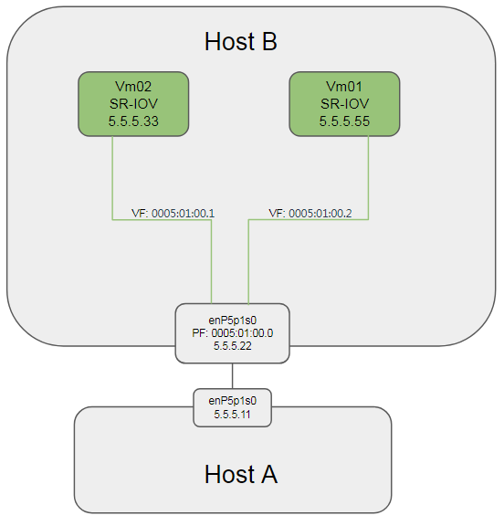

- [测试前准备](#测试前准备)
  - [服务器配置](#服务器配置)
  - [测试示意图](#测试示意图)
  - [测试前准备](#测试前准备-1)
    - [启动并配置OVS](#启动并配置ovs)
    - [创建并配置VM](#创建并配置vm)
- [5.4	网络虚拟化](#54网络虚拟化)
  - [5.4.1.1	OVS采用DPDK](#5411ovs采用dpdk)
    - [测试结果 -- PASS](#测试结果----pass)
  - [5.4.1.2	OVS支持numa感知](#5412ovs支持numa感知)
    - [测试结果 -- PASS](#测试结果----pass-1)
  - [5.4.2	支持SR-IOV网卡](#542支持sr-iov网卡)
    - [5.4.2.1	 SR-IOV链路状态感知测试](#5421-sr-iov链路状态感知测试)
      - [测试link up -- PASS](#测试link-up----pass)
      - [测试link down -- FAIL](#测试link-down----fail)
      - [Fail分析](#fail分析)
    - [5.4.2.2	Hypervisor允许只使用一对物理网口](#5422hypervisor允许只使用一对物理网口)
      - [测试结果 -- PASS](#测试结果----pass-2)
      - [issue讨论](#issue讨论)
    - [5.4.2.3	 SR-IOV与虚拟交换机互通](#5423-sr-iov与虚拟交换机互通)
      - [测试结果 -- 待澄清测试场景后测试](#测试结果----待澄清测试场景后测试)
  - [5.4.3	SR-IOV网卡的桥接功能](#543sr-iov网卡的桥接功能)
    - [测试结果 -- PASS](#测试结果----pass-3)
  - [5.4.4	支持vNIC多队列](#544支持vnic多队列)
    - [测试结果 -- PASS](#测试结果----pass-4)
  - [5.4.5	网络隔离与地址复用](#545网络隔离与地址复用)
    - [5.4.5.1	OVS 网络隔离与地址复用](#5451ovs-网络隔离与地址复用)
      - [测试结果 -- PASS](#测试结果----pass-5)
    - [5.4.5.2	SR-IOV 网络隔离与地址复用](#5452sr-iov-网络隔离与地址复用)
      - [测试结果 -- PASS](#测试结果----pass-6)
  - [5.4.6	MTU可调整](#546mtu可调整)
    - [5.4.6.1	OVS MTU可调整（vxlan网络只在SDN场景下测试）](#5461ovs-mtu可调整vxlan网络只在sdn场景下测试)
      - [测试结果 -- PASS](#测试结果----pass-7)
      - [疑问: dpdkp1的txq个数](#疑问-dpdkp1的txq个数)
    - [5.4.6.2	SR-IOV MTU可调整（vxlan网络只在SDN场景下测试）](#5462sr-iov-mtu可调整vxlan网络只在sdn场景下测试)
      - [测试结果 -- PASS](#测试结果----pass-8)
  - [5.4.7	支持VLAN透传](#547支持vlan透传)
    - [5.4.7.1	OVS 支持VLAN透传](#5471ovs-支持vlan透传)
      - [测试结果 -- PASS](#测试结果----pass-9)
    - [5.4.7.2	SR-IOV 支持VLAN透传](#5472sr-iov-支持vlan透传)
      - [测试结果 -- FAIL](#测试结果----fail)
      - [ToDo: 切换至OFED 4.4版本重新测试](#todo-切换至ofed-44版本重新测试)
  - [5.4.8	带宽分配比例设定](#548带宽分配比例设定)
    - [5.4.8.1	 OVS 支持带宽分配比例设定](#5481-ovs-支持带宽分配比例设定)
      - [测试结果 -- PASS](#测试结果----pass-10)
      - [问题: netperf over OVS-DPDK性能差](#问题-netperf-over-ovs-dpdk性能差)
    - [5.4.8.2	SR-IOV 支持带宽分配比例设定](#5482sr-iov-支持带宽分配比例设定)
      - [测试结果 -- PASS(to be clarified)](#测试结果----passto-be-clarified)
      - [如何实现调整带宽比例到150%或50%?](#如何实现调整带宽比例到150或50)
  - [5.4.9	支持组播](#549支持组播)
    - [5.4.9.1	OVS支持正确转发组播包](#5491ovs支持正确转发组播包)
      - [测试结果 -- PASS](#测试结果----pass-11)
    - [5.4.9.2	SR-IOV支持正确转发组播包](#5492sr-iov支持正确转发组播包)
      - [测试结果 -- PASS](#测试结果----pass-12)
- [7.3	虚拟层性能](#73虚拟层性能)
  - [7.3.5	网络转发性能](#735网络转发性能)
    - [7.3.5.1	基于10GE网卡的网络转发性能](#7351基于10ge网卡的网络转发性能)
  - [7.3.6	网络转发质量](#736网络转发质量)
    - [7.3.6.1	基于10GE网卡的网络转发质量](#7361基于10ge网卡的网络转发质量)
- [Troubleshooting](#troubleshooting)
  - [OVS异常重启导致vhostuser不通](#ovs异常重启导致vhostuser不通)
- [待解决问题](#待解决问题)
  - [netperf over OVS-DPDK性能差](#netperf-over-ovs-dpdk性能差)
  - [VM同时添加sriov和vhost-user导致OVS崩溃重启](#vm同时添加sriov和vhost-user导致ovs崩溃重启)

> 本文在HXT ARM服务器上做网络虚拟化的测试, 首先考察功能是否完备, 有无功能缺失和异常; 其次考察性能, 但不对比X86数据.

# 测试前准备
## 服务器配置
文中使用的HXT ARM服务器2台, 简称`Host A, Host B`信息如下:

| 服务器                 | Host A                  | Host B                  | Note                                     |
| ---------------------- | ----------------------- | ----------------------- | ---------------------------------------- |
| Socket                 | 1                       | 1                       | 单socket                                 |
| CPU                    | 46core@2.6G AW2542 v2.1 | 46core@2.6G AW2542 v2.1 | `sudo dmidecode -t processor`            |
| MEM                    | 96G                     | 96G                     | `free -h`                                |
| NIC                    | 2 * Mellanox ConnectX-4 | 2 * Mellanox ConnectX-4 | `lspci`                                  |
| OS                     | CentOS 7.5.1804         | CentOS 7.5.1804         | `cat /etc/redhat-release`                |
| kernel                 | 4.14.36-4.hxt.aarch64   | 4.14.36-4.hxt.aarch64   | `uname -r`                               |
| Mellanox OFED version  | 4.3-3.0.2               | 4.3-3.0.2               | `ethtool -i enP4p1s0`                    |
| QEMU version           | NA                      | 2.12                    | `qemu-system-aarch64 --version` 源码编译 |
| DPDK version           | hxt-dev-v17.08          | hxt-dev-v17.08          | 源码编译                                 |
| OVS(with DPDK) version | NA                      | 2.8.4                   | `sudo ovs-vsctl show` 源码编译           |
| libvirt version        | NA                      | 4.6.0                   | 源码编译                                 |
| virt-manager version   | NA                      | 1.5.1                   | 源码安装                                 |

> 对应测试编号`5.1.1 Hypervisor版本要求`
要求如下:
1.	Host OS的版本 ≥ 3.10.0
2.	kvm-qemu的版本 ≥ 2.3.0
3.	openvswitch ≥ 2.5.0
4.	dpdk的版本 ≥ 16.11.0

注: 如果没有特别说明, 测试均在Host B上执行

## 测试示意图
  

## 测试前准备
预置条件: DPDK, OVS, Qemu, libvirt, virt-manager已经成功编译安装
### 启动并配置OVS
| OVS选项           | 值             | 说明                            |
| ----------------- | -------------- | ------------------------------- |
| dpdk-init         | true           |
| bridge            | ovsbr0         |
| pmd-cpu-mask      | FF00000000     | 8个core 32 33 34 35 36 37 38 39 |
| dpdk-socket-mem   | 4096           | 单socket 4G                     |
| vhost-user port 0 | dpdkvhostuser0 | n_rxq=2                         |
| vhost-user port 1 | dpdkvhostuser1 | n_rxq=2                         |
```bash
export PATH=$PATH:/usr/local/share/openvswitch/scripts
sudo ovs-ctl start
#打开dpdk初始化
sudo ovs-vsctl --no-wait set Open_vSwitch . other_config:dpdk-init=true
#新增一个bridge, 使用用户态datapath模式
sudo ovs-vsctl add-br ovsbr0 -- set bridge ovsbr0 datapath_type=netdev
#配置pmd跑在8个核上, core 32 33 34 35 36 37 38 39
sudo ovs-vsctl set Open_vSwitch . other_config:pmd-cpu-mask=FF00000000
#配置使用node0的4G内存.
sudo ovs-vsctl --no-wait set Open_vSwitch . other_config:dpdk-socket-mem="4096"
#增加两个port, 类型是dpdkvhostuser
sudo ovs-vsctl add-port ovsbr0 dpdkvhostuser0 -- set Interface dpdkvhostuser0 type=dpdkvhostuser
sudo ovs-vsctl add-port ovsbr0 dpdkvhostuser1 -- set Interface dpdkvhostuser1 type=dpdkvhostuser
#配置多queue
sudo ovs-vsctl set Interface dpdkvhostuser0 options:n_rxq=2
sudo ovs-vsctl set Interface dpdkvhostuser1 options:n_rxq=2
```

### 创建并配置VM
预置条件: libvirtd已经成功启动
先用virt-manager创建2个VM, 配置如下:
| VM             | VM01                       | VM02                       |
| -------------- | -------------------------- | -------------------------- |
| CPUs           | 4                          | 4                          |
| Memory         | 8192M                      | 8192M                      |
| Disk           | hxt-centos7.5-01.qcow2 32G | hxt-centos7.5-02.qcow2 32G |
| NIC1(optional) | virtio(NAT to eth0)        | virtio(NAT to eth0)        |

NIC1是用来连接外网的, 还需要增加NIC2用来连接OVS的dpdkvhostuser port:
手工修改xml文件`virsh edit <VM>`, 适当增加如下修改:
```xml
  <memoryBacking>
    <hugepages>
      <page size='512' unit='M' nodeset='0'/>
    </hugepages>
    
  <cpu mode='host-passthrough' check='none'>
    <topology sockets='1' cores='4' threads='1'/>
    <numa>
      <cell id='0' cpus='0-3' memory='8388608' unit='KiB' memAccess='shared'/>
    </numa>
  </cpu>
    
  <os>
    <type arch='aarch64' machine='virt'>hvm</type>
    
  <devices>
    <emulator>/usr/local/bin/qemu-system-aarch64</emulator>
    <interface type='vhostuser'>
      <mac address='00:00:00:00:00:01'/>
      <source type='unix' path='/usr/local/var/run/openvswitch/dpdkvhostuser0' mode='client'/>
      <model type='virtio'/>
      <driver queues='2'>
        <host mrg_rxbuf='on'/>
      </driver>
    </interface>
```
* 另外一个VM也相应修改
* 需要提前配置hugetlbfs, CentOS上`dev-hugepages.mount`服务会默认开启, mount到`/dev/hugepages`
如果大页内存不足, 可以适当增加hugepage数目: `sudo bash -c "echo 64 > /sys/kernel/mm/hugepages/hugepages-524288kB/nr_hugepages"`

# 5.4	网络虚拟化
## 5.4.1.1	OVS采用DPDK
  
### 测试结果 -- PASS
启动VM, 验证连通性
配了IP后, 两个VM可以互相ping通
结果:
```bash
$ sudo ovs-vsctl show
f81a1c52-91c1-40a2-b993-6dfeea09317e
    Bridge "ovsbr0"
        Port "dpdkvhostuser0"
            Interface "dpdkvhostuser0"
                type: dpdkvhostuser
        Port "ovsbr0"
            Interface "ovsbr0"
                type: internal
        Port "dpdkvhostuser1"
            Interface "dpdkvhostuser1"
                type: dpdkvhostuser
    ovs_version: "2.8.4"
```
## 5.4.1.2	OVS支持numa感知
  
### 测试结果 -- PASS
```bash
$ sudo ovs-vsctl list Open_vSwitch | grep other_config
other_config        : {dpdk-init="true", dpdk-socket-mem="4096", pmd-cpu-mask="FF00000000"}
```
注: 本系统为单socket, 所以分配的CPU和Mem并不存在跨numa node问题

## 5.4.2	支持SR-IOV网卡
### 5.4.2.1	 SR-IOV链路状态感知测试
  
#### 测试link up -- PASS
本文使用PCI地址为`0005:01:00.0`的Mellanox物理网卡`enP5p1s0`做测试

```bash
#初始状态如下:
$ sudo ibdev2netdev -v
0004:01:00.0 mlx5_0 (MT4115 - MT1738K12272) CX413A - ConnectX-4 QSFP28 fw 12.22.1002 port 1 (ACTIVE) ==> enP4p1s0 (Up)
0005:01:00.0 mlx5_1 (MT4115 - MT1738K12253) CX413A - ConnectX-4 QSFP28 fw 12.22.1002 port 1 (ACTIVE) ==> enP5p1s0 (Up)

#新增2个sriov的VF, link状态为UP
$ sudo bash -c "echo 2 > /sys/class/net/enP5p1s0/device/sriov_numvfs"
$ sudo ibdev2netdev -v
0004:01:00.0 mlx5_0 (MT4115 - MT1738K12272) CX413A - ConnectX-4 QSFP28 fw 12.22.1002 port 1 (ACTIVE) ==> enP4p1s0 (Up)
0005:01:00.0 mlx5_1 (MT4115 - MT1738K12253) CX413A - ConnectX-4 QSFP28 fw 12.22.1002 port 1 (ACTIVE) ==> enP5p1s0 (Up)
0005:01:00.1 mlx5_2 (MT4116 - NA)  fw 12.22.1002 port 1 (ACTIVE) ==> enP5p1s0f1 (Up)
0005:01:00.2 mlx5_3 (MT4116 - NA)  fw 12.22.1002 port 1 (ACTIVE) ==> enP5p1s0f2 (Up)
```

使用virt-manager在vm01上添加PCI Host Device, 选择`0005:01:00:1`
在vm01上查看link状态为UP:
```bash
[root@localhost ~]# ip link show dev enp5s0
5: enp5s0: <BROADCAST,MULTICAST,UP,LOWER_UP> mtu 1500 qdisc mq state UP mode DEFAULT group default qlen 1000
    link/ether 26:35:26:59:32:b9 brd ff:ff:ff:ff:ff:ff
```
在host上, vf的link为auto
```bash
$ ip link show dev enP5p1s0
10: enP5p1s0: <BROADCAST,MULTICAST,UP,LOWER_UP> mtu 1500 qdisc mq state UP mode DEFAULT group default qlen 1000
    link/ether ec:0d:9a:89:4a:e6 brd ff:ff:ff:ff:ff:ff
    vf 0 MAC 00:00:00:00:00:00, spoof checking off, link-state auto, trust off, query_rss off
    vf 1 MAC 00:00:00:00:00:00, spoof checking off, link-state auto, trust off, query_rss off
```
#### 测试link down -- FAIL
在host上link down PF:
```bash
#down掉PF
$ sudo ip link set dev enP5p1s0 down
#vf的link为auto
$ ip link show dev enP5p1s0
10: enP5p1s0: <BROADCAST,MULTICAST> mtu 1500 qdisc mq state DOWN mode DEFAULT group default qlen 1000
    link/ether ec:0d:9a:89:4a:e6 brd ff:ff:ff:ff:ff:ff
    vf 0 MAC 00:00:00:00:00:00, spoof checking off, link-state auto, trust off, query_rss off
    vf 1 MAC 00:00:00:00:00:00, spoof checking off, link-state auto, trust off, query_rss off
```
在vm01上, link还是**UP**
```bash
[root@localhost ~]# ip link show dev enp5s0
5: enp5s0: <BROADCAST,MULTICAST,UP,LOWER_UP> mtu 1500 qdisc mq state UP mode DEFAULT group default qlen 1000
    link/ether 26:35:26:59:32:b9 brd ff:ff:ff:ff:ff:ff
```
#### Fail分析
结论: vm能够感知host上对vf的disable和enable操作, 但link-state为auto时, 不能感知PF的link状态.
VF的link-state有几种配置:
参考: https://docs.oracle.com/cd/E93554_01/E69348/html/uek4-net.html
> Support for SR-IOV VF link state control by using the ip command. Previously, VF links were always on, regardless of the physical link status, which allows VMs on the same virtual Ethernet bridge to communicate even if the physical function (PF) link state is down. However, if the VFs were bonded in active/standby mode, this configuration prevented failover when the physical link used by a VF went down. You can now use the ip link set command to configure the behavior of a VF link:
`# ip link set device vf number state { auto | enable | disable }`
The possible settings are:

> * auto
The VF link state is determined by the PF link state. This setting is suitable for VFs that are bonded in active/standby mode.
> * disable
The VF link state is permanently down.
> * enable
The VF link state is permanently up. This is the default setting.

如果在host上,配置vf的state为disable
```bash
#配置vf0的link-state为disable
$ sudo ip link set dev enP5p1s0 vf 0 state disable
$ ip link show dev enP5p1s0
10: enP5p1s0: <BROADCAST,MULTICAST> mtu 1500 qdisc mq state DOWN mode DEFAULT group default qlen 1000
    link/ether ec:0d:9a:89:4a:e6 brd ff:ff:ff:ff:ff:ff
    vf 0 MAC 00:00:00:00:00:00, spoof checking off, link-state disable, trust off, query_rss off
    vf 1 MAC 00:00:00:00:00:00, spoof checking off, link-state auto, trust off, query_rss off
```
此时vm01上, 有linkw down的提示, 并且显示link为DOWN
```bash
[root@localhost ~]# [ 2863.441859] mlx5_core 0000:05:00.0 enp5s0: Link down
[root@localhost ~]# ip link show dev enp5s0
5: enp5s0: <NO-CARRIER,BROADCAST,MULTICAST,UP> mtu 1500 qdisc mq state DOWN mode DEFAULT group default qlen 1000
    link/ether 26:35:26:59:32:b9 brd ff:ff:ff:ff:ff:ff
```
在host上把vf的state重新改为enable, vm01的能够感知并up.

### 5.4.2.2	Hypervisor允许只使用一对物理网口
  
#### 测试结果 -- PASS
在Host B上, vm01配成vhost-user, vm02配成sriov模式, 然后
```bash
#将enP5p1s0添加到ovsbr0
sudo ovs-vsctl add-port ovsbr0 enP5p1s0
$ sudo ovs-vsctl show
f81a1c52-91c1-40a2-b993-6dfeea09317e
    Bridge "ovsbr0"
        Port "enP5p1s0"
            Interface "enP5p1s0"
        Port "dpdkvhostuser0"
            Interface "dpdkvhostuser0"
                type: dpdkvhostuser
                options: {n_rxq="2"}
        Port "ovsbr0"
            Interface "ovsbr0"
                type: internal
        Port "dpdkvhostuser1"
            Interface "dpdkvhostuser1"
                type: dpdkvhostuser
                options: {n_rxq="2"}
    ovs_version: "2.8.4"
```
物理网卡以普通方式添加到OVS示意图:  
  

连通性:
| ping to        | 5.5.5.11(peer) | 5.5.5.22(host) | 5.5.5.33(VM02) | 5.5.5.44(VM01) |
| -------------- | -------------- | -------------- | -------------- | -------------- |
| 5.5.5.11(peer) | self           | Y              | Y              | Y              |
| 5.5.5.22(host) | Y              | self           | Y              | N              |
| 5.5.5.33(VM02) | Y              | Y              | self           | N              |
| 5.5.5.44(VM01) | Y              | N              | N              | self           |

即从外部(5.5.5.11)ping vm01(5.5.5.44)和vm02(5.5.5.33)能ping通.
#### issue讨论
* 22和44互相ping不通, 为什么?
答: 这是正常的. 在userspace datapath(datapath_type=netdev)模式下, ovs通过`socket(AF_PACKET, SOCK_RAW, 0)`发包, 不走ip协议栈. 
ToDo: 验证一下内核datapath模式下, 本机物理网口和vm之间的连通性.
* 如何理解物理网卡被add到OVS上(非DPDK方式)? 如果是DPDK方式呢?
    - DPDK方式
```bash
#删掉接口enP5p1s0
sudo ovs-vsctl del-port ovsbr0 enP5p1s0
#以dpdk方式添加到ovsvr0
sudo ovs-vsctl add-port ovsbr0 dpdkp1 -- set Interface dpdkp1 type=dpdk options:dpdk-devargs=0005:01:00.0
sudo ovs-vsctl set Interface dpdkp1 options:n_rxq=2	
$ sudo ovs-vsctl show
f81a1c52-91c1-40a2-b993-6dfeea09317e
    Bridge "ovsbr0"
        Port "dpdkvhostuser0"
            Interface "dpdkvhostuser0"
                type: dpdkvhostuser
                options: {n_rxq="2"}
        Port "ovsbr0"
            Interface "ovsbr0"
                type: internal
        Port "dpdkp1"
            Interface "dpdkp1"
                type: dpdk
                options: {dpdk-devargs="0005:01:00.0", n_rxq="2"}
        Port "dpdkvhostuser1"
            Interface "dpdkvhostuser1"
                type: dpdkvhostuser
                options: {n_rxq="2"}
    ovs_version: "2.8.4"
```
物理网卡以DPDK方式添加到OVS
  

连通性: 和之前相比, 到5.5.5.22的报文都不通. 说明OVS-DPDK的PMD完全把enP5p1s0接管了.
| ping to  | 5.5.5.11 | 5.5.5.22 | 5.5.5.33 | 5.5.5.44 |
| -------- | -------- | -------- | -------- | -------- |
| 5.5.5.11 | self     | **N**    | Y        | Y        |
| 5.5.5.22 | **N**    | self     | **N**    | **N**    |
| 5.5.5.33 | Y        | **N**    | self     | N        |
| 5.5.5.44 | Y        | N        | N        | self     |

### 5.4.2.3	 SR-IOV与虚拟交换机互通
  
根据上个测试用例, vm02(sr-iov port)和vm01(ovs port)是不通的.vm01发出的ping报文, 直接走Host B网卡的PF wire到Host A; vm02发出的ping报文也直接通过网卡的VF到Host A.
如果将vm02移至Host A上运行, 则理论上能够ping通(待测试).
#### 测试结果 -- 待澄清测试场景后测试

## 5.4.3	SR-IOV网卡的桥接功能
  
配置两个vm都使用sriov, 并分别配置同网段ip.
  
### 测试结果 -- PASS
物理网卡(Mellanox ConnectX-4)默认桥接VF. 两个VM能够互相ping通. 在对端(Host A)上抓包, 没有相关的 ICMP报文.

## 5.4.4	支持vNIC多队列
  
在<测试前准备>小节中, OVS和VM的接口dpdkvhostuser已经配置了multi queue(2个); VM也配置了2个queue
在Host B上有:
```bash
$ sudo ovs-appctl dpif/show
netdev@ovs-netdev: hit:458 missed:71
        ovsbr0:
                dpdkvhostuser0 2/3: (dpdkvhostuser: configured_rx_queues=2, configured_tx_queues=2, mtu=1500, requested_rx_queues=2, requested_tx_queues=2)
                dpdkvhostuser1 1/2: (dpdkvhostuser: configured_rx_queues=2, configured_tx_queues=2, mtu=1500, requested_rx_queues=2, requested_tx_queues=2)
                ovsbr0 65534/1: (tap)
```
在VM里面有:
```bash
[root@localhost ~]# ethtool -l eth1
Channel parameters for eth1:
Pre-set maximums:
RX:		0
TX:		0
Other:		0
Combined:	2
Current hardware settings:
RX:		0
TX:		0
Other:		0
Combined:	2
```
在VM里面, 分别配置2对IP: vm01(5.5.5.51, 6.6.6.61), vm02(5.5.5.52, 6.6.6.62)  
  

### 测试结果 -- PASS
2对IP能够分别ping通. `cat /proc/interrupts`看到virtio中断在4个CPU的2个上有中断; `tc`看到2个发送队列都有发包统计.
```bash
[root@localhost ~]# tc -s class show dev eth1
class mq :1 root 
 Sent 7706 bytes 79 pkt (dropped 0, overlimits 0 requeues 0) 
 backlog 0b 0p requeues 0 
class mq :2 root 
 Sent 20222 bytes 183 pkt (dropped 0, overlimits 0 requeues 0) 
 backlog 0b 0p requeues 0 
```

## 5.4.5	网络隔离与地址复用
### 5.4.5.1	OVS 网络隔离与地址复用
  
前面已经验证了连通性, 下面只验证隔离性.
新增ovsbr1, 并在ovsbr1上增加dpdkvhostuser类型的port:dpdkvhostuser2, 并把dpdkvhostuser2挂到VM02上
```bash
sudo ovs-vsctl add-br ovsbr1 -- set bridge ovsbr1 datapath_type=netdev
sudo ovs-vsctl add-port ovsbr1 dpdkvhostuser2 -- set Interface dpdkvhostuser2 type=dpdkvhostuser
$ sudo ovs-appctl dpif/show
netdev@ovs-netdev: hit:481 missed:89
        ovsbr0:
                dpdkvhostuser0 2/3: (dpdkvhostuser: configured_rx_queues=2, configured_tx_queues=2, mtu=1500, requested_rx_queues=2, requested_tx_queues=2)
                dpdkvhostuser1 1/2: (dpdkvhostuser: configured_rx_queues=2, configured_tx_queues=2, mtu=1500, requested_rx_queues=2, requested_tx_queues=2)
                ovsbr0 65534/1: (tap)
        ovsbr1:
                dpdkvhostuser2 1/5: (dpdkvhostuser: configured_rx_queues=1, configured_tx_queues=1, mtu=1500, requested_rx_queues=1, requested_tx_queues=1)
                ovsbr1 65534/4: (tap)
```
在VM02上配置IP, 和VM01同网段, 但并不是一个ovs bridge.  
  
#### 测试结果 -- PASS
VM02 ping不通VM01

### 5.4.5.2	SR-IOV 网络隔离与地址复用
  
前面已经验证过, 两个VM分别连同一个PF的两个VF, 默认能够ping通.
下面修改VF的vlan
```bash
sudo ip link set dev enP5p1s0 vf 0 vlan 100
sudo ip link set dev enP5p1s0 vf 1 vlan 101
```
#### 测试结果 -- PASS
修改后, 两个VF分别属于vlan100和vlan101, 互相ping不通.
```bash
$ ip link show dev enP5p1s0
10: enP5p1s0: <BROADCAST,MULTICAST,PROMISC,UP,LOWER_UP> mtu 1500 qdisc mq state UP mode DEFAULT group default qlen 1000
    link/ether ec:0d:9a:89:4a:e6 brd ff:ff:ff:ff:ff:ff
    vf 0 MAC 00:00:00:00:00:00, vlan 100, spoof checking off, link-state enable, trust off, query_rss off
    vf 1 MAC 00:00:00:00:00:00, vlan 101, spoof checking off, link-state auto, trust off, query_rss off
```

## 5.4.6	MTU可调整
### 5.4.6.1	OVS MTU可调整（vxlan网络只在SDN场景下测试）
  
在<启动并配置OVS>小节配置的基础上, 在OVS上添加物理网卡:
```bash
#添加业务物理口, type=DPDK
$ sudo ovs-vsctl add-port ovsbr0 dpdkp1 -- set Interface dpdkp1 type=dpdk options:dpdk-devargs=0005:01:00.0
#设置该物理口的q为2
$ sudo ovs-vsctl set Interface dpdkp1 options:n_rxq=2
#此时OVS配置如下:
$ sudo ovs-vsctl show
f81a1c52-91c1-40a2-b993-6dfeea09317e
    Bridge "ovsbr0"
        Port "dpdkp1"
            Interface "dpdkp1"
                type: dpdk
                options: {dpdk-devargs="0005:01:00.0", n_rxq="2"}
        Port "dpdkvhostuser0"
            Interface "dpdkvhostuser0"
                type: dpdkvhostuser
                options: {n_rxq="2"}
        Port "ovsbr0"
            Interface "ovsbr0"
                type: internal
        Port "dpdkvhostuser1"
            Interface "dpdkvhostuser1"
                type: dpdkvhostuser
                options: {n_rxq="2"}
    ovs_version: "2.8.4"
#默认的mtu为1500
$ sudo ovs-appctl dpctl/show
netdev@ovs-netdev:
        lookups: hit:8 missed:17 lost:4
        flows: 0
        port 0: ovs-netdev (tap)
        port 1: ovsbr0 (tap)
        port 2: dpdkvhostuser1 (dpdkvhostuser: configured_rx_queues=1, configured_tx_queues=1, mtu=1500, requested_rx_queues=1, requested_tx_queues=1)
        port 3: dpdkvhostuser0 (dpdkvhostuser: configured_rx_queues=1, configured_tx_queues=1, mtu=1500, requested_rx_queues=1, requested_tx_queues=1)
        port 4: dpdkp1 (dpdk: configured_rx_queues=2, configured_rxq_descriptors=2048, configured_tx_queues=9, configured_txq_descriptors=2048, lsc_interrupt_mode=false, mtu=1500, requested_rx_queues=2, requested_rxq_descriptors=2048, requested_tx_queues=9, requested_txq_descriptors=2048, rx_csum_offload=true)
```
根据用例, 这里验证修改OVS的mtu是否有效:
修改bridge的MTU到4000
```
sudo ovs-vsctl set Interface ovsbr0 mtu_request=4000
sudo ovs-vsctl set Interface dpdkp1 mtu_request=4000
sudo ovs-vsctl set Interface dpdkvhostuser0 mtu_request=4000
sudo ovs-vsctl set Interface dpdkvhostuser1 mtu_request=4000
```
分别修改VM01和VM02的MTU到4000
```
ip link set dev eth1 mtu 4000
```
#### 测试结果 -- PASS
VM01和VM02互相ping, 小于4000的报文能ping通, 大于4000的ping不通. 说明修改OVS的mtu有效.

#### 疑问: dpdkp1的txq个数
上面`sudo ovs-appctl dpctl/show`显示: `configured_rx_queues=2, configured_tx_queues=9`, 为什么txq的个数是9?
参考: http://docs.openvswitch.org/en/latest/topics/dpdk/pmd/

### 5.4.6.2	SR-IOV MTU可调整（vxlan网络只在SDN场景下测试）
  
根据要求, 先设置物理网卡的mtu
```bash
sudo ip link set dev enP5p1s0 mtu 4000
```
#### 测试结果 -- PASS
VM的mtu默认值还是1500, ping报文大小为2048时ping不通.
修改vm的mtu为4000, `ping -s 2048 -M do 5.5.5.22`可以ping通.
修改host和vm的mtu为9000, 小于(9000-28)字节的报文可以ping通.

## 5.4.7	支持VLAN透传
### 5.4.7.1	OVS 支持VLAN透传
  
测试示意图:  
  
在Host B上:
```bash
#将两个VM对应的port加入vlan 100(外层 vlan), 并配置cvlan(内层 vlan)为0和10
sudo ovs-vsctl set port dpdkvhostuser0 vlan_mode=dot1q-tunnel tag=100 cvlans=0,10 other-config:qinq-ethtype=802.1q
sudo ovs-vsctl set port dpdkvhostuser1 vlan_mode=dot1q-tunnel tag=100 cvlans=0,10 other-config:qinq-ethtype=802.1q
#将物理网卡加入vlan 100, native-tagged是说出端口带tag, 详见ofproto/ofproto.h
sudo ovs-vsctl set port dpdkp1 vlan_mode=native-tagged tag=100 other-config:qinq-ethtype=802.1q
```
在VM01上
```bash
#配置vm01的接口IP为192.168.1.100
ip addr add 192.168.1.100/24 dev eth1
#增加vlan 10
ip link add link eth1 name eth1.10 type vlan id 10
#给vlan 10子接口配置IP
ip addr add 192.168.10.100/24 dev eth1.10
ip link set up dev eth1.10
```
在VM02上
```bash
#配置vm01的接口IP为192.168.1.200
ip addr add 192.168.1.200/24 dev eth1
#增加vlan 10
ip link add link eth1 name eth1.10 type vlan id 10
#给vlan 10子接口配置IP
ip addr add 192.168.10.200/24 dev eth1.10
ip link set up dev eth1.10
```
#### 测试结果 -- PASS
- VM01在192.168.1.0和192.168.10.0网段分别ping VM02, 可以ping通.
- 在对端(Host A)上抓包, ping 192.168.1.101时有单层vlan tag, id为100
```
18:02:10.058754 ARP, Ethernet (len 6), IPv4 (len 4), Request who-has 192.168.1.101 tell 192.168.1.200, length 42
        0x0000:  ffff ffff ffff 5254 00f0 25e4 8100 0064  ......RT..%....d
        0x0010:  0806 0001 0800 0604 0001 5254 00f0 25e4  ..........RT..%.
        0x0020:  c0a8 01c8 0000 0000 0000 c0a8 0165 0000  .............e..
        0x0030:  0000 0000 0000 0000 0000 0000   
```
- 在对端(Host A)上抓包, ping 192.168.10.101时有双层vlan tag, 外层为100, 内层为10
```
18:04:39.898836 ARP, Ethernet (len 6), IPv4 (len 4), Request who-has 192.168.10.101 tell 192.168.10.200, length 38
        0x0000:  ffff ffff ffff 5254 00f0 25e4 8100 0064  ......RT..%....d
        0x0010:  8100 000a 0806 0001 0800 0604 0001 5254  ..............RT
        0x0020:  00f0 25e4 c0a8 0ac8 0000 0000 0000 c0a8  ..%.............
        0x0030:  0a65 0000 0000 0000 0000 0000            .e..........
```

### 5.4.7.2	SR-IOV 支持VLAN透传
  
```bash
#给每个VF设置vlan tag
sudo ip link set dev enP5p1s0 vf 0 vlan 100
sudo ip link set dev enP5p1s0 vf 1 vlan 100
```
在VM01上
```bash
#配置vm01的接口IP为5.5.5.100
ip addr add 5.5.5.100/24 dev enp4s0
#增加vlan 10
ip link add link enp4s0 name enp4s0.10 type vlan id 10
#给vlan 10子接口配置IP
ip addr add 5.5.10.100/24 dev enp4s0.10
ip link set up dev enp4s0.10
```
在VM02上
```bash
#配置vm01的接口IP为5.5.5.200
ip addr add 5.5.5.200/24 dev enp4s0
#增加vlan 10
ip link add link enp4s0 name enp4s0.10 type vlan id 10
#给vlan 10子接口配置IP
ip addr add 5.5.10.200/24 dev enp4s0.10
ip link set up dev enp4s0.10
```

  

#### 测试结果 -- FAIL
VM01和VM02用enp4s0.10互相ping, 不通

注: 本文使用Mellanox ConnectX-4, 在OFED 4.3-3.0.2版本中, 其用户手册明确说明ConnectX-4不支持QinQ.
在OFED 4.4版本中, 新增了ConnectX-4的QinQ支持.
#### ToDo: 切换至OFED 4.4版本重新测试

## 5.4.8	带宽分配比例设定
### 5.4.8.1	 OVS 支持带宽分配比例设定
  
主要考察OVS能否对物理网卡进行带宽限制, 这里做一下简化如下图:  
  
Host A和Host B上的VM01做iperf测试带宽, 不设置带宽比例时:
性能在`10.3 Gbits/sec`, 主要瓶颈点在Host A上的kernel协议栈, 以及VM01上的kernel协议栈.
```
[  4]  15.00-16.00  sec   718 MBytes  6.02 Gbits/sec  7267   1024 KBytes
[  6]  15.00-16.00  sec   366 MBytes  3.07 Gbits/sec  6713   76.4 KBytes
[  8]  15.00-16.00  sec  30.0 MBytes   252 Mbits/sec  1281   90.5 KBytes
[ 10]  15.00-16.00  sec   110 MBytes   923 Mbits/sec  2711    139 KBytes
[SUM]  15.00-16.00  sec  1.20 GBytes  10.3 Gbits/sec  17972
```
对Host B上的OVS-DPDK做带宽限制, 主要限制对接物理网卡`enP5p1s0`对应的port `dpdkp1`

- Egress
在Host B上:
```bash
#限制dpdkp1的出口速率为5G bps, cir的单位为Bps
sudo ovs-vsctl set port dpdkp1 qos=@newqos -- --id=@newqos create qos type=egress-policer other-config:cir=625000000 other-config:cbs=2048
```
- Ingress
```bash
#限制入口速率5G bps, ingress_policing_rate单位为k bps
$ sudo ovs-vsctl set interface dpdkp1 ingress_policing_rate=5000000
$ sudo ovs-vsctl set interface dpdkp1 ingress_policing_burst=500000
```

#### 测试结果 -- PASS
配置带宽限制后, 再次用iperf测试, 结果为`4.85 Gbits/sec`
```bash
[  4]   5.00-6.00   sec   259 MBytes  2.17 Gbits/sec  8313    264 KBytes
[  6]   5.00-6.00   sec  53.8 MBytes   451 Mbits/sec  2579   11.3 KBytes
[  8]   5.00-6.00   sec   154 MBytes  1.29 Gbits/sec  2293   91.9 KBytes
[ 10]   5.00-6.00   sec   112 MBytes   944 Mbits/sec  1467    591 KBytes
[SUM]   5.00-6.00   sec   579 MBytes  4.85 Gbits/sec  14652
```
#### 问题: netperf over OVS-DPDK性能差
netperf是单进程应用, traffic通过OVS-DPDK后, 相比两个物理机直连, 性能下降很多;
下面是各种场景下的性能数据:
| 测试类型                       | Throughput(min) GBytes  /s | Throughput(max) GBytes  /s |
| ------------------------------ | -------------------------- | -------------------------- |
| 两个物理网卡直连               | 1.27                       | 3.23                       |
| 物理网卡到VM                   | 0.37                       | 0.71                       |
| VM02到VM01过OVS-DPDK           | 0.26                       | 0.33                       |
| VM02到VM01过OVS-DPDK with flow | 0.25                       | 0.26                       |
| VM02到VM01过linux bridge       | 2.17                       | 2.84                       |

初步结论: **OVS-DPDK是瓶颈**, rxq个数不够? descriptor个数不够? critical path代码问题?
--配flow, 配mac学习 --貌似不行
> 我以前也对比测过，大概是这原因，如果把bridge的tso/csum关闭，测出的数据和ovs-dpdk是差不多的。
1. for bridge mode, the VM's virtio nic was enabled tso/csum defaultly 			
2. for OVS-dpdk, the VM's virtio nic cannot enable tso/csum, although DPDK vhost lib can support tso etc.
Already has a Patch for OVS2.6.1 to support TSO, but this patch is not intended for upstreaming.	
see :https://mail.openvswitch.org/pipermail/ovs-dev/2016-June/316414.html		
        https://lists.linux-foundation.org/pipermail/ovs-dev/2017-April/330703.html

OVS模式下VM的offload功能
```
[root@localhost ~]# ethtool -k eth1
Features for eth1:
rx-checksumming: on [fixed]
tx-checksumming: off
	tx-checksum-ipv4: off [fixed]
	tx-checksum-ip-generic: off [fixed]
	tx-checksum-ipv6: off [fixed]
	tx-checksum-fcoe-crc: off [fixed]
	tx-checksum-sctp: off [fixed]
scatter-gather: off
	tx-scatter-gather: off [fixed]
	tx-scatter-gather-fraglist: off [fixed]
tcp-segmentation-offload: off
	tx-tcp-segmentation: off [fixed]
	tx-tcp-ecn-segmentation: off [fixed]
	tx-tcp-mangleid-segmentation: off [fixed]
	tx-tcp6-segmentation: off [fixed]
udp-fragmentation-offload: off
generic-segmentation-offload: off [requested on]
generic-receive-offload: on
large-receive-offload: off [fixed]
rx-vlan-offload: off [fixed]
tx-vlan-offload: off [fixed]
ntuple-filters: off [fixed]
receive-hashing: off [fixed]
highdma: on [fixed]
rx-vlan-filter: on [fixed]
vlan-challenged: off [fixed]
tx-lockless: off [fixed]
netns-local: off [fixed]
tx-gso-robust: off [fixed]
tx-fcoe-segmentation: off [fixed]
tx-gre-segmentation: off [fixed]
tx-gre-csum-segmentation: off [fixed]
tx-ipxip4-segmentation: off [fixed]
tx-ipxip6-segmentation: off [fixed]
tx-udp_tnl-segmentation: off [fixed]
tx-udp_tnl-csum-segmentation: off [fixed]
tx-gso-partial: off [fixed]
tx-sctp-segmentation: off [fixed]
tx-esp-segmentation: off [fixed]
fcoe-mtu: off [fixed]
tx-nocache-copy: off
loopback: off [fixed]
rx-fcs: off [fixed]
rx-all: off [fixed]
tx-vlan-stag-hw-insert: off [fixed]
rx-vlan-stag-hw-parse: off [fixed]
rx-vlan-stag-filter: off [fixed]
l2-fwd-offload: off [fixed]
hw-tc-offload: off [fixed]
esp-hw-offload: off [fixed]
esp-tx-csum-hw-offload: off [fixed]
rx-udp_tunnel-port-offload: off [fixed]
```

Linux bridge模式下的offload功能:
```
[root@localhost ~]# ethtool -k eth0
Features for eth0:
rx-checksumming: on [fixed]
tx-checksumming: on
	tx-checksum-ipv4: off [fixed]
	tx-checksum-ip-generic: on
	tx-checksum-ipv6: off [fixed]
	tx-checksum-fcoe-crc: off [fixed]
	tx-checksum-sctp: off [fixed]
scatter-gather: on
	tx-scatter-gather: on
	tx-scatter-gather-fraglist: off [fixed]
tcp-segmentation-offload: on
	tx-tcp-segmentation: on
	tx-tcp-ecn-segmentation: on
	tx-tcp-mangleid-segmentation: off
	tx-tcp6-segmentation: on
udp-fragmentation-offload: off
generic-segmentation-offload: on
generic-receive-offload: on
large-receive-offload: off [fixed]
rx-vlan-offload: off [fixed]
tx-vlan-offload: off [fixed]
ntuple-filters: off [fixed]
receive-hashing: off [fixed]
highdma: on [fixed]
rx-vlan-filter: on [fixed]
vlan-challenged: off [fixed]
tx-lockless: off [fixed]
netns-local: off [fixed]
tx-gso-robust: on [fixed]
tx-fcoe-segmentation: off [fixed]
tx-gre-segmentation: off [fixed]
tx-gre-csum-segmentation: off [fixed]
tx-ipxip4-segmentation: off [fixed]
tx-ipxip6-segmentation: off [fixed]
tx-udp_tnl-segmentation: off [fixed]
tx-udp_tnl-csum-segmentation: off [fixed]
tx-gso-partial: off [fixed]
tx-sctp-segmentation: off [fixed]
tx-esp-segmentation: off [fixed]
fcoe-mtu: off [fixed]
tx-nocache-copy: off
loopback: off [fixed]
rx-fcs: off [fixed]
rx-all: off [fixed]
tx-vlan-stag-hw-insert: off [fixed]
rx-vlan-stag-hw-parse: off [fixed]
rx-vlan-stag-filter: off [fixed]
l2-fwd-offload: off [fixed]
hw-tc-offload: off [fixed]
esp-hw-offload: off [fixed]
esp-tx-csum-hw-offload: off [fixed]
rx-udp_tunnel-port-offload: off [fixed]
```

测试类型:
```bash
#两个物理网卡直连
HostA(enP4p1s0) <--> HostB(enP4p1s0)

#物理网卡到VM
HostA         HostB                                                   VM01
enP5p1s0 <--> enP5p1s0 <--> (dpdk@2rxq)OVS-DPDK(vhost-user@2rxq) <--> eth1(virtio)

#VM02到VM01过OVS-DPDK
VM02(eth1-virtio) <--> (vhost-user@2rxq)OVS-DPDK(vhost-user@2rxq) <--> VM01(eth1-virtio)

#VM02到VM01过OVS-DPDK with flow
VM02(eth1-virtio) <--> (vhost-user@2rxq)OVS-DPDK(vhost-user@2rxq) <--> VM01(eth1-virtio)

#VM02到VM01过linux bridge
VM02(eth1-virtio) <--> (tap)linux bridge(tap) <--> VM01(eth1-virtio)
```

注: netperf带宽波动很大, 这里取5次测试结果的最大最小值

参考命令:
在server上:
```bash
cd netperf-master/src
./netserver
```
在client上:
```bash
cd netperf-master/src
./netperf -H 5.5.5.51 -l 30 -cC -fG
```

在HostB上配flow
```bash
#从vhostuser0到vhostuser1
sudo ovs-vsctl set interface dpdkp1 ofport_request=1
sudo ovs-vsctl set interface "dpdkvhostuser0" ofport_request=2
sudo ovs-vsctl set interface "dpdkvhostuser1" ofport_request=3
sudo ovs-ofctl add-flow ovsbr0 in_port=2,action=output:3
sudo ovs-ofctl add-flow ovsbr0 in_port=3,action=output:2
#查现有flow
$ sudo ovs-ofctl dump-flows ovsbr0
 cookie=0x0, duration=525.681s, table=0, n_packets=0, n_bytes=0, in_port=dpdkvhostuser0 actions=output:dpdkvhostuser1
 cookie=0x0, duration=517.418s, table=0, n_packets=0, n_bytes=0, in_port=dpdkvhostuser1 actions=output:dpdkvhostuser0
 cookie=0x0, duration=64912.051s, table=0, n_packets=262755553, n_bytes=364138797710, priority=0 actions=NORMAL
#清除所有flow
sudo ovs-ofctl del-flows ovsbr0
#清除flow后加回默认flow, 否则端口都不通
sudo ovs-ofctl add-flow ovsbr0 actions=NORMAL
```

### 5.4.8.2	SR-IOV 支持带宽分配比例设定
  
将用例描述的测试场景分解: 用限制SRIOV网卡的VF `max_tx_rate`来测试
但只能配置tx_rate, 对rx并没有限制
参考: https://community.mellanox.com/docs/DOC-2565
```bash
#在Host B上的两个Mellanox Connect-4物理网卡上, 打开SR-IOV, VF数目分别是2
sudo bash -c "echo 2 > /sys/class/net/enP4p1s0/device/sriov_numvfs"
sudo bash -c "echo 2 > /sys/class/net/enP5p1s0/device/sriov_numvfs"
#物理网卡实际link速率为56000Mb/s
#使vf 0为30G, vf 1为40G
#对应用例要求的port1, 对应VM01
sudo ip link set dev enP4p1s0 vf 0 max_tx_rate 30000 min_tx_rate 25000
#对应用例要求的port3, 对应VM02
sudo ip link set dev enP4p1s0 vf 1 max_tx_rate 40000 min_tx_rate 35000
#对应用例要求的port2, 对应VM01
sudo ip link set dev enP5p1s0 vf 0 max_tx_rate 30000 min_tx_rate 25000
#对应用例要求的port4, 对应VM02
sudo ip link set dev enP5p1s0 vf 1 max_tx_rate 40000 min_tx_rate 35000
#配置好以后的状态: 
$ ip link show dev enP4p1s0; ip link show dev enP5p1s0
9: enP4p1s0: <BROADCAST,MULTICAST,UP,LOWER_UP> mtu 1500 qdisc mq state UP mode DEFAULT group default qlen 1000
    link/ether ec:0d:9a:89:4c:36 brd ff:ff:ff:ff:ff:ff
    vf 0 MAC 00:00:00:00:00:00, tx rate 30000 (Mbps), max_tx_rate 30000Mbps, min_tx_rate 25000Mbps, spoof checking off, link-state auto, trust off, query_rss off
    vf 1 MAC 00:00:00:00:00:00, tx rate 40000 (Mbps), max_tx_rate 40000Mbps, min_tx_rate 35000Mbps, spoof checking off, link-state auto, trust off, query_rss off
10: enP5p1s0: <BROADCAST,MULTICAST,UP,LOWER_UP> mtu 1500 qdisc mq state UP mode DEFAULT group default qlen 1000
    link/ether ec:0d:9a:89:4a:e6 brd ff:ff:ff:ff:ff:ff
    vf 0 MAC 00:00:00:00:00:00, tx rate 30000 (Mbps), max_tx_rate 30000Mbps, min_tx_rate 25000Mbps, spoof checking off, link-state auto, trust off, query_rss off
    vf 1 MAC 00:00:00:00:00:00, tx rate 40000 (Mbps), max_tx_rate 40000Mbps, min_tx_rate 35000Mbps, spoof checking off, link-state auto, trust off, query_rss off
```
| VM   | interface | VF@设定tx_rate | PF@实际rate  |
| ---- | --------- | -------------- | ------------ |
| VM01 | enp4s0    | 0@tx30G        | enP5p1s0@56G |
| VM01 | enp5s0    | 0@tx30G        | enP4p1s0@56G |
| VM02 | enp4s0    | 1@tx40G        | enP5p1s0@56G |
| VM02 | enp5s0    | 1@tx40G        | enP4p1s0@56G |

配置VM如下: 分别添加Host PCI设备到VM  
  

#### 测试结果 -- PASS(to be clarified)
- 两个VM成功启动
- 最大带宽测试结果
在mtu为默认1500时, 文中4核VM并不能达到40G线速; 故这里在两个VM上分别修改接口的mtu为9000
在两个VM上:
```bash
#MTU增大到9000
ip link set dev enp4s0 mtu 9000
#server端
iperf -s
#client端, 用4个线程打满带宽
iperf -c 2.2.2.1 -i 1 -t 360 -l 128K -P 4
```
| Server | Client | 理论带宽(VF tx_rate) | 实际带宽 | 所属PF |
| ------ | ------ | -------------------- | -------- | ------ |
| VM01   | VM02   | 40 G                 | 39.4 G   | enp5s0 |
| VM02   | VM01   | 30 G                 | 29.7 G   | enp5s0 |

#### 如何实现调整带宽比例到150%或50%?

## 5.4.9	支持组播
### 5.4.9.1	OVS支持正确转发组播包
  
参考下图配置:  
  
在两个VM上
```bash
# 查看多播地址
[root@localhost ~]# ip maddr show dev eth1
4:	eth1
	link  01:00:5e:00:00:01
	link  33:33:00:00:00:01
	link  33:33:ff:c0:69:37
	inet  224.0.0.1
	inet6 ff02::1:ffc0:6937
	inet6 ff02::1
	inet6 ff01::1

# VF有两个方法能够收到未知多播, promiscuous和allmulticast, 这里使用后者
ip link set dev eth1 allmulticast on
```
在Host A上, 运行pktgen, 构造ip和mac
```bash
#启动pktgen, rx用core42,tx用core43, core41为显示和timer
sudo app/arm64-armv8a-linuxapp-gcc/pktgen -l 41-45 -w 0005:01:00.0 -- -T -P -m "[42:43].0"
#配目的IP(组播IP)
Pktgen:/> set 0 dst ip 224.0.0.1
#改变目的组播IP
Pktgen:/> set 0 dst ip 225.0.0.1
#配目的mac(组播MAC)
Pktgen:/> set 0 dst mac 01:00:5e:00:00:01
#配目的组播mac
Pktgen:/> set 0 dst mac 01:00:5e:00:00:02
#设置发包速率为1%, 太大会丢包
Pktgen:/> set 0 rate 1
#开始发送
Pktgen:/> start all
#停止发送
Pktgen:/> stop all
```
发送中在VM01和VM02上抓包
```bash
[root@localhost ~]# tcpdump -i eth1 -vvnnXX
12:45:39.316576 IP (tos 0x0, ttl 4, id 52062, offset 0, flags [none], proto TCP (6), length 46)
    192.168.0.1.1234 > 224.0.0.1.5678: Flags [.], cksum 0xe18e (correct), seq 0:6, ack 1, win 8192, length 6
	0x0000:  0100 5e00 0001 248a 07b5 7070 0800 4500  ..^...$...pp..E.
	0x0010:  002e cb5e 0000 0406 4ac1 c0a8 0001 e000  ...^....J.......
	0x0020:  0001 04d2 162e 1234 5678 1234 5690 5010  .......4Vx.4V.P.
	0x0030:  2000 e18e 0000 7778 797a 3031            ......wxyz01
12:45:39.331109 IP (tos 0x0, ttl 4, id 49983, offset 0, flags [none], proto TCP (6), length 46)
    192.168.0.1.1234 > 224.0.0.1.5678: Flags [.], cksum 0xe18e (correct), seq 0:6, ack 1, win 8192, length 6
	0x0000:  0100 5e00 0001 248a 07b5 7070 0800 4500  ..^...$...pp..E.
	0x0010:  002e c33f 0000 0406 52e0 c0a8 0001 e000  ...?....R.......
	0x0020:  0001 04d2 162e 1234 5678 1234 5690 5010  .......4Vx.4V.P.
	0x0030:  2000 e18e 0000 7778 797a 3031            ......wxyz01
```

#### 测试结果 -- PASS
| 多播dst IP / MAC              | VM01 是否收到 | VM02 是否收到 |
| ----------------------------- | ------------- | ------------- |
| 224.0.0.1 / 01:00:5e:00:00:01 | 是            | 是            |
| 225.0.0.2 / 01:00:5e:00:00:02 | 是            | 是            |

### 5.4.9.2	SR-IOV支持正确转发组播包
  
配置连个SR-IOV模式的VM01和VM02.

两个VM都默认有多播IP`224.0.0.1`和MAC`01:00:5e:00:00:01`
```
[root@localhost ~]# ip maddr show dev enp4s0
4:	enp4s0
	link  01:00:5e:00:00:01
	link  33:33:00:00:00:01
	inet  224.0.0.1
	inet6 ff02::1
	inet6 ff01::1
```
  

参考: https://community.mellanox.com/docs/DOC-2473
为了能使VM收到未知组播, 在Host B上:
```bash
#使能vf的trust
sudo ip link set enP5p1s0 vf 0 trust on
sudo ip link set enP5p1s0 vf 1 trust on
```
在两个VM上:
```
#VF有两个方法能够收到未知多播, promiscuous和allmulticast, 这里使用后者
ip link set dev enp4s0 allmulticast on
```
在Host A上, 运行pktgen, 构造ip和mac
```bash
#启动pktgen, rx用core42,tx用core43, core41为显示和timer
sudo app/arm64-armv8a-linuxapp-gcc/pktgen -l 41-45 -w 0005:01:00.0 -- -T -P -m "[42:43].0"
#配目的IP(组播IP)
Pktgen:/> set 0 dst ip 224.0.0.1
#配目的mac(组播MAC)
Pktgen:/> set 0 dst mac 01:00:5e:00:00:01
#设置发包速率为1%, 太大会丢包
Pktgen:/> set 0 rate 1
#开始发送
Pktgen:/> start all
#停止发送
Pktgen:/> stop all
```
发送结束后在Host B和VM01 VM02上分别统计多播报文个数:
```bash
$ sudo ethtool -S enP5p1s0 | grep multicast_packets
     rx_vport_multicast_packets: 8981036150
     tx_vport_multicast_packets: 112483059
     rx_vport_rdma_multicast_packets: 0
     tx_vport_rdma_multicast_packets: 0
```
#### 测试结果 -- PASS
| 多播dst IP / MAC              | Host B 是否收到 | VM01 是否收到 | VM02 是否收到 |
| ----------------------------- | --------------- | ------------- | ------------- |
| 224.0.0.1 / 01:00:5e:00:00:01 | 是              | 是            | 是            |
| 225.0.0.2 / 01:00:5e:00:00:02 | 是              | 是            | 是            |

# 7.3	虚拟层性能
## 7.3.5	网络转发性能
### 7.3.5.1	基于10GE网卡的网络转发性能

## 7.3.6	网络转发质量
### 7.3.6.1	基于10GE网卡的网络转发质量

# Troubleshooting
## OVS异常重启导致vhostuser不通
vhostuser是c-s模式, ovs是server, qemu是client. 当OVS由于某种异常自动重启时, 会因为无法打开vhost端口的socket导致vhost不通. 此时要先关闭VM, 再重启OVS.

# 待解决问题
## netperf over OVS-DPDK性能差
见上面5.4.8.1

## VM同时添加sriov和vhost-user导致OVS崩溃重启
现象是单独添加sriov或vhost-user正常, 同时添加则ovs-vswitchd会马上崩溃重启
error log
```shell
2018-09-07T05:20:01.091Z|00074|dpdk|INFO|VHOST_CONFIG: read message VHOST_USER_SET_VRING_KICK
2018-09-07T05:20:01.091Z|00075|dpdk|INFO|VHOST_CONFIG: vring kick idx:3 file:110
2018-09-07T05:20:01.091Z|00076|dpdk|INFO|VHOST_CONFIG: virtio is now ready for processing.
2018-09-07T05:20:01.091Z|00077|netdev_dpdk|INFO|vHost Device '/usr/local/var/run/openvswitch/dpdkvhostuser0' has been added on numa node 0
2018-09-07T05:20:01.091Z|00078|dpdk|INFO|VHOST_CONFIG: read message VHOST_USER_SET_VRING_CALL
2018-09-07T05:20:01.091Z|00079|dpdk|INFO|VHOST_CONFIG: vring call idx:3 file:118
2018-09-07T05:20:01.091Z|00080|dpdk|INFO|VHOST_CONFIG: read message VHOST_USER_SET_VRING_ENABLE
2018-09-07T05:20:01.091Z|00081|dpdk|INFO|VHOST_CONFIG: set queue enable: 1 to qp idx: 0
2018-09-07T05:20:01.091Z|00082|netdev_dpdk|INFO|State of queue 0 ( tx_qid 0 ) of vhost device '/usr/local/var/run/openvswitch/dpdkvhostuser0'changed to 'enabled'
2018-09-07T05:20:01.091Z|00083|dpdk|INFO|VHOST_CONFIG: read message VHOST_USER_SET_VRING_ENABLE
2018-09-07T05:20:01.091Z|00084|dpdk|INFO|VHOST_CONFIG: set queue enable: 1 to qp idx: 1
2018-09-07T05:20:01.091Z|00085|dpdk|INFO|VHOST_CONFIG: read message VHOST_USER_SET_VRING_ENABLE
2018-09-07T05:20:01.091Z|00086|dpdk|INFO|VHOST_CONFIG: set queue enable: 1 to qp idx: 2
2018-09-07T05:20:01.091Z|00087|netdev_dpdk|INFO|State of queue 2 ( tx_qid 1 ) of vhost device '/usr/local/var/run/openvswitch/dpdkvhostuser0'changed to 'enabled'
2018-09-07T05:20:01.091Z|00088|dpdk|INFO|VHOST_CONFIG: read message VHOST_USER_SET_VRING_ENABLE
2018-09-07T05:20:01.091Z|00089|dpdk|INFO|VHOST_CONFIG: set queue enable: 1 to qp idx: 3
2018-09-07T05:20:03.356Z|00090|dpdk|INFO|VHOST_CONFIG: read message VHOST_USER_SET_MEM_TABLE
2018-09-07T05:20:03.359Z|00091|dpdk|INFO|VHOST_CONFIG: guest memory region 0, size: 0x200000000
         guest physical addr: 0x40000000
         guest virtual  addr: 0xfffd80000000
         host  virtual  addr: 0x400000000000
         mmap addr : 0x400000000000
         mmap size : 0x200000000
         mmap align: 0x20000000
         mmap off  : 0x0
2018-09-07T05:20:08.275Z|00002|daemon_unix(monitor)|ERR|1 crashes: pid 44572 died, killed (Segmentation fault), core dumped, restarting
2018-09-07T05:20:08.282Z|00003|ovs_numa|INFO|Discovered 46 CPU cores on NUMA node 0
2018-09-07T05:20:08.282Z|00004|ovs_numa|INFO|Discovered 1 NUMA nodes and 46 CPU cores
2018-09-07T05:20:08.282Z|00005|memory|INFO|18880 kB peak resident set size after 224.0 seconds
```
