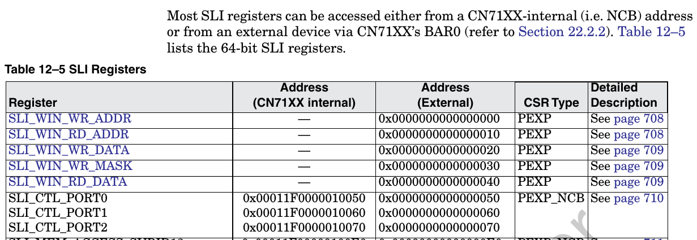
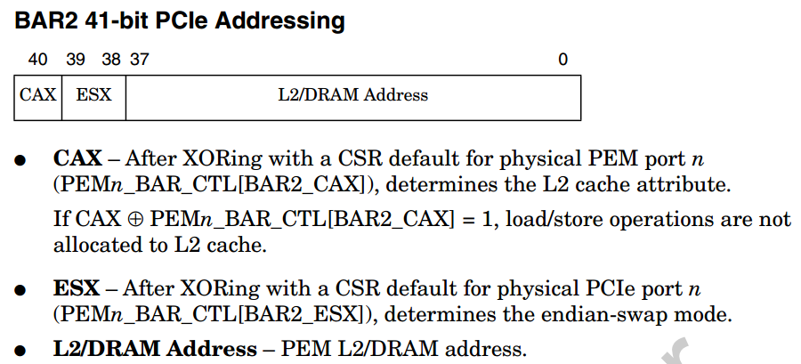
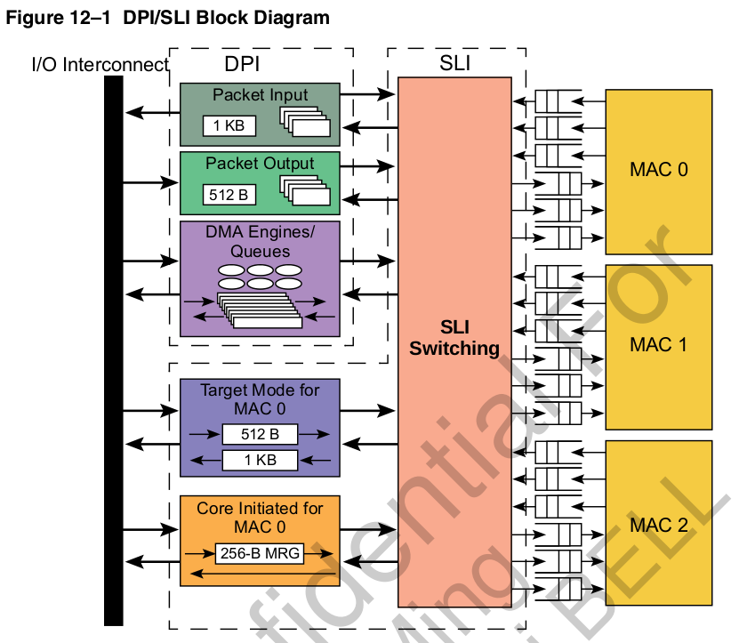
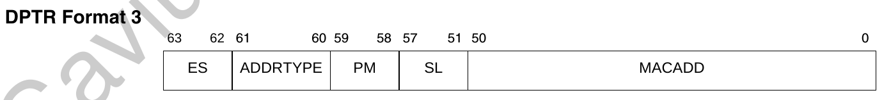
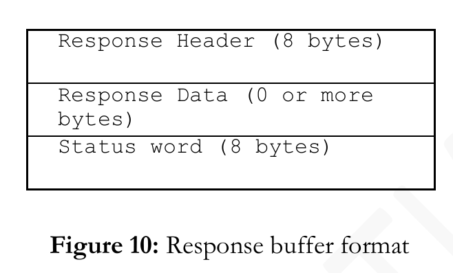
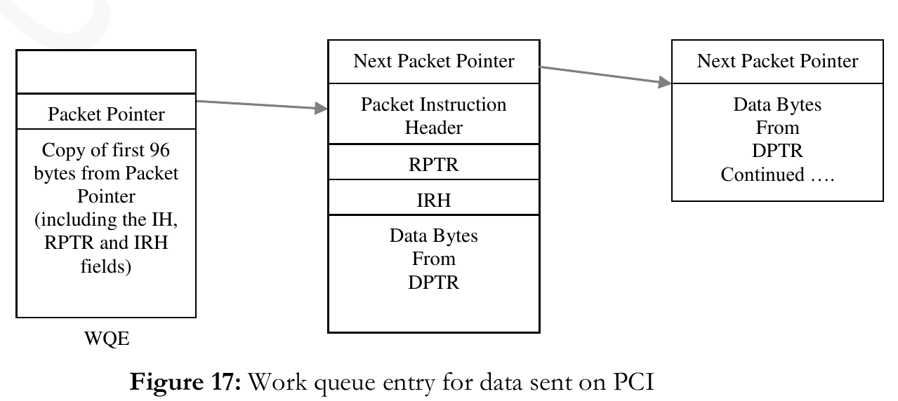

- [pci NIC支持两种模式](#pci-nic支持两种模式)
- [PEM](#pem)
  - [in EP mode](#in-ep-mode)
  - [in RC mode](#in-rc-mode)
- [DPI & SLI](#dpi--sli)
- [DPI(以下以61xx为例)](#dpi以下以61xx为例)
  - [input](#input)
  - [output](#output)
  - [DPI DMA](#dpi-dma)
  - [DMA的命令字](#dma的命令字)
  - [DMA的命令queue](#dma的命令queue)
  - [DMA engine 0..5](#dma-engine-05)
- [PCI-BASE](#pci-base)
  - [packages](#packages)
  - [overview](#overview)
  - [input rings](#input-rings)
  - [output rings](#output-rings)
  - [dma](#dma)
  - [dir tree](#dir-tree)
  - [host driver](#host-driver)
    - [device configuration](#device-configuration)
    - [input ring initialization](#input-ring-initialization)
    - [output ring initialization](#output-ring-initialization)
    - [dma initialization](#dma-initialization)
    - [other initialization](#other-initialization)
    - [linux ko](#linux-ko)
  - [input ring processing](#input-ring-processing)
    - [发送报文](#发送报文)
      - [发送报文属性](#发送报文属性)
      - [DMA支持的四种模式](#dma支持的四种模式)
      - [软件发送接口](#软件发送接口)
      - [response格式](#response格式)
  - [octeon设备文件](#octeon设备文件)
  - [output ring processing](#output-ring-processing)
  - [SE都做了什么](#se都做了什么)
  - [test](#test)

# pci NIC支持两种模式
* Packet Mode: 类似网卡
* Coprocessor Mode: host发请求, octeon给response

# PEM
RC mode: type1 configuration space header
EP mode: type 0 configuration space header  
  

* pcie2.0
* port0: RC or EP
* port 1/2: RC

## in EP mode
* no I/O space
* bar0: CN71xx SLI CSR; 16KB  
SLI_WIN_* enable indirect access to all other CPU CSRs(or mem?)  
  
* bar1: 64M, indirect access to L2/DRAM  
```
EP: pcie bar1(64MB window)

38-bit L2/DRAM address referenced by the PCIe read/write operations in BAR1 space:
37                         22|21                           0
------------------------------------------------------------
+ PEM0_BAR1_INDEXn[ADDR_IDX] | EntryOff(from BAR1 address) +
------------------------------------------------------------
|                ^           |\                             \
|                |           |  \                             \
|                |           |    \                             \
|                |           |      \                             \
|                |           |        v                             v
|                |           |  pcie address from X86_64(lower 26bit)
|                |           |  25  22 21                           0
|                |           |  -------------------------------------
|                |           |  +Entry|        EntryOff(4M)         +
|                |           |  -------------------------------------
|                |           |     |
|              +-+-----------+-----+   
v              v             v 
PEM0_BAR1_INDEXn(0..15) CSR
19                          4 3  2     1   0
------------------------------------------------
+        ADDR_IDX            |CA|END_SWP|ADDR_V+
------------------------------------------------

64M window = 16 block * 4M
```

* bar2: direct access to L2/DRAM; 512G/2T capability;   
PEM0_BAR_CTL[BAR2_ENB ]: default is disable --how to enable as default?  
  

`cat /proc/iomem`
* rom bar: to bootbus; 64KB  

## in RC mode
* RC mode: does not use the base address in type 1 header.
* RC mode: use internal bar0 bar1 bar2 to access octeon from EP device
* internal bar0: 16K, --"just like in EP mode"  
PEM0_P2N_BAR0_START make no sense? only expose SLI CSRs to device? 
* internal bar1: 64M, --"just like in EP mode", but can change base? --PEM1_P2N_BAR0_START
* internal bar2: 2T, --"just like in EP mode", but can change base? --PEM2_P2N_BAR0_START ?
 


# DPI & SLI
  

* DPI负责DMA
* SLI负责IO BUS
* 为什么DMA能把X86的内存拷贝到OCTEON? 反向看X86的内存?
* 用户态中断怎么处理?UIO? VFIO?
* 可DMA的buffer怎么申请? 尤其是用户态?  
参考  
  * 搜索`Mastering the DMA and IOMMU APIs`
  * http://lxr.free-electrons.com/source/Documentation/dma-buf-sharing.txt 
  * http://stackoverflow.com/questions/11137058/from-the-kernel-to-the-user-space-dma
  * http://stackoverflow.com/questions/5539375/linux-kernel-device-driver-to-dma-from-a-device-into-user-space-memory
  * http://minghuasweblog.wordpress.com/2013/03/25/mapping-dma-buffers-to-user-space-on-linux-with-mmap/
  * 零拷贝 http://www.linuxjournal.com/article/6345?page=0,1
  * stack over flow QA
```
The technical basics are mostly summarized on a stackoverflow QA: Mapping DMA buffers to userspace. The key steps of different alternatives, are copied below:

    LDD chapter 15, page 435, Direct IO operations. Use kernel call of get_user_pages.
    Asynchronous IO may achieve the same result, but without userspace application having to wait for the read to finish.
    Check the infiband drivers which goes to much effort to make zero-copy DMA and RDMA to user space work.
        The person also commented: Doing DMA directly to user space memory mappings is full of problems. Copying DMA’d data into the userspace buffers will save much of the grief.
    Preallcate n buffers with myAddr[i] = pci_alloc_consistent(blah,size,&pci_addr[i]) until it fails. On a machine with 4G space usually it gets 2.5G of buffers each 4MiB. Cat /proc/buddyinfo to verify. Tell the device to DMA data into the buffer and send interrupt to tell the driver which buffer has been filled. In user space mmap the buffer, then wait on read or ioctl till the driver tells it which buffer is usable.
    get_user_pages to pin the user pages and to get an array of struct page * . dma_map_page on each struct page * to get the DMA addresses, this also creates an IOMMU mapping. Tell the device to do the DMA. dma_sync_single_for_cpu to flush etc. Then dma_unmap_page and put_page.
    Sometimes, all the normal operations as above will not work. The vendor (like on iMX51) provides special API for SDMA.


Though the topic is about DMA memory used by device operation, the approach is the same if a memory mapped memory is shared by multiple processes on different virtual mappings.
```


# DPI(以下以61xx为例)
  

* 32 instruction input ring: 8 ring each port
* DPI input ports in PIP/IPD: 32 33 34 35

## input
  

这里面DPTR要么
1. 直接模式: 和DPTR1 2 3 联用, 指向data
2. 间接模式: 指向一个链表, 每个component如下, 64bit对齐  
  

* DPI 根据instruction构造packet  
  

* 4种DPTR format  
  
  
  
  
  

## output
* 32 output ring: 8 ring each port
* 4 output port of PKO: 32 33 34 35
* ring里面的每个项:
  

对每个ring  
SLI_PKT_DPADDR[DPTR<n>]=1时,  

这两个pointer的format是上面的DPTR0  
SLI_PKT_DPADDR[DPTR<n>]=0时, 

这两个pointer的format是上面的DPTR1

* output有两种mode  
SLI_PKT_IPTR[IPTR<n>]=1时,  Info-Pointer Mode  
当报文小于一个buffer size的时候, 很简单, DPI把报文写入buffer pointer的地方, 同时把大小写入info pointer的packet length;  
但报文太大的时候, DPI把报文依次写在buffer pointer里面, 但只用第一个对应的Info pointer, 这里面会记录整个packet的size  
info的格式  
  

注: 这里面的info bytes由SLI_PKT(0..31)_OUT_SIZE[ISIZE]决定, 最多120  
同时SLI_PKT(0..31)_OUT_SIZE[BSIZE]决定了buffer size, 最多65536

SLI_PKT_IPTR[IPTR<n>]=0时,  Buffer-Pointer-Only Mode  
先写packet size, 紧跟着是data

## DPI DMA
* 8个命令queue, 给6个DMA engine
## DMA的命令字
  
  

HDR里面会指明DMA的种类
  

pointer的格式  
这里面的size只有12位, 说明每个PTR只能管4K byte  
  

## DMA的命令queue
* 是个链表, 在ram里. 软件写链表头, 硬件读链表尾  
  

## DMA engine 0..5
* DPI_DMA_CONTROL[PKT_EN]=1 ==> DPI use engine 5; 其他情况从8 queue 到6 engine任意map
* 其他情况下, DMA和DPI有鸟关系? 可能只是给通用DMA用的? 从core到host mem, 通用方式?
 
# PCI-BASE
components/driver/OCT-PCI-BASE-GUIDE-2.3.pdf
## packages
* OCTEON-PCI-BASE: x86 pci driver && octeon se
* OCTEON-PCI-NIC: x86 network device; on top of OCTEON-PCI-BASE
* OCTEON-PCI-CNTQ: x86 app; on top of OCTEON-PCI-BASE

## overview
  
  

## input rings
  

## output rings
  

## dma
  

## dir tree
  

## host driver
* Initialization of various OCTEON PCI blocks including Input/Output  
rings and DMA engines.
* Receiving requests from user and kernel space applications and
forwarding them to OCTEON.
* Managing different requests types while they wait being fetched by
OCTEON or till a response arrives from OCTEON.
* Receiving packets from OCTEON via the output rings and dispatch them
to kernel applications.
* Managing various hooks that other kernel modules (like NIC) can call to change the default packet processing behavior.

### device configuration
See OCTEON_config.h/OCTEON_main.c

### input ring initialization
See `request_manager.c` - `OCTEON_init_instr_queue()`  
默认配置:  
* 32字节type, 1024 entries for ring0, 128 entries for other rings  
* for all input rings: 64-bit endian swapping and disables relaxed ordering and NoSnoop operations

### output ring initialization
See `OCTEON_droq.c` - `OCTEON_init_droq()`
默认配置:
* 1024 entries for ring0, 128 entries for other rings
* info pointer mode
* pre-allocated buffer(1024 bytes) for each entry in descriptor ring
* 100ms timer interrupt

### dma initialization
完成通知:
* Issue a work-queue entry to the POW
* Write 0 to a memory location

### other initialization
* request list: from app
* poll list: in kernel thread
* dispatch: opcode for packages arriving on output rings

### linux ko
`components/driver/host/driver/linux/octeon_linux.c`

## input ring processing
  
  

### 发送报文
  
* `OCTEON_send_request()` from kernel space
* `ioctl` from user space

#### 发送报文属性
  
  

#### DMA支持的四种模式
  
注: 即使对app支持多buffer模式, 但从user space拷贝到kernel space时, 驱动会拷贝到一个buffer里面

#### 软件发送接口
`OCTEON_soft_request()`, 用到的结构体OCTEON_soft_request_t在`components/driver/host/include/cavium_defs.h`

#### response格式
  
  
  

## octeon设备文件
`/dev/OCTEON_device`, user api 库(liboctapi.a)依赖它
api在`components/driver/host/api/octeon_user.h`

## output ring processing
* 100ms中断
* 从ring0开始依次处理

  

可以根据opcode调用相应的回调函数  
可以根据不同的ring做fast path, 用`OCTEON_register_droq_ops()`来注册fast path处理函数  
默认走slow path: 即所有来的package都查opcode做相应处理, 没有处理函数则driver就把buffer回收了  
output ring 重填可以update新的buffer info

## SE都做了什么
比如初始化DMA
```
cvm_drv_init()
cvm_drv_local_init()
cvm_drv_setup_app_mode()
cvm_drv_start()
```
从pcie进来的报文进WQE, 和其他接口进来的报文类似.data前有24字节的头?  
  

octeon发报文给x86时, 就像发给SGMII一样, 给PKO写命令, 此时, 硬件完成
1. 从output ring获取下一个报文buffer
2. 把PKO来的报文分片, 以写入一个或多个buffer
3. 写info pointer, 比如要写报文长度
4. 发中断(报文数或者时间片)
DMA不要求octeon和x86的buffer数是一样的, 在DMA传输时, 只要总字节数一样就OK  
core driver会填DMA命令字来做DMA双向传输


## test
* oct_req是用户态程序
* req_resp是内核态程序
* droq_test是内核态程序, 在output ring上注册了一个收包函数
* cvmcs:SE 在applications/pci-core-app
* oct_dbg:一个带menu的dgb工具
* oct_stats:显示input output DMA queue的工具
