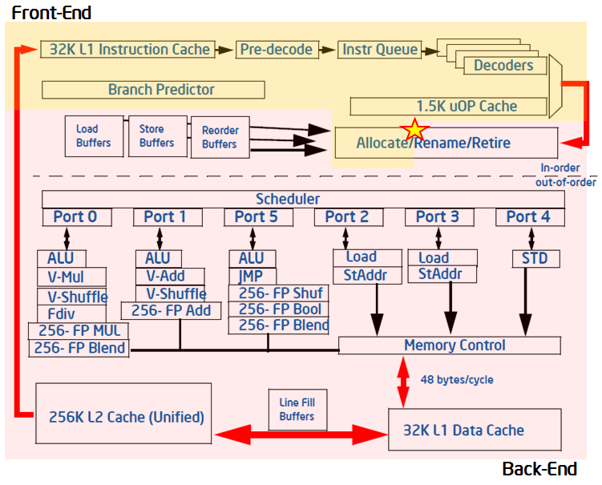
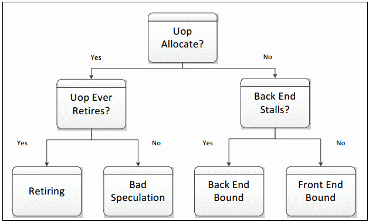
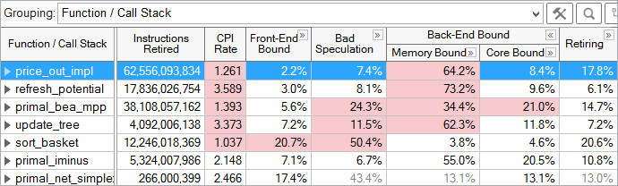
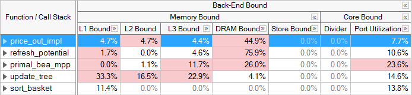
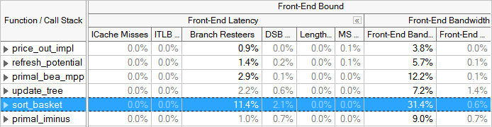
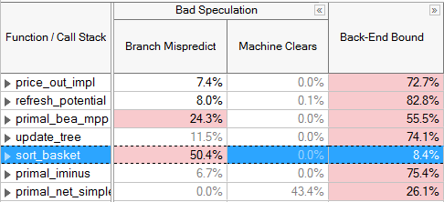
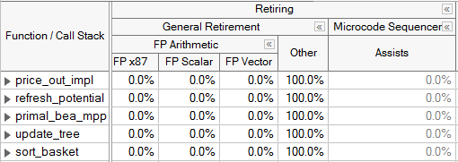

- [Top-down Microarchitecture Analysis Method Overview](#top-down-microarchitecture-analysis-method-overview)
- [Top-Down Analysis Method with VTune Profiler](#top-down-analysis-method-withvtuneprofiler)
- [Microarchitectural Tuning Methodology](#microarchitectural-tuning-methodology)
- [Tune for the Back-End Bound Category](#tune-for-the-back-end-bound-category)
- [Tune for the Front-End Bound Category](#tune-for-the-front-end-bound-category)
- [Tune for the Bad Speculation Category](#tune-for-the-bad-speculation-category)
- [Tune for the Retiring Category](#tune-for-the-retiring-category)
- [Conclusion](#conclusion)

Use this recipe to know how an application is utilizing available hardware resources and how to make it take advantage of CPU microarchitectures. One way to obtain this knowledge is by using on-chip Performance Monitoring Units (PMUs).

PMUs are dedicated pieces of logic within a CPU core that count specific hardware events as they occur on the system. Examples of these events may be Cache Misses or Branch Mispredictions. These events can be observed and combined to create useful high-level metrics such as Cycles per Instruction (CPI).A specific microarchitecture may make available hundreds of events through its PMU. However, it is frequently non-obvious to determine which events are useful in detecting and fixing specific performance issues. Often it requires an in-depth knowledge of both the microarchitecture design and PMU specifications to obtain useful information from raw event data. But you can benefit from using predefined events and metrics, and the top-down characterization method to convert the data into actionable information.Explore the PMU analysis recipe to learn the methodology and how it is used in the Intel® VTune Profiler:

-   INGREDIENTS:

  [Top-down Microarchitecture Analysis Method (TMA) overview](https://www.intel.com/content/www/us/en/develop/documentation/vtune-cookbook/top/methodologies/top-down-microarchitecture-analysis-method.html#top-down-microarchitecture-analysis-method_GUID-FA8F07A1-3590-4A91-864D-CE96456F84D7)-   [Top-Down Analysis Method with VTune Profiler](https://www.intel.com/content/www/us/en/develop/documentation/vtune-cookbook/top/methodologies/top-down-microarchitecture-analysis-method.html#top-down-microarchitecture-analysis-method_GUID-123F5A7B-DD33-46ED-9601-EB6CC59FC578)-   [Microarchitectural Tuning Methodology](https://www.intel.com/content/www/us/en/develop/documentation/vtune-cookbook/top/methodologies/top-down-microarchitecture-analysis-method.html#top-down-microarchitecture-analysis-method_GUID-FEA77CD8-F9F1-446A-8102-07D3234CDB68)

  DIRECTIONS:

  [Tune for the Back-End Bound Category](https://www.intel.com/content/www/us/en/develop/documentation/vtune-cookbook/top/methodologies/top-down-microarchitecture-analysis-method.html#top-down-microarchitecture-analysis-method_GUID-BDD88789-8010-4A8E-B48C-10E501BFE8E3)-   [Tune for the Front-End Bound Category](https://www.intel.com/content/www/us/en/develop/documentation/vtune-cookbook/top/methodologies/top-down-microarchitecture-analysis-method.html#top-down-microarchitecture-analysis-method_GUID-51923A77-8BC2-4E76-9756-6830EE94BBE5)-   [Tune for the Bad Speculation Category](https://www.intel.com/content/www/us/en/develop/documentation/vtune-cookbook/top/methodologies/top-down-microarchitecture-analysis-method.html#top-down-microarchitecture-analysis-method_GUID-56FBB4D7-9FE8-4336-BDDB-23EA7DD2DBC0)-   [Tune for the Retiring Category](https://www.intel.com/content/www/us/en/develop/documentation/vtune-cookbook/top/methodologies/top-down-microarchitecture-analysis-method.html#top-down-microarchitecture-analysis-method_GUID-9727C56E-E42E-4B51-9116-12F0AB2124B1)

  [Related Cookbook Recipes](https://www.intel.com/content/www/us/en/develop/documentation/vtune-cookbook/top/methodologies/top-down-microarchitecture-analysis-method.html#top-down-microarchitecture-analysis-method_GUID-8245F2D8-4A88-45D1-A282-D647F645469A)

Top-down Microarchitecture Analysis Method Overview
---------------------------------------------------

Modern CPUs employ pipelining as well as techniques like hardware threading, out-of-order execution and instruction-level parallelism to utilize resources as effectively as possible. In spite of this, some types of software patterns and algorithms still result in inefficiencies. For example, linked data structures are commonly used in software, but cause indirect addressing that can defeat hardware prefetchers. In many cases, this behavior can create bubbles of idleness in the pipeline while data is retrieved and there are no other instructions to execute. Linked data structures could be an appropriate solution to a software problem, but may result in inefficiencies. There are many other examples at the software level that have implications on the underlying CPU pipelines. The Top-down Microarchitecture Analysis Method based on the Top-Down Characterization methodology aims to provide an insight into whether you have made wise choices with your algorithms and data structures. See the [*Intel® 64 and IA-32 Architectures Optimization Reference Manual, Appendix B.1*](http://www.intel.com/content/dam/www/public/us/en/documents/manuals/64-ia-32-architectures-optimization-manual.pdf) for more details on the Top-down Microarchitecture Analysis Method.The Top-Down Characterization is a hierarchical organization of event-based metrics that identifies the dominant performance bottlenecks in an application. Its aim is to show, on average, how well the CPU's pipeline(s) were being utilized while running an application. Previous frameworks for interpreting events relied on accounting for CPU clockticks - determining what fraction of CPU's clockticks was spent on what type of operations (retrieving data due to L2 cache misses, for example). This framework instead is based on accounting for the pipeline's resources. To understand the Top-Down Characterization, explore a few microarchitectural concepts below, at a high level. Many of the details of the microarchitecture are abstracted in this framework, enabling you to use and understand it without being a hardware expert.The pipeline of a modern high-performance CPU is quite complex. In the simplified view blow, the pipeline is divided conceptually into two halves, the Front-end and the Back-end. The Front-end is responsible for fetching the program code represented in architectural instructions and decoding them into one or more low-level hardware operations called *micro-ops* (uOps). The uOps are then fed to the Back-end in a process called *allocation*. Once allocated, the Back-end is responsible for monitoring when uOp's data operands are available and executing the uOp in an available execution unit. The completion of a uOp's execution is called *retirement*, and is where results of the uOp are committed to the architectural state (CPU registers or written back to memory). Usually, most uOps pass completely through the pipeline and retire, but sometimes speculatively fetched uOps may get cancelled before retirement - like in the case of mis-predicted branches.

  

The Front-end of the pipeline on recent Intel microarchitectures can allocate four uOps per cycle, while the Back-end can retire four uOps per cycle. From these capabilities the abstract concept of a pipeline slot can be derived. A pipeline slot represents the hardware resources needed to process one uOp. The Top-Down Characterization assumes that for each CPU core, on each clock cycle, there are four pipeline slots available. It then uses specially designed PMU events to measure how well those pipeline slots were utilized. The status of the pipeline slots is taken at the allocation point (marked with a star in the figure above), where uOps leave the Front-end for the Back-end. Each pipeline slot available during an application’s runtime will be classified into one of four categories based on the simplified pipeline view described above.

During any cycle, a pipeline slot can either be empty or filled with a uOp. If a slot is empty during one clock cycle, this is attributed to a stall. The next step needed to classify this pipeline slot is to determine whether the Front-end or the Back-end portion of the pipeline caused the stall. This is done using designated PMU events and formulas. The goal of the Top-Down Characterization is to identify dominant bottlenecks, hence the attribution of the stall to either the Front- or Back-end is a critical point of consideration. Generally, if the stall is caused by the Front-end’s inability to fill the slot with a uOp, it will be classified as a Front-End Bound slot for this cycle, meaning, the performance was limited by some bottleneck under the Front-End Bound category. In the case where the Front-end has a uOp ready but cannot deliver it because the Back-end is not ready to handle it, the empty pipeline slot will be classified as Back-End Bound. Back-end stalls are generally caused by the Back-end running out of some resource, for example, load buffers. However, if both the Front-end and the Back-end are stalled, then the slot will be classified as Back-End Bound. This is because, in that case, fixing the stall in the Front-end would most likely not help an application’s performance. The Back-end is the blocking bottleneck, and it would need to be removed first before fixing issues in the Front-end would have any effect.

If the processor is not stalled then a pipeline slot will be filled with a uOp at the allocation point. In this case, the determining factor for how to classify the slot is whether the uOp eventually retires. If it does retire, the slot is classified as Retiring. If it does not, either because of incorrect branch predictions by the Front-end or a clearing event like a pipeline flush due to Self-Modifying-Code, the slot will be classified as Bad Speculation. These four categories make up the top level of the Top-Down Characterization. To characterize an application, each pipeline slot is classified into exactly one of these four categories:

  

The distribution of pipeline slots in these four categories is very useful. Although metrics based on events have been possible for many years, before this characterization there was no approach for identifying which possible performance issues were the most impactful. When performance metrics are placed into this framework, you can see which issues need to be tackled first. The events needed to classify pipeline slots into the four categories are available beginning with Intel® microarchitecture code name Sandy Bridge – which is used in the 2nd Generation Intel Core processor family and the Intel Xeon® processor E5 family. Subsequent microarchitectures may allow further decomposition of these high-level categories into more detailed performance metrics.

Top-Down Analysis Method with VTune Profiler
--------------------------------------------

Intel® VTune Profiler provides a [Microarchitecture Exploration analysis type](https://software.intel.com/content/www/us/en/develop/documentation/vtune-help/top/analyze-performance/microarchitecture-analysis-group/general-exploration-analysis.html) that is pre-configured to collect the events defined in the Top-Down Characterization starting with the Intel microarchitecture code name Ivy Bridge. Microarchitecture Exploration also collects the events required to calculate many other useful performance metrics. The results of a Microarchitecture Exploration analysis are displayed by default in the [Microarchitecture Exploration viewpoint ](https://software.intel.com/content/www/us/en/develop/documentation/vtune-help/top/analyze-performance/microarchitecture-analysis-group/general-exploration-analysis/general-exploration-view.html).

Microarchitecture Exploration results are displayed in hierarchical columns to reinforce the top-down nature of the characterization. The **Summary** window gives the percentage of pipeline slots in each category for the whole application. You can explore results in multiple ways. The most common way to explore results is to view metrics at the function level:

  

For each function, the fraction of pipeline slots in each category is shown. For example, the price_out_impl function, selected above, had 2.2% of its pipeline slots in the Front-End Bound category, 7.4% in Bad Speculation, 64.2% in Memory Bound, 8.4% in Core Bound, and 17.8% in the Retiring category. Each category can be expanded to view metrics underneath that category. Automatic highlighting is used to draw your attention to potential problem areas, in this case, to the high percentage of Memory Bound pipeline slots for price_out_impl.

Microarchitectural Tuning Methodology
-------------------------------------

When doing any performance tuning, it is important to focus on the top hotspots of the application. *Hotspots* are the functions taking the most CPU time. Focus on these spots will ensure that optimizations impact the overall application performance. VTune Profiler has a Hotspots analysis with two specific collection modes: user-mode sampling and hardware event-based sampling. Within the Microarchitecture Exploration viewpoint, hotspots can be identified by determining the functions or modules with the highest Clockticks event counts, which measures the number of CPU clockticks. To obtain maximum benefit from microarchitectural tuning, ensure that algorithmic optimizations such as adding parallelism have already been applied. Generally system tuning is performed first, then application-level algorithm tuning, then architectural and microarchitectural tuning. This process is also referred to as "Top-Down", as in the Top-Down software tuning methodology. It, as well as other important aspects of performance tuning like workload selection, are described in the [De-Mystifying Software Performance Optimization](https://software.intel.com/en-us/articles/de-mystifying-software-performance-optimization) article.

- Select a hotspot function (one with a large percentage of the application's total clockticks).
-   Evaluate the efficiency of that hotspot using the Top-Down Method and the guidelines given below.
- If inefficient, drill down the category representing the primary bottleneck, and use the next levels of sub-bottlenecks to identify causes.
- Optimize the issue(s). VTune Profiler [tuning guides](https://software.intel.com/content/www/us/en/develop/articles/processor-specific-performance-analysis-papers.html) contain specific tuning suggestions for many of the underlying performance issues in each category.
- Repeat until all significant hotspots have been evaluated.

VTune Profiler automatically highlights metric values in the GUI if they are outside a predefined threshold and occur in a hotspot. VTune Profiler classifies a function as a hotspot if greater than 5% of the total clockticks for an application accrued within it. Determining whether a given fraction of pipeline slots in a particular category constitutes a bottleneck can be workload-dependent, but some general guidelines are provided in the table below:

|  | Expected Range of Pipeline Slots in This Category, for a Hotspot in a Well-Tuned: |||
| --- |  --- | --- | --- |
| Category | Client/Desktop Application | Server/Database/Distributed application | High Performance Computing (HPC) application |
| --- |  --- |  --- |  --- |
| Retiring | 20-50% | 10-30% | 30-70% |
| --- |  --- |  --- |  --- |
| Back-End Bound | 20-40% | 20-60% | 20-40% |
| Front-End Bound | 5-10% | 10-25% | 5-10% |
| Bad Speculation | 5-10% | 5-10% | 1-5% |

These thresholds are based on analysis of some workloads in labs at Intel. If the fraction of time spent in a category (other than Retiring) for a hotspot is on the high end or greater than the range indicated, an investigation might be useful. If this is true for more than one category, the category with the highest fraction of time should be investigated first. Note that it is expected that hotspots will have some fraction of time spent in each category, and that values within the normal range below may not indicate a problem.

The important thing to realize about the Top-Down Method is that you do not need to spend time optimizing issues in a category that is not identified as a bottleneck - doing so will likely not lead to a significant performance improvement.

Tune for the Back-End Bound Category
------------------------------------

The majority of un-tuned applications will be Back-End Bound. Resolving Back-end issues is often about resolving sources of latency, which cause retirement to take longer than necessary. On the Intel microarchitecture code name Sandy Bridge, VTune Profiler has Back-End Bound metrics to find the sources of high latency. For example, the LLC Miss (Last-Level Cache Miss) metric identifies regions of code that need to access DRAM for data, and the Split Loads and Split Stores metrics point out memory access patterns that can harm performance. For more details on Intel microarchitecture code name Sandy Bridge metrics, see the *Tuning Guide*. Starting with Intel microarchitecture code name Ivy Bridge (which is used in the 3rd Generation Intel Core processor family), events are available to breakdown the Back-End Bound classification into Memory Bound and Core Bound sub-metrics. A metric beneath the top 4 categories may use a domain other than the pipeline slots domain. Each metric will use the most appropriate domain based on underlying PMU events. For more details see the [documentation for each metric or category](https://software.intel.com/content/www/us/en/develop/documentation/vtune-help/top/reference/cpu-metrics-reference.html).

The Memory and Core Bound sub-metrics are determined using events corresponding to the utilization of the execution units - as opposed to the allocation stage used in the top-level classifications. Therefore, the sum of these metrics will not necessarily match the Back-End Bound ratio determined at the top-level (though they correlate well).

Stalls in the Memory Bound category have causes related to the memory subsystem. For example, cache misses and memory accesses can cause Memory Bound stalls. Core Bound stalls are caused by a less-than-optimal use of the available execution units in the CPU during each cycle. For example, several multi-cycle divide instructions in a row competing for the divide units could cause Core Bound stalls. For this breakdown, slots are only classified as Core Bound if they are stalled AND there are no uncompleted memory accesses. For example, if there are pending loads, the cycle is classified as Memory Bound because the execution units are being starved while the loads have not returned data yet. PMU events were designed into the hardware to specifically allow this type of breakdown, which helps identify the true bottleneck in an application. The majority of Back-End Bound issues will fall into the Memory Bound category.

Most of the metrics under the Memory Bound category identify which level of the memory hierarchy from the L1 cache through the memory is the bottleneck. Again, the events used for this determination were carefully designed. Once the Back-end is stalled the metrics try to attribute the stalls of pending loads to a particular level of cache or to in-flight stores. If a hotspot is bound at a given level, it means that most of its data is being retrieved from that cache- or memory-level. Optimizations should focus on moving data closer to the core. Store Bound is also called out as a sub-category, which can indicate dependancies - such as when loads in the pipeline depend on prior stores. Under each of these categories, there are metrics that can identify specific application behaviors resulting in Memory Bound execution. For example, Loads Blocked by Store Forwarding and 4k Aliasing are metrics that flag behaviors that can cause an application to be L1 Bound.

Core Bound stalls are typically less common within Back-End Bound. These can occur when available computing resources are not sufficiently utilized and/or used without significant memory requirements. For example, a tight loop doing Floating Point (FP) arithmetic calculations on data that fits within cache. VTune Profiler provides some metrics to detect behaviors in this category. For example the Divider metric identifies cycles when divider hardware is heavily used and the Port Utilization metric identifies competition for discrete execution units.

  

Grayed out metric values indicate that the data collected for this metric is unreliable. This may happen, for example, if the number of samples collected for PMU events is too low. You may either ignore this data, or rerun the collection with the data collection time, sampling interval, or workload increased.

Tune for the Front-End Bound Category
-------------------------------------

The Front-End Bound category covers several other types of pipeline stalls. It is less common for the Front-end portion of the pipelines to become the application's bottleneck; however there are cases where the Front-end can contribute in a significant manner to machine stalls. For example, JITed code and interpreted code can cause Front-end stalls because the instruction stream is dynamically created without the benefit of compiler code layout in advance. Improving performance in the Front-End Bound category will generally relate to code layout (co-locating hot code) and compiler techniques. For example, branchy code or code with a large footprint may highlight the Front-End Bound category. Techniques like code size optimization and compiler profile-guided optimization (PGO) are likely to reduce stalls in many cases.

The Top-Down Method on Intel microarchitecture code name Ivy Bridge and beyond divides Front-End Bound stalls into 2 categories, Front-End Latency and Front-End Bandwidth. The Front-End Latency metric reports cycles in which no uops were issued by the Front-end in a cycle, while the Back-end was ready to consume them. Recall that the Front-end cluster can issue up to 4 uops per cycle. The Front-End Bandwidth metric reports cycles in which less than 4 uops were issued, representing an inefficient use of the Front-end's capability. Further metrics are identified below each of the categories.

Branch mispredictions, which are mostly accounted for in the Bad Speculation category, could also lead to inefficiencies in the Front-end as denoted by the Branch Resteers bottleneck metric underneath Front-End Latency starting in the Intel microarchitecture code name Ivy Bridge.

  

VTune Profiler lists metrics that may identify causes of Front-End Bound code. If any of these categories shows up significantly in the results, dig deeper into the metrics to determine the causes and how to correct them. For example, the ITLB Overhead (Instruction Translation Lookaside Buffer Overhead) and ICache Miss (Instruction Cache miss) metrics may point out areas suffering from Front-End Bound execution. For tuning suggestions see the VTune Profiler tuning guides.

Tune for the Bad Speculation Category
-------------------------------------

The third top-level category, Bad Speculation, denotes when the pipeline is busy fetching and executing non-useful operations. Bad Speculation pipeline slots are slots wasted by issued uops that never retired or stalled while the machine recovers from an incorrect speculation. Bad Speculation is caused by branch mispredictions and machine clears and less commonly by cases like Self-Modifying-Code. Bad Speculation can be reduced through compiler techniques such as Profile-Guided Optimization (PGO), avoiding indirect branches, and eliminating error conditions that cause machine clears. Correcting Bad Speculation issues may also help decrease the number of Front-End Bound stalls. For specific tuning techniques refer to the VTune Profiler tuning guide appropriate for your microarchitecture.

  

Tune for the Retiring Category
------------------------------

The last category at the top level is Retiring. It denotes when the pipeline is busy with typically useful operations. Ideally an application would have as many slots classified in this category as possible. However, even regions of code with a large portion of their pipeline slots retiring may have room for improvement. One performance issue that will fall under the retiring category is heavy use of the micro-sequencer, which assists the Front-end by generating a long stream of uops to address a particular condition. In this case, although there are many retiring uops, some of them could have been avoided. For example, FP Assists that apply in the event of Denormals can often be reduced through compiler options (like DAZ or FTZ). Code generation choices can also help mitigate these issues - for more details see the VTune Profiler tuning guides. In the Intel microarchitecture code name Sandy Bridge, Assists are identified as a metric under the Retiring category. In the Intel microarchitecture code name Ivy Bridge and beyond, the pipeline slots in the ideal category of retirement are broken into a sub-category called General Retirement, and Microcode Sequencer uops are identified separately.

  

If not already done, algorithmic tuning techniques like parallelization and vectorization can help improve the performance of code regions that fall into the retiring category.

Conclusion
----------
The Top-Down Method and its availability in VTune Profiler represent a new direction for performance tuning using PMUs. Developer time invested in becoming familiar with this characterization will be worth the effort, since support for it is designed into recent PMUs and, where possible, the hierarchy is further expanded on future Intel microarchitectures. For example, the characterization was significantly expanded between Intel microarchitecture code name Sandy Bridge and Intel microarchitecture code name Ivy Bridge.

The goal of the Top-Down Method is to identify the dominant bottlenecks in an application performance. The goal of Microarchitecture Exploration analysis and visualization features in VTune Profiler is to give you actionable information for improving your applications. Together, these capabilities can significantly boost not only application performance, but also the productivity of your optimizations.

原文链接:
* https://www.intel.com/content/www/us/en/develop/documentation/vtune-cookbook/top/methodologies/top-down-microarchitecture-analysis-method.html#top-down-microarchitecture-analysis-method_GUID-FA8F07A1-3590-4A91-864D-CE96456F84D7
* https://www.intel.com/content/www/us/en/developer/articles/guide/processor-specific-performance-analysis-papers.html

