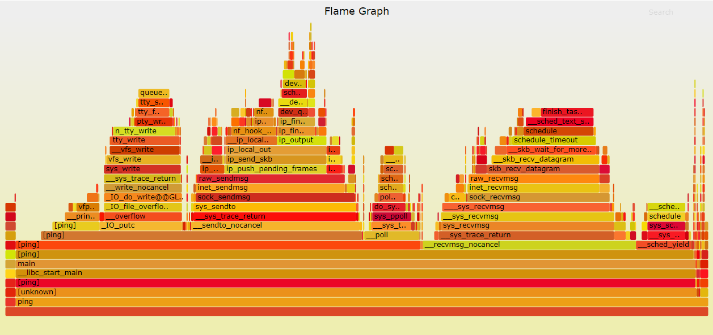
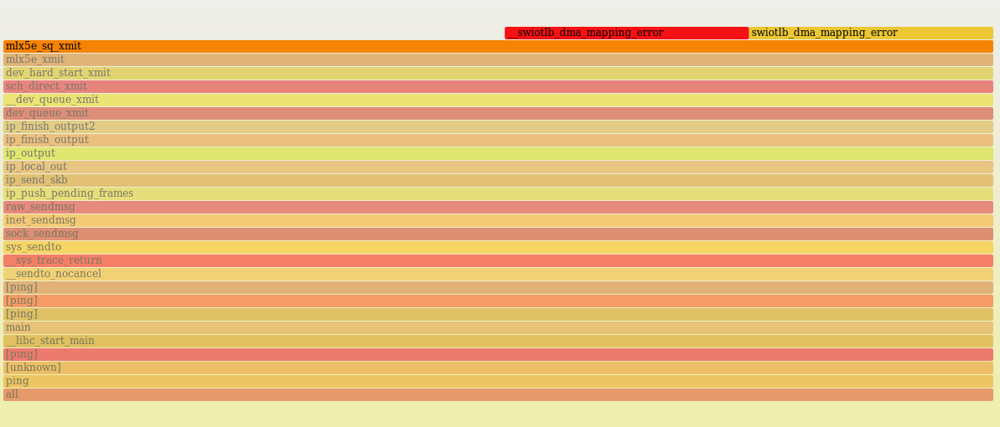
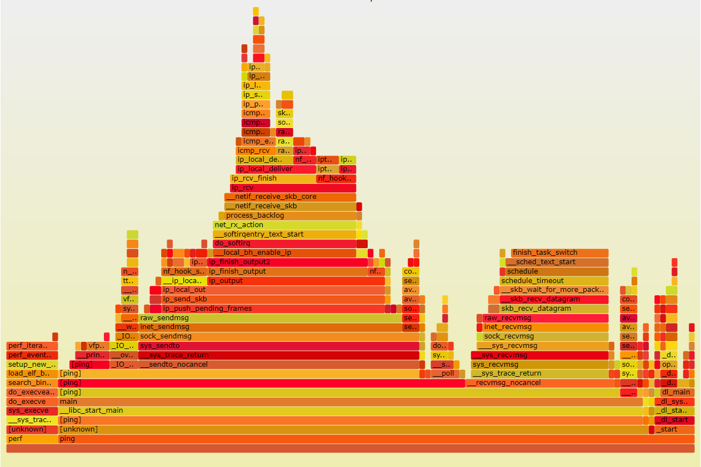
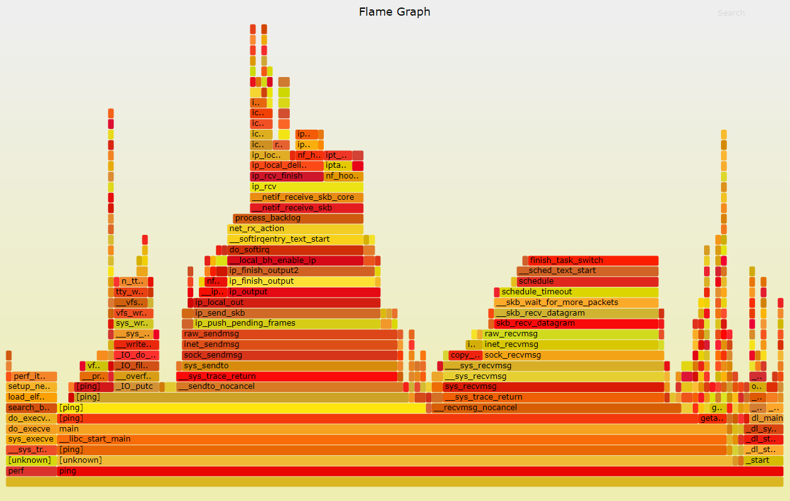

- [环境及过程](#环境及过程)
- [记录并解析函数调用](#记录并解析函数调用)
- [流程分析](#流程分析)
  - [ping peer](#ping-peer)
  - [ping self](#ping-self)
  - [ping localhost](#ping-localhost)
- [结论](#结论)
  - [latency](#latency)

> 本文主要分析`ping`命令的函数调用情况和不同场景下的区别

# 环境及过程
两个机器, Host A(5.5.5.11)和Host B(5.5.5.22), 物理网口(40G Mellanox CX4)直连.
在Host B上, 分三种情况


* ping对端: `ping 5.5.5.11`, 即ping对端物理网卡的IP
* ping自己: `ping 5.5.5.22`
* ping localhost `ping localhost`


然后考察函数调用的异同
# 记录并解析函数调用
`sudo perf record -g ping localhost`, 留稍长的时间给perf来采样, 这里有一两分钟就够了.  
`sudo perf script | ~/repo/FlameGraph/stackcollapse-perf.pl | ~/repo/FlameGraph/flamegraph.pl > ping-localhost.svg`, 解析用到flamegraph工具, 需要到github上下载.


# 流程分析
大致的过程是: ping先建立socket(sys_socket), 然后sys_sendto来发包, sys_recvmsg收包.
主要是内核协议栈在干活.

三个场景的火焰图见下:

## ping peer
  
核心的发送路径如下:  
  
可以看到从系统调用`sys_sendto`开始, 到调用实际物理网卡`mlx5e_sq_xmit`发送报文结束.
流程如下:
```sequence
Note Over Host B: ping
Note Over Host B: sys_sendto
Note Over Host B: sock_sendmsg
Note Over Host B: ip_finish_output
Note Over Host B: dev_hard_start_xmit
Note Over Host B: mlx5e_sq_xmit
Host B->Host A: ICMP request
Note Over Host B: sleep on skb recive(on behalf of ping thread in kernel)
Note Over Host A: handling
Host A->Host B: ICMP reply
Note Over Host B: mlx driver recv packet
Note Over Host B: wake up recive thread
Note Over Host B: skb_recv_datagram
Note Over Host B: sock_recvmsg
Note Over Host B: sys_recvmsg(wake up ping thread)
Note Over Host B: ping recive packet
```

## ping self
  
核心路径如下:  
  
这里也是从系统调用`sys_sendto`开始, 但到了`ip_finish_output2`, 协议栈知道这是发给自己的报文, 于是直接放到下半部,快速的走icmp的接收流程, 并且最后通过`loopback_xmit`发送icmp相应报文. 

这个发送的报文通过loopback这个"设备"驱动来收包, 走标准的linux收包流程.

流程如下:
```sequence
Note Over Host B ping: ping
Note Over Host B ping: sys_sendto
Note Over Host B ping: sock_sendmsg
Note Over Host B ping: ip_finish_output
Host B ping->Host B kernel: ICMP request
Note Over Host B kernel: do_softirq
Note right of Host B kernel: ICMP receive process
Note Over Host B kernel: ip_rcv
Note Over Host B kernel: icmp_rcv
Note Over Host B kernel: icmp_echo
Note right of Host B kernel: go through ip send process again
Note Over Host B kernel: ip_output
Note Over Host B kernel: dev_hard_start_xmit
Note right of Host B kernel: send packt through loopback
Note Over Host B kernel: loopback_xmit
Host B kernel->Host B ping: ICMP reply
Note Over Host B ping: sleep on skb recive(on behalf of ping thread in kernel)
Note Over Host B ping: loopback driver recv packet
Note Over Host B ping: wake up recive thread
Note Over Host B ping: skb_recv_datagram
Note Over Host B ping: sock_recvmsg
Note Over Host B ping: sys_recvmsg(wake up ping thread)
Note Over Host B ping: ping recive packet
```

## ping localhost
  

# 结论
* 三种方式的接收路径基本相同, ping调用`sys_recvmsg`接收报文, 导致内核在`skb_recv_datagram`路径上等待, 并主动让出CPU; 而从物理网口的driver接收报文很可能跑在其他CPU上(这个过程并不会被perf采样到, 因为我们是对进程号进行捕捉的), 收到并唤醒这里的等待, 进而接收报文路径返回.
* ping peer通过物理网卡驱动发包(好像这是废话...)
* ping localhost和ping self的发送流程类似, ICMP请求报文并没有真正"发送", 在ip层就直接走下半部接收流程, 直到ICMP回应报文通过"localhost"设备发出.

## latency
ping | latency ms (avg) | delta | %
---|---|---|---
local | 0.077 | 0 | 100%
peer | 0.134 | 0.057| 174%

peer方式比local方式的latency多了0.057ms, 结合以上分析, peer方式多了4次物理网卡驱动收发(Host B物理发, Host A物理收, Host A物理发, Host B物理收), 所以多的时间(57 us)就是这部分相关的硬件和驱动的处理时间.
