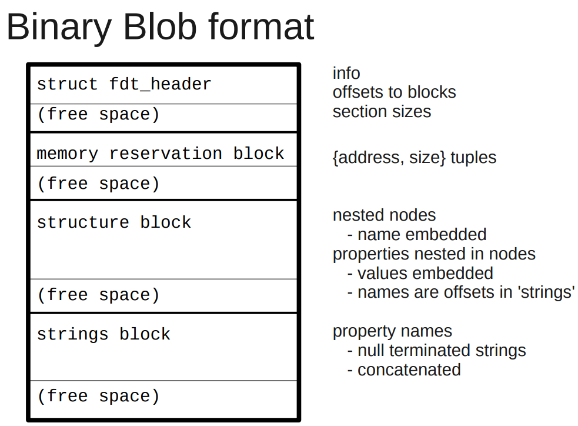
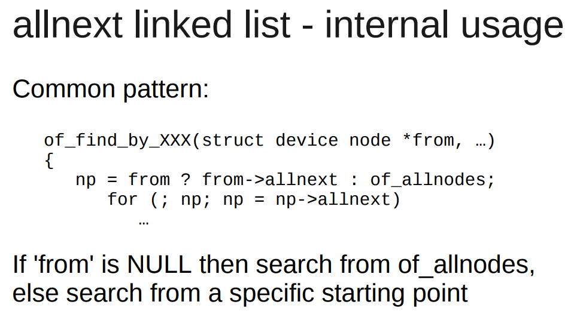
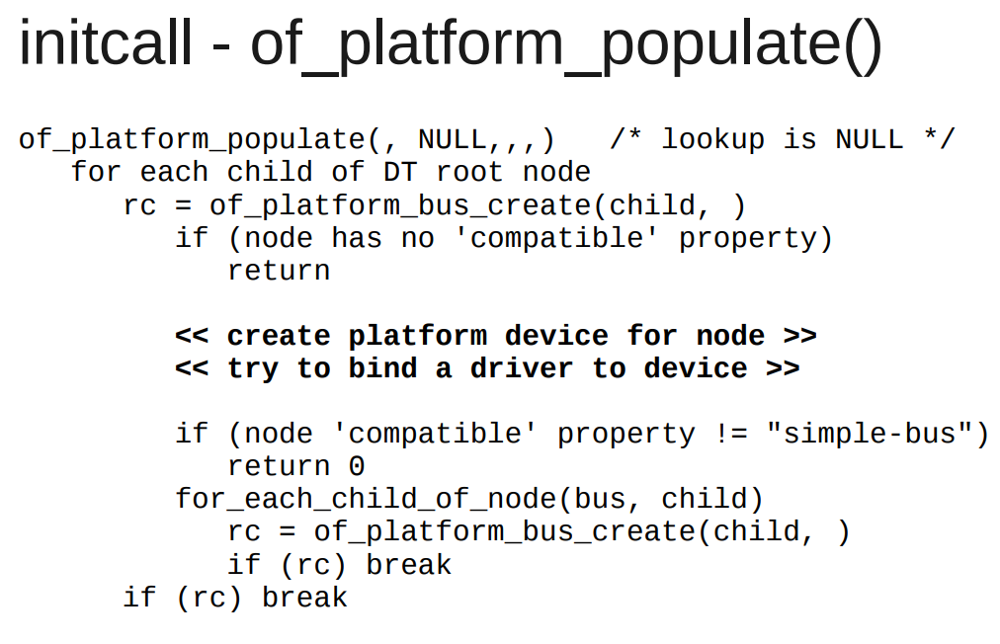
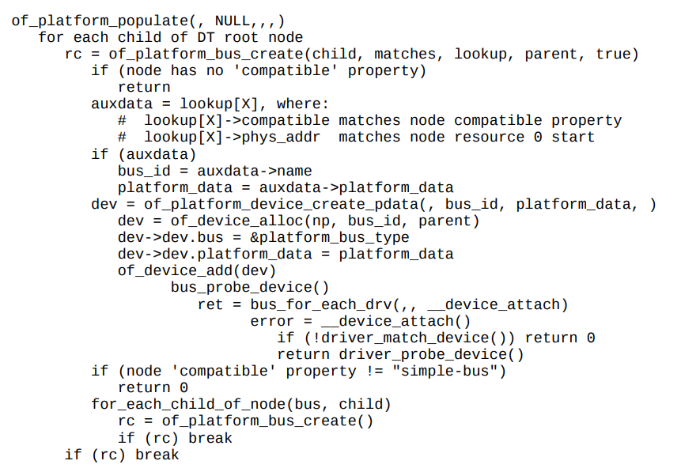

- [MSI中断](#msi中断)
- [I2C驱动轮询导致CPU占用过高问题](#i2c驱动轮询导致cpu占用过高问题)
  - [原始代码](#原始代码)
  - [如何解决](#如何解决)
- [dts删除node和属性](#dts删除node和属性)
- [simple-bus和平台驱动](#simple-bus和平台驱动)
  - [dts](#dts)
  - [dtb格式和和dtb在启动流程中的作用](#dtb格式和和dtb在启动流程中的作用)
  - [dtb树在kernel下的组织形式](#dtb树在kernel下的组织形式)
  - [of api](#of-api)
  - [启动流程](#启动流程)
  - [平台设备初始化](#平台设备初始化)
  - [参考](#参考)

# MSI中断
微软的windows kernel mode driver的文档, 对MSI的描述很精确:
> devices that use MSIs trigger an interrupt by **writing a value** to a **particular memory address**.

对一个特殊的地址写一个值, 就是MSI

> An _interrupt message_ is a particular value that a device writes to a particular address to trigger an interrupt. Unlike line-based interrupts, message-signaled interrupts have edge semantics. The device sends a message but does not receive any hardware acknowledgment that the interrupt was received.

写这个值的过程, 就是组一个interrupt msg, 写到特定地址

> For PCI 2.2, a message consists of an address and a partially opaque 16-bit value. Each device is assigned a single address. To send multiple messages, the device can use the lower 4 bits of the message value to distinguish messages. Therefore, for PCI 2.2, devices can support up to 16 messages.

> For PCI 3.0, a message consists of an address and an opaque 32-bit value. Each different message has its own unique address. Unlike for PCI 2.2, the device does not modify the value. For PCI 3.0, a device can support up to 2,048 different messages. Devices that support PCI 3.0 MSI-X feature a dynamically programmable hardware table that contains entries for each of the interrupt sources in the device. Each entry in this table can be programmed with one of the messages that are allocated to a device, and can be independently masked. Drivers can change the programming of an interrupt message into a table entry and whether an entry has been masked.

# I2C驱动轮询导致CPU占用过高问题
> 在板子上读I2C的时候, 发现在代码里面, 循环里不断去读状态寄存器, 导致CPU load过高. 那么如何降低CPU占用?

## 原始代码
```c
    while(!((cpld_i2c_regs_read(i2c, cpld_i2c_regs[STATUS_ID]) & IIC_WRITE_OK) == IIC_WRITE_OK)) {
        schedule();
        if (time_after(jiffies, orig_jiffies + timeout)) {
            dev_dbg(i2c->dev, "poll timeout\n");
            result = -EIO;
            break;
        }
    }
```
这里的代码, 在循环里不断的检查寄存器状态, 直到状态是OK. 不OK就调用`schedule()`, 似乎逻辑没问题, 但这个`task`还是在`run queue`里面, 即使调用了`schedule()`, 这个任务还是会回来继续运行, 最后导致CPU load高.

这个问题在写代码的时候很难察觉, 但其实可以通过压力测试来发现CPU load高的问题.

## 如何解决
思路是不要让任务一直处于running状态, 利用`wait_queue`等系列函数来让这个task休眠.
但在休眠的时候, 还要检查寄存器的condition, OK了就退出休眠状态.

要用到`wait_event_timeout()`
这个函数配合内核定时器, 就能完成任务
```c
#include <linux/wait.h>
//在给定的wait queue休眠timeout个jiffies.
//进程被wake_up唤醒时, 检查condition, 为假就继续等待.
long wait_event_timeout(wait_queue_head_t q, condition, long timeout);
long wait_event_interruptible_timeout(wait_queue_head_t q,
                      condition, long timeout);
```

* 在wait queue上等待condition, 一直没有就等到timeout
* 新建内核定时器, 定时的wakeup这个wait queue
* 任务被timer唤醒的时候还在wait_event_timeout里面, 检查condition, 为假则继续睡眠
* condition为真或者timeout则退出等待.

参考: [内核中的时间和延迟操作](device_driver_内核中的时间和延迟操作.md)

# dts删除node和属性
```c
/delete-node/ &dcsr;
/delete-node/ &cpu1;
/delete-property/ dcsr;
```

# simple-bus和平台驱动

## dts
dts是device tree的描述格式. 一般是`xxx.dts`. `.dts`被dtc编译成二进制形式`.dtb`  
比如  
  

又比如:  
  
这里面有:
* node: 一个树的节点, 里面有属性, 也可以有其他子node
* properties: 所属node的属性
* / : 根节点
* 其他node: 匹配驱动用的.

## dtb格式和和dtb在启动流程中的作用
  

dtb被boot传递给linux, 用来描述设备  
  

dtb有两种形态
* flattened device tree: 是"flat"形式的, 用`fdt_*()`函数访问  
在`unflatten_device_tree()`函数执行前用
* tree format: 树格式的, 用`of_*()`函数访问  
在`unflatten_device_tree()`函数执行后用

## dtb树在kernel下的组织形式
  
  

allnext指针会把所有node都串起来  
  

## of api
```c
of_find_node_by_name (*from, …)
of_find_node_by_type (*from, …)
of_find_node_by_phandle (handle)
of_find_node_with_property (*from, …)
```

## 启动流程
代码里, 宏`DT_MACHINE_START`指定machine的compatible  
  

在这里的最后, `rest_init()`启动第一个内核线程, 来做大部分的初始化.
```c
char *initcall_level_names[] = {
    "early",
    "core",
    "postcore",
    "arch",
    "subsys",
    "fs",
    "device",
    "late",
}
```
init call是有顺序的, 可以用下面的宏, 在代码里添加一个要被initcall的函数.  
参考: `驱动杂记: 关于initcall`
```c
//在SMP初始化之前跑的
#define early_initcall(fn)          __define_initcall(fn, early)
//这里只应该初始化一些变量
#define pure_initcall(fn)           __define_initcall(fn, 0)
#define core_initcall(fn)           __define_initcall(fn, 1)
#define core_initcall_sync(fn)      __define_initcall(fn, 1s)
#define postcore_initcall(fn)       __define_initcall(fn, 2)
#define postcore_initcall_sync(fn)  __define_initcall(fn, 2s)
#define arch_initcall(fn)           __define_initcall(fn, 3)
#define arch_initcall_sync(fn)      __define_initcall(fn, 3s)
#define subsys_initcall(fn)         __define_initcall(fn, 4)
#define subsys_initcall_sync(fn)    __define_initcall(fn, 4s)
#define fs_initcall(fn)             __define_initcall(fn, 5)
#define fs_initcall_sync(fn)        __define_initcall(fn, 5s)
#define rootfs_initcall(fn)         __define_initcall(fn, rootfs)
#define device_initcall(fn)         __define_initcall(fn, 6)
#define device_initcall_sync(fn)    __define_initcall(fn, 6s)
#define late_initcall(fn)           __define_initcall(fn, 7)
#define late_initcall_sync(fn)      __define_initcall(fn, 7s)
#define __initcall(fn)              device_initcall(fn)
#define __exitcall(fn)                        \
    static exitcall_t __exitcall_##fn __exit_call = fn
#define console_initcall(fn)    ___define_initcall(fn,, .con_initcall)
```

## 平台设备初始化
`of_platform_populate()`就是在initcall里执行的.  
对根节点下面的每个node, 调用`of_platform_bus_create()`; 而后者创建设备, 对子node递归调用自己.  
代码在`drivers/of/platform.c`  
  

详细版本:  
  

注意:
* `"simple-bus"`是默认的匹配
* 如果子node**没有**`compatible`, 不会创建device.
* 尝试driver和device的binding

----
这里就会尝试绑定driver和device的关系  
但在`of_platform_populate()`调用的时候, 只有不多的驱动加载了:
* 驱动调用了`core_initcall()`或者`postcore_initcall()`, 并在其内部调用了`platform_driver_register()`
* 驱动调用了`arch_initcall()`, 并在里面调用了`platform_driver_register()`;

----
非平台设备不受`of_platform_populate()`的影响, 比如:
* i2c设备
* 其他soc设备

这些设备通常由它们的bus设备负责probe.

## 参考
* [dt_internals.pdf](http://events17.linuxfoundation.org/sites/events/files/slides/dt_internals.pdf)
* [petazzoni-device-tree-dummies.pdf](https://events.static.linuxfound.org/sites/events/files/slides/petazzoni-device-tree-dummies.pdf)
