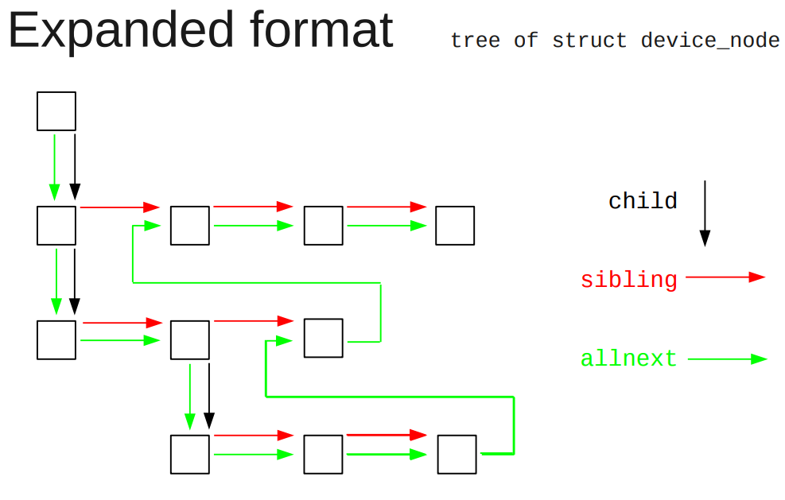
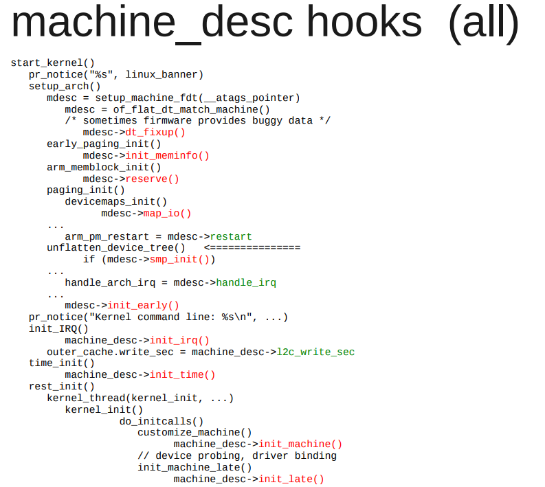
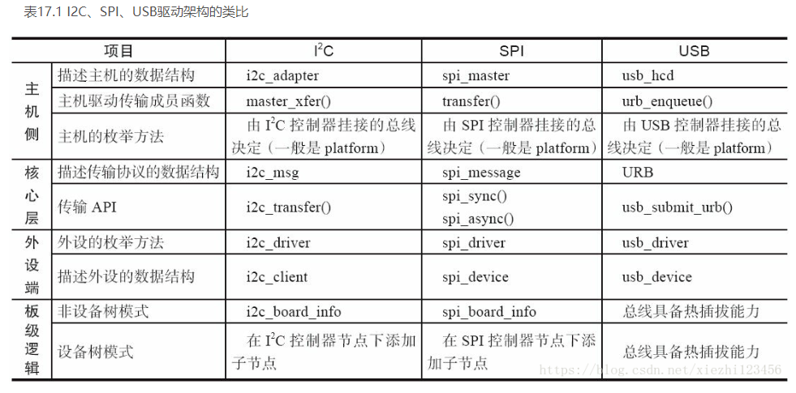

- [MSI中断](#msi中断)
- [I2C驱动轮询导致CPU占用过高问题](#i2c驱动轮询导致cpu占用过高问题)
  - [原始代码](#原始代码)
  - [如何解决](#如何解决)
- [dts删除node和属性](#dts删除node和属性)
- [simple-bus和平台驱动](#simple-bus和平台驱动)
  - [dts](#dts)
  - [dtb格式和和dtb在启动流程中的作用](#dtb格式和和dtb在启动流程中的作用)
  - [dtb树在kernel下的组织形式](#dtb树在kernel下的组织形式)
  - [of api](#of-api)
  - [启动流程](#启动流程)
  - [平台设备初始化](#平台设备初始化)
  - [参考](#参考)
- [I2C SPI USB驱动架构对比](#i2c-spi-usb驱动架构对比)
- [USB的一点理解](#usb的一点理解)
- [关于aio](#关于aio)
  - [libc提供的aio](#libc提供的aio)
  - [内核通过libaio提供的接口](#内核通过libaio提供的接口)
- [关于signal通知](#关于signal通知)
- [关于poll](#关于poll)
- [关于kobject_uevent](#关于kobject_uevent)
  - [调用用户空间可执行程序](#调用用户空间可执行程序)
- [关于initcall](#关于initcall)
- [completion底层用的是wait_queue](#completion底层用的是wait_queue)
  - [定义](#定义)
  - [不是说spin_lock里面不能休眠吗? 为什么这里要休眠?](#不是说spin_lock里面不能休眠吗-为什么这里要休眠)
    - [解答: 在其子函数里, 在休眠之前, 要先解锁自旋锁](#解答-在其子函数里-在休眠之前-要先解锁自旋锁)
- [waitqueue](#waitqueue)
  - [声明](#声明)
  - [等待API](#等待api)
  - [唤醒API](#唤醒api)
- [kobject kypte kset和sysfs](#kobject-kypte-kset和sysfs)
  - [kobject](#kobject)
  - [kobj_type](#kobj_type)
  - [kset](#kset)
  - [相关函数](#相关函数)
- [创建链接](#创建链接)
- [bus device和driver](#bus-device和driver)
  - [一个PCI的例子](#一个pci的例子)
  - [bus](#bus)
    - [注册bus, 以ldd bus为例](#注册bus-以ldd-bus为例)
    - [辅助函数](#辅助函数)
  - [device](#device)
    - [device注册](#device注册)
    - [device_register里面会创建设备文件(如果有MAJOR(dev->devt))](#device_register里面会创建设备文件如果有majordev-devt)
    - [device属性](#device属性)
  - [driver](#driver)
    - [但是driver的读写呢?](#但是driver的读写呢)
  - [class](#class)
    - [简单接口](#简单接口)
    - [全功能接口](#全功能接口)
      - [向class添加设备](#向class添加设备)
- [udev](#udev)
- [firmware](#firmware)
- [devtmpfs](#devtmpfs)
  - [历史演进](#历史演进)
    - [Linux2.4之前手动mknod](#linux24之前手动mknod)
    - [Linux2.6.17之前内核devfs](#linux2617之前内核devfs)
    - [Linux2.6.29内核udev](#linux2629内核udev)
  - [介绍](#介绍)
  - [相关代码](#相关代码)
    - [初始化](#初始化)
    - [内核线程](#内核线程)
    - [和用户交互](#和用户交互)
    - [创建设备文件](#创建设备文件)
    - [devtmpfs底层用shmem fs](#devtmpfs底层用shmem-fs)
    - [设备文件如何被open](#设备文件如何被open)
    - [二次mount](#二次mount)
    - [kdevtmpfs进程的对外接口](#kdevtmpfs进程的对外接口)

# MSI中断
微软的windows kernel mode driver的文档, 对MSI的描述很精确:
> devices that use MSIs trigger an interrupt by **writing a value** to a **particular memory address**.

对一个特殊的地址写一个值, 就是MSI

> An _interrupt message_ is a particular value that a device writes to a particular address to trigger an interrupt. Unlike line-based interrupts, message-signaled interrupts have edge semantics. The device sends a message but does not receive any hardware acknowledgment that the interrupt was received.

写这个值的过程, 就是组一个interrupt msg, 写到特定地址

> For PCI 2.2, a message consists of an address and a partially opaque 16-bit value. Each device is assigned a single address. To send multiple messages, the device can use the lower 4 bits of the message value to distinguish messages. Therefore, for PCI 2.2, devices can support up to 16 messages.

> For PCI 3.0, a message consists of an address and an opaque 32-bit value. Each different message has its own unique address. Unlike for PCI 2.2, the device does not modify the value. For PCI 3.0, a device can support up to 2,048 different messages. Devices that support PCI 3.0 MSI-X feature a dynamically programmable hardware table that contains entries for each of the interrupt sources in the device. Each entry in this table can be programmed with one of the messages that are allocated to a device, and can be independently masked. Drivers can change the programming of an interrupt message into a table entry and whether an entry has been masked.

# I2C驱动轮询导致CPU占用过高问题
> 在板子上读I2C的时候, 发现在代码里面, 循环里不断去读状态寄存器, 导致CPU load过高. 那么如何降低CPU占用?

## 原始代码
```c
    while(!((cpld_i2c_regs_read(i2c, cpld_i2c_regs[STATUS_ID]) & IIC_WRITE_OK) == IIC_WRITE_OK)) {
        schedule();
        if (time_after(jiffies, orig_jiffies + timeout)) {
            dev_dbg(i2c->dev, "poll timeout\n");
            result = -EIO;
            break;
        }
    }
```
这里的代码, 在循环里不断的检查寄存器状态, 直到状态是OK. 不OK就调用`schedule()`, 似乎逻辑没问题, 但这个`task`还是在`run queue`里面, 即使调用了`schedule()`, 这个任务还是会回来继续运行, 最后导致CPU load高.

这个问题在写代码的时候很难察觉, 但其实可以通过压力测试来发现CPU load高的问题.

## 如何解决
思路是不要让任务一直处于running状态, 利用`wait_queue`等系列函数来让这个task休眠.
但在休眠的时候, 还要检查寄存器的condition, OK了就退出休眠状态.

要用到`wait_event_timeout()`
这个函数配合内核定时器, 就能完成任务
```c
#include <linux/wait.h>
//在给定的wait queue休眠timeout个jiffies.
//进程被wake_up唤醒时, 检查condition, 为假就继续等待.
long wait_event_timeout(wait_queue_head_t q, condition, long timeout);
long wait_event_interruptible_timeout(wait_queue_head_t q,
                      condition, long timeout);
```

* 在wait queue上等待condition, 一直没有就等到timeout
* 新建内核定时器, 定时的wakeup这个wait queue
* 任务被timer唤醒的时候还在wait_event_timeout里面, 检查condition, 为假则继续睡眠
* condition为真或者timeout则退出等待.

参考: [内核中的时间和延迟操作](device_driver_内核中的时间和延迟操作.md)

# dts删除node和属性
```c
/delete-node/ &dcsr;
/delete-node/ &cpu1;
/delete-property/ dcsr;
```

# simple-bus和平台驱动

## dts
dts是device tree的描述格式. 一般是`xxx.dts`. `.dts`被dtc编译成二进制形式`.dtb`  
比如  
  

又比如:  
  
这里面有:
* node: 一个树的节点, 里面有属性, 也可以有其他子node
* properties: 所属node的属性
* / : 根节点
* 其他node: 匹配驱动用的.

## dtb格式和和dtb在启动流程中的作用
  

dtb被boot传递给linux, 用来描述设备  
  

dtb有两种形态
* flattened device tree: 是"flat"形式的, 用`fdt_*()`函数访问  
在`unflatten_device_tree()`函数执行前用
* tree format: 树格式的, 用`of_*()`函数访问  
在`unflatten_device_tree()`函数执行后用

## dtb树在kernel下的组织形式
  
  

allnext指针会把所有node都串起来  
  

## of api
```c
of_find_node_by_name (*from, …)
of_find_node_by_type (*from, …)
of_find_node_by_phandle (handle)
of_find_node_with_property (*from, …)
```

## 启动流程
代码里, 宏`DT_MACHINE_START`指定machine的compatible  
  

在这里的最后, `rest_init()`启动第一个内核线程, 来做大部分的初始化.
```c
char *initcall_level_names[] = {
    "early",
    "core",
    "postcore",
    "arch",
    "subsys",
    "fs",
    "device",
    "late",
}
```
init call是有顺序的, 可以用下面的宏, 在代码里添加一个要被initcall的函数.  
参考: `驱动杂记: 关于initcall`
```c
//在SMP初始化之前跑的
#define early_initcall(fn)          __define_initcall(fn, early)
//这里只应该初始化一些变量
#define pure_initcall(fn)           __define_initcall(fn, 0)
#define core_initcall(fn)           __define_initcall(fn, 1)
#define core_initcall_sync(fn)      __define_initcall(fn, 1s)
#define postcore_initcall(fn)       __define_initcall(fn, 2)
#define postcore_initcall_sync(fn)  __define_initcall(fn, 2s)
#define arch_initcall(fn)           __define_initcall(fn, 3)
#define arch_initcall_sync(fn)      __define_initcall(fn, 3s)
#define subsys_initcall(fn)         __define_initcall(fn, 4)
#define subsys_initcall_sync(fn)    __define_initcall(fn, 4s)
#define fs_initcall(fn)             __define_initcall(fn, 5)
#define fs_initcall_sync(fn)        __define_initcall(fn, 5s)
#define rootfs_initcall(fn)         __define_initcall(fn, rootfs)
#define device_initcall(fn)         __define_initcall(fn, 6)
#define device_initcall_sync(fn)    __define_initcall(fn, 6s)
#define late_initcall(fn)           __define_initcall(fn, 7)
#define late_initcall_sync(fn)      __define_initcall(fn, 7s)
#define __initcall(fn)              device_initcall(fn)
#define __exitcall(fn)                        \
    static exitcall_t __exitcall_##fn __exit_call = fn
#define console_initcall(fn)    ___define_initcall(fn,, .con_initcall)
```

## 平台设备初始化
`of_platform_populate()`就是在initcall里执行的.  
对根节点下面的每个node, 调用`of_platform_bus_create()`; 而后者创建设备, 对子node递归调用自己.  
代码在`drivers/of/platform.c`  
  

详细版本:  
  

注意:
* `"simple-bus"`是默认的匹配
* 如果子node**没有**`compatible`, 不会创建device.
* 尝试driver和device的binding

----
这里就会尝试绑定driver和device的关系  
但在`of_platform_populate()`调用的时候, 只有不多的驱动加载了:
* 驱动调用了`core_initcall()`或者`postcore_initcall()`, 并在其内部调用了`platform_driver_register()`
* 驱动调用了`arch_initcall()`, 并在里面调用了`platform_driver_register()`;

----
非平台设备不受`of_platform_populate()`的影响, 比如:
* i2c设备
* 其他soc设备

这些设备通常由它们的bus设备负责probe.

## 参考
* [dt_internals.pdf](http://events17.linuxfoundation.org/sites/events/files/slides/dt_internals.pdf)
* [petazzoni-device-tree-dummies.pdf](https://events.static.linuxfound.org/sites/events/files/slides/petazzoni-device-tree-dummies.pdf)

# I2C SPI USB驱动架构对比
  

# USB的一点理解
和i2c框架一样, usb也是分层的.  

在设备驱动侧, 在probe里面可以注册字符设备:
`usb_register_dev()`  
这里面就包括了fops, 关键是fops的读写, 都调用usb的通用接口:
`usb_alloc_urb()` 
`usb_submit_urb()`  
就和i2c和spi的client的读写调用`i2c_transfer()`一样

I2C的控制器叫adapter, I2C的设备比如eeprom叫client

# 关于aio
## libc提供的aio
aio是异步io, 是libc提供的接口:
* `include <aio.h>`
* `struct aiocb //aio控制块, 所有操作基于它`
* `aio_read()`
* `aio_write()`
* `aio_error()`
* `aio_return() //因为是异步调用, read write都是直接返回的, 那就需要这个函数来检查返回值, 通常是在while循环里面检测.`
* `aio_suspend()`
* `aio_cancel()`
* `lio_listio()`

## 内核通过libaio提供的接口
* `include <libaio.h>`
* `io_setup()`
* `io_destroy()`
* `io_submit()`
* `io_cancel()`
* 等等

# 关于signal通知
驱动可以用signal的方式"通知"用户程序, 资源到位, 可以读写了.
可以参考:
* `fasync_helper()`
* `kill_fasync()`


# 关于poll
select或者poll或这epoll这类的多路选择接口, 在fd可读写的时候返回;
驱动需要实现`fops->poll()`接口
```c
static unsigned int xxx_poll(struct file * filp, poll_table *wait)
{
	unsigned int mask = 0;
	struct xxx_dev *dev= filp->private_data;
	
	...
	poll_wait(filep, &dev->r_wait, wait);   //加入读等待队列
	poll_wait(filep, &dev->w_wait, wait)    //加入写等待队列
	
	if(...)	//可读
		mask |= POLLIN | POLLRDNORM;    //返回可读标记
	if(...) //可写
		mask |= POLLOUT | POLLWRNORM    //返回可写标记
	
	...
	return mask;
}
```

用户进程调用epoll的时候, 每个fd的`fops->poll()`被调用, 对driver来说, 就是`xxx_poll`被调用, `poll_wait`把`struct file * filep`加入到`poll_table * wait`, 这样用户进程就在一个地方block住, 等待多个fd就绪.

比如LDD3 中的例子:
```c
static unsigned int scull_p_poll(struct file *filp, poll_table *wait)
{
    struct scull_pipe *dev = filp->private_data;
    unsigned int mask = 0;

    /*
     * The buffer is circular; it is considered full
     * if "wp" is right behind "rp" and empty if the
     * two are equal.
     */
    down(&dev->sem);
    poll_wait(filp, &dev->inq,  wait);
    poll_wait(filp, &dev->outq, wait);
    if (dev->rp != dev->wp)
        mask |= POLLIN | POLLRDNORM;    /* readable */
    if (spacefree(dev))
        mask |= POLLOUT | POLLWRNORM;   /* writable */
    up(&dev->sem);
    return mask;
}
```

# 关于kobject_uevent
比如在`device_add()`中, 会调用`kobject_uevent(&dev->kobj, KOBJ_ADD)`, 向用户空间发消息, 消息通过netlink发送. 

`kobject_uevent()`里面会调用`call_usermodehelper_setup()`来执行一个用户空间的程序, 好像是`sbin/mdev`(busybox自带的简化版udev)
事件的种类如下:

```c
enum kobject_action {
	KOBJ_ADD,
	KOBJ_REMOVE,
	KOBJ_CHANGE,
	KOBJ_MOVE,
	KOBJ_ONLINE,
	KOBJ_OFFLINE,
	KOBJ_BIND,
	KOBJ_UNBIND,
	KOBJ_MAX
};
```

## 调用用户空间可执行程序
```c
//notify userspace by sending an uevent
kobject_uevent(struct kobject *kobj, enum kobject_action action)
	//send an uevent with environmental data
	kobject_uevent_env(kobj, action, NULL)
		如果有uevent_suppress, 跳过
		如果被filter了, 跳过
		找path
		add_uevent_var(env, "SEQNUM=%llu", ++uevent_seqnum)
		kobject_uevent_net_broadcast(kobj, env, action_string,devpath)
		//CONFIG_UEVENT_HELPER通常是y, path是/sbin/hotplug
		info = call_usermodehelper_setup(env->argv[0], env->argv,env->envp, GFP_KERNEL,NULL, cleanup_uevent_env, env)
			//真正的work是call_usermodehelper_exec_work
			INIT_WORK(&sub_info->work, call_usermodehelper_exec_work)
		call_usermodehelper_exec(info, UMH_NO_WAIT)
			//交给work queue线程去做
			queue_work(system_unbound_wq, &sub_info->work)
			//等待完成
			wait_for_completion_killable(&done)
			
			
system_unbound_wq线程:
	//执行
	call_usermodehelper_exec_work(struct work_struct *work)
		//先找到subprocess_info *sub_info
		container_of(work, struct subprocess_info, work)
		call_usermodehelper_exec_sync(sub_info);
			kernel_thread(call_usermodehelper_exec_async, sub_info, SIGCHLD)
				//真正执行
				do_execve(getname_kernel()
```

# 关于initcall
initcall宏的作用是, 把传入的fn, 当作常量, 放到.init段.  
常量名类似:  
`__initcall_##fn0 = fn`  
`__initcall_##fn1 = fn`  

比如`device_initcall(amd_iommu_pc_init);`  
就是  
`__initcall_amd_iommu_pc_init6 = amd_iommu_pc_init`  
其中 `0 1 2 3 4 5 6 7`是不同的组, 从序号上表明了不同组有不同的调用次序. 

同一个组里的调用次序由linker在链接时决定. 可以改链接脚本来控制吗?

代码在`include/linux/init.h`
```c
//在SMP初始化之前跑的
#define early_initcall(fn)          __define_initcall(fn, early)
//这里只应该初始化一些变量
#define pure_initcall(fn            __define_initcall(fn, 0)

#define core_initcall(fn)           __define_initcall(fn, 1)
#define core_initcall_sync(fn)      __define_initcall(fn, 1s)
#define postcore_initcall(fn)       __define_initcall(fn, 2)
#define postcore_initcall_sync(fn)  __define_initcall(fn, 2s)
#define arch_initcall(fn)           __define_initcall(fn, 3)
#define arch_initcall_sync(fn)      __define_initcall(fn, 3s)
#define subsys_initcall(fn)         __define_initcall(fn, 4)
#define subsys_initcall_sync(fn)    __define_initcall(fn, 4s)
#define fs_initcall(fn)             __define_initcall(fn, 5)
#define fs_initcall_sync(fn)        __define_initcall(fn, 5s)
#define rootfs_initcall(fn)         __define_initcall(fn, rootfs)
#define device_initcall(fn)         __define_initcall(fn, 6)
#define device_initcall_sync(fn)    __define_initcall(fn, 6s)
#define late_initcall(fn)           __define_initcall(fn, 7)
#define late_initcall_sync(fn)      __define_initcall(fn, 7s)

#define __initcall(fn) device_initcall(fn)

#define __exitcall(fn)						\
	static exitcall_t __exitcall_##fn __exit_call = fn

#define console_initcall(fn)	___define_initcall(fn,, .con_initcall)

```

# completion底层用的是wait_queue
## 定义
```c
/*
 * struct completion - structure used to maintain state for a "completion"
 *
 * This is the opaque structure used to maintain the state for a "completion".
 * Completions currently use a FIFO to queue threads that have to wait for
 * the "completion" event.
 *
 * See also:  complete(), wait_for_completion() (and friends _timeout,
 * _interruptible, _interruptible_timeout, and _killable), init_completion(),
 * reinit_completion(), and macros DECLARE_COMPLETION(),
 * DECLARE_COMPLETION_ONSTACK().
 */
struct completion {
	unsigned int done;
	wait_queue_head_t wait;
};
```

## 不是说spin_lock里面不能休眠吗? 为什么这里要休眠?
```c
static inline long __sched
__wait_for_common(struct completion *x,
		  long (*action)(long), long timeout, int state)
{
	might_sleep();
	complete_acquire(x);
	spin_lock_irq(&x->wait.lock);
	//这里的action是个函数schedule_timeout()
	timeout = do_wait_for_common(x, action, timeout, state);
	spin_unlock_irq(&x->wait.lock);
	complete_release(x);
	return timeout;
}
```

### 解答: 在其子函数里, 在休眠之前, 要先解锁自旋锁
```c
static inline long __sched
do_wait_for_common(struct completion *x,
		   long (*action)(long), long timeout, int state)
{
	if (!x->done) {
		DECLARE_WAITQUEUE(wait, current);

		__add_wait_queue_entry_tail_exclusive(&x->wait, &wait);
		do {
			if (signal_pending_state(state, current)) {
				timeout = -ERESTARTSYS;
				break;
			}
			__set_current_state(state);
			//在这里, 在action之前, 先解锁; -- 那到底锁了什么? 保护链表?
			spin_unlock_irq(&x->wait.lock);
			timeout = action(timeout);
			spin_lock_irq(&x->wait.lock);
		} while (!x->done && timeout);
		__remove_wait_queue(&x->wait, &wait);
		if (!x->done)
			return timeout;
	}
	if (x->done != UINT_MAX)
		x->done--;
	return timeout ?: 1;
}
```

# waitqueue
Linux的睡眠用的是waitqueue

>In Linux sleeping is handled by a data structure called wait queue, which is nothing but a list of processes waiting for an input or  event.  

## 声明
* 静态方式  

```c
DECLARE_WAIT_QUEUE_HEAD(name); 
DECLARE_WAITQUEUE(name, tsk)
```

* 动态的方式:

```c
wait_queue_head_t my_queue;
init_waitqueue_head(name);
init_waitqueue_entry(struct wait_queue_entry *wq_entry, struct task_struct *p)

//节点
struct wait_queue_entry {
	unsigned int		flags;
	void			*private;	//这里的private保存的是任务的task指针
	wait_queue_func_t	func;
	struct list_head	entry;
};

//链表头
struct wait_queue_head {
	spinlock_t		lock;
	struct list_head	head;
};
typedef struct wait_queue_head wait_queue_head_t;
```

这里的name就是队列的名字, 任务被放到里面睡眠.  
`void add_wait_queue(struct wait_queue_head *wq_head, struct wait_queue_entry *wq_entry)`

## 等待API
* `wait_event("queue","condition")`: 任务在queue里等待condition变为ture. 任务在睡眠期间不能被中断.
* `wait_event_interruptible("queue","condition")`: 和上面类似, 但任务可以被打断.
* `wait_event_timeout("queue","condition","timeout")`: 带超时的wait_event
* `wait_event_interruptible_timeout("queue","condition","timeout")`: 带超时, 能被打断.

这里的condition是个C的表达式.

## 唤醒API
* `wake_up(queue)`
* `wake_up_interruptible (queue)`

# kobject kypte kset和sysfs
## kobject 
表现为sysfs的一个目录, 目录名就是kobject的name, 在其parent目录下, 或者其kset目录下. 被嵌入到其他结构体中, 负责把linux设备link together, 并提供引用计数等功能.
```c
struct kobject {
    const char	*name;
    struct list_head	entry;
    struct kobject	*parent;
    struct kset	*kset;
    struct kobj_type	*ktype;
    struct sysfs_dirent	*sd;
    struct kref	kref;
    unsigned int state_initialized:1;
    unsigned int state_in_sysfs:1;
    unsigned int state_add_uevent_sent:1;
    unsigned int state_remove_uevent_sent:1;
    unsigned int uevent_suppress:1;
};
```
## kobj_type 
当kobject的引用计数减为0时, release被调用.  
default_attrs是个数组, 表示为sysfs目录下的文件; 一般都是human readable的txt格式.  
syfs_ops控制default_attrs文件的读写.
```c
struct kobj_type {
    void (*release)(struct kobject *kobj);
    const struct sysfs_ops *sysfs_ops;
    struct attribute **default_attrs;
    const struct kobj_ns_type_operations *(*child_ns_type)(struct kobject *kobj);
    const void *(*namespace)(struct kobject *kobj);
} __do_const;

struct sysfs_ops {
    ssize_t	(*show)(struct kobject *, struct attribute *,char *);
    ssize_t	(*store)(struct kobject *,struct attribute *,const char *, size_t);
    const void *(*namespace)(struct kobject *, const struct attribute *);
};
```

```c
// attr也可以是二进制格式, 比如firmware下载到device需要这个格式.
struct bin_attribute {
    struct attribute attr;
    size_t size;
    ssize_t (*read)(struct kobject *kobj, char *buffer, 
                    loff_t pos, size_t size);
    ssize_t (*write)(struct kobject *kobj, char *buffer, 
                    loff_t pos, size_t size);
};

// 二进制的attr的创建函数
int sysfs_create_bin_file(struct kobject *kobj, 
                          struct bin_attribute *attr);
```

## kset 

```c
struct kset {
    struct list_head list;
    spinlock_t list_lock;
    struct kobject kobj;
    const struct kset_uevent_ops *uevent_ops;
};
```

## 相关函数

* `int kobject_add(struct kobject *kobj, struct kobject *parent, const char *fmt, ...)`: // 在sysfs创建新的文件夹, 会产生热插拔事件, 导致用户态的进程/sbin/hotplug被调用.
* `int sysfs_create_file(struct kobject *kobj, struct attribute *attr);` // 在sysfs的kobject目录下增加新的attr文件, 但需要show和store方法认识这个新的attr

# 创建链接
```c
int sysfs_create_link(struct kobject *kobj, struct kobject *target, char *name);
```

# bus device和driver
## 一个PCI的例子
```bash
$ tree /sys/bus/pci
/sys/bus/pci/
|-- devices
| |-- 0000:00:00.0 -> ../../../devices/pci0000:00/0000:00:00.0
| |-- 0000:00:00.1 -> ../../../devices/pci0000:00/0000:00:00.1
| |-- 0000:00:00.2 -> ../../../devices/pci0000:00/0000:00:00.2
| |-- 0000:00:02.0 -> ../../../devices/pci0000:00/0000:00:02.0
| |-- 0000:00:04.0 -> ../../../devices/pci0000:00/0000:00:04.0
| |-- 0000:00:06.0 -> ../../../devices/pci0000:00/0000:00:06.0
| |-- 0000:00:07.0 -> ../../../devices/pci0000:00/0000:00:07.0
| |-- 0000:00:09.0 -> ../../../devices/pci0000:00/0000:00:09.0
| |-- 0000:00:09.1 -> ../../../devices/pci0000:00/0000:00:09.1
| |-- 0000:00:09.2 -> ../../../devices/pci0000:00/0000:00:09.2
| |-- 0000:00:0c.0 -> ../../../devices/pci0000:00/0000:00:0c.0
| |-- 0000:00:0f.0 -> ../../../devices/pci0000:00/0000:00:0f.0
| |-- 0000:00:10.0 -> ../../../devices/pci0000:00/0000:00:10.0
| |-- 0000:00:12.0 -> ../../../devices/pci0000:00/0000:00:12.0
| |-- 0000:00:13.0 -> ../../../devices/pci0000:00/0000:00:13.0
| `-- 0000:00:14.0 -> ../../../devices/pci0000:00/0000:00:14.0
`-- drivers
    |-- ALI15x3_IDE
    | `-- 0000:00:0f.0 -> ../../../../devices/pci0000:00/0000:00:0f.0
    |-- ehci_hcd
    | `-- 0000:00:09.2 -> ../../../../devices/pci0000:00/0000:00:09.2
    |-- ohci_hcd
    | |-- 0000:00:02.0 -> ../../../../devices/pci0000:00/0000:00:02.0
    | |-- 0000:00:09.0 -> ../../../../devices/pci0000:00/0000:00:09.0
    | `-- 0000:00:09.1 -> ../../../../devices/pci0000:00/0000:00:09.1
    |-- orinoco_pci
    | `-- 0000:00:12.0 -> ../../../../devices/pci0000:00/0000:00:12.0
    |-- radeonfb
    | `-- 0000:00:14.0 -> ../../../../devices/pci0000:00/0000:00:14.0
    |-- serial
    `-- trident
        `-- 0000:00:04.0 -> ../../../../devices/pci0000:00/0000:00:04
```

## bus
即使是CPU内部的platform bus也是bus, bus也可以是其他bus的device, 比如USB控制器一般也是挂在PCI bus上的设备.
```c
//kernel 2.6, LDD的例子
struct bus_type {
    char *name;
    struct subsystem subsys; //在/sys/bus下面
    struct kset drivers;
    struct kset devices;
	//每次device或者driver被加到这个bus上, match都会被调用.
    int (*match)(struct device *dev, struct device_driver *drv); 
    struct device * (*add)(struct device * parent, char * bus_id);
    int (*hotplug) (struct device *dev, char **envp, 
                    int num_envp, char *buffer, int buffer_size);
    /* Some fields omitted */
};

//kernel 5.2
struct bus_type {
	const char		*name;
	const char		*dev_name;
	struct device		*dev_root;
	const struct attribute_group **bus_groups;
	const struct attribute_group **dev_groups;
	const struct attribute_group **drv_groups;
	//每当device或driver加入的时候被调用
	int (*match)(struct device *dev, struct device_driver *drv);
	//设备被添加或移除时调用
	int (*uevent)(struct device *dev, struct kobj_uevent_env *env);
	//match后, 设备或驱动被add到bus时调用, 它随后调用driver的probe
	int (*probe)(struct device *dev);
	int (*remove)(struct device *dev);
	void (*shutdown)(struct device *dev);

	int (*online)(struct device *dev);
	int (*offline)(struct device *dev);

	int (*suspend)(struct device *dev, pm_message_t state);
	int (*resume)(struct device *dev);

	int (*num_vf)(struct device *dev);

	int (*dma_configure)(struct device *dev);

	const struct dev_pm_ops *pm;

	const struct iommu_ops *iommu_ops;

	struct subsys_private *p;
	struct lock_class_key lock_key;

	bool need_parent_lock;
};

```
### 注册bus, 以ldd bus为例
```c
struct bus_type ldd_bus_type = {
    .name = "ldd",
    .match = ldd_match,
    .hotplug = ldd_hotplug,
};

// >>== 注册 ==<<
ret = bus_register(&ldd_bus_type);
if (ret)
    return ret;

//每次device或者driver被加到这个bus上, match都会被调用.
static int ldd_match(struct device *dev, struct device_driver *driver)
{
    return !strncmp(dev->bus_id, driver->name, strlen(driver->name));
}

// >>== hotplug ==<<
static int ldd_hotplug(struct device *dev, char **envp, int num_envp,
        char *buffer, int buffer_size)
{
    envp[0] = buffer;
    if (snprintf(buffer, buffer_size, "LDDBUS_VERSION=%s",
                Version) >= buffer_size)
        return -ENOMEM;
    envp[1] = NULL;
    return 0;
}
```

### 辅助函数
```c
int bus_for_each_dev(struct bus_type *bus, struct device *start, 
                     void *data, int (*fn)(struct device *, void *));
int bus_for_each_drv(struct bus_type *bus, struct device_driver *start, 
                     void *data, int (*fn)(struct device_driver *, void *));

struct bus_attribute {
    struct attribute attr;
    ssize_t (*show)(struct bus_type *bus, char *buf);
    ssize_t (*store)(struct bus_type *bus, const char *buf, 
                     size_t count);
};

int bus_create_file(struct bus_type *bus, struct bus_attribute *attr);
```

## device
```c
struct device {
    struct device *parent; //父设备, 通常是bus或bus controller
    struct kobject kobj; //device->kobj->parent is equal to &device->parent->kobj.
    char bus_id[BUS_ID_SIZE]; //设备在bus上的id, 比如PCI设备的domain, bus, device, and function numbers
    struct bus_type *bus; //设备所在的bus
    struct device_driver *driver; //设备的驱动
    void *driver_data;
    void (*release)(struct device *dev); //引用计数为0时被调用, 由其内建的kobj的release()方法调用
    /* Several fields omitted */
};
```

### device注册
```c
static void ldd_bus_release(struct device *dev)
{
    printk(KERN_DEBUG "lddbus release\n");
}
    
struct device ldd_bus = {
    .bus_id = "ldd0",
    .release = ldd_bus_release
};

ret = device_register(&ldd_bus);
if (ret)
    printk(KERN_NOTICE "Unable to register ldd0\n");
```
通常, 描述一个设备, 只包含device结构体是不够的, 很多设备都有自己的额外信息.
```c
struct ldd_device {
    char *name;
    struct ldd_driver *driver;
    struct device dev; // 通常的做法是把struct device嵌进来.
};

#define to_ldd_device(dev) container_of(dev, struct ldd_device, dev);
```
所以, 通常的设备注册是这样:
```c
int register_ldd_device(struct ldd_device *ldddev)
{
    ldddev->dev.bus = &ldd_bus_type;
    ldddev->dev.parent = &ldd_bus;
    ldddev->dev.release = ldd_dev_release;
    strncpy(ldddev->dev.bus_id, ldddev->name, BUS_ID_SIZE);
    return device_register(&ldddev->dev);
}
EXPORT_SYMBOL(register_ldd_device);
```

### device_register里面会创建设备文件(如果有MAJOR(dev->devt))
```c
int device_register(struct device *dev)
{
	device_initialize(dev);
	device_add(dev);
	{
		if (MAJOR(dev->devt)) {
			device_create_file(dev, &dev_attr_dev);
			device_create_sys_dev_entry(dev);
			//创建设备节点
			devtmpfs_create_node(dev);
		}
	}
}
```

### device属性
```c
struct device_attribute {
    struct attribute attr;
    ssize_t (*show)(struct device *dev, char *buf);
    ssize_t (*store)(struct device *dev, const char *buf, 
                     size_t count);
};
DEVICE_ATTR(name, mode, show, store);
int device_create_file(struct device *device, 
                       struct device_attribute *entry);
void device_remove_file(struct device *dev, 
                        struct device_attribute *attr);
```

## driver
驱动结构体和函数
```c
struct device_driver {
    char *name;
    struct bus_type *bus;
    struct kobject kobj;
    struct list_head devices; //所有绑定在这个driver下面的设备
    int (*probe)(struct device *dev); //在总线层面成功match后, probe会被调用
    int (*remove)(struct device *dev);
    void (*shutdown) (struct device *dev);
};

//注册
int driver_register(struct device_driver *drv);
void driver_unregister(struct device_driver *drv);

//属性
struct driver_attribute {
    struct attribute attr;
    ssize_t (*show)(struct device_driver *drv, char *buf);
    ssize_t (*store)(struct device_driver *drv, const char *buf, 
                     size_t count);
};
DRIVER_ATTR(name, mode, show, store);

//sysfs文件
int driver_create_file(struct device_driver *drv, 
                       struct driver_attribute *attr);
void driver_remove_file(struct device_driver *drv, 
                        struct driver_attribute *attr);
```

类似的, 通用driver结构体被嵌入到更高一层的设备specific结构体中, 比如
```c
struct ldd_driver {
    char *version;
    struct module *module;
    struct device_driver driver;
    struct driver_attribute version_attr;
};

#define to_ldd_driver(drv) container_of(drv, struct ldd_driver, driver);

int register_ldd_driver(struct ldd_driver *driver)
{
    int ret;
    
    driver->driver.bus = &ldd_bus_type;
    ret = driver_register(&driver->driver);
    if (ret)
        return ret;
    driver->version_attr.attr.name = "version";
    driver->version_attr.attr.owner = driver->module;
    driver->version_attr.attr.mode = S_IRUGO;
    driver->version_attr.show = show_version;
    driver->version_attr.store = NULL;
    return driver_create_file(&driver->driver, &driver->version_attr);
}
static ssize_t show_version(struct device_driver *driver, char *buf)
{
    struct ldd_driver *ldriver = to_ldd_driver(driver);

    sprintf(buf, "%s\n", ldriver->version);
    return strlen(buf);
}
static struct ldd_driver sculld_driver = {
    .version = "$Revision: 1.1 $",
    .module = THIS_MODULE,
    .driver = {
        .name = "sculld",
    },
};
```

在sysfs中是这样:
```bash
$ tree /sys/bus/ldd/drivers
/sys/bus/ldd/drivers
`-- sculld
    |-- sculld0 -> ../../../../devices/ldd0/sculld0
    |-- sculld1 -> ../../../../devices/ldd0/sculld1
    |-- sculld2 -> ../../../../devices/ldd0/sculld2
    |-- sculld3 -> ../../../../devices/ldd0/sculld3
    `-- version
```

### 但是driver的读写呢?
是靠设备文件吗? /dev/xxx 又是谁来创建的呢?
--部分分析在下面小节 devtmpfs下面的设备节点的open

## class
class是对设备的更高级别的抽象, 是同类设备的集合. 比如SCSI磁盘和ATA磁盘都是磁盘, class让用户使用时, 不关心它们怎么连接的, 只关心它们的功能.  
> users care about what they do, rather than how they are connected and how they work.

比如:
* 网络接口`/sys/class/net`
* 输入设备`/sys/class/input`
* 串口设备`/sys/class/tty`
* 块设备`/sys/block`, 历史原因才叫这个

### 简单接口
```c
//简单的创建一个新的class
struct class_simple *class_simple_create(struct module *owner, char *name);
//向这个class添加device, 会建立链接到/sys/devices
struct class_device *class_simple_device_add(struct class_simple *cs,
                                             dev_t devnum, //MKDEV(FOO_MAJOR, minor)
                                             struct device *device,
                                             const char *fmt, ...);
```

### 全功能接口
```c
struct class {
    char *name;
    struct class_attribute *class_attrs;
    struct class_device_attribute *class_dev_attrs;
    int (*hotplug)(struct class_device *dev, char **envp, 
                   int num_envp, char *buffer, int buffer_size);
    void (*release)(struct class_device *dev); //设备移出class时调用
    void (*class_release)(struct class *class); //class自己释放时调用
    /* Some fields omitted */
};

int class_register(struct class *cls);
void class_unregister(struct class *cls);

struct class_attribute {
    struct attribute attr;
    ssize_t (*show)(struct class *cls, char *buf);
    ssize_t (*store)(struct class *cls, const char *buf, size_t count);
};

CLASS_ATTR(name, mode, show, store);

int class_create_file(struct class *cls, 
                      const struct class_attribute *attr);
void class_remove_file(struct class *cls, 
                       const struct class_attribute *attr);
```

#### 向class添加设备
class的作用就是让类似的设备加入进来, 
```c
struct class_device {
    struct kobject kobj;
    struct class *class; 
    struct device *dev; //指向那个设备的, 会建链接到设备
    void *class_data;
    char class_id[BUS_ID_SIZE]; //这个设备的名字, 体现在sysfs下面
};

// 添加device到class
int class_device_register(struct class_device *cd);
void class_device_unregister(struct class_device *cd);

// 还可以重命名
int class_device_rename(struct class_device *cd, char *new_name);

// 属性
struct class_device_attribute {
   struct attribute attr;
   ssize_t (*show)(struct class_device *cls, char *buf);
   ssize_t (*store)(struct class_device *cls, const char *buf, 
                    size_t count);
};

CLASS_DEVICE_ATTR(name, mode, show, store);

int class_device_create_file(struct class_device *cls, 
                             const struct class_device_attribute *attr);
void class_device_remove_file(struct class_device *cls, 
                              const struct class_device_attribute *attr);

// class支持注册接口, 在device被加入或移出时调用, 通常用来对device做额外的setup工作, 比如添加一些属性啥的.
struct class_interface {
    struct class *class;
    int (*add) (struct class_device *cd);
    void (*remove) (struct class_device *cd);
};
int class_interface_register(struct class_interface *intf);
void class_interface_unregister(struct class_interface *intf);
```

# udev
管理`/dev`目录树, 以前是`devfs`, 但`devfs`比较烂, 比如它需要在`kernel`空间定义好`/dev`下面的命名规则, 每个`driver`都要根据它修改.

试想一个场景, 一个服务器上很多个`disk`, 怎么保证每个`disk`在换了位置后还能叫原来的名字?  
`udev`就是在这个背景下出现的, 它利用了`sysfs`下面的信息, 当设备被添加或移除时, 从`/sbin/hotplug`得到通知. 这样的话, 就可以在用户空间定义命名的规则.

这样对driver的要求时, 要把他使用的`major`和`minor`号export到用户态, 有些子系统已经做好了, driver不需要再做了.  
这些系统包括: tty, misc, usb, input, scsi, block, i2c, network, and frame buffer subsystems

如果驱动用了特殊的设备号, 比如自己调用了`cdev_init `或`register_chrdev `, 那需要自己搞定udev的要求.

# firmware
```c
#include <linux/firmware.h>
int request_firmware(const struct firmware **fw, char *name,
                     struct device *device);

//在不能sleep的上下文中使用下面的异步调用方法:
int request_firmware_nowait(struct module *module, 
                            char *name, struct device *device, void *context,
                            void (*cont)(const struct firmware *fw, void *context)); //异步调用的回调函数.

struct firmware {
        size_t size;
        u8 *data;
};

void release_firmware(struct firmware *fw);
```
实际过程时, 当在内核里调用`request_firmware()`时, 在`/sys/class/firmware`下面会新建这个设备的名字, 有三个属性:
* loading 0 1 -1
* data 用户态进程应该把firmware写入到这个属性里
* device 到实际设备的链接

sysfs的文件创建好后, kernel发生hotplug事件, 带firmware的名字. 用户态的hotplug handler处理这个事件, 把firmware写到data属性里.  
注意在`/sys/class/firmware/timeout`时间里要写完.

# devtmpfs
## 历史演进
参考文章: https://blog.csdn.net/tankai19880619/article/details/17792167

### Linux2.4之前手动mknod
比如在driver初始化的时候注册一个字符设备`register_chrdev(TEST_MAJOR,"test_dev",&led_fops);`  
然后再用户态mknod  
`mknod /dev/tankai_dev 240`

### Linux2.6.17之前内核devfs
驱动里面除了要注册字符设备, 还要创建设备节点
```c
register_chrdev(TEST_MAJOR,"test_dev",&led_fops);
//这里的设备节点名被hardcode进kernel, 不太美好
devfs_mk_cdev( MKDEV(TEST_MAJOR, 0),S_IFCHR | S_IRUSR | S_IWUSR | S_IRGRP, "tankai_dev");
```
### Linux2.6.29内核udev
驱动里:
```c
register_chrdev(TEST_MAJOR,"test_dev",&led_fops);
mymodule_class = class_create(THIS_MODULE, "test_dev");
//还是hardcode了设备节点名
device_create(mymodule_class, NULL, MKDEV(TEST_MAJOR, 0), NULL, "tankai_dev");
```
文章里说, 还需要udev来完成mknod -- **为啥??**

## 介绍
devtmpfs用来管理`/dev`目录, 现代的linux都是用devtmpfs  
比如在我的virtualbox虚拟机上, `/dev`的mount type是devtmpfs
`udev on /dev type devtmpfs (rw,nosuid,relatime,size=987816k,nr_inodes=246954,mode=755)`

传统上, `/dev`下面的设备节点文件是static的, 因为当时的硬件设备比较固定, 在系统启动之前, 把设备文件都配好就行了.

但自从硬件开始热插拔了之后, 就需要有个动态的方式来管理. 
* 最开始是devfs, 但其设计不太好
* 后来出现了udev, 在用户态基于sysfs来管理设备节点. 此时`/dev`只是个tmpfs
* 然后出现了devtmpfs, 内核自动创建设备节点, 但接受udev的管理.

devtmpfs 的功用是在 Linux 核心 启动早期建立一个初步的 `/dev`，令一般启动程序不用等待 udev，缩短 GNU/Linux 的开机时间

## 相关代码
与devtmpfs相关的代码位于`drivers\base\devtmpfs.c`文件。devtmpfs文件系统的初始化同驱动初始化同时进行，调用路径如下：
`do_basic_setup()-->driver_init()-->devtmpfs_init()`

### 初始化
`evtmpfs_init()`函数一方面完成了文件系统的注册；另一方启动了一个进程kdevtmpfs
```c
static struct file_system_type dev_fs_type = {
      .name = "devtmpfs",
      .mount = dev_mount,
      .kill_sb = kill_litter_super,
};
static DECLARE_COMPLETION(setup_done);

/*
 * Create devtmpfs instance, driver-core devices will add their device
 * nodes here.
 */
int __init devtmpfs_init(void)
{
	int err = register_filesystem(&dev_fs_type);
	//起进程
	thread = kthread_run(devtmpfsd, &err, "kdevtmpfs");
	//等待devtmpfsd
	wait_for_completion(&setup_done);
}
```

### 内核线程
在内核的初始化阶段完成后，devtmpfs就已经可以被统一设备模型子系统使用，但是还不能被用户使用。
devtmpfsd进程是在初始化时候起的:
```c
static int devtmpfsd(void *p)
{
	char options[] = "mode=0755";
	int *err = p;
	*err = ksys_unshare(CLONE_NEWNS);
	//mount的时候, 配置了CONFIG_TMPFS则调用的是mount_single(fs_type, flags, data, shmem_fill_super), 
	*err = ksys_mount("devtmpfs", "/", "devtmpfs", MS_SILENT, options);
	ksys_chdir("/.."); /* will traverse into overmounted root */
	ksys_chroot(".");
	//告诉init进程可以往下走了
	complete(&setup_done);
	while (1) {
		spin_lock(&req_lock);
		while (requests) {
			struct req *req = requests;
			requests = NULL;
			spin_unlock(&req_lock);
			while (req) {
				struct req *next = req->next;
				req->err = handle(req->name, req->mode,
						  req->uid, req->gid, req->dev);
				complete(&req->done);
				req = next;
			}
			spin_lock(&req_lock);
		}
		__set_current_state(TASK_INTERRUPTIBLE);
		spin_unlock(&req_lock);
		schedule();
	}
	return 0;
out:
	complete(&setup_done);
	return *err;
}
```
该进程在fs初始化时创建。主要完成了fs的第一次mount工作，然后进入while循环，在循环体内部，设置进程状态为`TASK_INTERRUPTIBLE`，换出进程，等待被唤醒。  
kdevtmpfs进程被唤醒离不开数据结构req：
```c
static struct req {
	struct req *next;
	struct completion done;
	int err;
	const char *name;
	umode_t mode;	/* 0 => delete */
	kuid_t uid;
	kgid_t gid;
	struct device *dev;
} *requests;
```

### 和用户交互
定义了struct req类型的requests变量；客户进程通过构建req，并插入request链表来请求建立设备文件的服务。

req结构体的name成员即为设备文件的路径名，然而路径名是不带`/dev`前缀。比如`/dev/input/eventX`文件建立时，传递给devtmpfs的路径名却是`input/eventX`。理解这点涉及到vfs和进程的概念。

### 创建设备文件
当有客户进程需要创建设备文件，就会唤醒devtmpfsd进程。该进程会执行`handle(req->name, req->mode,req->uid, req->gid, req->dev)`操作。最终调用`static int handle_create()`函数
```c
static int handle_create(const char *nodename, umode_t mode, kuid_t uid,
			 kgid_t gid, struct device *dev)
{
	struct dentry *dentry;
	struct path path;
	int err;
	//负责查找父路径的dentry
	kern_path_create(AT_FDCWD, nodename, &path, 0);	
	//没找到dentry则构建新目录
	create_path(nodename);
		dev_mkdir(path, 0755)
			vfs_mkdir(d_inode(path.dentry), dentry, mode)
				dir->i_op->mkdir(dir, dentry, mode); //实际是shmem_mkdir
					shmem_mkdir()
				
	dentry = kern_path_create(AT_FDCWD, nodename, &path, 0);

	//创建设备文件, 这里的mode很关键!! 特殊设备比如字符设备, 块设备, 有特殊的mode
	//linux的文件 目录 链接 设备文件都是用同一个mode管理, 但有不同的mode值
	err = vfs_mknod(d_inode(path.dentry), dentry, mode, dev->devt);
		//和上面类似, 走shmem_mknod, 见下个小节
		
	done_path_create(&path, dentry);
	return err;
}
```

### devtmpfs底层用shmem fs
```c
shmem_mknod()
	shmem_get_inode(dir->i_sb, dir, mode, dev, VM_NORESERVE)
		new_inode()
			//这个mode是用户调用devtmpfs_create_node时候根据dev生成的.
			//在shmem看来, mode有普通文件 目录 和链接, default就是special_inode, 所有设备节点在这里
			switch (mode & S_IFMT) {
				default:
					inode->i_op = &shmem_special_inode_operations;
					//所有文件系统比如
					//xfs ubifs ramfs nfs jfs hugetlbfs fuse ext4 ceph android/binderfs都会调它
					//也就是说, 所有不同类型的文件系统的"特殊文件"即设备文件, 都走的同一套代码! 见 fs/inode.c
					//在devtmpfs语境下, 走这个分支
					init_special_inode(inode, mode, dev);  //fs/inode.c
					break;
				case S_IFREG:
					inode->i_mapping->a_ops = &shmem_aops;
					inode->i_op = &shmem_inode_operations;
					inode->i_fop = &shmem_file_operations;
					mpol_shared_policy_init(&info->policy,
								 shmem_get_sbmpol(sbinfo));
					break;
				case S_IFDIR:
					inc_nlink(inode);
					/* Some things misbehave if size == 0 on a directory */
					inode->i_size = 2 * BOGO_DIRENT_SIZE;
					inode->i_op = &shmem_dir_inode_operations;
					inode->i_fop = &simple_dir_operations;
					break;
				case S_IFLNK:
					/*
					 * Must not load anything in the rbtree,
					 * mpol_free_shared_policy will not be called.
					 */
					mpol_shared_policy_init(&info->policy, NULL);
					break;

// shmem的inode_operations	
static const struct inode_operations shmem_dir_inode_operations = {
#ifdef CONFIG_TMPFS
	.create		= shmem_create,
	.lookup		= simple_lookup,
	.link		= shmem_link,
	.unlink		= shmem_unlink,
	.symlink	= shmem_symlink,
	.mkdir		= shmem_mkdir,
	.rmdir		= shmem_rmdir,
	.mknod		= shmem_mknod,
	.rename		= shmem_rename2,
	.tmpfile	= shmem_tmpfile,
#endif
#ifdef CONFIG_TMPFS_XATTR
	.listxattr	= shmem_listxattr,
#endif
#ifdef CONFIG_TMPFS_POSIX_ACL
	.setattr	= shmem_setattr,
	.set_acl	= simple_set_acl,
#endif
};
```

### 设备文件如何被open
对设备文件来说, 所有文件系统的类型都是走这里
```c
void init_special_inode(struct inode *inode, umode_t mode, dev_t rdev)
{
	inode->i_mode = mode;
	//字符
	if (S_ISCHR(mode)) {
		inode->i_fop = &def_chr_fops;
		inode->i_rdev = rdev;
	//块
	} else if (S_ISBLK(mode)) {
		inode->i_fop = &def_blk_fops;
		inode->i_rdev = rdev;
	//FIFO
	} else if (S_ISFIFO(mode))
		inode->i_fop = &pipefifo_fops;
	//SOCK
	else if (S_ISSOCK(mode))
		;	/* leave it no_open_fops */
	else
		printk(KERN_DEBUG "init_special_inode: bogus i_mode (%o) for"
				  " inode %s:%lu\n", mode, inode->i_sb->s_id,
				  inode->i_ino);
}
```
**字符设备在open时, 无论其挂在什么文件系统下, 先调用字符设备通用的chrdev_open, 其filp的fops会被赋值, 其值来源于驱动注册的设备的fops; 随后这个decive的自有open会被调用.**   
比如对字符设备来说
```c
const struct file_operations def_chr_fops = {
	.open = chrdev_open,
	.llseek = noop_llseek,
};

struct cdev {
	struct kobject kobj;
	struct module *owner;
	//字符设备有自己的file_operations. 注意, 字符设备不包括struct device dev, 但包括struct file_operations用于读写
	const struct file_operations *ops;
	struct list_head list;
	dev_t dev;
	unsigned int count;
} __randomize_layout;


/*
 * Called every time a character special file is opened
 */
static int chrdev_open(struct inode *inode, struct file *filp)
{
	const struct file_operations *fops;
	struct cdev *p;
	struct cdev *new = NULL;

	p = inode->i_cdev;
	if (!p) {
		struct kobject *kobj;
		int idx;
		//找到kobj
		kobj = kobj_lookup(cdev_map, inode->i_rdev, &idx);
		new = container_of(kobj, struct cdev, kobj);
		inode->i_cdev = p = new;
		list_add(&inode->i_devices, &p->list);
		new = NULL;
	}

	cdev_put(new);
	//从字符设备得到其真正的file_operations
	//注意这里的字符设备不是/dev下面的设备节点, 而是设备驱动注册的字符设备.
	fops = fops_get(p->ops);
	//用新的fops替换掉老的, 注意: 这里的操作很有代表性, Kernel用替换fops指针的办法实现重载
	replace_fops(filp, fops);
	//调用新的open
	if (filp->f_op->open) {
		ret = filp->f_op->open(inode, filp);
	}
}
```
`replace_fops(filp, fops);`把这个文件`struct file *filp`的fops替换为字符设备的fops, 这可以认为是kernel实现的动态"重载"机制.

### 二次mount
kdevtmpfs进程的运行，虽然完成了设备文件的管理工作，但是却没有向用户公开。而devtmpfs的二次mount解决了该问题。

二次mount的设备即为`devtmpfs`，挂接点是`/dev`。  
这是通过mount系统调用完成的, 里面主要调用:
`vfs_kern_mount(type, flags, name, data)`  
主要完成文件系统的初始化，但因为前面初始化时，已经对fs进行了初始化，因此此次调用只需要新建vfsmount结构即可。

`do_add_mount(real_mount(mnt), path, mnt_flags)`
主要完成vfsmount结构的注册，注册完成后更新mount_hashtable。

### kdevtmpfs进程的对外接口
kdevtmpfs对linux设备模型提供了接口, `devtmpfs_create_node()`, 几乎任何总线的任何设备，只要发生注册操作，即`device_add()`操作，就有可能调用它.

`devtmpfs_create_node()`只与进程kdevtmpfs进程进行交互，交互的方法即是通过struct req结构：
```c
static struct req {
	struct req *next;
	struct completion done;
	int err;
	const char *name;
	umode_t mode;	/* 0 => delete */
	kuid_t uid;
	kgid_t gid;
	struct device *dev;
} *requests;

int devtmpfs_create_node(struct device *dev)
{
	const char *tmp = NULL;
	struct req req;

	if (!thread)
		return 0;

	req.mode = 0;
	req.uid = GLOBAL_ROOT_UID;
	req.gid = GLOBAL_ROOT_GID;
	req.name = device_get_devnode(dev, &req.mode, &req.uid, &req.gid, &tmp);
	if (!req.name)
		return -ENOMEM;

	if (req.mode == 0)
		req.mode = 0600;
	if (is_blockdev(dev))
		req.mode |= S_IFBLK;
	else
		req.mode |= S_IFCHR;

	req.dev = dev;

	init_completion(&req.done);

	//加到链表头
	spin_lock(&req_lock);
	req.next = requests;
	requests = &req;
	spin_unlock(&req_lock);
	//唤醒kdevtmpfs干活
	wake_up_process(thread);
	wait_for_completion(&req.done);

	kfree(tmp);

	return req.err;
}
```
