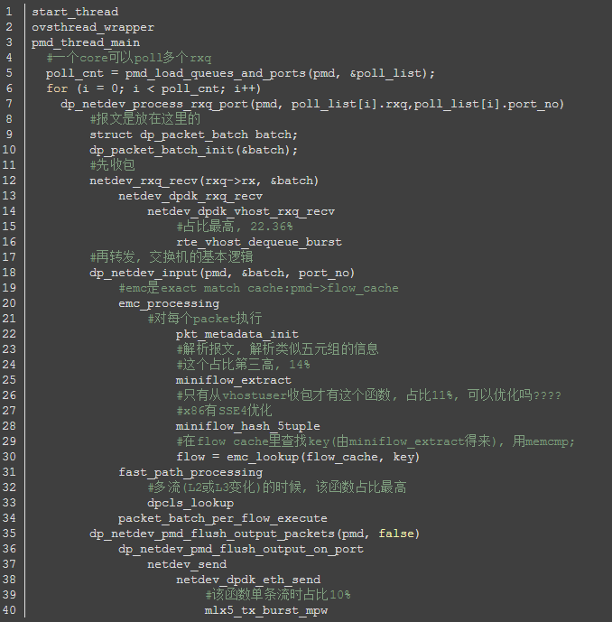
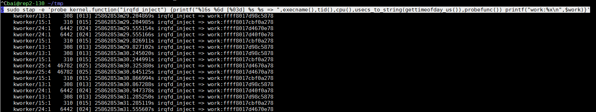
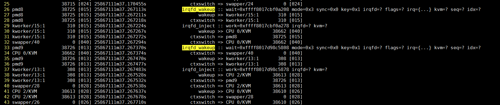

- [2个VM互相ping场景下的延迟分析](#2个vm互相ping场景下的延迟分析)
  - [OVS路径延迟](#ovs路径延迟)
    - [perf查看OVS转发路径执行时间](#perf查看ovs转发路径执行时间)
    - [OVS转发延时数据](#ovs转发延时数据)
  - [kernel路径延迟](#kernel路径延迟)
    - [eventfd和irqfd中断注入流程](#eventfd和irqfd中断注入流程)
    - [kernel延迟数据](#kernel延迟数据)
  - [延迟图解](#延迟图解)
  - [问题相关: 控制台输出](#问题相关-控制台输出)
  - [问题复现](#问题复现)
    - [抓ovs转发延迟 -- 没有发现](#抓ovs转发延迟----没有发现)
    - [抓调度事件](#抓调度事件)
      - [用systemtap脚本对系统有影响, 导致高延迟现象消失](#用systemtap脚本对系统有影响-导致高延迟现象消失)
      - [用ftrace静态probe点, 使用trace-cmd前端和使用perf前端](#用ftrace静态probe点-使用trace-cmd前端和使用perf前端)
      - [分析](#分析)
      - [改变VM的中断处理CPU](#改变vm的中断处理cpu)
      - [后续](#后续)

# 2个VM互相ping场景下的延迟分析
场景是两个VM使用virtio-net的kernel驱动, 其后端是OVS的vhostuserclient PMD, pmd进程运行在13 15号cpu上.

VM通过vhost接口与OVS连接  
  

系统负载很轻  
  

正常情况下, 两个VM的ping延迟在0.18ms, 但偶尔能看到超过1ms的情况, 延迟大了几乎一个数量级.

下文分析VM ping的路径延迟分布, 把总的延迟分解为可以量化的分阶段的延迟, 借此来分析异常高延迟的可能原因.
```bash
BaiYingjie@rep ~/tmp 
$ uname -a 
Linux rep2-130 4.14.x.aarch64 SMP Wed Oct 17 05:03:39 UTC 2018 aarch64 aarch64 aarch64 GNU/Linux 

#系统通过isolcpus=2-23,26-47 只保留4个核给系统(centos 7.5)使用.
HOST: 0 1 24 25
#OVS的pmd进程跑在四个核上
OVS: 12 13 14 15
#两个VM分别pin了4个CPU
VM1: 26 27 28 29
VM2: 40 41 42 43
```
通过htop看到, 除了OVS的2个pmd线程, 系统负载很轻

## OVS路径延迟
### perf查看OVS转发路径执行时间
两个VM互相ping, 一秒一次. OVS走dpdk的vhost接口.

先复习一下OVS的关键路径, 要对代码熟悉:  
这个是OVS的pmd线程从vhost口(和VM相连)收包, 转发到dpdk物理口的流程  
  

我们要看的其实是从vhost口收包, 再转发到vhost的流程, 只是后面不一样:  
`netdev_send -> netdev_dpdk_vhost_send -> netdev_dpdk_vhost_send`

那么转发时间, 也就是报文在OVS路径下的延迟, 是从`netdev_rxq_recv`收包, 到`netdev_send`结束的时间.

下面用perf记录这个时间:
```bash
# 首先看看有没有这两个函数
$ sudo perf probe -x /usr/local/sbin/ovs-vswitchd -F | grep netdev_send
netdev_send
netdev_send_wait
$ sudo perf probe -x /usr/local/sbin/ovs-vswitchd -F | grep netdev_rxq_recv
netdev_rxq_recv

# 有的, 增加动态probe点
# 收包函数
$ sudo perf probe -x /usr/local/sbin/ovs-vswitchd --add netdev_rxq_recv
# 发包函数, 这里的%return表示要probe这个函数返回点
$ sudo perf probe -x /usr/local/sbin/ovs-vswitchd --add netdev_send%return

# 记录30秒, -R表示记录所有打开的counter(默认是tracepoint counters)
$ sudo perf record -e probe_ovs:netdev_rxq_recv -e probe_ovs:netdev_send -R -t 38726 -- sleep 30

# 看结果
sudo perf script | less
# 用这个命令计算netdev_send和netdev_rxq_recv的时间差
sudo perf script | grep -n1 netdev_send | awk '{print $5}' | awk -F"[.:]" 'NR%4==2 {print $2-t} {t=$2}'
```

### OVS转发延时数据
  
这个pmd线程不断轮询是否有报文`netdev_rxq_recv()`被不断调用, 频率约为3us一次.  
`netdev_send()`只有真正发报文才调用, 从图中看到, 从收包到发包完毕, 大约40us

在30秒的时间里, 一共有9百万行记录, 这两个函数的probe点触发频率为30万次/秒, 其中netdev_send只有2次/秒.  
差不多轮询15万次, 才有一次收包.
```
$ sudo perf script | wc -l
9224453
```

## kernel路径延迟
有时候发现VM之间ping的延时会高到2ms左右, 正常应该是0.2ms

查阅相关资料, 发现kvm提供的irqfd和eventfd联用, 来触发vm的中断.  
> 在kvm_vm_ioctl()中, 增加KVM_ASSIGN_IRQFD, 调用kvm_assign_irqfd(), 把irqfd_wakeup()加到底下eventfd的回调里面, 通过workqueue调用irqfd_inject()完成中断注入

这里查看谁在什么时候调用了`irqfd_inject()`, 加`-e sched`是为了查看在中断注入后, 线程被唤醒的规律.
```bash
sudo trace-cmd record -p function -l irqfd_inject -e sched  sleep 10
sudo trace-cmd report
```

下面结果中, `irqfd_inject`后会紧跟`sched_waking`事件, 去唤醒KVM VCPU的线程

这里整个是说: core1运行的kworker线程, 因为irqfd_inject的触发, 去唤醒(sched_waking)qemu的vcpu线程(CPU 0/KVM), 目标是core26;  
46us后, core26上发生sched_switch事件, 从idle进程(swapper)切换到CPU 0/KVM进程.
```sh
     kworker/1:0-31764 [001] 1212277.097055: function:             irqfd_inject
     kworker/1:0-31764 [001] 1212277.097059: sched_waking:         comm=CPU 0/KVM pid=38610 prio=120 target_cpu=026
     kworker/1:0-31764 [001] 1212277.097062: sched_wakeup:         CPU 0/KVM:38610 [120] success=1 CPU:026
     kworker/1:0-31764 [001] 1212277.097064: sched_stat_runtime:   comm=kworker/1:0 pid=31764 runtime=14900 [ns] vruntime=9130727247869 [ns]
     kworker/1:0-31764 [001] 1212277.097068: sched_switch:         kworker/1:0:31764 [120] t ==> swapper/1:0 [120]
          <idle>-0     [026] 1212277.097105: sched_switch:         swapper/26:0 [120] R ==> CPU 0/KVM:38610 [120]
       CPU 0/KVM-38610 [026] 1212277.097141: sched_waking:         comm=CPU 3/KVM pid=38614 prio=120 target_cpu=029
...
```

record命令加`-e sched -T`命令可以得到调用栈:  
调用栈也显示, irqfd_inject里, 在kvm_vcpu_kick时, 会swake_up某进程, 结合上面, 应该是KVM VCPU进程.
```sh
=> swake_up_locked (ffff000008129bd8)
=> swake_up (ffff000008129c40)
=> kvm_vcpu_kick (ffff0000080a9f24)
=> vgic_queue_irq_unlock (ffff0000080c0f3c)
=> vgic_its_trigger_msi (ffff0000080c893c)
=> vgic_its_inject_msi (ffff0000080cae0c)
=> kvm_set_msi (ffff0000080c25e4)
=> kvm_set_irq (ffff0000080cbee8)
=> irqfd_inject (ffff0000080aef58)
=> process_one_work (ffff0000080f94e8)
=> worker_thread (ffff0000080f9784)
=> kthread (ffff0000081003b8)
=> ret_from_fork (ffff000008084d70)
```
实际上, 这里有几个不同的irq被注入, 如下图  
  

本例中的2个pmd分别运行在core13和core15中, 触发中断注入的是OVS pmd线程的写eventfd事件, 进而kworker13和kworker15执行irqfd_inject:  
以kworker/13:1为例, 它在29.2s 29.8s 30.2s 30.8s... 每秒2次, 都会被调度执行`irqfd_inject`, 这个符合两个VM互相ping的场景.

### eventfd和irqfd中断注入流程
最后, 整理整个流程如下:
1. qemu创建eventfd, 调用ioctl到内核态
2. 根据`ioctl()`, kernel执行`kvm_irqfd_assign()`, 创建`struct kvm_kernel_irqfd irqfd`, 关联eventfd到这个irqfd, 把`irqfd_wakeup()`注册到`irqfd->wait`的回调函数, 当irqfd被信号唤醒的时候, 调用`irqfd_wakeup`  
`kvm_irqfd_assign@linux/virt/kvm/eventfd.c`
3. qemu通过控制socket把eventfd描述符传递给OVS, 走vhost-user协议  
  
4. OVS的pmd线程, 在往VM发包函数`rte_vhost_enqueue_burst()`里, 写这个eventfd, 产生系统调用到内核态  
  
5. 因为之前的关联, irqfd_wakeup()被调用, 它再调用`schedule_work()`, 让kworker进程执行irqfd_inject
6. `irqfd_inject()`完成中断注入, 并唤醒VCPU(CPU x/KVM)线程  
  
7. 代表VCPU的qemu线程(CPU x/KVM)被调度执行

### kernel延迟数据
下面是systemtap捕捉到的相关内容: 见脚本[`see_kfunc_run.stp`](https://github.com/Bai-Yingjie/myrepo/blob/master/debug/see_kfunc_run.stp)
```
1m37.267113s cpu15上的pmd8进程(即OVS的pmd进程)调用eventfd_write, 进而调用irqfd_wakeup
1m37.267211s pmd8唤醒kworker/15:1
1m37.267218s pmd8切换到kworker/15:1
1m37.267224s kworker/15:1调用irqfd_inject
1m37.267267s kworker/15:1唤醒"CPU 0/KVM", 目标CPU是40
1m37.267272s kworker/15:1切换回pmd8进程
1m37.267294s 在CPU40上, swapper/40(idle进程)切换到"CPU 0/KVM"
1m37.267374s 在CPU40上, "CPU 0/KVM"切换回swapper/40(idle进程)
```
  

pmd8的调用栈, 显示了sys_write到eventfd_write到irqfd_wakeup的过程.  
  

## 延迟图解
正常情况下, 两个vm的ping延时在0.18ms左右; 但做profiling会有overhead, kernel路径和OVS转发路径的overhead如下:
* kernel: overhead比较大  
在systemtap运行时, 每次irqfd_wakeup和irqfd_inject以及调度事件被捕捉到, 其运行时的ping延时有0.46ms.
* OVS: overhead比较小  
在perf record期间, ping的延迟增加大约15%, 从0.18ms到0.20ms
* 算上两个profile的overhead, ping的延迟在0.5ms左右
* ping在VM A和VM B上的往返时间里(0.5ms), 在OVS路径上, 包括OVS转发和中断注入和唤醒的时间, 共消耗大约440us(40+181+40+181)
* 之前做过实验, ping localhost大约为0.077ms.
* 综上, 以ping延迟0.18ms计算, 在VM上的耗时共计大约60us, 在OVS转发路径下消耗120us, 其中用户态大概60us, kernel态60us.

根据以上数据, 得出大概的延迟图(ping共计耗时0.5ms, 算上2个profiling tool的overhead):
```sequence
participant VM_A as vma
participant Host_OVS(pmd) as hovs
participant VM_B as vmb

Note Over vma: ping
Note Over vma: sys_sendto
Note Over vma: ip stack and dev_hard_start_xmit
vma->>hovs: ICMP request
Note Over vma: sleep on skb receive(on behalf of ping thread in kernel)
Note Over hovs: netdev_rxq_recv
Note Over hovs: 消耗40us
Note Over hovs: netdev_send and eventfd_write
hovs->>vmb: packet forward
Note Over hovs: 唤醒本core的kworker执行中断注入, 唤醒VM B
Note Over hovs: 消耗181us

Note Over vmb: waked up
Note Over vmb: driver recv packet
Note Over vmb: ip stack and dev_hard_start_xmit in kernel
vmb->>hovs: ICMP reply
Note Over vmb: ping process receive packet, 打印时间戳
Note Over hovs: netdev_rxq_recv
Note Over hovs: 消耗40us
Note Over hovs: netdev_send
hovs->>vma: packet forward and eventfd_write
Note Over hovs: 唤醒本core的kworker执行中断注入, 唤醒VM A
Note Over hovs: 消耗181us

Note Over vma: waked up
Note Over vma: driver recv packet
Note Over vma: ip stack and deliver to ping process
Note Over vma: ping process receive packet, 打印时间戳
```

## 问题相关: 控制台输出
VM的4个核, 其实是qemu的四个线程. 在本例中, 它们是38610 38612 38613 38614, 其余几个线程是管理辅助线程.

  

```sh
#38610 38612 38614这几个线程类似, strace都停在KVM_RUN不动 
$ sudo strace -tt -p 38610 
strace: Process 38610 attached 
19:21:44.113743 ioctl(30, KVM_RUN 
 
#38613线程一直有输出, 平均0.1ms就有一次ioctl调用. 
sudo strace -tt -p 38613 
... 
19:16:03.422829 writev(12, [{"6", 1}], 1) = 1 
19:16:03.423031 ioctl(15, KVM_IRQ_LINE, 0xffff99afe1b0) = 0 
19:16:03.423105 ioctl(32, KVM_RUN, 0)   = 0 
19:16:03.423175 ioctl(32, KVM_RUN, 0)   = 0 
19:16:03.423237 writev(12, [{"4", 1}], 1) = 1 
19:16:03.423304 ioctl(15, KVM_IRQ_LINE, 0xffff99afe1b0) = 0 
19:16:03.423358 ioctl(32, KVM_RUN, 0)   = 0 
19:16:03.423418 ioctl(32, KVM_RUN, 0)   = 0 
19:16:03.423476 writev(12, [{" ", 1}], 1) = 1 
19:16:03.423536 ioctl(15, KVM_IRQ_LINE, 0xffff99afe1b0) = 0 
19:16:03.423587 ioctl(32, KVM_RUN, 0)   = 0 
19:16:03.423649 ioctl(32, KVM_RUN, 0)   = 0 
19:16:03.423708 writev(12, [{"b", 1}], 1) = 1 
19:16:03.423767 ioctl(15, KVM_IRQ_LINE, 0xffff99afe1b0) = 0 
19:16:03.423819 ioctl(32, KVM_RUN, 0)   = 0 
19:16:03.423878 ioctl(32, KVM_RUN, 0)   = 0 
19:16:03.423937 writev(12, [{"y", 1}], 1) = 1 
19:16:03.423995 ioctl(15, KVM_IRQ_LINE, 0xffff99afe1b0) = 0 
19:16:03.424046 ioctl(32, KVM_RUN, 0)   = 0 
19:16:03.424106 ioctl(32, KVM_RUN, 0)   = 0 
19:16:03.424165 writev(12, [{"t", 1}], 1) = 1 
19:16:03.424224 ioctl(15, KVM_IRQ_LINE, 0xffff99afe1b0) = 0 
19:16:03.424274 ioctl(32, KVM_RUN, 0)   = 0 
19:16:03.424334 ioctl(32, KVM_RUN, 0)   = 0 
19:16:03.424393 writev(12, [{"e", 1}], 1) = 1 
19:16:03.424451 ioctl(15, KVM_IRQ_LINE, 0xffff99afe1b0) = 0 
19:16:03.424502 ioctl(32, KVM_RUN, 0)   = 0 
19:16:03.424560 ioctl(32, KVM_RUN, 0)   = 0 
19:16:03.424620 writev(12, [{"s", 1}], 1) = 1 
 
... 
```

经过实验发现, 38613线程一直有ioctl调用, 是因为我用virtmanager来显示VM的console, 相当于VM的"串口", 这里的ioctl调用是ping的输出导致的.
* 在ssh session里面ping, 就看不到KVM_IRQ_LINE类型的ioctl, 此时4个vm的core对应的线程都是处于系统调用"不活跃"的状态.
* 仔细看strace的输出, writev()调用每次有一个字节的入参, 连起来就是ping的输出"64 bytes from ..."

下图就是其中一次ioctl的kernel trace  
  

## 问题复现
VM1和VM2互相ping, 每秒一次ping报文. 但VM1得到的延迟异常, 为1.3ms.  
  

### 抓ovs转发延迟 -- 没有发现
```bash
sudo perf record -e probe_ovs:netdev_rxq_recv -e probe_ovs:netdev_send -R -t 6965 -- sleep 30
sudo perf record -e probe_ovs:netdev_rxq_recv -e probe_ovs:netdev_send -R -t 6966 -- sleep 30
#没有发现, 转发耗时在20 ~ 60 us之间; 两个pmd都查了
sudo perf script | grep -n1 netdev_send | awk '{print $5}' | awk -F"[.:]" 'NR%4==2 {print $2-t} {t=$2}' 
49
25
43
23
43
23
41
...
```

### 抓调度事件
#### 用systemtap脚本对系统有影响, 导致高延迟现象消失
```sh
sudo stap ~/repo/save/debug/see_kfunc_run.stp -d /usr/local/sbin/ovs-vswitchd irqfd_wakeup irqfd_inject -o stap-cpu13.log -x 6965
```
`see_kfunc_run.stp`是我写的systemtap脚本, 基本功能是记录内核函数的执行情况和相关任务的调度情况.

可以看到systemtap脚本的overhead还是比较大, 改变了系统的行为, 导致问题不复现了.

  

#### 用ftrace静态probe点, 使用trace-cmd前端和使用perf前端
使用ftrace的静态probe可以在不破坏问题的复现的条件下, 记录系统调度信息
```bash
#只看这几个核
$ bitmask 13,14,26-29,40-43
f003c006000
#-M要在-e前面, 好像每个-e前面都可以有不同的-M
sudo trace-cmd record -M f003c006000 -e sched
#只看两个pmd核, 和VM1 VM2的核
sudo trace-cmd report --cpu 13,14,26-29,40-43
```
运行静态probe的方式, 对系统影响比较小  
  

另外, 使用perf前端的效果和trace-cmd类似, 同样没有破坏问题的复现, overhead也一样. 只是perf命令更现代一点.
```bash
sudo perf record -e sched:* -a -o perf-sched.data
sudo perf script -i perf-sched.data | vi -
```

#### 分析
```bash
  #CPU26(VM1)开始工作
  318           <idle>-0     [026] 117106.895215: sched_switch:         swapper/26:0 [120] R ==> CPU 0/KVM:6853 [120]
  
  #CPU13(pmd)转发了一个报文, 调用eventfd_write, 唤醒本CPU的kworker
  319            <...>-6965  [013] 117106.895265: sched_waking:         comm=kworker/13:1 pid=309 prio=120 target_cpu=013
  320            <...>-6965  [013] 117106.895267: sched_wakeup:         kworker/13:1:309 [120] success=1 CPU:013
  #CPU13(kworker)注入中断, 唤醒CPU40(VPU0 in VM2)
  325     kworker/13:1-309   [013] 117106.895276: sched_waking:         comm=CPU 0/KVM pid=6912 prio=120 target_cpu=040
  
  #CPU26(VM1)进入idle
  324        CPU 0/KVM-6853  [026] 117106.895273: sched_switch:         CPU 0/KVM:6853 [120] S ==> swapper/26:0 [120]
  
  326     kworker/13:1-309   [013] 117106.895279: sched_wakeup:         CPU 0/KVM:6912 [120] success=1 CPU:040
  #CPU40(VPU0 in VM2)开始工作
  329           <idle>-0     [040] 117106.895320: sched_switch:         swapper/40:0 [120] R ==> CPU 0/KVM:6912 [120]
  #CPU40一直工作, 不断唤醒CPU25的kworker来输出ping的字符
  
  #期间CPU26从idle到kworker再到VCPU状态
  
  #CPU13又转发了一个报文, 调用eventfd_write
  360             pmd8-6965  [013] 117106.895821: sched_waking:         comm=kworker/13:1 pid=309 prio=120 target_cpu=013  
  362             pmd8-6965  [013] 117106.895822: sched_wakeup:         kworker/13:1:309 [120] success=1 CPU:013
  365             pmd8-6965  [013] 117106.895824: sched_switch:         pmd8:6965 [110] R ==> kworker/13:1:309 [120]
  
  # >>== 这次中断注入后, 不需要唤醒CPU40, 因为CPU40已经在运行 ==<<
  367     kworker/13:1-309   [013] 117106.895827: sched_switch:         kworker/13:1:309 [120] t ==> pmd8:6965 [110]  
  
  #CPU26重新idle
  369        CPU 0/KVM-6853  [026] 117106.895838: sched_switch:         CPU 0/KVM:6853 [120] S ==> swapper/26:0 [120]
  
  #期间CPU40一直处于活动状态, 不断的从VM陷入HOST, 唤醒CPU25的kworker来输出ping的字符
  
  # >>== 这里出了问题, 从CPU13完成中断注入开始算起(117106.895827),到这里已经有1372us了! ==<<
  #CPU14(另外一个pmd)转发报文后, eventfd_write
  458            pmd10-6966  [014] 117106.897199: sched_waking:         comm=kworker/14:1 pid=308 prio=120 target_cpu=014
  459            pmd10-6966  [014] 117106.897200: sched_wakeup:         kworker/14:1:308 [120] success=1 CPU:014
  461            pmd10-6966  [014] 117106.897202: sched_switch:         pmd10:6966 [110] R ==> kworker/14:1:308 [120]
  
  #CPU14唤醒CPU26(VM1 VCPU0)
  462     kworker/14:1-308   [014] 117106.897204: sched_waking:         comm=CPU 0/KVM pid=6853 prio=120 target_cpu=026
  463     kworker/14:1-308   [014] 117106.897206: sched_wakeup:         CPU 0/KVM:6853 [120] success=1 CPU:026
  465     kworker/14:1-308   [014] 117106.897208: sched_switch:         kworker/14:1:308 [120] t ==> pmd10:6966 [110]
  
  #CPU26(VM1 VCPU0)开始工作
  468           <idle>-0     [026] 117106.897248: sched_switch:         swapper/26:0 [120] R ==> CPU 0/KVM:6853 [120]
  #CPU26(VM1 VCPU0)开始屏幕输出
  472        CPU 0/KVM-6853  [026] 117106.897346: sched_waking:         comm=kworker/u92:1 pid=21632 prio=120 target_cpu=025
  
```

log看下来, 发现: OVS的pmd线程在转发报文后, 注入中断, 如果
1. 目标VM的VCPU是idle态, 则唤醒目标VM的VCPU, 这个VCPU执行后面的处理.  
这种情况下ping延迟是正常的.
2. 目标VM的VCPU正在活动, 不断的陷入HOST唤醒另一个HOST CPU, 根据分析应该是往屏幕打印(上次)ping的输出;   
这种情况下, ping的延迟会到1.3ms.后面perf的时候再加上`KVM:*`也许会看到更多的信息.  
而且, 这种情况下, 相应网络中断的是CPU40, 而不断陷入HOST来输出打印信息(一个字符一次)的也是CPU40, 会不会是频繁陷入HOST有影响?

#### 改变VM的中断处理CPU
找到网卡eth1对应的中断, irq57, `cat /proc/interrupts`看到所有的中断都是CPU0来处理, `cat /proc/irq/57/smp_affinity`也显示默认的中断处理CPU是0  
中断处理CPU改成1
```bash
cd /proc/irq/57
[root@localhost 57]# echo 1 > smp_affinity_list
[root@localhost 57]# cat smp_affinity_list
1
```
后面看到现在eth1的中断由CPU 1来处理了, 再看ping延迟的现象也"消失"了. 为什么要引号"消失"呢?

过一会ping延迟的现象又出现了, 仔细观察发现:  
现在改成VM里的CPU1来处理网卡中断, 因为VM和HOST的CPU是一对一pin的, 对应HOST的CPU41, 再次抓kernel路径发现, 负责输出字符的CPU, 也从40变为了41, 所以VM网络处理和ping的控制台输出, 还是在同一个CPU上争抢CPU时间, 导致问题现象卷土重来.

#### 后续
目前debug到此, 基本上找到原因.

解决的话, 还要调查一下控制台输出的细节: 为什么qemu/kvm倾向于调度同一个CPU来完成两件事? 理解调度函数如何找到下一个被调度的任务/CPU `pick_next_task_fair`

或者简单一点, 不在控制台ping, 改为ssh到VM再ping, 这样输出不在控制台, 不走频繁陷入HOST流程.

另外, 在控制台ping, 也不是问题必现的, 因为ping每秒1次, VM要在收到并处理ICMP request报文的过程中, "同时"进行控制台字符输出, 需要一定的时间上的配合.
