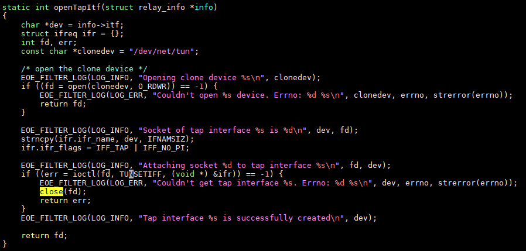
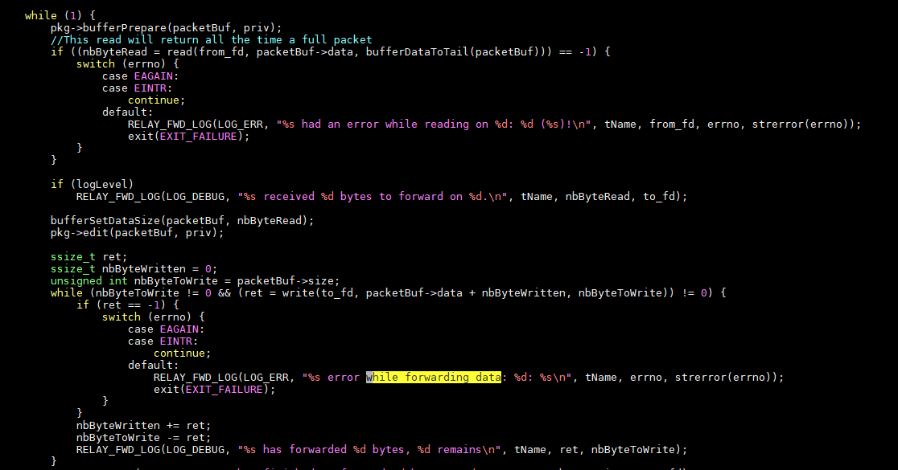
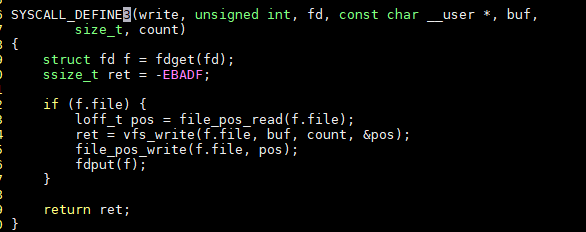
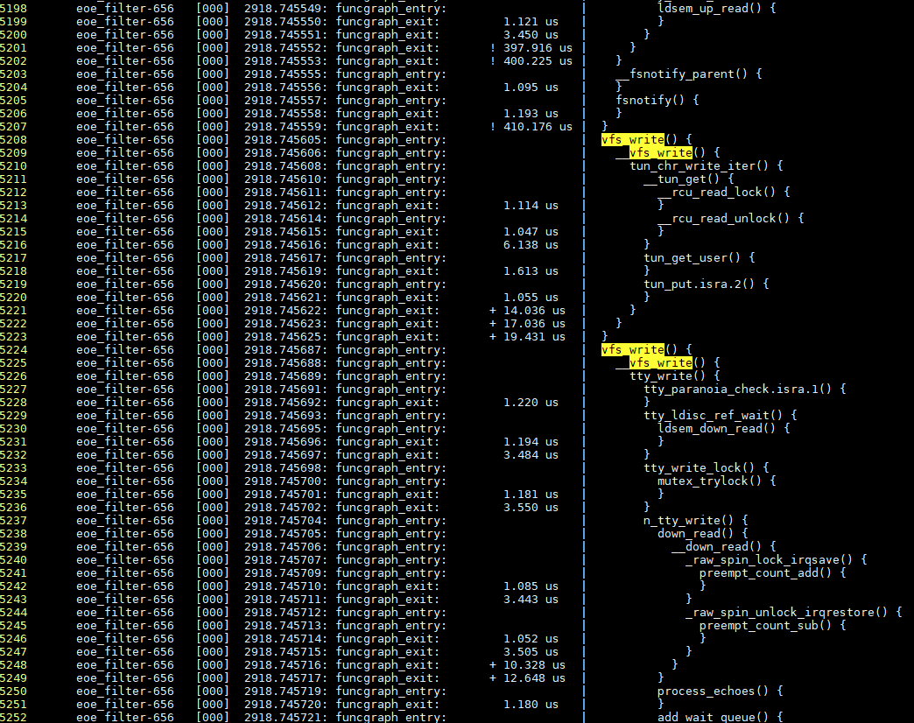
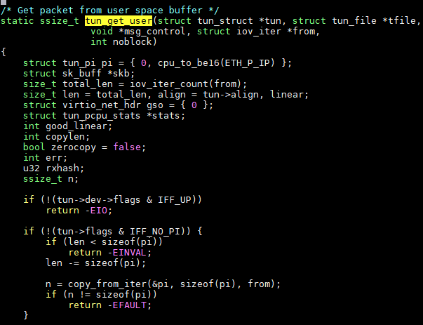
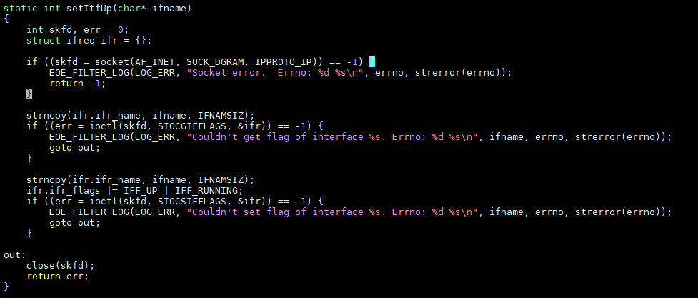

- [调查eoe_filter写tap设备失败问题](#调查eoe_filter写tap设备失败问题)
  - [问题现象](#问题现象)
  - [tap设备创建和销毁](#tap设备创建和销毁)
    - [问题现象](#问题现象-1)
    - [通过ip tuntap命令创建的tap不会消失, 即使exit掉shell进程也不会](#通过ip-tuntap命令创建的tap不会消失-即使exit掉shell进程也不会)
    - [gdb跟踪](#gdb跟踪)
  - [初步查明原因](#初步查明原因)
  - [解决思路](#解决思路)
    - [先用strace看看write系统调用](#先用strace看看write系统调用)
    - [复现命令](#复现命令)
    - [看write都干了什么](#看write都干了什么)
    - [tun设备驱动](#tun设备驱动)
      - [一次正常的tap设备write](#一次正常的tap设备write)
  - [问题解决](#问题解决)

# 调查eoe_filter写tap设备失败问题
## 问题现象
tap设备在eoe_filter.c里创建成功, 但写失败.

## tap设备创建和销毁
代码里创建tap设备, 通过open `/dev/net/tun`实现

  
有2个后台进程, 
* net to service thread is waiting for data on 3 to transmit on 4. Buffer size is 65557  
负责从其他netdev收报, 去掉eoe头, 发到tap设备

* service to net thread is waiting for data on 4 to transmit on 3. Buffer size is 65557  
负责从tap设备收报, 加eoe头, 发给其他netdev

  


### 问题现象
正常应该是用eth0, 我这里用lo代替. 因为我的eth0没有连接
```shell
~ # eoe_filter -n lo -t tap0 -E
Starting forwarder application: eoe_filter
Enable EOE header handle.
register EOE relay done
Argument are: netItf: lo, serviceItf: tap0
creating the socket for lo
The socket for lo is 3
Setting lo to promiscuous mode and disable ARP resolution
lo is now set in promiscuous mode and ARP resolution is disabled
Getting interface index of lo
Binding socket 3 to lo
Opening clone device /dev/net/tun
Socket of tap interface tap0 is 4
Attaching socket 4 to tap interface tap0
Tap interface tap0 is successfully created
creating thread service to net
net_fd is 3 and service_fd is 4
net to service thread is waiting for data on 3 to transmit on 4. Buffer size is 65557
service to net thread is waiting for data on 4 to transmit on 3. Buffer size is 65557
net to service error while forwarding data: 5: Input/output error
```
有tap设备创建成功的打印, 但后面却看不到该tap设备


### 通过ip tuntap命令创建的tap不会消失, 即使exit掉shell进程也不会
strace看到, 它调用了特殊的ioctl
```shell
sudo strace -o s.log ip tuntap add mod tap name tap1

openat(AT_FDCWD, "/dev/net/tun", O_RDWR) = 4
ioctl(4, TUNSETIFF, 0x7ffd4a16d9b0) = 0
#有这个, tap就不会消失
ioctl(4, TUNSETPERSIST, 0x1) = 0
```

### gdb跟踪
板子上:
```shell
#直接带好参数
~ # gdbserver :9123 eoe_filter -n eth0 -t tap-fwd -E
```
host上:
```shell
export PATH=$PATH:~/work/share/buildroot73/output/host/opt/ext-toolchain/bin
#cd到被调试的app目录下
yingjieb@yingjieb-VirtualBox ~/work/share/buildroot73/output/build/linux-target-apps-22ef847b216e5d579c016ed9dd9795d393b56001
#这个eoe_filter是带符号表的
#能自动找到sysroot:/home/yingjieb/work/share/buildroot73/output/host/opt/ext-toolchain/mips64-octeon-linux-gnu/sys-root/
Linux Mint 19.1 Tessa $ mips64-octeon-linux-gnu-gdb eoe_filter
#板子上的程序会停在__start, __start是lib32/ld.so.1的符号
(gdb) target remote 192.168.2.12:9123
(gdb) handle SIG42 nostop noprint
(gdb) set print pretty on
#先断点到这个函数:
(gdb) b openTapItf
#继续执行直到断点
(gdb) c
#结合代码, 我要看tap设备是否创建成功:
(gdb) b eoe_filter.c:116
#在另外一个窗口ip a能看到tap-fwd
(gdb) info locals
#再往下跟, 发现是子线程调用了exit(), 导致tap设备被注销了.
(gdb) next
```

## 初步查明原因
* tap设备能创建成功, 但线程write失败, 调用exit(), 系统会自动close相关fd, 导致该tap设备消失
* 用`ioctl(4, TUNSETPERSIST, 0x1)`可以让该tap设备长期存在.

## 解决思路
write tap设备错误导致进程退出.

那为什么错误呢?
### 先用strace看看write系统调用
```shell
#strace -o e.log eoe_filter -n lo -t tap0 -E
#cat e.log
...
write(1, "net to service thread is waiting"..., 86) = 86
read(3, "\0\0\0\1\f\241\10\0'\335\0*\10\0E\20\0004)\273@\0@\6\213\221\300\250\2\v\300\250"..., 65557) = 66
write(4, "@\6\213\221\300\250\2\v\300\250\2\f\354\220\0\26\274N\234\30\324\210TB\200\20\1\278\253\0\0"..., 44) = -1 EIO (Input/output error)
write(2, "net to service error while forwa"..., 66) = 66
exit_group(1) = ?
```
log里面, write返回EIO错误

### 复现命令
```shell
#先让lo up, 否则read会失败
ifconfig lo up
#使用lo接口ping, 这样eoe程序里的read才能收到包
ping 127.0.0.1


#eoe会创建tap设备, 从另一个网络设备(lo)read, 去掉eoe头, 再write到tap设备里
eoe_filter -n lo -t tap0 -E
```

### 看write都干了什么
有两个思路:
* 我知道是tap设备的问题, 那就看以下linux的tun代码, 找找write相关的实现
* 用ftrace的function_graph来看完整的write调用.

我选第二个

第二种方式, 是让ftrace告诉我们, write系统调用都干了什么.
这种方式最大的好处, 就是ftrace出来的函数, 是**运行时的实际调用**, 是100%确定会跑到的. 这点非常重要.

看代码也可以有思路, 但经常会不确定是否会跑到某个函数, 或某个分支; 调查这些不确定性, 通常是用加打印等手段, 费时费力.

用function_graph则能直接, 明了的"看到"运行时的调用轨迹.

那么我们需要知道具体的函数名:  
在`fs/read_write.c`, 可以看到, `vfs_write`就是我们要找的函数

  

但问题是, 所有的write都走vfs_write, 我们怎么找到这个tap设备相关的write呢?

先试一下再说:
```shell
#开始trace
# -p选择function_graph, -g的意思是查看函数具体干了什么; -F是说只trace它后面的命令
trace-cmd record -p function_graph -o eoe.dat -g vfs_write -F eoe_filter -n lo -t tap0 -E
#抓到tace有5千行.
~ # trace-cmd report eoe.dat | wc -l
5427
#里面包括stdout的tty_write
trace-cmd report eoe.dat | less
#一共write19次, 有18次是tty_write
trace-cmd report eoe.dat | grep vfs_write | grep -v __ | wc -l
19
trace-cmd report eoe.dat | grep "tty_write()" | grep -v n_ | wc -l
18


# 用-I和-S分别去掉中断和软终端标记的trace, 这样的report干净点
trace-cmd report -IS eoe1.dat
```
剩下的一次就应该是tap设备的write, 应该在比较靠后的位置

  

原来是`tun_chr_write_iter`, 在`drivers/net/tun.c`

### tun设备驱动
tun驱动是个misc驱动
```c
static const struct file_operations tun_fops = {
    .owner = THIS_MODULE,
    .llseek = no_llseek,
    .read_iter = tun_chr_read_iter,
    .write_iter = tun_chr_write_iter,
    .poll = tun_chr_poll,
    .unlocked_ioctl = tun_chr_ioctl,
#ifdef CONFIG_COMPAT
    .compat_ioctl = tun_chr_compat_ioctl,
#endif
    .open = tun_chr_open,
    .release = tun_chr_close,
    .fasync = tun_chr_fasync,
#ifdef CONFIG_PROC_FS
    .show_fdinfo = tun_chr_show_fdinfo,
#endif
};

static struct miscdevice tun_miscdev = {
    .minor = TUN_MINOR,
    .name = "tun",
    .nodename = "net/tun",
    .fops = &tun_fops,
};

static int __init tun_init(void)
{
    int ret = 0;

    pr_info("%s, %s\n", DRV_DESCRIPTION, DRV_VERSION);
    pr_info("%s\n", DRV_COPYRIGHT);

    ret = rtnl_link_register(&tun_link_ops);
    if (ret) {
        pr_err("Can't register link_ops\n");
        goto err_linkops;
    }

    ret = misc_register(&tun_miscdev);
    if (ret) {
        pr_err("Can't register misc device %d\n", TUN_MINOR);
        goto err_misc;
    }

    register_netdevice_notifier(&tun_notifier_block);
    return 0;
err_misc:
    rtnl_link_unregister(&tun_link_ops);
err_linkops:
    return ret;
}
```
在`tun_get_user()`里面, 先判断是否up. 不up直接退出了, 这就是返回EIO的地方.  
正常`tun_get_user()`很长, 但ftrace里面的`tun_get_user()`特别短, 和这里直接return是一致的.

  


现在知道tun驱动的写函数了, 以后可以直接找`tun_chr_write_iter`
```shell
trace-cmd record -p function_graph -o eoe2.dat -g tun_chr_write_iter -F ./eoe_filter -n lo -t tap0 -E
trace-cmd report -IS eoe2.dat
```

#### 一次正常的tap设备write
```shell
tun_chr_write_iter()
    #从user的buffer里取data发送
    tun_get_user()
        sock_alloc_send_pskb()
        skb_put()
        skb_copy_datagram_from_iter()
        eth_type_trans()
        __skb_flow_dissect()
        __skb_get_hash()
        netif_rx_ni()
            netif_rx_internal()
                enqueue_to_backlog()
                    __raise_softirq_irqoff()
            #if (local_softirq_pending())
            do_softirq()
                #全程关中断
                local_irq_save()
                __do_softirq()
                net_rx_action()
                    process_backlog()
                        #这下面抓到了在hardirq里面的函数, 用-I选项可以过滤掉
                        #-I能过滤掉generic_handle_irq(可能它有hardirq标记), 但中断的入口, 比如plat_irq_dispatch, 不管怎样还是在的
                        #可能是在ASM的缘故
                        __netif_receive_skb()
                net_rx_action()
                    #本来是对lo设备做的trace, 但这里出现了cvm_oct的函数, 这是物理接口的函数
                    #说明即使是tap设备触发的write, 在do_softirq()里面, 还是可能替别人干活.
                    #因为do_softirq()被调用的条件是local_softirq_pending(), 即有pending的活就得干.
                    #注意下面是物理口收报的过程, 但是在这次tap设备的write调用里干活, tap设备帮物理口抬了轿子.
                    cvm_oct_napi_poll_38()
                        netif_receive_skb()
                            __netif_receive_skb()
                            #普通的IPv4报文, 调用ip_rcv()
                                ip_rcv()
                                    nf_hook_slow()
                                        ipv4_conntrack_defrag()
                                        iptable_raw_hook()
                                        ipv4_conntrack_in()
                                        iptable_mangle_hook()
                                        iptable_nat_ipv4_in()
                                    ip_rcv_finish()
                                        tcp_v4_early_demux()
                                            ipv4_dst_check()
                                        #这是发给本机的报文
                                        ip_local_deliver()
                                            #又来一遍nf hook slow
                                            nf_hook_slow()
                                                ...iptable的操作
                                            ip_local_deliver_finish()
                                                #这是个tcp报文, ipv4, 走tcp_v4_rcv
                                                #这是个很深的函数, 管理连接, 应答, mtu, tso, skb
                                                tcp_v4_rcv()
                                                    ...
                                                    ip_queue_xmit()
                                                        ip_output()
                                                            #这个是发送的hook
                                                            nf_hook_slow()
                                                            ip_finish_output()
                                                                #真正调用driver发送
                                                                dev_queue_xmit
                                                                    dev_hard_start_xmit()
       local_irq_restore()
```


## 问题解决
现已查明, 在系统调用`write()`会走`vfs_write()`, 后者调用`tun_chr_write_iter()`, 在这个函数里面, 会判断接口是否up, 不up就返回EIO错误, 导致写失败.

在eoe_filter.c的`openTapItf()`里面, 加代码把刚创建的tap设备up起来.  
  
tap设备创建成功后调用改接口.

注意, 要用socket接口来操作, 而用`fd = open("/dev/net/tun", O_RDWR)`出来的fd是不行的.

