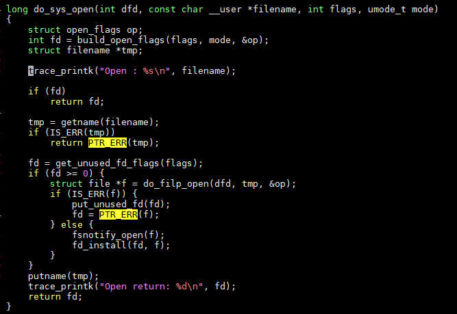

- [ftrace使用实例](#ftrace使用实例)
  - [ftrace nand](#ftrace-nand)
  - [cmdline使用ftrace: 看open系统调用都干了什么](#cmdline使用ftrace-看open系统调用都干了什么)
  - [function_graph最大的作用是看一个函数的子函数调用](#function_graph最大的作用是看一个函数的子函数调用)
- [调试libc.so.6找不到问题](#调试libcso6找不到问题)
  - [一次没有找到文件的open](#一次没有找到文件的open)
  - [找到文件的open](#找到文件的open)
  - [实际能找到, 为什么不能load?](#实际能找到-为什么不能load)

# ftrace使用实例

## ftrace nand
ftrace说明文件
`/sys/kernel/debug/tracing/README`

ftrace已经打开, 但需要手动mount
```sh
mount -t debugfs none /sys/kernel/debug
cd /sys/kernel/debug/tracing/
#默认就是tracing on的, 执行下面的语句就开始tracing了
echo function_graph > current_tracer

echo ubifs* > set_ftrace_filter
echo octeon_nand* >> set_ftrace_filter
echo cvmx_nand* >> set_ftrace_filter

cat trace_pipe > /dev/null
echo 1 > tracing_on
echo 0 > tracing_on
cat trace
```
在另外窗口
```sh
/mnt/nand-persistent # dd if=/dev/zero of=test bs=4M count=1
1+0 records in
1+0 records out
/mnt/nand-persistent # sync
/mnt/nand-persistent # ls
test testnand
```

## cmdline使用ftrace: 看open系统调用都干了什么
调试open系统调用, 用function_graph看open都干了什么
```sh
loglevel=8 ftrace=function_graph ftrace_graph_filter=do_sys_open ftrace_dump_on_oops tp_printk=1 octeon-wdt.disable=1
#这个不是很好用, printk是没有了, 但其子函数还有; 而且右括号还在
ftrace_graph_notrace=*printk*,_raw_spin*
#下面这个好点, 不能有空格! 不能有空格! 不能有空格!
ftrace_notrace=__*,*printk*,_raw_spin*,*console*,prom_putchar,*8250*,wait_for_xmitr,preempt_count*
#看代码应该管用, 实际也管用! 默认如果函数被irq打断, 也会trace irq; 加这句不trace irq
trace_options=nofuncgraph-irqs
#如果boot支持max_graph_depth 就好了, 起来以后debug文件系统支持
max_graph_depth 
```
* `ftrace_graph_filter=do_sys_open` : 和 `/sys/kernel/debug/tracing # echo do_sys_open > set_graph_function` 一样
和`ftrace=function_graph`连用, 只跟踪`do_sys_open`及其子函数
* `ftrace_dump_on_oops` : 在kernel oop时打印ftrace buffer; 实测panic也会打
* `tp_printk=1` : 效果未知
* `octeon-wdt.disable=1` : 关闭nmi wdt
* trace里面夹杂着很多中断函数的调用, 很讨厌. 在debugfs里可以关掉

```sh
# funcgraph-irqs - When disabled, functions that happen inside an interrupt will not be traced.
root@yingjieb-VirtualBox /sys/kernel/debug/tracing/options
Linux Mint 19.1 Tessa # cat funcgraph-irqs
1

#用trace_options文件
/sys/kernel/debug/tracing
 hide: echo nofuncgraph-cpu > trace_options
 show: echo funcgraph-cpu > trace_options
```

## function_graph最大的作用是看一个函数的子函数调用
```sh
#打开function_graph, 看一个函数都调用了哪些函数
/sys/kernel/debug/tracing # cat current_tracer 
function_graph
#这个set_graph_function和kernel cmdline的ftrace_graph_filter是一样的
/sys/kernel/debug/tracing # echo do_sys_open > set_graph_function
/sys/kernel/debug/tracing # cat set_graph_function 
do_sys_open
/sys/kernel/debug/tracing # cat set_ftrace_filter
#### all functions enabled ####
/sys/kernel/debug/tracing # echo 1 > tracing_on
# 此时能看到所有do_sys_open的子函数及其子函数再往下所有的调用
/sys/kernel/debug/tracing # cat trace
```

* set_graph_function和kernel cmdline的ftrace_graph_filter是一样的
* set_graph_function和set_ftrace_filter不冲突
    * set_graph_function: 要看哪个函数的子函数调用
    * set_ftrace_filter: 应该是更底层的控制, 哪些函数能被trace.
* 想知道一个函数的行为, 用function_graph
* max_graph_depth : 可以控制最大深度, 很有用!

# 调试libc.so.6找不到问题
使用新的GCC7.3编译版本运行, 在kernel启动到init的时候, 提示:
```sh
[ 39.572368] (c01 1 swapper/0) This architecture does not have kernel memory protection.
/bin/sh: error while loading shared libraries: libc.so.6: cannot open shared object file: No such file or directory
[ 39.713984] (c00 1 init) Kernel panic - not syncing: Attempted to kill init! exitcode=0x00007f00
```
为什么会找不到libc.so呢?

在open的时候加点打印:  
这个时用trace_printk()的版本, 打印到trace buffer里  
  

直接用printk会有如下调试信息: 
```sh
Open : /etc/ld.so.cache
Open return: -2
Open : /lib32-fp/tls/octeon3/libc.so.6
Open return: -2
Open : /lib32-fp/tls/libc.so.6
Open return: -2
Open : /lib32-fp/octeon3/libc.so.6
Open return: -2
Open : /lib32-fp/libc.so.6
Open return: 3
Open : /usr/lib32-fp/tls/octeon3/libc.so.6
Open return: -2
Open : /usr/lib32-fp/tls/libc.so.6
Open return: -2
Open : /usr/lib32-fp/octeon3/libc.so.6
Open return: -2
Open : /usr/lib32-fp/libc.so.6
Open return: -2
```
可以看到
* 系统会搜索很多path来找libc
* libc.so.6能被找到, 但为什么还说找不到呢?

用下面的ftrace分析一下`do_sys_open`都干了什么, 注意, 我把一些函数过滤掉了:  
和`trace_printk()`搭配是绝配!

## 一次没有找到文件的open
```c
do_sys_open()
/* Open : /usr/lib32-fp/tls/libc.so.6 */
    //对应上面代码
    getname()
    get_unused_fd_flags()
    //返回struct file *
    do_filp_open()
        path_openat()
            get_empty_filp()
            path_init()
            link_path_walk()
            terminate_walk()
            put_filp()
    put_unused_fd()
    putname()
```

## 找到文件的open
```c
do_sys_open()
/* Open : /usr/lib32-fp/tls/libc.so.6 */
    //对应上面代码
    getname()
    get_unused_fd_flags()
    //返回struct file *
    do_filp_open()
        path_openat()
            get_empty_filp()
            path_init()
            link_path_walk()
            complete_walk()
            may_open()
            vfs_open()
            open_check_o_direct()
            terminate_walk()
            put_filp()
    put_unused_fd()
    //从这里就能看出来, 走的是找到文件的分支
    fsnotify()
    fd_install()
    putname()
```

## 实际能找到, 为什么不能load?
经过咨询gcc专家, 解释是:
> Because there was a bug in glibc where it rejects libc for hard float mode. A mismatch between glibc and binutils linker. A problem due to porting the patch from the previous toolchain and updating only one side.

就是说在使用hard float时, 代码bug导致的libc和binutils不兼容.  
编译的时候不加octeon3标记就会使用soft float, 对应的库是lib32, 而不是lib32-fp

以下是patch:
```diff
diff --git a/elf/elf.h b/elf/elf.h
index 8244872f41..3ed1d32aa1 100644
--- a/elf/elf.h
+++ b/elf/elf.h
@@ -1611,8 +1611,8 @@ typedef struct
 #define EF_MIPS_64BIT_WHIRL 16
 #define EF_MIPS_ABI2 32
 #define EF_MIPS_ABI_ON32 64
-#define EF_MIPS_HARD_FLOAT 0x00000200
-#define EF_MIPS_SINGLE_FLOAT 0x00000400
+#define EF_MIPS_HARD_FLOAT 0x00000800
+#define EF_MIPS_SINGLE_FLOAT 0x00001000
 #define EF_MIPS_FP64 512 /* Uses FP64 (12 callee-saved). */
 #define EF_MIPS_NAN2008 1024 /* Uses IEEE 754-2008 NaN encoding. */
 #define EF_MIPS_ARCH 0xf0000000 /* MIPS architecture level. */
-- 
2.17.1
```
