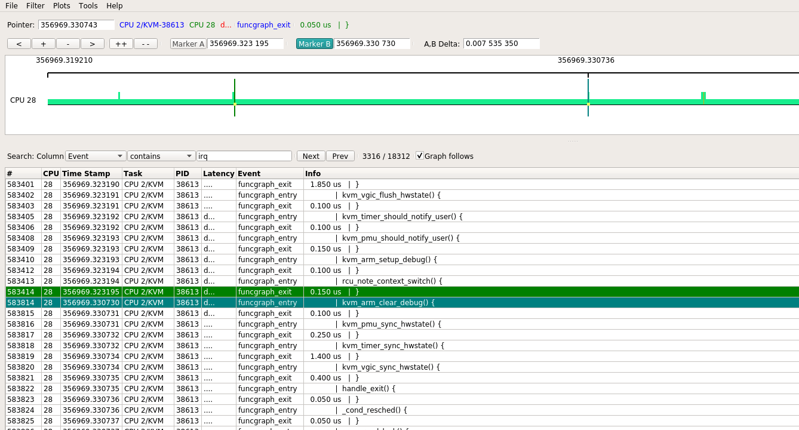
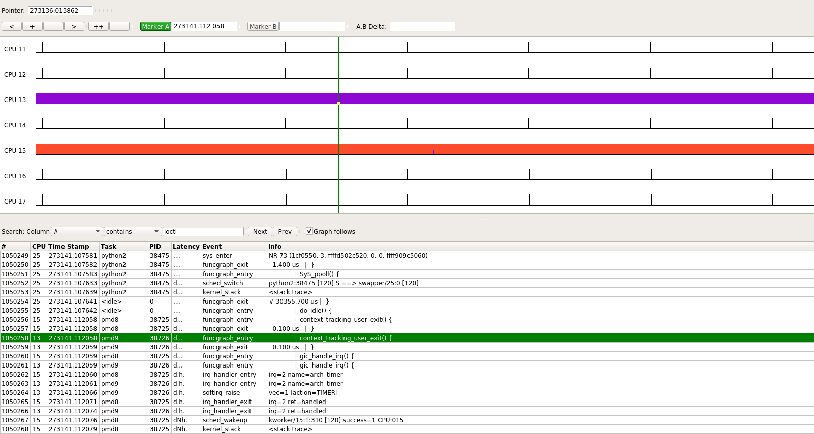
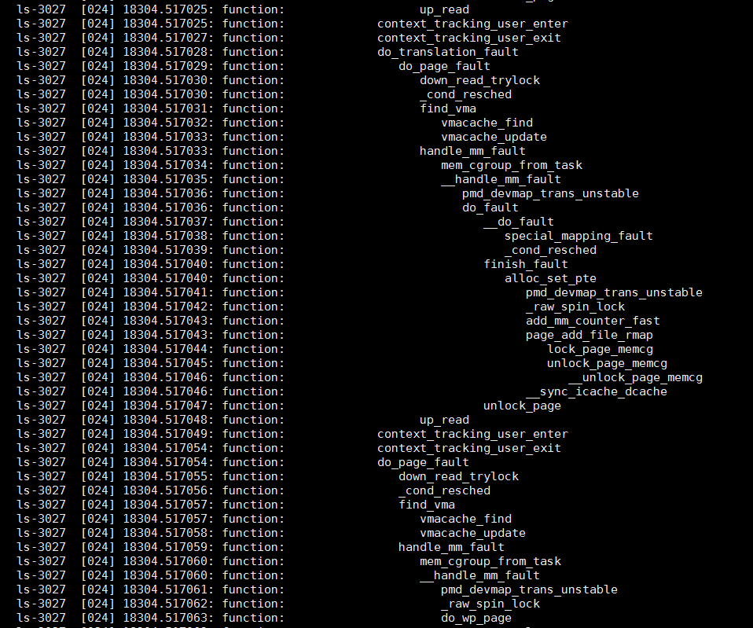

- [trace实例](#trace实例)
  - [kernelshark图解2个VM通过OVS互相ping](#kernelshark图解2个vm通过ovs互相ping)
    - [重点总结](#重点总结)
    - [场景](#场景)
    - [Host OS的运行情况](#host-os的运行情况)
    - [VM1的运行情况](#vm1的运行情况)
    - [strace看VM的四个核](#strace看vm的四个核)
    - [VM里加用户态应用](#vm里加用户态应用)
    - [vm和host上查看vm内的用户态进程](#vm和host上查看vm内的用户态进程)
      - [VM内perf能看到bash进程](#vm内perf能看到bash进程)
      - [在host上查不到任何在VM空间上跑的代码](#在host上查不到任何在vm空间上跑的代码)
    - [HOST里加用户态应用](#host里加用户态应用)
    - [ovs的pmd进程](#ovs的pmd进程)
      - [为什么没有捕捉到eventfd_write(其实有的)](#为什么没有捕捉到eventfd_write其实有的)
- [kernelshark](#kernelshark)
  - [安装](#安装)
  - [使用](#使用)
- [trace-cmd](#trace-cmd)
  - [使用举例](#使用举例)
    - [哪个进程, 在什么时间, 调用了irqfd_inject()函数](#哪个进程-在什么时间-调用了irqfd_inject函数)
    - [一个内核函数都调用了哪些函数, 及其子函数](#一个内核函数都调用了哪些函数-及其子函数)
    - [trace所有event](#trace所有event)
    - [function tracer也能反映调用关系, 甚至更直观](#function-tracer也能反映调用关系-甚至更直观)
    - [看哪个中断的latency最大](#看哪个中断的latency最大)
    - [统计模式](#统计模式)
  - [record命令](#record命令)
  - [report命令](#report命令)
  - [profile命令](#profile命令)
  - [动态probe支持](#动态probe支持)
- [ftrace使用记录](#ftrace使用记录)
  - [函数跟踪 function tracer](#函数跟踪-function-tracer)
    - [function tracer和function_graph tracer](#function-tracer和function_graph-tracer)
      - [只看一个cpu](#只看一个cpu)
    - [filter](#filter)
    - [对进程号tracing](#对进程号tracing)
  - [静态探测点, 也称预定义event](#静态探测点-也称预定义event)
  - [动态跟踪 kprobe, 动态event](#动态跟踪-kprobe-动态event)
    - [局部变量](#局部变量)
  - [时延tracer](#时延tracer)
  - [跟踪分支](#跟踪分支)
  - [其他功能](#其他功能)

# trace实例

## kernelshark图解2个VM通过OVS互相ping
### 重点总结
* trace-cmd的overhead不大, 其运行期间系统CPU使用率稍稍上升
* arch_timer提供的100HZ(和kernel 选项CONFIG_HZ=100一致)的时钟中断依旧是进程调度的触发点. 
* ftrace类的kernel trace能看到哪个任务, 什么时间, 执行了多久, 但看不到虚拟机内部的执行情况, 也看不到用户态的执行情况.
* host上的perf top也看不到虚拟机里面的执行情况, 但perf能看host的用户态进程. 因为其原理是采样, 而ftrace是基于tracing. 
* 从任务被唤醒到被调度是有延迟的, 即从sched_wakeup到sched_switch所用的时间, 一般是us数量级.
* 在本系统(48core aarch64)上, 某次进程迁移用了97us, 一次普通的时钟中断处理用了17us. 进程在cpu间的迁移并不是想象中那么昂贵
* 用trace-cmd --profile时, 默认只有部分事件触发, 加-e all能扩大触发事件范围

### 场景
两个VM使用virtio-net的kernel驱动, 其后端是OVS的vhostuserclient PMD, pmd进程运行在13 15号cpu上.

  

```bash
#系统通过isolcpus=2-23,26-47 只保留4个核给系统(centos 7.5)使用.
HOST: 0 1 24 25
#OVS的pmd进程跑在四个核上
OVS: 12 13 14 15
#两个VM分别pin了4个CPU
VM1: 26 27 28 29
VM2: 40 41 42 43
```
通过htop看到, 除了OVS的2个pmd线程, 系统负载很轻

```bash
#开始捕捉系统活动30秒
sudo trace-cmd record --profile sleep 30
#拷贝trace.data到我的ubuntu虚拟机, 运行kernelshark, 打开这个trace文件
```
注意到运行trace-cmd期间, OS的4个核的CPU使用率稍稍上升了一点, 在3% - 10%左右, trace-cmd最后要合并临时文件, CPU使用率能到30%.

### Host OS的运行情况
首先看看OS的4个核(0, 1, 24, 25)的情况, 初看起来挺饱满的, 似乎CPU很忙, 和htop观察到的CPU利用率并不match. 真实情况是, CPU没有那么忙, 但因为软件绘图时要着色的原因, 看起来比较饱满.  
  

放大其中一部分观察, 这样看起来CPU利用率就显得苗条多了.  
  
观察CPU 0的其中一段, 连续红色着色的地方是kworker在执行, 后面青色的很长一段是htop在执行.

下面事件部分, 高亮的那行表示发生了sched_switch事件, 导致从kworker切换到htop.  
`trace-cmd record --profile`默认会在每次任务被换出时, 触发一次kernel_stack事件, 打印kernel调用栈.  
  

本次htop被调度执行约0.17秒, 但中间还是被其他进程打断了几次.  
  

### VM1的运行情况
VM1绑定运行在26 27 28 29四个核上  
  

主要有几个进程会跑在这几个核上
* host的idle进程
* host的kworker进程, watchdog进程
* qemu-system-aarch64的子线程, 显示为CPUN/KVM线程, N为0到3, 代表了4个核

下图显示了一次典型路径: 某个时刻CPU处于idle状态, 此时host的arch_timer触发中断, 并唤醒并切换到kworker进程, 后者唤醒了CPU 1/KVM进程, 从图中可以看到, 从sched_wakeup到sched_switch用了36.1 us.  
  

接下来CPU 1/KVM做的工作是, 调用kvm_timer和kvm_vgic等函数来更新vm的状态, 随后又进入idle, 这个过程花了151 us.  
  

看下来core 27 28 29的情况类似, 大部分是由arch_timer触发的更新vm时间的操作.

在本例中, VM1是在不断的ping VM2的, 没有其他应用在跑. 那么估计有用的操作都在core 26上了.

下面来看一下core 26, 对应的qemu进程是CPU 0/KVM  
  
图中显示, 这次SyS_ioctl()共执行了29 us左右. 这次CPU 0/KVM共持续了10 ms, 在此期间, SyS_ioctl()出现了多次, 后再次进入idle.

根据这个进程的用户态的调用栈来看, qemu用ioctl()系统调用, 来让host执行VM的代码.
```c
#0  0x0000ffff8b4665bc in ioctl () from /lib64/libc.so.6 
#1  0x0000000000498f30 in kvm_vcpu_ioctl (cpu=0xffff876f0010, type=44672) at /home/bai/share/repo/hxt/qemu/accel/kvm/kvm-all.c:2093 
#2  0x0000000000498828 in kvm_cpu_exec (cpu=0xffff876f0010) at /home/bai/share/repo/hxt/qemu/accel/kvm/kvm-all.c:1930 
#3  0x0000000000460b74 in qemu_kvm_cpu_thread_fn (arg=0xffff876f0010) at /home/bai/share/repo/hxt/qemu/cpus.c:1215 
#4  0x0000000000a91468 in qemu_thread_start (args=0x279f03e0) at util/qemu-thread-posix.c:504 
#5  0x0000ffff8b527bb8 in start_thread () from /lib64/libpthread.so.0 
#6  0x0000ffff8b46fb50 in thread_start () from /lib64/libc.so.6 
```

### strace看VM的四个核
VM的4个核, 其实是qemu的四个线程. 在本例中, 它们是38610 38612 38613 38614, 其余几个线程是管理辅助线程.  
  
```bash
#38610 38612 38614这几个线程类似, strace都停在KVM_RUN不动
$ sudo strace -tt -p 38610
strace: Process 38610 attached
19:21:44.113743 ioctl(30, KVM_RUN

#38613线程一直有输出, 平均0.1ms就有一次ioctl调用.
sudo strace -tt -p 38613
...
19:16:03.422829 writev(12, [{"6", 1}], 1) = 1
19:16:03.423031 ioctl(15, KVM_IRQ_LINE, 0xffff99afe1b0) = 0
19:16:03.423105 ioctl(32, KVM_RUN, 0)   = 0
19:16:03.423175 ioctl(32, KVM_RUN, 0)   = 0
19:16:03.423237 writev(12, [{"4", 1}], 1) = 1
19:16:03.423304 ioctl(15, KVM_IRQ_LINE, 0xffff99afe1b0) = 0
19:16:03.423358 ioctl(32, KVM_RUN, 0)   = 0
19:16:03.423418 ioctl(32, KVM_RUN, 0)   = 0
19:16:03.423476 writev(12, [{" ", 1}], 1) = 1
19:16:03.423536 ioctl(15, KVM_IRQ_LINE, 0xffff99afe1b0) = 0
19:16:03.423587 ioctl(32, KVM_RUN, 0)   = 0
19:16:03.423649 ioctl(32, KVM_RUN, 0)   = 0
19:16:03.423708 writev(12, [{"b", 1}], 1) = 1
19:16:03.423767 ioctl(15, KVM_IRQ_LINE, 0xffff99afe1b0) = 0
19:16:03.423819 ioctl(32, KVM_RUN, 0)   = 0
19:16:03.423878 ioctl(32, KVM_RUN, 0)   = 0
19:16:03.423937 writev(12, [{"y", 1}], 1) = 1
19:16:03.423995 ioctl(15, KVM_IRQ_LINE, 0xffff99afe1b0) = 0
19:16:03.424046 ioctl(32, KVM_RUN, 0)   = 0
19:16:03.424106 ioctl(32, KVM_RUN, 0)   = 0
19:16:03.424165 writev(12, [{"t", 1}], 1) = 1
19:16:03.424224 ioctl(15, KVM_IRQ_LINE, 0xffff99afe1b0) = 0
19:16:03.424274 ioctl(32, KVM_RUN, 0)   = 0
19:16:03.424334 ioctl(32, KVM_RUN, 0)   = 0
19:16:03.424393 writev(12, [{"e", 1}], 1) = 1
19:16:03.424451 ioctl(15, KVM_IRQ_LINE, 0xffff99afe1b0) = 0
19:16:03.424502 ioctl(32, KVM_RUN, 0)   = 0
19:16:03.424560 ioctl(32, KVM_RUN, 0)   = 0
19:16:03.424620 writev(12, [{"s", 1}], 1) = 1

...
```

经过实验发现, 38613线程一直有ioctl调用, 是因为我用virtmanager来显示VM的console, 相当于VM的"串口", 这里的ioctl调用是ping的输出导致的. 
* 在ssh session里面ping, 就看不到KVM_IRQ_LINE类型的ioctl, 此时4个vm的core对应的线程都是处于系统调用"不活跃"的状态.
* 仔细看strace的输出, writev()调用每次有一个字节的入参, 连起来就是ping的输出"64 bytes from ..."

下图就是其中一次ioctl的kernel trace  
  

### VM里加用户态应用
前面的例子中, VM里只运行ping命令, 这个命令大部分时间也是在VM的内核协议栈里跑.
为了加大vm里面用户态的cpu使用率, 在VM里运行:
`while true; do :; done`会把其中一个core跑满100%用户态.
这在VM里面看是core 3, 在host上看是core 28.

整体看是这个样子的, 绝大部分都是CPU 2/KVM在跑  
  

pstack看到这个进程的stack并没有什么变化
```c
Thread 3 (Thread 0xffff99afede0 (LWP 38613)):
#0  0x0000ffff9d9165bc in ioctl () from /lib64/libc.so.6
#1  0x0000000000498f30 in kvm_vcpu_ioctl (cpu=0xffff99b00010, type=44672) at /home/bai/share/repo/hxt/qemu/accel/kvm/kvm-all.c:2093
#2  0x0000000000498828 in kvm_cpu_exec (cpu=0xffff99b00010) at /home/bai/share/repo/hxt/qemu/accel/kvm/kvm-all.c:1930
#3  0x0000000000460b74 in qemu_kvm_cpu_thread_fn (arg=0xffff99b00010) at /home/bai/share/repo/hxt/qemu/cpus.c:1215
#4  0x0000000000a91468 in qemu_thread_start (args=0x13b84e60) at util/qemu-thread-posix.c:504
#5  0x0000ffff9d9d7bb8 in start_thread () from /lib64/libpthread.so.0
#6  0x0000ffff9d91fb50 in thread_start () from /lib64/libc.so.6
```

取其中一处放大, 发现在上一个funcgraph_exit和下一个funcgraph_enter之间, 有7ms时间, CPU还是被"CPU 2/KVM"进程占用, 但在host kernel并没有footprint.  
  

几乎都是类似的情况  
  

偶尔能看到kworker  
  

在kernelshark显示的整个trace中, 找不到ioctl. 但用下面的命令, 可以显示kernel的调用栈, 其最开始就是`SyS_ioctl`调用. 其原理是在每次上下文切换的时候, trace-cmd会记录当前进程的kernel调用栈.

**说明VM里面的代码, 不管是kernel态还是用户态, 都是通过调用host的ioctl来完成执行的.**

`trace-cmd report --cpu 28 trace-ovs-2vm-ping-while1.dat`
```c
       CPU 2/KVM-38613 [028] 356963.892719: sched_wakeup:         kworker/28:1:322 [120] success=1 CPU:028
       CPU 2/KVM-38613 [028] 356963.892722: kernel_stack:         <stack trace>
=> try_to_wake_up (ffff00000810cef8)
=> wake_up_process (ffff00000810d1c4)
=> wake_up_worker (ffff0000080f6814)
=> insert_work (ffff0000080f860c)
=> __queue_work (ffff0000080f8794)
=> queue_work_on (ffff0000080f8ae4)
=> dbs_irq_work (ffff000008780d20)
=> irq_work_run_list (ffff0000081ee390)
=> irq_work_run (ffff0000081ee3ec)
=> handle_IPI (ffff00000809121c)
=> gic_handle_irq (ffff000008081958)
=> el1_irq (ffff000008082f84)
=> __do_softirq (ffff000008081a50)
=> irq_exit (ffff0000080e43b4)
=> __handle_domain_irq (ffff00000814665c)
=> gic_handle_irq (ffff000008081870)
=> el1_irq (ffff000008082f84)
=> kvm_arch_vcpu_ioctl_run (ffff0000080b3980)
=> kvm_vcpu_ioctl (ffff0000080a8f6c)
=> do_vfs_ioctl (ffff0000082c5434)
=> SyS_ioctl (ffff0000082c5d04)
=> __sys_trace_return (ffff0000080837ac)
```

### vm和host上查看vm内的用户态进程
在vm里执行`taskset -c 3 bash -c 'while true; do :; done'`, 然后用perf分别在VM内和host上查看:
#### VM内perf能看到bash进程
`sudo perf top -g --no-children -C 3`  
  
#### 在host上查不到任何在VM空间上跑的代码
VM的cpu3, 对应host上cpu 29, 在host上看来, 运行的是qemu的一个线程

注意htop默认的CPU编号从1开始, 但我这里设置了从0开始, 和perf等命令保持一致.  
  

在host上只能看到自己在内核态的代码:`sudo perf top -g --no-children -C 29`  
  

### HOST里加用户态应用
在host上执行`while true; do :; done`, 整个系统tracing如下:  
bash这个进程几乎100%占用CPU运行, 从图中可以看出, 该进程在0 24 1上发生过迁移.  
在其执行期间, 会被arch_timer周期性打断, 随后触发softirq的action为timer或rcu. 除了被中断打断能在kernel空间留下痕迹, bash用户态代码在内核空间不能被跟踪到, 内核只知道这段时间是bash在运行.  
  
  

下面是bash进程从cpu24迁移到cpu1的过程, 本次迁移用了97 us. 作为对比, 一次普通的时钟中断处理, 为17us.  
  

另外, 还捕捉到bash被urcu2进程抢占执行了178us.  
  

### ovs的pmd进程
本例中, ovs有16个线程, 它们共享pid号, 但tid号不一样. kernelshark里面, 用tid号作为区分.  
  

pmd8和pmd9分别运行在core 15和core 13上, 对应tid: 38725和38726  
  

这里重点看core 15:
`sudo perf top -g --no-children -C 15`  
  

虽然perf通过采样的方式, 能看到用户态和内核态的踪迹, 但trace-cmd目前只能跟踪内核事件, 如下图:  
它只能看到pmd8一直占用core 15, 偶尔被100 HZ的中断打断, 进而偶尔执行kworker等进程很短一段时间, 但其用户态进程没有跟踪到.  
  

#### 为什么没有捕捉到eventfd_write(其实有的)
之前分析过OVS的vhost代码, 用的是`dpdk librte_vhost/virtio_net.c`里的收发包函数. 按理说对于这种OVS是pmd进程收发包, 而VM是内核态驱动收发包的场景, VM内核驱动应该是中断, 那么根据代码要走eventfd读写流程的, 为什么kernelshark没显示相关信息呢?

用`sudo trace-cmd stream -e syscalls -P 38725`能够看到这个pmd进程的系统调用: 是有write系统调用的, 但在上面用`sudo trace-cmd record --profile sleep 30`就没有捕捉到系统调用.  
  

原来`--profile`并不是所有event都是触发源, 要加`-e all`
`sudo trace-cmd record -e all --profile sleep 30`  
现在有了: 这里过滤了其他的event, 只保留syscalls  
  

这里显示, 大概每秒2次write系统调用, 和两个VM互相ping的操作(默认1秒1次), 是匹配的.  
在代码里, `rte_vhost_enqueue_burst()`是OVS通过vhost往VM发包的函数  
  

这里面, 会调用`eventfd_write()`  
  

再用`perf top`抓一下调用栈: 确认是`sys_write()`系统调用, 再调用内核里的`eventfd_write()`  
  


# kernelshark
kernelshark是trace-cmd的gui版本
## 安装
新版本的kernelshark实用qt作为显示框架
```bash
git clone git://git.kernel.org/pub/scm/linux/kernel/git/rostedt/trace-cmd.git
sudo apt install libjson-c-dev doxygen freeglut3-dev
make gui
sudo make install_gui

#开启
kernelshark
```

## 使用
我是在ubuntu上安装的kernelshark `sudo apt install kernelshark`, 可以单独安装kernelshark, 并不依赖trace-cmd.  
然后把`trace.data`拷到ubuntu下面, 在其目录下执行`kernelshark`

显示内容还是比较丰富, 默认是按照CPU的时间来显示, 有CPU task event等filter来过滤显示.

# trace-cmd
需要安装`trace-cmd.aarch64`
trace-cmd是个集合, 包括
```bash
  commands:
     #见下面详细解释
     record - record a trace into a trace.dat file
     #start stop extract连用, start的参数和record一样, extract是把kernel的buffer保存为trace.data文件.
     start - start tracing without recording into a file
     extract - extract a trace from the kernel
     stop - stop the kernel from recording trace data
     restart - restart the kernel trace data recording
     #show kernel buffer, 可以用-c来限定cpu号.
     show - show the contents of the kernel tracing buffer
     #全部关闭, 清理buffer. 很实用
     reset - disable all kernel tracing and clear the trace buffers
     report - read out the trace stored in a trace.dat file
     #和start然后show效果差不多. 用户体验并不友好, 输出太多的时候很难ctrl+c停止
     stream - Start tracing and read the output directly
     profile - Start profiling and read the output directly
     hist - show a historgram of the trace.dat information
     stat - show the status of the running tracing (ftrace) system
     split - parse a trace.dat file into smaller file(s)
     options - list the plugin options available for trace-cmd report
     listen - listen on a network socket for trace clients
     list - list the available events, plugins or options
     restore - restore a crashed record
     snapshot - take snapshot of running trace
     stack - output, enable or disable kernel stack tracing
     check-events - parse trace event formats
```
trace-cmd还支持嵌入式的client server模式.

## 使用举例
### 哪个进程, 在什么时间, 调用了irqfd_inject()函数
```bash
sudo trace-cmd stream -p function -l irqfd_inject sleep 10
#结果显示, 这些进程都是kworker进程
           <...>-22636 [000] 1210302.576857: function:             irqfd_inject
    kworker/15:1-310   [015] 1210302.051545: function:             irqfd_inject
    kworker/13:1-308   [013] 1210302.051652: function:             irqfd_inject
           <...>-33928 [024] 1210302.228918: function:             irqfd_inject
           <...>-33928 [024] 1210302.256864: function:             irqfd_inject
    kworker/13:1-308   [013] 1210302.468840: function:             irqfd_inject
    kworker/15:1-310   [015] 1210302.468931: function:             irqfd_inject
           <...>-33928 [024] 1210302.576854: function:             irqfd_inject
           <...>-22636 [000] 1210302.869004: function:             irqfd_inject
           <...>-34497 [001] 1210303.011720: function:             irqfd_inject
    kworker/15:1-310   [015] 1210303.091628: function:             irqfd_inject
    kworker/13:1-308   [013] 1210303.091726: function:             irqfd_inject
    kworker/13:1-308   [013] 1210303.508968: function:             irqfd_inject
    kworker/15:1-310   [015] 1210303.509060: function:             irqfd_inject
...

#带调用栈
sudo trace-cmd record -p function -l irqfd_inject -e sched -T sleep 10
sudo trace-cmd report
#irqfd_inject调用栈如下:
=> swake_up_locked (ffff000008129bd8)
=> swake_up (ffff000008129c40)
=> kvm_vcpu_kick (ffff0000080a9f24)
=> vgic_queue_irq_unlock (ffff0000080c0f3c)
=> vgic_its_trigger_msi (ffff0000080c893c)
=> vgic_its_inject_msi (ffff0000080cae0c)
=> kvm_set_msi (ffff0000080c25e4)
=> kvm_set_irq (ffff0000080cbee8)
=> irqfd_inject (ffff0000080aef58)
=> process_one_work (ffff0000080f94e8)
=> worker_thread (ffff0000080f9784)
=> kthread (ffff0000081003b8)
=> ret_from_fork (ffff000008084d70)
```
### 一个内核函数都调用了哪些函数, 及其子函数
比如查看do_notify_resume都干了什么
```bash
#调试中发现很多任务切换发生在这个函数执行过程中, 想了解一下这个函数都干了什么, 调用了哪些函数:
#-g表示要跟踪这个函数的所有子函数调用, 只用-p function_graph默认好像只有一层显示.
sudo trace-cmd stream -p function_graph -g do_notify_resume sleep 1


#结果里面有do_notify_resume的调用图
do_notify_resume() {
  task_work_run() {
    _raw_spin_lock_irq();
    ____fput() {
      __fput() {
        _cond_resched();
        __fsnotify_parent();
        fsnotify();
        locks_remove_file();
        mutex_lock() {
          _cond_resched();
        }
        free_pages();
        kfree() {
          __free_pages() {
            __free_pages_ok() {
              free_one_page() {
                _raw_spin_lock();
                __mod_zone_page_state();
                pfn_valid() {
                  memblock_is_map_memory();
                }
                pfn_valid() {
                  memblock_is_map_memory();
                }
                pfn_valid() {
                  memblock_is_map_memory();
                }
              }
            }
          }
        }
        mutex_unlock();
        security_file_free();
        module_put();
        put_pid();
        call_rcu_sched() {
          __call_rcu() {
            rcu_segcblist_enqueue();
          }
        }
        dput() {
          _cond_resched();
        }
        mntput() {
          mntput_no_expire();
        }
      }
    }
    _cond_resched();
    _raw_spin_lock_irq();
  }
  mem_cgroup_handle_over_high();
}
do_notify_resume() {
  fpsimd_restore_current_state() {
    __local_bh_enable_ip();
  }
}
do_notify_resume() {
  schedule() {
    rcu_note_context_switch() {
      rcu_sched_qs();
    }
    _raw_spin_lock();
    update_rq_clock();
    pick_next_task_fair() {
      update_curr();
      check_cfs_rq_runtime();
      pick_next_entity() {
        clear_buddies();
      }
      put_prev_entity() {
        update_curr() {
          update_min_vruntime();
          cpuacct_charge();
        }
        check_cfs_rq_runtime();
        check_spread.isra.64();
        __enqueue_entity();
        __update_load_avg_se.isra.36();
        __update_load_avg_cfs_rq.isra.37();
      }
      put_prev_entity() {
        update_curr();
        check_cfs_rq_runtime();
        check_spread.isra.64();
        __enqueue_entity();
        __update_load_avg_se.isra.36();
        __update_load_avg_cfs_rq.isra.37();
      }
      set_next_entity() {
        __update_load_avg_se.isra.36();
        __update_load_avg_cfs_rq.isra.37();
      }
    }
    fpsimd_thread_switch();
    hw_breakpoint_thread_switch();
    uao_thread_switch();
    qqos_sched_in();
    finish_task_switch();
  }
}

#在上面命令的基础上, -e sched和-T联用, 在sched* 事件触发下, 记录kernel调用栈
sudo trace-cmd record -p function_graph -g do_notify_resume -e sched -T sleep 1
sudo trace-cmd report --cpu 0
#比如: 一般是work_pending调用的do_notify_resume
=> try_to_wake_up (ffff00000810cef8)
=> default_wake_function (ffff00000810d2a0)
=> autoremove_wake_function (ffff00000812987c)
=> __wake_up_common (ffff00000812903c)
=> __wake_up_common_lock (ffff0000081291d4)
=> __wake_up (ffff000008129254)
=> rb_wake_up_waiters (ffff0000081c0a8c)
=> irq_work_run_list (ffff0000081ee390)
=> irq_work_run (ffff0000081ee3ec)
=> handle_IPI (ffff00000809121c)
=> gic_handle_irq (ffff000008081958)
=> el1_irq (ffff000008082f84)
=> trace_graph_entry (ffff0000081d5460)
=> prepare_ftrace_return (ffff000008091e0c)
=> ftrace_graph_caller (ffff000008091f58)
=> call_rcu_sched (ffff000008157b70)
=> __fput (ffff0000082b29e0)
=> ____fput (ffff0000082b2af8)
=> task_work_run (ffff0000080fe0e0)
=> do_notify_resume (ffff0000080896a4)
=> work_pending (ffff0000080835d8)
```

### trace所有event
```bash
sudo trace-cmd record -e all ls > /dev/null
```

### function tracer也能反映调用关系, 甚至更直观
```shell
#使用function tracer, 也能反映调用关系, 甚至比function_graph还直观些.
#加-F是指只trace "ls", 否则所有的调用都有.
sudo trace-cmd record -F -p function -e sched_switch ls > /dev/null
#function_graph的好处是有funcgraph_entry和irq_handler_entry, 好统计函数耗时
```
效果示意:  
  

### 看哪个中断的latency最大
```bash
trace-cmd record -p function_graph -e irq_handler_entry  -l do_IRQ sleep 10
trace-cmd report
```

### 统计模式
```bash
#默认用一层的function_graph
sudo trace-cmd record --profile sleep 1
#这里--comm没有找到地方说明, 但加上的效果就是除了sleep进程名, 过滤了其他进程的event
sudo trace-cmd report --profile --comm sleep | less
```
`--profile`默认只打开下面的event, 要trace所有event, 使用: `sudo trace-cmd record -e all --profile sleep 1`  
  

## record命令
`man trace-cmd record`
```bash
trace-cmd record [OPTIONS] [command]
记录command执行期间的ftrace数据. 为每个CPU创建一个tracer进程来把per cpu的ring buffer写到临时文件, 结束的时候把所有的临时文件汇总到trace.data

部分选项:
-M cpumask
    只对cpumask里的cpu trace
-p plugin
    可以是function, function_graph, preemptirqsoff, irqsoff, preemptoff, wakeup
-e event
    静态探测点, 是subsystem:event-name的形式
    可以简写, 比如-e sched_switch -e sched
    可以带通配符, 比如*stat*表示所有带stat的event
    -e all 表示全部event
    可以多个-e联用
-T
    对每个event使能stacktrace
-f filter
    对前面那一个event做filter
    可以对filed(查format)进行这些操作: ==, >=, <=, >, <, &, |, && and ||
-R trigger
    对前面的哪一个event做trigger声明
-v
    排除后面声明的的event
    -e sched -v -e "*stat\*" 表示使能所有sched事件, 除了名字带stat的.
-F
    只对命令行指定的command做trace, 或者说只trace这个command造成的event
-P pid
    只对该pid trace
-c
    和-F联用, 表示也trace这个进程的子进程.
-o
    结果输出到文件
-l function-name
    在tracer是function和function_graph生效, 只trace function-name, 可以用通配符.
    可以多个-l联用, 表示trace多个function
-g function-name
    只对function_graph有效, trace function-name和它调用的函数. 可以多个-g联用
-n function-name
    与-l相反, 不trace function-name
    
-s interval
    设置trace-cmd在每次记录trace数据到文件前的睡眠时间
-r priority
    设置优先级到实时进程
-b size
    设置ring buffer大小, 单位k. 每个cpu都有自己的ring buffer
    
--profile
    使能统计模式, 统计模式默认打开部分event: ftrace irq raw_syscalls sched
    要跟踪所有event, 使用-e all --profile

对"function" tracer生效的:
--func-stack
    要和-l联用, 打开函数调用栈

对"function_graph"生效的:
--max-graph-depth depth
    限制function graph深度

```

## report命令
```bash
trace-cmd report [OPTIONS] [input-file]
-i
    input文件, 通常是trace.data
-f
    列出数据文件里的所有函数
-E
    列出数据文件里可能的事件
--events
    列出数据文件里的event格式
--event regex
    只打印match的event
    比如trace-cmd report --event sys:read, 是匹配system name有sys并且event name含有read的事件
    也可以直接写trace-cmd report --event read, 表示匹配system name或event name含有read的事件
-t
    时间戳使用ns, 默认是us
-F filter
    <events> ':' <filter>
    <events> = SYSTEM'/'EVENT  | SYSTEM | EVENT | <events> ',' <events>
    <filter> = EVENT_FIELD <op> <value> | <filter> '&&' <filter> |
        <filter> '||' <filter> | '(' <filter> ')' | '!' <filter>
    <op> = '==' | '!=' | '>=' | '<=' | '>' | '<' | '&' | '|' | '^' |
        '+' | '-' | '*' | '/' | '%'
    <value> = NUM | STRING | EVENT_FIELD
    比如
    #EVENT_FIELD能从event的format查出来, 用--events可以列出来
    #bogus不是任何event的EVENT_FIELD, 所以bogus==1为假, 但后面的common_pid == 2会生效
    -F 'sched : bogus == 1 || common_pid == 2'
    -F 'sched/sched_switch : prev_state==0'
    #.*是正则, 表示所有event; 下面的filter表示除去trace-cmd进程的event
    -F '.*:COMM != "trace-cmd"'
-I
    不打印有HARDIRQ标记的事件, 即不打印中断上下文的事件.
-S
    不打印有SOFTIRQ标记的事件
-v
    反选, 后面跟-F filter
--profile
    统计模式, 显示哪里任务最耗时, 哪里任务呗阻塞最久, 唤醒的时延在哪里
-G
    和--profile联用, 指定中断事件是全局的, 即CPU相关而不是默认的task相关
-R
    raw模式
-l
    显示latency标记
    标记依次表示: CPU号 irqs-off need-resched hardirq/softirq preempt-depth kernel-lock
    <idle>-0       0d.h1. 106467.859747: function:             ktime_get <-- tick_check_idle
--ts-diff
    显示时间差

man page里没有的, 看代码来的:trace-cmd/tracecmd/trace-read.c trace_report()
--cpu
    比如
    0, 1, 2-3
--pid
    只显示这个pid
--comm
    只显示这个comm(进程名)
```

## profile命令
`trace-cmd profile [OPTIONS] [command]`是`record --profile`和`report --profile`的组合, 选项和record基本一致.
trace部分event和使用function graph tracer

```bash
#-F表示只trace后面的command, -c表示follow fork
sudo trace-cmd profile -F -c sleep 1
#输出
#这个event是sched_switch, 表示在running的状态下, 被抢占(preempted)了2次, 一共是234559 ns, 平均是117279 ns(总时间/被抢占次数), 以及最大的一次和最小的一次被抢占的延时
Event: sched_switch:R (2) Total: 234559 Avg: 117279 Max: 129886 Min:104673
#后面的调用栈显示在哪里被抢占了
#被调度到S状态(INTERRUPTIBLE)下的时间为1000513242 ns, 约为1s, 也就是sleep 1的时间
Event: sched_switch:S (1) Total: 1000513242 Avg: 1000513242 Max: 1000513242 Min:10005132
#再后面是function trace类型的event, 默认使用depth为1的function_graph tracer
#括号里的数字是hit的次数
#overhead很高, 虽然depth为1表示只trace第一层的函数调用, 但所有内核函数的_mcount()还是会被触发(trigger)
#可以用-l来限制触发event的函数, 比如-l 'sys_*' -l 'SyS_*'
Event: func: SyS_open() (3) Total: 23615 Avg: 7871 Max: 10535 Min:4743
#再后面是, sys_enter:35的35是系统调用号
Event: sys_enter:35 (1) Total: 1000599765 Avg: 1000599765 Max: 1000599765 Min:1000599765

#其他
page_fault_user 用户进程发生page fault
softirq_raise 后面的时间表示soft irq从raise到执行花的时间
softirq_entry 后面的时间表示soft irq执行花费的时间

#-S表示不trace默认的全部event, 只trace后面显式指定的.
#-l '*kmalloc*:stacktrace'表示打开kmalloc*的stack trace
trace-cmd profile -S -p function_graph -l '*kmalloc*' -l '*kmalloc*:stacktrace' sleep 1
```

## 动态probe支持
trace-cmd本身并没有支持kprobe的语法, 但可以分两步来完成
```bash
#第一步, 先定义kprobe
echo 'r:md_make_request_probe md_make_request $retval' >> kprobe_events 
echo 'r:mwait_probe mwait_idle $retval' >> kprobe_events

#第二部, 用trace-cmd来跟踪
trace-cmd record -p function_graph -o graph_md.dat -g md_make_request -e md_make_request_probe -e mwait_probe -F ./block_hasher -d /dev/md0 -b 1048576 -t10 -n100
```

# ftrace使用记录
ftrace以debugfs目录为接口, 是kprobe和uprobe的前端. 有两类的probe
* 静态tracepoint  
提前在代码里声明的
* 动态的probe event  
`/sys/kernel/debug/tracing/kprobe_events`

  

查看所有的tracer方法`cat available_tracers`以及所有的静态tracepoint `cat available_events`
```bash
[root@rep2-130 tracing]# cat available_tracers
blk function_graph wakeup_dl wakeup_rt wakeup function nop

[root@rep2-130 tracing]# cat available_events
nfs* sunrpc* xfs*
syscall* raw_syscalls
ipi* irq* signal* workqueue* sched* timer* alarmtimer* task* migrate*
kvm* clk* iommu*
cpuhp* percpu* regmap* random* 
module* cgroup*
power* drm* bpf* oom*
vmscan* kmem* huge_memory*
writeback* filelock* block*
scsi* libata* spi* mdio* xhci* usb* i2c* smbus* thermal* dma*
net* sock* skb* mlx5*
```

## 函数跟踪 function tracer
kernel编译的时候加了`-pg`选项, 功能是给每个内核函数插入特殊的`_mcount()`函数.
kernel编译完成后, 每个函数都有`_mcount()`调用, 但kernel启动过程中, 会把`bl _mcount`指令替换成`nop`; 当function tracer使能函数跟踪的时候, 再替换成`bl ftrace_caller`  
  

相比动态probe需要把指定函数地址替换为breakpoint指令的方式, `_mcount()`方法更简单高效.

```bash
cd /sys/kernel/debug/tracing/
#选择function tracing
echo function > current_tracer
#选择调用图
echo function_graph > current_tracer
#注意: >>== current_tracer打开后, 马上就有overhead; 
#二者overhead都很明显, function_graph比function大 ==<<
#除了上面的打开方式, 还可以在kernel cmdline里面传参, 比如ftrace=function_graph

#关闭tracer
echo nop > current_tracer

#下面操作通用
#开始tracing, >>== overhead在前面的基础上, 再次明显增大. ==<<
echo 1 > tracing_on
#关闭tracing
echo 0 > tracing_on
#查看trace log, 不过滤的话会有很多
cat trace
#清空trace log
cat trace_pipe > /dev/null
```

### function tracer和function_graph tracer
下图是在`ping localhost`过程中, 打开ftrace的overhead实例:

其中, 1是`echo function_graph > current_tracer`; 2是`echo 1 > tracing_on`; 3是`echo 0 > tracing_on`

补充一下, 最后`echo nop > current_tracer`, ping延迟恢复到0.026ms.

  

下图是function tracer的实例, 当前函数和其caller都能显示

  

下图是function_graph tracer实例, 可以和上面的function tracer对比.
相对来说, function_graph更直观一些: 有函数的调用关系, 函数的执行时间; 中间被中断打断的话, 还有箭头提示; 任务切换有横线分割;

  

#### 只看一个cpu
经常多个CPU混杂在一起显示, 就不容易看懂:  
  
此时可以用per_cpu目录
```
cd /sys/kernel/debug/tracing
cat per_cpu/cpu42/trace | less
```

### filter
实际观察如果不加filter, trace log的东西太多太杂, 很难阅读和理解; 比如所有的CPU都混杂在一起显示

在kernel cmdline里面可以加通配符  
`ftrace=function ftrace_filter=mydrv_*`  
`ftrace=function_graph ftrace_graph_notrace=rcu*,*lock,*spin*`  

在运行时, 也可以用通配符, 比如`value*` `*value*` `*value` `value1*value2`等形式

比如
```bash
#只看sys_开头的函数
echo sys_* > set_ftrace_filter
#清空filter
echo > set_ftrace_filter

#filter支持更通用的格式: function:command[:count]
#mod: enable or disable function per module
#traceon/traceoff: enable or disable trace
#snapshot: preserves current trace buffer and swap to spare buffer
#enable_event/disable_event: enable or disable event
#stacktrace: enable stack trace
#dump: dump all trace buffers
#cpudump: only dump buffer for current CPU

#例如: 只看modlue sha512_generic的函数
echo ':mod:sha512_generic' > set_ftrace_filter
#例如: 在segment fault时停止tracing, 防止后续的trace log把有用信息淹没
echo 'do_bad_area.part.1:traceoff' > set_ftrace_filter
```

### 对进程号tracing

```bash
#可以限制只对几个进程做tracing
echo '123 244 1' >> set_ftrace_pid
#对当前线程tracing
echo $$ >> set_ftrace_pid
#清除限定的pid
echo > set_ftrace_pid
```

下面的脚本用来trace用户命令, 用法: `./traceme.sh ls && ./traceme.sh stop`
```bash
#!/bin/sh

DEBUGFS=/sys/kernel/debug

if test "$1" != "stop"; then
    #对当前线程tracing
    echo $$ > $DEBUGFS/tracing/set_ftrace_pid
    #选择tracing方法
    #echo function > $DEBUGFS/tracing/current_tracer
    echo function_graph > $DEBUGFS/tracing/current_tracer

    #开始tracing
    echo 1 > $DEBUGFS/tracing/tracing_on
    #执行被trace的命令
    #用exec不会改变进程号, 但会替换掉当前shell
    exec $*
else
    #关闭tracing
    echo 0 > $DEBUGFS/tracing/tracing_on

    #清除限定的pid
    echo > $DEBUGFS/tracing/set_ftrace_pid

    #show trace log
    cat $DEBUGFS/tracing/trace

    #清空trace log
    cat $DEBUGFS/tracing/trace_pipe > /dev/null
fi
```
用trace-cmd更简单:
```shell
sudo trace-cmd record -F -p function ls > /dev/null
sudo trace-cmd report | less
```

## 静态探测点, 也称预定义event
静态探测点是kernel代码里面预定义的探测点, 比如:  
  
```bash
#配置trace任务调度
echo 1 > events/sched/enable
echo 1 > tracing_on
#也可以用set_event文件
echo sched:* > set_event
#以上两个方法都会在set_event里面生成sched:*的tracepoint
#也可以单独为某个静态probe点设置
echo sched_wakeup >> set_event
echo 1 > events/sched/sched_wakeup/enable
#或者全部enable
echo *:* > set_event
echo 1 > events/enable
#等待一段时间
echo 0 > tracing_on
#查看输出
cat trace
#查看输出的格式定义
cat events/sched/sched_wakeup/format

#过滤语法可以对某个probe进行过滤, 比如: prev_comm是从format里面查到的变量, ~表示通配符匹配
echo 'prev_comm ~ "test_task*"' > events/sched/sched_switch/filter
#或者匹配pid
echo 'common_pid == 0' > events/sched/filter
#指定pid也可以用
echo 123 244 1 >> set_event_pid

#triger文件可以用来触发规定的动作, 这些动作有:
traceon/traceoff: enable or disable trace
snapshot: preserves current trace buffer and swap to spare buffer
enable_event/disable_event: enable or disable event
stacktrace: enable stack trace
hist: aggregates event hits into for histogram

#比如:当main进程退出的时候, 停止trace
echo 'traceoff if comm ~ "main"' > events/sched/sched_process_exit/trigger
```
  

## 动态跟踪 kprobe, 动态event
kprobe(和kretprobe)提供的是动态probe功能

基本原理是用break指令替换掉被probe的指令  
  
```bash
#增加一个kprobe event, 会在events/kprobes生成一个目录
echo "p:myprobe do_sys_open" > kprobe_events
#这个目录下有类似的format, trigger等文件
ls events/kprobes/
enable  filter  myprobe
ls events/kprobes/myprobe/
enable  filter  format  id  trigger

#去掉myprobe
echo "-:myprobe" >> kprobe_events
#或者全部清空, 执行后myprobe目录就消失了
echo > kprobe_events

#开始
echo 1 > events/kprobes/myprobe/enable
echo 1 > tracing_on
cat trace

#带参数, 在aarch64上, x0到x7表示前8个参数
echo "p:my_probe update_min_vruntime cfs=%x0:x64" > kprobe_events
echo 1 > events/kprobes/my_probe/enable
echo 1 > tracing_on
```

### 局部变量
如果仅仅用动态probe来probe函数地址, 就太大材小用了. 动态probe的真正意义在于可以probe任何程序地址(函数名+偏移量), 这也是它比function trace更灵活的地方, 比如:

  
```shell
echo "p:my_e1 update_min_vruntime+0x1c %x2:u64" > kprobe_events
echo 1 > events/kprobes/my_e1/enable
```

再比如两次引用指针:  
  

注: 需要对照汇编代码来找到变量保存在哪个寄存器, 不容易操作.  
还是`systemtap的kernel.statement(PATTERN)`和`process("PATH").statement("*@FILE.c:123")`比较容易使用

## 时延tracer
关于时延的tracer有:
* irqsoff, preemptoff, preemptirqoff: 跟踪关闭中断/抢占的最大时间
* wakeup, wakeup_rt, wakeup_dl: 跟踪任务在wakeup后到被调度的时延
* 需要kernel config支持

  

## 跟踪分支
kernel选项配了CONFIG_PROFILE_ANNOTATED_BRANCHES CONFIG_PROFILE_ALL_BRANCHES后有branch类型的tracer

## 其他功能
* trace_printk(): 打印到buffer, overhead小
* trace_marker: 写到trace_marker里面的内容会出现在trace buffer里, 用于同步标识  
`echo Hello World > trace_marker`
* option目录下面可以用来配置功能

```shell
[root@rep2-130 tracing]# for f in options/*; do printf "$f: "; cat $f; done | grep -v ": 0"
options/annotate: 1
options/context-info: 1
options/funcgraph-cpu: 1
options/funcgraph-duration: 1
options/funcgraph-irqs: 1
options/funcgraph-overhead: 1
options/function-trace: 1
options/graph-time: 1
options/irq-info: 1
options/markers: 1
options/overwrite: 1
options/print-parent: 1
options/record-cmd: 1
options/sleep-time: 1
options/trace_printk: 1
```
