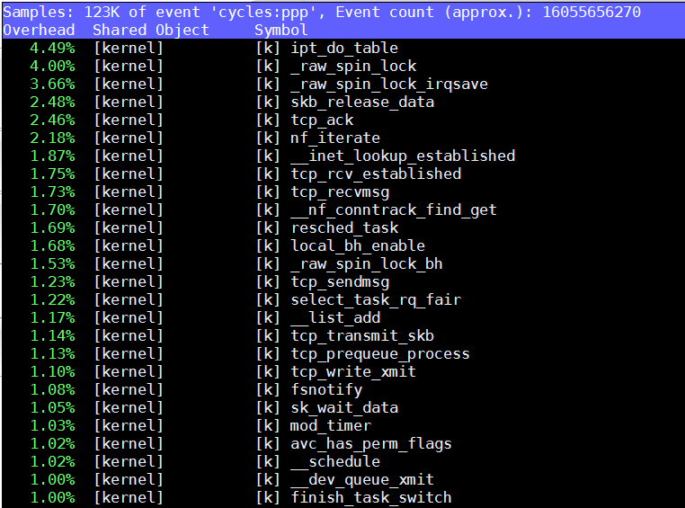

>本文尝试分析lat_tcp的测试逻辑和代码路径, 从而考量这个测试的真正含义.

# 背景
环境如下: 其中SDP指qualcomm server CPU(Amberwing, 48core aarch64)
* SDP1: AW1.1, 4.9.0-2.el7.aarch64(64K), firewall off, audit off
* SDP2: AW1.1, 4.10.0-4.el7.aarch64(4K), firewall off, audit off
* HP380: 2699v4, 3.10.0-514.el7.x86_64(4K), firewall off, audit off

command:
```sh
./lat_tcp -s
./lat_tcp -N 10 localhost
```
结果:

|machine|lat_tcp|ratio|
|----|----|----|
|sdp1|18.0197 us|0.71|
|sdp2|17.8150 us|0.72|
|hp380|12.9473 us|1|

# 分析
## 误入歧途?
lat_tcp是个client server模型, 但没开server的情况下, 直接运行`./lat_tcp -N 10 localhost`也有数据, 数据小的不正常, 但没有任何错误提示, 怎么回事?

这就需要先分析代码了

## 代码结构
lat_tcp是传统的基于fork的多进程模型.
* 主进程在server模式下fork server进程, 然后退出  
  
* -S表示要关闭服务端, 但关闭的方法只是建立一个连接, 然后close掉这个sock? 这要看看服务端的逻辑  
  
* GO_AWAY这个宏注册了一个alarm定时器, 一个小时后调用exit退出
* sigchld_wait_handler负责在子进程退出的时候调用wait来销毁子进程的资源, 防止僵尸进程, 见`man 2 wait`
* 每个新的连接都新fork一个子进程来处理, 而父进程则继续等待新连接.  
  
* 先读一个int, 从sock读出来的第一个int表示本次data的大小; 如果为空则表示要关闭这个server, 回答上面, 建立一个连接但没有数据, 则关闭server
* read从sock接收缓冲区读数据, 没有数据则阻塞. 
* 可以配置-m数据大小 默认为1, -P并行数, -N重复次数
* 默认启动client端, 在client里面, connect到服务端口, 然后做数据传输: 先告诉服务端本次传输的data size, 然后先写, 再读.
  
* 最后统计整个测试的运行时间

## 误入歧途(续)
客户端的逻辑都被包在一个通用的执行函数里, 这个函数会根据并行数, fork相应的子进程来干活, 父进程负责控制子进程状态(通过pipe)和收集结果.  
  

用gdb调试, 要设置`set follow-fork-mode child`模式, 否则子进程默认detach  
  
问题出在客户端尝试连接服务端的时候, 这个tcp_connect是递归调用的, 10次连接不上直接返回-1; 调用时没有判断返回值, 所以后面的操作都是对-1这个文件描述符操作!

## 回到正轨
综上, 这个测试程序测试客户端向服务端发起一次tcp连接请求, 并进行三次数据传输:
```sequence
participant client
participant server
client->server: connect
note over server: accept
client->server: size of data = msize
client->server: wirte msize
note over server: read msize
server->client: wirte msize
note over client: read msize
```
* 客户端发起连接, 服务端accept连接
* 客户端写一个int大小的数据, 这个int表示实际data的大小msize
* 客户端写msize的数据, 服务端读
* 服务端读到数据后, 再写回同样的数据.
* 客户端读到服务端写回的数据
* 完毕
注: 似乎这个benchmark框架有个状态机  `warmup->timing_interval->cooldown`, 所以实际读写有多次, 详细见函数`benchmp_interval`

## htop
on SDP2:  
  
有意思的是server和client大部分时间都被调度到同一个core上执行, 大约各占50%.

on hp380:  
  
不同的是, x86似乎大部分时间都是在不同的core上跑, 虽然各自占用61%. 
说明client和server是互相等待的, 从上面的顺序图也能看出来, 客户端和服务端是串行工作的.

## 用taskset绑定core
前面发现kernel调度的行为, 在AW和2699上不一样, 那么手动绑定core呢?

背景: 
* AW上, 两个CPU组成一个duplex, 共享L2, 但其他资源不共享.
* 2699上, 类似的, 两个thread组成一个core, 除了执行单元, 其他都共享.
* 用`lscpu -p | column -ts,`可以查到相关信息, 下面是2699的

```
# CPU   Core Socket  Node    L1d  L1i  L2  L3
0       0    0       0       0    0    0   0
1       1    0       0       1    1    1   0
2       2    0       0       2    2    2   0
3       3    0       0       3    3    3   0
```

on sdp2: server on CPU #7
|client on CPU #|#7(same CPU)|#6(same duplex)|other CPU #|
|----|----|----|----|
lat_tcp|17.1367 us|19.7576 us|25.4529 us
ratio to 2699|0.47|0.57|0.50

on hp380: server on CPU #4

client on CPU #|#4(same CPU)|#48(same core)|other CPU #|
|----|----|----|----|
lat_tcp|8.2153 us|11.3579 us|12.8296 us|

上面结果用到的命令:
```sh
taskset -c 4 ./lat_tcp -s localhost
taskset -c 48 ./lat_tcp -N 10 localhost
```
结论:
* client和server在同一个CPU结果最好, 同一个duplex/core结果次之, 不同CPU上跑最差.
* 自由调度的结果其实是AW最好成绩vs2699最差成绩, 可能因kernel4.10比3.10的调度更好或者因为2699上还跑了很多图形的进程.
* 更公平的比较应该是server和client run在不同的CPU上.
* 现实场景下, client和server在不同的物理机上, 根本没有机会用到L2共享.

## flamegraph & perf
先开服务端  
SDP2, 客户端:  
注意到结果被perf拖慢了.
```sh
$ sudo perf record -g ./lat_tcp localhost
Lowering default frequency rate to 2700.
Please consider tweaking /proc/sys/kernel/perf_event_max_sample_rate.
TCP latency using localhost: 23.3565 microseconds
[ perf record: Woken up 9 times to write data ]
[ perf record: Captured and wrote 2.206 MB perf.data (9925 samples) ]
qdt@qdt-shlab-awsdp2 ~/yingjieb/benchmarks/LMBench/lmbench/lmbench-3.0-a9/bin/aarch64-linux-gnu
$ sudo perf script | ~/yingjieb/FlameGraph/stackcollapse-perf.pl | ~/yingjieb/FlameGraph/flamegraph.pl > lat_tcp_sdp2.svg
```
  
  

疑点: 
* raw_spin_unlock_irqrestore**高的不正常**, 在其他测试中也经常看到这个函数的身影, 这个单进程的程序spin unlock这么高?
* 下面2699这个函数占比小很多.

hp380, 客户端:
  
  

# next
## 不同msize测试
前面的测试, 都是message size(msize)默认为1个byte, 测试结果AW相当于2699的50%  
下面加大msize来测试:(待续)
## 不用localhost
localhost作为链路层的驱动, 比实际的网卡驱动要简单的多, 类似于之前分析的内存文件系统tmpfs和xfs的区别.  
因而用网卡测试更有实际意义.  
  

下面用网卡测试:(待续)