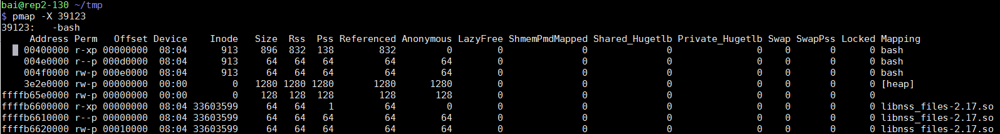

- [uprobe](#uprobe)
  - [显示所有shell输入](#显示所有shell输入)
    - [为什么所有bash进程都会触发这个probe](#为什么所有bash进程都会触发这个probe)
  - [uprobe选项](#uprobe选项)
  - [显示所有调用sleep的进程](#显示所有调用sleep的进程)
  - [其他举例](#其他举例)
- [execsnoop](#execsnoop)

> perf-tools是Brendan Gregg写的工具集, 主要由shell脚本构成, 其github地址是:
> https://github.com/brendangregg/perf-tools.git

# uprobe
参考: https://github.com/brendangregg/perf-tools/blob/master/examples/uprobe_example.txt
uprobe语法参考:
linux/Documentation/trace/uprobetracer.txt

## 显示所有shell输入
在ubuntu虚拟机和hxt服务器上测试通过
```bash
#readline是bash获取输入的函数, 在不同bash进程下的所有输入都会被捕捉到.
#r:代表return类型的probe, 在函数返回时触发, p:代表entry类型, 即在进入函数时触发
bai@rep2-130 ~/repo/perf-tools
$ sudo bin/uprobe 'r:bash:readline +0($retval):string'
Tracing uprobe readline (r:readline /usr/bin/bash:0x89cfc +0($retval):string). Ctrl-C to end.
            bash-1875  [025] ....   521.188474: readline: (0x41fb54 <- 0x489cfc) arg1="ls"
            bash-1875  [000] ....   527.165385: readline: (0x41fb54 <- 0x489cfc) arg1="foo bar"
            bash-1875  [000] ....   627.140696: readline: (0x41fb54 <- 0x489cfc) arg1="echo "hello world""
#进程名-进程号 [CPU号] flags 时间戳(s):
```
### 为什么所有bash进程都会触发这个probe
uprobe的原理是把指令替换为break命令, 这个替换是按进程替换吗?
不是. 

首先, 可执行文件`/bin/bash`被加载器打开并load到进程的内存空间, 以`mmap`的形式存在. 下图表示`/bin/bash`的`inode`是913, 地址00400000是代码段, 004f0000是数据段.
  

其次, `/bin/bash`被load后, 其内容被`mmap`到进程的地址空间, 但可能还没有加载到物理内存. 在`/bin/bash`被真正使用的时候, 比如加载完毕开始执行代码, 需要`/bin/bash`的代码段, 操作系统会分配物理页框page, 并把这部分内容读到page中, 此时代码开始执行.

`/bin/bash`被同样的映射到其他bash进程, 这里其进程号是36950, 我们发现映射和进程39123是完全一样的.  
这其实是说, 同样的可执行文件(inode相同)被map到了同样的地址(编译时确定的)
  

前面说到, `/bin/bash`会根据需要, 最终被读到某一个(或一些, 根据大小)的物理page里, 那么不同bash进程是否使用同一个物理page?

多数情况下是的, 比如代码段是只读的, 那么不同的bash进程只需要一份`/bin/bash`代码段的拷贝. 

但前面两个图中, 不同bash进程的data段也有同样的映射, 此时Linux使用写时拷贝(COW), 只有当进程真正写这个page的时候, 操作系统会拷贝一份private拷贝给进程.

根据前面的分析, `uprobe`的指令替换发生在`/bin/bash`的代码段的某个物理`page`上, 包含被`probe`地址的物理`page`, 会被`uprobe`复制成特殊的拷贝, 替换里面的目标地址的代码为`break`命令, 并修改原始引用到这个特殊的`page`拷贝.  
因为所有`bash`进程最终都会引用同一份代码段内存, 所以都会触发`break`命令, 完成`uprobe`功能, 所以不管是新开的`bash`进程, 还是老的`bash`进程, 都被`probe`了.

## uprobe选项
还支持运行时间(-d), 进程号(-p -L), 解析符号等选项
```bash
$ sudo bin/uprobe -l
bin/uprobe: option requires an argument -- l
USAGE: uprobe [-FhHsv] [-d secs] [-p PID] [-L TID] {-l target |
              uprobe_definition [filter]}
                 -F              # force. trace despite warnings.
                 -d seconds      # trace duration, and use buffers
                 -l target       # list functions from this executable
                 -p PID          # PID to match on events
                 -L TID          # thread id to match on events
                 -v              # view format file (don't trace)
                 -H              # include column headers
                 -s              # show user stack traces
                 -h              # this usage message

#比如:
bin/uprobe -l bash | grep readline
```

## 显示所有调用sleep的进程
```bash
#首先要调试glibc, 最好安装glibc-debuginfo.aarch64. 默认这个包是没有的, 需要先把CentOS-Debuginfo.repo的enable改为1
#安装好debuginfo后, 就能解析函数了: 用perf probe查看sleep的相关代码, 发现其实它是alarm
bai@rep2-130 ~/repo/perf-tools
$ perf probe -x /usr/lib64/libc-2.17.so -L sleep
<alarm@/usr/src/debug/glibc-2.17-c758a686/posix/../sysdeps/posix/alarm.c:0>
      0  alarm (unsigned int seconds)
      1  {
           struct itimerval old, new;
           unsigned int retval;
#alarm就alarm吧, 第一个参数是休眠时间, 我要打印出来, 那么在aarch64上, 第一个参数保存在x0寄存器里. 这里用u64表示64位整型, 十进制显示.
bai@rep2-130 ~/repo/perf-tools
$ sudo bin/uprobe 'p:libc:sleep %x0:u64'
which: no libc in (/usr/bin:/bin:/usr/sbin:/sbin:/usr/bin:/sbin)
Tracing uprobe sleep (p:sleep /lib64/libc-2.17.so:0xaa50c %x0:u64). Ctrl-C to end.
           crond-1647  [025] ....  4976.044644: sleep: (0xffffb3daa50c) arg1=60
           crond-1647  [025] ....  5036.048344: sleep: (0xffffb3daa50c) arg1=60

```
补充: aarch64函数调用规范
  

## 其他举例
```bash
#过滤: only trace the return of fopen() when it failed and returned NULL (0):
./uprobe 'r:libc:fopen file=$retval' 'file == 0'

#C++: 跟踪mysql的dispatch_command的query请求字符串, 这里的%dx是X86寄存器; _Z16dispatch_command19enum_server_commandP3THDPcj是C++ mangle后的函数名
./uprobe 'p:dispatch_command /opt/mysql/bin/mysqld:_Z16dispatch_command19enum_server_commandP3THDPcj +0(%dx):string'

#在上面的例子基础上, 只匹配SELECT的mysql query
./uprobe 'p:dispatch_command /opt/mysql/bin/mysqld:_Z16dispatch_command19enum_server_commandP3THDPcj cmd=+0(%dx):string' 'cmd ~ "SELECT*"'

#uprobe脚本trap了PIPE信号, 所以这个例子只显示15次, uprobe会自动退出
#有时候不知道overhead多少, 可以先用这个方法看一下, 看输出的时间戳就知道这个event频率高低
./uprobe -p 11982 p:bash:sh_malloc | head -15

#固定时间-d, 5秒内所有进程调用gettimeofday, 隐含了in-kernel buffer模式, 只在最后打印所有输出, 减小overhead.
sudo bin/uprobe -d 5 p:libc:gettimeofday
```

# execsnoop
在aarch64上运行错误, 原因是makeprobe函数, 用了x86的寄存器名


