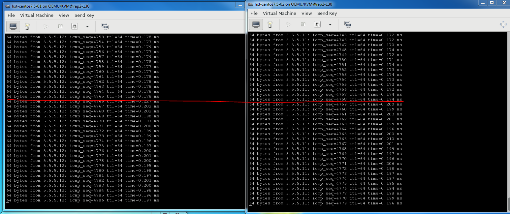
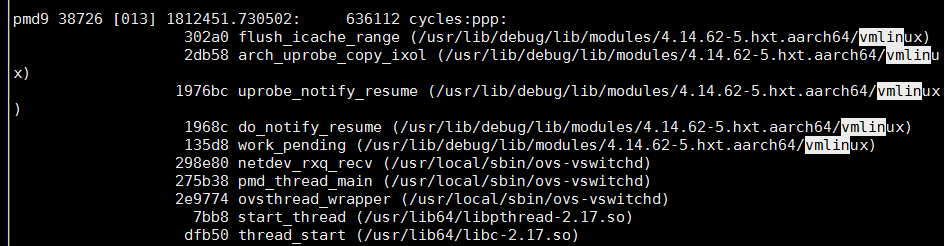
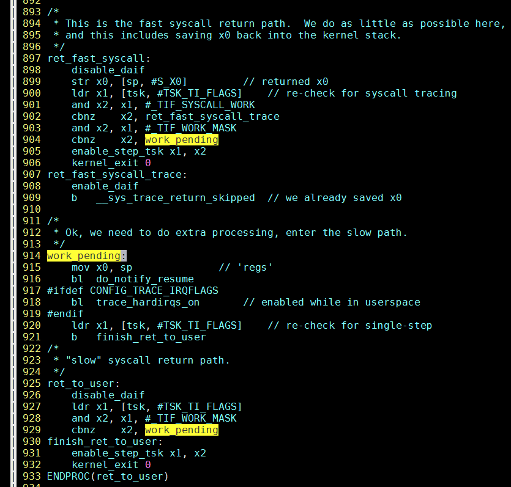
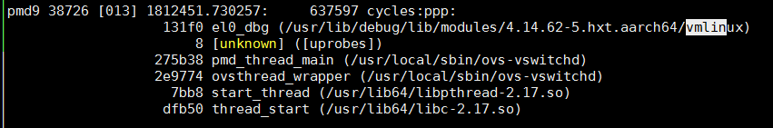
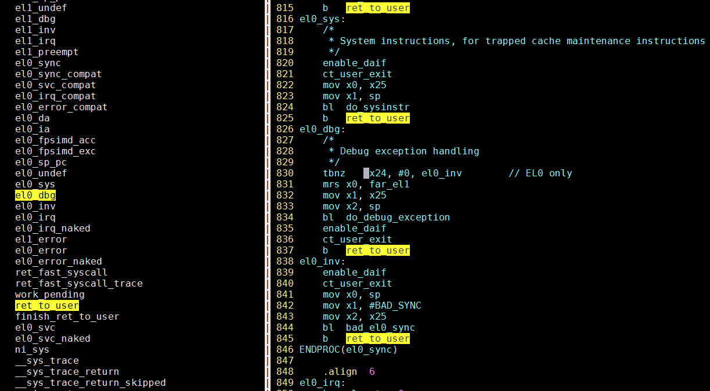
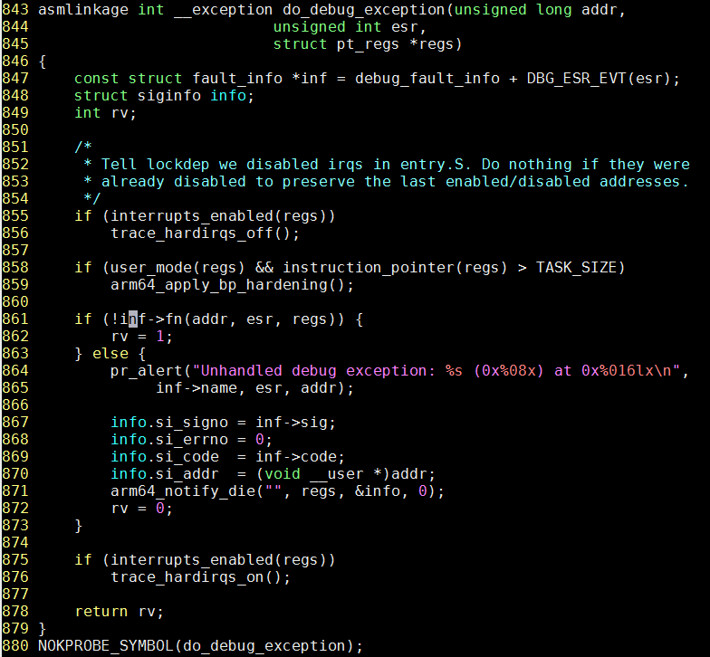
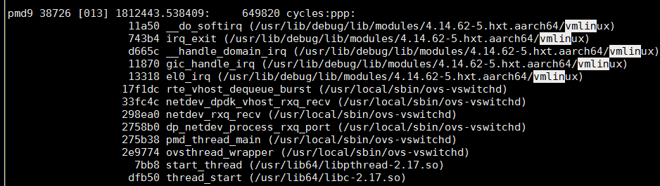
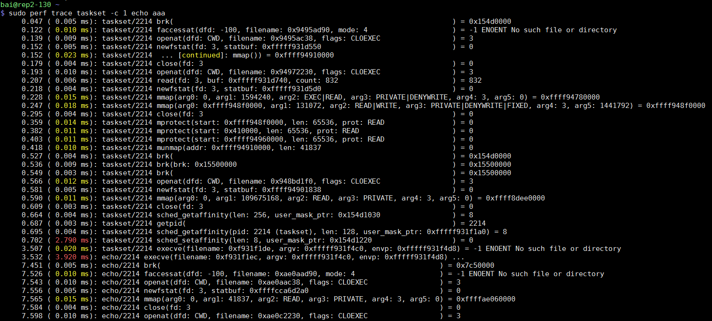
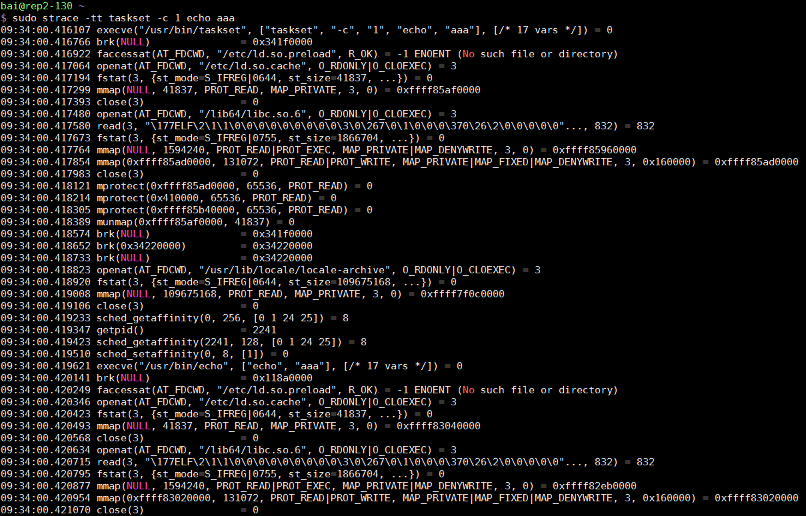
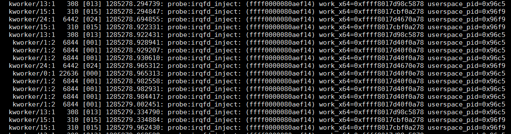

- [perf ftrace](#perf-ftrace)
  - [看一个内核函数运行时调用的所有函数](#看一个内核函数运行时调用的所有函数)
  - [看一个内核函数被调用的情况: 什么时间, 什么进程](#看一个内核函数被调用的情况-什么时间-什么进程)
  - [和trace-cmd的对比](#和trace-cmd的对比)
- [perf查看OVS转发路径执行时间](#perf查看ovs转发路径执行时间)
- [perf probe实现机制初探](#perf-probe实现机制初探)
  - [源代码](#源代码)
  - [entry.S](#entrys)
  - [跟踪do_debug_exception](#跟踪do_debug_exception)
  - [时钟中断的调用路径](#时钟中断的调用路径)
- [perf trace](#perf-trace)
- [perf作为kprobe/uprobe前端](#perf作为kprobeuprobe前端)
  - [用户态probe, 带参数, 带返回值](#用户态probe-带参数-带返回值)
  - [内核态probe, 指定vmlinux, 带参数带返回值](#内核态probe-指定vmlinux-带参数带返回值)
- [perf调度时间](#perf调度时间)
- [perf会用中断](#perf会用中断)
- [perf的几种模式](#perf的几种模式)
- [perf应用首先查统计](#perf应用首先查统计)
- [perf记录](#perf记录)
  - [perf只看某个共享库的采样](#perf只看某个共享库的采样)
  - [perf使用的内核符号路径](#perf使用的内核符号路径)
  - [perf probe内核函数, 访问结构体变量成员](#perf-probe内核函数-访问结构体变量成员)
  - [perf函数带参数](#perf函数带参数)
  - [perf函数内部变量](#perf函数内部变量)
  - [perf event 说明](#perf-event-说明)

## perf ftrace
perf ftrace是对ftrace的function_graph和function的包装. 运行结束时reset ftrace的配置.
```bash
perf ftrace <command>
-t  : 可以是function_graph或function
-p  : PID, 多pid用逗号隔开
-a  : system wide. 意思是后面跟了command, 通常只会perf这个command的事件, 但加-a可以打开整个系统的事件. 没有command一般要加-a
-C  : cpu号, 多cpu用逗号. 比如1-2,5,7-9
-T  : 对哪个函数做trace, 支持通配符. 可以多个-T联用. 传递给set_ftrace_filter
-N  : 不对哪个函数做trace. 也可以多个联用. 传递给set_ftrace_notrace
-G  : 对function_graph有效, trace函数调用的子函数. 可以多个联用. 传递给set_graph_function
-g  : 和-G相反
-D  : function graph的深度
```
### 看一个内核函数运行时调用的所有函数
```bash
# 看do_notify_resume都调用了哪些函数及其子函数, 10秒后输出结果到stdout
sudo perf ftrace -t function_graph -a -G do_notify_resume  -- sleep 10
# 部分结果
  0)               |  do_notify_resume() {
  0)   ==========> |
  0)               |    gic_handle_irq() {
  0)               |      handle_IPI() {
  0)               |        irq_enter() {
  0)   0.350 us    |          rcu_irq_enter();
  0)   2.200 us    |        }
  0)               |        __wake_up() {
  0)               |          __wake_up_common_lock() {
  0)   0.200 us    |            _raw_spin_lock_irqsave();
  0)   0.250 us    |            __wake_up_common();
  0)   0.150 us    |            _raw_spin_unlock_irqrestore();
  0)   5.350 us    |          }
  0)   6.950 us    |        }
  0)               |        irq_exit() {
  0)   0.200 us    |          idle_cpu();
  0)   0.200 us    |          rcu_irq_exit();
  0)   3.550 us    |        }
  0) + 18.350 us   |      }
  0) + 20.550 us   |    }
  0)   <========== |

```
### 看一个内核函数被调用的情况: 什么时间, 什么进程
```bash
# 看哪个进程调用了do_notify_resume
sudo perf ftrace -t function -a -T do_notify_resume  -- sleep 10
# 部分结果
            perf-2129  [025] d...  2009.215155: do_notify_resume <-work_pending
            perf-2129  [025] d...  2009.215163: do_notify_resume <-work_pending
           <...>-2130  [024] d...  2009.215231: do_notify_resume <-work_pending
           sleep-2130  [024] d...  2009.215659: do_notify_resume <-work_pending
            perf-2129  [025] d...  2009.215723: do_notify_resume <-work_pending
           sleep-2130  [024] d...  2009.215903: do_notify_resume <-work_pending
            perf-2129  [025] d...  2009.215966: do_notify_resume <-work_pending
           tuned-1707  [024] d...  2009.387082: do_notify_resume <-work_pending
            perf-2129  [025] d...  2009.387149: do_notify_resume <-work_pending
            tmux-1880  [025] d...  2009.561667: do_notify_resume <-work_pending
            perf-2129  [000] d...  2009.561736: do_notify_resume <-work_pending
            tmux-1880  [025] d...  2009.561752: do_notify_resume <-work_pending
            tmux-1880  [025] d...  2009.561806: do_notify_resume <-work_pending
            tmux-1880  [025] d...  2010.025365: do_notify_resume <-work_pending
            perf-2129  [000] d...  2010.025407: do_notify_resume <-work_pending
    in:imjournal-1826  [000] d...  2010.038161: do_notify_resume <-work_pending
```

### 和trace-cmd的对比
trace-cmd也能完成上面两项任务, 比如`sudo trace-cmd stream -p function -l irqfd_inject sleep 10`和`sudo trace-cmd stream -p function_graph -g do_notify_resume sleep 1`

perf ftrace目前只支持function和function_graph, 而trace-cmd还支持其他event联用, 比如:
```sh
sudo trace-cmd record -p function -l irqfd_inject -e sched -T sleep 10 
sudo trace-cmd record -p function_graph -g do_notify_resume -e sched -T sleep 1 
sudo trace-cmd report --cpu 0 
```

## perf查看OVS转发路径执行时间
场景是两个VM互相ping, 一秒一次. OVS走dpdk的vhost接口.

那么转发时间, 也就是报文在OVS路径下的延迟, 是从`netdev_rxq_recv`收包, 到`netdev_send`结束的时间.

上面两个函数是通过OVS代码转发流程来的, 代码要熟, 详见[OVS架构和代码](OVS_架构和代码.md)

下面用perf记录这个时间:
```bash
# 首先看看有没有这两个函数
$ sudo perf probe -x /usr/local/sbin/ovs-vswitchd -F | grep netdev_send
netdev_send
netdev_send_wait
$ sudo perf probe -x /usr/local/sbin/ovs-vswitchd -F | grep netdev_rxq_recv
netdev_rxq_recv

# 有的, 增加动态probe点
# 收包函数
$ sudo perf probe -x /usr/local/sbin/ovs-vswitchd --add netdev_rxq_recv
# 发包函数, 这里的%return表示要probe这个函数返回点
$ sudo perf probe -x /usr/local/sbin/ovs-vswitchd --add netdev_send%return

# 记录30秒, -R表示记录所有打开的counter(默认是tracepoint counters)
$ sudo perf record -e probe_ovs:netdev_rxq_recv -e probe_ovs:netdev_send -R -t 38726 -- sleep 30

# 看结果
sudo perf script | less
```

## perf probe实现机制初探
在上面例子中, 令人惊讶的是, 在perf record期间, ping的延迟增加15%, 不是非常大.

  

下图是在上面一个perf运行期间, 再起一个perf命令 `sudo perf record -C 13 -g -- sleep 60`得出的; 是的, 用另一个perf来看本perf的运行情况!

`sudo perf script | less`  
  
其中work_pending函数看起来是个入口函数, 根据probe的原理: 替换被probe指令为break, 那work_pending应该是个异常处理函数?
### 源代码
`perf probe -L work_pending`提示在`arch/arm64/kernel/entry.S:915`  
这个还是比较准的, 如果用cscope工具会找到`include/linux/workqueue.h`里面的`work_pending宏`...

为什么说`perf probe -L`准呢?  
因为一般同一个源文件的符号相近, 如果看kernel所有符号`/proc/kallsyms`的话, 会发现它附近的符号都是在`entry.S`里面的.
```sh
$ sudo cat /proc/kallsyms | grep -n3 work_pending
58-ffff0000080834b4 t el0_error_naked            
59-ffff0000080834d0 t ret_fast_syscall           
60-ffff0000080835c8 t ret_fast_syscall_trace     
61:ffff0000080835d0 t work_pending               
62-ffff0000080835e0 t ret_to_user                
63-ffff0000080835f0 t finish_ret_to_user         
64-ffff000008083700 t el0_svc 
```

### entry.S
我们看到, 整个文件只有`ret_fast_syscall`和`ret_to_user`调用了work_pending  
  

看代码, 应该走`ret_to_user`, 重点看`el0_dbg`, 因为它出现在调用栈里  
  

应该是断点指令触发异常, 到异常入口`el0_dbg`, `el0_dbg`先调用`do_debug_exception`, 然后在`ret_to_use`r里面, 调用的`work_pending`, 再往下执行, 如上面调用栈所示.  
  

### 跟踪do_debug_exception
一般的, 跟踪一个函数的执行及其调用子函数的流程, 用  
`sudo trace-cmd stream -p function_graph -g function_name -P PID`

但do_debug_exception有点特殊, 会提示错误:
```bash
$ sudo trace-cmd stream -p function_graph -g do_debug_exception -P 38726
trace-cmd: Invalid argument
  Failed to write do_debug_exception to set_graph_function.
Perhaps this function is not available for tracing.
run 'trace-cmd list -f do_debug_exception' to see if it is.
```
因为代码里, `do_debug_exception`有`NOKPROBE_SYMBOL(do_debug_exception);`声明:  
  

同文件里的`show_pte`函数, 是个普通函数, 就能正常执行  
`sudo trace-cmd stream -p function_graph -g show_pte -P 38726`

尝试用systemtap看`inf->fn`是哪个函数, 思路是先要得到运行时fn的地址, 然后用`symname`解析符号表得到函数名:
```bash
# 先查具体函数位置
$ stap -l 'kernel.function("do_debug_exception")'
kernel.function("do_debug_exception@arch/arm64/mm/fault.c:843")

# 能够看到$info:struct siginfo结构体
$ stap -L 'kernel.statement("do_debug_exception@arch/arm64/mm/fault.c:862")'
kernel.statement("do_debug_exception@arch/arm64/mm/fault.c:862") $addr:long unsigned int $esr:unsigned int $regs:struct pt_regs* $inf:struct fault_info const* $info:struct siginfo

# 用systemtap的内建函数symname()得到符号名; 但还是有错误!
$ sudo stap -e 'probe kernel.statement("do_debug_exception@arch/arm64/mm/fault.c:862") {printf("%-16s %6d [%03d] %s %24s ",execname(),tid(),cpu(),usecs_to_string(gettimeofday_us()),probefunc()) printf(":: %s\n", symname($inf->fn))}'
WARNING: probe kernel.statement("do_debug_exception@arch/arm64/mm/fault.c:862") (address 0xffff00000808128c) registration error (rc -22)
```
最后还是有错误: 注册probe时错误.

根据我现在的理解, 原因可能是: 在`entry.S`中, `el0_dbg`调用的`do_debug_exception`, 已经是在breakpoint的异常处理了; 而stap尝试再次注册一个动态probe, 那么需要替换目标地址的指令为break, 如果可以的话, 会造成breakpoint异常处理无限嵌套, 即处理break异常的函数再次触发break异常.

### 时钟中断的调用路径
从结果里还能找到arch_timer中断的记录  
  

## perf trace
perf trace和strace功能类似, 据说性能影响更小, 输出格式也更整齐一些, 便于查看; 于strace相比, 不足之处是没有参数解析

perf trace默认带时间戳, 并有每条系统调用的耗时标记, 相比之下, `strace -tt`也能带时间戳, 但没有耗时标记.

`sudo perf trace taskset -c 1 echo aaa`
  

对比`sudo strace -tt taskset -c 1 echo aaa`
  

## perf作为kprobe/uprobe前端
比如下面这个程序
```c
#include <stdio.h>
#include <stdlib.h>
#include <unistd.h>

static int func_1_cnt;
static int func_2_cnt;

static void func_1(void)
{
    func_1_cnt++;
}

static void func_2(void)
{
    func_2_cnt++;
}

int main(int argc, void **argv)
{
    int number;

    while(1) {
        sleep(1);
        number = rand() % 10;
        if (number < 5)
            func_2();
        else
            func_1();
    }
}
```

### 用户态probe, 带参数, 带返回值
用perf可以这么调试:
```bash
gcc -g -o test test.c
#动态probe点, 底层是uprobe实现
perf probe -x ./test func_2_entry=func_2
#带返回值的函数
perf probe -x ./test func_2_exit=func_2%return
perf probe -x ./test test_15=test.c:15
#带局部变量的probe点
perf probe -x ./test test_25=test.c:25 number
perf record -e probe_test:func_2_entry -e probe_test:func_2_exit -e probe_test:test_15  -e probe_test:test_25 ./test
```

### 内核态probe, 指定vmlinux, 带参数带返回值
```bash
#用-k指定vmlinux
perf probe -k vmlinux kfree_entry=kfree
perf probe -k vmlinux kfree_exit=kfree%return
#可以用-s指定kernel源码目录
perf probe -s ./  kfree_mid=mm/slub.c:3408 x
perf record -e probe:kfree_entry -e probe:kfree_exit -e probe:kfree_mid sleep 10
```

## perf调度时间
```bash
#先record
sudo perf sched record -a -C 34 -- sleep 60
#按进程显示sched事件的汇总, 比如ping进程运行了多长时间, 平均调度延迟多少, 最大调度延迟多少.
sudo perf sched latency
#perf sched底层使用kernel的sched系列静态probe点, 比如sched:sched_switch, sched:sched_wakeup等
#显示详细的sched事件
sudo perf sched script
#timehist分析上面的事件, 变成更友好的逐条显示
sudo perf sched timehist
```

## perf会用中断
`/proc/interrupts`显示, perf过程中, 会使用`GICv3  23 Level     arm-pmu`

比如我对core 5做perf: `perf -a -C 5`, 那core 5就会看到很多arm-pmu的中断, 大约3000个/秒


## perf的几种模式
perf可以有几种监视模式
* 按进程: perf默认监视进程的所有子进程和线程, `fork()`和`pthread_create()`都自动继承perf_events  
用`-p`就是这种模式, perf直接启动某个program也是这种模式;  
选项`-i`关闭监视子进程和线程.
* 按线程: 线程活动时, 才监视; 线程被调度出去时, 停止监视; 线程在CPU间迁移时, 统计会被保存然后被新CPU重新恢复.  
用`-t`来使用这种模式
* 按CPU: 监视CPU上面跑的所有线程  
用`-a`监视所有CPU, 也可以监视某几个CPU, 比如`-a -C 0,2-3`
 
## perf应用首先查统计
```bash
#硬件统计
sudo perf stat -a -d -d -d -e cpu-clock -e cycles -e instructions -e stalled-cycles-backend -e stalled-cycles-frontend -e branch-misses -e branch-loads -e L1-dcache-store-misses -e L1-dcache-stores -e l2cache_0/total-requests/ -C 5 -- sleep 3
#默认详细统计
sudo perf stat -a -d -d -d -C 5 -r 6 -- sleep 10
#反复跑6次
sudo perf stat -a -d -d -e cycles -e cpu-clock -e instructions -e stalled-cycles-backend -e stalled-cycles-frontend -e branch-misses -e branch-loads -e l2cache_0/total-requests/ -C 5 -r 6 -- sleep 10
```

## perf记录
### perf只看某个共享库的采样
下面的命令只看线程号是2019(libvirtd线程)的主体进程和libvirt.so共享库的采样, 去掉了libc, libpthread, 和kernel相关的采样. 
```bash
# --dsos是共享对象的列表, --comms是主命令列表
sudo perf top -e cycles:u -t 2019 --dsos libvirtd,libvirt.so.0.4006.0
```

### perf使用的内核符号路径
`/usr/lib/debug/lib/modules/4.14.62-5.hxt.aarch64/vmlinux`

### perf probe内核函数, 访问结构体变量成员
perf也可以probe内核函数
```bash
# 查看源码, 与stap不同的是, perf probe -L 从函数名开始记行数
$ sudo perf probe -L irqfd_inject
# 查看变量
$ sudo perf probe -V irqfd_inject:6
# 添加probe点
sudo perf probe --add 'irqfd_inject+36 work:x64 kvm:x64'
# 可以访问结构体成员, 很nice!
sudo perf probe --add 'irqfd_inject+36 work:x64 kvm->userspace_pid:x64'
# 甚至可以访问2级结构体引用, 牛! 按照C的语法来的, 指针用->, 否则用.
sudo perf probe --add 'irqfd_inject+36 work:x64 kvm->arch.max_vcpus:x64'

# 根据提示, 开始record
sudo perf record -e probe:irqfd_inject -a sleep 10
# 解析记录
sudo perf script | less
```
  

### perf函数带参数
```bash
#比如我想看testpmd里面, mlx5_tx_burst_mpw的参数
$ sudo perf probe -x arm64-armv8a-linuxapp-gcc/app/testpmd -V mlx5_tx_burst_mpw
Available variables at mlx5_tx_burst_mpw
        @<mlx5_tx_burst_mpw+0>
                 (unknown_type  dpdk_txq
                struct rte_mbuf**       pkts
                uint16_t        pkts_n
#增加动态函数点, 带参数
$ sudo perf probe -x arm64-armv8a-linuxapp-gcc/app/testpmd --add 'mlx5_tx_burst_mpw pkts_n'
Added new event:
  probe_testpmd:mlx5_tx_burst_mpw (on mlx5_tx_burst_mpw in /home/bai/share/repo/hxt/mainstream-dpdk-stable/arm64-armv8a-linuxapp-gcc/app/testpmd with pkts_n)

You can now use it in all perf tools, such as:

        perf record -e probe_testpmd:mlx5_tx_burst_mpw -aR sleep 1
        
#记录5分钟, 实际验证对性能的影响比gdb小很多, 在64B小包100%线速发包的时候, 转发性能降低50%; 在50%线速发包的时候, 对转发性能几乎没影响; 如果用gdb打断点加if的方式, 性能影响非常大, 慢百倍.
sudo perf record -e probe_testpmd:mlx5_tx_burst_mpw -a -C 34 -- sleep 300
#分析, 能显示参数pkts_n
#perf script查看每次的记录;这个文件太大, 用less; --ns是用ns显示时间
sudo perf script --ns | less
#perf report能根据pkts_n排序, 很强大
sudo perf report
```

### perf函数内部变量
```bash
#先列出可以probe的变量, -L表示--line; mlx5_tx_complete其实是个inline的函数
sudo perf probe -x arm64-armv8a-linuxapp-gcc/app/testpmd -L mlx5_tx_complete
#看第38行的可选变量
sudo perf probe -x arm64-armv8a-linuxapp-gcc/app/testpmd -V mlx5_tx_complete:38
#因为inline的关系, 这个函数在不同的调用函数里都出现了, 这里只列出一个. 
        @<mlx5_tx_burst_mpw+448>
                struct mlx5_txq_data*   txq
                struct rte_mbuf**       free
                struct rte_mempool*     pool
                uint16_t        cq_ci
                uint16_t        elts_free
                uint16_t        elts_m
                uint16_t        elts_n
                uint16_t        elts_tail
                unsigned int    blk_n
#add这个probe点要用以下格式, 详见man perf probe
[[GROUP:]EVENT=]FUNC[@SRC][:RLN|+OFFS|%return|;PTN] [ARG ...]
其中:
ARG:
    [NAME=]LOCALVAR|$retval|%REG|@SYMBOL[:TYPE]
    TYPE可以比如: u8/u16/u32/u64/s8/s16/s32/s64, x8/x16/x32/x64, 或string
#增加probe点
$ sudo perf probe -x arm64-armv8a-linuxapp-gcc/app/testpmd --add 'mlx5_tx_complete_m+328 elts_free elts_tail'
#更改一下, 用u16表示
$ sudo perf probe -x arm64-armv8a-linuxapp-gcc/app/testpmd --add 'mlx5_tx_complete_m+328 elts_free:u16 elts_tail:u16'
#开始record, 观察到dpdk转发性能直接下降为3%, 非常大!
#注: 性能下降取决于这个event被触发了多少次. 我这个probe点正好在这个函数里面的while循环里
sudo perf record -e probe_testpmd:mlx5_tx_complete_m -a -C 34 -- sleep 30
#逐条记录看
sudo perf script | less
#截取一部分, 可以看到基本上是每个event都捕捉的
elts_free_u16=65408 elts_tail_u16=65440
elts_free_u16=65440 elts_tail_u16=65472
elts_free_u16=65472 elts_tail_u16=65504
elts_free_u16=65504 elts_tail_u16=0
elts_free_u16=0 elts_tail_u16=32
elts_free_u16=32 elts_tail_u16=72
elts_free_u16=72 elts_tail_u16=104
elts_free_u16=104 elts_tail_u16=144
elts_free_u16=144 elts_tail_u16=200
elts_free_u16=200 elts_tail_u16=232
elts_free_u16=232 elts_tail_u16=292
elts_free_u16=292 elts_tail_u16=344
elts_free_u16=344 elts_tail_u16=376
```
后记
```bash
#为了能抓到这两个变量, 我在代码里while之前加了nop指令; 而之前的触发点是在while循环里
asm volatile("nop");
```
再进行record时, 由于event触发频率大大减小, dpdk转发性能下降到50%; 对比之前是3%

运行record过程中, htop可以看到有内核态程序开始占用CPU, 我估计是内核态相应PMU中断(该中断由程序"断点"硬件触发), 在中断里记录函数变量占用的时间

### perf event 说明
```bash
man perf_event_open

#火焰图
sudo perf record -g ping 5.5.5.1
sudo perf script | ~/repo/FlameGraph/stackcollapse-perf.pl | ~/repo/FlameGraph/flamegraph.pl > ping-localhost.svg

#动态probe点, 可以加在你的app里, 也可以加在内核里
sudo perf probe -x `which ovs-vswitchd` --add netdev_linux_tap_batch_send
sudo perf probe --add dev_hard_start_xmit
#record+动态probe点, -e添加你关注的统计
sudo perf record -e probe_ovs:netdev_linux_send -e probe_ovs:netdev_linux_tap_batch_send -e probe:dev_hard_start_xmit -e net:net_dev_start_xmit -p 3470 -g -o perf-ping22.data -- sleep 30

#perf也能看符号表, 跟readelf差不多
perf probe -x /lib64/libibverbs.so.1 -F
perf probe -x `which ovs-vswitchd` -F | grep ibv

#列出动态probe点
$ sudo perf probe --list
  probe_testpmd:mlx5_tx_burst_mpw (on mlx5_tx_burst_mpw+64@drivers/net/mlx5/mlx5_rxtx.c in /home/bai/share/repo/hxt/mainstream-dpdk-stable/arm64-armv8a-linuxapp-gcc/app/testpmd with pkts_n)

#删除动态点
sudo perf probe -d probe_testpmd:mlx5_tx_burst_mpw

#-n显示采样个数
sudo perf report -n

#查看详细cache统计
sudo perf stat -d -d -d -C 38 

#记录线程30秒
sudo perf record -g -t 3546 -- sleep 30

#记录核5 10秒, run 6次并显示差值
sudo perf stat -a -d -d -d -C 5 -r 6 -- sleep 10

# probe组, 用大括号括起来; 后面加:S是说组长(第一个成员)做为采样方式, 详见man perf list
sudo perf probe --add irq_work_queue
sudo perf top -e '{cycles,probe:irq_work_queue}:S' -a -C5 -g --no-children
sudo perf record -e probe:irq_work_queue -a -C5 -g -- sleep 10
sudo perf report -n
```