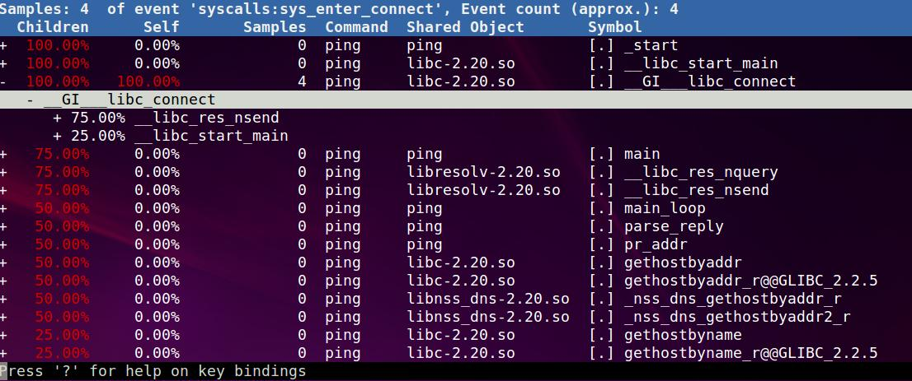
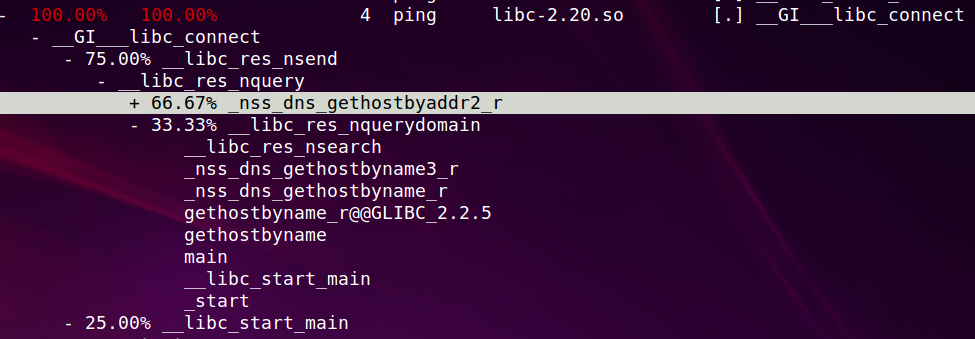
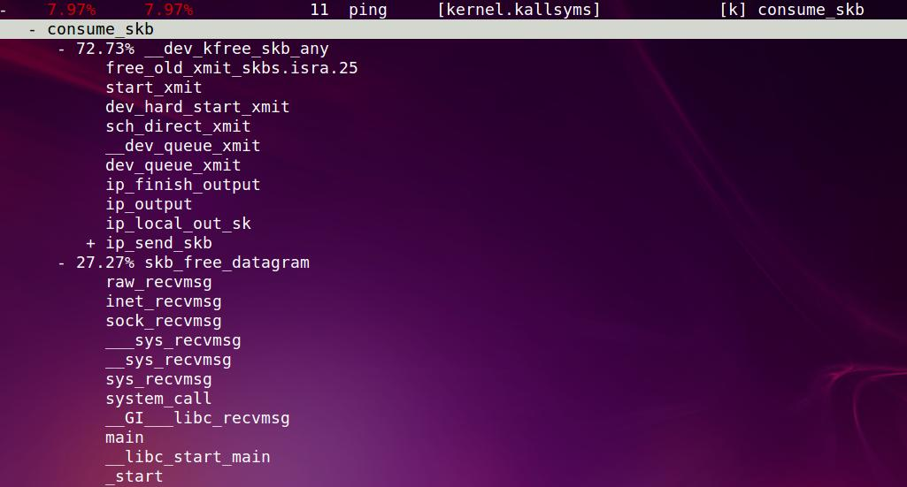
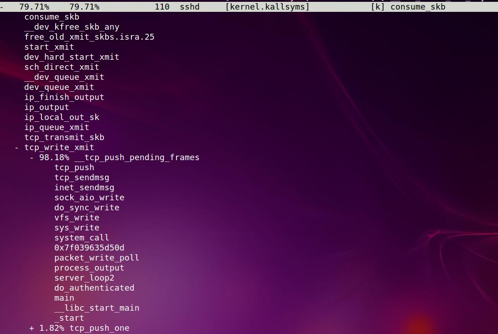
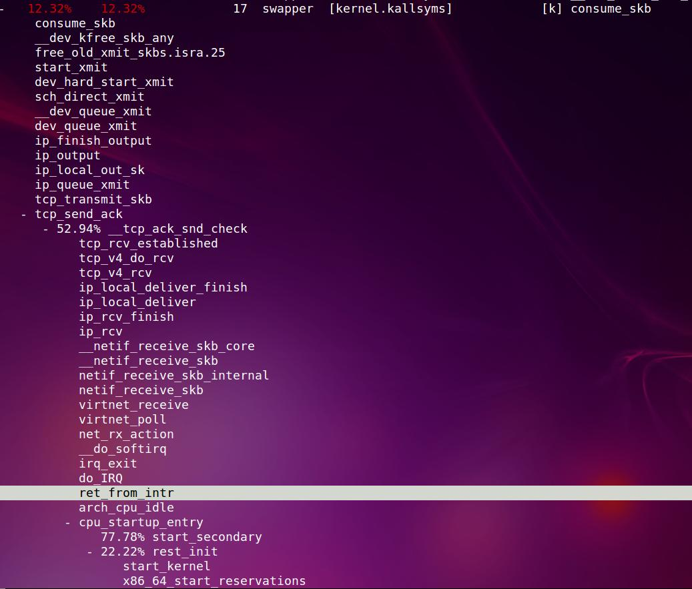
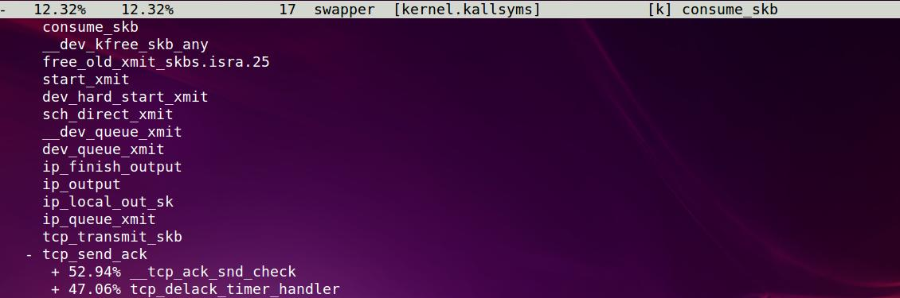
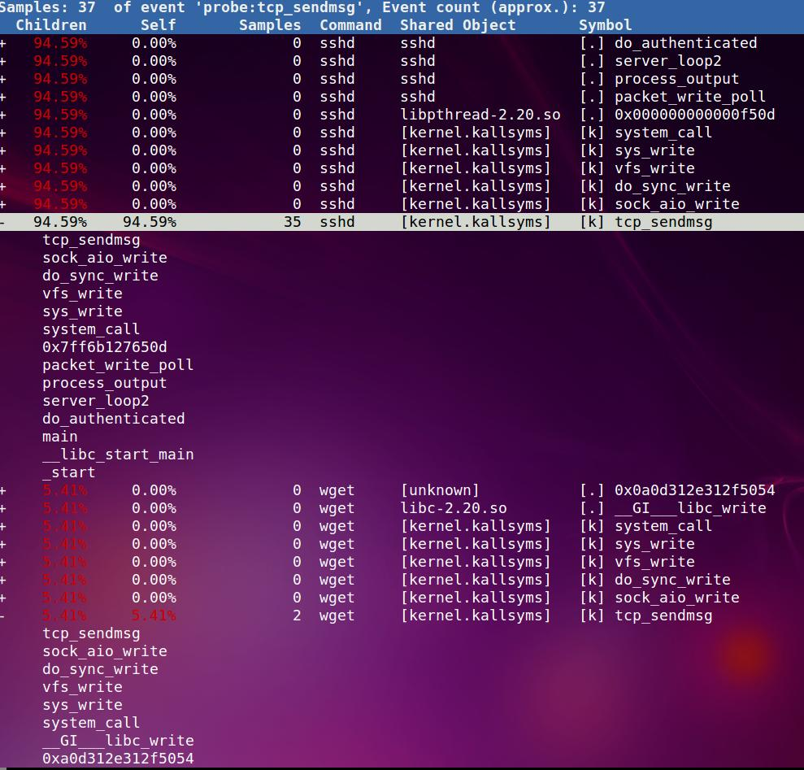
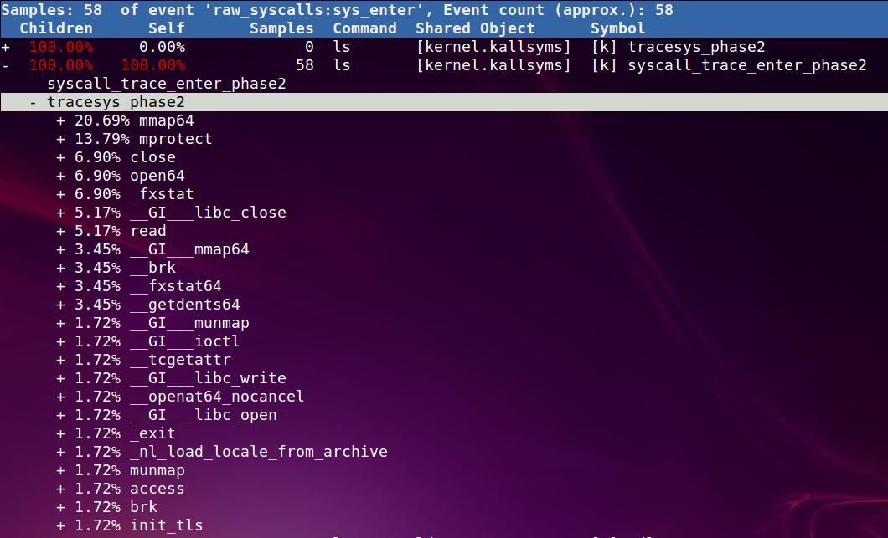

- [perf初体验](#perf初体验)
- [perf简介](#perf简介)
- [列出事件](#列出事件)
- [perf top](#perf-top)
- [事件计数 perf stat](#事件计数-perf-stat)
- [系统剖析 perf record](#系统剖析-perf-record)
- [静态剖析 perf record -e](#静态剖析-perf-record--e)
- [动态剖析 perf probe](#动态剖析-perf-probe)
- [剖析结果](#剖析结果)
- [关于符号](#关于符号)
- [关于调用栈 -g](#关于调用栈--g)
- [使用举例](#使用举例)
- [事件](#事件)
- [举例](#举例)
- [CPU剖析](#cpu剖析)
- [硬件事件举例](#硬件事件举例)
- [静态perf](#静态perf)
- [统计新进程的创建](#统计新进程的创建)
- [调查谁调用了`connect()`系统调用](#调查谁调用了connect系统调用)
- [调查sk buffer的使用](#调查sk-buffer的使用)
- [动态跟踪](#动态跟踪)
  - [Kernel: tcp_sendmsg()](#kernel-tcp_sendmsg)
  - [带size的Kernel: tcp_sendmsg()](#带size的kernel-tcp_sendmsg)
  - [用户态的malloc](#用户态的malloc)
  - [ping的usage跟踪](#ping的usage跟踪)
    - [带变量的ping](#带变量的ping)
  - [查看系统调用次数](#查看系统调用次数)
  - [misc](#misc)
  - [perf wiki里的例子](#perf-wiki里的例子)

> https://perf.wiki.kernel.org/index.php/Tutorial

# perf初体验
早上专家使用perf来分析mysql的延时问题, 用perf做系统分析简直是神奇的体验, 和以前的土办法相比, 是从盲人摸象到全球GPS.

# perf简介
perf是基于event的, 可以是硬件的一些perf events, 也可以是软件的一些桩.  
它用来解决以下问题:
* 哪些代码占用CPU最多? 代码调用路径是什么?
* 哪些代码路径产生了L2 cache miss
* 哪些代码路径正在申请内存, 申请了多大?
* 什么触发了一次TCP传输?
* 一个特定的内核函数是否在使用? 使用频率是多少?
* 一个线程离开这个CPU的原因是什么?

perf是内核提供的, 在tools/perf下面, 需要ftrace支持.
相关的内核文档在tools/perf/Documentation

# 列出事件
perf支持多种event类型, 用perf list可以列出来.

比如列出所有调度相关的事件
```shell
perf list 'sched:*'
```

# perf top
```shell
# Show system calls by process, refreshing every 2 seconds:
# 实时显示perf top, 显示次数-n, 按comm排序-s
perf top -e raw_syscalls:sys_enter -ns comm
```

# 事件计数 perf stat
```shell
# CPU counter statistics for the specified command:
统计一个命令的执行情况, 不带-a, 带-a表示要统计整个系统
perf stat command
# Detailed CPU counter statistics (includes extras) for the specified command:
更详细的统计
perf stat -d command
# CPU counter statistics for the specified PID, until Ctrl-C:
统计某个进程
perf stat -p PID
# CPU counter statistics for the entire system, for 5 seconds:
统计整个系统, 注意这是-a的意义
perf stat -a sleep 5
# Various basic CPU statistics, system wide, for 10 seconds:
统计某些event, 整个系统
perf stat -e cycles,instructions,cache-references,cache-misses,bus-cycles -a sleep 10
# Various CPU level 1 data cache statistics for the specified command:
对某个命令统计L1相关的东东
perf stat -e L1-dcache-loads,L1-dcache-load-misses,L1-dcache-stores command
# Various CPU data TLB statistics for the specified command:
对某个命令统计TLB相关的东东
perf stat -e dTLB-loads,dTLB-load-misses,dTLB-prefetch-misses command
# Various CPU last level cache statistics for the specified command:
LLC是系统的最后一级cache
perf stat -e LLC-loads,LLC-load-misses,LLC-stores,LLC-prefetches command
# Count system calls for the specified PID, until Ctrl-C:
统计某个进程的所有系统调用
perf stat -e 'syscalls:sys_enter_*' -p PID
# Count system calls for the entire system, for 5 seconds:
统计整个系统的系统调用
perf stat -e 'syscalls:sys_enter_*' -a sleep 5
# Count scheduler events for the specified PID, until Ctrl-C:
统计某个进程的调度事件
perf stat -e 'sched:*' -p PID
# Count scheduler events for the specified PID, for 10 seconds:
统计某个进程的调度事件10秒钟, 这么说perf的对象是-p的进程而不是后面的命令?
perf stat -e 'sched:*' -p PID sleep 10
# Count ext4 events for the entire system, for 10 seconds:
统计整个系统的ext4事件, 10秒
perf stat -e 'ext4:*' -a sleep 10
# Count block device I/O events for the entire system, for 10 seconds:
统计整个系统的block事件, 10秒
perf stat -e 'block:*' -a sleep 10
```

# 系统剖析 perf record
```shell
# Sample on-CPU functions for the specified command, at 99 Hertz:
99hz记录一个命令
perf record -F 99 command
# Sample on-CPU functions for the specified PID, at 99 Hertz, until Ctrl-C:
99hz记录一个进程
perf record -F 99 -p PID
# Sample on-CPU functions for the specified PID, at 99 Hertz, for 10 seconds:
99hz记录一个进程10秒
perf record -F 99 -p PID sleep 10
# Sample CPU stack traces for the specified PID, at 99 Hertz, for 10 seconds:
99hz记录一个进程10秒, 带调用栈
perf record -F 99 -p PID -g -- sleep 10
# Sample CPU stack traces for the PID, using dwarf to unwind stacks, at 99 Hertz, for 10 seconds:
99hz记录一个进程10秒, 带调用栈(dwarf方式)
perf record -F 99 -p PID -g dwarf sleep 10
# Sample CPU stack traces for the entire system, at 99 Hertz, for 10 seconds:
99hz记录整个系统10秒, 带调用栈
perf record -F 99 -ag -- sleep 10
# Sample CPU stack traces for the entire system, with dwarf stacks, at 99 Hertz, for 10 seconds:
99hz记录整个系统10秒, 带调用栈(dwarf方式)
perf record -F 99 -ag dwarf sleep 10
# Sample CPU stack traces, once every 10,000 Level 1 data cache misses, for 5 seconds:
记录L1 cache miss, 每10000次miss采样一次, 整个系统5秒, 带调用栈
perf record -e L1-dcache-load-misses -c 10000 -ag -- sleep 5
# Sample CPU stack traces, once every 100 last level cache misses, for 5 seconds:
采样LLC miss, 100次sample一次, 5秒
perf record -e LLC-load-misses -c 100 -ag -- sleep 5
# Sample on-CPU kernel instructions, for 5 seconds:
采样整个系统的内核态热点代码, 5秒
perf record -e cycles:k -a -- sleep 5
# Sample on-CPU user instructions, for 5 seconds:
采样整个系统的用户态热点代码, 5秒
perf record -e cycles:u -a -- sleep 5
# Sample on-CPU instructions precisely (using PEBS), for 5 seconds:
不知道这个PEBS是啥东东
perf record -e cycles:p -a -- sleep 5
# Perform branch tracing (needs HW support), for 1 second:
采样分支, 1秒
perf record -b -a sleep 1
```

# 静态剖析 perf record -e
```shell
# Trace new processes, until Ctrl-C:
采样新的进程, 整个系统
perf record -e sched:sched_process_exec -a
# Trace all context-switches, until Ctrl-C:
采样所有的上下文切换, 整个系统
perf record -e context-switches -a
# Trace all context-switches with stack traces, until Ctrl-C:
采样所有的上下文切换, 整个系统, 带调用栈
perf record -e context-switches -ag
# Trace all context-switches with stack traces, for 10 seconds:
采样所有的上下文切换, 整个系统, 带调用栈, 10秒
perf record -e context-switches -ag -- sleep 10
# Trace CPU migrations, for 10 seconds:
采样任务在CPU间的migration, 10秒
perf record -e migrations -a -- sleep 10
# Trace all connect()s with stack traces (outbound connections), until Ctrl-C:
采样整个系统的connect调用, 即outbound连接
perf record -e syscalls:sys_enter_connect -ag
# Trace all accepts()s with stack traces (inbound connections), until Ctrl-C:
采样整个系统accept调用, 即inbound连接
perf record -e syscalls:sys_enter_accept* -ag
# Trace all block device (disk I/O) requests with stack traces, until Ctrl-C:
采样整个系统的IO请求?
perf record -e block:block_rq_insert -ag
# Trace all block device issues and completions (has timestamps), until Ctrl-C:
采样整个系统的IO issue?
perf record -e block:block_rq_issue -e block:block_rq_complete -a
# Trace all block completions, of size at least 100 Kbytes, until Ctrl-C:
利用filter功能, 保留100K字节的, 但是谁知道这里的filter里面应该写什么????
perf record -e block:block_rq_complete --filter 'nr_sector > 200'
# Trace all block completions, synchronous writes only, until Ctrl-C:
利用filter, 只看同步写
perf record -e block:block_rq_complete --filter 'rwbs == "WS"'
# Trace all block completions, all types of writes, until Ctrl-C:
利用filter, 只看写
perf record -e block:block_rq_complete --filter 'rwbs ~ "*W*"'
# Trace all minor faults (RSS growth) with stack traces, until Ctrl-C:
RSS growth是啥?
perf record -e minor-faults -ag
# Trace all page faults with stack traces, until Ctrl-C:
页缺失?
perf record -e page-faults -ag
# Trace all ext4 calls, and write to a non-ext4 location, until Ctrl-C:
把输出文件改到非ext4的地方
perf record -e 'ext4:*' -o /tmp/perf.data -a
# Trace kswapd wakeup events, until Ctrl-C:
kswapd是啥?
perf record -e vmscan:mm_vmscan_wakeup_kswapd -ag
```

# 动态剖析 perf probe
```shell
# Add a tracepoint for the kernel tcp_sendmsg() function entry ("--add" is optional):
添加内核tcp_sendmsg()函数到跟踪点
perf probe --add tcp_sendmsg
# Remove the tcp_sendmsg() tracepoint (or use "--del"):
删除刚才加的tcp_sendmsg()
perf probe -d tcp_sendmsg
# Add a tracepoint for the kernel tcp_sendmsg() function return:
还是tcp_sendmsg(), 在跟踪点加到return
perf probe 'tcp_sendmsg%return'
# Show available variables for the kernel tcp_sendmsg() function (needs debuginfo):
显示tcp_sendmsg()的参数
perf probe -V tcp_sendmsg
# Show available variables for the kernel tcp_sendmsg() function, plus external vars (needs debuginfo):
显示tcp_sendmsg()的参数, 还有外部变量, 会显示很多全局变量
perf probe -V tcp_sendmsg --externs
# Show available line probes for tcp_sendmsg() (needs debuginfo):
显示tcp_sendmsg()里可用的行号, 难道还不是所有行都能用?
perf probe -L tcp_sendmsg
# Show available variables for tcp_sendmsg() at line number 81 (needs debuginfo):
显示tcp_sendmsg()的81行处的变量
perf probe -V tcp_sendmsg:81
# Add a tracepoint for tcp_sendmsg(), with three entry argument registers (platform specific):
再加三个参数寄存器? 比如X86的 ax dx cx
perf probe 'tcp_sendmsg %ax %dx %cx'
# Add a tracepoint for tcp_sendmsg(), with an alias ("bytes") for the %cx register (platform specific):
bytes就用cx的东西?
perf probe 'tcp_sendmsg bytes=%cx'
# Trace previously created probe when the bytes (alias) variable is greater than 100:
难道filter里面是入参?
perf record -e probe:tcp_sendmsg --filter 'bytes > 100'
# Add a tracepoint for tcp_sendmsg() return, and capture the return value:
这个实用, 跟踪tcp_sendmsg()的返回, 并捕捉返回值
perf probe 'tcp_sendmsg%return $retval'
# Add a tracepoint for tcp_sendmsg(), and "size" entry argument (reliable, but needs debuginfo):
加上入参size
perf probe 'tcp_sendmsg size'
# Add a tracepoint for tcp_sendmsg(), with size and socket state (needs debuginfo):
同时捕捉sk->__sk_common.skc_state, 这个sk也是个入参
perf probe 'tcp_sendmsg size sk->__sk_common.skc_state'
# Tell me how on Earth you would do this, but don't actually do it (needs debuginfo):
这个也有用, 详细显示这个命令到底搞了些什么玩意儿, 但不真正做.
perf probe -nv 'tcp_sendmsg size sk->__sk_common.skc_state'
# Trace previous probe when size is non-zero, and state is not TCP_ESTABLISHED(1) (needs debuginfo):
还是利用filter, 过滤入参的某些条件
perf record -e probe:tcp_sendmsg --filter 'size > 0 && skc_state != 1' -a
# Add a tracepoint for tcp_sendmsg() line 81 with local variable seglen (needs debuginfo):
加某个函数的某行, 并加个变量
perf probe 'tcp_sendmsg:81 seglen'
# Add a tracepoint for do_sys_open() with the filename as a string (needs debuginfo):
带文件名, 字符串格式. 结果好像也没多什么
perf probe 'do_sys_open filename:string'
# Add a tracepoint for myfunc() return, and include the retval as a string:
返回值为字符串
perf probe 'myfunc%return +0($retval):string'
# Add a tracepoint for the user-level malloc() function from libc:
加libc里面的malloc
perf probe -x /lib64/libc.so.6 malloc
# List currently available dynamic probes:
列出新加的probe点
perf probe -l
```

# 剖析结果
```shell
# Show perf.data in an ncurses browser (TUI) if possible:
perf report
# Show perf.data with a column for sample count:
perf report -n
# Show perf.data as a text report, with data coalesced and percentages:
perf report --stdio
# List all raw events from perf.data:
配合perf record -e选项使用
perf script
# List all raw events from perf.data, with customized fields:
指定某些域
perf script -f time,event,trace
# Dump raw contents from perf.data as hex (for debugging):
perf script -D
# Disassemble and annotate instructions with percentages (needs some debuginfo):
perf annotate --stdio
```

# 关于符号
perf需要符号表来把地址转成符号,所以需要为一些软件安装符号包, 比如  
openssh-server-dbgsym libc6-dbgsym coreutils-dbgsym

编内核的时候需要CONFIG_KALLSYMS

如果是自己编译的软件, 要保证最后的elf不能被strip

对于JIT虚拟机, perf也是支持的, 但需要JIT自己维护一个map表

# 关于调用栈 -g
编译的时候要带上frame pointers选项, 这个是gcc的选项`-fno-omit-frame-pointer`, 这个默认是关闭的(-O2)

内核也需要打开帧选项CONFIG_FRAME_POINTER=y, 这时可以看到整个的调用路径

补充: CONFIG_DEBUG_FS CONFIG_KPROBE_EVENT CONFIG_KPROBES 这个也要打开, 才能使用probe功能

Tracers里面的东东也打开一些

关于用户态的调用栈, 如果没有编帧指针, 可以加-g dwarf, 这个东东利用了libunwind来解析用户态调用栈.

# 使用举例
```shell
Performance counter summaries, including IPC, for the gzip command:
统计摘要
# perf stat gzip largefile
Count all scheduler process events for 5 seconds, and count by tracepoint:
统计5秒内的线程调度
# perf stat -e 'sched:sched_process_*' -a sleep 5
Trace all scheduler process events for 5 seconds, and count by both tracepoint and process name:
report方式统计5秒内的线程调度
# perf record -e 'sched:sched_process_*' -a sleep 5
# perf report
Trace all scheduler process events for 5 seconds, and dump per-event details:
同上, 显示的更详细?
# perf record -e 'sched:sched_process_*' -a sleep 5
# perf script
Trace read() syscalls, when requested bytes is less than 10:
统计字节小于10的read()系统调用
# perf record -e 'syscalls:sys_enter_read' --filter 'count < 10' -a
Sample CPU stacks at 99 Hertz, for 5 seconds:
统计系统5秒钟, 带调用栈信息-g
# perf record -F 99 -ag -- sleep 5
# perf report
Dynamically instrument the kernel tcp_sendmsg() function, and trace it for 5 seconds, with stack traces:
# perf probe --add tcp_sendmsg
# perf record -e probe:tcp_sendmsg -ag -- sleep 5
# perf probe --del tcp_sendmsg
# perf report
注:这里的-- sleep 5, --是用来分隔perf和后面的命令的, sleep 5是要执行的命令
```

# 事件
事件分三种:
1. 硬件事件: 比如CPU cycle, 内存停顿sycle, L2 miss
2. 软件事件: 各种kernel计数器, 比如任务迁移计数
3. 跟踪点事件: 基于ftrace框架, 功能强大, 比如统计系统调用, TCP事件, 文件系统IO, 磁盘IO, 和几乎每个内核函数的callback. 这里的事件按组命名, "sock:" 套接字事件, "sched:" 调度事件.  
对这些事件的perf, 能够显示很多细节的东西, 比如时间戳, 调用路径等等.
另外, 还有两种事件:
4. profiling事件: 用perf record -FHz来做CPU利用率的剖析.
5. 动态跟踪事件: 可以制定任意的函数来跟踪, 在内核态基于kprobes, 用户态基于uprobes.

# 举例
用gzip压缩一个110M的vmlinux
```shell
GG bin # cp /usr/src/linux/vmlinux .
GG bin # ./perf stat -d gzip vmlinux
Performance counter stats for 'gzip vmlinux':
       9662.335548      task-clock (msec)         #    0.999 CPUs utilized
                32      context-switches          #    0.003 K/sec
                 0      cpu-migrations            #    0.000 K/sec
               128      page-faults               #    0.013 K/sec
                 0      cycles                    #    0.000 GHz
   <not supported>      stalled-cycles-frontend
   <not supported>      stalled-cycles-backend
    37,714,770,423      instructions
     8,249,209,924      branches                  #  853.749 M/sec
       302,481,164      branch-misses             #    3.67% of all branches
     7,449,830,657      L1-dcache-loads           #  771.018 M/sec
     1,350,272,478      L1-dcache-load-misses     #   18.12% of all L1-dcache hits
   <not supported>      LLC-loads
   <not supported>      LLC-load-misses
       9.676657443 seconds time elapsed
```

# CPU剖析
```shell
# perf record -F 99 -a -g -- sleep 30
# perf report --stdio
```

# 硬件事件举例
`# perf record -e L1-dcache-load-misses -c 10000 -ag -- sleep 5`

# 静态perf
统计gzip的系统调用, 注意这里的重定向2>&1, 否则awk抓不到东西.  
默认perf的输出应该是stderr, 而awk的输入是stdout
```shell
GG bin # ./perf stat -e 'syscalls:sys_enter_*' gzip vmlinux -fk 2>&1 | awk '$1 != 0'
Performance counter stats for 'gzip vmlinux -fk':
                 1      syscalls:sys_enter_utimensat
                 1      syscalls:sys_enter_unlink
                 3      syscalls:sys_enter_newfstat
                 1      syscalls:sys_enter_lseek
             3,800      syscalls:sys_enter_read
             3,692      syscalls:sys_enter_write
                 1      syscalls:sys_enter_access
                 1      syscalls:sys_enter_fchmod
                 1      syscalls:sys_enter_fchown
                 5      syscalls:sys_enter_open
                 7      syscalls:sys_enter_close
                 4      syscalls:sys_enter_mprotect
                 1      syscalls:sys_enter_brk
                 1      syscalls:sys_enter_munmap
                 4      syscalls:sys_enter_rt_sigprocmask
                12      syscalls:sys_enter_rt_sigaction
                 1      syscalls:sys_enter_exit_group
                 8      syscalls:sys_enter_mmap
       9.798567700 seconds time elapsed
```
注: 用`strace -c`也可以统计系统调用, 但是用perf的overhead要低很多, 因为perf的buffer data都在kernel里.

strace是用ptrace attach到被跟踪的线程上的, 类似于debugger, 代价很高.
下面是性能的对比:可以看到, perf是原来的2.5X, 而strace是62X.
```shell
# dd if=/dev/zero of=/dev/null bs=512 count=10000k
5242880000 bytes (5.2 GB) copied, 3.53031 s, 1.5 GB/s
# perf stat -e 'syscalls:sys_enter_*' dd if=/dev/zero of=/dev/null bs=512 count=10000k
5242880000 bytes (5.2 GB) copied, 9.14225 s, 573 MB/s
# strace -c dd if=/dev/zero of=/dev/null bs=512 count=10000k
5242880000 bytes (5.2 GB) copied, 218.915 s, 23.9 MB/s
```

# 统计新进程的创建
```shell
GG bin # ./perf record -e sched:sched_process_exec -a
Lowering default frequency rate to 3200.
Please consider tweaking /proc/sys/kernel/perf_event_max_sample_rate.
```
注: 这个命令会在前台独占, 所以要测试比如`man ls`, 需要在另外的窗口执行.  
执行完, 把这个前台进程ctrl+c掉

```
^C[ perf record: Woken up 1 times to write data ]                                     
[ perf record: Captured and wrote 0.061 MB perf.data (~2657 samples) ]
```
然后, 显示报告, -n是把sample计数也打出来.  
可以看到, 一共调用了15次, 而bzip2调了5次
```shell
GG bin # ./perf report -n --sort comm --stdio
# Samples: 15  of event 'sched:sched_process_exec'
# Event count (approx.): 15
#
# Overhead       Samples  Command
# ........  ............  .......
#
    33.33%             5  bzip2
     6.67%             1  groff
     6.67%             1  grotty
     6.67%             1  less
     6.67%             1  locale
     6.67%             1  man
     6.67%             1  manconv
     6.67%             1  nroff
     6.67%             1  preconv
     6.67%             1  tbl
     6.67%             1  troff
```

# 调查谁调用了`connect()`系统调用
比如一个服务, 我们想知道它发起了哪些连接, 以及为什么要发起这些连接.

我在一个窗口执行  
`# ./perf record -e syscalls:sys_enter_connect -ag`

在另外一个窗口执行  
`# ping www.baidu.com`

然后停止perf, 运行`# ./perf report -n`, 这里-n是显示sample次数  
  

怎么读这个图呢?  
首先第一行, 有4次syscalls:sys_enter_connect事件.  
然后看第二列, 这一列是说直接调用`syscalls:sys_enter_connect`的地方, 就是`__GI___libc_connect`, 只有它在第二列是100%.  
第一列是间接调用到`syscalls:sys_enter_connect`的地方, 因为在perf期间, 只有ping在运行, 所以ping的_start肯定占了100%的connect调用(间接)

这里有趣的是, main只占了其中的75%, 那另外25%就是在main之前调的.

下面只看main里面直接调用connect的路径, 有两条, 我们看以下33.33%的那条, 可以看到整个从_start到main再到connect的整个调用路径.

这里就回答了谁调用了这个函数?为什么调用?  
  

# 调查sk buffer的使用
通过调查sk buffer的consumption, 可以知道有哪些东东导致了network IO.

和上面一样, 两个窗口  
`# ./perf record -e 'skb:consume_skb' -ag`
还是ping一下百度  
`# ping www.baidu.com`
然后看结果  
一共138次, sshd用了79.71%, 一个叫swapper的东东占了12.32%, ping占了7.97%  
我这里省略了其他的间接调用
```shell
Samples: 138  of event 'skb:consume_skb', Event count (approx.): 138
+   79.71%    79.71%           110  sshd     [kernel.kallsyms]            [k] consume_skb
-   12.32%    12.32%            17  swapper  [kernel.kallsyms]            [k] consume_skb
+    7.97%     7.97%            11  ping     [kernel.kallsyms]            [k] consume_skb
```
以ping为例, 这里可以看到整个ping的调用路径  
  
下面再来看看sshd的路径  
  
最有意思的是swapper, 它的路径是:
```c
idle进程, arch_cpu_idle()
CPU执行路径被硬件中断切换(下图反选部分开始),ret_from_intr在arch/x86/kernel/entry_64.S
    do_IRQ(), 在arch/x86/kernel/irq.c,
        这里会处理中断, 不在我们的调用栈里, 暂且不表
        irq_exit(), 在kernel/softirq.c, 为什么在softirq.c呢? 因为这个函数发的目的是退出硬件中断, 如果需要的话, 处理软中断
            invoke_softirq()
                这里有两个分支, 一个是直接调__do_softirq(), 另一个是wakeup_softirqd()
                因为现在还是在硬中断里, 直接调的话就失去了软中断的意义
                所以这里据我考证, force_irqthreads=1, 应该是调:
                wakeup_softirqd()
                    这里先获取这个软中断进程的tsk指针
                    struct task_struct *tsk = __this_cpu_read(ksoftirqd);
                    这个软中断tsk不在运行的话, 就把它唤醒
                    if (tsk && tsk->state != TASK_RUNNING)
                        wake_up_process(tsk);
```
软中断进程
```c
run_ksoftirqd()
    local_irq_disable()
    不要误以为所有的软中断都在禁止中断下运行的, 因为这个软中断处理函数里, 也会打开中断.
    __do_softirq(), 这个函数会根据sofiqr在哪个bit, 来调相应的回调函数h->action(h).在这里是:
        net_rx_action(), 下面就是处理协议栈了
    local_irq_enable()
```
  
* core 0执行
```c
start_kernel()
    各种init()
    rest_init()
        kernel_thread(kernel_init, NULL, CLONE_FS);
        kernel_thread(kthreadd, NULL, CLONE_FS | CLONE_FILES);
        //注意下面的函数可能被其他core执行, 本质上都是idle进程
        cpu_startup_entry(CPUHP_ONLINE);
            cpu_idle_loop();
                while(1)
                    //先禁止本地中断
                    local_irq_disable()
                    cpuidle_idle_call()
                        if (need_resched())
                            local_irq_enable();
                            return;
                        //x86实现的
                        arch_cpu_idle()
```
* 其他core被core 0唤醒后执行
```c
start_secondary()
    cpu_startup_entry(CPUHP_ONLINE);
```

下面再来看perf对调用的统计结果里面有什么规律, 能够体现什么原理:

首先, perf hit到事件, 就记录一次调用路径,  
比如这个swapper里, 有17次hit到事件, 根据这17次的调用路径, perf能够给出不同分支的分布.  
甚至这个调用路径能够回溯到系统初始化的代码, 因为中断的关系, 中断接替了idle来完成某次的运行路径.从而能让我们看到idle进程的由来.

比如上面的图里, 每个core都有自己的idle, 并且core 0的idle是从rest_init路径来的.  
而其他core是从start_secondary路径来的. 分布大约为3:1, 这也符合了我电脑的4核配置.

  

# 动态跟踪
需要打开内核选项  
`CONFIG_KPROBES=y CONFIG_KPROBE_EVENTS=y CONFIG_FRAME_POINTER=y CONFIG_UPROBES=y CONFIG_UPROBE_EVENTS=y CONFIG_DEBUG_INFO=y`

## Kernel: tcp_sendmsg()
比如我想知道`tcp_sendmsg()`的调用情况
```c
GG bin # ./perf probe --add tcp_sendmsg
Added new event:
  probe:tcp_sendmsg    (on tcp_sendmsg)
You can now use it in all perf tools, such as:
        perf record -e probe:tcp_sendmsg -aR sleep 1
```
record  
`./perf record -e probe:tcp_sendmsg -ag -- sleep 5`
因为是tcp, 我在另外一个窗口执行`wget www.baidu.com`, 下面是统计结果:

一共有37次tcp_sendmsg(准吗? 如果perf是根据中断计数的, 可能不准; 如果是直接在函数地址打断点之类的, 应该准)

其中sshd有35次, 我刚执行的wget有2次, 都显示了整个调用路径. 但有些符号没发解析?是哪些共享库吗?  
  

用完以后, 要删除这个event  
`GG bin # ./perf probe --del tcp_sendmsg`

## 带size的Kernel: tcp_sendmsg()
先看看这个函数有哪些参数
```shell
GG bin # ./perf probe -V tcp_sendmsg
Available variables at tcp_sendmsg
        @<tcp_sendmsg+0>
                size_t  size
                struct kiocb*   iocb
                struct msghdr*  msg
                struct sock*    sk
```
带size
```shell
GG bin # ./perf probe --add 'tcp_sendmsg size'
Added new event:
  probe:tcp_sendmsg    (on tcp_sendmsg with size)
You can now use it in all perf tools, such as:
        perf record -e probe:tcp_sendmsg -aR sleep 1
```
记录
```shell
GG bin # ./perf record -e probe:tcp_sendmsg -a
^C[ perf record: Woken up 1 times to write data ]
[ perf record: Captured and wrote 0.063 MB perf.data (~2738 samples) ]
```
用perf script分析, 可以看到每次传的size
```shell
GG bin # ./perf script
            sshd   954 [000] 17352.267210: probe:tcp_sendmsg: (ffffffff814b4790) size=0x108
            sshd   954 [003] 17353.576942: probe:tcp_sendmsg: (ffffffff814b4790) size=0x1028
            sshd   954 [003] 17353.577130: probe:tcp_sendmsg: (ffffffff814b4790) size=0x3b8
            sshd   954 [003] 17353.591157: probe:tcp_sendmsg: (ffffffff814b4790) size=0x148
            sshd   954 [003] 17353.769294: probe:tcp_sendmsg: (ffffffff814b4790) size=0x108
            sshd   954 [003] 17357.122057: probe:tcp_sendmsg: (ffffffff814b4790) size=0x48
            sshd   954 [001] 17357.740253: probe:tcp_sendmsg: (ffffffff814b4790) size=0x48
            sshd   954 [001] 17357.805653: probe:tcp_sendmsg: (ffffffff814b4790) size=0x48
            sshd   954 [002] 17358.029329: probe:tcp_sendmsg: (ffffffff814b4790) size=0x48
```
列出源码, 一起如何捕捉变量?  
`GG bin # ./perf probe -L tcp_sendmsg`
```shell
# perf probe -L tcp_sendmsg
<tcp_sendmsg@/mnt/src/linux-3.14.5/net/ipv4/tcp.c:0>
```
比如要看第81行有哪些变量
```shell
GG bin # ./perf probe -V tcp_sendmsg:81
Available variables at tcp_sendmsg:81
        @<tcp_sendmsg+634>
                int     copy
                size_t  seglen
                size_t  size
                struct msghdr*  msg
                struct sk_buff* skb
                struct sock*    sk
                unsigned char*  from
        @<tcp_sendmsg+644>
                int     copy
                size_t  seglen
                size_t  size
                struct msghdr*  msg
                struct sk_buff* skb
                struct sock*    sk
```
先把前面的东东删掉
```shell
GG bin # ./perf probe --list
GG bin # ./perf probe --del tcp_sendmsg
Removed event: probe:tcp_sendmsg
```
现在我们要跟踪第81行的seglen变量
```shell
GG bin # ./perf probe --add 'tcp_sendmsg:81 seglen'
Added new events:
  probe:tcp_sendmsg    (on tcp_sendmsg:81 with seglen)
  probe:tcp_sendmsg_1  (on tcp_sendmsg:81 with seglen)
You can now use it in all perf tools, such as:
        perf record -e probe:tcp_sendmsg_1 -aR sleep 1
GG bin # ./perf record -e probe:tcp_sendmsg -a
^C[ perf record: Woken up 1 times to write data ]
[ perf record: Captured and wrote 0.062 MB perf.data (~2709 samples) ]
GG bin # ./perf script
            sshd   954 [003] 18319.361428: probe:tcp_sendmsg: (ffffffff814b4a0a) seglen=0x1028
            sshd   954 [003] 18319.361499: probe:tcp_sendmsg: (ffffffff814b4a0a) seglen=0x1001b7ee6
            sshd   954 [003] 18319.361508: probe:tcp_sendmsg: (ffffffff814b4a0a) seglen=0x286
            sshd   954 [003] 18319.361572: probe:tcp_sendmsg: (ffffffff814b4a0a) seglen=0x4b8
            sshd   954 [003] 18319.375664: probe:tcp_sendmsg: (ffffffff814b4a0a) seglen=0x148
            sshd   954 [003] 18319.739989: probe:tcp_sendmsg: (ffffffff814b4a0a) seglen=0x108
            sshd   954 [003] 18321.071952: probe:tcp_sendmsg: (ffffffff814b4a0a) seglen=0x58
            sshd   954 [003] 18321.510444: probe:tcp_sendmsg: (ffffffff814b4a0a) seglen=0x58
            sshd   954 [003] 18322.692657: probe:tcp_sendmsg: (ffffffff814b4a0a) seglen=0x38
            sshd   954 [002] 18322.696197: probe:tcp_sendmsg: (ffffffff814b4a0a) seglen=0x78
            sshd   954 [002] 18322.696414: probe:tcp_sendmsg: (ffffffff814b4a0a) seglen=0x68
            sshd   954 [002] 18322.724547: probe:tcp_sendmsg: (ffffffff814b4a0a) seglen=0x68
            sshd   954 [002] 18322.727263: probe:tcp_sendmsg: (ffffffff814b4a0a) seglen=0x1d8
            wget  2354 [003] 18322.736503: probe:tcp_sendmsg: (ffffffff814b4a0a) seglen=0x6f
            sshd   954 [002] 18322.736773: probe:tcp_sendmsg: (ffffffff814b4a0a) seglen=0x98
```
更高端的用法是perf probe的filter功能
```shell
       --filter=FILTER
           (Only for --vars and --funcs) Set filter. FILTER is a combination of glob pattern, see FILTER PATTERN for detail. Default FILTER is "!k???tab_* & !crc_*" for
           --vars, and "!_*" for --funcs. If several filters are specified, only the last filter is used.
```

## 用户态的malloc
比如我想跟踪malloc  
先检查以下比如ls命令的共享库
```shell
GG bin # ldd /bin/ls
        linux-vdso.so.1 (0x00007ffccce4e000)
        libacl.so.1 => /lib64/libacl.so.1 (0x00007fc9c8901000)
        libc.so.6 => /lib64/libc.so.6 (0x00007fc9c8565000)
        libattr.so.1 => /lib64/libattr.so.1 (0x00007fc9c835f000)
        /lib64/ld-linux-x86-64.so.2 (0x00007fc9c8b0a000)
```
然后列出来libc到底有哪些函数  
这就用到了perf probe的-x 执行路径和-F参数来列出来一个可执行文件的所有函数
```shell
GG bin # ./perf probe -x /lib64/libc.so.6 -F | grep malloc
malloc
malloc@plt
malloc_atfork
malloc_check
malloc_consolidate
malloc_hook_ini
malloc_info
malloc_init_state
malloc_printerr
mallochook
ptmalloc_init
ptmalloc_init.part.8
ptmalloc_lock_all
ptmalloc_unlock_all
ptmalloc_unlock_all2
tr_mallochook
```
下面我要开始跟踪malloc了, 需要注意的是, 这是个使用频率非常高的函数, 所以在perf的时候over head会很高.

但是这里我遇到点问题  
虽然-F能够列出malloc, 但不能add
```shell
GG bin # ./perf probe -x /lib64/libc-2.20.so --add malloc
Probe point 'malloc' not found.
  Error: Failed to add events.
```
有人也遇到了这个问题, 并给出了补丁, 似乎是debug info和alias函数有关
https://lkml.org/lkml/2015/3/2/269

下面是我的方法:
```shell
GG bin # readelf /lib64/libc.so.6 -a | grep malloc
  5514: 000000000007d960   385 FUNC    GLOBAL DEFAULT   11 malloc
  5524: 000000000007fba0  1368 FUNC    GLOBAL DEFAULT   11 malloc_info
  5634: 000000000007f560   703 FUNC    WEAK   DEFAULT   11 malloc_trim
  6172: 0000000000396630     8 OBJECT  WEAK   DEFAULT   29 __malloc_hook
  6261: 000000000007e720   200 FUNC    WEAK   DEFAULT   11 malloc_usable_size
  6735: 000000000007dc00   546 FUNC    WEAK   DEFAULT   11 malloc_get_state
  6752: 000000000007d960   385 FUNC    GLOBAL DEFAULT   11 __libc_malloc
  6920: 000000000007f940   490 FUNC    WEAK   DEFAULT   11 malloc_stats
```
可以看到malloc和__libc_malloc的地址是一样的  
现在加__libc_malloc试试, OK了.
```shell
GG bin # ./perf probe -x /lib64/libc.so.6 --add __libc_malloc                                                                                                                
Added new event:
  probe_libc:__libc_malloc (on __libc_malloc in /lib64/libc-2.20.so)
You can now use it in all perf tools, such as:
        perf record -e probe_libc:__libc_malloc -aR sleep 1
```
perf一下:
```shell
GG bin # ./perf record -e probe_libc:__libc_malloc -a -- sleep 3
```
结果:
```shell
GG bin # ./perf report -n
Samples: 5K of event 'probe_libc:__libc_malloc', Event count (approx.): 5098                                                                                                 
Overhead       Samples  Command  Shared Object  Symbol                                                                                                                       
  99.39%          5067  tmux     libc-2.20.so   [.] malloc                                                                                                                   
   0.61%            31  sleep    libc-2.20.so   [.] malloc
```
证明效果是一样的, 相当于跟踪malloc, 因为libc会把`malloc` alias到`__libc_malloc`

这里把网上例子抄过来
```shell
# perf probe -x /lib/x86_64-linux-gnu/libc-2.15.so --add malloc
Added new event:
  probe_libc:malloc    (on 0x82f20)
You can now use it in all perf tools, such as:
    perf record -e probe_libc:malloc -aR sleep 1
# perf record -e probe_libc:malloc -a
^C[ perf record: Woken up 12 times to write data ]
[ perf record: Captured and wrote 3.522 MB perf.data (~153866 samples) ]
# perf report -n
[...]
# Samples: 45K of event 'probe_libc:malloc'
# Event count (approx.): 45158
#
# Overhead       Samples          Command  Shared Object      Symbol
# ........  ............  ...............  .............  ..........
#
    42.72%         19292       apt-config  libc-2.15.so   [.] malloc
    19.71%          8902             grep  libc-2.15.so   [.] malloc
     7.88%          3557             sshd  libc-2.15.so   [.] malloc
     6.25%          2824              sed  libc-2.15.so   [.] malloc
     6.06%          2738            which  libc-2.15.so   [.] malloc
     4.12%          1862  update-motd-upd  libc-2.15.so   [.] malloc
     3.72%          1680             stat  libc-2.15.so   [.] malloc
     1.68%           758            login  libc-2.15.so   [.] malloc
     1.21%           546        run-parts  libc-2.15.so   [.] malloc
     1.21%           545               ls  libc-2.15.so   [.] malloc
[...]
```

## ping的usage跟踪
我对ping的`usage()`函数做跟踪, 在另外一个窗口执行ping --help
```shell
GG bin # ./perf probe -x /bin/ping -F
GG bin # ./perf probe -x /bin/ping --add usage
Added new event:
  probe_ping:usage     (on usage in /bin/ping)
You can now use it in all perf tools, such as:
        perf record -e probe_ping:usage -aR sleep 1
GG bin # ./perf record -e probe_ping:usage -ag 
^C[ perf record: Woken up 1 times to write data ]
[ perf record: Captured and wrote 0.058 MB perf.data (~2516 samples) ]
GG bin # ./perf report
```
### 带变量的ping
```shell
GG bin # ./perf probe -x /bin/ping -V pr_addr
GG bin # ./perf probe -x /bin/ping --add 'pr_addr addr'
Added new event:
  probe_ping:pr_addr   (on pr_addr in /bin/ping with addr)
You can now use it in all perf tools, such as:
        perf record -e probe_ping:pr_addr -aR sleep 1
GG bin # ./perf record -e probe_ping:pr_addr -ag
^C[ perf record: Woken up 1 times to write data ]
[ perf record: Captured and wrote 0.059 MB perf.data (~2595 samples) ]
GG bin # ./perf script
ping  2482 [002] 21670.501019: probe_ping:pr_addr: (402b40) addr=0x4af85070
                  402b40 pr_addr (/bin/ping)
                  4063f2 main_loop (/bin/ping)
                  40225b main (/bin/ping)
            7f9844bf0adf __libc_start_main (/lib64/libc-2.20.so)
                  4029c5 _start (/bin/ping)
ping  2482 [000] 21671.423816: probe_ping:pr_addr: (402b40) addr=0x4af85070
                  402b40 pr_addr (/bin/ping)
                  4063f2 main_loop (/bin/ping)
                  40225b main (/bin/ping)
            7f9844bf0adf __libc_start_main (/lib64/libc-2.20.so)
                  4029c5 _start (/bin/ping)
ping  2482 [003] 21672.347853: probe_ping:pr_addr: (402b40) addr=0x4af85070
                  402b40 pr_addr (/bin/ping)
                  4063f2 main_loop (/bin/ping)
                  40225b main (/bin/ping)
            7f9844bf0adf __libc_start_main (/lib64/libc-2.20.so)
                  4029c5 _start (/bin/ping)
```

## 查看系统调用次数
一次ls有58次系统调用
```shell
GG bin # ./perf stat -e raw_syscalls:sys_enter ls
index.html  index.html.1  index.html.2  index.html.3  index.html.4  index.html.5  perf  perf.data  perf.data.old  src  trace  vmlinux  vmlinux.gz
 Performance counter stats for 'ls':
                58      raw_syscalls:sys_enter
       0.001785210 seconds time elapsed
```
而sleep 1秒和2秒都是33次系统调用
```shell
GG bin # ./perf stat -e raw_syscalls:sys_enter sleep 1
 Performance counter stats for 'sleep 1':
                33      raw_syscalls:sys_enter
       1.000840210 seconds time elapsed
GG bin # ./perf stat -e raw_syscalls:sys_enter sleep 2
 Performance counter stats for 'sleep 2':
                33      raw_syscalls:sys_enter
       2.002338440 seconds time elapsed
```
这里要说明以下, perf的参数里面, 如果带-a, 是说要对整个系统做perf. 不带-a只针对后面的command; 以上两个实验都是不带-a的.

如果带-a, 则统计的结果多很多
```shell
GG bin # ./perf stat -e raw_syscalls:sys_enter -a ls
index.html  index.html.1  index.html.2  index.html.3  index.html.4  index.html.5  perf  perf.data  perf.data.old  src  trace  vmlinux  vmlinux.gz
 Performance counter stats for 'system wide':
                76      raw_syscalls:sys_enter
       0.002150540 seconds time elapsed
GG bin # ./perf stat -e raw_syscalls:sys_enter -a -- sleep 1
 Performance counter stats for 'system wide':
               266      raw_syscalls:sys_enter
       1.002717980 seconds time elapsed
```

好了, 现在我们来看看详细的ls的系统调用情况
```shell
GG bin # ./perf record -e raw_syscalls:sys_enter -g ls 
Lowering default frequency rate to 800.
Please consider tweaking /proc/sys/kernel/perf_event_max_sample_rate.
index.html  index.html.1  index.html.2  index.html.3  index.html.4  index.html.5  perf  perf.data  perf.data.old  src  trace  vmlinux  vmlinux.gz
[ perf record: Woken up 1 times to write data ]
[ perf record: Captured and wrote 0.014 MB perf.data (~591 samples) ]
GG bin # ./perf report -n
```
下图是report结果, 可以看到, 一个ls有mmap64 close open64 access等系统调用
  

## misc
比如在动态probe里面, 可以对某个函数的某行来做一个trace点
添加probe点的语法格式为:
```shell
1) Define event based on function name
[EVENT=]FUNC[@SRC][:RLN|+OFFS|%return|;PTN] [ARG ...]
2) Define event based on source file with line number
[EVENT=]SRC:ALN [ARG ...]
3) Define event based on source file with lazy pattern
[EVENT=]SRC;PTN [ARG ...]
```
举例:
```shell
EXAMPLES
       Display which lines in schedule() can be probed:
           ./perf probe --line schedule
       Add a probe on schedule() function 12th line with recording cpu local variable:
           ./perf probe schedule:12 cpu
           or
           ./perf probe --add='schedule:12 cpu'
           this will add one or more probes which has the name start with "schedule".
           Add probes on lines in schedule() function which calls update_rq_clock().
           ./perf probe 'schedule;update_rq_clock*'
           or
           ./perf probe --add='schedule;update_rq_clock*'
       Delete all probes on schedule().
           ./perf probe --del='schedule*'
       Add probes at zfree() function on /bin/zsh
           ./perf probe -x /bin/zsh zfree or ./perf probe /bin/zsh zfree
       Add probes at malloc() function on libc
           ./perf probe -x /lib/libc.so.6 malloc or ./perf probe /lib/libc.so.6 malloc
```

## perf wiki里的例子
```shell
$ ./perf record -e sched:sched_stat_sleep -e sched:sched_switch  -e sched:sched_process_exit -g -o ~/perf.data.raw ~/foo
$ ./perf inject -v -s -i ~/perf.data.raw -o ~/perf.data
$ ./perf report --stdio --show-total-period -i ~/perf.data
```