- [分析实战](#分析实战)
- [预备知识strace](#预备知识strace)
  - [理解pthread_create](#理解pthread_create)
  - [mutex竞争](#mutex竞争)
  - [用perf分析](#用perf分析)

# 分析实战
如何分析我的`misc/atomic-test/pthread_mutex.c`

这个文件根据core个数起相应的线程, 这些线程都要对一个全局变量操作, 这些操作用锁保护.

# 预备知识strace
比如在一个窗口sleep 666  
在另外一个窗口strace这个pid  
然后在sleep窗口ctrl+c, 此时strace能捕捉到这个signal
```sh
# strace -p32611 
Process 32611 attached
restart_syscall(<... resuming interrupted call ...> 
) = ? ERESTART_RESTARTBLOCK (Interrupted by signal)
--- SIGINT {si_signo=SIGINT, si_code=SI_KERNEL} ---
+++ killed by SIGINT +++
```

当一个系统调用正在执行, 比如select, 当其他进程也调用了系统调用, strace会记录select被打断又恢复的过程
```sh
       [pid 28772] select(4, [3], NULL, NULL, NULL <unfinished ...>
       [pid 28779] clock_gettime(CLOCK_REALTIME, {1130322148, 939977000}) = 0
       [pid 28772] <... select resumed> )      = 1 (in [3])
```

当一个正在执行的syscall被signal打断时, 当signal处理完毕后, 这个被打断的syscall会重新执行. strace也会记录这个过程
```sh
       read(0, 0x7ffff72cf5cf, 1)              = ? ERESTARTSYS (To be restarted)
       --- SIGALRM (Alarm clock) @ 0 (0) ---
       rt_sigreturn(0xe)                       = 0
       read(0, ""..., 1)                       = 0
```
* -tt选项可以打印时间, 精确到ms;
* -T可以打出每个系统调用的时间
* -e trace=all是默认的, 可以写trace=open,close,read,write或file, 或process, network, signal, ipc, memory等. 

## 理解pthread_create
这里要用到strace, -o选项是输出到文件, -f是跟踪线程, -T是看看每个系统调用的运行时间  
`# strace -T -f -o strace.a.out ./a.out`

下面分析这个strace的结果:
* pthread_create实际是调用的clone  
这里的主进程/线程是9229, 这里的clone传的参数很多, 比如CLONE_THREAD, 一共要clone4个线程, 在这里是:9230 9231 9232 9233  
算上主进程, 这里一共有5个进程  
```sh
9229  clone(child_stack=0x7f78c9e39ff0, flags=CLONE_VM|CLONE_FS|CLONE_FILES|CLONE_SIGHAND|CLONE_THREAD|CLONE_SYSVSEM|CLONE_SETTLS|CLONE_PARENT_SETTID|CLONE_CHILD_CLEARTID, parent_tidptr=0x7f78c9e3a9d0, tls=0x7f78c9e3a700, child_tidptr=0x7f78c9e3a9d0) = 9230 <0.000063>
9229  clone(child_stack=0x7f78c9638ff0, flags=CLONE_VM|CLONE_FS|CLONE_FILES|CLONE_SIGHAND|CLONE_THREAD|CLONE_SYSVSEM|CLONE_SETTLS|CLONE_PARENT_SETTID|CLONE_CHILD_CLEARTID, parent_tidptr=0x7f78c96399d0, tls=0x7f78c9639700, child_tidptr=0x7f78c96399d0) = 9231 <0.000070>
```
* 获取线程调用的是`gettid()`
* 用`sched_getaffinity()`绑定线程
* 有很多系统调用被打断, 又恢复运行
```sh
9231  <... set_robust_list resumed> )   = 0 <0.000082>
9230  <... gettid resumed> )            = 9230 <0.000082>
9229  <... mprotect resumed> )          = 0 <0.000060>
9231  gettid( <unfinished ...>
9230  sched_getaffinity(9229, 128,  <unfinished ...>
9229  clone( <unfinished ...>
9231  <... gettid resumed> )            = 9231 <0.000061>
9230  <... sched_getaffinity resumed> {f}) = 8 <0.000060>
9231  sched_getaffinity(9229, 128, {f}) = 8 <0.000043>
9230  sched_setaffinity(9230, 128, {1, 0, 0, 0, 0, 0, 0, 0, 0, 0, 0, 0, 0, 0, 0, 0} <unfinished ...>
9232  set_robust_list(0x7f78c8e389e0, 24 <unfinished ...>
9231  sched_setaffinity(9231, 128, {2, 0, 0, 0, 0, 0, 0, 0, 0, 0, 0, 0, 0, 0, 0, 0} <unfinished ...>
9232  <... set_robust_list resumed> )   = 0 <0.000074>
9230  <... sched_setaffinity resumed> ) = 0 <0.000106>
9229  <... clone resumed> child_stack=0x7f78c8e37ff0, flags=CLONE_VM|CLONE_FS|CLONE_FILES|CLONE_SIGHAND|CLONE_THREAD|CLONE_SYSVSEM|CLONE_SETTLS|CLONE_PARENT_SETTID|CLONE_CHILD_CLEARTID, parent_tidptr=0x7f78c8e389d0, tls=0x7f78c8e38700, child_tidptr=0x7f78c8e389d0) = 9232 <0.003672>
9232  gettid( <unfinished ...>
```

## mutex竞争
9230 9231 9232 9233这四个线程(对kenel来说就是4个进程), 抢mutex
```c
for (i = 0; i < INC_TO; i++)
{
    mutex_enter(&g_m);
    global_int += 5;
    asm ("":::"memory");
    global_int -= 5;
    mutex_exit(&g_m);
}
```

这个东西是调用的`pthread_mutex_lock`
```c
void mutex_enter(mutex_t *m)
    pthread_mutex_lock(&g_mutex);
void mutex_exit(mutex_t *m)
    pthread_mutex_unlock(&g_mutex); 
```
在linux系统下, 这实际是`futex()`系统调用(好像只有linux有)  
这里op一般是
* FUTEX_WAIT: 等uaddr地址的值为wal
* FUTEX_WAKE: 唤醒

值得注意的是: 对独立空间的n个进程来说, 这个uaddr不一定一样, 但如果物理地址是一样的(比如通过共享内存技术共享数据的几个独立进程), `futex()`在内核态好像认为是同一个锁.

对线程来说, 这个uaddr肯定是一样的. 我们这个例子里是一样的.
```c
#include <linux/futex.h>
#include <sys/time.h>
int futex(int *uaddr, int op, int val, const struct timespec *timeout, int *uaddr2, int val3);
```

你会发现很多syscall unfinished, 然后resumed;  
这是因为strace在跟踪syscall的时候, 一个线程的syscall A还没执行完, 另一个线程的syscall B又开始了, 这时候strace会报告说A还没有完, B就已经在运行了.

注意A并没有停止, 而是一直运行的, 因为我这个是4核的CPU.  
如果是单核的CPU, 在多线程情况下, 因为进程抢占的关系, kernel在执行一个syscall, 也可能被其他线程抢占;  
这时候其实strace的打印和多核CPU是差不多的, 不同的是, 被抢占的syscall真的就被暂停了.
```sh
   114 9270  futex(0x6020c0, FUTEX_WAIT_PRIVATE, 2, NULL <unfinished ...>
   115 9269  futex(0x6020c0, FUTEX_WAKE_PRIVATE, 1 <unfinished ...>
   116 9270  <... futex resumed> )             = -1 EAGAIN (Resource temporarily unavailable) <0.000038>
   117 9269  <... futex resumed> )             = 0 <0.000038>
   118 9271  futex(0x6020c0, FUTEX_WAKE_PRIVATE, 1 <unfinished ...>
   119 9270  futex(0x6020c0, FUTEX_WAIT_PRIVATE, 2, NULL <unfinished ...>
   120 9268  futex(0x6020c0, FUTEX_WAKE_PRIVATE, 1 <unfinished ...>
   121 9271  <... futex resumed> )             = 0 <0.000070>
   122 9270  <... futex resumed> )             = -1 EAGAIN (Resource temporarily unavailable) <0.000062>
   123 9268  <... futex resumed> )             = 0 <0.000074>
   124 9271  futex(0x6020c0, FUTEX_WAIT_PRIVATE, 2, NULL <unfinished ...>
   125 9270  futex(0x6020c0, FUTEX_WAIT_PRIVATE, 2, NULL <unfinished ...>
   126 9268  futex(0x6020c0, FUTEX_WAIT_PRIVATE, 2, NULL <unfinished ...>
   127 9269  futex(0x6020c0, FUTEX_WAKE_PRIVATE, 1 <unfinished ...>
   128 9268  <... futex resumed> )             = -1 EAGAIN (Resource temporarily unavailable) <0.000042>
   129 9269  <... futex resumed> )             = 1 <0.000036>
   130 9271  <... futex resumed> )             = 0 <0.000128>
   131 9268  futex(0x6020c0, FUTEX_WAKE_PRIVATE, 1 <unfinished ...>
   132 9271  futex(0x6020c0, FUTEX_WAKE_PRIVATE, 1 <unfinished ...>
   133 9270  <... futex resumed> )             = 0 <0.000186>
   134 9271  <... futex resumed> )             = 0 <0.000043>
   135 9270  futex(0x6020c0, FUTEX_WAKE_PRIVATE, 1 <unfinished ...>
```

## 用perf分析
有了上面基本的理解, 下面就开始用核武器perf了. 如果说strace提供了一个整体流程的视图, 那么perf提供了所有片段的细节.

这就好比一幅画, strace是轮廓骨架, perf就是上面的每一处细节.
```
# ./perf top -gp `pidof a.out`
```

* 任何用户态的进程, 都要通过system_call来和kernel交互, 这里就截取了system_call的调用情况:  
perf top说明有56.08%的采样都落在了system_call里面, 也就是说, 这个程序的内核态执行时间为56.08%  
而system_call函数本身只花了4.67%的时间.  
其中竟然wake花的时间被wait还多?  
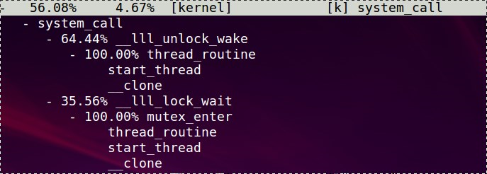  

* glibc是通过__lll_lock_wait来实现mutex的, 底层是futex系统调用(只限于linux)  
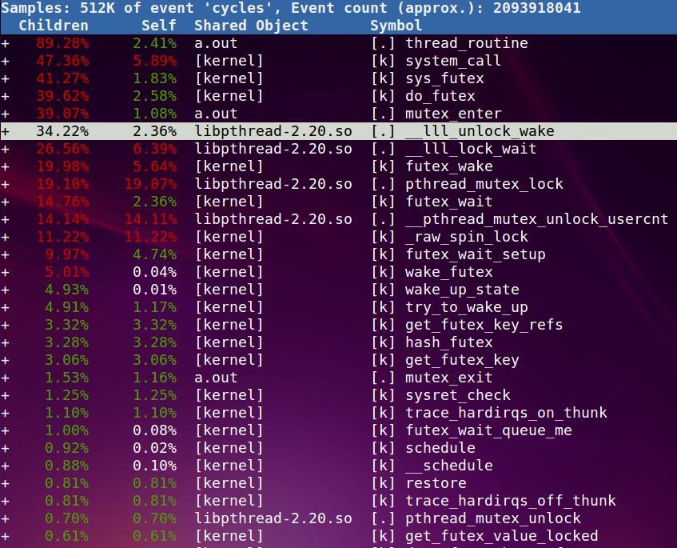  

既然是mutex, 那么竞争不到锁就得休眠, 这时候就要看schedule函数的调用情况了:  
schedule及其子函数共用了1.98%, 其中99.28%是发生在一个叫`futex_wait_queue_me`里面  
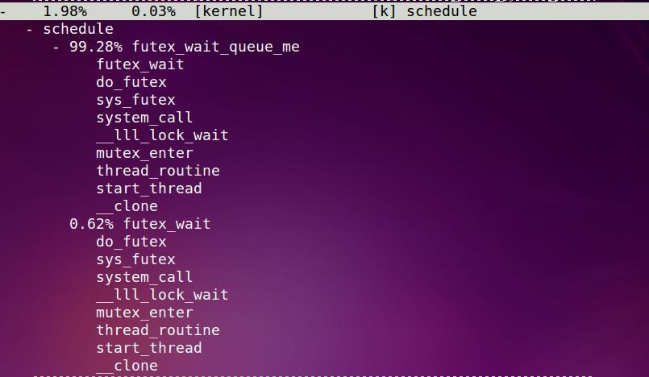  

一旦这个锁可用, 怎么唤醒线程的呢?  
这里有个`sysret_check`, 对应`system_call`, 好像是从内核态返回用户态会调.  
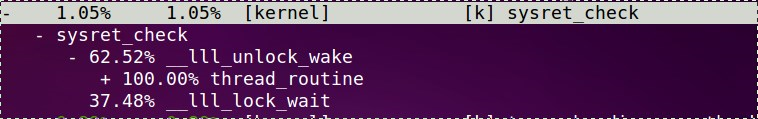  

搜索关键词wake可以找到这个东东`futex_wake`, 似乎是在`do_futex`里面调用的, 应该是资源可用以后才调它.  
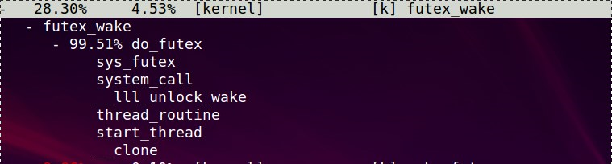  

这个应该更详细点  
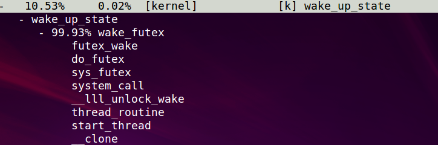  

我还看到了wake_up_process的身影.  
`-    0.00%     0.00%  [kernel]            [k] wake_up_process`

最后给出这个程序总的执行时间:这期间CPU比较高  
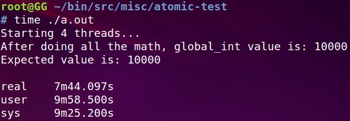  

下面来看看把mutex改成spinlock的时间, pthread同样提供了spinlock:
`pthread_spin_lock()`

执行期间CPU都打满了400%, 而之前mutex时, CPU是300%  
  

最后要说的是, 像这种一个变量加减的问题, 不需要锁. gcc有内置的原子操作:  
https://gcc.gnu.org/onlinedocs/gcc-4.9.2/gcc/_005f_005fatomic-Builtins.html#_005f_005fatomic-Builtins

用这个方法, 程序效率得到了显著提升  
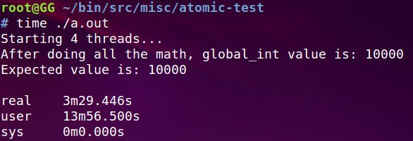  

这个是线程体的代码:  
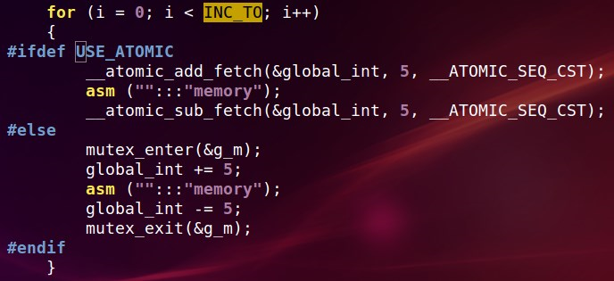  

这个是锁的代码:  
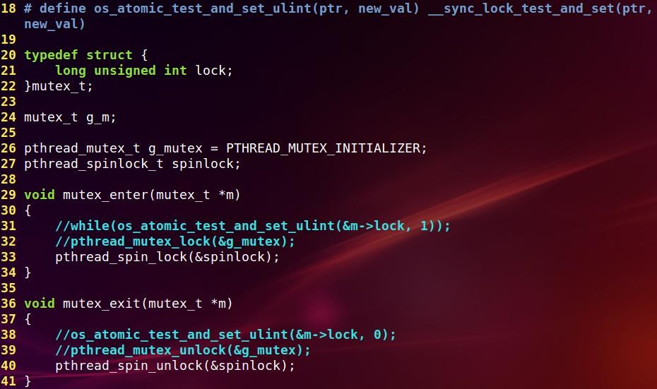  

再补充一下: 如果用下面的while来实现mutex, 结果如何呢?  
`while(os_atomic_test_and_set_ulint(&m->lock, 1));`

竟然让人大跌眼镜:(太差了吗)
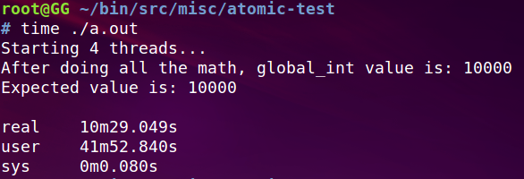  
