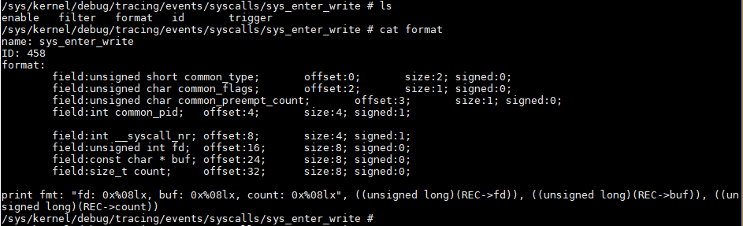
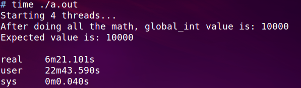

- [进程非正常退出是什么原因?](#进程非正常退出是什么原因)
  - [背景](#背景)
    - [复现命令](#复现命令)
  - [调查log](#调查log)
  - [顺藤摸瓜 -- 看相关代码](#顺藤摸瓜----看相关代码)
  - [按图索骥 -- 使用perf probe查看调用栈](#按图索骥----使用perf-probe查看调用栈)
    - [准备工作1: 查符号](#准备工作1-查符号)
    - [准备工作2: 拷贝nostrip文件到板子](#准备工作2-拷贝nostrip文件到板子)
    - [动态probe](#动态probe)
    - [probe到的调用栈](#probe到的调用栈)
  - [梳理代码流程](#梳理代码流程)
  - [罪魁祸首](#罪魁祸首)
  - [后记](#后记)
- [哪个进程一直在打印错误信息?](#哪个进程一直在打印错误信息)
  - [背景](#背景-1)
  - [思路](#思路)
  - [准备知识](#准备知识)
  - [perf record 加filter](#perf-record-加filter)
  - [罪魁祸首](#罪魁祸首-1)
  - [更进一步?](#更进一步)
  - [结论](#结论)
- [锁性能分析实战](#锁性能分析实战)
  - [预备知识strace](#预备知识strace)
  - [理解pthread_create](#理解pthread_create)
  - [mutex竞争](#mutex竞争)
  - [用perf分析](#用perf分析)

# 进程非正常退出是什么原因?
## 背景
升级gcc7.3后, s6报告dmscontroller_app非正常退出.
串口的相关打印只说了是dmscontroller_app被终止.
```sh
cat /tmp/messages | grep dmscontroller_app

Jan 1 16:00:07.000000 APP_NAME:app_finish,APP_VERSION:62.993,MSG: dmscontroller_app terminated (rc=1)
Jan 1 16:00:07.000000 APP_NAME:escalate,APP_VERSION:62.993,MSG: dmscontroller_app escalated to level 6
Jan 1 16:00:07.000000 APP_NAME:escalate,APP_VERSION:62.993,MSG: dmscontroller_app is beyond last escalation level, running again /isam/slot_default/dmscontroller_app/escalation/level1
```  
### 复现命令
不用重启
```sh
s6-rc -v2 -d change isam-apps
s6-rc -v2 -u change isam-apps
```

用老的gcc4.7, 没有这个问题. 为什么升级个gcc, 就会有问题呢?

## 调查log
先从调查这个app的log开始入手:
```sh
cd /isam/slot_default/dmscontroller_app
# log为空
cat log/traces.log
```
在run目录下有应用自己的log

```sh
/isam/slot_default/dmscontroller_app/run # cat dmsc.log
DMS-C is now launching!
ydbg_link_modeule 0
ydbg_link_modeule 0
ydbg_link_modeule 0
DMS-Controller initializing...
success to exec /isam/slot_default/dmsupgrader_app/script/dms_upgrade.sh
All handlers init OK!
ysys_onterm enter reason=0 status=2 !
DMSController state: init
syncpoint FastReady reached
LocEv_FASTready occurred
--- start_phase0() begin
--- DmsHandle::startPhase0() begin
--- DmsHandle::startPhase0() ok
--- start_phase0() ok
ysystem_exec status: 19
start DMS(confd) for phase0 failed 1 times
--- DmsHandle::startPhase0() begin
--- DmsHandle::startPhase0() ok
ysystem_exec status: 19
start DMS(confd) for phase0 failed 2 times
--- DmsHandle::startPhase0() begin
--- DmsHandle::startPhase0() ok
ysystem_exec status: 19
start of DMS(confd) for phase0 failed!!!
exiting for fallback or escalation...
```
从log看, 事件`LocEv_FASTready`发生后, `start_phase0()`被调用.
`DmsHandle::startPhase0()`开始干活, 但似乎有问题, 重试3次失败.

## 顺藤摸瓜 -- 看相关代码
最后的错误打印在`y/src/dmscontroller/logic/src/dmscstate_init.cpp`

  

这里面有`onFail`, 是什么原因导致fail的呢?  
直接看这块的C++代码似乎比较绕, 有没有更简单的方法?

## 按图索骥 -- 使用perf probe查看调用栈
前面我们找到关键函数`LocEv_StartPhase0::onFail`, 这是个C++函数.
我们前面使用过perf probe, 它可以动态probe用户进程的调用栈. 但需要解析函数符号和debug信息

### 准备工作1: 查符号
在工作站上就能查符号, 使用nm命令: 因为是标准elf格式, x86版本的nm也能解析.
```
$ nm dmscontroller_app_isam-reborn-cavium-sdmva.nostrip | grep onFail | grep LocEv_StartPhase0
100045d8 T _ZN17LocEv_StartPhase06onFailEv
```
因为C++被编译后, 符号会被编译器mangle, 所以这里我们查到实际上是这个函数:

`_ZN17LocEv_StartPhase06onFailEv`


### 准备工作2: 拷贝nostrip文件到板子
默认的bin是strip过的, 没有debug信息. 所以要先考一个nostrip的版本
```sh
/isam/slot_default/dmscontroller_app/run # scp yingjieb@172.24.213.190:/repo/yingjieb/ms/swms/y/build/dmscontroller/dmscontroller_app_isam-reborn-cavium-sdmva.nostrip .
#修改链接就可以了
/isam/slot_default/dmscontroller_app/run # ln -snf dmscontroller_app_isam-reborn-cavium-sdmva.nostrip dmscontroller_app
```

### 动态probe
都在`/isam/slot_default/dmscontroller_app/run`下面操作.
前面我们拷贝了这个app的nostrip版本, 这个是有debug信息的.
```sh
# 先把app都停掉
s6-rc -v2 -d change isam-apps

# 增加动态probe点
perf probe -x dmscontroller_app --add _ZN17LocEv_StartPhase06onFailEv
# 对整个系统进行probe 60秒
perf record -e probe_dmscontroller_app_isam:_ZN17LocEv_StartPhase06onFailEv -aR -g --call-graph dwarf -- sleep 60 &
# 在60秒内复现问题
s6-rc -v2 -u change isam-apps
```
注:
* 需要kernel4.9
* 需要这个changeset  
306 925aee28979d linux-4.9-preparation 2019-08-22 Bai Yingjie perf tools: Add support for MIPS userspace DWARF callchains.

### probe到的调用栈
  

或者用`perf report`
  


## 梳理代码流程
对照调用栈, 就可以按图索骥了.  
`y/src/dmscontroller/logic/src/yeventwrap.hpp`  
是一个叫YEventTemp...trigger的函数调用了这个onFail()  
  
这个trigger又是在yevent_cb里面调用的, 后者在这个模板类的构造函数里面, 被注册到yevent_new  
  

这个是在初始化时确定的, 那运行时是怎么调用的?
还是要看调用栈, 在代码里找`ysystem_onterm`  
在`y/src/dmscontroller/logic/src/dmshandle.cpp`

  

现在清楚了:  
`yevent_t *ysystem_exec(char **command, ysystem_terminate_cb_t on_terminate, ysystem_data_cb_t on_data, void *ctx)`

`ysystem_exec`接受一个cmd, 一个结束回调函数; dms的这个回调函数里, 调用trigger, 最后调用onFail. -- 似乎是挺饶.
看起来是这个cmd运行失败, 导致后面的问题

## 罪魁祸首
代码里写了, cmd是`confd --start-phase0`, 运行一下, 果然有问题:  
  

不像在shell直接运行会打印具体错误, `ysystem_exec`执行这个cmd失败了, 却没有任何可见的打印, 导致问题没有机会在"第一现场"被发现.

## 后记
其实, log里面就有问题函数的打印, 直接看代码可能也行. 
这么说perf probe不用也行咯? 换个角度想, 如果代码里没有这个打印呢?
进一步说, 如果没有任何log打印呢?

# 哪个进程一直在打印错误信息?
## 背景
板子在一直在串口打印东西, 很烦人. 我想找到是哪个app干的.  
  

## 思路
* 这个是个串口打印, 最终是要内核打印到串口上的, 那对app来说, 最后都是走write系统调用
* write系统调用有很多, 对这个打印来讲, 它的fd不是1(stdout)就是2(stderr)
* 用perf可以看write系统调用, 但要结合fd来过滤, 否则会有海量的信息.
## 准备知识
perf record支持filter功能, 比如
```sh
# Trace read() syscalls, when requested bytes is less than 10:
perf record -e 'syscalls:sys_enter_read' --filter 'count < 10' -a

# Trace previously created probe when the bytes (alias) variable is greater than 100:
perf record -e probe:tcp_sendmsg --filter 'bytes > 100'

# Trace previous probe when size is non-zero, and state is not TCP_ESTABLISHED(1) (needs debuginfo):
perf record -e probe:tcp_sendmsg --filter 'size > 0 && skc_state != 1' -a

# Trace all block completions, of size at least 100 Kbytes, until Ctrl-C:
perf record -e block:block_rq_complete --filter 'nr_sector > 200'

# Trace all block completions, synchronous writes only, until Ctrl-C:
perf record -e block:block_rq_complete --filter 'rwbs == "WS"'

# Trace all block completions, all types of writes, until Ctrl-C:
perf record -e block:block_rq_complete --filter 'rwbs ~ "*W*"'
```

----
我们要看的write系统调用, 怎么找到filter的关键词?  
先list看一下, syscalls:sys_enter_write是个tracepoint类型的事件  
  

----
到`/sys/kernel/debug/tracing/events/syscalls/sys_enter_write`目录下去找format,  
perf会按照这个格式记录write调用.

field后面都是关键词.  
  
准备完成, 可以开始了:

## perf record 加filter
sys_enter_write是内置的perf event, 可以直接用  
`perf record -e syscalls:sys_enter_write -aR -g --call-graph dwarf --filter 'fd == 2' -- sleep 30`

注意这里用了`fd == 2`的filter

过程如下: 最后perf报告说是有30个samples. 数一数, 是不是前面打印了30行?  
  

用`perf script`查看结果  
  
很可惜调用栈没有打印完整, 我不是用了dwarf解析了么...


## 罪魁祸首
用程序名和线程号, 那就可以找到罪魁祸首: `collectd`  
  
注: 板子上的busybox提供的`ps -T`是显示线程  
看起来collectd是个第三方的package.  
调查一下果然在buildroot里`package/collectd`


## 更进一步?
记录`syscalls:sys_enter_write`的调用栈解析不完整, 但也留下了线索.

下面用`perf probe`方式来记录:  
`perf probe -x /lib/libc-2.16.so _IO_file_xsputn`  
  

这次显示有590个samples. 很显然里面有很多我们不需要的.  
搜索一下前面出现的writer, 仍然没有更多的调用栈.  
  

----
注: 
perf list看到probe类型的事件也标识为tracepoint event  
  

perf probe kernel函数, 放在`/sys/kernel/debug/tracing/events/probe`下面  
perf probe libc的函数, 放在`/sys/kernel/debug/tracing/events/probe_libc`下面  
  

## 结论
经过简单几步, 就能找到打印的进程, 比grep代码是不是还快一点?
有时候grep代码还不一定能找到. 
有时候调用栈不全, 要结合代码分析才行.

# 锁性能分析实战
如何分析我的`misc/atomic-test/pthread_mutex.c`

这个文件根据core个数起相应的线程, 这些线程都要对一个全局变量操作, 这些操作用锁保护.

## 预备知识strace
比如在一个窗口sleep 666  
在另外一个窗口strace这个pid  
然后在sleep窗口ctrl+c, 此时strace能捕捉到这个signal
```sh
# strace -p32611 
Process 32611 attached
restart_syscall(<... resuming interrupted call ...> 
) = ? ERESTART_RESTARTBLOCK (Interrupted by signal)
--- SIGINT {si_signo=SIGINT, si_code=SI_KERNEL} ---
+++ killed by SIGINT +++
```

当一个系统调用正在执行, 比如select, 当其他进程也调用了系统调用, strace会记录select被打断又恢复的过程
```sh
       [pid 28772] select(4, [3], NULL, NULL, NULL <unfinished ...>
       [pid 28779] clock_gettime(CLOCK_REALTIME, {1130322148, 939977000}) = 0
       [pid 28772] <... select resumed> )      = 1 (in [3])
```

当一个正在执行的syscall被signal打断时, 当signal处理完毕后, 这个被打断的syscall会重新执行. strace也会记录这个过程
```sh
       read(0, 0x7ffff72cf5cf, 1)              = ? ERESTARTSYS (To be restarted)
       --- SIGALRM (Alarm clock) @ 0 (0) ---
       rt_sigreturn(0xe)                       = 0
       read(0, ""..., 1)                       = 0
```
* -tt选项可以打印时间, 精确到ms;
* -T可以打出每个系统调用的时间
* -e trace=all是默认的, 可以写trace=open,close,read,write或file, 或process, network, signal, ipc, memory等. 

## 理解pthread_create
这里要用到strace, -o选项是输出到文件, -f是跟踪线程, -T是看看每个系统调用的运行时间  
`# strace -T -f -o strace.a.out ./a.out`

下面分析这个strace的结果:
* pthread_create实际是调用的clone  
这里的主进程/线程是9229, 这里的clone传的参数很多, 比如CLONE_THREAD, 一共要clone4个线程, 在这里是:9230 9231 9232 9233  
算上主进程, 这里一共有5个进程  
```sh
9229  clone(child_stack=0x7f78c9e39ff0, flags=CLONE_VM|CLONE_FS|CLONE_FILES|CLONE_SIGHAND|CLONE_THREAD|CLONE_SYSVSEM|CLONE_SETTLS|CLONE_PARENT_SETTID|CLONE_CHILD_CLEARTID, parent_tidptr=0x7f78c9e3a9d0, tls=0x7f78c9e3a700, child_tidptr=0x7f78c9e3a9d0) = 9230 <0.000063>
9229  clone(child_stack=0x7f78c9638ff0, flags=CLONE_VM|CLONE_FS|CLONE_FILES|CLONE_SIGHAND|CLONE_THREAD|CLONE_SYSVSEM|CLONE_SETTLS|CLONE_PARENT_SETTID|CLONE_CHILD_CLEARTID, parent_tidptr=0x7f78c96399d0, tls=0x7f78c9639700, child_tidptr=0x7f78c96399d0) = 9231 <0.000070>
```
* 获取线程调用的是`gettid()`
* 用`sched_getaffinity()`绑定线程
* 有很多系统调用被打断, 又恢复运行
```sh
9231  <... set_robust_list resumed> )   = 0 <0.000082>
9230  <... gettid resumed> )            = 9230 <0.000082>
9229  <... mprotect resumed> )          = 0 <0.000060>
9231  gettid( <unfinished ...>
9230  sched_getaffinity(9229, 128,  <unfinished ...>
9229  clone( <unfinished ...>
9231  <... gettid resumed> )            = 9231 <0.000061>
9230  <... sched_getaffinity resumed> {f}) = 8 <0.000060>
9231  sched_getaffinity(9229, 128, {f}) = 8 <0.000043>
9230  sched_setaffinity(9230, 128, {1, 0, 0, 0, 0, 0, 0, 0, 0, 0, 0, 0, 0, 0, 0, 0} <unfinished ...>
9232  set_robust_list(0x7f78c8e389e0, 24 <unfinished ...>
9231  sched_setaffinity(9231, 128, {2, 0, 0, 0, 0, 0, 0, 0, 0, 0, 0, 0, 0, 0, 0, 0} <unfinished ...>
9232  <... set_robust_list resumed> )   = 0 <0.000074>
9230  <... sched_setaffinity resumed> ) = 0 <0.000106>
9229  <... clone resumed> child_stack=0x7f78c8e37ff0, flags=CLONE_VM|CLONE_FS|CLONE_FILES|CLONE_SIGHAND|CLONE_THREAD|CLONE_SYSVSEM|CLONE_SETTLS|CLONE_PARENT_SETTID|CLONE_CHILD_CLEARTID, parent_tidptr=0x7f78c8e389d0, tls=0x7f78c8e38700, child_tidptr=0x7f78c8e389d0) = 9232 <0.003672>
9232  gettid( <unfinished ...>
```

## mutex竞争
9230 9231 9232 9233这四个线程(对kenel来说就是4个进程), 抢mutex
```c
for (i = 0; i < INC_TO; i++)
{
    mutex_enter(&g_m);
    global_int += 5;
    asm ("":::"memory");
    global_int -= 5;
    mutex_exit(&g_m);
}
```

这个东西是调用的`pthread_mutex_lock`
```c
void mutex_enter(mutex_t *m)
    pthread_mutex_lock(&g_mutex);
void mutex_exit(mutex_t *m)
    pthread_mutex_unlock(&g_mutex); 
```
在linux系统下, 这实际是`futex()`系统调用(好像只有linux有)  
这里op一般是
* FUTEX_WAIT: 等uaddr地址的值为wal
* FUTEX_WAKE: 唤醒

值得注意的是: 对独立空间的n个进程来说, 这个uaddr不一定一样, 但如果物理地址是一样的(比如通过共享内存技术共享数据的几个独立进程), `futex()`在内核态好像认为是同一个锁.

对线程来说, 这个uaddr肯定是一样的. 我们这个例子里是一样的.
```c
#include <linux/futex.h>
#include <sys/time.h>
int futex(int *uaddr, int op, int val, const struct timespec *timeout, int *uaddr2, int val3);
```

你会发现很多syscall unfinished, 然后resumed;  
这是因为strace在跟踪syscall的时候, 一个线程的syscall A还没执行完, 另一个线程的syscall B又开始了, 这时候strace会报告说A还没有完, B就已经在运行了.

注意A并没有停止, 而是一直运行的, 因为我这个是4核的CPU.  
如果是单核的CPU, 在多线程情况下, 因为进程抢占的关系, kernel在执行一个syscall, 也可能被其他线程抢占;  
这时候其实strace的打印和多核CPU是差不多的, 不同的是, 被抢占的syscall真的就被暂停了.
```sh
   114 9270  futex(0x6020c0, FUTEX_WAIT_PRIVATE, 2, NULL <unfinished ...>
   115 9269  futex(0x6020c0, FUTEX_WAKE_PRIVATE, 1 <unfinished ...>
   116 9270  <... futex resumed> )             = -1 EAGAIN (Resource temporarily unavailable) <0.000038>
   117 9269  <... futex resumed> )             = 0 <0.000038>
   118 9271  futex(0x6020c0, FUTEX_WAKE_PRIVATE, 1 <unfinished ...>
   119 9270  futex(0x6020c0, FUTEX_WAIT_PRIVATE, 2, NULL <unfinished ...>
   120 9268  futex(0x6020c0, FUTEX_WAKE_PRIVATE, 1 <unfinished ...>
   121 9271  <... futex resumed> )             = 0 <0.000070>
   122 9270  <... futex resumed> )             = -1 EAGAIN (Resource temporarily unavailable) <0.000062>
   123 9268  <... futex resumed> )             = 0 <0.000074>
   124 9271  futex(0x6020c0, FUTEX_WAIT_PRIVATE, 2, NULL <unfinished ...>
   125 9270  futex(0x6020c0, FUTEX_WAIT_PRIVATE, 2, NULL <unfinished ...>
   126 9268  futex(0x6020c0, FUTEX_WAIT_PRIVATE, 2, NULL <unfinished ...>
   127 9269  futex(0x6020c0, FUTEX_WAKE_PRIVATE, 1 <unfinished ...>
   128 9268  <... futex resumed> )             = -1 EAGAIN (Resource temporarily unavailable) <0.000042>
   129 9269  <... futex resumed> )             = 1 <0.000036>
   130 9271  <... futex resumed> )             = 0 <0.000128>
   131 9268  futex(0x6020c0, FUTEX_WAKE_PRIVATE, 1 <unfinished ...>
   132 9271  futex(0x6020c0, FUTEX_WAKE_PRIVATE, 1 <unfinished ...>
   133 9270  <... futex resumed> )             = 0 <0.000186>
   134 9271  <... futex resumed> )             = 0 <0.000043>
   135 9270  futex(0x6020c0, FUTEX_WAKE_PRIVATE, 1 <unfinished ...>
```

## 用perf分析
有了上面基本的理解, 下面就开始用核武器perf了. 如果说strace提供了一个整体流程的视图, 那么perf提供了所有片段的细节.

这就好比一幅画, strace是轮廓骨架, perf就是上面的每一处细节.
```
# ./perf top -gp `pidof a.out`
```

* 任何用户态的进程, 都要通过system_call来和kernel交互, 这里就截取了system_call的调用情况:  
perf top说明有56.08%的采样都落在了system_call里面, 也就是说, 这个程序的内核态执行时间为56.08%  
而system_call函数本身只花了4.67%的时间.  
其中竟然wake花的时间被wait还多?  
  

* glibc是通过__lll_lock_wait来实现mutex的, 底层是futex系统调用(只限于linux)  
  

既然是mutex, 那么竞争不到锁就得休眠, 这时候就要看schedule函数的调用情况了:  
schedule及其子函数共用了1.98%, 其中99.28%是发生在一个叫`futex_wait_queue_me`里面  
  

一旦这个锁可用, 怎么唤醒线程的呢?  
这里有个`sysret_check`, 对应`system_call`, 好像是从内核态返回用户态会调.  
  

搜索关键词wake可以找到这个东东`futex_wake`, 似乎是在`do_futex`里面调用的, 应该是资源可用以后才调它.  
  

这个应该更详细点  
  

我还看到了wake_up_process的身影.  
`-    0.00%     0.00%  [kernel]            [k] wake_up_process`

最后给出这个程序总的执行时间:这期间CPU比较高  
  

下面来看看把mutex改成spinlock的时间, pthread同样提供了spinlock:
`pthread_spin_lock()`

执行期间CPU都打满了400%, 而之前mutex时, CPU是300%  
  

最后要说的是, 像这种一个变量加减的问题, 不需要锁. gcc有内置的原子操作:  
https://gcc.gnu.org/onlinedocs/gcc-4.9.2/gcc/_005f_005fatomic-Builtins.html#_005f_005fatomic-Builtins

用这个方法, 程序效率得到了显著提升  
  

这个是线程体的代码:  
  

这个是锁的代码:  
  

再补充一下: 如果用下面的while来实现mutex, 结果如何呢?  
`while(os_atomic_test_and_set_ulint(&m->lock, 1));`

竟然让人大跌眼镜:(太差了吗)
  
