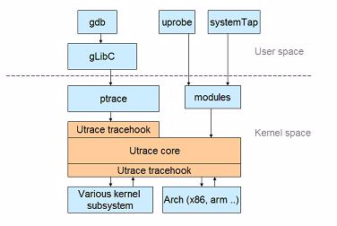

- [systemtap学习资料](#systemtap学习资料)
- [systemtap能干什么](#systemtap能干什么)
  - [uprobe原理](#uprobe原理)
  - [systemtap工作原理](#systemtap工作原理)
- [systemtap基础](#systemtap基础)
  - [基本安装](#基本安装)
  - [systemtap语法](#systemtap语法)
    - [命令行传参](#命令行传参)
    - [stp命令的结束](#stp命令的结束)
    - [基本语法](#基本语法)
    - [probepoints `man stapprobes`](#probepoints-man-stapprobes)
      - [syscall.\*系列aliases, 出自tapset库, 每个系统调用都有一对probe点](#syscall系列aliases-出自tapset库-每个系统调用都有一对probe点)
      - [timer aliases](#timer-aliases)
      - [DWARF类的probe](#dwarf类的probe)
      - [其他probe举例](#其他probe举例)
      - [上下文变量](#上下文变量)
      - [非DWARF类的probe](#非dwarf类的probe)
      - [kernel静态probe点](#kernel静态probe点)
      - [用户态probe](#用户态probe)
        - [非符号类的probe](#非符号类的probe)
        - [符号类的probe, 可以probe用户态程序, 共享库](#符号类的probe-可以probe用户态程序-共享库)
      - [java probe](#java-probe)
      - [input probe](#input-probe)
      - [netfilter probe](#netfilter-probe)
      - [perf probe](#perf-probe)
      - [python probe](#python-probe)
      - [硬件watchpoint类型probe](#硬件watchpoint类型probe)
      - [一些例子](#一些例子)
    - [基本probe语法](#基本probe语法)
    - [函数定义](#函数定义)
  - [tapset](#tapset)
    - [上下文方法](#上下文方法)
    - [时间相关](#时间相关)
    - [字符串和数据获取](#字符串和数据获取)
    - [调用shell命令](#调用shell命令)
    - [内存相关](#内存相关)
      - [方法](#方法)
      - [probe](#probe)
    - [进程运行时间相关](#进程运行时间相关)
    - [调度器相关](#调度器相关)
    - [IO子系统相关](#io子系统相关)
    - [irq 相关](#irq-相关)
    - [网络相关](#网络相关)
    - [socket相关](#socket相关)
    - [内核进程相关](#内核进程相关)
    - [signal相关](#signal相关)
    - [errno相关](#errno相关)
    - [目录项相关](#目录项相关)
    - [exit和printk](#exit和printk)
    - [杂项](#杂项)
    - [tty scsi nfs snmp jason略](#tty-scsi-nfs-snmp-jason略)

# systemtap学习资料
* https://myaut.github.io/dtrace-stap-book/intro/foreword.html
* https://help.eclipse.org/kepler/index.jsp?topic=%2Forg.eclipse.linuxtools.systemtap.ui.doc%2FLinux_Tools_Project%2FSystemtap%2FUser_Guide%2FUser-Guide.html
* https://help.eclipse.org/mars/index.jsp?topic=%2Forg.eclipse.tracecompass.doc.user%2Fdoc%2FTrace-Compass-Main-Features.html
* https://landley.net/kdocs/ols/2007/ols2007v1-pages-215-224.pdf
* suse很好的入门教程:  
https://doc.opensuse.org/documentation/leap/tuning/html/book.sle.tuning/cha.tuning.systemtap.html
* 官方例子:  
https://sourceware.org/systemtap/examples/
* https://help.eclipse.org/kepler/index.jsp?topic=%2Forg.eclipse.linuxtools.systemtap.ui.doc%2FLinux_Tools_Project%2FSystemtap%2FUser_Guide%2FUser-Guide.html
* https://myaut.github.io/dtrace-stap-book/intro/foreword.html


# systemtap能干什么
systemtap是kprobe和uprobe的前端, 我的理解是, 它能以动态的方式来probe kernel或者user进程(中断实现?).

和perf probe一样, 底层是类似于`kprobe/uprobe`提供的`/sys/kernel/debug/tracing`目录树的接口, 但不一样的是: perf的输出格式是固定的, 而systemtap可以将用户的调试脚本转换成内核模块, 来定制化输出打印.

将来ebpf可能取代systemtap

注意probe和trace point的区别:
* probe是动态添加的, 比如加了`gcc -pg`选项时, 利用替换掉`mcount`函数来完成probe; 不使能的时候mcount基本就是`nop`  
如果没加pg选项, 系统把probe点的代码替换成断点指令(比如ARMv8的BRK指令), 和gdb打断点原理类似(使用ptrace系统调用).  
下图表明了, systemtap和uprobe直接使用内核的utrace框架, 而gdb使用ptrace, 后者底层也是调用utrace.  
uprobe要求kernel version大于3.5  
  

* trace point是静态埋好的, 提前写好的函数

## uprobe原理
系统把被probe的代码**替换成breakpoint指令**, 在其handler里面再执行被替换的代码, 同时执行其他debug代码.

> Since probes are associated with files, they affect all processes that run code from those files. A special copy is made of the page to contain the probe; in that copy, the instruction at the specified offset is copied and replaced by a breakpoint. When the breakpoint is hit by a running process, filter() will be called if present, and handler() will be run unless the filter said otherwise. Then the displaced instruction is executed (using the "execute out of line" mechanism described in this article) and control returns to the instruction following the breakpoint.  
Uprobes thus implements a mechanism by which a kernel function can be invoked whenever a process executes a specific instruction location. One could imagine a number of things that said kernel function could do; there has been talk, for example, of using uprobes (and, perhaps someday, something derived from utrace) as a replacement for the much-maligned ptrace() system call. Tools like GDB could place breakpoints with uprobes; it might even be possible to load simple filters for conditional breakpoints into the kernel, speeding their execution considerably. Uprobes could also someday be a component of a Dtrace-like dynamic tracing functionality. For now, though, the interfaces for that kind of feature have not been added to the kernel; none have even been proposed.

参考: https://lwn.net/Articles/499190/


## systemtap工作原理
systemtap提供stap命令行和一套脚本语言来完成对系统运行时活动的检测和数据收集.  
stap命令接受systemtap语言的脚本`*.stp`, 编译成C语言的内核模块, 然后由staprun把该内核模块插入内核运行, 并与之通信, 把trace数据从内核考出来, 保存到临时文件里, 在probe结束的时候, staprun会unload这个内核模块. systemtap脚本能完成数据收集, 过滤, 整理的功能, 比较灵活.

stap编译后的`*.c`和`*.ko`在`~/.systemtap`路径下, 比如
```shell
$ sudo ls /root/.systemtap/cache/37
stap_3789144b44a61fc185145ac98a2b5446_1298.c stap_3789144b44a61fc185145ac98a2b5446_1298_hash.log stap_3789144b44a61fc185145ac98a2b5446_1298.ko
```
.stp脚本和awk和c类似,支持的数据类型有整型, 字符串, 和关系数组, 有点像动态语言一样, 变量不用声明, 由编译器推断. 其语法可参考官网:  http://sourceware.org/systemtap/langref/, 还有很多例子:http://www.sourceware.org/systemtap/examples/


# systemtap基础
## 基本安装
```shell
#安装
sudo apt install systemtap
#systemtap需要kernel的debug信息, 在ubuntu上依赖于kernel的dbg包, 比如linux-image-*-dbg linux-header-*
#stap-prep命令可以处理这些依赖, 但ubuntu下还需要rpm工具, 运行失败
stap-prep
#如果是自己编的kernel, 需要CONFIG_DEBUG_INFO CONFIG_KPROBES  CONFIG_DEBUG_FS CONFIG_RELAY.

#CentOS要安装kernel相关的debuginfo
kernel-debuginfo
kernel-debuginfo-common-aarch64
kernel-devel
kernel-headers
kernel-tools
```

## systemtap语法
* 详细语法见 https://sourceware.org/systemtap/langref.pdf
https://sourceware.org/systemtap/SystemTap_Beginners_Guide/index.html
* `# // /* */`都是注释
* `;`是可选的, { STMT1 STMT2 ... }可以不用`;`隔开
* 在guru mod(-g选项)下, 用`%{ %}`包括的部分是C代码
* `man stap`和`man stapprobes` `man stapref`查看详细语法
* 关键词: `break continue delete else exit foreach for function global private if in next probe return try/catch while`, 有foreach和in, 很有动态语言范儿.

### 命令行传参
对stap来说, 双引号里的参数是字符串, 否则是integer
`$1 $2 ...` 表示命令行位置参数, 但会被解析;`$#`是参数个数
`@1 @2 ...` 同样表示命令行参数, 但会返回原始字符串; `@#`也是参数个数, 字符串形式

访问不存在的参数会产生错误.  
比如:
```shell
probe begin { printf("%d, %s\n", $1, @2) } 
#用下面命令调用
stap example.stp '5+5' mystring
#结果是
10, mystring

#参数个数
$ sudo stap -e 'probe begin {printf("hello %d\n", $#) exit()}' 1 2 3
WARNING: unused command line option $1/@1
WARNING: unused command line option $2/@2
WARNING: unused command line option $3/@3
hello 3
```

### stp命令的结束
* ctrl+c
* 脚本调用exit()
* 脚本错误
* 用-c CMD选项运行的command结束; 或-x PID的进程结束

### 基本语法
```shell
#整型变量
var1 = 5
#global变量在一个systeamtap session里面被所有probe和function共享, 并发访问会自动被lock保护.
global var2 = 10
#字符串变量
var1 = "string1"
global var2 = "string2"
#关系数组变量
global array1[]
global array2[SIZE]
array[index] = 5
array1 [pid()] = "name" # single numeric key
array2 ["foo",4,i++] += 5 # vector of string/num/num keys
#关系数组成员判断
if([index_expression] in array_name) statement
if (["hello",5,4] in array2) println ("yes") # membership test
#带%的关系数组表示, 如果元素超出array的size, 更老的元素会被替换掉.
global wrapped_array1%[10], wrapped_array2%
#上下文变量
$var
#字符串连接操作符
.
#三元表达式
cond ? exp1 : exp2
#统计操作符, 不是简单累加, 而是像账本一样, "记录"每一笔value, 用于后续统计
var <<< value
#举例
$ sudo stap -e 'global x probe oneshot { for(i=1;i<=5;i++) x<<<i println(@hist_linear(x,0,10,1)) }'
value |-------------------------------------------------- count
    0 | 0
    1 |@ 1
    2 |@ 1
    3 |@ 1
    4 |@ 1
    5 |@ 1
    6 | 0
    7 | 0
#或者
$ sudo stap - << EOF
probe timer.profile {
  x[1] <<< pid()
  x[2] <<< uid()
  y <<< tid()
}
global x // an array containing aggregates
global y // a scalar
probe end {
  foreach ([i] in x @count+) {
     printf ("x[%d]: avg %d = sum %d / count %d\n",
             i, @avg(x[i]), @sum(x[i]), @count(x[i]))
     println (@hist_log(x[i]))
  }
  println ("y:")
  println (@hist_log(y))
}
EOF


#正则表达式
exp =~ regex
exp !~ regex
#匹配上的部分可以用tapset里matched()方法得到
if ("an example string" =~ "str(ing)") {
    matched(0) // -> returns "string", the matched substring
    matched(1) // -> returns "ing", the 1st matched subexpression
    ngroups() // -> returns 2, the number of matched groups
}


#迭代形式, 语法很强大
#在VAR或者ARRAY后面加+或-表示按照key或者value排序后的顺序迭代, +/-表示正向排序或者是倒序.
foreach (VAR in ARRAY [ limit EXP ]) STMT
#key是tuple的情况下的使用, 可以限定index的范围, 可以用*来通配.
foreach ([VAR1, VAR2, ...] in ARRAY [INDEX1, INDEX2, ...] [ limit EXP ]) STMT
#VAR0就是ARRAY[VAR]
foreach (VAR0 = VAR in ARRAY [ limit EXP ]) STMT
foreach (variable in array) statement
foreach ([var1,var2,...] in array) statement
for (expression; expression; expression) statement
while (expression) statement
#声明
function name (variable : type, ...) { statement }
function name : type (variable : type, ...) { statement }
function name : type (variable : type, ...) %{ c_statement %}
probe probepoint { statement }
probe label = probepoint { statement }
#错误处理
try { STMT1 } catch(VAR) { STMT2 }
#预处理, 类似于c语言预处理语句, 
%( expression %? true_tokens %: false_tokens %)
@define NAME(PARAM_1, PARAM_2, ...) %( BODY %)
@define foo %(
     %( CONFIG_UTRACE == "y" %? process.syscall %: **ERROR** %)
 %)
@define add(a,b) %( ((@a)+(@b)) %)
#内置方法
##统计相关
@avg (variable)
@count (variable)
@hist_linear (variable, N, N, N)
@hist_log (variable)
@max (variable)
@min (variable)
@sum (variable)
#比如: 注意, 这里直接println(x)是不行的, 估计统计变量x只能用统计方法来计算.
sudo stap -e 'global x probe oneshot { for(i=1;i<=5;i++) x<<<i println(@hist_log(x)) }'
##打印相关
print (variable)
printf (format:string, variable, ...)
printd (delimiter:string, variable, ...)
printdln (delimiter:string, variable, ...)
println ()
sprint:string (variable)
sprintf:string (format:string, variable, ...)
##指针访问: 当p是个指针时, 编译器不知道它的结构, 此时需要用cast来指明
@cast(p, "type_name"[, "module"])->member
#比如:
@cast(tv, "timeval", "<sys/time.h>")->tv_sec
@cast(task, "task_struct", "kernel<linux/sched.h>")->tgid
#这个厉害了, 连续两次结构体成员解析
@cast(task, "task_struct","kernel<linux/sched.h><linux/fs_struct.h>")->fs->umask


#tapset库函数
addr:long ()
backtrace:string ()
caller:string ()
caller_addr:long ()
cmdline_args:string (N:long,m:long,delim:string)
env_var:string (name:string)
execname:string ()
isinstr:long(s1:string,s2:string)
modname:string ()
pid:long ()
print_backtrace ()
probefunc:string ()
strlen:long(str:string)
strtol:long(str:string,base:long)
```

### probepoints `man stapprobes`
* 以?结尾的probe表示optional, 没有也不会报错
* 以!结尾的probe表示both optional and sufficient, 意思是如果找到了对应的probe点, 那以逗号隔开的probe list里后面的probe都不会生效了.
* probe展开  
```shell
syscall.{write,read}
# Expands to
syscall.write, syscall.read

{kernel,module("nfs")}.function("nfs*")!
# Expands to
kernel.function("nfs*")!, module("nfs").function("nfs*")!
```

#### syscall.*系列aliases, 出自tapset库, 每个系统调用都有一对probe点
```shell
syscall.NAME
syscall.NAME.return
```
一般的, 系统调用的参数都会被导出到system脚本里, 可直接使用, 比如`syscall.open`的`filename, flags, and mode`可以直接作为变量使用.

此外, 通常tapset还对aliases添加了以下几个变量:
```shell
argstr 参数str
name syscall名字
retstr 返回值str
```

#### timer aliases
timer aliases是异步的probe, 意思是它不像syscall proble一样, 是匹配精确指令地址的, CPU执行到这个地址就会触发这个probe事件.

异步的probe没有精确地址, 比如下面, N表示N个jiffies后, probe的handler被调用
```shell
timer.jiffies(N)
timer.jiffies(N).randomize(M)
```
或者可以毫秒为单位:
```shell
timer.ms(N)
timer.ms(N).randomize(M)
```
或者以CPU tick为单位
```shell
timer.profile
```

#### DWARF类的probe
```shell
kernel.function(PATTERN)
kernel.function(PATTERN).call
kernel.function(PATTERN).return
kernel.function(PATTERN).return.maxactive(VALUE)
kernel.function(PATTERN).inline
kernel.function(PATTERN).label(LPATTERN)
module(MPATTERN).function(PATTERN)
module(MPATTERN).function(PATTERN).call
module(MPATTERN).function(PATTERN).return.maxactive(VALUE)
module(MPATTERN).function(PATTERN).inline
module(MPATTERN).statement(PATTERN) 
kernel.statement(PATTERN)
kernel.statement(ADDRESS).absolute
process("PATH").function("NAME")
process("PATH").statement("*@FILE.c:123")
process("PATH").library("PATH").function("NAME")
process("PATH").function("*").return
process(PID).function("NAME")
process(PID).function("myfun").label("foo")
process(PID).plt("NAME")
process(PID).statement(ADDRESS).absolute
```
probe可以是`.function .return .inline .call .exported .statement .statement.nearest .callee .callees `
```shell
.function
       Places a probe near the beginning of the named function, so that parameters are available as context variables.


.return
       Places a probe at the moment after the return from the named function, so the return value is available as the "$return" context variable.


.inline
       Filters the results to include only instances of inlined functions. Note that inlined functions do not have an identifiable return point, so .return is not supported on .inline
       probes.


.call Filters the results to include only non-inlined functions (the opposite set of .inline)


.exported
       Filters the results to include only exported functions.


.statement
       Places a probe at the exact spot, exposing those local variables that are visible there.


.statement.nearest
       Places a probe at the nearest available line number for each line number given in the statement.


.callee
       Places a probe on the callee function given in the .callee modifier, where the callee must be a function called by the target function given in .function. The advantage of doing
       this over directly probing the callee function is that this probe point is run only when the callee is called from the target function (add the -DSTAP_CALLEE_MATCHALL directive to
       override this when calling stap(1)).


       Note that only callees that can be statically determined are available. For example, calls through function pointers are not available. Additionally, calls to functions located in
       other objects (e.g. libraries) are not available (instead use another probe point). This feature will only work for code compiled with GCC 4.7+.


.callees
       Shortcut for .callee("*"), which places a probe on all callees of the function.


.callees(DEPTH)
       Recursively places probes on callees. For example, .callees(2) will probe both callees of the target function, as well as callees of those callees. And .callees(3) goes one level
       deeper, etc... A callee probe at depth N is only triggered when the N callers in the callstack match those that were statically determined during analysis (this also may be over‐
       ridden using -DSTAP_CALLEE_MATCHALL).
```

#### 其他probe举例
```shell
java("PNAME").class("CLASSNAME").method("PATTERN")
java(PID).class("CLASSNAME").method("PATTERN")
python2.module("MODULENAME").function("PATTERN").return
python3.module("MODULENAME").function("PATTERN")
```

#### 上下文变量
```shell
$var 整型的话, 会被cast为64bit int, 字符串指针的话, 可能被kernel_string或user_string方法拷贝为string类型的systemtap脚本变量.
#var的另外的形式
@var("varname")
@var("varname@src/file.c")
$var->field 结构体变量访问
$var[N] 数组访问
#几种特殊的变量
$return 在return类型的probe中表示返回值
$$vars 扩展为字符串形式的当前probe点上可见的所有变量, 相当于把所有变量都sprintf到一个字符串里, 有的会被打印为?, 意思是变量的运行地址不可知.
$$locals 只是$$vars的子集, 表示局部变量
$$parms 只是$$vars的子集, 表示函数参数
$$return 对return类型的probe有效, 意思是return值转为字符串
& $EXPR 变量地址
@defined($EXPR) 0或1, 表示是否这个上下文变量可以解析, 典型用法是@defined($foo->bar) ? $foo->bar : 0
$EXPR$ 扩展为$EXPR的所有成员的字符串, 相当于sprintf $EXPR->a $EXPR->b
$EXPR$$ 扩展为$EXPR的所有成员及其子成员的字符串
#snapshots变量: 对return类型的probe来说, 可以访问snapsht类型的变量, 这些变量是在funtion entry的时候保存下来的
@entry($var) 
#比如, 计算函数运行时间
 probe kernel.function("do_filp_open").return {
    println( get_timeofday_us() - @entry(get_timeofday_us()) )
 }
```

#### 非DWARF类的probe
没有DWARF调试信息的, 可以用kprobe开头的probe, 比如
```shell
kprobe.function(FUNCTION)
kprobe.function(FUNCTION).call
kprobe.function(FUNCTION).return
kprobe.module(NAME).function(FUNCTION)
kprobe.statement(ADDRESS).absolute
```

#### kernel静态probe点
```shell
stap -l 'kernel.trace("*")'
stap -l 'kernel.trace("sched*")'
stap -l 'kernel.trace("bcache*")'
stap -l 'kernel.trace("block*")'
stap -l 'kernel.trace("bpf*")'
stap -l 'kernel.trace("cgroup*")'
stap -l 'kernel.trace("clk*")'
stap -l 'kernel.trace("ext4*")'
stap -l 'kernel.trace("ipi*")'
stap -l 'kernel.trace("irq*")'
stap -l 'kernel.trace("kvm*")'
stap -l 'kernel.trace("net*")'
```

#### 用户态probe
用户态probe需要内核配置支持utrace或者内核版本3.5以上支持uprobe

查看系统是否支持uprobe
```shell
#在kernel3.5以后
$ cat /boot/config-4.14.62-5.hxt.aarch64 | grep -i uprobe
CONFIG_ARCH_SUPPORTS_UPROBES=y
CONFIG_UPROBES=y
CONFIG_UPROBE_EVENTS=y
#在kernel3.5之前
看CONFIG_UTRACE=y
```
##### 非符号类的probe
```shell
#使用虚拟地址作为probe
process(PID).statement(ADDRESS).absolute
#一般的用户态probe需要指定pid或者fullpath, 比如
process(PID).begin
process("FULLPATH").begin
process(PID).thread.begin
process(PID).end
process(PID).syscall
process("FULLPATH").insn
process("FULLPATH").insn.block
#以上insn表示单步执行会触发probe event, insn.block表示块执行触发
#但有些不带PID的或不带FULLPATH的, 也可以用stap命令行 -c -x来指定
-c CMD start the probes, run CMD, and exit when it finishes
-x PID sets target() to PID
process.begin
process.thread.end
#系统调用号保存在$syscall, 前6个参数分别是$arg1,$arg2, ...
process.syscall
process.syscall.return
#不指定PID或FULLPATH的, 会对所有用户进程probe


#在用户代码里有STAP_PROBE1(PROVIDER,LABEL,arg1)宏的, 是sys/sdt.h提供的静态probe点, 可以用下面的形式触发:
process("PATH").mark("LABEL")
process("PATH").provider("PROVIDER").mark("LABEL")
```
##### 符号类的probe, 可以probe用户态程序, 共享库
```shell
process("PATH").function("NAME")
process("PATH").statement("*@FILE.c:123")
process("PATH").plt("NAME")
process("PATH").library("PATH").plt("NAME")
process("PATH").library("PATH").function("NAME")
process("PATH").library("PATH").statement("*@FILE.c:123")
process("PATH").function("*").return
process("PATH").function("myfun").label("foo")
process("PATH").function("foo").callee("bar")
process("PATH").plt("NAME").return
process(PID).function("NAME")
process(PID).statement("*@FILE.c:123")
process(PID).plt("NAME")
# PLT段的作用是跳转到GOT表, 后者用于在运行时确定动态库的地址; 所以看到函数调跳转到plt, 就知道它要调用共享库里面的函数了.
```

#### java probe
systemtap使用JBoss里面的Byteman调试工具来做后端
```shell
java("PNAME").class("CLASSNAME").method("PATTERN")
java("PNAME").class("CLASSNAME").method("PATTERN").return
```

#### input probe
```shell
input.char
input.line
#其底层是用procfs("__stdin").write实现的,后者是procfs类型的probe
```

#### netfilter probe
```shell
netfilter.hook("HOOKNAME").pf("PROTOCOL_F")
netfilter.pf("PROTOCOL_F").hook("HOOKNAME")
```

#### perf probe
使用PMU event做probe, 这些event用"type"和"config"描述, 详见`perf_event_attr`结构体, 采样频率用"sample_period"和"sample_freq"控制

具体定义见`linux/perf_event.h`
```shell
probe perf.type(NN).config(MM).sample(XX)
probe perf.type(NN).config(MM).hz(XX)
probe perf.type(NN).config(MM)
probe perf.type(NN).config(MM).process("PROC")
#.counter表示该perf handler不会被本身的probe触发, 而是在用户probe中, 按需读取
probe perf.type(NN).config(MM).counter("COUNTER")
probe perf.type(NN).config(MM).process("PROC").counter("NAME")
#.counter使用:
process("PROC").statement("func@file") {stat <<< @perf("NAME")}
```

#### python probe
```shell
#pythone probe需要HelperSDT的支持, 在支持pythone脚本时加上:
stap foo.stp -c "python -m HelperSDT foo.py"
#probe举例:
python2.module("MPATTERN").function("PATTERN")
python2.module("MPATTERN").function("PATTERN").call
python2.module("MPATTERN").function("PATTERN").return
python3.module("MPATTERN").function("PATTERN")
python3.module("MPATTERN").function("PATTERN").call
python3.module("MPATTERN").function("PATTERN").return
```

#### 硬件watchpoint类型probe
```shell
probe kernel.data(ADDRESS).write
probe kernel.data(ADDRESS).rw
probe kernel.data(ADDRESS).length(LEN).write
probe kernel.data(ADDRESS).length(LEN).rw
probe kernel.data("SYMBOL_NAME").write
probe kernel.data("SYMBOL_NAME").rw
```

#### 一些例子
```shell
       begin, end, end
              refers to the startup and normal shutdown of the session. In this case, the handler would run once during startup and twice during shutdown.


       timer.jiffies(1000).randomize(200)
              refers to a periodic interrupt, every 1000 +/- 200 jiffies.


       kernel.function("*init*"), kernel.function("*exit*")
              refers to all kernel functions with "init" or "exit" in the name.


       kernel.function("*@kernel/time.c:240")
              refers to any functions within the "kernel/time.c" file that span line 240. Note that this is not a probe at the statement at that line number. Use the kernel.statement probe instead.


       kernel.trace("sched_*")
              refers to all scheduler-related (really, prefixed) tracepoints in the kernel.


       kernel.mark("getuid")
              refers to an obsolete STAP_MARK(getuid, ...) macro call in the kernel.


       module("usb*").function("*sync*").return
              refers to the moment of return from all functions with "sync" in the name in any of the USB drivers.


       kernel.statement(0xc0044852)
              refers to the first byte of the statement whose compiled instructions include the given address in the kernel.


       kernel.statement("*@kernel/time.c:296")
              refers to the statement of line 296 within "kernel/time.c".


       kernel.statement("bio_init@fs/bio.c+3")
              refers to the statement at line bio_init+3 within "fs/bio.c".


       kernel.data("pid_max").write
              refers to a hardware breakpoint of type "write" set on pid_max


       syscall.*.return
              refers to the group of probe aliases with any name in the third position
```


### 基本probe语法
```shell
#PROBEPOINT是编译器定义的probe point, 以及tapset库也用alias定义了进一步的探测点
probe PROBEPOINT [, PROBEPOINT] { [STMT ...] }
#这里的if是arming condition,意思是条件真时probe在被装载生效, 在其失效期间, 可能会丢失部分probe event
probe PROBEPOINT [, PROBEPOINT] if (CONDITION) { [STMT ...] }


#alias用法
##序言声明: 用=声明的alias是序言声明, 表示在使用该alias的probe, 先执行序言声明的内容.
probe syscall.read = kernel.function("sys_read") {
    fildes = $fd
    if (execname() == "init") next # skip rest of probe
}
##后记声明: 用+=声明的alias是后记声明, 表示在使用该alias的probe, 最后执行后记声明的内容.
probe syscall.read += kernel.function("sys_read") {
    if (tracethis) println ($fd)
}
##使用时: 该例子先使用了序言声明定义的变量fildes, 然后置条件tracethis 为1给后记声明使用, 后记声明会print这个fd.
probe syscall.read {
    printf("reading fd=%d\n", fildes) 
    if (fildes > 10) tracethis = 1
}
```
### 函数定义
函数的返回值只能是一个整型或字符串
```shell
#函数定义可以不要类型声明, 由编译器推断
function thisfn (arg1, arg2) {
    return arg1 + arg2
}
#也可以带显式声明
function thatfn:string (arg1:long, arg2) {
    return sprint(arg1) . arg2
}
```

## tapset
systemtap还提供了一些标准库的`.stp`脚本, 提供了一些常用的方法.
库的路径是`/usr/share/systemtap/tapset/`

tapset库提供了非常多的方法和预定义的probe, 详见https://sourceware.org/systemtap/tapsets/

### 上下文方法
```shell
#返回目标进程pid, 目标进程是用-x PID 或-c CMD的进程
target:long()
#返回当前pid
pid:long()
#pid转程序名, 传入tid也一样可以用, 返回线程名, 不一定和其进程名一样.
pid2execname:string(pid:long)
#pid转task指针, task指针后面很有用, 有一系列task_xxx的方法可以调用
pid2task:long(pid:long)
#比如, 38717是tid, 其对应的pid是38715
$ sudo stap -e 'probe begin{target=target() task=pid2task(target) printf("%s %x %d \n",pid2execname(target),task,task_pid(task)) exit()}' -x 38717
eal-intr-thread ffff8017dc94c000 38715

#返回当前probe的地址, 没有地址的返回0
addr:long()
#返回当前probe的函数
probefunc:string()
#返回调用栈的字符串, 16进制地址格式, 可以接着用print_stack来打印带符号表的信息
backtrace:string()
callers:string(n:long) 返回n级调用的16进制地址, -1表示全部调用栈. 
print_stack(stk:string)
ustack:long(n:long) 
ucallers:string(n:long)
print_syms(callers:string) 推荐用这个打印kernel调用栈, 和callers联用
sprint_backtrace:string()
sprint_stack:string(stk:string)
stack:long(n:long)
#相当于print_ustack(ubacktrace), 打印用户态调用栈
print_ubacktrace()


print_usyms(callers:string) 推荐用这个打印用户态调用栈, 和ucallers联用
print_ubacktrace_brief()
sprint_ustack:string(stk:string)
sprint_ubacktrace:string()
#返回caller字符串, 可以用print_syms(callers:string)后续打印带符号表的信息
caller:string()
callers:string(n:long)
#返回arg
cmdline_arg:string(n:long)
cmdline_args:string(n:long,m:long,delim:string)
cmdline_str:string()
#返回当前cpu号
cpu:long()
#返回环境变量
env_var:string(name:string)
#返回本probe名
pn:string()
pp()
#返回effective gid以及各种id: pid gid ppid tid uid等等
egid:long() ...
#返回程序名
execname:string()
#返回寄存器的值, 对aarch64来说, 是x0, x1, ... x30, fp, lr, sp, pc, and orig_x0.
register:long(name:string)

#返回符号名
symname:string(addr:long)
```

### 时间相关
```shell
#返回当前的HZ
HZ:long()
#cpu clock时间, ms ns s us
cpu_clock_ms:long(cpu:long)
#gettimeofday, ms ns s us, 从1970年开始
gettimeofday_ms:long()
#jiffies, cycle
jiffies:long()
get_cycles:long()
#返回“Wed Jun 30 21:49:08 1993”格式的时间
ctime:string(epochsecs:long)
ctime:string()
```

### 字符串和数据获取
这部分tapset提供了从kernel空间和从user空间读取数据的方法
```shell
#string的首个char是否为digit
isdigit:long(str:string)
#返回1如果s2在s1里, 否则返回0
isinstr:long(s1:string,s2:string)
#用在正则表达判断之后, 返回第n个match的字符串
matched:string(n:long)
#此外还有字符串替换, strtol等常见操作
#读内核的atomic变量
atomic_read:long(addr:long)
#从kernel读取buffer
kernel_buffer_quoted:string(addr:long,inlen:long)
#从kernel读int, addr是地址
kernel_int:long(addr:long)
#从user空间读char
user_char:long(addr:long)


#以下写操作需要guru mode(-g)
#写内核空间 
set_kernel_long(addr:long,val:long)
#写用户空间
set_user_int(addr:long,val:long)
```

### 调用shell命令
```shell
#在probe handler执行完以后, 再执行cmd
system(cmd:string)
```

### 内存相关
#### 方法
```shell
#返回内存地址在哪个NUMA上
addr_to_node:long(addr:long)
#返回比如5M 6G之类的
bytes_to_string:string(bytes:long)
#返回page size
mem_page_size:long()
#返回进程的内存使用大小 data rss shr txt
proc_mem_data:long()
proc_mem_data:long(pid:long)
```

#### probe
```shell
probe::vm.brk — Fires when a brk is requested (i.e. the heap will be resized)
probe::vm.kfree — Fires when kfree is requested
probe::vm.kmalloc — Fires when kmalloc is requested
probe::vm.kmalloc_node — Fires when kmalloc_node is requested
probe::vm.kmem_cache_alloc — Fires when kmem_cache_alloc is requested
probe::vm.kmem_cache_alloc_node — Fires when kmem_cache_alloc_node is requested
probe::vm.kmem_cache_free — Fires when kmem_cache_free is requested
probe::vm.mmap — Fires when an mmap is requested
probe::vm.munmap — Fires when an munmap is requested
probe::vm.oom_kill — Fires when a thread is selected for termination by the OOM killer
probe::vm.pagefault — Records that a page fault occurred
probe::vm.pagefault.return — Indicates what type of fault occurred
probe::vm.write_shared — Attempts at writing to a shared page
probe::vm.write_shared_copy — Page copy for shared page write
```

### 进程运行时间相关
```shell
function::cputime_to_msecs — Translates the given cputime into milliseconds
function::cputime_to_string — Human readable string for given cputime
function::cputime_to_usecs — Translates the given cputime into microseconds
function::msecs_to_string — Human readable string for given milliseconds
function::nsecs_to_string — Human readable string for given nanoseconds
function::task_start_time — Start time of the given task
function::task_stime — System time of the task
function::task_time_string — Human readable string of task time usage
function::task_time_string_tid — Human readable string of task time usage
function::task_utime — User time of the task
function::usecs_to_string — Human readable string for given microseconds
```

### 调度器相关
```shell
probe::scheduler.balance — A cpu attempting to find more work.
probe::scheduler.cpu_off — Process is about to stop running on a cpu
probe::scheduler.cpu_on — Process is beginning execution on a cpu
probe::scheduler.ctxswitch — A context switch is occuring.
probe::scheduler.kthread_stop — A thread created by kthread_create is being stopped
probe::scheduler.kthread_stop.return — A kthread is stopped and gets the return value
probe::scheduler.migrate — Task migrating across cpus
probe::scheduler.process_exit — Process exiting
probe::scheduler.process_fork — Process forked
probe::scheduler.process_free — Scheduler freeing a data structure for a process
probe::scheduler.process_wait — Scheduler starting to wait on a process
probe::scheduler.signal_send — Sending a signal
probe::scheduler.tick — Schedulers internal tick, a processes timeslice accounting is updated
probe::scheduler.wait_task — Waiting on a task to unschedule (become inactive)
probe::scheduler.wakeup — Task is woken up
probe::scheduler.wakeup_new — Newly created task is woken up for the first time
```

### IO子系统相关
```shell
probe::ioblock.end — Fires whenever a block I/O transfer is complete.
probe::ioblock.request — Fires whenever making a generic block I/O request.
probe::ioblock_trace.bounce — Fires whenever a buffer bounce is needed for at least one page of a block IO request.
probe::ioblock_trace.end — Fires whenever a block I/O transfer is complete.
probe::ioblock_trace.request — Fires just as a generic block I/O request is created for a bio.
probe::ioscheduler.elv_add_request — probe to indicate request is added to the request queue.
probe::ioscheduler.elv_add_request.kp — kprobe based probe to indicate that a request was added to the request queue
probe::ioscheduler.elv_add_request.tp — tracepoint based probe to indicate a request is added to the request queue.
probe::ioscheduler.elv_completed_request — Fires when a request is completed
probe::ioscheduler.elv_next_request — Fires when a request is retrieved from the request queue
probe::ioscheduler.elv_next_request.return — Fires when a request retrieval issues a return signal
probe::ioscheduler_trace.elv_abort_request — Fires when a request is aborted.
probe::ioscheduler_trace.elv_completed_request — Fires when a request is
probe::ioscheduler_trace.elv_issue_request — Fires when a request is
probe::ioscheduler_trace.elv_requeue_request — Fires when a request is
probe::ioscheduler_trace.plug — Fires when a request queue is plugged;
probe::ioscheduler_trace.unplug_io — Fires when a request queue is unplugged;
probe::ioscheduler_trace.unplug_timer — Fires when unplug timer associated
```

### irq 相关
```shell
probe::irq_handler.entry — Execution of interrupt handler starting
probe::irq_handler.exit — Execution of interrupt handler completed
probe::softirq.entry — Execution of handler for a pending softirq starting
probe::softirq.exit — Execution of handler for a pending softirq completed
probe::workqueue.create — Creating a new workqueue
probe::workqueue.destroy — Destroying workqueue
probe::workqueue.execute — Executing deferred work
probe::workqueue.insert — Queuing work on a workqueue
```

### 网络相关
```shell
function::format_ipaddr — Returns a string representation for an IP address
function::htonl — Convert 32-bit long from host to network order
function::htonll — Convert 64-bit long long from host to network order
function::htons — Convert 16-bit short from host to network order
function::ip_ntop — Returns a string representation for an IPv4 address
function::ntohl — Convert 32-bit long from network to host order
function::ntohll — Convert 64-bit long long from network to host order
function::ntohs — Convert 16-bit short from network to host order
probe::netdev.change_mac — Called when the netdev_name has the MAC changed
probe::netdev.change_mtu — Called when the netdev MTU is changed
probe::netdev.change_rx_flag — Called when the device RX flag will be changed
probe::netdev.close — Called when the device is closed
probe::netdev.get_stats — Called when someone asks the device statistics
probe::netdev.hard_transmit — Called when the devices is going to TX (hard)
probe::netdev.ioctl — Called when the device suffers an IOCTL
probe::netdev.open — Called when the device is opened
probe::netdev.receive — Data received from network device.
probe::netdev.register — Called when the device is registered
probe::netdev.rx — Called when the device is going to receive a packet
probe::netdev.set_promiscuity — Called when the device enters/leaves promiscuity
probe::netdev.transmit — Network device transmitting buffer
probe::netdev.unregister — Called when the device is being unregistered
probe::netfilter.arp.forward — - Called for each ARP packet to be forwarded
probe::netfilter.arp.in — - Called for each incoming ARP packet
probe::netfilter.arp.out — - Called for each outgoing ARP packet
probe::netfilter.bridge.forward — Called on an incoming bridging packet destined for some other computer
probe::netfilter.bridge.local_in — Called on a bridging packet destined for the local computer
probe::netfilter.bridge.local_out — Called on a bridging packet coming from a local process
probe::netfilter.bridge.post_routing — - Called before a bridging packet hits the wire
probe::netfilter.bridge.pre_routing — - Called before a bridging packet is routed
probe::netfilter.ip.forward — Called on an incoming IP packet addressed to some other computer
probe::netfilter.ip.local_in — Called on an incoming IP packet addressed to the local computer
probe::netfilter.ip.local_out — Called on an outgoing IP packet
probe::netfilter.ip.post_routing — Called immediately before an outgoing IP packet leaves the computer
probe::netfilter.ip.pre_routing — Called before an IP packet is routed
probe::sunrpc.clnt.bind_new_program — Bind a new RPC program to an existing client
probe::sunrpc.clnt.call_async — Make an asynchronous RPC call
probe::sunrpc.clnt.call_sync — Make a synchronous RPC call
probe::sunrpc.clnt.clone_client — Clone an RPC client structure
probe::sunrpc.clnt.create_client — Create an RPC client
probe::sunrpc.clnt.restart_call — Restart an asynchronous RPC call
probe::sunrpc.clnt.shutdown_client — Shutdown an RPC client
probe::sunrpc.sched.delay — Delay an RPC task
probe::sunrpc.sched.execute — Execute the RPC `scheduler'
probe::sunrpc.sched.new_task — Create new task for the specified client
probe::sunrpc.sched.release_task — Release all resources associated with a task
probe::sunrpc.svc.create — Create an RPC service
probe::sunrpc.svc.destroy — Destroy an RPC service
probe::sunrpc.svc.drop — Drop RPC request
probe::sunrpc.svc.process — Process an RPC request
probe::sunrpc.svc.recv — Listen for the next RPC request on any socket
probe::sunrpc.svc.register — Register an RPC service with the local portmapper
probe::sunrpc.svc.send — Return reply to RPC client
probe::tcp.disconnect — TCP socket disconnection
probe::tcp.disconnect.return — TCP socket disconnection complete
probe::tcp.receive — Called when a TCP packet is received
probe::tcp.recvmsg — Receiving TCP message
probe::tcp.recvmsg.return — Receiving TCP message complete
probe::tcp.sendmsg — Sending a tcp message
probe::tcp.sendmsg.return — Sending TCP message is done
probe::tcp.setsockopt — Call to setsockopt
probe::tcp.setsockopt.return — Return from setsockopt
probe::udp.disconnect — Fires when a process requests for a UDP disconnection
probe::udp.disconnect.return — UDP has been disconnected successfully
probe::udp.recvmsg — Fires whenever a UDP message is received
probe::udp.recvmsg.return — Fires whenever an attempt to receive a UDP message received is completed
probe::udp.sendmsg — Fires whenever a process sends a UDP message
probe::udp.sendmsg.return — Fires whenever an attempt to send a UDP message is completed
```

### socket相关
```shell
function::inet_get_ip_source — Provide IP source address string for a kernel socket
function::inet_get_local_port — Provide local port number for a kernel socket
function::sock_fam_num2str — Given a protocol family number, return a string representation
function::sock_fam_str2num — Given a protocol family name (string), return the corresponding protocol family number
function::sock_prot_num2str — Given a protocol number, return a string representation
function::sock_prot_str2num — Given a protocol name (string), return the corresponding protocol number
function::sock_state_num2str — Given a socket state number, return a string representation
function::sock_state_str2num — Given a socket state string, return the corresponding state number
probe::socket.aio_read — Receiving message via sock_aio_read
probe::socket.aio_read.return — Conclusion of message received via sock_aio_read
probe::socket.aio_write — Message send via sock_aio_write
probe::socket.aio_write.return — Conclusion of message send via sock_aio_write
probe::socket.close — Close a socket
probe::socket.close.return — Return from closing a socket
probe::socket.create — Creation of a socket
probe::socket.create.return — Return from Creation of a socket
probe::socket.read_iter — Receiving message via sock_read_iter
probe::socket.read_iter.return — Conclusion of message received via sock_read_iter
probe::socket.readv — Receiving a message via sock_readv
probe::socket.readv.return — Conclusion of receiving a message via sock_readv
probe::socket.receive — Message received on a socket.
probe::socket.recvmsg — Message being received on socket
probe::socket.recvmsg.return — Return from Message being received on socket
probe::socket.send — Message sent on a socket.
probe::socket.sendmsg — Message is currently being sent on a socket.
probe::socket.sendmsg.return — Return from socket.sendmsg.
probe::socket.write_iter — Message send via sock_write_iter
probe::socket.write_iter.return — Conclusion of message send via sock_write_iter
probe::socket.writev — Message sent via socket_writev
probe::socket.writev.return — Conclusion of message sent via socket_writev
```

### 内核进程相关
```shell
function::get_loadavg_index — Get the load average for a specified interval
function::sprint_loadavg — Report a pretty-printed load average
function::target_set_pid — Does pid descend from target process?
function::target_set_report — Print a report about the target set
probe::kprocess.create — Fires whenever a new process or thread is successfully created
probe::kprocess.exec — Attempt to exec to a new program
probe::kprocess.exec_complete — Return from exec to a new program
probe::kprocess.exit — Exit from process
probe::kprocess.release — Process released
probe::kprocess.start — Starting new process
```

### signal相关
```shell
function::get_sa_flags — Returns the numeric value of sa_flags
function::get_sa_handler — Returns the numeric value of sa_handler
function::is_sig_blocked — Returns 1 if the signal is currently blocked, or 0 if it is not
function::sa_flags_str — Returns the string representation of sa_flags
function::sa_handler_str — Returns the string representation of an sa_handler
function::signal_str — Returns the string representation of a signal number
function::sigset_mask_str — Returns the string representation of a sigset
probe::signal.check_ignored — Checking to see signal is ignored
probe::signal.check_ignored.return — Check to see signal is ignored completed
probe::signal.checkperm — Check being performed on a sent signal
probe::signal.checkperm.return — Check performed on a sent signal completed
probe::signal.do_action — Examining or changing a signal action
probe::signal.do_action.return — Examining or changing a signal action completed
probe::signal.flush — Flushing all pending signals for a task
probe::signal.force_segv — Forcing send of SIGSEGV
probe::signal.force_segv.return — Forcing send of SIGSEGV complete
probe::signal.handle — Signal handler being invoked
probe::signal.handle.return — Signal handler invocation completed
probe::signal.pending — Examining pending signal
probe::signal.pending.return — Examination of pending signal completed
probe::signal.procmask — Examining or changing blocked signals
probe::signal.procmask.return — Examining or changing blocked signals completed
probe::signal.send — Signal being sent to a process
probe::signal.send.return — Signal being sent to a process completed (deprecated in SystemTap 2.1)
probe::signal.send_sig_queue — Queuing a signal to a process
probe::signal.send_sig_queue.return — Queuing a signal to a process completed
probe::signal.sys_tgkill — Sending kill signal to a thread group
probe::signal.sys_tgkill.return — Sending kill signal to a thread group completed
probe::signal.sys_tkill — Sending a kill signal to a thread
probe::signal.syskill — Sending kill signal to a process
probe::signal.syskill.return — Sending kill signal completed
probe::signal.systkill.return — Sending kill signal to a thread completed
probe::signal.wakeup — Sleeping process being wakened for signal
```

### errno相关
```shell
function::errno_str — Symbolic string associated with error code
function::return_str — Formats the return value as a string
function::returnstr — Formats the return value as a string
function::returnval — Possible return value of probed function
```

### 目录项相关
```shell
function::d_name — get the dirent name
function::d_path — get the full nameidata path
function::fullpath_struct_file — get the full path
function::fullpath_struct_nameidata — get the full nameidata path
function::fullpath_struct_path — get the full path
function::inode_name — get the inode name
function::inode_path — get the path to an inode
function::real_mount — get the 'struct mount' pointer
function::reverse_path_walk — get the full dirent path
function::task_dentry_path — get the full dentry path
```

### exit和printk
```shell
function::abort — Immediately shutting down probing script.
function::assert — evaluate assertion
function::error — Send an error message
function::exit — Start shutting down probing script.
function::ftrace — Send a message to the ftrace ring-buffer
function::log — Send a line to the common trace buffer
function::printk — Send a message to the kernel trace buffer
function::warn — Send a line to the warning stream
```

### 杂项
```shell
#随机数
randint:long(n:long)
#延迟
mdelay(ms:long)
udelay(us:long)
#调用kernek panic
panic(msg:string)
#调用kernel raise发signal
raise(signo:long)
#缩进
indent:string(delta:long)
thread_indent:string(delta:long)
```

### tty scsi nfs snmp jason略

