- [systemtap使用举例](#systemtap使用举例)
  - [记录用户态函数调用](#记录用户态函数调用)
    - [systemtap不能probe ovs-vswitchd的用户态函数?](#systemtap不能probe-ovs-vswitchd的用户态函数)
    - [systemtap可以probe "普通"用户进程](#systemtap可以probe-普通用户进程)
    - [问题在哪?](#问题在哪)
  - [打印格式化标题头](#打印格式化标题头)
  - [关于调度相关的alias, 及其脚本可见变量](#关于调度相关的alias-及其脚本可见变量)
    - [列出静态trace点](#列出静态trace点)
  - [查看内核函数运行情况, 变量, 内核调用栈, 用户调用栈](#查看内核函数运行情况-变量-内核调用栈-用户调用栈)
  - [看运行时内核局部变量改进版, 带调用栈](#看运行时内核局部变量改进版-带调用栈)
  - [看内核函数irqfd_inject的入参 -- systemtap版本](#看内核函数irqfd_inject的入参----systemtap版本)
    - [看内核函数irqfd_inject的入参 -- perf版本](#看内核函数irqfd_inject的入参----perf版本)
  - [统计变量和timer相关](#统计变量和timer相关)
  - [查看tcp的connect连接](#查看tcp的connect连接)
  - [简单例子](#简单例子)
  - [代码定位, 比grep方便, 但需要debug符号表?](#代码定位-比grep方便-但需要debug符号表)
  - [查看函数指针(虚函数)运行时对应的实际函数](#查看函数指针虚函数运行时对应的实际函数)
  - [查看调用栈](#查看调用栈)
  - [跟踪应用执行流程](#跟踪应用执行流程)
    - [优点](#优点)
  - [跟踪内核执行流程](#跟踪内核执行流程)
  - [判断代码分支路径](#判断代码分支路径)
- [systemtap和dtrace语法对比](#systemtap和dtrace语法对比)
- [systemtap实例](#systemtap实例)
  - [latencytap.stp](#latencytapstp)
  - [libvirtd调试dead lock](#libvirtd调试dead-lock)

# systemtap使用举例
## 记录用户态函数调用
在分析ovs转发路径耗时时, 用的是perf
```bash
# 收包函数
$ sudo perf probe -x /usr/local/sbin/ovs-vswitchd --add netdev_rxq_recv
# 发包函数, 这里的%return表示要probe这个函数返回点
$ sudo perf probe -x /usr/local/sbin/ovs-vswitchd --add netdev_send%return

# 记录30秒, -R表示记录所有打开的counter(默认是tracepoint counters)
$ sudo perf record -e probe_ovs:netdev_rxq_recv -e probe_ovs:netdev_send -R -t 38726 -- sleep 30
```
发现两个VM ping的场景下, ping延时从0.18ms升到了0.20ms
下面看看systemtap做相同的功能, 性能损失是多少

### systemtap不能probe ovs-vswitchd的用户态函数?
奇怪的是, 下面的stap能编译成KO, 也加载了, 但一直就没输出; 难道是stap在arm64上还不支持probe用户态进程?
```sh
sudo stap -e 'probe process(38726).function("netdev_rxq_recv"), process(38726).function("netdev_send").return {printf("%-16s %6d [%03d] %s %24s\n",execname(),tid(),cpu(),usecs_to_string(gettimeofday_us()),probefunc())}' -vv
```
对ovs-vswitchd的非pmd线程probe也不行. 是systemtap的bug吗?
```sh
$ sudo /usr/bin/stap -e 'probe process(1989).function("ovs_mutex_lock_at") {printf("hhhhhh\n")}' -vv
没输出
```

### systemtap可以probe "普通"用户进程
而probe其他用户进程, 比如libvirtd, 就能触发打印.  
`$ sudo stap -e 'probe process(38304).function("daemonStreamMessageFinished") {printf("hhhhh\n")}' -vv`

或者对ovsdb-server的用户态函数probe也可以  
`$ sudo /usr/bin/stap -e 'probe process(1936).function("shash_find__") {printf("hhhhhh\n")}' -vv`

### 问题在哪?
既然perf 可以做到动态probe ovs-vswitchd, 而systemtap对有的进程又是可以probe的, 但对ovs-vswitchd的probe就有问题, 那么应该是ovs-vswitchd进程有什么特殊的地方.

我目前的结论是: 可能是使用了大页内存的关系, 导致systemtap对其支持不好.

## 打印格式化标题头
```c
printf("%-16s %6d [%03d] %s %24s ",execname(),tid(),cpu(),usecs_to_string(gettimeofday_us()),probefunc())
```
## 关于调度相关的alias, 及其脚本可见变量
```bash
#正在进行任务切换
probe scheduler.ctxswitch = kernel.trace("sched_switch")
	name: name of the probe point
    prev_task = $prev_p
    next_task = $next_p
	prev_pid: The PID of the process to be switched out
	next_pid: The PID of the process to be switched in
	prev_tid: The TID of the process to be switched out
	next_tid: The TID of the process to be switched in
	prev_task_name: The name of the process to be switched out
	next_task_name: The name of the process to be switched in
	prev_priority: The priority of the process to be switched out
	next_priority: The priority of the process to be switched in
	prevtsk_state: the state of the process to be switched out
	nexttsk_state: the state of the process to be switched in
   
#任务正开始在CPU上执行   
probe scheduler.cpu_on = kernel.function("finish_task_switch")
	name: name of the probe point
	task_prev: the process that was previously running on this cpu
	idle:- boolean indicating whether current is the idle process

#任务将要在CPU上停止执行
probe scheduler.cpu_off = kernel.trace("sched_switch")
    name: name of the probe point
	task_prev: the process leaving the cpu (same as current)
	task_next: the process replacing current
	idle: boolean indicating whether current is the idle process

#任务正在被唤醒
probe scheduler.wakeup = kernel.trace("sched_wakeup")
	name: name of the probe point
    task = $p
	task_pid: PID of the task being woken up
	task_priority: priority of the task being woken up
	task_cpu: cpu of the task being woken up
	task_state: state of the task being woken up
	task_tid: tid of the task being woken up

#任务在进行CPU间的切换
probe scheduler.migrate = kernel.trace("sched_migrate_task")
	name: name of the probe point
	task: the process that is being migrated
	pid: PID of the task being migrated
	priority: priority of the task being migrated
	cpu_from: the original cpu
	cpu_to: the destination cpu

#任务在发送signal
probe scheduler.signal_send = kernel.trace("sched_signal_send")
	name: name of the probe point
	pid: pid of the process sending signal
	signal_number: signal number    

#调度器开始在一个进程上等待
probe scheduler.process_wait = kernel.trace("sched_process_wait")
    name: name of the probe point
    pid: PID of the process scheduler is waiting on

#等待一个进程变成inactive
probe scheduler.wait_task = kernel.trace("sched_wait_task")
    name: name of the probe point
    task_pid: PID of the task the scheduler is waiting on
    task_priority: priority of the task
```

### 列出静态trace点
```c
$ stap -l 'kernel.trace("kvm*")'
kernel.trace("kvm:kvm_access_fault")
kernel.trace("kvm:kvm_ack_irq")
kernel.trace("kvm:kvm_age_hva")
kernel.trace("kvm:kvm_age_page")
kernel.trace("kvm:kvm_arm_clear_debug")
kernel.trace("kvm:kvm_arm_set_dreg32")
kernel.trace("kvm:kvm_arm_set_regset")
kernel.trace("kvm:kvm_arm_setup_debug")
kernel.trace("kvm:kvm_entry")
kernel.trace("kvm:kvm_exit")
kernel.trace("kvm:kvm_fpu")
kernel.trace("kvm:kvm_guest_fault")
kernel.trace("kvm:kvm_halt_poll_ns")
kernel.trace("kvm:kvm_handle_sys_reg")
kernel.trace("kvm:kvm_hvc_arm64")
kernel.trace("kvm:kvm_irq_line")
kernel.trace("kvm:kvm_mmio")
kernel.trace("kvm:kvm_mmio_emulate")
kernel.trace("kvm:kvm_set_guest_debug")
kernel.trace("kvm:kvm_set_irq")
kernel.trace("kvm:kvm_set_spte_hva")
kernel.trace("kvm:kvm_set_way_flush")
kernel.trace("kvm:kvm_test_age_hva")
kernel.trace("kvm:kvm_timer_update_irq")
kernel.trace("kvm:kvm_toggle_cache")
kernel.trace("kvm:kvm_unmap_hva")
kernel.trace("kvm:kvm_unmap_hva_range")
kernel.trace("kvm:kvm_userspace_exit")
kernel.trace("kvm:kvm_vcpu_wakeup")
kernel.trace("kvm:kvm_wfx_arm64")

$ sudo stap -l 'kernel.trace("sched*")'
kernel.trace("sched:sched_kthread_stop")
kernel.trace("sched:sched_kthread_stop_ret")
kernel.trace("sched:sched_migrate_task")
kernel.trace("sched:sched_move_numa")
kernel.trace("sched:sched_pi_setprio")
kernel.trace("sched:sched_process_exec")
kernel.trace("sched:sched_process_exit")
kernel.trace("sched:sched_process_fork")
kernel.trace("sched:sched_process_free")
kernel.trace("sched:sched_process_hang")
kernel.trace("sched:sched_process_wait")
kernel.trace("sched:sched_stat_blocked")
kernel.trace("sched:sched_stat_iowait")
kernel.trace("sched:sched_stat_runtime")
kernel.trace("sched:sched_stat_sleep")
kernel.trace("sched:sched_stat_wait")
kernel.trace("sched:sched_stick_numa")
kernel.trace("sched:sched_swap_numa")
kernel.trace("sched:sched_switch")
kernel.trace("sched:sched_wait_task")
kernel.trace("sched:sched_wake_idle_without_ipi")
kernel.trace("sched:sched_wakeup")
kernel.trace("sched:sched_wakeup_new")
kernel.trace("sched:sched_waking")

```

## 查看内核函数运行情况, 变量, 内核调用栈, 用户调用栈
`sudo stap ~/repo/save/debug/see_kfunc_run.stp irqfd_wakeup irqfd_inject`
```bash
#!/usr/bin/stap

# Take up to 4 arguments as kernel functions for which stp shows their runtime status including visiable variables on the current probe point.
# Each time the probed event occurs, log the kernel stack and print the same callstack records once when this script exits. 
# User space stack traces are also logged and printed.
# eg.
# sudo stap ~/repo/save/debug/see_kfunc_run.stp irqfd_wakeup irqfd_inject

# 关联数组
global kstack, kstack_log
global ustack, ustack_log

probe begin {
    println("========begining========\n")
}

# 宏定义
@define do_probe %(
    ln = sprintf("%16s %6d [%03d] %s %s => %s",execname(),tid(),cpu(),usecs_to_string(gettimeofday_us()),probefunc(),$$vars)
    println(ln)

    new_kstack = callers(-1)
    if (kstack[tid()] != new_kstack) {
        kstack[tid()] = new_kstack
        kstack_log[ln] = new_kstack
    } 

    new_ustack = ucallers(-1)
    if (ustack[tid()] != new_ustack) {
        ustack[tid()] = new_ustack
        ustack_log[ln] = new_ustack
    } 
%)

# 预处理语法
# 尝试过把命令行输入参数解析到变量, 在用变量代替@1等, 但probe语法不过; 估计probe是在预处理阶段就要定下来; 而变量要到运行阶段了.
%( $# == 1 %?
probe kernel.function(@1) { @do_probe }
%)

%( $# == 2 %?
probe kernel.{function(@1),function(@2)} { @do_probe }
%)

%( $# == 3 %?
probe kernel.{function(@1),function(@2),function(@3)} { @do_probe }
%)

%( $# == 4 %?
probe kernel.{function(@1),function(@2),function(@3),function(@4)} { @do_probe }
%)

#脚本退出时调用, 比如CTRL_C
probe end {
    println("========ended========\n")

    println("Kernel space callstack:\n")
    foreach ([ln] in kstack_log) {
        println(ln)
        print_syms(kstack_log[ln])
        println()
    }

    println("User space callstack:\n")
    foreach ([ln] in ustack_log) {
        println(ln)
        print_usyms(ustack_log[ln])
        println()
    }
}
```

## 看运行时内核局部变量改进版, 带调用栈
```bash
# $$vars表示当前probe点上所有可见变量被sprintf到一个字符串里.
sudo stap -e 'probe kernel.function("irqfd_wakeup") {printf("%16s %6d [%03d] %s %s => ",execname(),tid(),cpu(),usecs_to_string(gettimeofday_us()),probefunc()) printf("%s\n", $$vars)}'

# 带调用栈
sudo stap -e 'probe kernel.function("irqfd_wakeup") {printf("%16s %6d [%03d] %s %s => ",execname(),tid(),cpu(),usecs_to_string(gettimeofday_us()),probefunc()) printf("%s\n", $$vars) print_syms(callers(-1))}'
```

## 看内核函数irqfd_inject的入参 -- systemtap版本
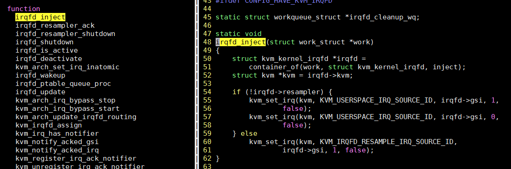  
```bash
# 应该首先检查一下kernel的内核符号表是否包含irqfd_inject, 因为代码里它是static声明的, 编译器可能将其inline
# 经检查是有的
$ cat /proc/kallsyms | grep irqfd_inject
ffff0000080aeef0 t irqfd_inject
ffff00000869e1cc t virqfd_inject

# 查看内核函数irqfd_inject的源代码位置
$ stap -l 'kernel.function("irqfd_inject")'
kernel.function("irqfd_inject@virt/kvm/eventfd.c:48")
# 查看irqfd_inject的可见变量
$ stap -L 'kernel.function("irqfd_inject")'
kernel.function("irqfd_inject@virt/kvm/eventfd.c:48") $work:struct work_struct*
$ stap -L 'kernel.statement("irqfd_inject@virt/kvm/eventfd.c:62")'
kernel.statement("irqfd_inject@virt/kvm/eventfd.c:62") $work:struct work_struct* $kvm:struct kvm*

# 打印入参: work的地址
# 内置函数usecs_to_string()返回一个适合阅读的时间字符串, 其代码在tapset/linux/task_time.stp
$ sudo stap -e 'probe kernel.function("irqfd_inject") {printf("%16s %6d [%03d] %s %s => ",execname(),tid(),cpu(),usecs_to_string(gettimeofday_us()),probefunc()) printf("work:%x\n",$work)}'
```
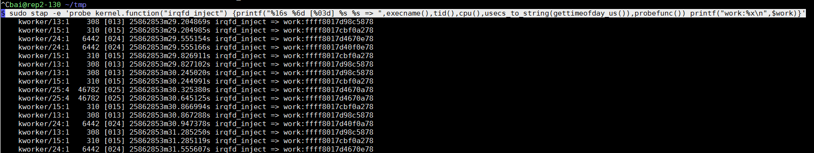  

### 看内核函数irqfd_inject的入参 -- perf版本
perf也可以probe内核函数
```bash
# 查看源码, 与stap不同的是, perf probe -L 从函数名开始记行数
$ sudo perf probe -L irqfd_inject
# 查看变量
$ sudo perf probe -V irqfd_inject:6
# 添加probe点
sudo perf probe --add 'irqfd_inject+36 work:x64 kvm:x64'
# 根据提示, 开始record
sudo perf record -e probe:irqfd_inject -a sleep 10
# 解析记录
sudo perf script | less
```
可以说, 相比systemtap, perf probe列出来的代码是经过解析的, 显示更友好, 比如蓝色部分在编译的时候并没有产生代码, 比如irqfd变量被编译器优化掉了.  
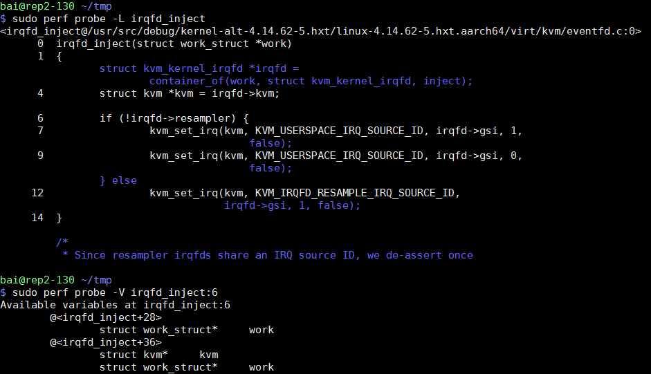  

最后的输出结果, 相对于systemtap的可以自定义输出内容, perf probe方式的输出格式是固定的, 但基本也满足要求, 使用更简单.  
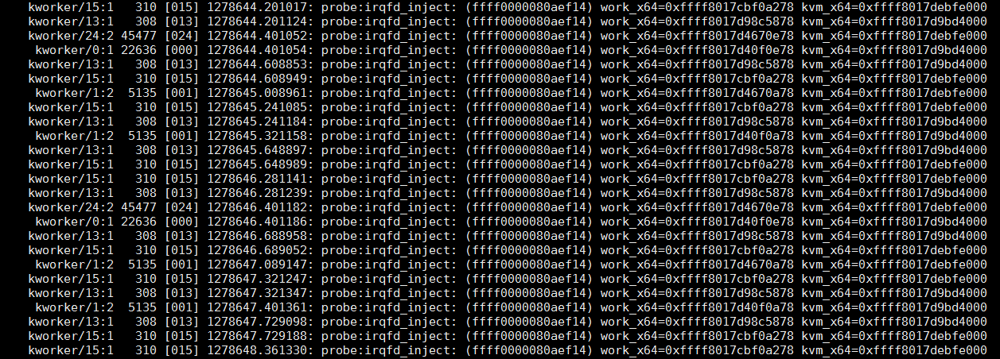  

另外, 可以这样访问结构体成员:  
`sudo perf probe --add 'irqfd_inject+36 work:x64 kvm->userspace_pid:x64'`
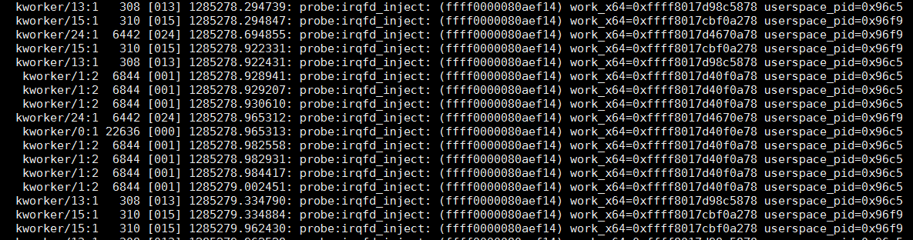  

## 统计变量和timer相关
```bash
#oneshot probe
sudo stap -e 'global x probe oneshot { for(i=1;i<=5;i++) x<<<i println(@hist_log(x)) }'

#vfs实例, -v表示详细输出
sudo stap -v -e 'probe vfs.read {printf("read performed\n"); exit()}'

#每3秒打印hello world
sudo stap -e 'probe timer.s(3) {printf("hello world!\n")}'

#算CONFIG_HZ, 展示了全局变量的用法
$ sudo stap - << EOF
global count_jiffies, count_ms
probe timer.jiffies(100) { count_jiffies ++ }
probe timer.ms(100) { count_ms ++ }
probe timer.ms(12345)
{
  hz=(1000*count_jiffies) / count_ms
  printf ("jiffies:ms ratio %d:%d => CONFIG_HZ=%d\n",
    count_jiffies, count_ms, hz)
  exit ()
}
EOF

jiffies:ms ratio 11:123 => CONFIG_HZ=89
```

## 查看tcp的connect连接
```bash
#查看tcp的connect连接, tcp_connections.stp是systemtap带的example, 需要安装systemtap-docs
$ cat /usr/share/systemtap/examples/network/tcp_connections.stp
#!/usr/bin/stap

probe begin {
  printf("%6s %16s %6s %6s %16s\n",
         "UID", "CMD", "PID", "PORT", "IP_SOURCE")
}

probe kernel.{function("tcp_accept"),function("inet_csk_accept")}.return? {
  sock = $return
  if (sock != 0)
    printf("%6d %16s %6d %6d %16s\n", uid(), execname(), pid(),
           inet_get_local_port(sock), inet_get_ip_source(sock))
}
#上面用到的函数inet_get_local_port()是/usr/share/systemtap/tapset/linux/inet_sock.stp提供的, tapset/linux/ip.stp有ip级的库方法.
#运行这个脚本
$ sudo stap /usr/share/systemtap/examples/network/tcp_connections.stp
   UID CMD PID PORT IP_SOURCE
     0 sshd 1357 22 10.64.16.123
     0 sshd 1357 22 10.64.16.123
```

## 简单例子
```bash
begin, end, end
       refers to the startup and normal shutdown of the session. In this case, the handler would run once during startup and twice during shutdown.

timer.jiffies(1000).randomize(200)
       refers to a periodic interrupt, every 1000 +/- 200 jiffies.

kernel.function("*init*"), kernel.function("*exit*")
       refers to all kernel functions with "init" or "exit" in the name.

kernel.function("*@kernel/time.c:240")
       refers to any functions within the "kernel/time.c" file that span line 240. Note that this is not a probe at the statement at that line number. Use the kernel.statement probe instead.

kernel.trace("sched_*")
       refers to all scheduler-related (really, prefixed) tracepoints in the kernel.

kernel.mark("getuid")
       refers to an obsolete STAP_MARK(getuid, ...) macro call in the kernel.

module("usb*").function("*sync*").return
       refers to the moment of return from all functions with "sync" in the name in any of the USB drivers.

kernel.statement(0xc0044852)
       refers to the first byte of the statement whose compiled instructions include the given address in the kernel.

kernel.statement("*@kernel/time.c:296")
       refers to the statement of line 296 within "kernel/time.c".

kernel.statement("bio_init@fs/bio.c+3")
       refers to the statement at line bio_init+3 within "fs/bio.c".

kernel.data("pid_max").write
       refers to a hardware breakpoint of type "write" set on pid_max

syscall.*.return
       refers to the group of probe aliases with any name in the third position
```

## 代码定位, 比grep方便, 但需要debug符号表?
```bash
#找到kernel系统调用open的源文件位置
$ stap -l 'kernel.function("sys_open")'
kernel.function("SyS_open@fs/open.c:1072")

#也可以找用户进程的符号, 可以带通配符
$ stap -l 'process("/usr/local/sbin/ovs-vswitchd").function("dp_netdev_input*")'
process("/usr/local/sbin/ovs-vswitchd").function("dp_netdev_input@lib/dpif-netdev.c:4958")
process("/usr/local/sbin/ovs-vswitchd").function("dp_netdev_input__@lib/dpif-netdev.c:4910")
```

## 查看函数指针(虚函数)运行时对应的实际函数
参考https://blog.csdn.net/wangzuxi/article/details/42849053

```bash
#比如想知道下面的命令调用的read的具体实现
$ cat /proc/39817/stat
39817 (monitor) S 1 39817 39817 0 -1 4194368 49 0 0 0 0 0 0 0 10 -10 1 0 105153583 19595264 49 18446744073709551615 1 1 0 0 0 0 0 4096 0 0 0 0 17 24 0 0 0 0 0 0 0 0 0 0 0 0 0
#先看sys_read
$ stap -l 'kernel.function("sys_read")'
kernel.function("SyS_read@fs/read_write.c:566")
#看代码, read调用vfs_read, 现在想知道这里的file->f_op->read指向谁
#可以gdb, 但搭环境太麻烦, 比如用qemu跑VM, gdb调试VM的kernel; 或者打印这个地址, 查符号表得到符号
ssize_t __vfs_read(struct file *file, char __user *buf, size_t count, loff_t *pos)
{
    if (file->f_op->read)
        return file->f_op->read(file, buf, count, pos);
    else if (file->f_op->read_iter)
        return new_sync_read(file, buf, count, pos);
    else
        return -EINVAL;
}
```
根据参考文章  
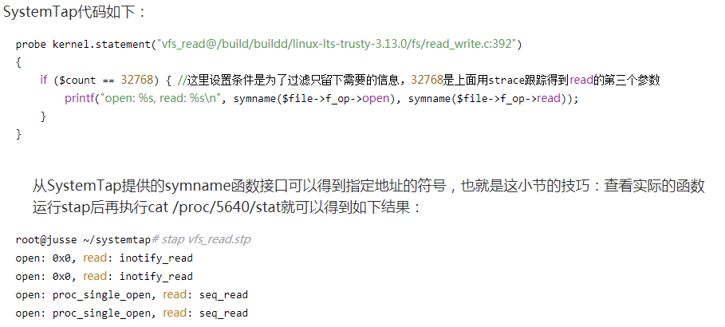  

用ftrace也可以查到这个函数指针的真正对象, 部分函数如下  
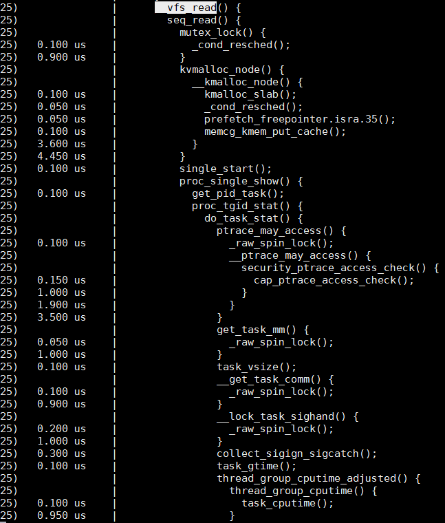  

## 查看调用栈
比如想看内核函数`netif_receive_skb`的调用栈
```bash
[root@rep2-130 debug]# cat netif_receive_skb.stp
probe kernel.function("netif_receive_skb")
{
    printf("--------------------------------------------------------\n");
    print_backtrace();
    printf("--------------------------------------------------------\n");
}
[root@rep2-130 debug]# stap netif_receive_skb.stp
WARNING: Missing unwind data for a module, rerun with 'stap -d vhost_net'
WARNING: Missing unwind data for a module, rerun with 'stap -d bridge'
--------------------------------------------------------
 0xffff0000088220cc : netif_receive_skb+0x0/0xac [kernel]
 0xffff000008670ff4 : tun_sendmsg+0x50/0x94 [kernel]
 0xffff000005a9155c [vhost_net]
 0x0 (inexact)
--------------------------------------------------------
--------------------------------------------------------
 0xffff0000088220cc : netif_receive_skb+0x0/0xac [kernel]
 0xffff00000553534c [bridge]
 0x0 (inexact)
--------------------------------------------------------
```
stap会先把`netif_receive_skb.stp`编译成内核模块, 然后插入内核运行, 首次编译要稍等一会没打印, 其实后台是在编译.

编译完成自动运行, 期间会出现stap打头的内核模块
```bash
bai@rep2-130 ~
$ lsmod | grep stap
stap_3789144b44a61fc185145ac98a2b544_36760 6815744 2
```

## 跟踪应用执行流程
参考文章中跟踪ngnix的执行流程:
https://blog.csdn.net/wangzuxi/article/details/42976577
```bash
root@jusse ~/systemtap# cat trace_nginx.stp           
probe process("/opt/nginx-dso/sbin/nginx").function("*").call
{
    printf("%s -> %s\n", thread_indent(4), ppfunc());
}

probe process("/opt/nginx-dso/sbin/nginx").function("*").return
{
    printf("%s <- %s\n", thread_indent(-4), ppfunc());
}

root@jusse ~/systemtap# stap -x 29774 trace_nginx.stp 
WARNING: function _start return probe is blacklisted: keyword at trace_nginx.stp:6:1
 source: probe process("/opt/nginx-dso/sbin/nginx").function("*").return
         ^
     0 nginx(29774): -> ngx_time_update
    10 nginx(29774): <- ngx_time_update
     0 nginx(29774): -> ngx_event_process_posted
     3 nginx(29774): <- ngx_event_process_posted
     0 nginx(29774): -> ngx_event_expire_timers
     3 nginx(29774): <- ngx_event_expire_timers
     0 nginx(29774): -> ngx_event_process_posted
     2 nginx(29774): <- ngx_event_process_posted
     0 nginx(29774): -> ngx_process_events_and_timers
     5 nginx(29774): -> ngx_event_find_timer
     8 nginx(29774): <- ngx_event_find_timer
    11 nginx(29774): -> ngx_trylock_accept_mutex
    16 nginx(29774): -> ngx_shmtx_trylock
    19 nginx(29774): <- ngx_shmtx_trylock
    21 nginx(29774): <- ngx_trylock_accept_mutex
    25 nginx(29774): -> ngx_epoll_process_events
500591 nginx(29774): -> ngx_time_update
500604 nginx(29774): -> ngx_gmtime
500608 nginx(29774): <- ngx_gmtime
500617 nginx(29774): -> ngx_vslprintf
500623 nginx(29774): -> ngx_sprintf_num
……
500655 nginx(29774): <- ngx_sprintf_num
500657 nginx(29774): <- ngx_vslprintf
500659 nginx(29774): <- ngx_sprintf
500664 nginx(29774): -> ngx_localtime
500689 nginx(29774): <- ngx_localtime
500695 nginx(29774): -> ngx_vslprintf
500699 nginx(29774): -> ngx_sprintf_num
……
500732 nginx(29774): <- ngx_sprintf_num
500734 nginx(29774): <- ngx_vslprintf
500736 nginx(29774): <- ngx_sprintf
500741 nginx(29774): -> ngx_vslprintf
500745 nginx(29774): -> ngx_sprintf_num
……
500784 nginx(29774): <- ngx_sprintf_num
500786 nginx(29774): <- ngx_vslprintf
500788 nginx(29774): <- ngx_sprintf
     0 nginx(29774): -> ngx_vslprintf
     4 nginx(29774): -> ngx_sprintf_num
……
    48 nginx(29774): <- ngx_sprintf_num
    50 nginx(29774): <- ngx_vslprintf
     0 nginx(29774): <- ngx_sprintf
     0 nginx(29774): -> ngx_vslprintf
     5 nginx(29774): -> ngx_sprintf_num
……
    25 nginx(29774): <- ngx_sprintf_num
    27 nginx(29774): <- ngx_vslprintf
     0 nginx(29774): <- ngx_sprintf
     0 nginx(29774): <- ngx_time_update
     0 nginx(29774): <- ngx_epoll_process_events
```
（省略号是删去一些重复的输出，下同）。前面的数字是这个函数调用开始或者结束时间，单位是微秒。

### 优点
根据systemtap的原理, 和uftrace相比, systemtap跟踪执行流程不需要重新用`-pg`来编译应用, 只需要debug信息, 这点非常好!

## 跟踪内核执行流程
以signal为例

参考: https://blog.csdn.net/wangzuxi/article/details/44901285
```bash
#先找到signal的内核代码
root@jusse ~# stap -l 'kernel.function("sys_signal")'
kernel.function("SyS_signal@/build/buildd/linux-lts-trusty-3.13.0/kernel/signal.c:3525")

root@jusse ~# stap -l 'kernel.function("sys_kill")'  
kernel.function("SyS_kill@/build/buildd/linux-lts-trusty-3.13.0/kernel/signal.c:2909")

#在signal.c的所有函数上, 调用和返回的时候都调用probe
root@jusse ~/systemtap# cat kernel_signal_process.stp 
probe begin {
    printf("begin\n")
}

probe kernel.function("*@/build/buildd/linux-lts-trusty-3.13.0/kernel/signal.c").call {
    if (target() == pid()) {
        printf("%s -> %s\n", thread_indent(4), ppfunc())
    }
}

probe kernel.function("*@/build/buildd/linux-lts-trusty-3.13.0/kernel/signal.c").return {
    if (target() == pid()) {
        printf("%s <- %s\n", thread_indent(-4), ppfunc())
    }
}

#执行stap
stap -x 26850 ./kernel_signal_process.stp

#给26850这个shell进程发信号
kill -INT 26850
```
结果:  
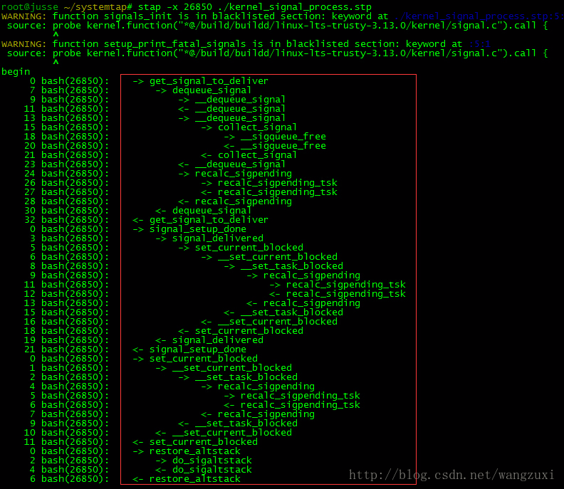  

## 判断代码分支路径
参考: https://blog.csdn.net/wangzuxi/article/details/43856857

用systemtap的statement  
比如像看下面代码是否进了if分支, 注意这段代码一直到4805行都是在if的条件里  
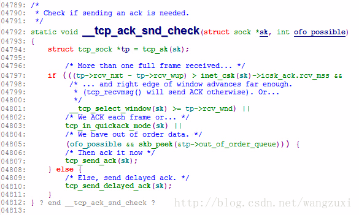  

```bash
root@jusse ~/systemtap# cat tcp_ack_snd_check.stp 
probe begin
{
    printf("begin\n");
}

probe kernel.statement("__tcp_ack_snd_check@/build/buildd/linux-lts-trusty-3.13.0/net/ipv4/tcp_input.c:*")
{
    printf("%s\n", pp());
}
#运行
root@jusse ~/systemtap# stap tcp_ack_snd_check.stp 
begin
kernel.statement("__tcp_ack_snd_check@/build/buildd/linux-lts-trusty-3.13.0/net/ipv4/tcp_input.c:4793")
kernel.statement("__tcp_ack_snd_check@/build/buildd/linux-lts-trusty-3.13.0/net/ipv4/tcp_input.c:4797")
kernel.statement("__tcp_ack_snd_check@/build/buildd/linux-lts-trusty-3.13.0/net/ipv4/tcp_input.c:4807")
kernel.statement("__tcp_ack_snd_check@/build/buildd/linux-lts-trusty-3.13.0/net/ipv4/tcp_input.c:4812")

kernel.statement("__tcp_ack_snd_check@/build/buildd/linux-lts-trusty-3.13.0/net/ipv4/tcp_input.c:4793")
kernel.statement("__tcp_ack_snd_check@/build/buildd/linux-lts-trusty-3.13.0/net/ipv4/tcp_input.c:4797")
kernel.statement("__tcp_ack_snd_check@/build/buildd/linux-lts-trusty-3.13.0/net/ipv4/tcp_input.c:4803")
kernel.statement("__tcp_ack_snd_check@/build/buildd/linux-lts-trusty-3.13.0/net/ipv4/tcp_input.c:4805")
kernel.statement("__tcp_ack_snd_check@/build/buildd/linux-lts-trusty-3.13.0/net/ipv4/tcp_input.c:4810")

kernel.statement("__tcp_ack_snd_check@/build/buildd/linux-lts-trusty-3.13.0/net/ipv4/tcp_input.c:4793")
kernel.statement("__tcp_ack_snd_check@/build/buildd/linux-lts-trusty-3.13.0/net/ipv4/tcp_input.c:4797")
kernel.statement("__tcp_ack_snd_check@/build/buildd/linux-lts-trusty-3.13.0/net/ipv4/tcp_input.c:4803")
kernel.statement("__tcp_ack_snd_check@/build/buildd/linux-lts-trusty-3.13.0/net/ipv4/tcp_input.c:4810")
```
结果带行号, 很清楚能看到分支走向: 第一次走了if, 后面两次都是else分支.

# systemtap和dtrace语法对比
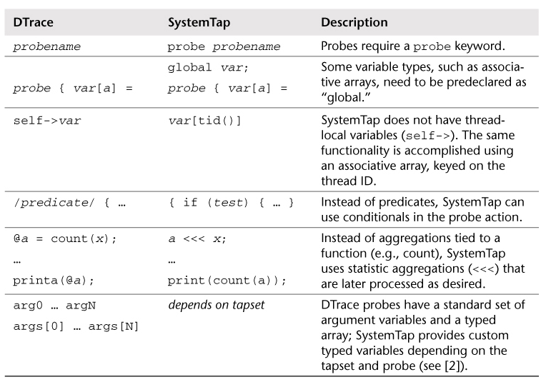  
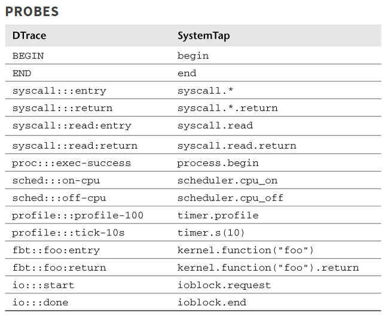  
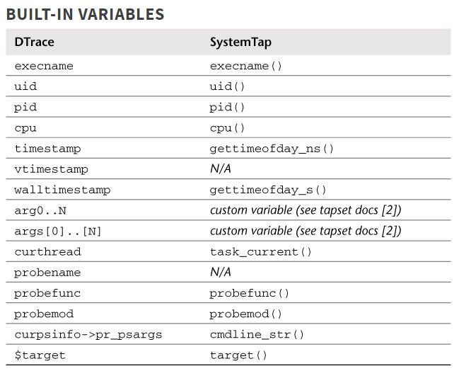  
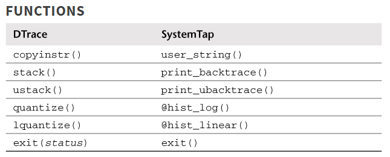  

# systemtap实例
libvirt里面有几个不错的例子

比如: 
* `libvirt-4.6.0/examples/systemtap/events.stp`
* `libvirt-4.6.0/examples/systemtap/lock-debug.stp`

## latencytap.stp
源代码在`/usr/share/systemtap/examples/profiling/latencytap.stp`
这个脚本记录一个进程在kernel.trace("activate_task")和kernel.trace("deactivate_task")的时间差, 并在进程被调度的时候scheduler.cpu_on记录调用栈, 根据预定义的优先级表数组, 把这个进程因为什么原因睡眠, 占多少时间, 统计出来.

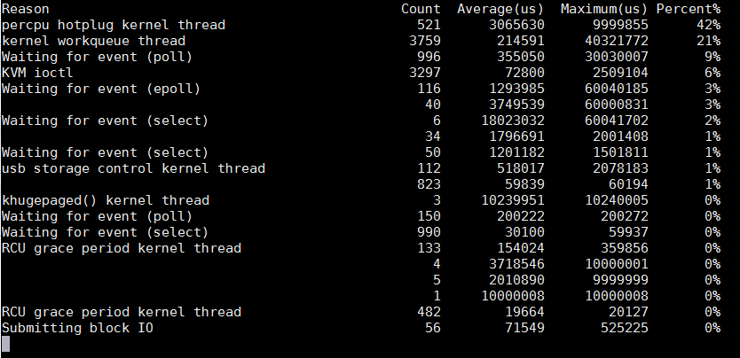  

这个优先级表是个经验表: 通过逐条匹配调用栈的符号, 找到优先级最高的符号, 作为睡眠原因.

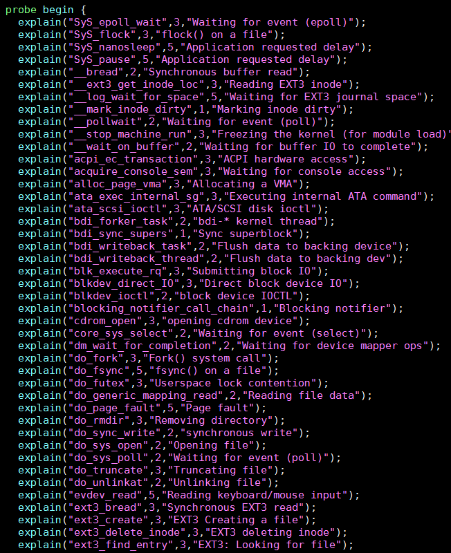  


## libvirtd调试dead lock
```bash
#!/usr/bin/stap --ldd -d /usr/sbin/libvirtd -c libvirtd
#
# Usage with installed libvirt daemon:
# stap --ldd -d /usr/sbin/libvirtd -c libvirtd \
# lock-debug.stp /usr/lib/libvirt.so
#
# If made executable; simple './lock-debug.stp' should work too.
#
# TODOs:
#
# Document usage with uninstalled daemon and libs. Assuming CWD is toplevel
# source git directory, it should be only slight modification to the following:
#
# ./run stap --ldd -c src/libvirtd -d src/libvirtd
# examples/systemtap/lock-debug.stp src/.libs/libvirt.so
#
# Debug RWLock mechanisms as well.
#
# Author: Martin Kletzander <mkletzan@redhat.com>


global mx_tolock
global mx_locked


function filter()
{
    if (pid() != target())
        return 1

    return 0
}

probe library = process( %( $# > 0 %? @1 %: "/usr/lib/libvirt.so" %) )
{
    if (filter()) next
}

probe lock = library.function("virMutexLock")
{
    lockname = usymdata($m)
}

probe unlock = library.function("virMutexUnlock")
{
    lockname = usymdata($m)
}

probe begin
{
    %( $# > 1 %? println("error: Too many parameters"); exit();
       %: print("Started, press ^C when the process hangs\n"); %)
}

probe lock.call
{
    mx_tolock[lockname, tid()] = sprint_usyms(ubacktrace())
}

probe lock.return
{
    if ([lockname, tid()] in mx_tolock) {
        mx_locked[lockname, tid()] = mx_tolock[lockname, tid()]
        delete mx_tolock[lockname, tid()]
    } else {
        printf("internal error: lock acquired unwillingly?\n")
    }
}

probe unlock.call
{
    found = 0

    foreach ([lock, tid] in mx_locked) {
        if (lock != lockname)
            continue
        if (tid != tid()) {
            printf("Warning: lock released on different thread that locked it.\n")
            printf("Lock trace:\n%s\n", mx_locked[lock, tid])
            printf("Unlock trace:\n%s\n", sprint_usyms(ubacktrace()))
        }

        found = tid
        break
    }

    if (found && [lockname, found] in mx_locked)
        delete mx_locked[lockname, found]
}

probe end
{
    tmp = 0

    printf("\n=============\n")

    foreach (bt1 = [lock1, tid1] in mx_tolock) {
        deadlock = 0

        foreach (bt2 = [lock2, tid2] in mx_tolock) {
            if (lock1 == lock2) {
                if (!tmp++)
                    printf("The following locks cannot be acquired:\n")

                if (!deadlock++)
                    printf("Lock %s was locked in thread %d with this trace:\n%s\n",
                           lock1, tid1, bt1)

                printf("and is waiting to be locked by thread %d here:\n%s\n",
                       tid2, bt2)
            }
        }
        if (deadlock)
            printf("---\n")
    }
    if (!tmp)
        printf("No deadlocks found, sorry.\n")
}
```
