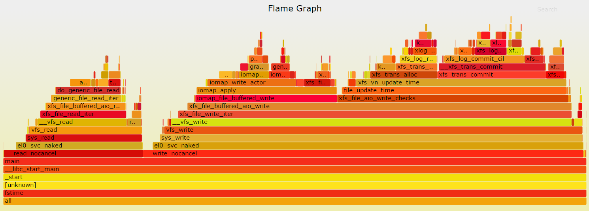

- [现象](#现象)
- [复现与简化](#复现与简化)
- [初步分析](#初步分析)
  - [htop](#htop)
  - [用内存文件系统?](#用内存文件系统)
- [代码分析](#代码分析)
  - [cscope/global结合vim代码阅读](#cscopeglobal结合vim代码阅读)
    - [生成cscope.files](#生成cscopefiles)
    - [建立代码检索数据库](#建立代码检索数据库)
    - [直接到main函数](#直接到main函数)
  - [用gdb tui模式看代码](#用gdb-tui模式看代码)
  - [代码逻辑](#代码逻辑)
  - [perf](#perf)
- [对比试验](#对比试验)
  - [加长运行时间, 运行时观察](#加长运行时间-运行时观察)
  - [和存储设备无关?](#和存储设备无关)
  - [4.9 vs 4.10](#49-vs-410)
  - [和2699对比](#和2699对比)
- [profiling](#profiling)
  - [perf](#perf-1)
  - [flamegraph](#flamegraph)
- [结论](#结论)

>本文是一个入门的分析方法. 背景是对比ARM64 server芯片和Intel server芯片的性能  
在ES2评估过程中, 用unixbench测试, 文件系统性能低, 这里记录分析过程, 包括初步排查, 代码梳理, gdb代码跟踪, perf性能分析, 以借此演示一些基础工具的使用方法.

AW: Qualcomm server SOC Amberwing(48 core AARCH64)  
hp380: Intel 2699v4

# 现象
unixbench的file copy项里, AW比Intel慢4到5倍
  

  

# 复现与简化
Unixbench编译省略, 运行只有一个Run脚本, 直接运行会按默认的配置跑完整个测试用例, 并给出得分(index).  
但这里我们只关心file copy, 所以第一步是先读这个perl脚本, 找到单独调用这个测试项的办法.  

没有--help, 看来只有看脚本了:  
`./Run fstime -i 1 -c 1`  
运行fstime 1次(默认是10次), 1个copy, unixbench默认先跑1 copy, 再跑全copy(和核数相等)  
脚本里提到了fstime的传入参数
```sh
File Copy 1024 bufsize 2000 maxblocks
-c -t 30 -d tmp -b 1024 -m 2000

File Copy 256 bufsize 500 maxblocks
-c -t 30 -d tmp -b 256 -m 500

File Copy 4096 bufsize 8000 maxblocks
-c -t 30 -d tmp -b 4096 -m 8000
```
那么可以直接调用:

```sh
$ pgms/fstime -c -t 30 -d tmp -b 1024 -m 2000
Write done: 2448000 in 2.0006, score 305906
COUNT|305906|0|KBps
TIME|2.0
Read done: 8954552 in 2.0000, score 1119313
COUNT|1119313|0|KBps
TIME|2.0
Copy done: 28439512 in 30.0000, score 236995
COUNT|236995|0|KBps
TIME|30.0
```
从打印来看, 是先写, 再读, 最后copy  
OK, 现在复现问题已经化简到一条更具体的命令.

# 初步分析
## htop
htop显示CPU8打满100%, 大部分在内核态(红色)  
  

## 用内存文件系统?
运行时生成的测试文件只有两个, dummy0, dumm1, 大小只有2M. 那么这个file copy是否大部分在文件系统的buffer里, 和实际的物理介质关系不大呢?  
`$ sudo mount -o size=2G -t tmpfs none tmp`

还真不是, 换成tmpfs以后, 性能达到2倍以上.
```sh
$ pgms/fstime -c -t 30 -d tmp -b 1024 -m 2000
Write done: 8056000 in 2.0012, score 1006395
COUNT|1006395|0|KBps
TIME|2.0
Read done: 11411328 in 2.0000, score 1426408
COUNT|1426408|0|KBps
TIME|2.0
Copy done: 66244060 in 30.0000, score 552033
COUNT|552033|0|KBps
TIME|30.0
```

# 代码分析

题外话, 这个unixbench代码很少, 工程结构也比较简单. 但考虑到以后要分析更大的工程代码, 那么先找个通用的, 快速的代码分析方法.

## cscope/global结合vim代码阅读
需要先安装cscope和gnu global, 我个人推荐gnu global, 这两个工具都会生成代码的检索数据库, 方便代码阅读.

### 生成cscope.files
gdb可以根据elf文件的debug信息(编译时加-g), 列出源文件列表. 这个列表里面的源文件是真正参与编译的, 对大工程推荐用这招, 减少冗余文件的干扰.
```sh
mkcselffiles() {
    ${CROSS_COMPILE}gdb -ex="info sources" -ex="quit" $1 | sed -e '1,15d' -e 's/,/\n/g' | sed -e '/^ *$/d' -e 's/^ *//g' > cscope.files.tmp1
    #find -L `cat cscope.files.tmp1 | egrep "/flat/" | sed 's!\(.*/flat/[^/]*\).*!\1!g' | sort -u` -iname "*.h" -o -iname "*.hh" -o -iname "*.hpp" > cscope.files.tmp2
    #cat cscope.files.tmp1 cscope.files.tmp2 | sort -u > cscope.files
    cat cscope.files.tmp1 | sort -u > cscope.files
    rm -f cscope.files.tmp*
}
```
或者简单点, 生成所有源文件列表
```sh
mkcsfiles() {
    #find -L $* -iname '*.[ch]' -o -iname '*.[ch]pp' -o -iname '*.cc' -o -iname '*.hh' -o -iname '*.s' | sort -u > cscope.files
    find -L $* -type f | sed -n '/\.\([chs]\)\1\{0,1\}\(pp\)\?$/Ip' | sort -u > cscope.files
}
```
这里我用
`mkcselffiles pgms/fstime`

### 建立代码检索数据库
有两种
* cscope  
`cscope -bkq -i cscope.files`  
* gnu global  
用global需要在当前工程的根目录运行  
`gtags -f cscope.files`

### 直接到main函数
`vim -t main`

## 用gdb tui模式看代码
边看边调, 参考[GDB tui教程](wiz://open_document?guid=81c5dd73-0e98-4201-9def-5cd28bc5c1bd&kbguid=&private_kbguid=206cfc40-42e2-11e2-a9b7-907ab51b66ae)
```sh
gdb -tui pgms/fstime
b main
run -c -t 30 -d tmp -b 1024 -m 2000
```

## 代码逻辑
前面提到, 整个测试过程是先写, 再读, 再拷贝.  
按照这个过程, 代码逻辑如下:  
一个读文件(dummy0), 一个写文件(dummy1)  
在写的时候, 就是一直用底层的wirte函数写文件, 读类似, 拷贝是先读再写.  
  

* buf是静态数组
* 计分是在固定时间内的拷贝的字节数
* 这是个单进程的测试程序

## perf
```sh
perf record pgms/fstime -c -t 30 -d tmp -b 1024 -m 2000
perf report
```
在SDP1上, 4.9.0.2  
  

在SDP2上, 4.9.0.4  
  
注: 以上命令是在用户权限下看到的统计, 注意event标记是'cycles:u'

```sh
sudo perf record pgms/fstime -c -t 30 -d tmp -b 1024 -m 2000
sudo perf report
```

在SDP1上, 4.9.0.2  
  

在SDP2上, 4.9.0.4  
  

# 对比试验
重点看SDP1上的perf, 迹象表明可能和auditd有关(老外提示), 比如selinux*高占用, __audit_sysall_entry等.  
那打开和关闭auditd的对比结果:  
在SDP1上, 4.9.0-2.el7.aarch64(64K):
* tmpfs情况下, 关闭auditd, 系统write效率提高大约24%, read提高17%, 拷贝提高20%  

环境: 4.9.0-2.el7.aarch64(64K), tmpfs  
|auditd|read|write|copy
|--|--|--|--
|auditd on|895906|1163064|502048
|auditd off|1055766|1445539|607435

* 普通ssd, 关闭auditd, 读提高6%, 写提高27%, 拷贝提高6%  

环境: 4.9.0-2.el7.aarch64(64K), ssd(240G)  
|auditd|read|write|copy
|--|--|--|--
|auditd on|260701|1158512|212135
|auditd off|278926|1478228|226238

* 综合以上, audit关闭对tmpfs提升大, 对普通的ssd提升较小.  
是不是因为有实际的磁盘读写, 相对慢的磁盘开销导致的?

## 加长运行时间, 运行时观察
```sh
pgms/fstime -c -t 300 -d tmp -b 1024 -m 2000

sudo perf top -p `pidof fstime`
sudo iotop -p `pidof fstime`
```
磁盘利用率很低, 基本上要好几秒才会有实际的磁盘读写, 其他时间磁盘读写都是0  
这说明可能并不是磁盘读写, 而是xfs文件系统路径的复杂度拖慢了性能?  
perf top里面有很多关于xfs的调用.

  
 
## 和存储设备无关?
那如何证明呢?  
1. 建立tmpfs  
`sudo mount -o size=2G -t tmpfs none mytmp`

2. 在这个tmpfs里面dd一个文件, 并格式化成xfs  
```sh
dd if=/dev/zero of=mytmp/testdisk bs=1M count=1000
mkfs.xfs mytmp/testdisk
```
3. mount 这个文件  
`sudo mount mytmp/testdisk tmp`

OK, 现在测试目录tmp是xfs文件系统, 但实际上是在tmpfs下面的一个文件, 都是在内存里.  

环境: 4.9.0-2.el7.aarch64(64K), xfs on file(which is in tmpfs)  
auditd on: r264033, w1153529, c211546  

对比前面在SSD上的数据, 几乎没差别.  
环境: 4.9.0-2.el7.aarch64(64K), ssd(240G)  
auditd on: r260701, w1158512, c212135

这说明: **这个测试项, 性能和具体存储设备无关, 底层的文件系统直接决定了测试结果**

## 4.9 vs 4.10
sdp2比sdp1, 读快了22%, 写慢了8%, 拷贝快了18%

环境: AWSDP, xfs on ssd(240G), audit off
|kernel|read|write|copy
|--|--|--|--
|4.9|278926|1478228|226238
|4.10|341409|1360577|267056


## 和2699对比
所以, 公平的对比要在:
* audit 同时on, 或者同时off
* 都是xfs
* 读是2699v4的35%, 写是44%, 拷贝是36%

环境: xfs on ssd, auditd on
|CPU/server/kernel|read|write|copy
|--|--|--|--
|AW/SDP/4.9|260701|1158512|212135
|2699v4/HP380/3.10|739714|2628781|574521


# profiling
## perf
SDP1:  
  

2699v4:  
  

## flamegraph
生成flamegraph
```sh
sudo perf record -g pgms/fstime -c -t 30 -d tmp -b 1024 -m 2000
sudo perf script | ~/yingjieb/FlameGraph/stackcollapse-perf.pl | ~/yingjieb/FlameGraph/flamegraph.pl > fstime.svg
```
on SDP2:  
  

on 2699v4:  
  

# 结论
* 这个单进程的测试项基本可以认为反映了单核处理文件系统的能力.
* AW关闭auditd, 文件写提升27%, 拷贝提升6%
* AW 4.10(4K)比4.9(64K)在读上快22%, 但写慢了8%, 综合好18%.
* 和具体存储硬件无关, 是内核文件系统的执行效率问题, 对比2699v4, AW执行文件系统路径更慢, 或者说AW跑这些代码更慢.
* 整个文件系统路径如下: 系统调用读写->linux vfs读写->xfs读写->block设备驱动读写.
* __ll_sc*, 以及__block_write_begin_int等排名靠前的函数值得分析. 
* 现在AW性能大概在2699的1/3, 结合经验, AW文件系统性能应该提高一倍, 达到2699的2/3才算正常.
