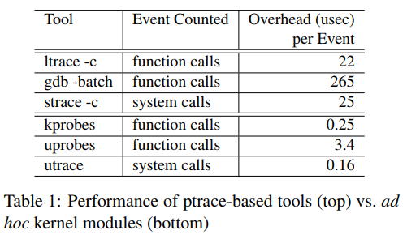

- [utrace要解决的是ptrace系统调用的问题](#utrace要解决的是ptrace系统调用的问题)
  - [ptrace](#ptrace)
- [utrace](#utrace)
  - [uprobe](#uprobe)
- [uprobe实现概要](#uprobe实现概要)
- [utrace的性能](#utrace的性能)

> 本文为2007年Jim Keniston等IBM大拿的Ptrace, Utrace, Uprobes: Lightweight, Dynamic Tracing of User Apps阅读笔记

参考:
[刘 明: 玩转 utrace](https://www.ibm.com/developerworks/cn/linux/l-cn-utrace/index.html)
[Ptrace, Utrace, Uprobes: Lightweight, Dynamic Tracing of User Apps](https://landley.net/kdocs/ols/2007/ols2007v1-pages-215-224.pdf)

# utrace要解决的是ptrace系统调用的问题
ptrace是gdb和strace使用的系统调用, 比较老, 开销大, 对多核支持不好.  
utrace提供了更强大的api, 扩展了kernel的trace debug功能.  
在此基础上的uprobe, 提供了类似kprobe的, 基于breakpoint的用户态probe方法.

## ptrace
ptrace的目的是debugging, 但后来也被用来tracing. 它提供:
* 改变程序状态的能力: attach dettach进程(tracee), 单步, 断点
* 读写进程memory的能力
* 捕捉事件的能力: 比如系统调用或信号

ptrace慢, 不是posix标准调用, 多线程支持差, 必须变成trcee的父进程, 破环进程继承关系.
慢的很大一部分原因是, 比如gdb, 用户态的gdb要不断的调用ptrace系统调用, 造成用户态和内核态反复的切换

# utrace
utrace的思路是, 把调试code以模块的方式, 直接放在内核态运行. 所以使用utrace接口的systemtap, 可以把.tap后缀的脚本变成.ko放到内核态运行.  
utrace的监控对象是线程, 即`task_struct`, 用"engine"来做最基本的管理抽象. 每个utrace的client, 比如systemtap, 建立对目标thread的engine.
engine提供:
* Event reporting: utrace的client可以对感兴趣的事件注册callback, 比如系统调用
* Thread control: utrace的client可以改变程序状态, 比如单步, 断点
* Thread machine state access: 在client注册的callback被调用的里面, 可以检查程序的状态, 寄存器, 用户态内存.

utrace在"strategic points"上插入breakpoint指令, 被hit的时候调用其client注册的callback. 所以callback是运行在内核态的, 所以systemtap要通过ko的方式注册callback. 
使用utrace后, ptrace系统调用也变成了utrace的client, 工作在内核态.

## uprobe
uprobe也是utrace的client, 也被集成进了kernel. 和kprobe可以对kernel插桩类似, uprobe可以对用户进程插桩.  
systemtap也是uprobe的用户, 可以指定哪个进程哪个虚拟地址要被插桩, hit了以后执行哪个handler.

uprobe设计要点
* 支持内核模块
* 和kprobe以及utrace协同
* 限制小: 可以对任意个数进程, 多线程, 进行任意类型的probe; 多个client的instrument代码可以对同一个进程probe.
* probe进程, 而不是二进制: 因为要插入breakpoint, 每个被probe的进程, 修改自己的page的拷贝来完成插入.
* handlers可以睡眠: breakpoint被hit后, 通过signal-callback机制来运行client指定的handler, 看意思是这个进程的进程上下文, 可以睡眠;  
更进一步, 可以看这个进程的全部地址空间.
* 性能好: 因为handler在内核态运行, 和被probe的进程同进程.
* 多架构支持: 

# uprobe实现概要
https://landley.net/kdocs/ols/2007/ols2007v1-pages-215-224.pdf

# utrace的性能
  
