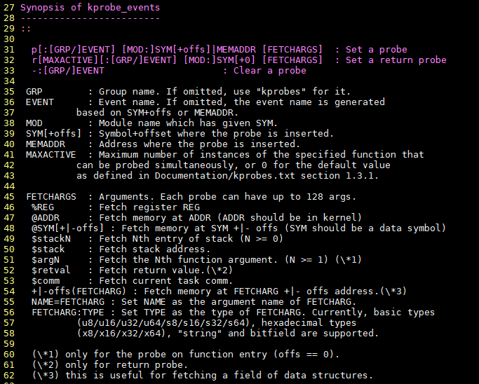
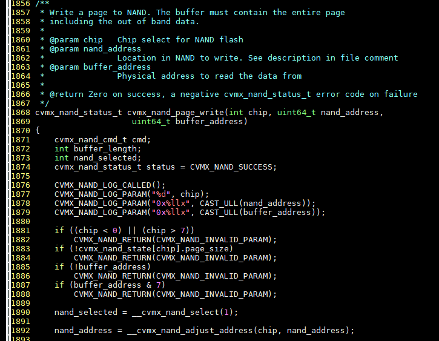
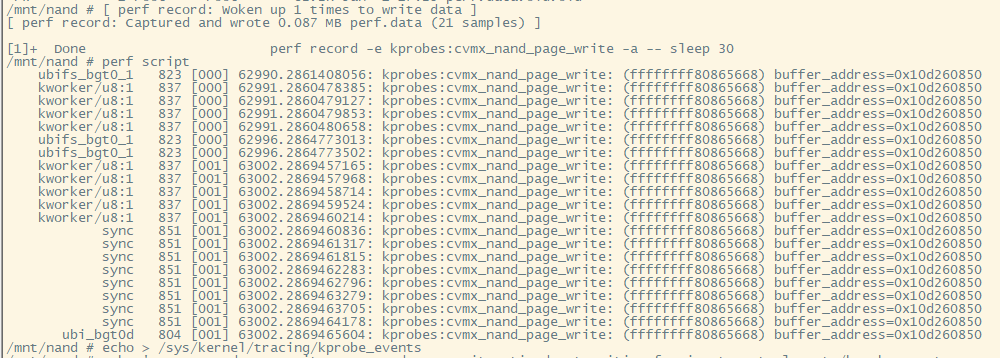
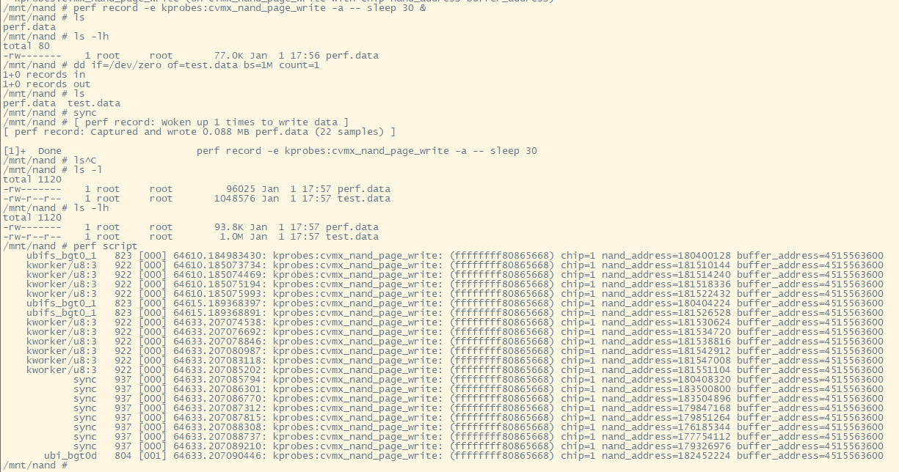
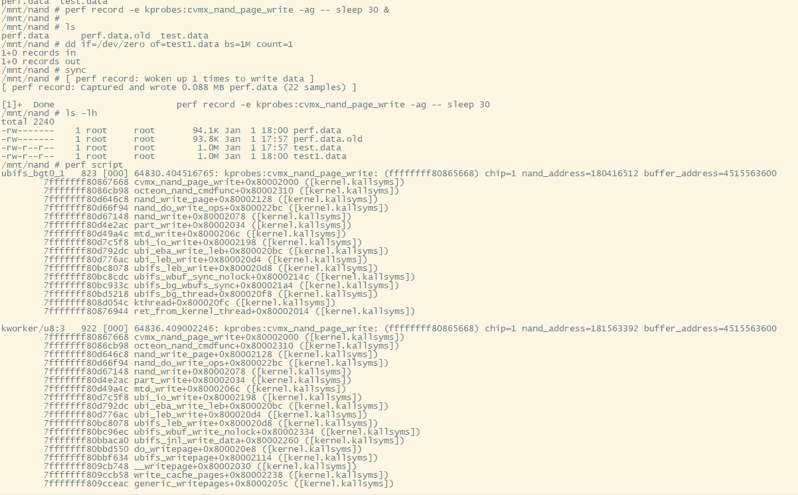
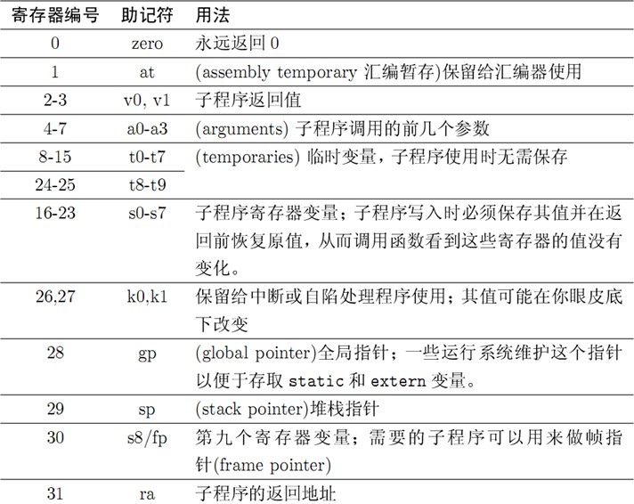
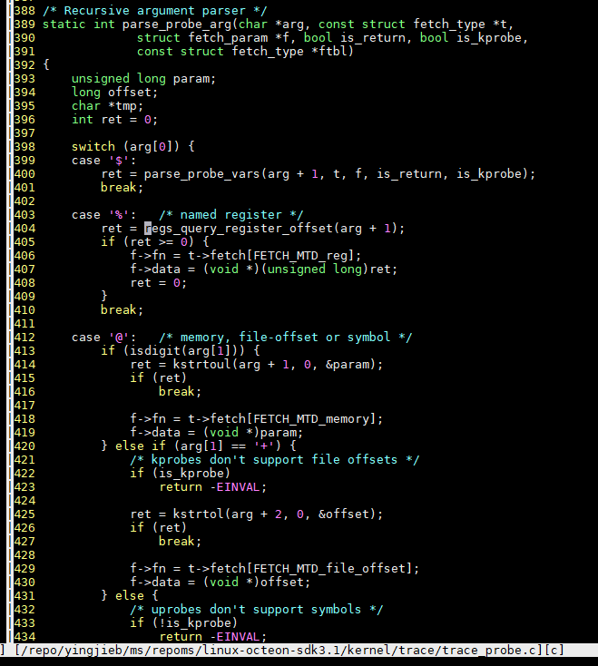
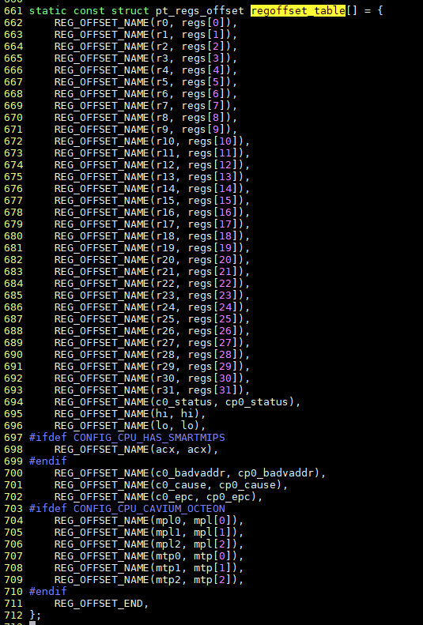

- [背景](#背景)
- [使用ftrace的kprobe接口](#使用ftrace的kprobe接口)
  - [ftrace参数说明](#ftrace参数说明)
  - [使用](#使用)
  - [进阶版, 打印所有参数:](#进阶版-打印所有参数)
  - [加-g, 带调用栈](#加-g-带调用栈)
- [ftrace的kprobe原理](#ftrace的kprobe原理)
  - [MIPS calling convention](#mips-calling-convention)
  - [kprobe代码](#kprobe代码)

# 背景
调试Octeon的Nand flash驱动时, 我想看`cvmx_nand_page_write`被调用时, 传入的参数是什么.

一般的, 可以用perf工具来查看运行时变量, 思路是先用`perf probe -V`利用debuginfo等信息, 查看可以probe的变量, 再`perf record`

但在MIPS上, 第一步就有问题:
```sh
~ # perf probe -V cvmx_nand_page_write
Failed to find the path for kernel: Invalid ELF file
  Error: Failed to show vars.
```

# 使用ftrace的kprobe接口
实际上, perf probe底层也是用了ftrace的kprobe接口, 下面看看怎么使用这个接口看函数入参.

## ftrace参数说明
  

## 使用
  

注: 同时看看`/sys/kernel/tracing`和`/sys/kernel/debug/tracing`
```sh
# 根据函数, buffer_address是寄存器号6, 这里填%r6, %是ftrace格式规定, r6是MIPS规定的寄存器名(有时候也叫$6)
#echo 'p:cvmx_nand_page_write cvmx_nand_page_write buffer_address=%r6' > /sys/kernel/tracing/kprobe_events
#perf probe -l
  kprobes:cvmx_nand_page_write (on cvmx_nand_page_write with buffer_address)
#perf record -e kprobes:cvmx_nand_page_write -a -- sleep 30 &
[ perf record: Woken up 1 times to write data ]
[ perf record: Captured and wrote 0.087 MB perf.data (21 samples) ]
#perf script
```

  

## 进阶版, 打印所有参数:
```sh
#u64是类型后缀
echo 'p:cvmx_nand_page_write cvmx_nand_page_write chip=%r4:u64 nand_address=%r5:u64 buffer_address=%r6:u64' > /sys/kernel/tracing/kprobe_events
```
  

## 加-g, 带调用栈
  

# ftrace的kprobe原理
## MIPS calling convention
上面的例子中, 使用了`chip=%r4:u64 nand_address=%r5:u64 buffer_address=%r6:u64`这样的语法, 其中:

r4 r5 r6是寄存器名, 表示前三个入参, 这就用到了MIPS calling convention, 这是MIPS规定的函数调用寄存器使用规范, GCC遵循这个规范来生成汇编代码

  

## kprobe代码
那为什么前面有`%`号呢? kprobe语法中, %开头的表示寄存器:

代码在
`kernel/trace/trace_probe.c`

  
在`arch/mips/kernel/ptrace.c`中

这些寄存器是从pt_reg结构体里取出来的, syscall和中断的时候, 系统会保存所有寄存器到pt_reg结构体

  

