- [背景](#背景)
  - [复现命令](#复现命令)
  - [结果显示调用栈全0](#结果显示调用栈全0)
- [分析](#分析)
  - [代码调查](#代码调查)
  - [使用调用栈分析调用栈问题](#使用调用栈分析调用栈问题)
  - [先试一下perf probe](#先试一下perf-probe)
  - [用perf probe来调试ftrace](#用perf-probe来调试ftrace)
  - [相关代码](#相关代码)
  - [打印调试](#打印调试)
- [不算结论](#不算结论)


# 背景
在使用ftrace的func_stack_trace功能时, 调用栈显示全0. 正常应该是能有调用栈显示的.  
而perf probe和perf record的组合则可以正常显示调用栈


## 复现命令
```sh
#在启动kernel的cmdline加:
ftrace=function ftrace_filter=register_netdevice trace_options=func_stack_trace
#启动成功后
mount -t debugfs none /sys/kernel/debug
#或者
cd /sys/kernel/debug/tracing

echo register_netdevice > set_ftrace_filter
echo function > current_tracer
echo 1 > options/func_stack_trace
echo 1 > tracing_on
#看结果
cat trace
```

## 结果显示调用栈全0
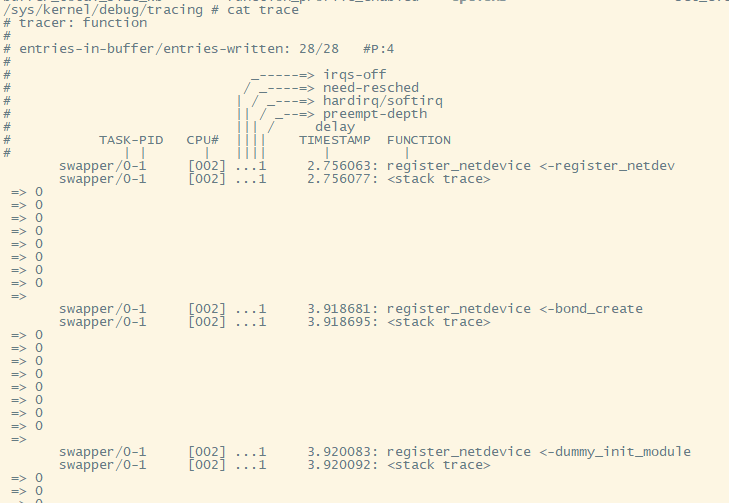  

# 分析
* perf probe和perf record可以正常显示调用栈, 所以MIPS支持调用栈解析应该是没问题的.
* perf probe用的是kprobe框架, 原理上和ftrace的function tracer有所不同.
  * kprobe是event触发的时候, 记录调用栈; 这个event就是`perf probe register_netdevice`注册的event
  * function tracer是mcount机制, 静态触发点.
* 所以可能是ftrace在记录调用栈过程中有什么问题.

## 代码调查
搜索`<stack trace>`  
有`trace_output.c:1017: trace_seq_puts(s, "<stack trace>\n");`  
它打印`struct stack_entry`里面的caller数组. caller数组就是调用栈. 打印0就是说记录的caller都是0.

那为什么记录的都是0呢? 代码在哪里记录的呢?

----
在`kernel/trace/`目录下搜索`stack_entry`, 很快就能找到, 在`__ftrace_trace_stack`函数里用到了. 这个函数又调用了`save_stack_trace`, 进而又调用了`save_stack_trace_tsk`

接下来, 想知道具体是什么路径调用到了`save_stack_trace_tsk`? 或者说`save_stack_trace_tsk`真的被调用到了吗?

尤其是后面一个问题, 看代码是很难看出来的.

## 使用调用栈分析调用栈问题
没错, 听起来像是说自己调查自己, 但这里具体是指使用perf probe和perf record的调用栈解析, 来分析ftrace的调用栈全0问题.

## 先试一下perf probe
```sh
perf probe save_stack_trace_tsk
perf probe register_netdevice
#开两个perf record, 分别在两个目录下
#这个是跟踪生成调用栈的过程
perf record -e probe:save_stack_trace_tsk -aR --call-graph dwarf -- sleep 60 &
#这个是触发生成调用栈
perf record -e probe:register_netdevice -aR -g --call-graph dwarf -- sleep 20 &
#多触发几次, 共5次
/isam/user/eoe_filter -n lo -t tap0 -E
... X5
```

----
```sh
# 结果
~ # [ perf record: Woken up 1 times to write data ]
[ perf record: Captured and wrote 0.144 MB perf.data (5 samples) ]

[2]+ Done perf record -e probe:register_netdevice -aR -g --call-graph dwarf -- sleep 20

# save_stack_trace_tsk没有采样到; 说明没有调用到
~ # [ perf record: Woken up 1 times to write data ]
[ perf record: Captured and wrote 0.148 MB perf.data ]

[1]+ Done perf record -e probe:save_stack_trace_tsk -aR --call-graph dwarf -- sleep 60
```
没有触发到`save_stack_trace_tsk`, 说明perf record方式记录调用栈, 没有用到`save_stack_trace_tsk`函数.

----
触发路径, 之前看过的.  
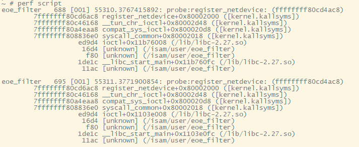  
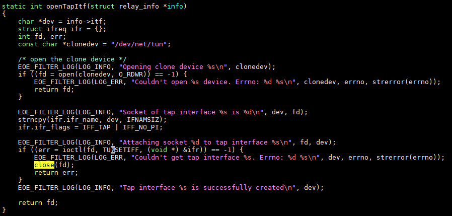  
这里的ioctl就是`TUNSETIFF`的系统调用, 最后会调`register_netdevice`


## 用perf probe来调试ftrace
```sh
#还是probe save_stack_trace_tsk
perf probe save_stack_trace_tsk

perf record -e probe:save_stack_trace_tsk -aR --call-graph dwarf -- sleep 60 &


#打开ftrace及func_stack_trace功能
cd /sys/kernel/debug/tracing

echo register_netdevice > set_ftrace_filter
echo function > current_tracer
echo 1 > options/func_stack_trace
echo 1 > tracing_on
```
结果: 似乎不准, 都还没有到register_netdevice, 就开始打调用栈了.  
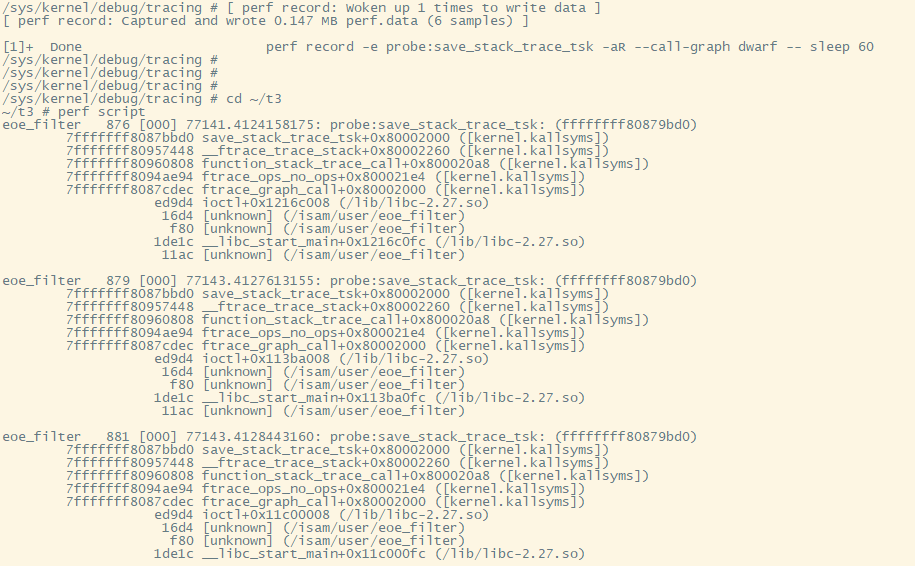  
注:  
下文会提到, 从`save_stack_trace_tsk`开始, 只能追溯5层调用栈到`ftrace_graph_call`.  
所以perf也只能记录5层, 再往下是用户态的栈了.


## 相关代码
从mcount里面开始调用  
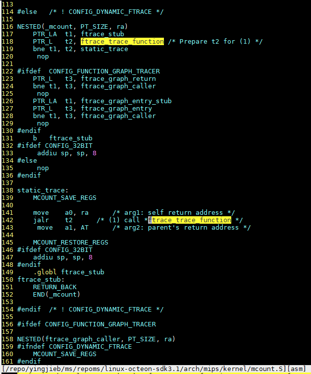  

然后到这里  
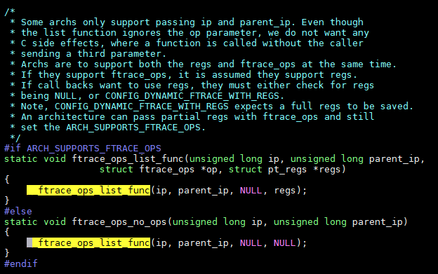  

遍历每个ftrace_op调用  
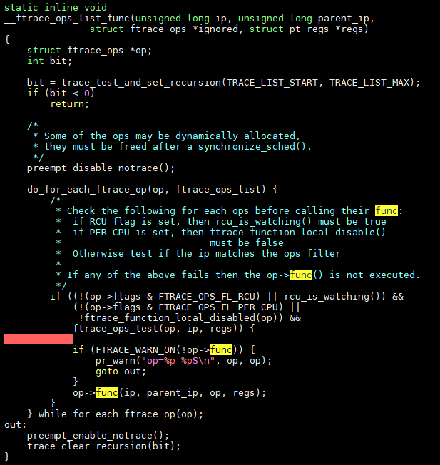  

这是function_stack_trace的调用  
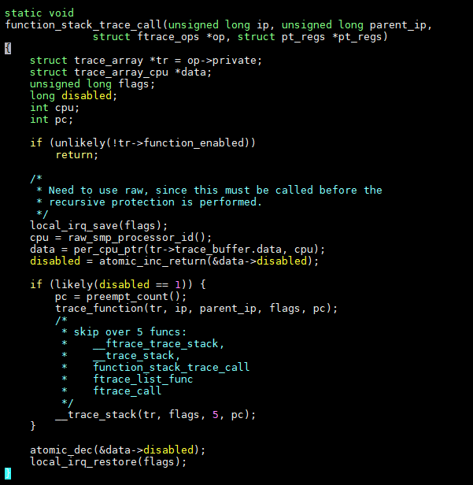  
__trace_stack调用下面的:  

这个地方和前面代码调查找到的`__ftrace_trace_stack`就对应起来了, 是同一个函数:  
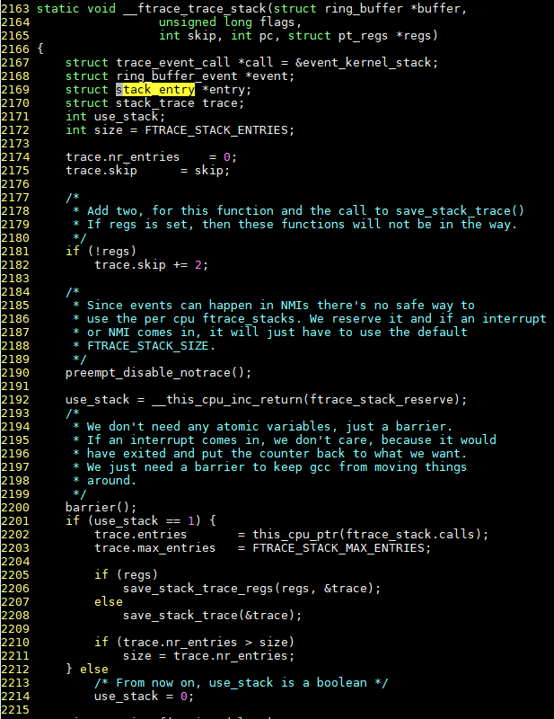  
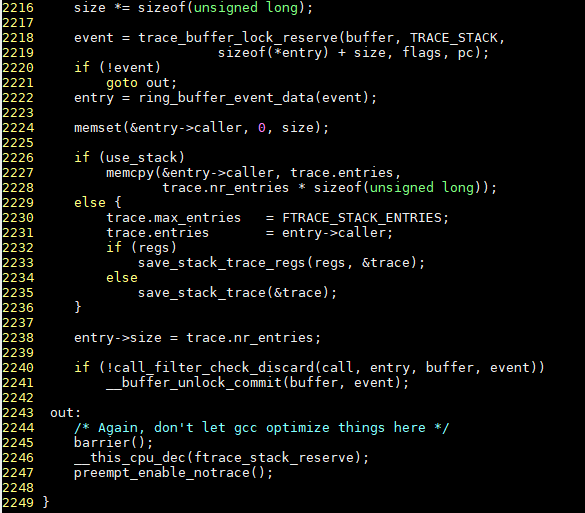  

这里面最后会调到这里  
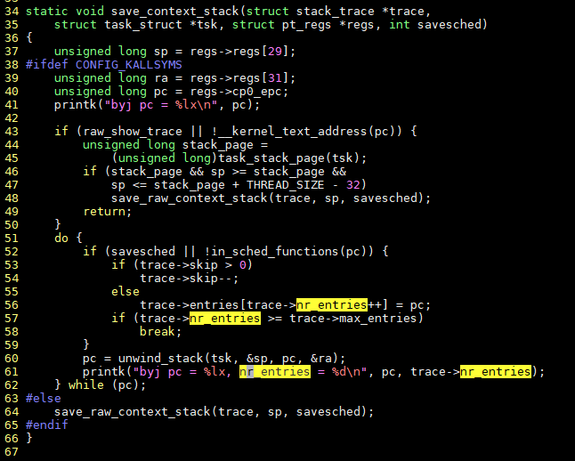  


## 打印调试
```sh
if [ ! -e /sys/kernel/debug/tracing ]; then mount -t debugfs none /sys/kernel/debug; fi 
cd /sys/kernel/debug/tracing 
echo register_netdevice > set_ftrace_filter
echo function > current_tracer
echo 1 > options/func_stack_trace
echo 1 > tracing_on
cat trace
/isam/user/eoe_filter -n lo -t tap0 -E
cat trace
```

加打印结果如下: 所有的调用栈都保存到nr_entries = 0里面了!  
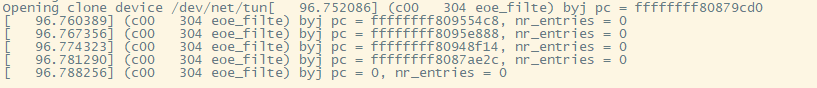  

再加打印, 原来是skip = 7, 导致7个函数都没有了!  
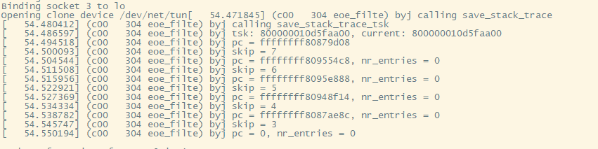  

把skip强制=0后, 只能打印5层调用栈.  
然后就是0了. 但我需要知道的就是0到底是哪个函数!  
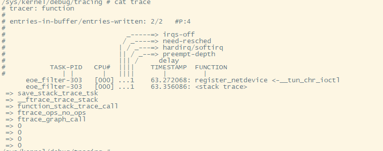  

最后终止在arch/mips/kernel/mcount.S里面了.  
下面肯定还有, 但都是0了? 可能是这个.s文件没有按要求保存栈指针?

# 不算结论
到这里暂时没有精力去调查mcount.S了, 调用栈终结于此...  
以后有机会深入搞MIPS再说吧.
