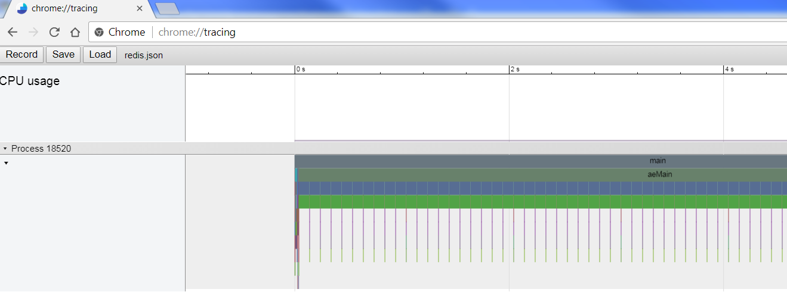
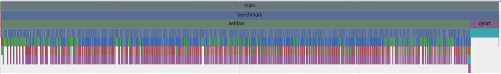
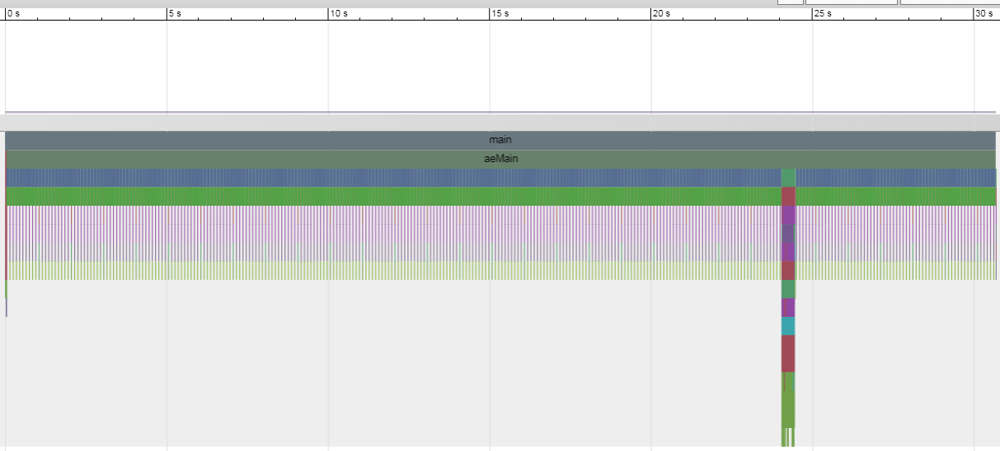
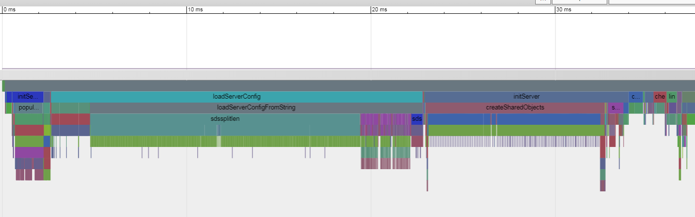
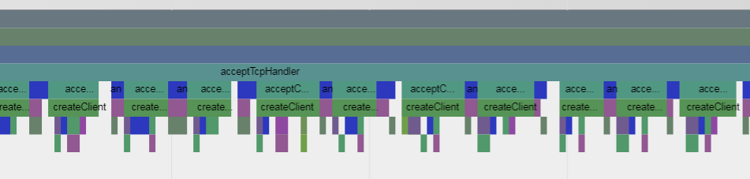
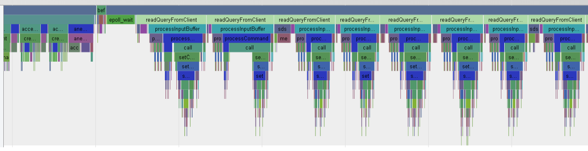
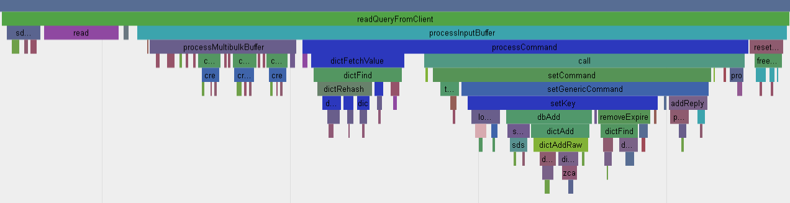
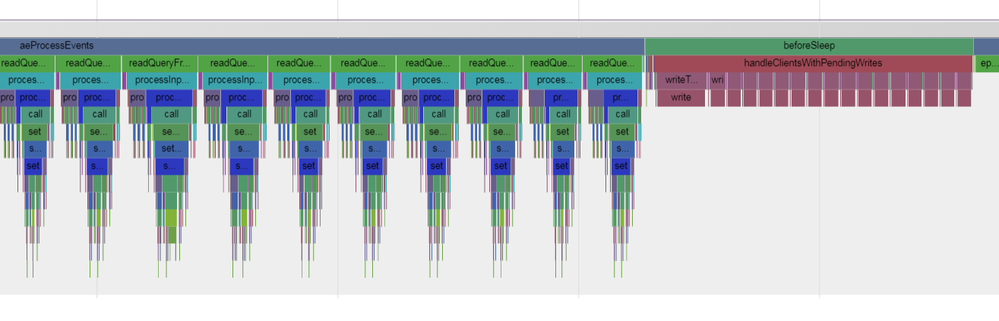
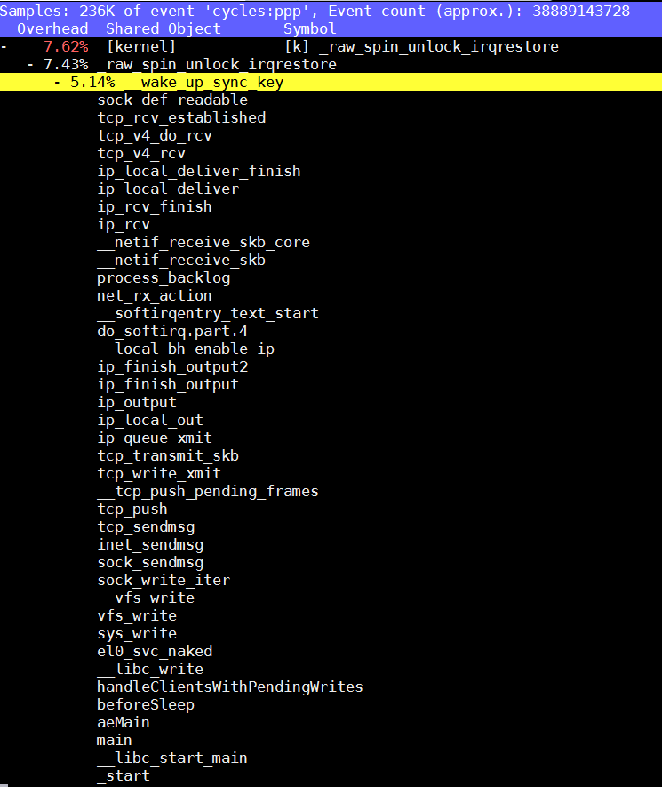
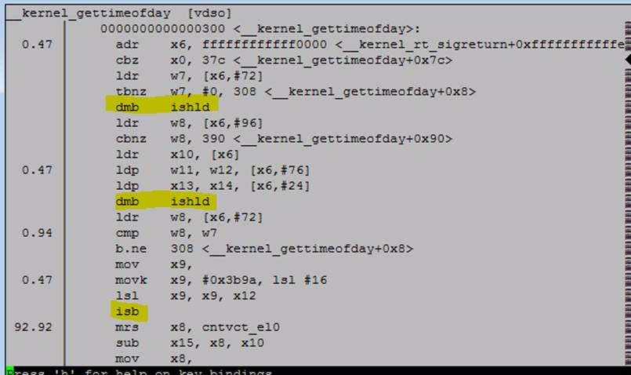

- [调试usb错误](#调试usb错误)
- [反向工程Anbox的abs命令](#反向工程anbox的abs命令)
  - [启动gdb](#启动gdb)
- [uftrace使用](#uftrace使用)
  - [编译安装](#编译安装)
  - [使用](#使用)
  - [和flamegraph配合生成svg](#和flamegraph配合生成svg)
  - [chrome tracing模式, "代码界的示波器"](#chrome-tracing模式-代码界的示波器)
  - [实例, 分析redis](#实例-分析redis)
    - [redis benchmark(客户端)部分](#redis-benchmark客户端部分)
    - [redis server部分](#redis-server部分)
- [调试程序卡住](#调试程序卡住)
  - [pstack](#pstack)
  - [proc](#proc)
- [perf](#perf)
  - [perf需要的内核配置](#perf需要的内核配置)
  - [perf top](#perf-top)
  - [`__kernel_gettimeofday`](#__kernel_gettimeofday)
  - [perf可以重复run一个程序, 并给出差异](#perf可以重复run一个程序-并给出差异)
  - [frontend stall, backend stall](#frontend-stall-backend-stall)
  - [perf -e](#perf--e)
  - [perf top里面的children是什么意思?](#perf-top里面的children是什么意思)
- [strace 跟踪多线程](#strace-跟踪多线程)


# 调试usb错误
```shell
echo -n 'module xhci_hcd =p' > /sys/kernel/debug/dynamic_debug/control
echo xhci-hcd >> /sys/kernel/debug/tracing/set_event
```

0) Reboot the machine in order to put it in a consistent state;
1) `echo "module xhci_hcd +flpt" > /sys/kernel/debug/dynamic_debug/control`
2) `echo nop > /sys/kernel/debug/tracing/current_tracer`
3) `echo 81920 > /sys/kernel/debug/tracing/buffer_size_kb`
4) `echo 0 > /sys/kernel/debug/tracing/trace`
5) `echo 1 > /sys/kernel/debug/tracing/tracing_on`
6) `echo 1 > /sys/kernel/debug/tracing/events/xhci-hcd/enable`


After reproduce the issue, you should collect `/sys/kernel/debug/tracing/trace`. Problem is that the file might be huge, much larger than the kernel log you provided for instance.

# 反向工程Anbox的abs命令
> Canonical 提供的Android container方案里面, 所有的命令都用二进制程序abs进行了封装, 包括setup, start, stop, 运行demo都在里面, 目的是对其内部操作和原理保密. 在此我们尝试对其反向工程, 目的是能够让我们有能力不依赖这个二进制程序, 能够手动运行cantainer的命令, 比如openarena的安装和demo的运行. 


初步分析这个abs程序是用go语言写的. 但我自己对go语言也从未接触, 下面的内容有错误在所难免.

需要准备:
* gdb, ubuntu自带
* 反向的过程也是调试的过程, 需要安装golang的基础环境 `apt install golang`
* 参考网上文章
https://golang.org/doc/gdb
http://web.cecs.pdx.edu/~jrb/cs201/lectures/handouts/gdbcomm.txt

## 启动gdb
`gdb abs`  
因为GDB对go支持不是太好, 需要加载一个extention才能看go內建的数据结构.  
下面这个runtime-gdb.py就是.  
`source /usr/share/go-1.6/src/runtime/runtime-gdb.py`

另外为了打印好看些, 我一般喜欢
`set print pretty on`  
我们需要了解abs的大概符号表的情况, 所以列出所有函数  
`info functions`  
可以找到main打头的函数如下, abs的结构很简单:
```c
void main(void);
void main.allocBinderNode(struct string);
void main.bootstrapBaseImage(void);
void main.cleanupAllContainers(void);
void main.cleanupAllContainers.func1(struct string, map[string]interface {});
void main.createContainer(struct string);
void main.ensureBinderNodes(void);
void main.ensureStateDirExists(void);
void main.ensureUserIsRoot(void);
void main.forEachLxdContainer(func(string, map[string]interface {}));
void main.init(void);
void main.lxcCmd(struct []string, struct []uint8, error);
void main.lxcCmdOrFail(struct []string);
void main.main(void);
void main.parallelize(struct []func());
void main.parallelize.func1(struct sync.WaitGroup *, func());
void main.removeContainer(struct string, map[string]interface {});
void main.removeDirAndItsContent(struct string, error);
void main.restartAnbox(struct string);
void main.runCleanup(void);
void main.runInParallel(func(string));
void main.runInParallel.func1(struct string, map[string]interface {});
void main.runInParallel.func1.1(void);
void main.runRestartAnbox(void);
void main.runSetup(void);
void main.runSetupDemo1(void);
void main.runStart(void);
void main.runStartDemo1(void);
void main.runStop(void);
void main.setupDemo1(struct string);
void main.startContainer(struct string);
void main.startDemo1(struct string);
void main.stopContainer(struct string);
void main.waitForAndroidToBoot(struct string);
```
我们重点关注`main.lxcCmd`, 用来发真正的命令给container, 用abs的stop命令试一下, 我们的基本判断是这个stop命令底层会向每个container实例发送`lxc stop`命令, 看看是不是:
```shell
(gdb) b main.lxcCmd
(gdb) r stop
(gdb) bt
#0  main.lxcCmd (args= []string = {...}, ~r1= []uint8, ~r2=...) at /tmp/tmp.E2wa2oqEu9/abs/abs.go:60
#1  0x00000000000c616c in main.forEachLxdContainer (run={void (struct string, map[string]interface {})} 0x4420071e18) at /tmp/tmp.E2wa2oqEu9/abs/abs.go:105
#2  0x00000000000c836c in main.runInParallel (action={void (struct string)} 0x4420071ee8) at /tmp/tmp.E2wa2oqEu9/abs/abs.go:360
#3  0x00000000000c8804 in main.runStop () at /tmp/tmp.E2wa2oqEu9/abs/abs.go:408
#4  0x00000000000c9838 in main.main () at /tmp/tmp.E2wa2oqEu9/abs/abs.go:504
(gdb) info args
args =  []string = {"list", "--format=json"}
~r1 =  []uint8
~r2 = {
  tab = 0x0,
  data = 0xbeafb <flag.(*FlagSet).Var+107>
}
```
可以看到首先会list出所有的container  
后面不断执行
```
c
bt
info args
```
可以看到完整的指令序列, 机器上只起了一个实例
```shell
"list", "--format=json"
"info", "abs-anbox-0"
"stop", "-f", "abs-anbox-0"
```
`./abs -num-containers=1 setup`的命令序列:
```shell
"list", "--format=json"
"delete", "-f", "abs-anbox-base"
"init", "anbox", "abs-anbox-base", "-s", "default", "-c", "security.nesting=true"
"config", "set", "abs-anbox-base", "raw.lxc", "lxc.cap.drop="
"config", "set", "abs-anbox-base", "user.anbox.platform", "null"
"config", "set", "abs-anbox-base", "user.anbox.gles_driver", "null"
"config", "device", "add", "abs-anbox-base", "ashmem", "unix-char", "path=/dev/ashmem", "mode=0666"
"config", "device", "add", "abs-anbox-base", "eth0", "nic", "nictype=bridged", "parent=lxdbr0", "name=eth0"
"config", "device", "add", "abs-anbox-base", "binder", "unix-char", "path=/dev/binder", "mode=0666"
"info", "abs-anbox-base"
"start", "abs-anbox-base"
"exec", "abs-anbox-base", "--", "pidof", "com.android.systemui"
"exec", "abs-anbox-base", "--", "adb", "install", "/userdata/openarena.apk"
"exec", "abs-anbox-base", "--", "adb", "shell", "pm", "grant", "ws.openarena.sdl", "android.permission.WRITE_EXTERNAL_STORAGE"
"exec", "abs-anbox-base", "--", "adb", "shell", "pm", "grant", "ws.openarena.sdl", "android.permission.READ_EXTERNAL_STORAGE"
"exec", "abs-anbox-base", "--", "adb", "shell", "pm", "grant", "ws.openarena.sdl", "android.permission.RECORD_AUDIO"
"exec", "abs-anbox-base", "--", "mkdir", "-p", "/var/lib/anbox/data/media/0/Android/data/"
"exec", "abs-anbox-base", "--", "tar", "xJf", "/userdata/openarena-data.tar.xz", "-C", "/var/lib/anbox/data/media/0/Android/data/"
"exec", "abs-anbox-base", "--", "chown", "-R", "1023:1023", "/var/lib/anbox/data/media/0/Android/data/ws.openarena.sdl"
"exec", "abs-anbox-base", "--", "adb", "shell", "mkdir", "-p", "/sdcard/Android/data/ws.openarena.sdl/files/.openarena/baseoa/demos/"
"exec", "abs-anbox-base", "--", "adb", "push", "/userdata/demo0002.dm_71", "/sdcard/Android/data/ws.openarena.sdl/files/.openarena/baseoa/demos/demo0002.dm_71"
"exec", "abs-anbox-base", "--", "adb", "shell", "am", "force-stop", "ws.openarena.sdl"
"exec", "abs-anbox-base", "--", "adb", "shell", "am", "start", "ws.openarena.sdl/.MainActivity"
"info", "abs-anbox-base"
"stop", "-f", "abs-anbox-base"
"config", "device", "remove", "abs-anbox-base", "binder"
"info", "abs-anbox-base"
"copy", "--container-only", "abs-anbox-base", "abs-anbox-0"
"config", "device", "add", "abs-anbox-0", "binder", "unix-char", "source=/dev/binder1", "path=/dev/binder", "mode=0666"
```
`./abs start`的命令序列:
```shell
"list", "--format=json"
"start", "abs-anbox-0"
"exec", "abs-anbox-0", "--", "pidof", "com.android.systemui"
```
`./abs start-demo1`指令序列:
```shell
"list", "--format=json"
"exec", "abs-anbox-0", "--", "adb", "shell", "am", "force-stop", "ws.openarena.sdl"
"exec", "abs-anbox-0", "--", "adb", "shell", "am", "start", "ws.openarena.sdl/.MainActivity"
```

# uftrace使用
uftrace能够按时间线记录每个函数执行时间  
https://github.com/namhyung/uftrace/wiki/Tutorial

## 编译安装
`git clone https://github.com/namhyung/uftrace.git`

在64K pagesize的系统上, 需要改下代码, 否则会有mprotect错误
```diff
diff --git a/libmcount/plthook.c b/libmcount/plthook.c
index eb3c541..f88244c 100644
--- a/libmcount/plthook.c
+++ b/libmcount/plthook.c
@@ -26,7 +26,7 @@ static bool *plthook_dynsym_resolved;
 static unsigned long got_addr;
 static volatile bool segv_handled;
-#define PAGE_SIZE  4096
+#define PAGE_SIZE getpagesize()
 #define PAGE_ADDR(addr)  ((void *)((addr) & ~(PAGE_SIZE - 1)))
 static void segv_handler(int sig, siginfo_t *si, void *ctx)
```
如果需要看kernel的, 需要root运行, 带-k, 并且要求kernel有CONFIG_FUNCTION_GRAPH_TRACER=y
```
make
sudo make install
```

## 使用
被调试的程序需要用-pg选项来编译, 更多信息可搜索`mcount`
```shell
-pg
Generate extra code to write profile information suitable for the analysis program gprof. You must use this option when compiling the source files you want data about, and you must also use it when linking. 
```
Makefile加-pg之后, 就可以调试了:
```shell
sudo /usr/local/bin/uftrace -F main record src/redis-server redis.conf
按时间线replay
sudo /usr/local/bin/uftrace replay
replay, 显示时间线
sudo /usr/local/bin/uftrace replay -f elapsed,duration,tid
sudo /usr/local/bin/uftrace replay -t 5us
按占用时间report
sudo /usr/local/bin/uftrace report
显示调用关系
sudo /usr/local/bin/uftrace graph
```
* 和perf基于采样的模型相比, 这个是完整时间线的, 所有的带-pg编译的函数都记录在案. 可以说uftrace更宏观.
* 每个函数都会被记录, 比如一个for循环里面调用memcpy函数, 时间是累加的.

## 和flamegraph配合生成svg
```shell
sudo /usr/local/bin/uftrace dump --flame-graph | ~/yingjieb/git/FlameGraph/flamegraph.pl > redis.svg
```

## chrome tracing模式, "代码界的示波器"
```shell
sudo /usr/local/bin/uftrace dump --chrome > redis.json
```
用chrome:tracing模式打开这个json文件  
  
* ALT+鼠标滚轮, zoom in and out
* w s 放大缩小, a d 左右
* 左上角问号是help

## 实例, 分析redis
起redis server, 然后用redis benchmark来做客户端压力测试
```shell
sudo /usr/local/bin/uftrace -d redis-server.data record src/redis-server redis.conf
sudo /usr/local/bin/uftrace -d redis-benchmark.data record src/redis-benchmark -t set -n 10000 -r 100000000
```
```shell
sudo /usr/local/bin/uftrace dump --chrome -d redis-benchmark.data > redis-benchmark.json
sudo /usr/local/bin/uftrace dump --chrome -d redis-server.data > redis-server.json
只关注23秒到25秒
sudo /usr/local/bin/uftrace dump --chrome -d redis-server.data -r 23s~25s > redis-server-2s.json
```

### redis benchmark(客户端)部分
用chrome打开这两个json文件, 先来看redis benchmark: 整体分为三部分: 
* 先建立50个到server的连接, 并加入epoll 
* epoll_wait来等待事件, random来生成key, value默认用xxx, 先50个write, 等50个read, 刚开始是很整齐的. 这说明这是个同步的过程, 50个client, 每个client都是发送request, 等待server回复, 再发下一个request. 到后期因为server端调度的关系, 这50个client的读写混在一起了, 但对每个client来说, 还是同步的.  
> Clients and Servers are connected via a networking link. Such a link can be very fast (a loopback interface) or very slow (a connection established over the Internet with many hops between the two hosts). Whatever the network latency is, there is a time for the packets to travel from the client to the server, and back from the server to the client to carry the reply.
This time is called RTT (Round Trip Time). It is very easy to see how this can affect the performances when a client needs to perform many requests in a row (for instance adding many elements to the same list, or populating a database with many keys). For instance if the RTT time is 250 milliseconds (in the case of a very slow link over the Internet), even if the server is able to process 100k requests per second, we'll be able to process at max four requests per second.
* 所以这里就要说一下pipeline, redis支持pipeline, 比如-P 16, 是说一次网络来回里面, 执行16个command, 这比默认的一个来回一个command要高效的多, 除了节省网络来回的时间, 还节省了socket的read write开销, 通常这些开销包括用户态和内核态的切换开销.
* 每个处理都用gettimeofday来打时间戳
* 都处理完毕, close这些连接, 并按latency排序

  

### redis server部分
从宏观上看, server在24秒的时候开始真正干活  
  
* 前面是初始化, 然后epoll等待, 直到client发出10000个set请求
* 初始化内容包括解析命令行, server配置, lua脚本引擎, 共享对象, 起块存储bio线程(三个), 监听服务端口, 从磁盘加载数据等等,
* 初始化里面有很多zmalloc/zrealloc调用, 其中有一些竟然有pthread_mutex_lock, 而其他没有  
  
* 在aeProcessEvents里面处理事件, 先accept TCP的连接, 应该是50个(对应client起50个并发)  
  
`sudo /usr/local/bin/uftrace replay -f elapsed,duration,tid -d redis-server.data -F acceptTcpHandler`  
tcpnodelay keepalive setsockopt aeCreateFileEvent zmalloc listcreate dictcreate
* readQueryFromClient一共调用了10050次, 应该是处理每个client的set请求的核心函数, 而每个epoll_wait后, 一般情况下, 都处理50个Query, 和client的并发数一致. 但偶尔有例外.
  
* 每个Query都先从socket read, gettimeofday, malloc内存, 创建string对象, 字符串操作, lookup, hash, dbAdd, 移除过期的, 准备个client的reply到链表
  
* 这次的50个set请求全部处理完毕后, reply记录到一个链表里面, 然后马上发送回client    
  
* 最后把这50个连接close掉

# 调试程序卡住
## pstack
当一个程序卡住不动, 用pstack来看他当前的调用栈
比如:
```shell
$ pstack 33451
#0  0x0000ffff8a694f34 in __accept_nocancel () from /lib64/libc.so.6
#1  0x0000000000401d94 in tcp_accept ()
#2  0x0000000000401a1c in server_main ()
#3  0x0000000000401adc in main ()
```
其实pstack只是个脚本, 它用的是gdb, 就是下面的效果
```shell
/usr/bin/gdb --quiet -nx /proc/33451/exe 33451
在gdb里执行
bt
```
`gdb prog progID`和`gdb -p progID`是一样的

没有pstack用下面命令也行:
`gdb -batch -ex bt -p 1234`

## proc
`/proc/PID/stack`里面有kenel的栈
```shell
$ cat /proc/33451/stack
[<ffff000008086020>] __switch_to+0x6c/0x78
[<ffff000008770358>] inet_csk_accept+0x24c/0x2b0
[<ffff0000087a2788>] inet_accept+0x50/0x168
[<ffff0000086fbc8c>] SyS_accept4+0xf4/0x1e8
[<ffff0000086fbdb4>] SyS_accept+0x34/0x40
[<ffff0000080835f0>] el0_svc_naked+0x24/0x28
[<ffffffffffffffff>] 0xffffffffffffffff
```

# perf
perf默认是per-thread mode, 在这个thread运行时计数, 不运行时不计数. 加-a表示统计整个系统

cycle是CPU运行时的cycle, 不计idle  
用-p attach 一个进程, 默认统计这个进程的所有线程和子进程  
用-t attach一个线程  
perf report -k 指定vmlinux, 用来解析内核  
perf top -C 指定core, "Z"键刷新  
perf record -c 1000, 是指这个event每1000次记录一次, 因为全记录开销大.

## perf需要的内核配置
> For kernel analysis, I'm using CONFIG_KPROBES=y and CONFIG_KPROBE_EVENTS=y, to enable kernel dynamic tracing, and CONFIG_FRAME_POINTER=y, for frame pointer-based kernel stacks. For user-level analysis, CONFIG_UPROBES=y and CONFIG_UPROBE_EVENTS=y, for user-level dynamic tracing.

## perf top
perf top -g可以带调用栈, 但默认是按children累加模式排序, 用下面的命令可以按self排序  
我一般习惯是加`--no-children`
```shell
sudo perf top -g --no-children
sudo perf top -g --no-children -p `pidof redis-server`
```
  

## `__kernel_gettimeofday`
> So `__kernel_gettimeofday` being called by AW is actually the VDSO code for ARM64. If we look at that function, we see 3 potentially ugly ops (2 DMBs and an ISB). The profile hit data suggest that the ISB is hurting us the most (we sampled at the mrs 92% of the time but it’s most likely the ISB that is the gate). I’m not sure if any of this code can be cleaned up:  
  
> We started to look at this test and before getting to deep into the analysis, we looked at the profiles of the x86 2699v4 system (on the left side of the screen capture below) and Amberwing (on the right)  
What caught our attention was X86’s use of the __vdso_gettimeofday function. I’m hoping some of the kernel experts on copy can shed light on whether we support VDSO (Virtual Dynamic Shared Object) on AW. My understanding is that this is a far more efficient way of system calling some commonly used kernel system call function like gettimeofday. I found the following link on the web which helps explain VDSO:  
http://www.linuxjournal.com/content/  creating-vdso-colonels-other-chicken  
The link talks about use of glibc but I’m more interested in the hacking of the kernel approach which appears to be the method used by x86. IN short: a program can make a syscall and not have to endure the overhead of the memory-hopping between user and kernel segments that a traditional syscall would require. Do we have such support? If not, is this something we should be providing.

## perf可以重复run一个程序, 并给出差异
注意下面, -a表示统计整个系统, 不加默认的是统计后面command
```shell
$ sudo perf stat -r 5 -a sleep 1
Performance counter stats for 'system wide' (5 runs):
      48055.429090      cpu-clock (msec)          #   47.417 CPUs utilized            ( +-  0.01% )
               364      context-switches          #    0.008 K/sec                    ( +-  7.83% )
                 7      cpu-migrations            #    0.000 K/sec                    ( +- 16.08% )
                26      page-faults               #    0.001 K/sec                    ( +-  8.77% )
       137,412,037      cycles                    #    0.003 GHz                      ( +- 10.30% )
        57,080,600      instructions              #    0.42  insn per cycle           ( +- 22.67% )
                 3      branches                  #    0.000 K/sec                    ( +- 44.72% )
           398,150      branch-misses             # 13271653.33% of all branches      ( +- 13.29% )
       1.013468517 seconds time elapsed                                          ( +-  0.08% )
```
```shell
$ sudo perf stat -r 5 sleep 1
 Performance counter stats for 'sleep 1' (5 runs):
          0.605980      task-clock (msec)         #    0.001 CPUs utilized            ( +-  2.47% )
                 1      context-switches          #    0.002 M/sec
                 0      cpu-migrations            #    0.000 K/sec
                54      page-faults               #    0.089 M/sec                    ( +-  1.08% )
         1,502,877      cycles                    #    2.480 GHz                      ( +-  2.48% )
           757,929      instructions              #    0.50  insn per cycle           ( +-  2.06% )
                 0      branches                  #    0.000 K/sec
            15,060      branch-misses             #    0.00% of all branches          ( +-  1.94% )
       1.001679779 seconds time elapsed                                          ( +-  0.04% )
```

## frontend stall, backend stall
frontend stall and backend stall performance counters.  
这个信息在kernel4.6上, 用perf stat能看出来.
* frontend stall说的是分支预测方面的指标, 提示了icache的问题
* backend stall说的是data cache方面的指标, 提示数据miss之类的.

## perf -e
`perf stat -e instructions -p xxx -r37`  
见手册`21.6 DAB PMU Enumerations`

## perf top里面的children是什么意思?
self是本函数执行的时间, 不包括本函数调用的子函数.  
children 是本函数时间加上所有的子函数时间, 就是说, 由这个函数调用开去的所有时间都算上.
```c
Let me show you an example:
  $ cat abc.c
  #define barrier() asm volatile("" ::: "memory")
  void a(void)
  {
    int i;
    for (i = 0; i < 1000000; i++)
        barrier();
  }
  void b(void)
  {
    a();
  }
  void c(void)
  {
    b();
  }
  int main(void)
  {
    c();
    return 0;
  }
With this simple program I ran perf record and report:
  $ perf record -g -e cycles:u ./abc
Case 1.
  $ perf report --stdio --no-call-graph --no-children
  # Overhead Command Shared Object Symbol
  # ........ ....... ................. ..............
  #
      91.50% abc abc [.] a         
       8.18% abc ld-2.17.so [.] strlen    
       0.31% abc [kernel.kallsyms] [k] page_fault
       0.01% abc ld-2.17.so [.] _start    
Case 2. (current default behavior)
  $ perf report --stdio --call-graph --no-children
  # Overhead Command Shared Object Symbol
  # ........ ....... ................. ..............
  #
      91.50% abc abc [.] a         
                  |
                  --- a
                      b
                      c
                      main
                      __libc_start_main
       8.18% abc ld-2.17.so [.] strlen    
                  |
                  --- strlen
                      _dl_sysdep_start
       0.31% abc [kernel.kallsyms] [k] page_fault
                  |
                  --- page_fault
                      _start
       0.01% abc ld-2.17.so [.] _start    
                  |
                  --- _start
Case 3.
  $ perf report --no-call-graph --children --stdio
  # Self Children Command Shared Object Symbol
  # ........ ........ ....... ................. .....................
  #
       0.00% 91.50% abc libc-2.17.so [.] __libc_start_main
       0.00% 91.50% abc abc [.] main             
       0.00% 91.50% abc abc [.] c                
       0.00% 91.50% abc abc [.] b                
      91.50% 91.50% abc abc [.] a                
       0.00% 8.18% abc ld-2.17.so [.] _dl_sysdep_start 
       8.18% 8.18% abc ld-2.17.so [.] strlen           
       0.01% 0.33% abc ld-2.17.so [.] _start           
       0.31% 0.31% abc [kernel.kallsyms] [k] page_fault       
As you can see __libc_start_main -> main -> c -> b -> a callchain show
up in the output.
Finally, it looks like below with both option enabled:
```

# strace 跟踪多线程
```
strace -f
```
strace可以跟踪perl脚本，使用方法是直接strace xxx.perl