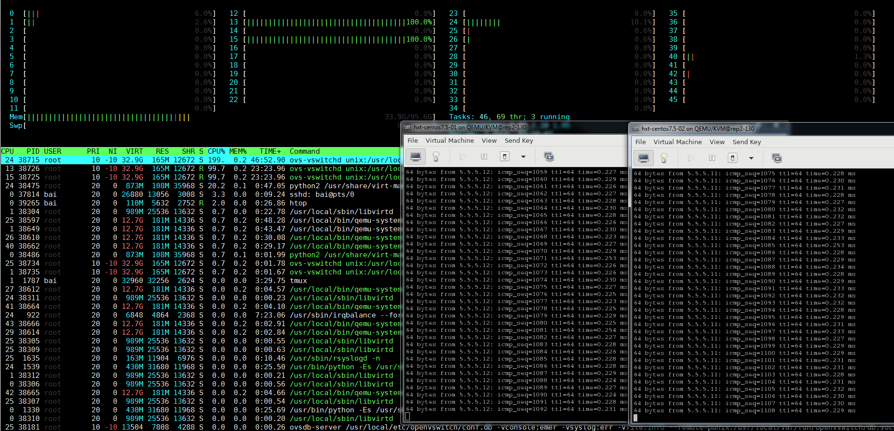
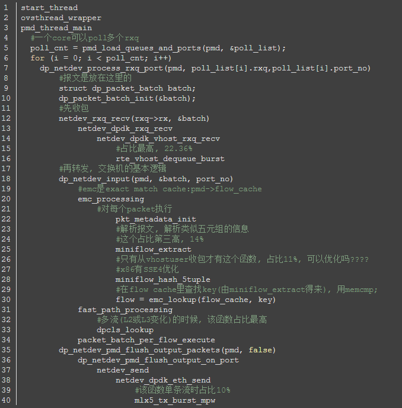
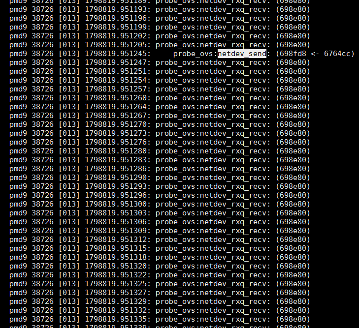
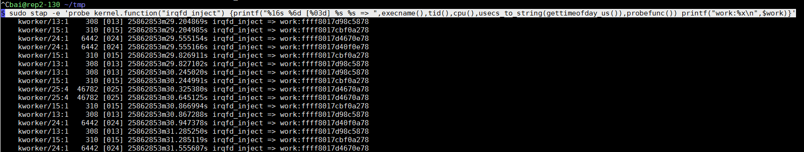
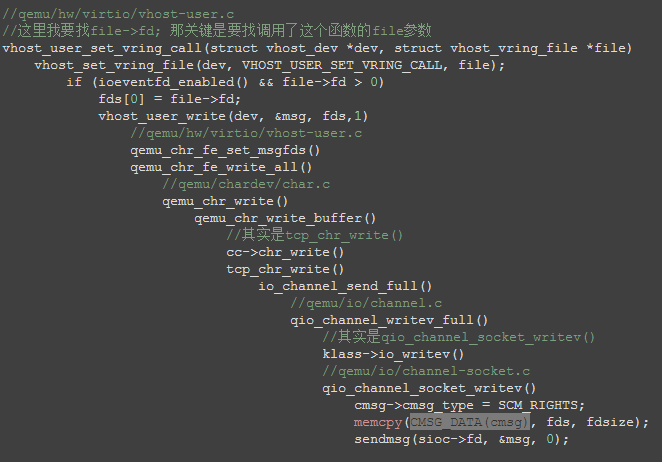
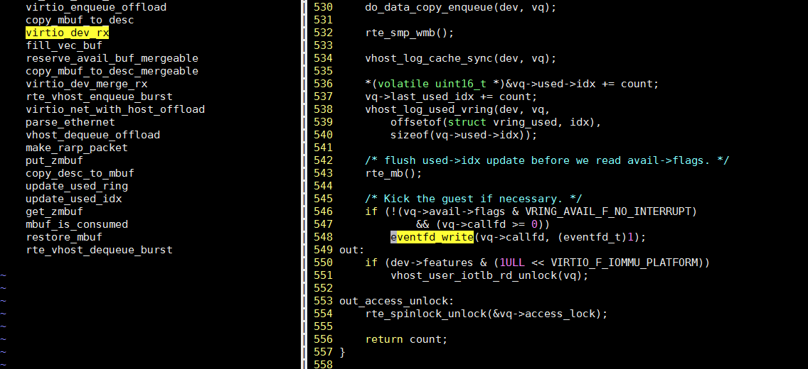
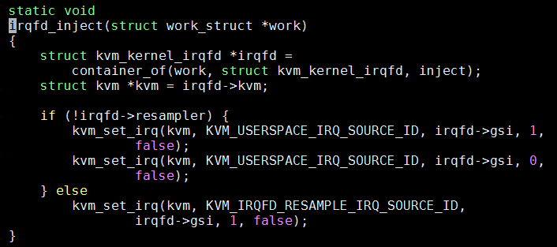
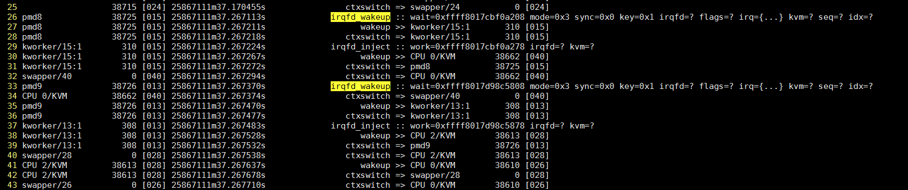
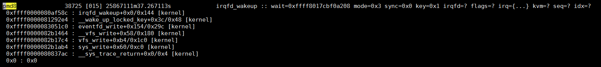
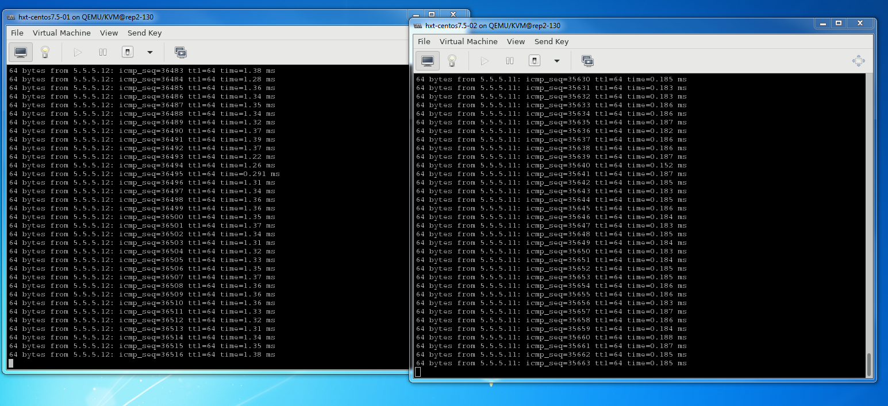

- [查看PCI的MSI中断](#查看pci的msi中断)
- [一次中断执行记录和KVM虚拟机相关的trace](#一次中断执行记录和kvm虚拟机相关的trace)
  - [中断发生在core 42上](#中断发生在core-42上)
  - [core 42的正常流程](#core-42的正常流程)
- [2个VM互相ping场景下的延迟分析](#2个vm互相ping场景下的延迟分析)
  - [OVS路径延迟](#ovs路径延迟)
    - [perf查看OVS转发路径执行时间](#perf查看ovs转发路径执行时间)
    - [OVS转发延时数据](#ovs转发延时数据)
  - [kernel路径延迟](#kernel路径延迟)
    - [eventfd和irqfd中断注入流程](#eventfd和irqfd中断注入流程)
    - [kernel延迟数据](#kernel延迟数据)
  - [延迟图解](#延迟图解)
  - [问题复现](#问题复现)
    - [抓ovs转发延迟 -- 没有发现](#抓ovs转发延迟----没有发现)

# 查看PCI的MSI中断
`/proc/interrupts`里能显示中断的信息, 但不能很方便的对应到是哪个设备的中断.

比如在我的VM里, 有:
```sh
$ cat /proc/interrupts
           CPU0       CPU1       CPU2       CPU3
  2:    1020348     924296     763104     823621     GICv3  27 Level     arch_timer
  4:        116          0          0          0     GICv3  33 Level     uart-pl011
 42:          0          0          0          0     GICv3  23 Level     arm-pmu
 43:          0          0          0          0     pl061   3 Edge      ACPI:Event
 44:          1          0          0          0   ITS-MSI 16384 Edge      aerdrv, PCIe PME, pciehp
 45:          1          0          0          0   ITS-MSI 18432 Edge      aerdrv, PCIe PME, pciehp
 46:          1          0          0          0   ITS-MSI 20480 Edge      aerdrv, PCIe PME, pciehp
 47:          1          0          0          0   ITS-MSI 22528 Edge      aerdrv, PCIe PME, pciehp
 48:          1          0          0          0   ITS-MSI 24576 Edge      aerdrv, PCIe PME, pciehp
 49:          0          0          0          0   ITS-MSI 1572864 Edge      virtio1-config
 50:          0          0          0          0   ITS-MSI 1572865 Edge      virtio1-control
 51:          0          0          0          0   ITS-MSI 1572866 Edge      virtio1-event
 52:      95112          0          0          0   ITS-MSI 1572867 Edge      virtio1-request
 53:          0          0          0          0   ITS-MSI 524288 Edge      virtio0-config
 54:          0      29863      59165          0   ITS-MSI 524289 Edge      virtio0-input.0
 55:          0          0          0          1   ITS-MSI 524290 Edge      virtio0-output.0
 56:          2          0          0          0   ITS-MSI 2097152 Edge      virtio2-config
 57:     186776          0          0          0   ITS-MSI 2097153 Edge      virtio2-input.0
 58:          0          1          0          0   ITS-MSI 2097154 Edge      virtio2-output.0
 59:          0          0          0          0   ITS-MSI 1048576 Edge      xhci_hcd
 60:          0          0          0          0   ITS-MSI 1048577 Edge      xhci_hcd
 61:          0          0          0          0   ITS-MSI 1048578 Edge      xhci_hcd
 62:          0          0          0          0   ITS-MSI 1048579 Edge      xhci_hcd
 63:          0          0          0          0   ITS-MSI 1048580 Edge      xhci_hcd
IPI0:     35739      68329      56984      48197       Rescheduling interrupts
IPI1:         5          4          3          3       Function call interrupts
IPI2:         0          0          0          0       CPU stop interrupts
IPI3:         0          0          0          0       CPU stop (for crash dump) interrupts
IPI4:         0          0          0          0       Timer broadcast interrupts
IPI5:         2          0          0          0       IRQ work interrupts
IPI6:         0          0          0          0       CPU wake-up interrupts
```

有几个中断想知道对应的设备是什么
1. 查pci, 我这里想找eth1
```bash
$ lspci
01:00.0 Ethernet controller: Red Hat, Inc Virtio network device (rev 01)
03:00.0 SCSI storage controller: Red Hat, Inc Virtio SCSI (rev 01)
04:00.0 Ethernet controller: Red Hat, Inc Virtio network device (rev 01)
```
2. 看看eth1的pci
```bash
$ ethtool -i eth1
bus-info: 0000:04:00.0
```
3. 到/sys/bus下找pci号
```bash
bai@localhost /sys/bus/pci/devices/0000:04:00.0
```
4. 找到对应的中断号
```bash
$ ls msi_irqs/
56  57  58
```
5. 可以修改一下中断route到哪个CPU, 比如下面把处理中断的CPU从0改为1
```bash
bai@localhost /proc/irq/57
$ cat effective_affinity
1
bai@localhost /proc/irq/57
$ cat smp_affinity_list
0
[root@localhost 57]# echo 1 > smp_affinity_list
[root@localhost 57]# cat smp_affinity_list
1
[root@localhost 57]# cat smp_affinity
2
```

# 一次中断执行记录和KVM虚拟机相关的trace
用ftrace的function_graph抓到的一次中断过程.
```bash
#系统通过isolcpus=2-23,26-47 只保留4个核给系统(centos 7.5)使用.
HOST: 0 1 24 25
#OVS的pmd进程跑在四个核上
OVS: 12 13 14 15
#两个VM分别pin了4个CPU
VM1: 26 27 28 29
VM2: 40 41 42 43
```

## 中断发生在core 42上
```c
gic_handle_irq()
  __handle_domain_irq() // 44 us
    irq_enter()
      rcu_irq_enter()
      tick_irq_enter()
      _local_bh_enable()
    irq_find_mapping()
    generic_handle_irq()
      handle_percpu_devid_irq()
        arch_timer_handler_phys()
          hrtimer_interrupt()
        gic_eoimode1_eoi_irq()
    irq_exit()
      idle_cpu()
      tick_nohz_irq_exit()
      rcu_irq_exit()
  __handle_domain_irq() // 120 us
    irq_enter()
    irq_find_mapping()
    generic_handle_irq()
      handle_percpu_devid_irq()
        arch_timer_handler_phys()
          hrtimer_interrupt()
            __hrtimer_run_queues()
              __remove_hrtimer()
              kvm_timer_expire()
                kvm_timer_earliest_exp()
                queue_work_on()
                  __queue_work()
                    get_work_pool()
                    insert_work()
                      wake_up_worker()
                        wake_up_process()
                          try_to_wake_up()
                            update_rq_clock()
                            ttwu_do_activate()
                              activate_task()
                                enqueue_task_fair()
                                  enqueue_entity()
                                    update_curr()
                                    update_cfs_shares()
                                    account_entity_enqueue()
                                    __enqueue_entity()
                              wq_worker_waking_up()
                              ttwu_do_wakeup()
            __hrtimer_get_next_event()
            tick_program_event()
              clockevents_program_event()
        gic_eoimode1_eoi_irq()
    irq_exit()
      idle_cpu()
      tick_nohz_irq_exit()
      rcu_irq_exit()
//中断处理结束      
```

## core 42的正常流程
```c
cpu_pm_exit()
  cpu_pm_notify()
    rcu_irq_enter_irqson()
    __atomic_notifier_call_chain()
      notifier_call_chain()
        gic_cpu_pm_notifier()
        arch_timer_cpu_pm_notify()
        fpsimd_cpu_pm_notifier()
        cpu_pm_pmu_notify()
        hyp_init_cpu_pm_notifier()
          cpu_hyp_reinit()
          kvm_get_idmap_vector()
          kvm_mmu_get_httbr()
          kvm_arm_init_debug()
          kvm_vgic_init_cpu_hardware()
    rcu_irq_exit_irqson()      
      rcu_irq_exit()
sched_idle_set_state()
cpuidle_reflect()
rcu_idle_exit()
arch_cpu_idle_exit()
tick_nohz_idle_exit()
  ktime_get()
    arch_counter_read()
  tick_nohz_restart_sched_tick()
  account_idle_ticks()
sched_ttwu_pending()
schedule_idle() //切换到kworker-332前的准备
  rcu_note_context_switch()
  update_rq_clock()
  pick_next_task_fair()
    put_prev_task_idle()
    pick_next_entity()
    set_next_entity()
  fpsimd_thread_switch()
  hw_breakpoint_thread_switch()
  uao_thread_switch()
  qqos_sched_in()
  
<idle>-0    =>  kworker-332 //idle进程已经切换到kworker

finish_task_switch()
_raw_spin_lock_irq()
process_one_work() //kworker代码 -- 84 us
  find_worker_executing_work()
  set_work_pool_and_clear_pending()
  kvm_timer_inject_irq_work()
    kvm_vcpu_wake_up()
      swake_up()
        swake_up_locked()
          wake_up_process()
            try_to_wake_up()
  _cond_resched()
  rcu_all_qs()
  pwq_dec_nr_in_flight()
worker_enter_idle()
schedule()
  rcu_note_context_switch()
  update_rq_clock()
  deactivate_task()
    dequeue_task_fair()
      dequeue_entity()    
      hrtick_update()
  wq_worker_sleeping()
  pick_next_task_fair()
    check_cfs_rq_runtime()
    pick_next_entity()
    set_next_entity()
  fpsimd_thread_switch()
  hw_breakpoint_thread_switch()
  uao_thread_switch()
  qqos_sched_in()
  
kworker-332   =>  CPU 2/K-6915 //kworker已经切换到CPU 2/K, 后者是qemu的VCPU进程

finish_task_switch()
  kvm_sched_in()
    kvm_arch_vcpu_load()
      kvm_vgic_load()
prepare_to_swait()
kvm_vcpu_check_block()
  kvm_arch_vcpu_runnable()
  kvm_cpu_has_pending_timer()
finish_swait()  
ktime_get()
kvm_arch_vcpu_unblocking() //-- 11 us
  kvm_timer_unschedule()

//从这里开始的几个顶级函数, 是在kvm_arch_vcpu_ioctl_run()里调用的, 后者是用户态通过VCPU_RUN ioctl调用的, 它在一个循环里执行VM的代码直到时间片结束.
_cond_resched()
kvm_pmu_flush_hwstate()
  kvm_pmu_update_state()
kvm_timer_flush_hwstate() //20 us
  kvm_timer_update_state()
    kvm_timer_should_fire.part.9()
    kvm_timer_update_irq.isra.5()
      kvm_vgic_inject_irq()
        vgic_lazy_init()
        vgic_get_irq()
        vgic_queue_irq_unlock()
          vgic_target_oracle()
          kvm_vcpu_kick() //奇怪的是函数里的if (kvm_vcpu_wake_up(vcpu))为什么没出现?
  irq_set_irqchip_state()        
kvm_vgic_flush_hwstate()  
kvm_timer_should_notify_user()
kvm_pmu_should_notify_user()
kvm_pmu_sync_hwstate()
kvm_timer_sync_hwstate()
kvm_vgic_sync_hwstate()
kvm_arm_setup_debug()
//trace_kvm_entry(*vcpu_pc(vcpu)); 我自己看代码加的, 进入VM
//guest_enter_irqoff()
//对rcu来说, 执行guest代码和切换到user代码差不多
rcu_note_context_switch()
kvm_arm_clear_debug()
handle_exit()
  kvm_handle_wfx()
    kvm_vcpu_block()
      ktime_get()
      kvm_arch_vcpu_blocking()
      prepare_to_swait()
      kvm_vcpu_check_block()
      schedule() //调度到idle进程

CPU 2/K-6915  =>    <idle>-0 //切换回idle

finish_task_switch() //接着执行第40行idle进程未完成的schedule_idle(), 时间过去了467 us, idle被换出了467 us
do_idle()
  quiet_vmstat()
  tick_nohz_idle_enter()
    set_cpu_sd_state_idle()
    __tick_nohz_idle_enter()
  arch_cpu_idle_enter()
  tick_check_broadcast_expired()
  cpuidle_get_cpu_driver()
  rcu_idle_enter()
  cpuidle_not_available()
  cpuidle_select()
  call_cpuidle()
    cpuidle_enter()
      cpuidle_enter_state()
        sched_idle_set_state()
        acpi_idle_lpi_enter()
            cpu_pm_enter()
            psci_cpu_suspend_enter()
              psci_cpu_suspend()
                __invoke_psci_fn_smc() //陷入到EL3
//@ 585311.6 us idle了585ms

//从此开始新的一轮
cpu_pm_exit() 
```

# 2个VM互相ping场景下的延迟分析
场景是两个VM使用virtio-net的kernel驱动, 其后端是OVS的vhostuserclient PMD, pmd进程运行在13 15号cpu上.

  

正常情况下, 两个VM的ping延迟在0.18ms, 但偶尔能看到超过1ms的情况, 延迟大了10倍.

下文分析VM ping的路径延迟分布, 把总的延迟分解为可以量化的分阶段的延迟, 借此来分析异常高延迟的可能原因.
```bash
#系统通过isolcpus=2-23,26-47 只保留4个核给系统(centos 7.5)使用.
HOST: 0 1 24 25
#OVS的pmd进程跑在四个核上
OVS: 12 13 14 15
#两个VM分别pin了4个CPU
VM1: 26 27 28 29
VM2: 40 41 42 43
```
通过htop看到, 除了OVS的2个pmd线程, 系统负载很轻

## OVS路径延迟
### perf查看OVS转发路径执行时间
两个VM互相ping, 一秒一次. OVS走dpdk的vhost接口.

先复习一下OVS的关键路径, 要对代码熟悉:  
这个是OVS的pmd线程从vhost口(和VM相连)收包, 转发到dpdk物理口的流程  
  

我们要看的其实是从vhost口收包, 再转发到vhost的流程, 只是后面不一样:`netdev_send -> netdev_dpdk_vhost_send -> netdev_dpdk_vhost_send`

那么转发时间, 也就是报文在OVS路径下的延迟, 是从`netdev_rxq_recv`收包, 到`netdev_send`结束的时间.

下面用perf记录这个时间:
```bash
# 首先看看有没有这两个函数
$ sudo perf probe -x /usr/local/sbin/ovs-vswitchd -F | grep netdev_send
netdev_send
netdev_send_wait
$ sudo perf probe -x /usr/local/sbin/ovs-vswitchd -F | grep netdev_rxq_recv
netdev_rxq_recv

# 有的, 增加动态probe点
# 收包函数
$ sudo perf probe -x /usr/local/sbin/ovs-vswitchd --add netdev_rxq_recv
# 发包函数, 这里的%return表示要probe这个函数返回点
$ sudo perf probe -x /usr/local/sbin/ovs-vswitchd --add netdev_send%return

# 记录30秒, -R表示记录所有打开的counter(默认是tracepoint counters)
$ sudo perf record -e probe_ovs:netdev_rxq_recv -e probe_ovs:netdev_send -R -t 38726 -- sleep 30

# 看结果
sudo perf script | less
# 用这个命令计算netdev_send和netdev_rxq_recv的时间差
sudo perf script | grep -n1 netdev_send | awk '{print $5}' | awk -F"[.:]" 'NR%4==2 {print $2-t} {t=$2}'
```

### OVS转发延时数据
  
这个pmd线程不断轮询是否有报文`netdev_rxq_recv()`被不断调用, 频率约为3us一次.  
`netdev_send()`只有真正发报文才调用, 从图中看到, 从收包到发包完毕, 大约40us

在30秒的时间里, 一共有9百万行记录, 这两个函数的probe点触发频率为30万次/秒, 其中netdev_send只有2次/秒.  
差不多轮询15万次, 才有一次收包.
```
$ sudo perf script | wc -l
9224453
```

## kernel路径延迟
有时候发现VM之间ping的延时会高到2ms左右, 正常应该是0.2ms

查阅相关资料, 发现kvm提供的irqfd和eventfd联用, 来触发vm的中断.  
> 在kvm_vm_ioctl()中, 增加KVM_ASSIGN_IRQFD, 调用kvm_assign_irqfd(), 把irqfd_wakeup()加到底下eventfd的回调里面, 通过workqueue调用irqfd_inject()完成中断注入

这里查看谁在什么时候调用了`irqfd_inject()`, 加`-e sched`是为了查看在中断注入后, 线程被唤醒的规律.
```bash
sudo trace-cmd record -p function -l irqfd_inject -e sched  sleep 10
sudo trace-cmd report
```

下面结果中, `irqfd_inject`后会紧跟`sched_waking`事件, 去唤醒KVM VCPU的线程

这里整个是说: core1运行的kworker线程, 因为irqfd_inject的触发, 去唤醒(sched_waking)qemu的vcpu线程(CPU 0/KVM), 目标是core26;  
46us后, core26上发生sched_switch事件, 从idle进程(swapper)切换到CPU 0/KVM进程.
```sh
     kworker/1:0-31764 [001] 1212277.097055: function:             irqfd_inject
     kworker/1:0-31764 [001] 1212277.097059: sched_waking:         comm=CPU 0/KVM pid=38610 prio=120 target_cpu=026
     kworker/1:0-31764 [001] 1212277.097062: sched_wakeup:         CPU 0/KVM:38610 [120] success=1 CPU:026
     kworker/1:0-31764 [001] 1212277.097064: sched_stat_runtime:   comm=kworker/1:0 pid=31764 runtime=14900 [ns] vruntime=9130727247869 [ns]
     kworker/1:0-31764 [001] 1212277.097068: sched_switch:         kworker/1:0:31764 [120] t ==> swapper/1:0 [120]
          <idle>-0     [026] 1212277.097105: sched_switch:         swapper/26:0 [120] R ==> CPU 0/KVM:38610 [120]
       CPU 0/KVM-38610 [026] 1212277.097141: sched_waking:         comm=CPU 3/KVM pid=38614 prio=120 target_cpu=029
...
```

record命令加`-e sched -T`命令可以得到调用栈:  
调用栈也显示, irqfd_inject里, 在kvm_vcpu_kick时, 会swake_up某进程, 结合上面, 应该是KVM VCPU进程.
```sh
=> swake_up_locked (ffff000008129bd8)
=> swake_up (ffff000008129c40)
=> kvm_vcpu_kick (ffff0000080a9f24)
=> vgic_queue_irq_unlock (ffff0000080c0f3c)
=> vgic_its_trigger_msi (ffff0000080c893c)
=> vgic_its_inject_msi (ffff0000080cae0c)
=> kvm_set_msi (ffff0000080c25e4)
=> kvm_set_irq (ffff0000080cbee8)
=> irqfd_inject (ffff0000080aef58)
=> process_one_work (ffff0000080f94e8)
=> worker_thread (ffff0000080f9784)
=> kthread (ffff0000081003b8)
=> ret_from_fork (ffff000008084d70)
```
实际上, 这里有几个不同的irq被注入, 如下图  
  

本例中的2个pmd分别运行在core13和core15中, 触发中断注入的是OVS pmd线程的写eventfd事件, 进而kworker13和kworker15执行irqfd_inject:  
以kworker/13:1为例, 它在29.2s 29.8s 30.2s 30.8s... 每秒2次, 都会被调度执行`irqfd_inject`, 这个符合两个VM互相ping的场景.

### eventfd和irqfd中断注入流程
最后, 整理整个流程如下:
1. qemu创建eventfd, 调用ioctl到内核态
2. 根据`ioctl()`, kernel执行`kvm_irqfd_assign()`, 创建`struct kvm_kernel_irqfd irqfd`, 关联eventfd到这个irqfd, 把`irqfd_wakeup()`注册到`irqfd->wait`的回调函数, 当irqfd被信号唤醒的时候, 调用`irqfd_wakeup`  
`kvm_irqfd_assign@linux/virt/kvm/eventfd.c`
3. qemu通过控制socket把eventfd描述符传递给OVS, 走vhost-user协议  
  
4. OVS的pmd线程, 在往VM发包函数`rte_vhost_enqueue_burst()`里, 写这个eventfd, 产生系统调用到内核态  
  
5. 因为之前的关联, irqfd_wakeup()被调用, 它再调用`schedule_work()`, 让kworker进程执行irqfd_inject
6. `irqfd_inject()`完成中断注入, 并唤醒VCPU(CPU x/KVM)线程  
  
7. 代表VCPU的qemu线程(CPU x/KVM)被调度执行

### kernel延迟数据
下面是systemtap捕捉到的相关内容: 见脚本`~/share/repo/save/debug/see_kfunc_run.stp`
```
1m37.267113s cpu15上的pmd8进程(即OVS的pmd进程)调用eventfd_write, 进而调用irqfd_wakeup
1m37.267211s pmd8唤醒kworker/15:1
1m37.267218s pmd8切换到kworker/15:1
1m37.267224s kworker/15:1调用irqfd_inject
1m37.267267s kworker/15:1唤醒"CPU 0/KVM", 目标CPU是40
1m37.267272s kworker/15:1切换回pmd8进程
1m37.267294s 在CPU40上, swapper/40(idle进程)切换到"CPU 0/KVM"
1m37.267374s 在CPU40上, "CPU 0/KVM"切换回swapper/40(idle进程)
```
  

pmd8的调用栈, 显示了sys_write到eventfd_write到irqfd_wakeup的过程.  
  

## 延迟图解
正常情况下, 两个vm的ping延时在0.18ms左右; 但做profiling会有overhead, kernel路径和OVS转发路径的overhead如下:
* kernel: overhead比较大  
在systemtap运行时, 每次irqfd_wakeup和irqfd_inject以及调度事件被捕捉到, 其运行时的ping延时有0.46ms.
* OVS: overhead比较小  
在perf record期间, ping的延迟增加大约15%, 从0.18ms到0.20ms
* 算上两个profile的overhead, ping的延迟在0.5ms左右
* ping在VM A和VM B上的往返时间里(0.5ms), 在OVS路径上, 包括OVS转发和中断注入和唤醒的时间, 共消耗大约440us(40+181+40+181)
* 之前做过实验, ping localhost大约为0.077ms.
* 综上, 以ping延迟0.18ms计算, 在VM上的耗时共计大约60us, 在OVS转发路径下消耗120us, 其中用户态大概60us, kernel态60us.

根据以上数据, 得出大概的延迟图(ping共计耗时0.5ms, 算上2个profiling tool的overhead):
```sequence
Note Over VM A: ping
Note Over VM A: sys_sendto
Note Over VM A: ip stack and dev_hard_start_xmit
VM A -> Host OVS(pmd): ICMP request
Note Over VM A: sleep on skb receive(on behalf of ping thread in kernel)
Note Over Host OVS(pmd): netdev_rxq_recv
Note Over Host OVS(pmd): 消耗40us
Note Over Host OVS(pmd): netdev_send and eventfd_write
Host OVS(pmd) -> VM B: packet forward
Note Over Host OVS(pmd): 唤醒本core的kworker执行中断注入, 唤醒VM B
Note Over Host OVS(pmd): 消耗181us
Note Over VM B: 被唤醒
Note Over VM B: driver recv packet
Note Over VM B: ip stack and dev_hard_start_xmit in kernel
VM B -> Host OVS(pmd): ICMP reply
Note Over VM B: ping process recive packet, 打印时间戳
Note Over Host OVS(pmd): netdev_rxq_recv
Note Over Host OVS(pmd): 消耗40us
Note Over Host OVS(pmd): netdev_send
Host OVS(pmd) -> VM A: packet forward and eventfd_write
Note Over Host OVS(pmd): 唤醒本core的kworker执行中断注入, 唤醒VM A
Note Over Host OVS(pmd): 消耗181us
Note Over VM A: 被唤醒
Note Over VM A: driver recv packet
Note Over VM A: ip stack and deliver to ping process
Note Over VM A: ping process recive packet, 打印时间戳
``` 

## 问题复现
VM1和VM2互相ping, 每秒一次ping报文. 但VM1得到的延迟异常, 为1.3ms.  
  

### 抓ovs转发延迟 -- 没有发现
```bash
aaa

```


