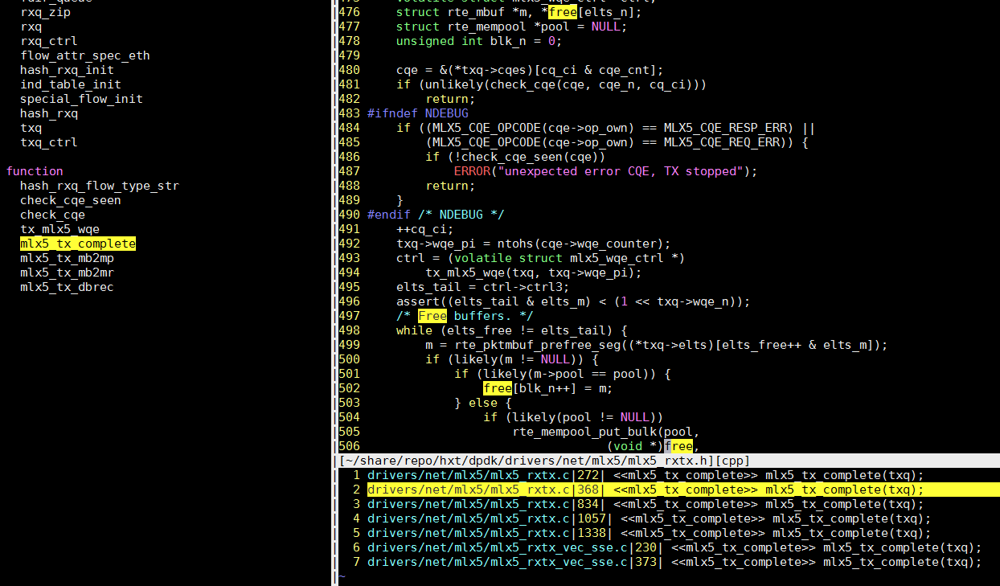

- [查看PCI的MSI中断](#查看pci的msi中断)
- [一次中断执行记录和KVM虚拟机相关的trace](#一次中断执行记录和kvm虚拟机相关的trace)
  - [中断发生在core 42上](#中断发生在core-42上)
  - [core 42的正常流程](#core-42的正常流程)
  - [perf sched虚拟机](#perf-sched虚拟机)
- [lmbench的lat_mem_rd怎么算cache访问延迟](#lmbench的lat_mem_rd怎么算cache访问延迟)
- [pstack看qemu的进程](#pstack看qemu的进程)
- [lsof详细输出](#lsof详细输出)
- [关于共享cluster的2core](#关于共享cluster的2core)
- [关于latency和throughput](#关于latency和throughput)
- [关于timer](#关于timer)
- [cache预取](#cache预取)
- [快速找到一个进程的log](#快速找到一个进程的log)
- [编译调试手段](#编译调试手段)
  - [加帧指针](#加帧指针)
  - [强制不优化, C语言 `__attribute__`](#强制不优化-c语言-__attribute__)
- [关于no hz](#关于no-hz)
  - [只加isolcpus](#只加isolcpus)
  - [在isolcpus基础上, 加nohz_full和rcu_nocbs](#在isolcpus基础上-加nohz_full和rcu_nocbs)
  - [IPI中断和arch_timer](#ipi中断和arch_timer)
  - [结论](#结论)
- [动态调频和中断](#动态调频和中断)
- [调试testpmd](#调试testpmd)
  - [现象](#现象)
  - [打开coredump并用gdb调试](#打开coredump并用gdb调试)
  - [是数组越界吗? -- 第一次问](#是数组越界吗----第一次问)
  - [看汇编](#看汇编)
  - [扩大栈](#扩大栈)
  - [检查内存分布](#检查内存分布)
  - [还是回到数组越界](#还是回到数组越界)
  - [记录一下gdb用到的命令](#记录一下gdb用到的命令)
- [调试testpmd续](#调试testpmd续)
  - [macswap段错误](#macswap段错误)
- [修改栈大小](#修改栈大小)
- [objdump汇编和C混合显示](#objdump汇编和c混合显示)
- [coredump和GDB](#coredump和gdb)
- [查看优化level的详细开关](#查看优化level的详细开关)

# 查看PCI的MSI中断
`/proc/interrupts`里能显示中断的信息, 但不能很方便的对应到是哪个设备的中断.

比如在我的VM里, 有:
```shell
$ cat /proc/interrupts
           CPU0       CPU1       CPU2       CPU3
  2:    1020348     924296     763104     823621     GICv3  27 Level     arch_timer
  4:        116          0          0          0     GICv3  33 Level     uart-pl011
 42:          0          0          0          0     GICv3  23 Level     arm-pmu
 43:          0          0          0          0     pl061   3 Edge      ACPI:Event
 44:          1          0          0          0   ITS-MSI 16384 Edge      aerdrv, PCIe PME, pciehp
 45:          1          0          0          0   ITS-MSI 18432 Edge      aerdrv, PCIe PME, pciehp
 46:          1          0          0          0   ITS-MSI 20480 Edge      aerdrv, PCIe PME, pciehp
 47:          1          0          0          0   ITS-MSI 22528 Edge      aerdrv, PCIe PME, pciehp
 48:          1          0          0          0   ITS-MSI 24576 Edge      aerdrv, PCIe PME, pciehp
 49:          0          0          0          0   ITS-MSI 1572864 Edge      virtio1-config
 50:          0          0          0          0   ITS-MSI 1572865 Edge      virtio1-control
 51:          0          0          0          0   ITS-MSI 1572866 Edge      virtio1-event
 52:      95112          0          0          0   ITS-MSI 1572867 Edge      virtio1-request
 53:          0          0          0          0   ITS-MSI 524288 Edge      virtio0-config
 54:          0      29863      59165          0   ITS-MSI 524289 Edge      virtio0-input.0
 55:          0          0          0          1   ITS-MSI 524290 Edge      virtio0-output.0
 56:          2          0          0          0   ITS-MSI 2097152 Edge      virtio2-config
 57:     186776          0          0          0   ITS-MSI 2097153 Edge      virtio2-input.0
 58:          0          1          0          0   ITS-MSI 2097154 Edge      virtio2-output.0
 59:          0          0          0          0   ITS-MSI 1048576 Edge      xhci_hcd
 60:          0          0          0          0   ITS-MSI 1048577 Edge      xhci_hcd
 61:          0          0          0          0   ITS-MSI 1048578 Edge      xhci_hcd
 62:          0          0          0          0   ITS-MSI 1048579 Edge      xhci_hcd
 63:          0          0          0          0   ITS-MSI 1048580 Edge      xhci_hcd
IPI0:     35739      68329      56984      48197       Rescheduling interrupts
IPI1:         5          4          3          3       Function call interrupts
IPI2:         0          0          0          0       CPU stop interrupts
IPI3:         0          0          0          0       CPU stop (for crash dump) interrupts
IPI4:         0          0          0          0       Timer broadcast interrupts
IPI5:         2          0          0          0       IRQ work interrupts
IPI6:         0          0          0          0       CPU wake-up interrupts
```

有几个中断想知道对应的设备是什么
1. 查pci, 我这里想找eth1
```bash
$ lspci
01:00.0 Ethernet controller: Red Hat, Inc Virtio network device (rev 01)
03:00.0 SCSI storage controller: Red Hat, Inc Virtio SCSI (rev 01)
04:00.0 Ethernet controller: Red Hat, Inc Virtio network device (rev 01)
```
2. 看看eth1的pci
```bash
$ ethtool -i eth1
bus-info: 0000:04:00.0
```
3. 到/sys/bus下找pci号
```bash
bai@localhost /sys/bus/pci/devices/0000:04:00.0
```
4. 找到对应的中断号
```bash
$ ls msi_irqs/
56  57  58
```
5. 可以修改一下中断route到哪个CPU, 比如下面把处理中断的CPU从0改为1
```bash
bai@localhost /proc/irq/57
$ cat effective_affinity
1
bai@localhost /proc/irq/57
$ cat smp_affinity_list
0
[root@localhost 57]# echo 1 > smp_affinity_list
[root@localhost 57]# cat smp_affinity_list
1
[root@localhost 57]# cat smp_affinity
2
```

# 一次中断执行记录和KVM虚拟机相关的trace
用ftrace的function_graph抓到的一次中断过程.
```bash
#系统通过isolcpus=2-23,26-47 只保留4个核给系统(centos 7.5)使用.
HOST: 0 1 24 25
#OVS的pmd进程跑在四个核上
OVS: 12 13 14 15
#两个VM分别pin了4个CPU
VM1: 26 27 28 29
VM2: 40 41 42 43
```

## 中断发生在core 42上
```c
gic_handle_irq()
  __handle_domain_irq() // 44 us
    irq_enter()
      rcu_irq_enter()
      tick_irq_enter()
      _local_bh_enable()
    irq_find_mapping()
    generic_handle_irq()
      handle_percpu_devid_irq()
        arch_timer_handler_phys()
          hrtimer_interrupt()
        gic_eoimode1_eoi_irq()
    irq_exit()
      idle_cpu()
      tick_nohz_irq_exit()
      rcu_irq_exit()
  __handle_domain_irq() // 120 us
    irq_enter()
    irq_find_mapping()
    generic_handle_irq()
      handle_percpu_devid_irq()
        arch_timer_handler_phys()
          hrtimer_interrupt()
            __hrtimer_run_queues()
              __remove_hrtimer()
              kvm_timer_expire()
                kvm_timer_earliest_exp()
                queue_work_on()
                  __queue_work()
                    get_work_pool()
                    insert_work()
                      wake_up_worker()
                        wake_up_process()
                          try_to_wake_up()
                            update_rq_clock()
                            ttwu_do_activate()
                              activate_task()
                                enqueue_task_fair()
                                  enqueue_entity()
                                    update_curr()
                                    update_cfs_shares()
                                    account_entity_enqueue()
                                    __enqueue_entity()
                              wq_worker_waking_up()
                              ttwu_do_wakeup()
            __hrtimer_get_next_event()
            tick_program_event()
              clockevents_program_event()
        gic_eoimode1_eoi_irq()
    irq_exit()
      idle_cpu()
      tick_nohz_irq_exit()
      rcu_irq_exit()
//中断处理结束      
```

## core 42的正常流程
```c
cpu_pm_exit()
  cpu_pm_notify()
    rcu_irq_enter_irqson()
    __atomic_notifier_call_chain()
      notifier_call_chain()
        gic_cpu_pm_notifier()
        arch_timer_cpu_pm_notify()
        fpsimd_cpu_pm_notifier()
        cpu_pm_pmu_notify()
        hyp_init_cpu_pm_notifier()
          cpu_hyp_reinit()
          kvm_get_idmap_vector()
          kvm_mmu_get_httbr()
          kvm_arm_init_debug()
          kvm_vgic_init_cpu_hardware()
    rcu_irq_exit_irqson()      
      rcu_irq_exit()
sched_idle_set_state()
cpuidle_reflect()
rcu_idle_exit()
arch_cpu_idle_exit()
tick_nohz_idle_exit()
  ktime_get()
    arch_counter_read()
  tick_nohz_restart_sched_tick()
  account_idle_ticks()
sched_ttwu_pending()
schedule_idle() //切换到kworker-332前的准备
  rcu_note_context_switch()
  update_rq_clock()
  pick_next_task_fair()
    put_prev_task_idle()
    pick_next_entity()
    set_next_entity()
  fpsimd_thread_switch()
  hw_breakpoint_thread_switch()
  uao_thread_switch()
  qqos_sched_in()
  
<idle>-0    =>  kworker-332 //idle进程已经切换到kworker

finish_task_switch()
_raw_spin_lock_irq()
process_one_work() //kworker代码 -- 84 us
  find_worker_executing_work()
  set_work_pool_and_clear_pending()
  kvm_timer_inject_irq_work()
    kvm_vcpu_wake_up()
      swake_up()
        swake_up_locked()
          wake_up_process()
            try_to_wake_up()
  _cond_resched()
  rcu_all_qs()
  pwq_dec_nr_in_flight()
worker_enter_idle()
schedule()
  rcu_note_context_switch()
  update_rq_clock()
  deactivate_task()
    dequeue_task_fair()
      dequeue_entity()    
      hrtick_update()
  wq_worker_sleeping()
  pick_next_task_fair()
    check_cfs_rq_runtime()
    pick_next_entity()
    set_next_entity()
  fpsimd_thread_switch()
  hw_breakpoint_thread_switch()
  uao_thread_switch()
  qqos_sched_in()
  
kworker-332   =>  CPU 2/K-6915 //kworker已经切换到CPU 2/K, 后者是qemu的VCPU进程

finish_task_switch()
  kvm_sched_in()
    kvm_arch_vcpu_load()
      kvm_vgic_load()
prepare_to_swait()
kvm_vcpu_check_block()
  kvm_arch_vcpu_runnable()
  kvm_cpu_has_pending_timer()
finish_swait()  
ktime_get()
kvm_arch_vcpu_unblocking() //-- 11 us
  kvm_timer_unschedule()

//从这里开始的几个顶级函数, 是在kvm_arch_vcpu_ioctl_run()里调用的, 后者是用户态通过VCPU_RUN ioctl调用的, 它在一个循环里执行VM的代码直到时间片结束.
_cond_resched()
kvm_pmu_flush_hwstate()
  kvm_pmu_update_state()
kvm_timer_flush_hwstate() //20 us
  kvm_timer_update_state()
    kvm_timer_should_fire.part.9()
    kvm_timer_update_irq.isra.5()
      kvm_vgic_inject_irq()
        vgic_lazy_init()
        vgic_get_irq()
        vgic_queue_irq_unlock()
          vgic_target_oracle()
          kvm_vcpu_kick() //奇怪的是函数里的if (kvm_vcpu_wake_up(vcpu))为什么没出现?
  irq_set_irqchip_state()        
kvm_vgic_flush_hwstate()  
kvm_timer_should_notify_user()
kvm_pmu_should_notify_user()
kvm_pmu_sync_hwstate()
kvm_timer_sync_hwstate()
kvm_vgic_sync_hwstate()
kvm_arm_setup_debug()
//trace_kvm_entry(*vcpu_pc(vcpu)); 我自己看代码加的, 进入VM
//guest_enter_irqoff()
//对rcu来说, 执行guest代码和切换到user代码差不多
rcu_note_context_switch()
kvm_arm_clear_debug()
handle_exit()
  kvm_handle_wfx()
    kvm_vcpu_block()
      ktime_get()
      kvm_arch_vcpu_blocking()
      prepare_to_swait()
      kvm_vcpu_check_block()
      schedule() //调度到idle进程

CPU 2/K-6915  =>    <idle>-0 //切换回idle

finish_task_switch() //接着执行第40行idle进程未完成的schedule_idle(), 时间过去了467 us, idle被换出了467 us
do_idle()
  quiet_vmstat()
  tick_nohz_idle_enter()
    set_cpu_sd_state_idle()
    __tick_nohz_idle_enter()
  arch_cpu_idle_enter()
  tick_check_broadcast_expired()
  cpuidle_get_cpu_driver()
  rcu_idle_enter()
  cpuidle_not_available()
  cpuidle_select()
  call_cpuidle()
    cpuidle_enter()
      cpuidle_enter_state()
        sched_idle_set_state()
        acpi_idle_lpi_enter()
            cpu_pm_enter()
            psci_cpu_suspend_enter()
              psci_cpu_suspend()
                __invoke_psci_fn_smc() //陷入到EL3
//@ 585311.6 us idle了585ms

//从此开始新的一轮
cpu_pm_exit() 
```

## perf sched虚拟机
在出现ping延迟高的情况时, 比如VM1 ping VM2延迟高, 在VM1上用tcpdump看时间戳是看不出来的, 都是正常的. 但在VM2上执行tcpdump, 会马上破坏掉问题的复现, ping延迟会马上变低.

在VM执行ping的过程中, 在VM里面收集调度的信息, 看看是不是VM里面的调度问题, 2个VM都执行:  
`sudo perf sched record -a`  
用这个方法基本上是看不出什么来的.

# lmbench的lat_mem_rd怎么算cache访问延迟
在固定时间内, 默认100ms, 除以iteration的次数; 一次iteration是N次内存操作的循环, N是设计好的, 现在是100.

这样的话, 时间已知, 操作数已知, 那么每次操作的延迟就知道了.

最后一项是iteration数, lmbench有个`benchmp_interval()`函数, 用来在迭代中"提前"算出iteration数. 
```bash
# fprintf(stderr, "%.5f %.3f %.2f %ld %.2f\n", range / (1024. * 1024.), result, (double)gettime(), count, (double)get_n());
$ taskset -c 9 ./lat_mem_rd 1 8192
"stride=8192
0.00781 1.154 1076726.00 100 9328365.00
0.01172 1.154 1099508.00 100 9525582.00
0.01562 1.154 1101837.00 100 9545763.00
0.02344 1.154 1099507.00 100 9525582.00
0.03125 1.154 1099505.00 100 9525582.00
0.04688 1.154 1101850.00 100 9545763.00
0.06250 1.154 1099507.00 100 9525582.00
0.09375 5.771 1101823.00 100 1909153.00
0.12500 5.771 1098107.00 100 1902703.00
0.18750 5.771 1098104.00 100 1902703.00
0.25000 5.771 1101823.00 100 1909153.00
0.37500 5.771 1098120.00 100 1902703.00
0.50000 5.772 1098255.00 100 1902703.00
0.75000 45.280 1099220.00 100 242759.00
1.00000 45.281 1099246.00 200 121380.00
```

# pstack看qemu的进程
在调试两个VM互相ping高延迟的问题. 两个VM通过OVS的vhost-user连接
```bash
#pstack如果没记错应该是调用gdb然后bt出调用栈的, 所以会停住进程里的所有线程一小会
$ sudo pstack 42084
Thread 9 (Thread 0xffff8afeede0 (LWP 42085)):
#0  0x0000ffff8b46ac40 in syscall () from /lib64/libc.so.6
#1  0x0000000000a91054 in qemu_futex_wait (f=0x1699390 <rcu_call_ready_event>, val=4294967295) at /home/bai/share/repo/hxt/qemu/include/qemu/futex.h:29
#2  0x0000000000a912b8 in qemu_event_wait (ev=0x1699390 <rcu_call_ready_event>) at util/qemu-thread-posix.c:445
#3  0x0000000000aab7b0 in call_rcu_thread (opaque=0x0) at util/rcu.c:261
#4  0x0000ffff8b527bb8 in start_thread () from /lib64/libpthread.so.0
#5  0x0000ffff8b46fb50 in thread_start () from /lib64/libc.so.6
Thread 8 (Thread 0xffff8a7dede0 (LWP 42086)):
#0  0x0000ffff8b5307e8 in sigwait () from /lib64/libpthread.so.0
#1  0x0000000000a8e1d4 in sigwait_compat (opaque=0x2794f970) at util/compatfd.c:36
#2  0x0000ffff8b527bb8 in start_thread () from /lib64/libpthread.so.0
#3  0x0000ffff8b46fb50 in thread_start () from /lib64/libc.so.6
Thread 7 (Thread 0xffff88e7ede0 (LWP 42096)):
#0  0x0000ffff8b465460 in ppoll () from /lib64/libc.so.6
#1  0x0000000000a8a9d8 in qemu_poll_ns (fds=0xfffd780008c0, nfds=1, timeout=-1) at util/qemu-timer.c:322
#2  0x0000000000a8ddbc in aio_poll (ctx=0x279953b0, blocking=true) at util/aio-posix.c:629
#3  0x0000000000694388 in iothread_run (opaque=0x279950e0) at iothread.c:64
#4  0x0000000000a91468 in qemu_thread_start (args=0x27995780) at util/qemu-thread-posix.c:504
#5  0x0000ffff8b527bb8 in start_thread () from /lib64/libpthread.so.0
#6  0x0000ffff8b46fb50 in thread_start () from /lib64/libc.so.6
Thread 6 (Thread 0xffff8968ede0 (LWP 42098)):
#0  0x0000ffff8b4665bc in ioctl () from /lib64/libc.so.6
#1  0x0000000000498f30 in kvm_vcpu_ioctl (cpu=0xffff876f0010, type=44672) at /home/bai/share/repo/hxt/qemu/accel/kvm/kvm-all.c:2093
#2  0x0000000000498828 in kvm_cpu_exec (cpu=0xffff876f0010) at /home/bai/share/repo/hxt/qemu/accel/kvm/kvm-all.c:1930
#3  0x0000000000460b74 in qemu_kvm_cpu_thread_fn (arg=0xffff876f0010) at /home/bai/share/repo/hxt/qemu/cpus.c:1215
#4  0x0000000000a91468 in qemu_thread_start (args=0x279f03e0) at util/qemu-thread-posix.c:504
#5  0x0000ffff8b527bb8 in start_thread () from /lib64/libpthread.so.0
#6  0x0000ffff8b46fb50 in thread_start () from /lib64/libc.so.6
Thread 5 (Thread 0xffff89e9ede0 (LWP 42100)):
#0  0x0000ffff8b4665bc in ioctl () from /lib64/libc.so.6
#1  0x0000000000498f30 in kvm_vcpu_ioctl (cpu=0xffff876a0010, type=44672) at /home/bai/share/repo/hxt/qemu/accel/kvm/kvm-all.c:2093
#2  0x0000000000498828 in kvm_cpu_exec (cpu=0xffff876a0010) at /home/bai/share/repo/hxt/qemu/accel/kvm/kvm-all.c:1930
#3  0x0000000000460b74 in qemu_kvm_cpu_thread_fn (arg=0xffff876a0010) at /home/bai/share/repo/hxt/qemu/cpus.c:1215
#4  0x0000000000a91468 in qemu_thread_start (args=0x27a0d0d0) at util/qemu-thread-posix.c:504
#5  0x0000ffff8b527bb8 in start_thread () from /lib64/libpthread.so.0
#6  0x0000ffff8b46fb50 in thread_start () from /lib64/libc.so.6
Thread 4 (Thread 0xffff8764ede0 (LWP 42101)):
#0  0x0000ffff8b4665bc in ioctl () from /lib64/libc.so.6
#1  0x0000000000498f30 in kvm_vcpu_ioctl (cpu=0xffff87650010, type=44672) at /home/bai/share/repo/hxt/qemu/accel/kvm/kvm-all.c:2093
#2  0x0000000000498828 in kvm_cpu_exec (cpu=0xffff87650010) at /home/bai/share/repo/hxt/qemu/accel/kvm/kvm-all.c:1930
#3  0x0000000000460b74 in qemu_kvm_cpu_thread_fn (arg=0xffff87650010) at /home/bai/share/repo/hxt/qemu/cpus.c:1215
#4  0x0000000000a91468 in qemu_thread_start (args=0x27a24e60) at util/qemu-thread-posix.c:504
#5  0x0000ffff8b527bb8 in start_thread () from /lib64/libpthread.so.0
#6  0x0000ffff8b46fb50 in thread_start () from /lib64/libc.so.6
Thread 3 (Thread 0xffff86deede0 (LWP 42102)):
#0  0x0000ffff8b4665bc in ioctl () from /lib64/libc.so.6
#1  0x0000000000498f30 in kvm_vcpu_ioctl (cpu=0xffff86df0010, type=44672) at /home/bai/share/repo/hxt/qemu/accel/kvm/kvm-all.c:2093
#2  0x0000000000498828 in kvm_cpu_exec (cpu=0xffff86df0010) at /home/bai/share/repo/hxt/qemu/accel/kvm/kvm-all.c:1930
#3  0x0000000000460b74 in qemu_kvm_cpu_thread_fn (arg=0xffff86df0010) at /home/bai/share/repo/hxt/qemu/cpus.c:1215
#4  0x0000000000a91468 in qemu_thread_start (args=0x27a3ce50) at util/qemu-thread-posix.c:504
#5  0x0000ffff8b527bb8 in start_thread () from /lib64/libpthread.so.0
#6  0x0000ffff8b46fb50 in thread_start () from /lib64/libc.so.6
Thread 2 (Thread 0xfffd50e0ede0 (LWP 43789)):
#0  0x0000ffff8b52e4bc in do_futex_wait () from /lib64/libpthread.so.0
#1  0x0000ffff8b52e59c in __new_sem_wait_slow () from /lib64/libpthread.so.0
#2  0x0000ffff8b52e690 in sem_timedwait () from /lib64/libpthread.so.0
#3  0x0000000000a90eb0 in qemu_sem_timedwait (sem=0x279a8610, ms=10000) at util/qemu-thread-posix.c:292
#4  0x0000000000a8969c in worker_thread (opaque=0x279a8590) at util/thread-pool.c:92
#5  0x0000000000a91468 in qemu_thread_start (args=0x27cbb660) at util/qemu-thread-posix.c:504
#6  0x0000ffff8b527bb8 in start_thread () from /lib64/libpthread.so.0
#7  0x0000ffff8b46fb50 in thread_start () from /lib64/libc.so.6
Thread 1 (Thread 0xffff8bf3cf40 (LWP 42084)):
#0  0x0000ffff8b465460 in ppoll () from /lib64/libc.so.6
#1  0x0000000000a8a9d8 in qemu_poll_ns (fds=0x27fc1180, nfds=10, timeout=-1) at util/qemu-timer.c:322
#2  0x0000000000a8bd70 in os_host_main_loop_wait (timeout=-1) at util/main-loop.c:258
#3  0x0000000000a8be44 in main_loop_wait (nonblocking=0) at util/main-loop.c:522
#4  0x000000000069ce94 in main_loop () at vl.c:1943
#5  0x00000000006a4f6c in main (argc=79, argv=0xffffc24fcdf8, envp=0xffffc24fd078) at vl.c:4734
```

# lsof详细输出
```bash
#把进程5923的所有线程的fd都显示出来, 用-K; -a是指选项上的"and", 这里是说-K和-p两个选项连用
#感觉和只看进程的差不多, 多个线程只是重复列了一遍而已
sudo lsof -Ka -p 5923
#注: 在centos上好像不行
```

# 关于共享cluster的2core
AW是2core共享一个512K的L2 cache, 用`lscpu -p | column -ts,`可以看到

比如, core 10和core 33是共享一个L2 cache的.

在跑DPDK pmd(pull mode driver)的时候, 尽量不要用同个cluster的2个core

比如这个命令就强制运行pmd在core 10和core33:  
`sudo arm64-armv8a-linuxapp-gcc/app/testpmd -w 0004:01:00.0 --master-lcore 30 -c 0x240000400 -n 6 -- -a --txq=2 --rxq=2 --mbcache=512 --rxd=4096 --txd=4096 --forward-mode=macswap --nb-cores=2 --stat 2`  
RFC2544测试0丢包, 最大throughput只有10G线速的85.037%

而作为对比, 用分属于不通cluster的2个core来跑pmd, 此时pmd运行在core32和core33  
`sudo arm64-armv8a-linuxapp-gcc/app/testpmd -w 0004:01:00.0 -l 31-43 -n 6 -- -a --txq=2 --rxq=2 --mbcache=512 --rxd=4096 --txd=4096 --forward-mode=macswap --nb-cores=2 --stat 2`  
同样跑RFC2544测试0丢包测试, 最大能到在10G线速的97%.

而单核跑pmd的性能, 也能到线速的97%.

以上测试都进行了至少3遍, 现象一致.

结论:
* 在跑dpdk testpmd的macswap转发时, 
    * 2core@2cluster和单核比性能略好.
    * 2core@1cluster比单核差, 10%左右.
* 对于类似PMD的程序, 两个core跑的东西完全独立, 尽量安排2个core到不同的cluster. 
* 1个cluster里面的2个core, 从容量上共享512K L2 cache, 同时也共享L2到Ring Bus上的带宽.

# 关于latency和throughput
比如IP forwarding 单核处理速度是3.3M pps 

报文这个东西的处理流程可以想象成汽车组装流水线, 3.3M pps说的是这个流水线0.3us就能出一辆整车.  
0.3us说的是在上百个流水线节点最慢的节点需要的时间, 他是整个系统的瓶颈, 决定了出整车的速度.  
但从0开始算到第一个整车出来, 整个过程需要的时间是latency.这个latency应该远远大于0.3us(流水线深度越深, 这个差距应该越大)

据反馈一个报文的latency在100us左右. 

另外, 从单核的throughput也不能简单算出latency, 比如肯德基排队, 一个店员服务一个人要5分钟, 那么这个店员一个小时的throughput是20人, 但如果排队人数多, 对在队尾的人来说, 从他排队开始算, 到得到服务结束,latency不止5分钟, 比如他前面10个人, 他的latency是`10*5+5`分钟.

所以单核的latency, 包括了核处理的时间, 和排队的时间, 要减小latency, 要减小队列.

# 关于timer
> If I’m not wrong timer counter is a system-wide64-bit count, which counts up from zero, giving a consistent view of time across cores. Each core can then manage its own comparators, typically to generate per-core timer interrupt.

* The CNTFRQ_EL0 register reports the frequency of the system timer.
* The CNTPCT_EL0 register reports the current count value.
* CNTKCTL_EL1 controls whether EL0 can access the system timer.

# cache预取
在测试OVS性能的时候, 发现热点函数rte_vhost_dequeue_burst有两条指令占比比较高:  
  

这个pmd进程, 用rte_vhost_dequeue_burst从vhost的vring里面取报文, 然后发给物理口.  
这时用perf stat对这个核查一下性能统计  
`sudo perf stat -a -d -d -e cycles -e cpu-clock -e instructions -e stalled-cycles-backend -e stalled-cycles-frontend -e branch-misses -e branch-loads -e l2cache_0/total-requests/ -C 32 -r 6 -- sleep 10`  

发现有43%的backed stall, 说明CPU在等待data cache, IPC是1.66
```
43,015,925,614      instructions              #    1.66  insn per cycle
                                              #    0.26  stalled cycles per insn
11,282,848,844      stalled-cycles-backend    #   43.42% backend cycles idle
```
通过gdb跟踪这个进程, 结合代码, 问题出在第1144行附近  
  

这时注意到可能是desc这个地址没有cache, 而这个地址是descs数组根据偏移量而来  
`desc = &descs[desc_idx];`

结合gdb, 有:
```bash
#dev结构体
(gdb) p *dev
$2 = {mem = 0xbcd670480, features = 5637144576, protocol_features = 55, vid = 0, flags = 3,
  vhost_hlen = 12, broadcast_rarp = {cnt = 0}, nr_vring = 2, dequeue_zero_copy = 0, virtqueue = {
    0xbcd6cca80, 0xbcd6c4080, 0x0 <repeats 254 times>},
  ifname = "/tmp/dpdkvhostuser0", '\000' <repeats 4076 times>, log_size = 0, log_base = 0,
  log_addr = 0, mac = {addr_bytes = "\000\000\000\000\000"}, mtu = 0,
  notify_ops = 0x94afb8 <virtio_net_device_ops>, nr_guest_pages = 0, max_guest_pages = 8,
  guest_pages = 0xfffdf8000900, slave_req_fd = 112}
#调用copy_desc_to_mbuf传参如下, 注意此时desc就是descs数组的地址
(gdb) p desc
$4 = (struct vring_desc *) 0x40007ff98000
(gdb) p sz
$6 = 300
(gdb) p idx
$7 = 290
#程序走到copy_desc_to_mbuf里面, 根据1137行算出来的desc地址
(gdb) p desc
$14 = (struct vring_desc *) 0x40007ff99220

#vring_desc结构体有16个字节, descs数组第290个元素的地址就是0x40007ff99220
(gdb) p/x 0x40007ff98000+16*290
$7 = 0x40007ff99220
```

所以调用`copy_desc_to_mbuf`的代码如下, 我加了cache预取指令, 1659行  
  


# 快速找到一个进程的log
```shell
sudo lsof -p `pgrep ovs-vswitchd` | grep log
```

# 编译调试手段
## 加帧指针
```c
-fno-omit-frame-pointer
```

## 强制不优化, C语言 `__attribute__`
```c
__attribute__((optimize("O0"))) 
//比如: 
void __attribute__((optimize("O0"))) foo(unsigned char data) {
    // unmodifiable compiler code
}
```
实测有效

有关attribute请参考:
https://gcc.gnu.org/onlinedocs/gcc/Attribute-Syntax.html

# 关于no hz
https://www.kernel.org/doc/Documentation/timers/NO_HZ.txt
* CONFIG_HZ_PERIODIC=y或CONFIG_NO_HZ=n(老内核), 传统模式, 周期tick触发调度
* CONFIG_NO_HZ_IDLE=y或CONFIG_NO_HZ=y(老内核), idle的CPU忽略调度, 也称dyntick-idle模式
* CONFIG_NO_HZ_FULL=y, 如果一个CPU只run一个进程, 就不需要调度, 进入这种模式的CPU也称adaptive-ticks CPUs  
默认no CPU是这种模式, 但在kernel cmdline里面可以加`nohz_full=4,5,30,31`来指定adaptive-ticks CPU, 同时还应加入`rcu_nocbs=4,5,30,31`启动参数
* NO_HZ=y和NO_HZ_FULL=y可以共存

HXT的kernel config
```bash
$ cat /boot/config-4.14.15-6.hxt.aarch64 | grep -i hz
CONFIG_NO_HZ_COMMON=y
# CONFIG_HZ_PERIODIC is not set
# CONFIG_NO_HZ_IDLE is not set
CONFIG_NO_HZ_FULL=y
# CONFIG_NO_HZ_FULL_ALL is not set
CONFIG_NO_HZ=y
CONFIG_HZ_100=y
# CONFIG_HZ_250 is not set
# CONFIG_HZ_300 is not set
# CONFIG_HZ_1000 is not set
CONFIG_HZ=100
```
kernel启动参数加了`isolcpus=4,5,30,31 nohz_full=4,5,30,31 rcu_nocbs=4,5,30,31`  
确实看到`/proc/interrupts`里面, arch_timer和IPI5不再增加
但testpmd跑起来还是在增加

testpmd跑在core 5上, 用perf看统计:

## 只加isolcpus
```bash
$ sudo perf stat -a -d -d -d -C 5 -r 6 -- sleep 10

 Performance counter stats for 'system wide' (6 runs):

      10001.613808      cpu-clock (msec)          #    1.000 CPUs utilized            ( +-  0.00% )
             1,854      context-switches          #    0.185 K/sec                    ( +-  0.31% )
                 0      cpu-migrations            #    0.000 K/sec
                 0      page-faults               #    0.000 K/sec
    24,980,302,415      cycles                    #    2.498 GHz                      ( +-  0.00% )  (81.80%)
    39,758,964,098      instructions              #    1.59  insn per cycle           ( +-  0.00% )  (81.80%)
   <not supported>      branches
        23,938,460      branch-misses                                                 ( +-  0.02% )  (81.80%)
    18,878,052,718      L1-dcache-loads           # 1887.501 M/sec                    ( +-  0.00% )  (81.80%)
        55,552,098      L1-dcache-load-misses     #    0.29% of all L1-dcache hits    ( +-  0.01% )  (81.80%)
   <not supported>      LLC-loads
   <not supported>      LLC-load-misses
    14,512,068,781      L1-icache-loads           # 1450.973 M/sec                    ( +-  0.01% )  (81.80%)
           178,881      L1-icache-load-misses                                         ( +-  0.71% )  (81.80%)
    18,890,206,505      dTLB-loads                # 1888.716 M/sec                    ( +-  0.00% )  (81.80%)
         1,433,974      dTLB-load-misses          #    0.01% of all dTLB cache hits   ( +-  0.42% )  (81.84%)
           179,646      iTLB-loads                #    0.018 M/sec                    ( +-  0.48% )  (72.79%)
                 0      iTLB-load-misses          #    0.00% of all iTLB cache hits   (72.76%)
   <not supported>      L1-dcache-prefetches
   <not supported>      L1-dcache-prefetch-misses

      10.000882365 seconds time elapsed                                          ( +-  0.00% )
```

## 在isolcpus基础上, 加nohz_full和rcu_nocbs
对比前面的场景, context-switches和iTLB-loads都显著减少了, L1-icache-load-misses也下降了一个数量级, 其他没有明显变化
```bash
$ sudo perf stat -a -d -d -d -C 5 -r 6 -- sleep 10

 Performance counter stats for 'system wide' (6 runs):

      10004.600842      cpu-clock (msec)          #    1.000 CPUs utilized            ( +-  0.02% )
                58      context-switches          #    0.006 K/sec                    ( +-  3.28% )
                 0      cpu-migrations            #    0.000 K/sec
                 0      page-faults               #    0.000 K/sec
    24,988,134,060      cycles                    #    2.498 GHz                      ( +-  0.02% )  (81.81%)
    39,771,226,748      instructions              #    1.59  insn per cycle           ( +-  0.02% )  (81.81%)
   <not supported>      branches
        24,361,683      branch-misses                                                 ( +-  0.02% )  (81.81%)
    18,889,305,775      L1-dcache-loads           # 1888.062 M/sec                    ( +-  0.02% )  (81.81%)
        55,348,908      L1-dcache-load-misses     #    0.29% of all L1-dcache hits    ( +-  0.02% )  (81.81%)
   <not supported>      LLC-loads
   <not supported>      LLC-load-misses
    14,366,129,596      L1-icache-loads           # 1435.952 M/sec                    ( +-  0.01% )  (81.81%)
            19,547      L1-icache-load-misses                                         ( +-  1.33% )  (81.81%)
    18,901,566,631      dTLB-loads                # 1889.287 M/sec                    ( +-  0.02% )  (81.81%)
         1,960,269      dTLB-load-misses          #    0.01% of all dTLB cache hits   ( +-  0.26% )  (81.83%)
            19,819      iTLB-loads                #    0.002 M/sec                    ( +-  0.91% )  (72.77%)
                 0      iTLB-load-misses          #    0.00% of all iTLB cache hits   (72.75%)
   <not supported>      L1-dcache-prefetches
   <not supported>      L1-dcache-prefetch-misses

      10.003905246 seconds time elapsed                                          ( +-  0.02% )
```

## IPI中断和arch_timer
在跑DPDK的时候, 我在cmdline里面隔离了core
`isolcpus=4,5,30,31`

然后在core4,5上跑DPDK单流单q的io fwd, 实际是core4跑命令行, core5跑pmd.

但发现core4和5都还有arch_timer和IPI5(IRQ work interrupts)中断, 并且core5上的IPI5中断快速增加, 停了DPDK后增长变慢.

通过linux代码得知  
`irq_work_queue`发IPI中断给自己, 主要的作用是提供一个在中断上下文运行work的手段

那么是谁调用了它, 又是干什么事情呢?  
用perf probe抓一下调用栈
```shell
sudo perf probe --add irq_work_queue
sudo perf record -e probe:irq_work_queue -a -C5 -g -- sleep 10
sudo perf report -n
```
得到
```shell
            + 68.32% pkt_burst_io_forward          
            - 21.45% el0_irq                       
                 gic_handle_irq                    
                 __handle_domain_irq               
                 generic_handle_irq                
                 handle_percpu_devid_irq           
                 arch_timer_handler_phys           
                 hrtimer_interrupt                 
                 __hrtimer_run_queues              
                 tick_sched_timer                  
                 tick_sched_handle.isra.14         
                 update_process_times              
                 scheduler_tick                    
                 task_tick_fair                    
                 irq_work_queue
```
这里解释一下, 因为是中断触发的, 第一行pkt_burst_io_forward和这个中断并没有绝对关系, 它是被打断的函数, 不知为何, 被perf当做调用函数了;

补充一下, IPI中断类型有
```c
enum ipi_msg_type {
	IPI_RESCHEDULE,
	IPI_CALL_FUNC,
	IPI_CPU_STOP,
	IPI_CPU_CRASH_STOP,
	IPI_TIMER,
	IPI_IRQ_WORK,
	IPI_WAKEUP
};
```

## 结论
`arch_timer`和`IPI5`这两个中断导致的context-switches, kernel启动参数增加`nohz_full`和`rcu_nocbs`后, context-switches由原来的185次/秒减小到6次/秒

# 动态调频和中断
在kernel启动cmdline加`isolcpus=31-37 nohz_full=31-37 rcu_nocbs=31-37`会导致CPU无法正确动态调频, 比如跑pmd的core并没有满频率跑, 故可推断以上参数会把调频的driver的中断禁止掉, 导致频率不对.
此时需要强制最高频率:
```bash
#查实际频率
sudo cpupower -c all frequency-info | grep "current CPU frequency"
#强制最高频率, 重启会失效
sudo cpupower frequency-set -g performance
```

# 调试testpmd
## 现象
42上跑pktgen, 43上跑testpmd  
43上开了SR-IOV, 配了2个VF  
`$ sudo bash -c "echo 2 > /sys/class/net/enP5p1s0/device/sriov_numvfs"`  
然后43上跑testpmd, fwd为macswap模式
```bash
sudo ./build/app/testpmd -l 37-45 -n 6 -w 0005:01:00.0 txq_inline=256,rxq_cqe_comp_en=1,txqs_min_inline=8,txq_mpw_en=1 -- -i
testpmd> set fwd macswap
Set macswap packet forwarding mode
testpmd> start
```
跑一会出现segment fault

## 打开coredump并用gdb调试
```bash
ulimit -c unlimited
#把core文件写到/tmp下面
sudo bash -c 'echo "/tmp/core-%e-%p-%t" > /proc/sys/kernel/core_pattern'
#gdb打开core文件
sudo gdb ./build/app/testpmd /tmp/core-lcore-slave-38-31988-1539675229
```
  

## 是数组越界吗? -- 第一次问
`free[]`是个数组, 程序在`free[blk_n++] = m;`出现段错误

但是gdb却告诉我们: 数组大小65535, 在访问1915个元素时出现问题, 似乎没有问题

考虑到65535个元素的数组还是比较大, 是不是栈不够了呢?
```shell
(gdb) p elts_n
$23 = 65535
(gdb) p blk_n
$24 = 1915
```
  

## 看汇编
汇编 sp向下增长  
  

`free[]`数组是在栈上的数组, 大小是运行时确定的. 新的C标准支持这种操作, 实现上大概是这样: 运行时算好偏移量, 比如上面代码中, x2就是偏移量, sp减去这个偏移量, 即sp向下增长出该数组大小的空间, 并把基地址保存在其他寄存器中, 比如上面代码中的x5. x5可以做为`free[]`数组的基地址. 在给数组赋值的过程中, 地址向上增长.

## 扩大栈
栈大小是在运行时决定的, `readelf -a`或`objdump`都看不到栈大小
修改栈大小可以调函数在代码里改: `setrlimit()`, 也可以用`ulimit -s 16384`改, 默认的栈大小是8192(即8M)

改大了还是出一样的问题

## 检查内存分布
用gdb的命令`maintenance info sections`可以看到程序的内存分布  
中间间杂的64K只读页(隔离页)就是保护栈越界的, 这里就可以看到它的作用.
```bash
(gdb) p &free[1914]
$5 = (struct rte_mbuf **) 0xffffb3420000
```
根据gdb的输出, 算一算每个section的大小  
看到出问题的地址0xffffb3420000是一个64K的只读页上, 这个不是栈的页, 它上面的16384K的页(们)才是栈  
说明栈溢出
```shell
cat << EOF | awk -F"->| *" '{printf "%s %s %dK\n",$2,$3,(strtonum($3)-strtonum($2))/1024}'
    0xffffb1410000->0xffffb2410000 at 0x07650000: load103 ALLOC LOAD HAS_CONTENTS
    0xffffb2410000->0xffffb2420000 at 0x08650000: load104 ALLOC LOAD READONLY HAS_CONTENTS
    0xffffb2420000->0xffffb3420000 at 0x08660000: load105 ALLOC LOAD HAS_CONTENTS
    0xffffb3420000->0xffffb3430000 at 0x09660000: load106 ALLOC LOAD READONLY HAS_CONTENTS
EOF
0xffffb1410000 0xffffb2410000 16384K
0xffffb2410000 0xffffb2420000 64K
0xffffb2420000 0xffffb3420000 16384K
0xffffb3420000 0xffffb3430000 64K
```

## 还是回到数组越界
回过头来再看gdb, 有两个疑点:
* 数组元素个数elts_n为65535, 但它是从`const uint16_t elts_n = 1 << txq->elts_n;`来, 不可能是奇数
* sp地址和栈顶地址相差小于`65535*8(free数组大小按65535算)`
```bash
# 栈顶地址是上面查到的栈地址空间的最大值
(gdb) p 0xffffb3420000-0xffffb341c430
$14 = 15312
```
到这里就很明显了, `elts_n`被踩, 实际数组并没有那么大. 实际被踩踏的栈很大, 直到踩到"隔离"页.

增大栈大小不管用, 也印证了这一点.

结合代码, 栈上的数据(elts_n就在栈上)被502行, 数组越界赋值所踩踏.
`free[blk_n++] = m;`

## 记录一下gdb用到的命令
```bash
gdb ./build/app/testpmd
(gdb) b mlx5_tx_complete
(gdb) b mlx5_rxtx.h:498
#带条件的断点, GDB每次停下来判断一下, 不满足条件继续往下执行
(gdb) b mlx5_rxtx.h:498 if elts_n>512
#暂时禁止/打开全部断点
(gdb) disable/enable
#暂时禁止/打开某个断点
(gdb) disable/enable 序号, 比如 1 2 3
# run命令接受被调程序的参数
(gdb) r -l 37-45 -n 6 -w 0005:01:00.0 txq_inline=256,rxq_cqe_comp_en=1,txqs_min_inline=8,txq_mpw_en=1 -- -i
#寄存器名前面加$可以直接用
(gdb) p $x29
```

# 调试testpmd续
## macswap段错误
在前面已经分析过, macswap段错误的原因是数组越界

这段程序负责回收mbuf, 根据`txq->wqe_pi`生产者的index, 找到`txq->wqes`里面对应的wqe, 其对应的硬件定义如下:
```c
struct mlx5_wqe_ctrl {
	uint32_t ctrl0;
	uint32_t ctrl1;
	uint32_t ctrl2;
	uint32_t ctrl3;
} __rte_aligned(MLX5_WQE_DWORD_SIZE);
```
elts_tail根据wqe的ctrl3得出
```c
(gdb) p *(volatile struct mlx5_wqe_ctrl *)0xfff7a02b3e00
$52 = {ctrl0 = 251167745, ctrl1 = 81465856, ctrl2 = 134217728, ctrl3 = 63836}
elts_tail = ctrl->ctrl3 //从硬件读出来的, 所谓的硬件是wqe
elts_tail=63836
```
elts_free是上一次的`txq->elts_tail`

591行free数组越界导致段错误  
  

通常情况下free和tail的增长情况  
  

perf抓函数里面参数, 参考笔记[profiling_perf命令备忘录](profiling_perf命令备忘录.md)

通过加打印:950行, 抓到的2次异常情况
```bash
testpmd> PANIC in mlx5_tx_complete_m():
Array index exceeding: elts_free:2685 elts_tail:1576

testpmd> PANIC in mlx5_tx_complete():
Array index exceeding: elts_free:40737 elts_tail:39488
```

下面想知道, 假定`elts_tail`发生了"突变", 那能抓到这次突变吗? 突变的上一次值是多少? 有什么规律?

运行`sudo perf record -e probe_testpmd:mlx5_tx_complete_m -a -C 34 -- sleep 30`抓30秒, 时间太长则数据量太大. 看运气, 多抓几次.  
或者:
```bash
while test ! -z `pgrep testpmd`;do sudo perf record -e probe_testpmd:mlx5_tx_complete_m -a -C 34 -- sleep 30; done
```
抓到了, 最后一行  
  

继续, 看代码继续往上找源头:  
`sudo perf probe -x arm64-armv8a-linuxapp-gcc/app/testpmd --add 'mlx5_tx_complete_m+240 txq->wqe_pi:u16 elts_tail:u16'`

  

继续找:cq_ci正常的, wqe_pi却不对了:
```bash
sudo perf probe -x arm64-armv8a-linuxapp-gcc/app/testpmd --add 'mlx5_tx_complete_m+228 cq_ci:u16 txq->wqe_pi:u16 elts_tail:u16'

  lcore-slave-34 14766 [034] 251661.247316: probe_testpmd:mlx5_tx_complete_m: (701ed8) cq_ci=24176 cq_ci_u16=24177 wqe_pi=64394 elts_tail_u16=64024
  lcore-slave-34 14766 [034] 251661.247321: probe_testpmd:mlx5_tx_complete_m: (701ed8) cq_ci=24177 cq_ci_u16=24178 wqe_pi=64408 elts_tail_u16=64056
  lcore-slave-34 14766 [034] 251661.247329: probe_testpmd:mlx5_tx_complete_m: (701ed8) cq_ci=24178 cq_ci_u16=24179 wqe_pi=64159 elts_tail_u16=63456
```

# 修改栈大小
```bash
# 单位是1024, 这里是8192K
# ulimit的单位一般都是1024, 详见help ulimit
$ ulimit -s
8192
# 要改大点也可以
$ ulimit -s 16384
# 改完后用pmap可以看到原来8192的变成了16384
sudo pmap -p 13234 -x

0000ffffb5930000     128     128       0 r-x-- /usr/lib64/ld-2.17.so
0000ffffb5950000      64      64      64 r---- /usr/lib64/ld-2.17.so
0000ffffb5960000      64      64      64 rw--- /usr/lib64/ld-2.17.so
0000ffffddfd0000     192     128     128 rw---   [ stack ]

# 似乎pmap的栈地址不准, 比如上面说栈是0000ffffddfd0000开始,192K
# 但我实际调试时, 栈是下面16384K大小的空间
16384K: 0xffffb2420000->0xffffb3420000 at 0x08660000: load105 ALLOC LOAD HAS_CONTENTS 
64K:    0xffffb3420000->0xffffb3430000 at 0x09660000: load106 ALLOC LOAD READONLY HAS_CONTENTS
```

# objdump汇编和C混合显示
```bash
#用objdump也可以混合显示，-S选项
objdump -dS luajit > luajit.dump
```

# coredump和GDB
```bash
ulimit -c unlimited
sudo bash -c 'echo "/tmp/core-%e-%p-%t" > /proc/sys/kernel/core_pattern'
sudo gdb -tui ./build/app/testpmd /tmp/core-lcore-slave-38-41301-1539583957
```

# 查看优化level的详细开关
```bash
gcc -Q --help=optimizers -O2 > O2
gcc -Q --help=optimizers -O3 > O3
vimdiff O2 O3
```
