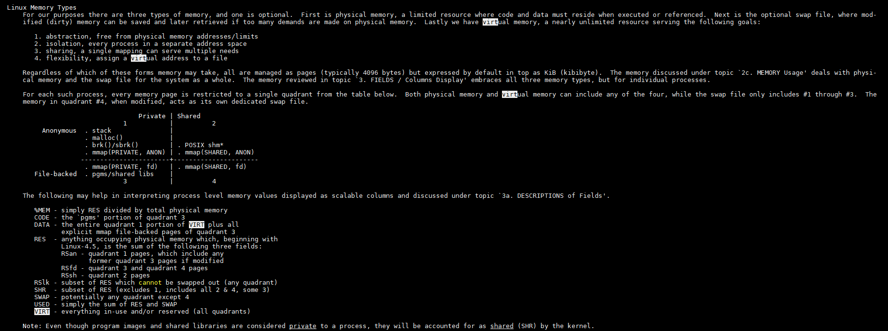
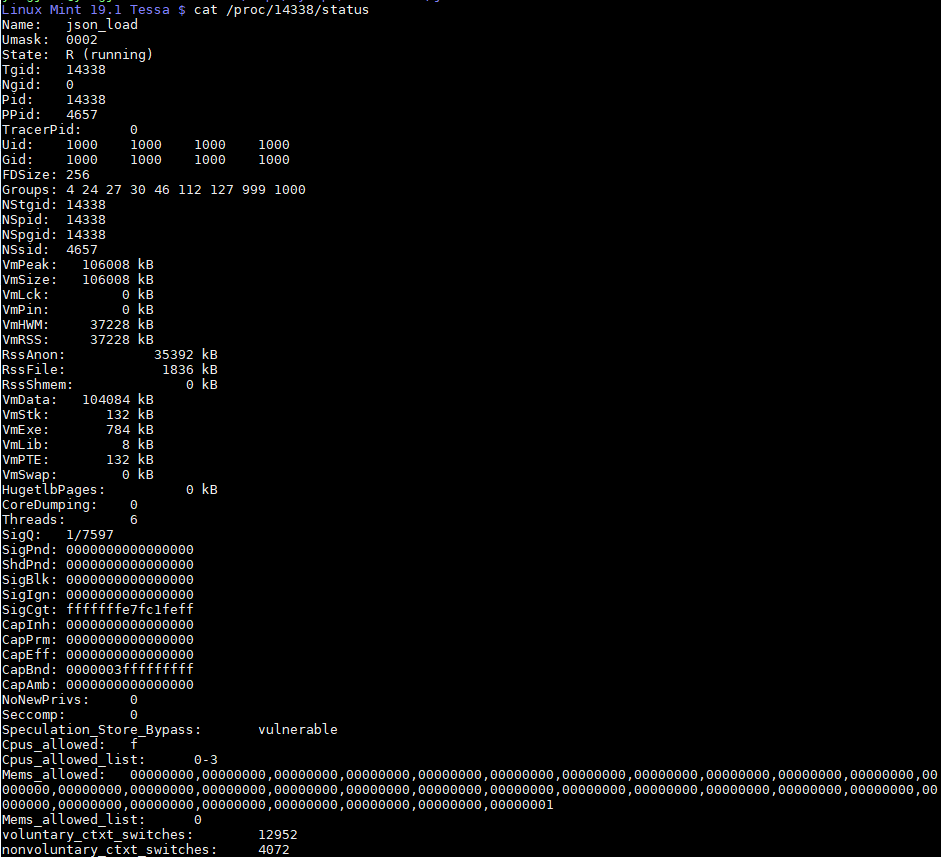
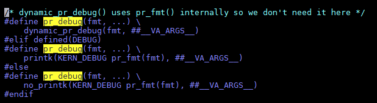

- [关于线程的group leader](#关于线程的group-leader)
  - [相关panic](#相关panic)
    - [可能的错误点1](#可能的错误点1)
    - [可能的错误点2](#可能的错误点2)
  - [这部分在schedule中的位置](#这部分在schedule中的位置)
  - [补充: 僵尸进程](#补充-僵尸进程)
- [binutils包括](#binutils包括)
- [gcc 查看include搜索路径](#gcc-查看include搜索路径)
- [linux执行文件的过程](#linux执行文件的过程)
  - [执行ELF文件](#执行elf文件)
    - [load elf文件](#load-elf文件)
  - [执行脚本文件](#执行脚本文件)
  - [任意类型文件](#任意类型文件)
- [kernel online doc](#kernel-online-doc)
- [查看编译器的文件路径](#查看编译器的文件路径)
- [用size命令查看elf文件各个section的大小](#用size命令查看elf文件各个section的大小)
- [linux内存统计, man top](#linux内存统计-man-top)
- [查看一个进程运行时的状态](#查看一个进程运行时的状态)
- [printk](#printk)
  - [更新 中断代码里用printk?](#更新-中断代码里用printk)
  - [printk会阻塞进程吗?](#printk会阻塞进程吗)
- [动态debug打印, pr_debug要打开CONFIG_DYNAMIC_DEBUG](#动态debug打印-pr_debug要打开config_dynamic_debug)
- [cmd line传kernel module的参数](#cmd-line传kernel-module的参数)
- [关于模块的符号](#关于模块的符号)
- [关于kallsyms](#关于kallsyms)

# 关于线程的group leader
有人问怎么区分一个进程下面的是子进程还是线程, 
[https://unix.stackexchange.com/questions/434092/how-does-linux-tell-threads-apart-from-child-processes](https://unix.stackexchange.com/questions/434092/how-does-linux-tell-threads-apart-from-child-processes)

回答: 在`task_struct`里, `group_leader`也是`task_struct`的指针
* 进程的线程都有相同的`group_leader`
* 而进程的子进程的`group_leader`是自己

所以`group_leader`说的是线程组的leader, 也就是`tgid`?

`kernel/fork.c`中
* 如果是新进程, 那group_leader就是自己
* 如果是新线程, 那group_leader是创建自己的进程

```c
copy_process()
    ...
    p->pid = pid_nr(pid);
    if (clone_flags & CLONE_THREAD) {
        p->exit_signal = -1;
        p->group_leader = current->group_leader;
        p->tgid = current->tgid;
    } else {
        if (clone_flags & CLONE_PARENT)
            p->exit_signal = current->group_leader->exit_signal;
        else
            p->exit_signal = (clone_flags & CSIGNAL);
        p->group_leader = p;
        p->tgid = p->pid;
    }
```

## 相关panic
在板子重启过程中, 出了kernel panic

```shell
...
CPU 1 Unable to handle kernel paging request at virtual address 0000000000000008
[ 4172.962012] (c01 22036 app_finis) CPU: 1 PID: 22036 Comm: app_finish Tainted: G           O    4.9.79-Cavium-Octeon #5
[ 4172.972714] (c01 22036 app_finis) task: 800000008d505700 task.stack: 80000000882d4000
[ 4172.980547] $ 0   : 0000000000000000 ffffffff80e0a760 0000001800005103 0000000000000000
[ 4172.988617] $ 4   : 80000000881a9d00 80000000043972f8 80000000881a9f00 0000000000000000
[ 4172.996686] $ 8   : 000000000000003f 000000000000001f 0000000000000001 6db6db6db6db6db7
[ 4173.004754] $12   : 0000000000000000 ffffffff84080018 ffffffff809e9a00 00000000100e0000
[ 4173.012823] $16   : 800000008d505700 8000000004396b00 80000000881a9d00 0000000000000001
[ 4173.020894] $20   : 0000000000000000 ffffffff8102fea0 ffffffff80e2a130 ffffffff80e2a130
[ 4173.028962] $24   : 00000000100dc03c ffffffff808dc258
[ 4173.037032] $28   : 80000000882d4000 80000000882d7c00 ffffffffffffffff ffffffff80e0a760
[ 4173.045103] (c01 22036 app_finis) Hi    : 0000000000000001
[ 4173.050593] (c01 22036 app_finis) Lo    : 0000000000000000
[ 4173.056090] (c01 22036 app_finis) epc   : ffffffff8087c9e8 octeon_prepare_arch_switch+0x18/0x38
[ 4173.064800] (c01 22036 app_finis) ra    : ffffffff80e0a760 __schedule+0x168/0xa58
[ 4173.072284] Status: 14009ce2 KX SX UX KERNEL EXL 
[ 4173.077067] (c01 22036 app_finis) Cause : 00800008 (ExcCode 02) 
[ 4173.082990] (c01 22036 app_finis) BadVA : 0000000000000008 
[ 4173.088480] (c01 22036 app_finis) PrId  : 000d9602 (Cavium Octeon III) [ 4173.095009]
[ 4173.215593] (c01 22036 app_finis) Call Trace:
[ 4173.219956] (c01 22036 app_finis) [<ffffffff8087c9e8>] octeon_prepare_arch_switch+0x18/0x38
[ 4173.228317] (c01 22036 app_finis) [<ffffffff80e0a760>] __schedule+0x168/0xa58 
[ 4173.235459] (c01 22036 app_finis) [<ffffffff80e0b360>] schedule+0x40/0xb8 
[ 4173.242255] (c01 22036 app_finis) [<ffffffff809f2370>] pipe_wait+0x78/0xa0 
[ 4173.249136] (c01 22036 app_finis) [<ffffffff809f2a08>] pipe_read+0x1a0/0x2f8 
[ 4173.256191] (c01 22036 app_finis) [<ffffffff809e7c44>] __vfs_read+0xdc/0x150 
[ 4173.263246] (c01 22036 app_finis) [<ffffffff809e9958>] vfs_read+0xa8/0x150 
[ 4173.270127] (c01 22036 app_finis) [<ffffffff809e9a60>] SyS_read+0x60/0xf8 
[ 4173.276923] (c01 22036 app_finis) [<ffffffff808823c0>] syscall_common+0x18/0x44 
```
对虚拟地址`0000000000000008`的访问造成了这个panic, 因为没有对应的page.  
这很可能是类似对空指针的结构体访问
```c
access to ptr->member
这里的member的offset是8
ptr为空
```

根据调用栈, 最后的函数是`octeon_prepare_arch_switch`
```c
/linux-octeon-sdk3.1/arch/mips/kernel/octeon-cpu.c
void octeon_prepare_arch_switch(struct task_struct *next)
{
    struct task_struct *group_leader = next->group_leader;
    union octeon_cvmemctl cvmmemctl;
    cvmmemctl.u64 = read_c0_cvmmemctl();

#if defined(CONFIG_CAVIUM_OCTEON_USER_MEM_PER_PROCESS)
    cvmmemctl.s.xkmemenau = test_tsk_thread_flag(group_leader, TIF_XKPHYS_MEM_EN) ? 1 : 0;
#endif

#if defined(CONFIG_CAVIUM_OCTEON_USER_IO_PER_PROCESS)
    cvmmemctl.s.xkioenau = test_tsk_thread_flag(group_leader, TIF_XKPHYS_IO_EN) ? 1 : 0;
#endif
    write_c0_cvmmemctl(cvmmemctl.u64);
}
```
第一个疑点:`next`是否为空, 导致`next->group_leader`异常. 
那就要看`group_leader`在`struct task_struct`的offset是否为8 -- 不是, 很远.

### 可能的错误点1

往下看, `test_tsk_thread_flag(group_leader, TIF_XKPHYS_MEM_EN)`
它调用的都是宏函数.
```c
static inline int test_tsk_thread_flag(struct task_struct *tsk, int flag)
{
    return test_ti_thread_flag(task_thread_info(tsk), flag);
}

#define task_thread_info(task)    ((struct thread_info *)(task)->stack)

static inline int test_ti_thread_flag(struct thread_info *ti, int flag)
{
    return test_bit(flag, (unsigned long *)&ti->flags);
}
```
注意`task_thread_info`, 它找`struct task_struct`里面的`void *stack`, 当作`thread_info`.
**而它的offset正好是8**
```c
include/linux/sched.h
struct task_struct {
    volatile long state;    /* -1 unrunnable, 0 runnable, >0 stopped */
    void *stack;
    ...
}
```

----
可能错误点1: `next->group_leader`为空.
这里next是下一个准备运行的任务. 如果:
* 它是个进程, 那它的group_leader是自身, 不可能为空.
* 它是个线程, 这个线程准备被运行, 说明它所在的"线程组"还在. 即使组长先退出了, 这个组员的`p->group_leader`也没有谁有必要改成NULL.

不太可能在这.

### 可能的错误点2

后面的指针访问有`ti->flags`, 是在`thread_info`找`flags`
`thread_info`在arch下面, 每个CPU架构都有.
**flags的offset也刚好是8**
```c
arch/mips/include/asm/thread_info.h
struct thread_info {
    struct task_struct  *task;      /* main task structure */
    unsigned long       flags;      /* low level flags */
    ...
}
```

----
可能的错误点2: `ti = next->group_leader->stack`为空, 导致`ti->flags`对0地址访问.
这个地方可能出错.
即: `p`存在, `p->group_leader`也存在, 但`p->group_leader->stack`已经被释放:
* `p`是个线程, 否则`p->group_leader`就是自己了. 自己的stack被释放了还要被调度执行吗?
* `p->group_leader`是创建`p`的进程, 但应该已经是僵尸进程了. -- 但为什么`p`没有退出呢? 比如`p->group_leader`调用了`pthread_exit`因此其他线程不退出?

----
首先要搞清楚这个stack从哪里来?
在`kernel/fork.c`中, stack在复制`task_struct`, 被重新alloc.
```c
_do_fork
    struct task_struct *p
    p = copy_process(...)
        p = dup_task_struct(current, node);
            stack = alloc_thread_stack_node(tsk, node);
            tsk->stack = stack;
```

在`free_task`里面, stack被释放并设为NULL
```c
free_task(struct task_struct *tsk)
    release_task_stack(tsk);
        free_thread_stack(tsk);
        tsk->stack = NULL
```
在`include/linux/sched.h`中, 如果对task_struct的引用减小到0, 就调用`__put_task_struct`, 后者会调用`free_task`
```c
static inline void put_task_struct(struct task_struct *t)
{
    if (atomic_dec_and_test(&t->usage))
        __put_task_struct(t);
}
```


## 这部分在schedule中的位置
```c
__schedule(void)
    context_switch
        prepare_task_switch(rq, prev, next);
            prepare_arch_switch(next);
                octeon_prepare_arch_switch(struct task_struct *next)
                    struct task_struct *group_leader = next->group_leader;
                    cvmmemctl.s.xkmemenau = test_tsk_thread_flag(group_leader, TIF_XKPHYS_MEM_EN) ? 1 : 0;
                        test_ti_thread_flag(task_thread_info(tsk), flag);
                            int test_ti_thread_flag(struct thread_info *ti, int flag)
                            test_bit(flag, (unsigned long *)&ti->flags);

/linux-octeon-sdk3.1/kernel/sched/core.c
static inline void
prepare_task_switch(struct rq *rq, struct task_struct *prev,
            struct task_struct *next)
{
    trace_sched_switch(prev, next);
    msa_switch(prev, next);
    sched_info_switch(prev, next);
    perf_event_task_sched_out(prev, next);
    fire_sched_out_preempt_notifiers(prev, next);
    prepare_lock_switch(rq, next);
    prepare_arch_switch(next);
}
```

## 补充: 僵尸进程
僵尸进程：先于父进程终止，但是父进程没有对其进行善后处理（wait方法: 获取终止子进程有关信息，释放它仍占有的资源）。消灭僵尸进程的唯一方法是终止其父进程。

任何一个子进程(init除外)在`exit()`之后，并非马上就消失掉，而是留下一个称为僵尸进程(Zombie)的数据结构，等待父进程处理。这是每个 子进程在结束时都要经过的阶段。如果子进程在`exit()`之后，父进程没有来得及处理，这时用ps命令就能看到子进程的状态是“Z”。如果父进程能及时 处理，可能用ps命令就来不及看到子进程的僵尸状态，但这并不等于子进程不经过僵尸状态。如果父进程在子进程结束之前退出，则子进程将由init接管。init将会以父进程的身份对僵尸状态的子进程进行处理。


# binutils包括
The GNU Binutils are a collection of binary tools. The main ones are:
```
ld - the GNU linker.
as - the GNU assembler.

But they also include:
addr2line - Converts addresses into filenames and line numbers.
ar - A utility for creating, modifying and extracting from archives.
c++filt - Filter to demangle encoded C++ symbols.
dlltool - Creates files for building and using DLLs.
gold - A new, faster, ELF only linker, still in beta test.
gprof - Displays profiling information.
nlmconv - Converts object code into an NLM.
nm - Lists symbols from object files.
objcopy - Copies and translates object files.
objdump - Displays information from object files.
ranlib - Generates an index to the contents of an archive.
readelf - Displays information from any ELF format object file.
size - Lists the section sizes of an object or archive file.
strings - Lists printable strings from files.
strip - Discards symbols.
windmc - A Windows compatible message compiler.
windres - A compiler for Windows resource files.
```

# gcc 查看include搜索路径
```
gcc -xc -E -v -

./mips64-octeon-linux-gnu-gcc gcc -xc -E -v -
#include "..." search starts here:
#include <...> search starts here:
 /repo/yingjieb/ms/buildroot73/output/host/opt/ext-toolchain/bin/../lib/gcc/mips64-octeon-linux-gnu/7.3.0/include
 /repo/yingjieb/ms/buildroot73/output/host/opt/ext-toolchain/bin/../lib/gcc/mips64-octeon-linux-gnu/7.3.0/include-fixed
 /repo/yingjieb/ms/buildroot73/output/host/opt/ext-toolchain/bin/../lib/gcc/mips64-octeon-linux-gnu/7.3.0/../../../../mips64-octeon-linux-gnu/include
 /repo/yingjieb/ms/buildroot73/output/host/mips64-buildroot-linux-gnu/sysroot/usr/include
End of search list.

```

# linux执行文件的过程
参考:
https://ownyourbits.com/2018/05/23/the-real-power-of-linux-executables/
## 执行ELF文件
一般在shell下执行一个文件, 先调用`fork()`, 再调用`execve()`

重点是内核态的`execve()`
在`fs/exec.c`
```c
SYSCALL_DEFINE3(execve,
  const char __user *, filename,
  const char __user *const __user *, argv,
  const char __user *const __user *, envp)
{
    return do_execve(getname(filename), argv, envp);
}
```
总的来说, 这个系统调用会找到可执行的文件, load到内存; 然后执行
先要准备环境, 包括准备虚拟内存, 拷贝从父进程继承的环境变量, 准备动态库

### load elf文件  
内核在`fs/binfmt_elf.c`解析要被执行的elf文件  
有个INTERP, 指的是动态链接器, 其路径是写死的:  
比如`/lib64/ld-linux-x86-64.so.2`
```shell
$ readelf -l /usr/bin/sleep
 
Elf file type is DYN (Shared object file)
Entry point 0x1710
There are 9 program headers, starting at offset 64
 
Program Headers:
  Type Offset VirtAddr PhysAddr
                 FileSiz MemSiz Flags Align
  PHDR 0x0000000000000040 0x0000000000000040 0x0000000000000040
                 0x00000000000001f8 0x00000000000001f8 R E 0x8
  INTERP 0x0000000000000238 0x0000000000000238 0x0000000000000238
                 0x000000000000001c 0x000000000000001c R 0x1
      [Requesting program interpreter: /lib64/ld-linux-x86-64.so.2]
  LOAD 0x0000000000000000 0x0000000000000000 0x0000000000000000
                 0x0000000000006a38 0x0000000000006a38 R E 0x200000
  LOAD 0x0000000000006bb0 0x0000000000206bb0 0x0000000000206bb0
                 0x00000000000004d0 0x0000000000000690 RW 0x200000
  DYNAMIC 0x0000000000006c78 0x0000000000206c78 0x0000000000206c78
                 0x00000000000001b0 0x00000000000001b0 RW 0x8
  NOTE 0x0000000000000254 0x0000000000000254 0x0000000000000254
                 0x0000000000000044 0x0000000000000044 R 0x4
  GNU_EH_FRAME 0x0000000000005bf0 0x0000000000005bf0 0x0000000000005bf0
                 0x000000000000025c 0x000000000000025c R 0x4
  GNU_STACK 0x0000000000000000 0x0000000000000000 0x0000000000000000
                 0x0000000000000000 0x0000000000000000 RW 0x10
  GNU_RELRO 0x0000000000006bb0 0x0000000000206bb0 0x0000000000206bb0
                 0x0000000000000450 0x0000000000000450 R 0x1
```
这个runtime linker, 也就是ld.so, 会被内核执行. 它在文件系统里load其他共享库, 比如libc.so  
内核加载ld.so的代码
```c
static int load_elf_binary(struct linux_binprm *bprm)
{
    ...
    if (elf_interpreter) {
        unsigned long interp_map_addr = 0;

        elf_entry = load_elf_interp(&loc->interp_elf_ex,
                                interpreter,
                                &interp_map_addr,
                                load_bias, interp_elf_phdata);
        ...
}
```
用ldd能看出来.
```shell
$ ldd /usr/bin/sleep
        linux-vdso.so.1 (0x00007ffc9dbfe000)
        libc.so.6 => /usr/lib/libc.so.6 (0x00007f71d401d000)
        /lib64/ld-linux-x86-64.so.2 => /usr/lib64/ld-linux-x86-64.so.2 (0x00007f71d45e1000)
```
这里的vdso.so是个虚拟的so, 用来加速只读的系统调用, 不用加载; ld.so内核已经加载了, 所以上面只有libc.so.6需要ld来加载.  
ld.so安装被执行的elf, 把动态库都加载好了后, 最后跳转到程序的AT_ENTRY, 开始执行.

所以:
**Linux执行一个ELF文件的过程, 其实是执行ld.so, 再由后者去真正完成加载和执行.**
 
## 执行脚本文件
脚本文件不是ELF, 只是可执行的文本文件, 那linux怎么执行它们呢?  
实际上, 内核可以执行**任何**类型的文件.

内核首先读这个文件的头128字节, 来确定用哪个handler来执行这个文件.  
对不同类型的文件, 可以注册不同的handler.
```c
/*
 * cycle the list of binary formats handler, until one recognizes the image
 */
int search_binary_handler(struct linux_binprm *bprm)
{
        ...
        list_for_each_entry(fmt, &formats, lh) {
            ...
            retval = fmt->load_binary(bprm); // OYB: the first 128B are in bprm->buf[128]
            ...
        }
        ...
}
```
脚本文件一般都在文件第一行, 比如有`#!/bin/python2`的, 是用python2来执行.

## 任意类型文件
上面说到, 内核可以执行任意文件, 只要有对应的handler
内核提供`binfmt_misc`接口来注册handler.
```shell
#比如注册.jpg用feh打开
echo ':fehjpg:E::jpg::/usr/bin/feh:' > /proc/sys/fs/binfmt_misc/register
```

# kernel online doc
https://www.kernel.org/doc/html/v5.2/
可以搜索, 比如kprobe
https://www.kernel.org/doc/html/v5.2/trace/kprobetrace.html

# 查看编译器的文件路径 
用`--print-file-name=libc.so`
```
/repo/yingjieb/ms/buildrootmlt/output/host/opt/ext-toolchain/bin/mips64-octeon-linux-gnu-gcc -mabi=n32 --print-file-name=libc.so.6
/repo/yingjieb/ms/buildrootmlt/output/host/opt/ext-toolchain/bin/../mips64-octeon-linux-gnu/sys-root/lib/../lib32/libc.so.6

/repo/yingjieb/ms/buildroot73/output/host/opt/ext-toolchain/bin/mips64-octeon-linux-gnu-gcc-mabi=n32 --print-file-name=libc.so.6
/repo/yingjieb/ms/buildroot73/output/host/opt/ext-toolchain/bin/../mips64-octeon-linux-gnu/sys-root/lib64/../lib32/libc.so.6
```
# 用size命令查看elf文件各个section的大小
```shell
/repo/yingjieb/ms/buildrootmlt/output/build/linux-custom/fs/ubifs
# -A更详细点
size -A ubifs.o ubifs.o.73
size -B ubifs.o ubifs.o.73
```

# linux内存统计, man top
  

# 查看一个进程运行时的状态
相关文档: `linux/Documentation/filesystems/proc.txt`
```shell
#很详细, 包括各种id, 线程数, vm状态, 
cat /proc/14338/status
```
  

# printk
## 更新 中断代码里用printk?
偶然翻到几年前的一篇笔记, 记的是在内存初始化时, 注册中断处理函数, 如果内存初始化有ECC错误, 会触发中断处理.

在中断handler里面, 用了printk打印debug信息.

现在想想, 在中断上下文调用printk真的合适吗?

有人在stackoverflow上也提出了相同的问题: 在中断里调用printk真的那么不对吗?

https://stackoverflow.com/questions/8738951/printk-inside-an-interrupt-handler-is-it-really-that-bad
这里面说printk应该是有buffer机制的, 在buffer满了以后才真正IO(比如串口)开始输出吗?

也有人说printk的设计初衷是debug, 时可以在中断里使用的 -- 如果中断里不能用, 如果还有buffer机制不能及时输出, printk就没那么有用了. -- 有道理

高票答案的解释是: printk并不是"延迟"输出, 如果log level高的话, 会立即输出. 如果觉得printk太慢, 可以用`trace_printk`打印到ftrace的buffer里, 后者可以用debugfs看到.


## printk会阻塞进程吗?
> printk will just try to lock the console to print the message; if the lock is already taken then the output is queued to a buffer but the function will never block.

不会.
* printk尝试输出到串口, 如果获取不到锁, 就打印到buffer里.
* 这个buffer也有锁, 但是spin lock, 所以中断也可以打printk
* printk就是设计来在任何地方打印的
* 前面说到的buffer的spin lock, 有人认为效率不高 https://lwn.net/Articles/779550/
* 因为同一时刻真正往串口打印的只能有一个进程, 这个进程在调用printk的时候, printk会把其他进程或中断上下文的log也一起打出来. 这会带来时间上的不确定性.

# 动态debug打印, pr_debug要打开CONFIG_DYNAMIC_DEBUG
```shell
#不打开这个选项, pr_debug根本就不会编译
CONFIG_DYNAMIC_DEBUG=y
#打开以后, 用下面的语法
echo 8 > /proc/sys/kernel/printk
echo 'file kernel/module.c +p' > /sys/kernel/debug/dynamic_debug/control
insmod mymodule.ko
#文档 Documentation/dynamic-debug-howto.txt
#例子, +p是说打开pr_debug, +f是打印函数名, +l行号, +m是模块名, +t是线程id, flag可以连用
echo -n 'file svcsock.c line 1603 +p' > <debugfs>/dynamic_debug/control
echo -n 'module nfsd +p' >
echo -n 'func svc_process +p' >
#打开所有debug消息
echo -n '+p' > <debugfs>/dynamic_debug/control
#打印模块名和函数名
echo -n '+mf' > <debugfs>/dynamic_debug/control
#启动的时候, 用下面的形式: QUERY符合上述语法
dyndbg="QUERY", module.dyndbg="QUERY"
dyndbg="file ec.c +p"
#比如在cmdline加
dyndbg="func cvmx_nand_page_write +p; func ubi_io_write +p"
dyndbg="func cvmx_nand_page_write line 1877-1878 +p; func ubi_io_write +pf"
```
`include/linux/printk.h`
  

```
bootoctlinux $(loadaddr) 'coremask=0x0f ctxt=OSW isamversion=ZAM8AA62.990, prozone=0x4000000,0x80000000 logbuffer=uboot,0x20000,0x7be00000 bpsflag=0x4,0x7be20000 bpcommit=0,0x140000,0x160000 mtdparts=octeon_nand0:0x8000000@0x0(recovery),-@0x8000000(nand);octeon_nand1:0x40000000@0x0(nand1);bootflash:0x20000@0x140000(statusA),0x20000@0x160000(statusB),0x140000@0x180000(bootA),0x140000@0x2c0000(bootB),0x1900000@0x400000(linuxA),0x1900000@0x1d00000(linuxB),0x20000@0x120000(preferred_oswp),0x80000@0x3600000(management_a),0x80000@0x3680000(management_b),0x120000@0x0(bps) linux_fit_image=0x1e00000,0x7a000000 unpreferred_oswp=0 console=ttyS1,115200 config_overlay=reboot=0 loglevel=8 debug ignore_loglevel dyndbg="func cvmx_nand_page_write +p; func ubi_io_write +p" '
```

# cmd line传kernel module的参数
```shell
#insmod
insmod my_module param=value
#cmdline
vmlinux ... my_module.param=value ...

#module_name.para=xxx
#octeon-nand.debug=1
setenv kernel_extra_args config_overlay=reboot=0 loglevel=8 debug ignore_loglevel octeon-nand.debug=1
```

# 关于模块的符号
模块可以用kernel或者其他模块export出来的符号  
在引用其他模块的符号时, 要先加载被依赖的ko  
比如mymodule2.ko用了mymodule1.ko的print_hello()函数, 如果单独加载mymodule2.ko时
```shell
$ sudo insmod mymodule2.ko
insmod: ERROR: could not insert module mymodule2.ko: Unknown symbol in module

rishi@rishi-VirtualBox:~/mydev/publications/lkw/doc/code/04_exporting_symbols/exporting_symbols$ dmesg
[15588.009164] mymodule2: Unknown symbol add_two_numbers (err 0)
[15588.009171] mymodule2: Unknown symbol GLOBAL_VARIABLE (err 0)
[15588.009176] mymodule2: Unknown symbol print_hello (err 0)
```
先加载mymodule1.ko, 再加载mymodule2.ko, 就没问题.

总结:
* 根据网上文章的说法, 加载mymodule1.ko, 会把print_hello加到全局符号表.
* insmod会在加载mymodule2.ko的时候, 在kernel全局符号表里找到print_hello的地址

# 关于kallsyms
/proc/kallsyms包括内核所有符号, 包括没有被`EXPORT_SYMBOL()`的符号
```shell
#没有sudo的话, kallsyms也能看到符号名, 但地址都是0
less /proc/kallsyms

#sudo后, 能看到实际地址
sudo less /proc/kallsyms

#比如
ffffffff9d0206b0 t xen_write_cr0
ffffffff9d020810 t xen_set_ldt
ffffffff9d0209e0 T xen_running_on_version_or_later
ffffffff9d020a00 T xen_copy_trap_info

# 其中的类型标记, t T的含义为
#T表示全局的代码, 即被EXPORT_SYMBOL()过的
#t表示局部的代码
#详细标记见man nm

  "A" The symbol's value is absolute, and will not be changed by further linking.
 
  "B"
  "b" The symbol is in the BSS data section. This section typically contains zero-initialized or uninitialized data, although the exact behavior is system dependent.
 
  "C" The symbol is common. Common symbols are uninitialized data. When linking, multiple common symbols may appear with the same name. If the symbol is defined anywhere, the common symbols are treated as undefined
      references.
 
  "D"
  "d" The symbol is in the initialized data section.
 
  "G"
  "g" The symbol is in an initialized data section for small objects. Some object file formats permit more efficient access to small data objects, such as a global int variable as opposed to a large global array.
 
  "i" For PE format files this indicates that the symbol is in a section specific to the implementation of DLLs. For ELF format files this indicates that the symbol is an indirect function. This is a GNU extension to
      the standard set of ELF symbol types. It indicates a symbol which if referenced by a relocation does not evaluate to its address, but instead must be invoked at runtime. The runtime execution will then return
      the value to be used in the relocation.
 
  "I" The symbol is an indirect reference to another symbol.
 
  "N" The symbol is a debugging symbol.
 
  "p" The symbols is in a stack unwind section.
 
  "R"
  "r" The symbol is in a read only data section.
 
  "S"
  "s" The symbol is in an uninitialized or zero-initialized data section for small objects.
 
  "T"
  "t" The symbol is in the text (code) section.
 
  "U" The symbol is undefined.
 
  "u" The symbol is a unique global symbol. This is a GNU extension to the standard set of ELF symbol bindings. For such a symbol the dynamic linker will make sure that in the entire process there is just one symbol
      with this name and type in use.
 
  "V"
  "v" The symbol is a weak object. When a weak defined symbol is linked with a normal defined symbol, the normal defined symbol is used with no error. When a weak undefined symbol is linked and the symbol is not
      defined, the value of the weak symbol becomes zero with no error. On some systems, uppercase indicates that a default value has been specified.
 
  "W"
  "w" The symbol is a weak symbol that has not been specifically tagged as a weak object symbol. When a weak defined symbol is linked with a normal defined symbol, the normal defined symbol is used with no error. When
      a weak undefined symbol is linked and the symbol is not defined, the value of the symbol is determined in a system-specific manner without error. On some systems, uppercase indicates that a default value has been
      specified.
 
  "-" The symbol is a stabs symbol in an a.out object file. In this case, the next values printed are the stabs other field, the stabs desc field, and the stab type. Stabs symbols are used to hold debugging
      information.
 
  "?" The symbol type is unknown, or object file format specific.
```
