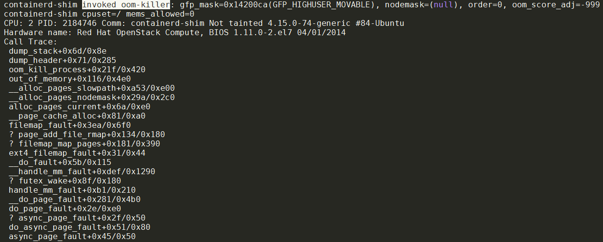
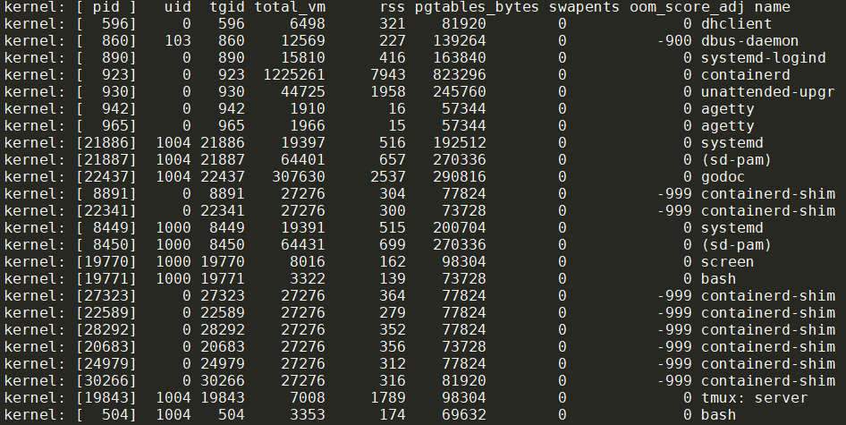
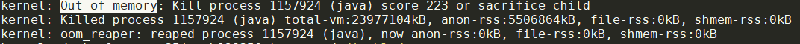
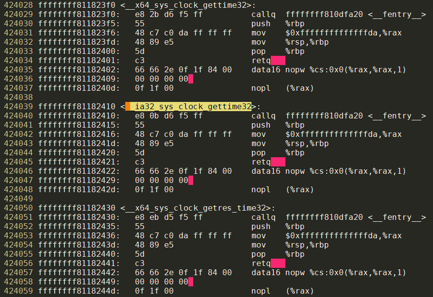
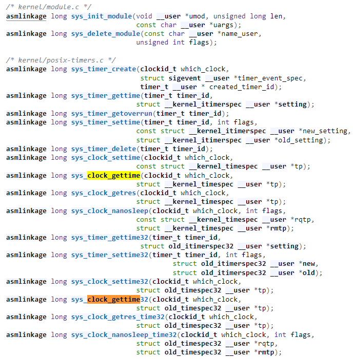
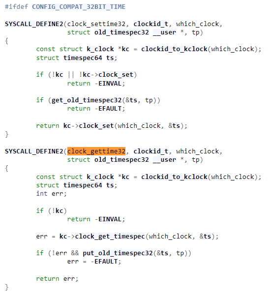

- [查看kernel的oom记录](#查看kernel的oom记录)
  - [oom的典型过程](#oom的典型过程)
- [ftrace调查ENOSYS问题](#ftrace调查enosys问题)
  - [背景](#背景)
  - [问题现象](#问题现象)
  - [调查](#调查)
    - [narrow down](#narrow-down)
    - [真的没有这个系统调用吗? `clock_gettime`调用的到底是什么?](#真的没有这个系统调用吗-clock_gettime调用的到底是什么)
    - [ftrace登场](#ftrace登场)
      - [谁调用了目标函数?](#谁调用了目标函数)
      - [目标函数又调用了什么其他函数?](#目标函数又调用了什么其他函数)
    - [`__ia32_sys_clock_gettime32` 返回ENOSYS?](#__ia32_sys_clock_gettime32-返回enosys)
      - [还有哪些函数可能有问题](#还有哪些函数可能有问题)
  - [解决](#解决)
  - [补充知识](#补充知识)
    - [vdso](#vdso)
    - [系统调用流程](#系统调用流程)

# 查看kernel的oom记录
用下面的命令看log
```shell
dmesg -Hk
```
但这个命令只能看最后的log, 因为kernel的log buffer是有限制的.

而在`/var/log/kern.log`, `/var/log/kern.log.{1,2,3,4,5}.gz`里面有所有kernel的记录, 同样的, `/var/log/syslog`是系统log的记录.

用下面的命令可以看全kernel log
```shell
journalctl -k
```

## oom的典型过程
通常是一个进程在申请内存时失败:  


kernel打印调用栈, 可以看到`out_of_memory`调用了`oom_kill_process`, 后者会打印一些内存信息, 并打印所有进程的内存  
  

最后选中一个oom_score分最高的kill掉  


如果不想被oom kill掉, 可以修改`/proc/pid/oom_score_adj`, 该值默认为0, 普通用户可以改大, 只有root才能改小.

# ftrace调查ENOSYS问题
## 背景
x86_64平台, cloud hypervisor启动VM, guest kernel版本是5.15, 64bit模式, 打开了`CONFIG_IA32_EMULATION=y`

rootfs是其他系统编译出来的, 32bit模式, 基于busybox.

## 问题现象
kernel启动后进入rootfs的`/init`->`/sbin/init`, 启动失败, 进入sh循环.
`date`命令显示系统时间不对, `strace date`发现如下错误:
```shell
clock_gettime(CLOCK_REALTIME, 0xffaf59ec) = -1 ENOSYS (Function not implemented)
```

## 调查
### narrow down
* 在有些系统中, `strace date`没有`clock_gettime`系统调用, 也能正确获取时间, 是什么原理?  
答: kernel给每个进程都自动插入了vdso, 用来加速`clock_gettime` `getimeofday`等系统调用. 在使用vdso的情况下, 不会触发系统调用, 但也会调用相应的内核函数.  
这里先假设由于某种原因, vdso机制没有生效, 因为我们这里的情况是, strace抓到了`clock_gettime`系统调用.  
vdso的知识详见下面的补充知识小节.

* `sh`能运行, 说明32bit的程序可以执行. 但为什么`date`不行?  
答: 经过实验, 发现似乎和时间相关的系统调用都不对, 比如`mkdir dddd`是成功的, 但`touch asdf`文件会失败, 错误也是ENOSYS  
`utimensat(AT_FDCWD, "asdf", [UTIME_NOW, UTIME_NOW], 0) = -1 ENOSYS (Function not implemented)`

### 真的没有这个系统调用吗? `clock_gettime`调用的到底是什么?
到这里就要用到ftrace了, 再复习一下, ftrace能回答两类关键的调用路径问题:
* 某个内核函数的执行过程中, 调用了哪些函数?
* 某个内核函数被什么路径调用的?

这里的第一个关键点在于, 我们到底是在调查哪个内核函数? 我们知道`clock_gettime`是C库角度看到的系统调用, 那内核对应的是哪个函数?
这里可以有两个办法:
* 使用原始的vmlinux, 用nm或者objdump等工具解析符号
* 用`/proc/kallsyms`

我们这里使用后者, 通常的kernel都会打开kallsyms选项:
```shell
# cat /proc/kallsyms | grep clock_gettime
ffffffff811823f0 W __x64_sys_clock_gettime32
ffffffff81182410 W __ia32_sys_clock_gettime32
ffffffff811e60c0 T __x64_sys_clock_gettime
ffffffff811e6180 T __ia32_sys_clock_gettime
ffffffff811e8720 t pc_clock_gettime
ffffffff81883370 t ptp_clock_gettime
ffffffff81885ca0 t ptp_vclock_gettime
```
再看看`utimensat`
```shell
# cat /proc/kallsyms | grep utimensat
ffffffff81182630 W __x64_sys_utimensat_time32
ffffffff81182650 W __ia32_sys_utimensat_time32
ffffffff813b5a40 T __x64_sys_utimensat
ffffffff813b5b00 T __ia32_sys_utimensat
```
注: 符号表的`W`表示后面的符号是个weak函数. 详见`man nm`

### ftrace登场
现在我们知道了要观察的函数, 下面就用ftrace回答这两个问题:
#### 谁调用了目标函数?
具体用法这里就不详细解释了, 直接给出命令:
```shell
# 因为我是在init非常初始阶段, 需要手动mount proc和sysfs
/bin/busybox mount -t proc none /proc
/bin/busybox mount -t sysfs none /sys

cd /sys/kernel/debug/tracing
# 把目标函数填入ftrace_filter, ftrace自己就会解析通配符
echo *clock_gettime* > set_ftrace_filter
# 打开function tracer
echo function > current_tracer
# 打开stack trace功能
echo 1 > options/func_stack_trace

# 执行目标命令触发目标函数调用
echo 1 > tracing_on
/bin/busybox date
/bin/busybox.alpine date
echo 0 > tracing_on
```

为了比较, 我执行了64位的date程序(`/bin/busybox.alpine date`时间是正确的), 结果如下:
```shell
         busybox-250     [000] ..... 21201.311547: __ia32_sys_clock_gettime32 <-__do_fast_syscall_32
         busybox-250     [000] ..... 21201.311619: <stack trace>
 => __ia32_sys_clock_gettime32
 => __do_fast_syscall_32
 => do_fast_syscall_32
 => do_SYSENTER_32
 => entry_SYSENTER_compat_after_hwframe
 
  busybox.alpine-254     [000] ..... 21671.440194: __x64_sys_clock_gettime <-do_syscall_64
  busybox.alpine-254     [000] ..... 21671.440490: <stack trace>
 => __x64_sys_clock_gettime
 => do_syscall_64
 => entry_SYSCALL_64_after_hwframe
```

#### 目标函数又调用了什么其他函数?
```shell
cd /sys/kernel/debug/tracing
echo 0 > tracing_on
echo *clock_gettime* > set_graph_function
echo function_graph > current_tracer
echo 1 > tracing_on
/bin/busybox date
/bin/busybox.alpine date
echo 0 > tracing_on
cat trace
```
结果:
```shell
/sys/kernel/debug/tracing # cat trace
# tracer: function_graph
#
# CPU  DURATION                  FUNCTION CALLS
# |     |   |                     |   |   |   |
 0) + 27.124 us   |  __ia32_sys_clock_gettime32();
 0)   0.305 us    |  __ia32_sys_clock_gettime32();
 ------------------------------------------
 0)  busybox-207   =>  busybox-210
 ------------------------------------------

 0)               |  __x64_sys_clock_gettime() {
 0)               |    posix_get_realtime_timespec() {
 0)   0.556 us    |      ktime_get_real_ts64();
 0)   1.819 us    |    }
 0)   0.934 us    |    put_timespec64();
 0) + 11.616 us   |  }
```

### `__ia32_sys_clock_gettime32` 返回ENOSYS?
现在看下来, `__ia32_sys_clock_gettime32`这个函数很可能返回ENOSYS.

对vmlinux做objdump, 能看到`__ia32_sys_clock_gettime32`以及前后几个类似的函数, 汇编都很短, 似乎不是正常的实现:  
  

从`include/linux/syscalls.h`看到  
  

追到`kernel/time/posix-timers.c`  
  
注意到这里有个编译开关: `CONFIG_COMPAT_32BIT_TIME`

#### 还有哪些函数可能有问题
以`__ia32`开头, 以`32`结尾的Weak函数:
```shell
/sys/kernel/debug/tracing # cat /proc/kallsyms | grep __ia32 | grep "32$"
ffffffff8117ee90 W __ia32_sys_io_getevents_time32
ffffffff8117ef10 W __ia32_sys_io_pgetevents_time32
ffffffff8117ef70 W __ia32_compat_sys_io_pgetevents_time32
ffffffff8117f610 W __ia32_sys_timerfd_settime32
ffffffff8117f690 W __ia32_sys_timerfd_gettime32
ffffffff8117f810 W __ia32_sys_futex_time32
ffffffff8117fe90 W __ia32_sys_mq_timedsend_time32
ffffffff8117ff10 W __ia32_sys_mq_timedreceive_time32
ffffffff81180410 W __ia32_sys_semtimedop_time32
ffffffff81181310 W __ia32_sys_recvmmsg_time32
ffffffff81181330 W __ia32_compat_sys_recvmmsg_time32
ffffffff81182150 W __ia32_sys_time32
ffffffff81182190 W __ia32_sys_stime32
ffffffff811821d0 W __ia32_sys_utime32
ffffffff81182210 W __ia32_sys_adjtimex_time32
ffffffff81182250 W __ia32_sys_sched_rr_get_interval_time32
ffffffff81182290 W __ia32_sys_nanosleep_time32
ffffffff811822d0 W __ia32_sys_rt_sigtimedwait_time32
ffffffff811822f0 W __ia32_compat_sys_rt_sigtimedwait_time32
ffffffff81182350 W __ia32_sys_timer_settime32
ffffffff81182390 W __ia32_sys_timer_gettime32
ffffffff811823d0 W __ia32_sys_clock_settime32
ffffffff81182410 W __ia32_sys_clock_gettime32
ffffffff81182450 W __ia32_sys_clock_getres_time32
ffffffff81182490 W __ia32_sys_clock_nanosleep_time32
ffffffff811824d0 W __ia32_sys_utimes_time32
ffffffff81182510 W __ia32_sys_futimesat_time32
ffffffff81182550 W __ia32_sys_pselect6_time32
ffffffff81182570 W __ia32_compat_sys_pselect6_time32
ffffffff811825d0 W __ia32_sys_ppoll_time32
ffffffff811825f0 W __ia32_compat_sys_ppoll_time32
ffffffff81182650 W __ia32_sys_utimensat_time32
ffffffff81182690 W __ia32_sys_clock_adjtime32
```

## 解决
在menuconfig里打开`CONFIG_COMPAT_32BIT_TIME`, 问题解决

## 补充知识
### vdso
vdso是`virtual ELF dynamic shared object`, 一般只有libc等非常基础的库才会和vdso打交道. `man vdso`里面摘要如下:
* 使用时
```c
#include <sys/auxv.h>
void *vdso = (uintptr_t) getauxval(AT_SYSINFO_EHDR);
```
* vdso是内核提供的一个小的共享库, 被内核自动map到每个进程的地址空间中. 
* vdso的出现是为了解决频繁使用系统调用的性能问题, 典型的场景是log里面为了打印时间戳而频繁调用`clock_gettime`. 这种场景下, 使用vdso能避免用户态和内核态的上下文切换的开销.
    * 比如32bit x86, 软件通过`int $0x80`软中断来触发系统调用, 但这个指令很**expensive**, 它会走完成的中断处理流程(部分发生在CPU的microcode, 部分发生在kernel)
    * 新的处理器有更快更专门的系统调用指令, vdso就提供了这样的封装, 使得libc不用自己去搞清楚该用哪个指令, vdso会自动处理好. 比如在vdso的作用下  
    > Now a call to gettimeofday(2) changes from a system call to a normal function call and a few memory accesses.
* `getauxval`这个API可以获取vdso的基地址, 这个地址上是个完整的ELF格式的文件. C库可以在第一次打开的时候查询里面的符号表, 找到可用的功能并缓存, 后面就不用再查询了.
* 函数符号的命名遵循惯例, 比如`gettimeofday`系统调用就对应vdso的`__vdso_gettimeofday`, 或者带`__kernel`前缀的.
* 用ldd可以看到vdso, 比如i386的`linux-gate.so.1`, 或者x86_64的`linux-vdso.so.1`
* strace抓不到vdso的"系统调用"

### 系统调用流程
从调用过程来看, 32bit app的syscall路径是:
```c
/*
 * 32-bit SYSENTER entry.
 *
 * 32-bit system calls through the vDSO's __kernel_vsyscall enter here
 * on 64-bit kernels running on Intel CPUs.
 *
 * The SYSENTER instruction, in principle, should *only* occur in the
 * vDSO.  In practice, a small number of Android devices were shipped
 * with a copy of Bionic that inlined a SYSENTER instruction.  This
 * never happened in any of Google's Bionic versions -- it only happened
 * in a narrow range of Intel-provided versions.
 *
 * SYSENTER loads SS, RSP, CS, and RIP from previously programmed MSRs.
 * IF and VM in RFLAGS are cleared (IOW: interrupts are off).
 * SYSENTER does not save anything on the stack,
 * and does not save old RIP (!!!), RSP, or RFLAGS.
 *
 * Arguments:
 * eax  system call number
 * ebx  arg1
 * ecx  arg2
 * edx  arg3
 * esi  arg4
 * edi  arg5
 * ebp  user stack
 * 0(%ebp) arg6
 */
//32bit的vdso调用从这里入口. vdso使用SYSENTER指令.
entry_SYSENTER_compat_after_hwframe @ arch/x86/entry/entry_64_compat.S
    do_SYSENTER_32 @ arch/x86/entry/common.c
        do_fast_syscall_32
            __do_fast_syscall_32
                //nr就是syscall的number
                int nr = syscall_32_enter(regs);
                unsigned int unr = nr;
                unr = array_index_nospec(unr, IA32_NR_syscalls);
                //查表syscall table, 得到具体处理函数并调用
                regs->ax = ia32_sys_call_table[unr](regs);
                __ia32_sys_clock_gettime32
```
上面用到了syscall table, 在:
```c
@ arch/x86/entry/syscall_32.c
#ifdef CONFIG_IA32_EMULATION
#define __SYSCALL_WITH_COMPAT(nr, native, compat)    __SYSCALL(nr, compat)
#else
#define __SYSCALL_WITH_COMPAT(nr, native, compat)    __SYSCALL(nr, native)
#endif

#define __SYSCALL(nr, sym) extern long __ia32_##sym(const struct pt_regs *);

#include <asm/syscalls_32.h>
#undef __SYSCALL

#define __SYSCALL(nr, sym) __ia32_##sym,
__visible const sys_call_ptr_t ia32_sys_call_table[] = {
#include <asm/syscalls_32.h>
};
```

做为对比, 64bit的syscall路径是:
```c
entry_SYSCALL_64_after_hwframe
    do_syscall_64
        __x64_sys_clock_gettime
```
