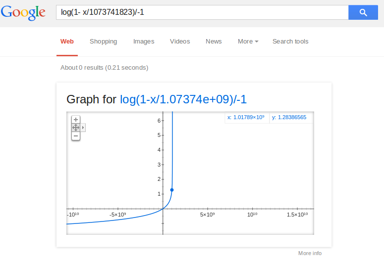
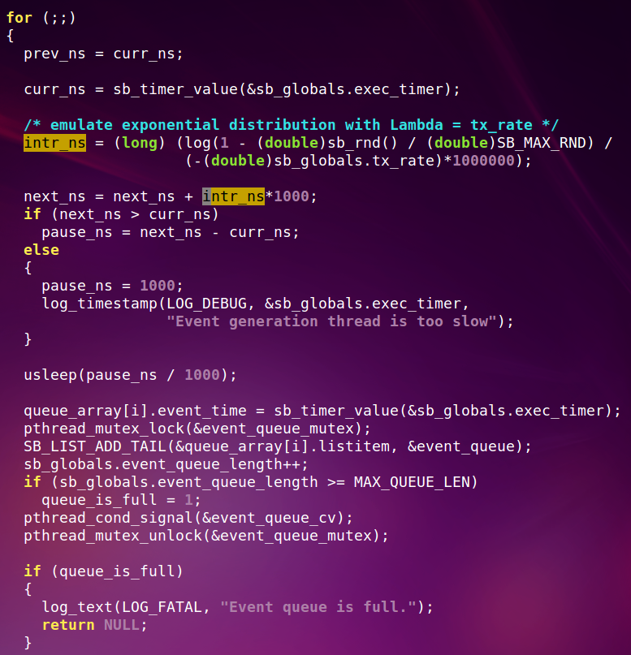

- [class的数据成员不用声明](#class的数据成员不用声明)
- [python 调用其他可执行文件](#python-调用其他可执行文件)
- [一个节拍发生器的算法](#一个节拍发生器的算法)
  - [补充:自然对数](#补充自然对数)
- [解析寄存器](#解析寄存器)
- [secureCRT停止所有linux启动脚本](#securecrt停止所有linux启动脚本)

# class的数据成员不用声明

```python
#!/usr/bin/python3

#类定义
class people:
    #定义基本属性
    name = ''
    age = 0
    #定义私有属性,私有属性在类外部无法直接进行访问
    __weight = 0
    #定义构造方法
    def __init__(self,n,a,w):
        self.name = n
        self.age = a
        self.__weight = w
    def speak(self):
        print("%s 说: 我 %d 岁。" %(self.name,self.age))

# 实例化类
p = people('runoob',10,30)
p.speak()
```

下面的代码有没有第6行的`name =  ''`都能正常运行, 结果都是
```
$ python3 test.py
runoob 说: 我 10 岁。
```
如果同时把第17行的self去掉, 只保留`name = n`, 那么相当于声明了函数的局部变量. 执行时会报错: people类没有name成员


# python 调用其他可执行文件
```python
#返回值是uint16, 高8位是executable的返回值
ret = os.system("/path/to/executable para1 para2")
```
# 一个节拍发生器的算法
`log(1- x/1073741823)/-1`  
  
```python
import math
import random
def test(rate, count):
    s = 0
    for i in range(count):
        r = math.log(1 - random.uniform(0,0x3fffffff)/0x3fffffff)/-rate
        s += r
        print r 
    print "avg rate: ", s/count
```
这个函数的牛逼之处在于, 虽然有random操作, 但最后的发生rate的平均值都在rate左右  
如果按平均值来说, 即使把0x3fffffff改为10, 平均值也是1
```python
>>> test(1, 140000)
0.999586366008
>>> test(1, 140000)
0.997003720261
>>> test(1, 140000)
1.00136841452
>>> test(1, 140000)
0.996789930059
>>> test(1, 140000)
1.00041864097
>>> test(1, 140000)
1.0004003745
>>> test(1, 140000)
1.00209053795
>>> test(1, 140000)
1.00115873931
>>> test(1, 140000)
0.997373828955
```
取自`sysbench --tx-rate`发生进程的算法, 这个进程每次先用这个函数算一个时间t, 然后sleep t的时间, 然后发令牌给其他线程;  
这样, 不管有多少个线程, 每个都在等令牌, 先到先得.  
  

## 补充:自然对数
`lim（1+1/x）^x＝e, e=2.71828`
> 举个例子：年利率100%，存1年，1元钱最多能变成多少？
如果存满1年，也就是n=1，那么1年后，
1*(1+1/1)^1=2，1元变成2元；
如果半年一存，让这半年的利息在下半年也生利息，也就是n=2，存满1年后，式子应该写作
1*(1+1/2)^2=2.25，1元变成2.25元，比第一种存法划算；
如果一个季度一存，每个季度的利息在后面的时间里也生利息，也就是n=4，式子写作
1*(1+1/4)^4 =2.44140625，比第二种存法还划算；
看上去，存的次数越多，每次存期越短，1年到期时的利息越多。但是数学告诉你，这个利息不是无限增加的，随着存的次数增多，1年后的本息合计趋于一个极限，也就是文中所提到的e。也就是说，在年利率为100%的情况下，不管你存得多么勤快，1年后1元钱最多变成e=2.71828182845904523536...元钱。


# 解析寄存器
```python
def reg_decode64(val, high=63, low=0):
    reg = bin(val)[2:]
    reg64 = '0' * (64 - len(reg)) + reg
    field = reg64[-1-high:-1-low] + reg64[-1-low]
    print 'Bin:', field
    print 'Dec:', int(field, 2)
    print 'Hex:', hex(int(field, 2))
```

# secureCRT停止所有linux启动脚本
```python
def main():
    crt.Screen.Synchronous = True
 
    while True:
        result = crt.Screen.WaitForStrings(["ISAM:Press 'f' to enter UBOOT prompt",
                                            "Starting linux",
                                            "To interrupt normal boot",
                                            "/isam/user #"])
        if result == 1:
            crt.Screen.Send("f\n")
        if result == 2:
            at_linux_shell = 0
        if result == 3 and at_linux_shell == 0:
            crt.Screen.Send("stop\n")
        if result == 4:
            at_linux_shell = 1

main()
```
