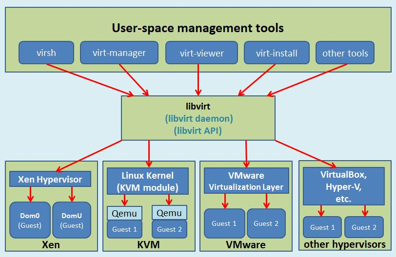
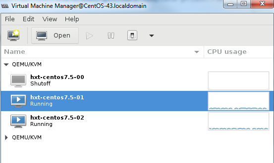
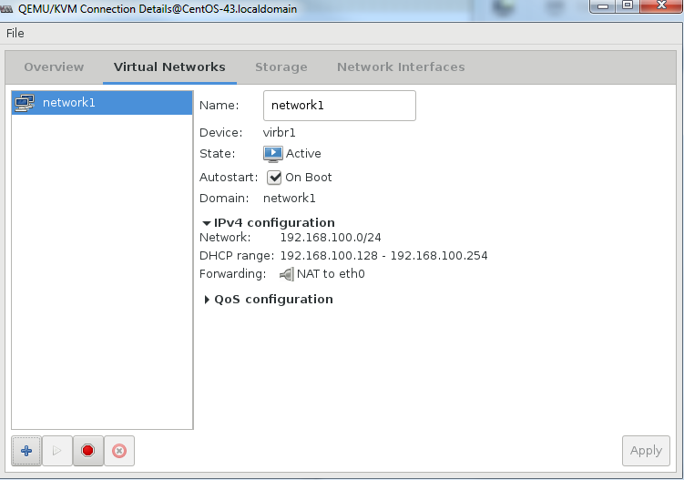
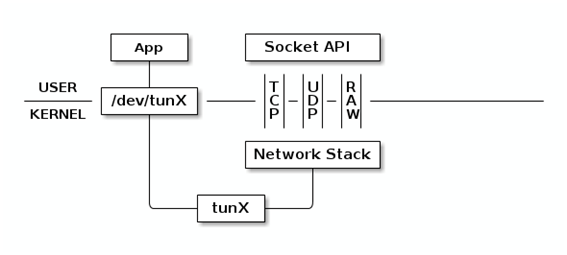
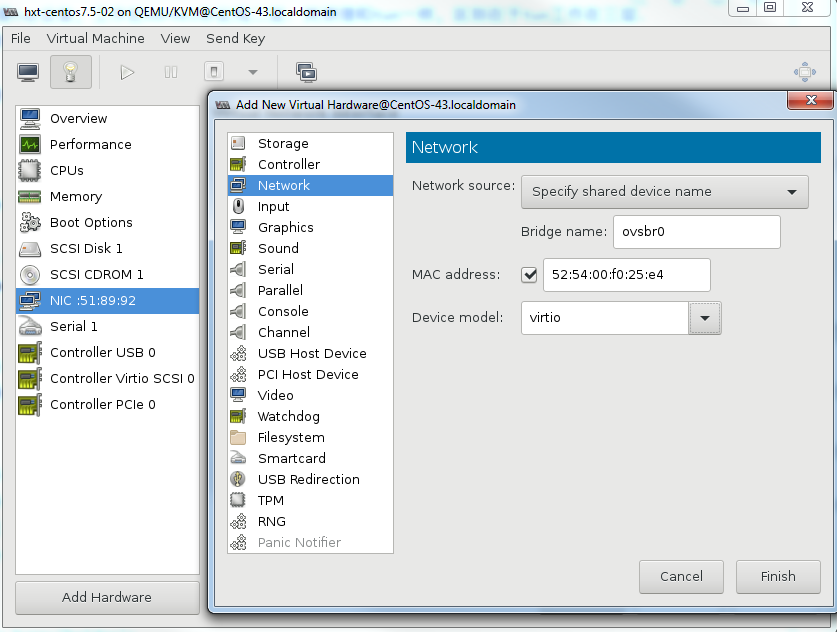

- [virsh常用命令](#virsh常用命令)
- [虚拟化环境准备](#虚拟化环境准备)
  - [安装qemu libvirt virt-manager等](#安装qemu-libvirt-virt-manager等)
  - [qemu编译安装(可选)](#qemu编译安装可选)
  - [libvirt编译安装高版本(可选)](#libvirt编译安装高版本可选)
    - [libvirt告警信息](#libvirt告警信息)
    - [libvirt介绍](#libvirt介绍)
  - [virt-manager安装高版本(可选)](#virt-manager安装高版本可选)
- [安装虚拟机](#安装虚拟机)
  - [UEFI支持](#uefi支持)
  - [qemu的user](#qemu的user)
  - [安装linux网桥工具](#安装linux网桥工具)
  - [创建虚拟机](#创建虚拟机)
    - [访问qemu的monitor](#访问qemu的monitor)
  - [虚拟机共享OS image](#虚拟机共享os-image)
    - [问题](#问题)
    - [解决](#解决)
- [虚拟网络](#虚拟网络)
  - [NAT网络](#nat网络)
  - [给VM添加OVS bridge](#给vm添加ovs-bridge)
    - [使用virt-manager直接添加](#使用virt-manager直接添加)
    - [使用virsh添加](#使用virsh添加)
    - [启动VM](#启动vm)
  - [给VM添加vhost接口](#给vm添加vhost接口)
    - [troubleshooting](#troubleshooting)
- [参考](#参考)


# virsh常用命令
```
# 查看VM接口信息, 包括MAC地址
$ sudo virsh domiflist hxt-centos7.5-01
```

# 虚拟化环境准备
## 安装qemu libvirt virt-manager等
```bash
sudo yum install -y qemu-kvm-ma qemu-img virt-manager libvirt libvirt-python libvirt-client virt-install virt-viewer
```

## qemu编译安装(可选)
可以使用内部git repo
```bash
#clone qemu
git clone ssh://1680532@bjsss013.hxtcorp.net:29418/virtualization/qemu
#使用2.10版本
git checkout stable-2.10
#或使用更新的2.12版本
git checkout stable-2.12
#我们还是习惯性的切换到新的编译器
scl enable devtoolset-6 bash
#编译安装
sudo yum install glib2-devel pixman-devel libfdt-devel libaio-devel libseccomp-devel
./configure --target-list=aarch64-softmmu --enable-kvm --enable-linux-aio --enable-seccomp
make -j
sudo make install -j
```
* 默认路径/usr/local
* 编译成功后, 有qemu-system-aarch64
* 不指定aarch64-softmmu的话, 默认编译的target list会很多, 其他架构如mips x86_64等也会编译
* 注意: 后面virt-manager实际使用的是`/usr/libexec/qemu-kvm`, 后者是`yum install qemu-kvm-ma`而来, 和这里的qemu-system-aarch64没有关系.

## libvirt编译安装高版本(可选)
```bash
#centos7.5默认版本为3.9, 这里用最新的4.6
wget https://libvirt.org/sources/libvirt-4.6.0.tar.xz
#依赖包
sudo yum install gnutls-devel gnutls-utils libnl-devel libxml2-devel device-mapper-devel libpciaccess-devel yajl-devel jansson-devel
sudo yum install dnsmasq dnsmasq-utils
#编译
./configure --with-qemu
make -j
#调试时建议不要install, 默认装到/usr/local; .service文件在/usr/local/lib/systemd/system/
#sudo make install -j
#运行
sudo systemctl start libvirtd
#或
sudo src/virtlogd &
sudo src/libvirtd
#virtsh是libvirt自带的命令行配置工具
sudo tools/virsh
#查看已经安装的虚拟机
sudo tools/virsh list --all
```
* 默认安装到`/usr/local/bin`
* 默认的socket是`/usr/local/var/run/libvirt/libvirt-sock`
* 注意`configure`时加`--with-qemu`, 我之前没加也能编译过, 但却缺少qemu/kvm的支持 : (
检查config.log, 寻找`QEMU:`应该为`yes`

### libvirt告警信息
libvirtd运行时有几个告警, 应该改掉
```
warning : virQEMUCapsInit:958 : Failed to get host CPU cache info
error : virCPUGetHost:457 : this function is not supported by the connection driver: cannot detect host CPU model for aarch64 architecture
warning : virLXCDriverCapsInit:82 : Failed to get host CPU cache info
warning : umlCapsInit:73 : Failed to get host CPU cache info
```

### libvirt介绍
  

## virt-manager安装高版本(可选)
```bash
#安装必须的包:
sudo yum install libvirt-glib libvirt-python libosinfo python-ipaddr python-requests gtk3 vte3 gtk-vnc2
#virt-manager是python脚本, 可以直接运行
wget https://virt-manager.org/download/sources/virt-manager/virt-manager-1.5.1.tar.gz
#解压后直接运行
cd virt-manager-1.5.1
#也可以安装, 默认安装到/usr/bin/
sudo ./setup.py install
#指定socket连接libvirtd
sudo ./virt-manager -c 'qemu+unix:///system?socket=/usr/local/var/run/libvirt/libvirt-sock'
```
> 本文使用MobaXterm来显示`virt-manager`的图形界面, 其原理是打开ssh的X11 forward功能, 用MobaXterm内置的X server来显示图形

* 用普通用户可能有`authentication unavailable: no polkit agent available to authenticate action 'org.libvirt.unix.manage'`错误, 解决办法: `sudo usermod --append --groups libvirt $(whoami)`
* X11 forward只对ssh的owner用户有效, 用`sudo`会导致GUI无法显示, 原因是x11里root用户也没有对当前普通用户session的权限, 解决方法: 把当前用户的授权记录加到root用户 `sudo xauth add $(xauth -f /home/bai/.Xauthority list | tail -1)`
* virsh或virt-manager支持remote方式连接hypervisor, 具体格式参考[remote URI](https://libvirt.org/guide/html/Application_Development_Guide-Architecture-Remote_URIs.html)
在本例中, 因为编译的libvirt默认路径与通常发行版的路径不同, 这里使用`qemu+unix`连接本地的socket.

# 安装虚拟机
## UEFI支持
* 安装UEFI  
简单来说就是先add一个repo`qemu-firmware-jenkins`, 再`yum install edk2.git-aarch64.noarch`
参考[KVM:UEFI](https://www.server-world.info/en/note?os=CentOS_7&p=kvm&f=11)
`rpm -ql`可以看到这个package里面的文件:
```bash
$ rpm -ql edk2.git-aarch64.noarch
/usr/share/edk2.git
/usr/share/edk2.git/aarch64
/usr/share/edk2.git/aarch64/QEMU_EFI-pflash.raw
/usr/share/edk2.git/aarch64/QEMU_EFI.fd
/usr/share/edk2.git/aarch64/QEMU_VARS.fd
/usr/share/edk2.git/aarch64/vars-template-pflash.raw
```
* 在`/etc/libvirt/qemu.conf`加入:
```
nvram = [
    "/usr/share/edk2.git/aarch64/QEMU_EFI-pflash.raw:/usr/share/edk2.git/vars-template-pflash.raw",
]
```
* 如果使用本文前面提到的手动编译的libvirt, 则要在`/usr/local/etc/libvirt/qemu.conf`里加入.

## qemu的user
qemu是用libvirtd起的, 在配置文件`/usr/local/etc/libvirt/qemu.conf`里, 改成如下, 使qemu的默认用户是root.
```
user = "root"
group = "root"
```

## 安装linux网桥工具
`sudo yum install bridge-utils`

## 创建虚拟机
新建一个虚拟机, 这里我们导入一个创建好的disk image(从ISO安装而来), 配置8 core/16384 mem;
其他基本上都是默认配置  
  
这里创建了三个VM, `hxt-centos7.5-00, hxt-centos7.5-01, hxt-centos7.5-02`
```bash
#导出xml配置文件
sudo tools/virsh dumpxml hxt-centos7.5-00 > ~/hxt-centos7.5-00.xml
#使用已有的配置文件创建虚拟机
sudo tools/virsh create ~/repo/save/vm/hxt-centos7.5-base.xml
```

### 访问qemu的monitor
```bash
#virsh访问qemu的monitor: --hmp是human monitor protocol的意思
#sudo virsh qemu-monitor-command <vm> --hmp <cmd>
sudo virsh qemu-monitor-command test --hmp help
#很有用的info命令族
sudo virsh qemu-monitor-command test --hmp info
#info qtree可以查看详细的设备信息
sudo virsh qemu-monitor-command test --hmp info qtree
```

## 虚拟机共享OS image
多个虚拟机的OS image通常都是基本相同的, 于是自然想创建一个base image, 几个VM共享它; 而且某个VM的改动, 只保存改变的部分, 能做到吗?
可以, qemu的qcow2, 就是qemu copy-on-write的缩写, 天然支持, 下面这个文章讲的非常清楚
[qemu qcow2 backing files & overlays](https://kashyapc.fedorapeople.org/virt/lc-2012/snapshots-handout.html)
前面我们用的image固定大小为32G, 为了节省空间, 先shrink
```bash
sudo cp hxt-centos7.5-base.qcow2 hxt-centos7.5-base.qcow2.back
#压缩后33G的image变成850M, 效果非常好
sudo qemu-img convert -O qcow2 -c hxt-centos7.5-base.qcow2.back hxt-centos7.5-base-shrink.qcow2
#比如我想用hxt-centos7.5-base.qcow2做基础image, 分别创建两个thin的image
sudo qemu-img create -f qcow2 -b hxt-centos7.5-base.qcow2 hxt-centos7.5-01.qcow2
sudo qemu-img create -f qcow2 -b hxt-centos7.5-base.qcow2 hxt-centos7.5-02.qcow2
#还可以commit在thin image上的改变, 因为用qemu-imag info能看出来它的backing image是谁
sudo qemu-img commit /guests/F21server.qcow2.snap
```
参考: https://dustymabe.com/2015/01/11/qemu-img-backing-files-a-poor-mans-snapshotrollback/

### 问题
**导入disk image失败, 现象是UEFI不能启动os image**, 经验证和shrink无关, 直接`cp`的image也不行, 似乎virt-manager新建VM时导入disk image功能**不正常**?
UEFI打印的错误信息:
```shell
!!!!!!!!  ProtectUefiImageCommon - Section Alignment(0x20) is incorrect  !!!!!!!!
FSOpen: Open '\EFI\BOOT\fbaa64.efi' Success
FSOpen: Open '\EFI\BOOT\fbaa64.efi' Success
Section 0 has negative size
Failed to load image: Unsupported
start_image() returned Unsupported
Error: Image at 0007BE8D000 start failed: Unsupported
Unloading driver at 0x0007BE8D000
Image Return Status = Unsupported
```
网上有人报这个错误, 是UEFI的问题:
https://bugzilla.redhat.com/show_bug.cgi?id=1527283

### 解决
除了要拷贝disk image, 还要拷贝uefi的VARS.fd文件, 比如
```bash
cd /usr/local/var/lib/libvirt/qemu/nvram
#拷贝之前可用的vars.fd
sudo cp hxt-centos7.5-01_VARS.fd hxt-centos7.5-base_VARS.fd
```

# 虚拟网络
## NAT网络
NAT网络用于Internet访问.

创建虚拟网络network1, 模式为`NAT to eth0`

NAT网络network1  
  

libvirtd创建了虚拟网桥virbr1, 以及对应三个VM的三个接口, 如下:
```bash
$ brctl show virbr1
bridge name     bridge id               STP enabled     interfaces
virbr1          8000.525400e10733       yes             virbr1-nic
                                                        vnet0
                                                        vnet1
                                                        vnet2
```
> 上面的vnetN是tap设备, 工作在kernel协议栈二层. 其原理和tun一样, 区别在于tun工作在三层.

tun/tap设备原理图  
  

进入VM, 配置网络, 测试外网连通性
```bash
dhclient eth0
ip addr
curl baidu.com
```
## 给VM添加OVS bridge
这里ovs已经运行并创建了一个bridge: ovsbr0
```bash
export PATH=$PATH:/usr/local/share/openvswitch/scripts
sudo ovs-ctl start
#打开dpdk初始化
sudo ovs-vsctl --no-wait set Open_vSwitch . other_config:dpdk-init=true
#新增一个bridge
sudo ovs-vsctl add-br ovsbr0 -- set bridge ovsbr0 datapath_type=netdev
```
### 使用virt-manager直接添加
点`Add Hardware`, 按下图添加ovsbr0

  

注意: 还要在xml里面加上`<virtualport type='openvswitch'/>`, 详见下一小节:
否则会出现错误: `Unable to add bridge ovsbr0 port vnet1: Operation not supported`

### 使用virsh添加
参考[Open vSwitch with Libvirt](http://docs.openvswitch.org/en/latest/howto/libvirt/)和[OpenVSwitch KVM libvirt](http://www.cwharvey.ca/post/openvswitch_on_gentoo/)

```bash
#这里使用libvirt-4.6.0源码目录
cd libvirt-4.6.0
#编辑xml, 加上下面的配置:
sudo tools/virsh edit hxt-centos7.5-01
```
```xml
    <interface type='bridge'>
      <mac address='52:54:00:38:fe:8c'/>
      <source bridge='ovsbr0'/>
      <virtualport type='openvswitch'/>
      <model type='virtio'/>
      <address type='pci' domain='0x0000' bus='0x04' slot='0x00' function='0x0'/>
    </interface>
```

### 启动VM
添加了OVS bridge以后启动VM, 这里我们启动2个VM, 可以看到libvirtd会自动创建相应的port:
```bash
$ sudo ovs-vsctl show
f81a1c52-91c1-40a2-b993-6dfeea09317e
    Bridge "ovsbr0"
        Port "vnet3"
            Interface "vnet3"
        Port "vnet1"
            Interface "vnet1"
        Port "ovsbr0"
            Interface "ovsbr0"
                type: internal
    ovs_version: "2.8.4"
```
> `vnet1`和`vnet3`是libvirtd在VM启动时创建的, 并会在VM关闭时销毁.

此时, 在VM里面配置好ip, 经验证两个VM可以互相ping通.

## 给VM添加vhost接口
这里要添加两个类型是dpdkvhostuser的端口
```bash
#增加两个port, 类型是dpdkvhostuser
sudo ovs-vsctl add-port ovsbr0 dpdkvhostuser0 -- set Interface dpdkvhostuser0 type=dpdkvhostuser
sudo ovs-vsctl add-port ovsbr0 dpdkvhostuser1 -- set Interface dpdkvhostuser1 type=dpdkvhostuser
```
手工修改xml文件`virsh edit <VM>`, 加入:
```xml
  <memoryBacking>
    <hugepages>
      <page size='512' unit='M' nodeset='0'/>
    </hugepages>
    
  <cpu mode='host-passthrough' check='none'>
    <topology sockets='1' cores='4' threads='1'/>
    <numa>
      <cell id='0' cpus='0-3' memory='8388608' unit='KiB' memAccess='shared'/>
    </numa>
  </cpu>
    
  <os>
    <type arch='aarch64' machine='virt'>hvm</type>
    
  <devices>
    <emulator>/usr/local/bin/qemu-system-aarch64</emulator>
    <interface type='vhostuser'>
      <mac address='00:00:00:00:00:01'/>
      <source type='unix' path='/usr/local/var/run/openvswitch/dpdkvhostuser0' mode='client'/>
      <model type='virtio'/>
      <driver queues='2'>
        <host mrg_rxbuf='on'/>
      </driver>
    </interface>
```
另外一个VM也相应修改, 注意`dpdkvhostuser0`变成`dpdkvhostuser1`
### troubleshooting
* 访问socket权限错误:
`Failed to connect socket /usr/local/var/run/openvswitch/dpdkvhostuser1: Permission denied`
解决方法:`sudo chmod a+rw /usr/local/var/run/openvswitch/`
参考: https://bugzilla.redhat.com/show_bug.cgi?id=1431556

* 默认的qemu-kvm不支持vhost-user
`Parameter 'type' expects a netdev backend type`
解决方法: 源码编译qemu, 在xml里用qemu-system-aarch64替代默认的qemu-kvm, 见上面
参考: https://bugzilla.redhat.com/show_bug.cgi?id=1539823

* 两个VM互相ping不通, VM里面收发包统计一直为0
    * 无效的尝试:
        * 去掉选项里面的`<host mrg_rxbuf='on'/>`
        * 改为`<host mrg_rxbuf='off'/>`
        * 去掉`<driver queues='2'>`
    * 解决方法: hugepage对应的node要配置`memAccess='shared'`
    参考: https://bugzilla.redhat.com/show_bug.cgi?id=1516114

# 参考
* [URI格式说明](https://libvirt.org/uri.html)
* [remote URI](https://libvirt.org/guide/html/Application_Development_Guide-Architecture-Remote_URIs.html)
