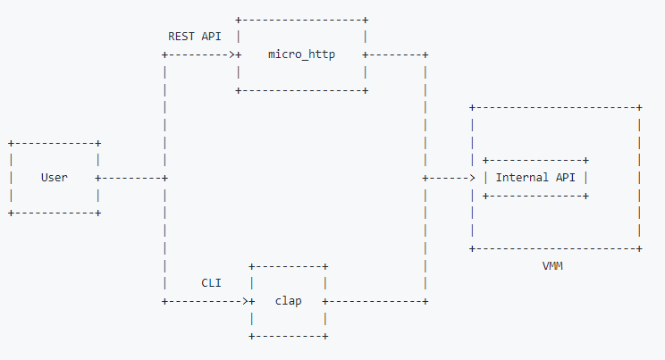
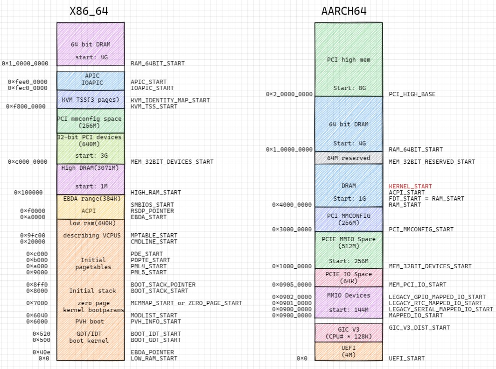

cloud hypervisor是一种基于rust-vmm的VMM实现. 它和其他VMM的对比在[这里](rust_vmm_brief.md)

# code walk in single picture
  

# 编译
```sh
git clone https://github.com/cloud-hypervisor/cloud-hypervisor.git
cd cloud-hypervisor/

# docker方式编译 -- 推荐
# 如果需要proxy, 在cmd_build函数docker run命令行加--env http_proxy="http://10.158.100.6:8080/"
scripts/dev_cli.sh build --release --libc musl
# 产生的bin: build/cargo_target/x86_64-unknown-linux-musl/release/cloud-hypervisor

# 本地方式编译, 完全静态链接版本要使用x86_64-unknown-linux-musl
rustup target add x86_64-unknown-linux-musl
# 完全静态版本一定要加--all, 还要安装musl-tools
sudo apt install musl-tools
cargo build --release --target=x86_64-unknown-linux-musl --all
# 产生的bin: target/x86_64-unknown-linux-musl/release/cloud-hypervisor
```
## build时可选的feature列表
```rust
#[cfg(target_arch = "x86_64")]
#[cfg(target_arch =  "aarch64")]

#[cfg(feature = "guest_debug")]
#[cfg(feature = "fwdebug")]
#[cfg(feature = "tdx")]
#[cfg(feature = "kvm")]
#[cfg(all(feature = "mshv", target_arch = "x86_64"))]
#[cfg(feature = "gdb")]
```

# REST API和CLI
cloud hypervisor以cli方式启动, 并启动http服务, 提供REST接口.
如果cli传入vmm的参数, 则http服务会根据后面的REST api来创建VM

## 先用cli创建一个empty的实例, 默认1vCPU, 512M内存.
```sh
$ ./target/debug/cloud-hypervisor --api-socket /tmp/cloud-hypervisor.sock
Cloud Hypervisor Guest
    API server: /tmp/cloud-hypervisor.sock
    vCPUs: 1
    Memory: 512 MB
    Kernel: None
    Kernel cmdline:
    Disk(s): None
```

## 随后用REST API来创建vm
```sh
curl --unix-socket /tmp/cloud-hypervisor.sock -i \
     -X PUT 'http://localhost/api/v1/vm.create'  \
     -H 'Accept: application/json'               \
     -H 'Content-Type: application/json'         \
     -d '{
         "cpus":{"boot_vcpus": 4, "max_vcpus": 4},
         "kernel":{"path":"/opt/clh/kernel/vmlinux-virtio-fs-virtio-iommu"},
         "cmdline":{"args":"console=ttyS0 console=hvc0 root=/dev/vda1 rw"},
         "disks":[{"path":"/opt/clh/images/focal-server-cloudimg-amd64.raw"}],
         "rng":{"src":"/dev/urandom"},
         "net":[{"ip":"192.168.10.10", "mask":"255.255.255.0", "mac":"12:34:56:78:90:01"}]
         }'
```
所有的json选项可在`vmm/src/config.rs`的`struct VmConfig`里面查看.
`struct VmConfig`用了rust的序列化框架`serde`, 把结构体直接映射成

## 然后boot这个实例
```sh
curl --unix-socket /tmp/cloud-hypervisor.sock -i -X PUT 'http://localhost/api/v1/vm.boot'
```

## 其他命令
```sh
# dump vm的config
curl --unix-socket /tmp/cloud-hypervisor.sock -i \
     -X GET 'http://localhost/api/v1/vm.info' \
     -H 'Accept: application/json'
     
# reboot vm
curl --unix-socket /tmp/cloud-hypervisor.sock -i -X PUT 'http://localhost/api/v1/vm.reboot'

# shut down
curl --unix-socket /tmp/cloud-hypervisor.sock -i -X PUT 'http://localhost/api/v1/vm.shutdown'
```

## cli和REST的关系
  

## http路由
`HTTP_ROUTES`是个全局变量
```rust
lazy_static! {
    /// HTTP_ROUTES contain all the cloud-hypervisor HTTP routes.
    pub static ref HTTP_ROUTES: HttpRoutes = {
        let mut r = HttpRoutes {
            routes: HashMap::new(),
        };

        r.routes.insert(endpoint!("/vm.add-device"), Box::new(VmActionHandler::new(VmAction::AddDevice(Arc::default()))));
        r.routes.insert(endpoint!("/vm.add-user-device"), Box::new(VmActionHandler::new(VmAction::AddUserDevice(Arc::default()))));
        r.routes.insert(endpoint!("/vm.add-disk"), Box::new(VmActionHandler::new(VmAction::AddDisk(Arc::default()))));
        r.routes.insert(endpoint!("/vm.add-fs"), Box::new(VmActionHandler::new(VmAction::AddFs(Arc::default()))));
        r.routes.insert(endpoint!("/vm.add-net"), Box::new(VmActionHandler::new(VmAction::AddNet(Arc::default()))));
        r.routes.insert(endpoint!("/vm.add-pmem"), Box::new(VmActionHandler::new(VmAction::AddPmem(Arc::default()))));
        r.routes.insert(endpoint!("/vm.add-vdpa"), Box::new(VmActionHandler::new(VmAction::AddVdpa(Arc::default()))));
        r.routes.insert(endpoint!("/vm.add-vsock"), Box::new(VmActionHandler::new(VmAction::AddVsock(Arc::default()))));
        r.routes.insert(endpoint!("/vm.boot"), Box::new(VmActionHandler::new(VmAction::Boot)));
        r.routes.insert(endpoint!("/vm.counters"), Box::new(VmActionHandler::new(VmAction::Counters)));
        r.routes.insert(endpoint!("/vm.create"), Box::new(VmCreate {}));
        r.routes.insert(endpoint!("/vm.delete"), Box::new(VmActionHandler::new(VmAction::Delete)));
        r.routes.insert(endpoint!("/vm.info"), Box::new(VmInfo {}));
        r.routes.insert(endpoint!("/vm.pause"), Box::new(VmActionHandler::new(VmAction::Pause)));
        r.routes.insert(endpoint!("/vm.power-button"), Box::new(VmActionHandler::new(VmAction::PowerButton)));
        r.routes.insert(endpoint!("/vm.reboot"), Box::new(VmActionHandler::new(VmAction::Reboot)));
        r.routes.insert(endpoint!("/vm.receive-migration"), Box::new(VmActionHandler::new(VmAction::ReceiveMigration(Arc::default()))));
        r.routes.insert(endpoint!("/vm.remove-device"), Box::new(VmActionHandler::new(VmAction::RemoveDevice(Arc::default()))));
        r.routes.insert(endpoint!("/vm.resize"), Box::new(VmActionHandler::new(VmAction::Resize(Arc::default()))));
        r.routes.insert(endpoint!("/vm.resize-zone"), Box::new(VmActionHandler::new(VmAction::ResizeZone(Arc::default()))));
        r.routes.insert(endpoint!("/vm.restore"), Box::new(VmActionHandler::new(VmAction::Restore(Arc::default()))));
        r.routes.insert(endpoint!("/vm.resume"), Box::new(VmActionHandler::new(VmAction::Resume)));
        r.routes.insert(endpoint!("/vm.send-migration"), Box::new(VmActionHandler::new(VmAction::SendMigration(Arc::default()))));
        r.routes.insert(endpoint!("/vm.shutdown"), Box::new(VmActionHandler::new(VmAction::Shutdown)));
        r.routes.insert(endpoint!("/vm.snapshot"), Box::new(VmActionHandler::new(VmAction::Snapshot(Arc::default()))));
        r.routes.insert(endpoint!("/vmm.ping"), Box::new(VmmPing {}));
        r.routes.insert(endpoint!("/vmm.shutdown"), Box::new(VmmShutdown {}));

        r
    };
}
```

## 内部channel
rust标准库的channel是mpsc, 创建channel:
```rust
// 编译器会从下文推断出这个channel传输的是ApiRequest
let (api_request_sender, api_request_receiver) = std::sync::mpsc::channel();
```
这个ApiRequest是个enum, 所有的http请求都定义在这;
注意这里回复还是一个Sender, 里面是ApiResponse.
这个就是rust版本的channel in channel: 发出http请求的一方, 构造请求和一个专有的Sender句柄给服务方, 并等待在对应的Receiver; 服务方把ApiResponse响应写回到这个Sender里面;
```rust
#[allow(clippy::large_enum_variant)]
#[derive(Debug)]
pub enum ApiRequest {
    /// Create the virtual machine. This request payload is a VM configuration
    /// (VmConfig).
    /// If the VMM API server could not create the VM, it will send a VmCreate
    /// error back.
    VmCreate(Arc<Mutex<VmConfig>>, Sender<ApiResponse>),

    /// Boot the previously created virtual machine.
    /// If the VM was not previously created, the VMM API server will send a
    /// VmBoot error back.
    VmBoot(Sender<ApiResponse>),

    /// Delete the previously created virtual machine.
    /// If the VM was not previously created, the VMM API server will send a
    /// VmDelete error back.
    /// If the VM is booted, we shut it down first.
    VmDelete(Sender<ApiResponse>),

    /// Request the VM information.
    VmInfo(Sender<ApiResponse>),

    /// Request the VMM API server status
    VmmPing(Sender<ApiResponse>),

    /// Pause a VM.
    VmPause(Sender<ApiResponse>),

    /// Resume a VM.
    VmResume(Sender<ApiResponse>),

    /// Get counters for a VM.
    VmCounters(Sender<ApiResponse>),

    /// Shut the previously booted virtual machine down.
    /// If the VM was not previously booted or created, the VMM API server
    /// will send a VmShutdown error back.
    VmShutdown(Sender<ApiResponse>),

    /// Reboot the previously booted virtual machine.
    /// If the VM was not previously booted or created, the VMM API server
    /// will send a VmReboot error back.
    VmReboot(Sender<ApiResponse>),

    /// Shut the VMM down.
    /// This will shutdown and delete the current VM, if any, and then exit the
    /// VMM process.
    VmmShutdown(Sender<ApiResponse>),

    /// Resize the VM.
    VmResize(Arc<VmResizeData>, Sender<ApiResponse>),

    /// Resize the memory zone.
    VmResizeZone(Arc<VmResizeZoneData>, Sender<ApiResponse>),

    /// Add a device to the VM.
    VmAddDevice(Arc<DeviceConfig>, Sender<ApiResponse>),

    /// Add a user device to the VM.
    VmAddUserDevice(Arc<UserDeviceConfig>, Sender<ApiResponse>),

    /// Remove a device from the VM.
    VmRemoveDevice(Arc<VmRemoveDeviceData>, Sender<ApiResponse>),

    /// Add a disk to the VM.
    VmAddDisk(Arc<DiskConfig>, Sender<ApiResponse>),

    /// Add a fs to the VM.
    VmAddFs(Arc<FsConfig>, Sender<ApiResponse>),

    /// Add a pmem device to the VM.
    VmAddPmem(Arc<PmemConfig>, Sender<ApiResponse>),

    /// Add a network device to the VM.
    VmAddNet(Arc<NetConfig>, Sender<ApiResponse>),

    /// Add a vDPA device to the VM.
    VmAddVdpa(Arc<VdpaConfig>, Sender<ApiResponse>),

    /// Add a vsock device to the VM.
    VmAddVsock(Arc<VsockConfig>, Sender<ApiResponse>),

    /// Take a VM snapshot
    VmSnapshot(Arc<VmSnapshotConfig>, Sender<ApiResponse>),

    /// Restore from a VM snapshot
    VmRestore(Arc<RestoreConfig>, Sender<ApiResponse>),

    /// Incoming migration
    VmReceiveMigration(Arc<VmReceiveMigrationData>, Sender<ApiResponse>),

    /// Outgoing migration
    VmSendMigration(Arc<VmSendMigrationData>, Sender<ApiResponse>),

    // Trigger power button
    VmPowerButton(Sender<ApiResponse>),
}
```

# 代码梳理 main
main函数在`cloud-hypervisor/src/main.rs`
```rust
fn main() {
    // Ensure all created files (.e.g sockets) are only accessible by this user
    let _ = unsafe { libc::umask(0o077) };

    //默认vCPU=1, 物理地址46bit; mem=512M; 使用/dev/urandom
    let (default_vcpus, default_memory, default_rng) = prepare_default_values();
    //使用了流行的cli库clap, 瀑布式的定义args
    //get_matches就是parse()命令行
    let cmd_arguments = create_app(&default_vcpus, &default_memory, &default_rng).get_matches();
    let exit_code = match start_vmm(cmd_arguments);
        //支持kvm或mshv, 编译时选择
        let hypervisor = hypervisor::new()
            let kvm_obj = Kvm::new()
            Ok(KvmHypervisor { kvm: kvm_obj })
        
        let vmm_thread = vmm::start_vmm_thread(
            env!("CARGO_PKG_VERSION").to_string(),
            &api_socket_path,
            api_socket_fd,
            api_evt.try_clone().unwrap(),
            http_sender,
            api_request_receiver,
            #[cfg(feature = "gdb")]
            gdb_socket_path,
            #[cfg(feature = "gdb")]
            debug_evt.try_clone().unwrap(),
            #[cfg(feature = "gdb")]
            vm_debug_evt.try_clone().unwrap(),
            &seccomp_action,
            hypervisor, //这个是上面的kvm实例化的hypervisor
        )
            let thread = {
                //新建thread做主event处理循环
                thread::Builder::new()
                    .name("vmm".to_string())
                    .spawn(move  || {
                        //新建vmm, 主要是注册event, 并没有开始真正干活
                        let mut vmm = Vmm::new(
                            vmm_version.to_string(),
                            api_event,
                            vmm_seccomp_action,
                            hypervisor,
                            exit_evt,
                        )?;
                            
                        //event循环
                        vmm.control_loop(Arc::new(api_receiver))
                            let epoll_fd = self.epoll.as_raw_fd();
                            //在loop里epoll wait, 并根据注册epoll add的token来分发
                            for event in events.iter().take(num_events) {
                                let dispatch_event: EpollDispatch = event.data.into();
                                match dispatch_event {
                                    EpollDispatch::Unknown => {}
                                    EpollDispatch::Exit => {}
                                    EpollDispatch::Reset => {}
                                    EpollDispatch::ActivateVirtioDevices => {}
                                    EpollDispatch::Api => {
                                        //consume 触发内部channel的eventfd
                                        self.api_evt.read().map_err(Error::EventFdRead)?;
                                        //处理内部channel过来的请求并返回结果
                                        let api_request = api_receiver.recv()
                                        match api_request {
                                            ApiRequest::VmCreate(config, sender) => {}
                                            ApiRequest::VmBoot(sender) => {}
                                            ...
                                        }
                                    }
                                }
                            }
                    }
            };
            // 起http线程, 用的是micro_http的库
            api::start_http_path_thread()
                let server = HttpServer::new_from_fd()
                start_http_thread(server)
                    hread::Builder::new() //新线程
                        loop {
                            match server.requests() {
                                Ok(request_vec) => {
                                    for server_request in request_vec {
                                        server.respond(server_request.process(
                                            |request| {
                                                handle_http_request(request, &api_notifier, &api_sender)
                                            }
                                        ))
                                    }
                                }
                            }
                        }
        
        //带api前缀的都是发http请求到vmm.control_loop的.
        vmm::api::vm_create()
        vmm::api::vm_boot()
        //或者vmm::api::vm_restore()
        vmm_thread.join()

    std::process::exit(exit_code);
}
```

## hypervisor的抽象
能在最顶层抽象一个hypervisor, 同时支持多种虚拟化技术.
用了抽象函数返回另一个抽象的模式, 即create_vm返回一个Vm trait object
```rust
///
/// Trait to represent a Hypervisor
///
/// This crate provides a hypervisor-agnostic interfaces
///
pub trait Hypervisor: Send + Sync {
    ///
    /// Create a Vm using the underlying hypervisor
    /// Return a hypervisor-agnostic Vm trait object
    ///
    fn create_vm(&self) -> Result<Arc<dyn Vm>>;
    ///
    /// Create a Vm of a specific type using the underlying hypervisor
    /// Return a hypervisor-agnostic Vm trait object
    ///
    fn create_vm_with_type(&self, _vm_type: u64) -> Result<Arc<dyn Vm>> {
        unreachable!()
    }
    #[cfg(target_arch = "x86_64")]
    ///
    /// Get the supported CpuID
    ///
    fn get_cpuid(&self) -> Result<CpuId>;
    ///
    /// Check particular extensions if any
    ///
    fn check_required_extensions(&self) -> Result<()> {
        Ok(())
    }
    #[cfg(target_arch = "x86_64")]
    ///
    /// Retrieve the list of MSRs supported by the hypervisor.
    ///
    fn get_msr_list(&self) -> Result<MsrList>;
    #[cfg(target_arch = "aarch64")]
    ///
    /// Retrieve AArch64 host maximum IPA size supported by KVM.
    ///
    fn get_host_ipa_limit(&self) -> i32;
    ///
    /// Retrieve TDX capabilities
    ///
    #[cfg(feature = "tdx")]
    fn tdx_capabilities(&self) -> Result<TdxCapabilities>;
}
```

### vm抽象基本上是基于kvm api的
```rust
///
/// Trait to represent a Vm
///
/// This crate provides a hypervisor-agnostic interfaces for Vm
///
pub trait Vm: Send + Sync {
    #[cfg(target_arch = "x86_64")]
    /// Sets the address of the one-page region in the VM's address space.
    fn set_identity_map_address(&self, address: u64) -> Result<()>;
    #[cfg(target_arch = "x86_64")]
    /// Sets the address of the three-page region in the VM's address space.
    fn set_tss_address(&self, offset: usize) -> Result<()>;
    /// Creates an in-kernel interrupt controller.
    fn create_irq_chip(&self) -> Result<()>;
    /// Registers an event that will, when signaled, trigger the `gsi` IRQ.
    fn register_irqfd(&self, fd: &EventFd, gsi: u32) -> Result<()>;
    /// Unregister an event that will, when signaled, trigger the `gsi` IRQ.
    fn unregister_irqfd(&self, fd: &EventFd, gsi: u32) -> Result<()>;
    /// Creates a new KVM vCPU file descriptor and maps the memory corresponding
    fn create_vcpu(&self, id: u8, vm_ops: Option<Arc<dyn VmOps>>) -> Result<Arc<dyn Vcpu>>;
    /// Registers an event to be signaled whenever a certain address is written to.
    fn register_ioevent(
        &self,
        fd: &EventFd,
        addr: &IoEventAddress,
        datamatch: Option<DataMatch>,
    ) -> Result<()>;
    /// Unregister an event from a certain address it has been previously registered to.
    fn unregister_ioevent(&self, fd: &EventFd, addr: &IoEventAddress) -> Result<()>;
    // Construct a routing entry
    fn make_routing_entry(&self, gsi: u32, config: &InterruptSourceConfig) -> IrqRoutingEntry;
    /// Sets the GSI routing table entries, overwriting any previously set
    fn set_gsi_routing(&self, entries: &[IrqRoutingEntry]) -> Result<()>;
    /// Creates a memory region structure that can be used with {create/remove}_user_memory_region
    fn make_user_memory_region(
        &self,
        slot: u32,
        guest_phys_addr: u64,
        memory_size: u64,
        userspace_addr: u64,
        readonly: bool,
        log_dirty_pages: bool,
    ) -> MemoryRegion;
    /// Creates a guest physical memory slot.
    fn create_user_memory_region(&self, user_memory_region: MemoryRegion) -> Result<()>;
    /// Removes a guest physical memory slot.
    fn remove_user_memory_region(&self, user_memory_region: MemoryRegion) -> Result<()>;
    /// Creates an emulated device in the kernel.
    fn create_device(&self, device: &mut CreateDevice) -> Result<Arc<dyn Device>>;
    /// Returns the preferred CPU target type which can be emulated by KVM on underlying host.
    #[cfg(any(target_arch = "arm", target_arch = "aarch64"))]
    fn get_preferred_target(&self, kvi: &mut VcpuInit) -> Result<()>;
    /// Enable split Irq capability
    #[cfg(target_arch = "x86_64")]
    fn enable_split_irq(&self) -> Result<()>;
    #[cfg(target_arch = "x86_64")]
    fn enable_sgx_attribute(&self, file: File) -> Result<()>;
    /// Retrieve guest clock.
    #[cfg(all(feature = "kvm", target_arch = "x86_64"))]
    fn get_clock(&self) -> Result<ClockData>;
    /// Set guest clock.
    #[cfg(all(feature = "kvm", target_arch = "x86_64"))]
    fn set_clock(&self, data: &ClockData) -> Result<()>;
    #[cfg(feature = "kvm")]
    /// Checks if a particular `Cap` is available.
    fn check_extension(&self, c: Cap) -> bool;
    /// Create a device that is used for passthrough
    fn create_passthrough_device(&self) -> Result<Arc<dyn Device>>;
    /// Get the Vm state. Return VM specific data
    fn state(&self) -> Result<VmState>;
    /// Set the VM state
    fn set_state(&self, state: VmState) -> Result<()>;
    /// Start logging dirty pages
    fn start_dirty_log(&self) -> Result<()>;
    /// Stop logging dirty pages
    fn stop_dirty_log(&self) -> Result<()>;
    /// Get dirty pages bitmap
    fn get_dirty_log(&self, slot: u32, base_gpa: u64, memory_size: u64) -> Result<Vec<u64>>;
    #[cfg(feature = "tdx")]
    /// Initalize TDX on this VM
    fn tdx_init(&self, cpuid: &CpuId, max_vcpus: u32) -> Result<()>;
    #[cfg(feature = "tdx")]
    /// Finalize the configuration of TDX on this VM
    fn tdx_finalize(&self) -> Result<()>;
    #[cfg(feature = "tdx")]
    /// Initalize a TDX memory region for this VM
    fn tdx_init_memory_region(
        &self,
        host_address: u64,
        guest_address: u64,
        size: u64,
        measure: bool,
    ) -> Result<()>;
}
```
### vmops
vm的op主要针对gpa, guest physical address
```rust
pub trait VmOps: Send + Sync {
    // 对guest dram来说的
    fn guest_mem_write(&self, gpa: u64, buf: &[u8]) -> Result<usize>;
    fn guest_mem_read(&self, gpa: u64, buf: &mut [u8]) -> Result<usize>;
    
    // 对guest mmio来说的
    fn mmio_read(&self, gpa: u64, data: &mut [u8]) -> Result<()>;
    fn mmio_write(&self, gpa: u64, data: &[u8]) -> Result<()>;
    
    // 对guest pio来说的
    #[cfg(target_arch = "x86_64")]
    fn pio_read(&self, port: u64, data: &mut [u8]) -> Result<()>;
    #[cfg(target_arch = "x86_64")]
    fn pio_write(&self, port: u64, data: &[u8]) -> Result<()>;
}
```

# cli create vm代码流程
命令行传入的kernel选项, 会被parse成vm config, 再创建vm
```rust
let vm_params = config::VmParams::from_arg_matches(&cmd_arguments);
let vm_config = config::VmConfig::parse(vm_params)

// Create and boot the VM based off the VM config we just built.
let sender = api_request_sender.clone();

vmm::api::vm_create(
    api_evt.try_clone().unwrap(),
    api_request_sender,
    Arc::new(Mutex::new(vm_config)),
)
```

这个vm_create就是给内部http服务发请求:
```rust
pub fn vm_create(
    api_evt: EventFd,
    api_sender: Sender<ApiRequest>,
    config: Arc<Mutex<VmConfig>>,
) -> ApiResult<()> {
    let (response_sender, response_receiver) = channel();

    // Send the VM creation request.
    api_sender
        .send(ApiRequest::VmCreate(config, response_sender))
        .map_err(ApiError::RequestSend)?;
    api_evt.write(1).map_err(ApiError::EventFdWrite)?;

    response_receiver.recv().map_err(ApiError::ResponseRecv)??;

    Ok(())
}
```

# REST API流程实例
## 用户发REST API
A user or operator sends an HTTP request to the Cloud Hypervisor [REST API](https://github.com/cloud-hypervisor/cloud-hypervisor/blob/main/docs/api.md#rest-api) in order to creates a virtual machine:
```sh
#!/bin/bash

 curl --unix-socket /tmp/cloud-hypervisor.sock -i \
     -X PUT 'http://localhost/api/v1/vm.create'  \
     -H 'Accept: application/json'               \
     -H 'Content-Type: application/json'         \
     -d '{
         "cpus":{"boot_vcpus": 4, "max_vcpus": 4},
         "kernel":{"path":"/opt/clh/kernel/vmlinux-virtio-fs-virtio-iommu"},
         "cmdline":{"args":"console=ttyS0 console=hvc0 root=/dev/vda1 rw"},
         "disks":[{"path":"/opt/clh/images/focal-server-cloudimg-amd64.raw"}],
         "rng":{"src":"/dev/urandom"},
         "net":[{"ip":"192.168.10.10", "mask":"255.255.255.0", "mac":"12:34:56:78:90:01"}]
         }'
```

## 这个VMM对应的http server响应请求
The Cloud Hypervisor HTTP thread processes the request and de-serializes the HTTP request JSON body into an internal `VmConfig` structure.
micro_http响应这个请求, 调用提前注册好的EndpointHandler:
```rust
// /api/v1/vm.create handler
pub struct VmCreate {}

impl EndpointHandler for VmCreate {
    fn handle_request(
        &self,
        req: &Request,
        api_notifier: EventFd,
        api_sender: Sender<ApiRequest>,
    ) -> Response {
        match req.method() {
            Method::Put => {
                match &req.body {
                    Some(body) => {
                        // Deserialize into a VmConfig
                        let vm_config: VmConfig = match serde_json::from_slice(body.raw())
                            .map_err(HttpError::SerdeJsonDeserialize)
                        {
                            Ok(config) => config,
                            Err(e) => return error_response(e, StatusCode::BadRequest),
                        };

                        // Call vm_create()
                        match vm_create(api_notifier, api_sender, Arc::new(Mutex::new(vm_config)))
                            .map_err(HttpError::ApiError)
                        {
                            Ok(_) => Response::new(Version::Http11, StatusCode::NoContent),
                            Err(e) => error_response(e, StatusCode::InternalServerError),
                        }
                    }

                    None => Response::new(Version::Http11, StatusCode::BadRequest),
                }
            }

            _ => error_response(HttpError::BadRequest, StatusCode::BadRequest),
        }
    }
}
```
### 从http的raw data里(json格式)解析VmConfig
```rust
let vm_config: VmConfig = match serde_json::from_slice(body.raw())
```
### vm_create使用内部channel向VMM的API发送请求
vm_create使用内部channel向VMM的API发送请求, 请求的内容是VmConfig, 并使用channel in channel来等待回复
```rust
VmCreate(Arc<Mutex<VmConfig>>, Sender<ApiResponse>)

    // 构造内部channel
    let (response_sender, response_receiver) = std::sync::mpsc::channel();
    // Send the VM creation request.
    api_sender
     .send(ApiRequest::VmCreate(config, response_sender))
     .map_err(ApiError::RequestSend)?;
    api_evt.write(1).map_err(ApiError::EventFdWrite)?;

    response_receiver.recv().map_err(ApiError::ResponseRecv)??;
```

## 内部channel处理请求
```rust
// Read from the API receiver channel
let api_request = api_receiver.recv().map_err(Error::ApiRequestRecv)?;
```

### 处理这次的VmCreate
The Cloud Hypervisor control loop matches the received internal API against the `VmCreate` payload, and extracts both the `VmConfig` structure and the [Sender](https://doc.rust-lang.org/std/sync/mpsc/struct.Sender.html) from the command payload. It stores the `VmConfig` structure and replies back to the sender ((The HTTP thread):
```rust
match api_request {
    ApiRequest::VmCreate(config, sender) => {
        // We only store the passed VM config.
        // The VM will be created when being asked to boot it.
        let response = if self.vm_config.is_none() {
            self.vm_config = Some(config);
            Ok(ApiResponsePayload::Empty)
        } else {
            Err(ApiError::VmAlreadyCreated)
        };

        sender.send(response).map_err(Error::ApiResponseSend)?;
    }
```
这里create vm并没有真正的create, 而只是保存vmconfig, 待到boot的时候再创建

## 返回response
可以看到, 用户的curl请求等到动作执行完毕后, 就会收到response

# impl Vmm
代码在`cloud-hypervisor/vmm/src/lib.rs`  
vm_create和vm_boot等真正执行在Vmm的方法里:
```rust
impl Vmm {
    new()
    vm_create()
    vm_boot()
}
```

## x86_64和aarch64的mem layout
  
和firecracker相比, cloudhypervisor重点在pci mmio.

## vm_boot
前面说过, vm_create只是保存vmconfig, 而vm_boot是真正创建并运行vm的地方
```rust
let vm = Vm::new(
    Arc::clone(vm_config),
    exit_evt,
    reset_evt,
    &self.seccomp_action,
    self.hypervisor.clone(),
    activate_evt,
    None,
    None,
    None,
)?;
    //vm代码在cloud-hypervisor/vmm/src/vm.rs
    let vm = hypervisor.create_vm().unwrap();
        //kvm ioctl KVM_CREATE_VM
        //return Arc::new(KvmVm {fd: vm_fd, state:  VmState {}, ...}
    //下面3个事x86独有
    vm.set_identity_map_address(KVM_IDENTITY_MAP_START.0)
    vm.set_tss_address(KVM_TSS_START.0 as usize)
    vm.enable_split_irq() //KVM_ENABLE_CAP
    let memory_manager = MemoryManager::new(vm.clone(), ...)
        //建立内存region Vec, 这个Vec的元素是(start, size, type)
        //比如一般内存分2G, [(0,2G,ram), (3G, 640M, SubRegion), (3G+640M, 大概200M, Reserved)]
        let arch_mem_regions = arch::arch_memory_regions(ram_size);
        //很复杂
        ...
        let allocator =
            SystemAllocator::new(
                io_base:0
                io_size: 64K
                platform_mmio_base: max_mem - 1M
                platform_mmio_size: 1M
                mmio_hole_base: 0xc000_0000
                mmio_hole_size: 640M
                X86_64_IRQ_BASE: 5
                irq_num: 24-5
            )
        //acpi在地址空间最后1M的platform mmio区域
        acpi_address = allocator.lock().unwrap().allocate_platform_mmio_addresses(MEMORY_MANAGER_ACPI_SIZE)
        //从0开始到start_of_device_area的区域是ram
        let ram_allocator = AddressAllocator::new(GuestAddress(0), start_of_device_area.0)
        let mut memory_manager = MemoryManager {
            boot_guest_memory,
            guest_memory,
            next_memory_slot,
            start_of_device_area,
            end_of_device_area,
            end_of_ram_area,
            vm,
            hotplug_slots,
            selected_slot,
            mergeable: config.mergeable,
            allocator,
            hotplug_method: config.hotplug_method,
            boot_ram,
            current_ram,
            next_hotplug_slot,
            shared: config.shared,
            hugepages: config.hugepages,
            hugepage_size: config.hugepage_size,
            prefault: config.prefault,
            user_provided_zones,
            snapshot_memory_ranges: MemoryRangeTable::default(),
            memory_zones,
            guest_ram_mappings: Vec::new(),
            acpi_address,
            log_dirty: dynamic, // Cannot log dirty pages on a TD
            arch_mem_regions,
            ram_allocator,
            dynamic,
        };
    memory_manager.allocate_address_space()?;
        for (zone_id, regions) in list {
            for (region, virtio_mem) in  regions {
                //ioctl KVM_SET_USER_MEMORY_REGION
                //记录user memory region和slot的关系到Vec<GuestRamMapping>
                self.guest_ram_mappings.push(GuestRamMapping {
                    gpa: region.start_addr().raw_value(),
                    size: region.len(),
                    slot,
                    zone_id: zone_id.clone(),
                    virtio_mem,
                    file_offset,
                });
            }
        }
        for 每个非ram的region
        self.ram_allocator
            .allocate(Some(region.start_addr()), region.len(), None)
                //内部使用BtreeMap来管理内存ranges, 把每个range insert到BtreeMap
                //应该都是针对guest 物理地址
                self.ranges.insert(new_addr, size);

    let new_vm = Vm::new_from_memory_manager(memory_manager, vm, ...)
        //1. 起一个后台线程load kernel
        //支持load ELF 或 firmware, firmware load到4G地址
        Self::load_kernel_async(&kernel, &memory_manager, &config)?
            linux_loader::loader::elf::Elf::load()
            linux_loader::loader::load_cmdline() //到CMDLINE_START地址
            //或者强制load firmware到4G-size地址, 并手动添加映射
        
        //2. create numa node
        //主要是从vm config里面提取config.memory_zones和config.distances信息填充到BTreeMap
        let numa_nodes = Self::create_numa_nodes()
        
        //3. 创建device manager, 见下面的详解
        //cloud-hypervisor/vmm/src/device_manager.rs
        let device_manager = DeviceManager::new(
            vm.clone(),
            config.clone(),
            memory_manager.clone(),
            &exit_evt,
            &reset_evt,
            seccomp_action.clone(),
            numa_nodes.clone(),
            &activate_evt,
            force_iommu,
            restoring,
            boot_id_list,
            timestamp,
        )
            /*
            1. 新建device tree: HashMap<String, DeviceNode>
            2. num_pci_segments默认为1, 可以配
            3. 确定device区域(其实就是PCI设备区域), 见上面layout图
            4. 新建address_manager
                {
                    allocator:  memory_manager.lock().unwrap().allocator(),
                    io_bus:  Arc::new(Bus::new()),
                    mmio_bus:  Arc::new(Bus::new()),
                    vm:  vm.clone(),
                    device_tree:  Arc::clone(&device_tree),
                    pci_mmio_allocators,
                }
            5. 新建msi_interrupt_manager, IOAPIC需要它, legacy_interrupt_manager需要IOAPIC
                gsi_msi_routes是个HashMap<u32, RoutingEntry>, 所有pci的device都共享这个gsi
                RoutingEntry对应kvm_irq_routing_entry
            6. 分配acpi_address
            7. 为pci预留legacy的中断slot: pci_irq_slots  = [0; 32];
            8. 新建默认的pci_segment, id为0, 一个pci segment包括一个pci root桥, 一个PCI bus
            9. 构建pci_segments Vec, 目前看包括id 0和id1的pci_segment
            10. 用上面的材料构建device_manager结构体
            11. 把device_manager insert到address_manager
            12. 返回device_manager
            */

        let memory = memory_manager.lock().unwrap().guest_memory();
        //只有x86有io bus
        let io_bus = Arc::clone(device_manager.lock().unwrap().io_bus());
        let mmio_bus = Arc::clone(device_manager.lock().unwrap().mmio_bus());
        //只有x86有pci io
        let pci_config_io =
            device_manager.lock().unwrap().pci_config_io() as Arc<Mutex<dyn BusDevice>>;
        
        //4. vm_ops
        let vm_ops: Arc<dyn VmOps> = Arc::new(VmOpsHandler {
            memory,
            #[cfg(target_arch = "x86_64")]
            io_bus,
            mmio_bus,
            #[cfg(target_arch = "x86_64")]
            pci_config_io,
        });
        
        //5. 创建cpu_manager 通过上面的device_manager memory_manager vm_ops来"操作"VM
        cpu::CpuManager::new()
        
        //6. 从文件准备initramfs
        //7. 构建vm结构体并返回
        Ok(Vm {
            #[cfg(any(target_arch = "aarch64", feature = "tdx"))]
            kernel,
            initramfs,
            device_manager,
            config,
            on_tty,
            threads: Vec::with_capacity(1),
            signals: None,
            state: RwLock::new(VmState::Created),
            cpu_manager,
            memory_manager,
            vm,
            #[cfg(all(feature = "kvm", target_arch = "x86_64"))]
            saved_clock: None,
            numa_nodes,
            seccomp_action: seccomp_action.clone(),
            exit_evt,
            #[cfg(all(feature = "kvm", target_arch = "x86_64"))]
            hypervisor,
            stop_on_boot,
            #[cfg(target_arch = "x86_64")]
            load_kernel_handle,
        })
    
    //根据vm config创建设备, 主要是pci的virtio设备, vfio设备等
    new_vm.device_manager.create_devices(serial_pty, console_pty, console_resize_pipe)
        /*
        1. 创建interrupt_controller
            对x86来说是IOAPIC, 它的上游是self.msi_interrupt_manager
            并把这个中断控制器添加到address_manager bus_devices 和device_tree
            对aarch64来说是GIC, gic::Gic::new(), 上游也是self.msi_interrupt_manager
        2. 创建legacy的interrupt_controller, 基于上面的interrupt_controller
        3. add_legacy_devices()
        4. add_acpi_devices()
        5. add_console_device()
        6. make_virtio_devices()
            let mut virtio_devices: Vec<MetaVirtioDevice> = Vec::new();
            make_virtio_block_devices()
            make_virtio_net_devices()
            make_virtio_rng_devices()
            make_virtio_fs_devices()
            make_virtio_pmem_devices()
            make_virtio_vsock_devices()
            make_virtio_mem_devices()
            make_virtio_balloon_devices()
            make_virtio_watchdog_devices()
            make_vdpa_devices()
        7. add_pci_devices(上面的virtio设备)
            创建iommu_device: virtio_devices::Iommu::new()
            //对每个virtio设备
            for handle in virtio_devices {
                add_virtio_pci_device() // 默认add到pci segment 0, 没有iommu, 没有dma
                    1. id为"xxx_virtio-pci"
                    2. 给这个pci device分配pci资源, bdf号等
                        (pci_segment_id, pci_device_bdf, resources) = self.pci_resources()
                    3. msi中断个数为queue个数+1
                    4. 创建virtio_pci_device
                        //Constructs a new PCI transport for the given virtio device.
                        virtio_pci_device =  VirtioPciDevice::new(
                            id,
                            memory,
                            virtio_device,
                            msix_num,
                            access_platform,
                            &self.msi_interrupt_manager,
                            pci_device_bdf.into(),
                            self.activate_evt,
                            use_64bit_bar, //除了virtio block都是64位.
                            dma_handler
                        )
                            每个queue都配一个eventfd
                            创建queues, queue有两个泛型参数
                            根据virtio规范, pci_device_id是0x1040+device_type.
                            创建interrupt group, 即把下面的每个irq都绑定一个eventfd到irq
                            配置msix_config
                            配置class, 比如PciClassCode::NetworkController等
                            组成configuration space需要的信息:
                            let configuration = PciConfiguration::new(
                                VIRTIO_PCI_VENDOR_ID,
                                pci_device_id,
                                0x1,  // For modern virtio-PCI devices
                                class,
                                subclass,
                                None,
                                PciHeaderType::Device,
                                VIRTIO_PCI_VENDOR_ID,
                                pci_device_id,
                                msix_config_clone,
                            );
                            组成virtio pci device
                            let mut virtio_pci_device = VirtioPciDevice {
                                id,
                                configuration,
                                common_config: VirtioPciCommonConfig {
                                    access_platform,
                                    driver_status: 0,
                                    config_generation: 0,
                                    device_feature_select: 0,
                                    driver_feature_select: 0,
                                    queue_select: 0,
                                    msix_config: Arc::new(AtomicU16::new(VIRTQ_MSI_NO_VECTOR)),
                                    msix_queues: Arc::new(Mutex::new(vec![VIRTQ_MSI_NO_VECTOR; num_queues])),
                                },
                                msix_config,
                                msix_num,
                                device,
                                device_activated: Arc::new(AtomicBool::new(false)),
                                interrupt_status: Arc::new(AtomicUsize::new(0)),
                                virtio_interrupt: None,
                                queues,
                                queue_evts,
                                memory: Some(memory),
                                settings_bar: 0,
                                use_64bit_bar,
                                interrupt_source_group,
                                cap_pci_cfg_info: VirtioPciCfgCapInfo::default(),
                                bar_regions: vec![],
                                activate_evt,
                                activate_barrier: Arc::new(Barrier::new(2)),
                                dma_handler,
                            };
                            //设置msix中断控制器
                            virtio_pci_device.virtio_interrupt = VirtioInterruptMsix::new()
                            return 这个virtio_pci_device
                            
                    5. add到pci, 返回bar地址信息
                        new_resources = self.add_pci_device(virtio_pci_device)
                            分配bar空间, 返回Vec<PciBarConfiguration>.这是PciDevice本身的方法
                            pci_bus.add_device() //添加到hashmap
                            记录这个Bus_device到bus_devices
                            pci_bus.register_mapping() //注册bar地址到device manager的MMIO Bus, 关联本BusDevice到这个bar地址
                    6. virtio设备的每个queue, 都有个"通知"地址 = bar地址base+NOTIFICATION_BAR_OFFSET+queue index*4, 每个通知地址都有一个eventfd
                        self.address_manager.register_ioevent()
                            调用KVM的KVM_IOEVENTFD ioctl
                    7. 把本设备加入到device_tree
            }
            add_vfio_devices()
            add_user_devices()
            self.bus_devices
                .push(Arc::clone(&segment.pci_config_mmio) as Arc<Mutex<dyn BusDevice>>);
        8. done
        self.virtio_devices = virtio_devices
        */

vm.boot()
    //新建thread处理signal: SIGWINCH, SIGTERM, SIGINT
    self.setup_signal_handler()
    //stdin设为raw mode
    self.setup_tty()
    //load kernel
    let entry_point = self.entry_point()
    self.cpu_manager.create_boot_vcpus()
        for each vcpu
            kvm create vcpu
    self.cpu_manager.start_boot_vcpus()
        for each vcpu
            创建新线程, 在里面loop:
                vcpu.run()
                    VcpuExit::IoIn
                    VcpuExit::IoOut
                    VcpuExit::Shutdown
                    VcpuExit::SystemEvent
                    VcpuExit::MmioRead
                    VcpuExit::MmioWrite
                    VcpuExit::Hyperv
```

## DeviceManager
### DeviceManager结构体
```rust
pub struct DeviceManager {
    // Manage address space related to devices
    address_manager: Arc<AddressManager>,

    // Console abstraction
    console: Arc<Console>,

    // console PTY
    console_pty: Option<Arc<Mutex<PtyPair>>>,

    // serial PTY
    serial_pty: Option<Arc<Mutex<PtyPair>>>,

    // Serial Manager
    serial_manager: Option<Arc<SerialManager>>,

    // pty foreground status,
    console_resize_pipe: Option<Arc<File>>,

    // Interrupt controller
    #[cfg(target_arch = "x86_64")]
    interrupt_controller: Option<Arc<Mutex<ioapic::Ioapic>>>,
    #[cfg(target_arch = "aarch64")]
    interrupt_controller: Option<Arc<Mutex<gic::Gic>>>,

    // Things to be added to the commandline (e.g. aarch64 early console)
    #[cfg(target_arch = "aarch64")]
    cmdline_additions: Vec<String>,

    // ACPI GED notification device
    ged_notification_device: Option<Arc<Mutex<devices::AcpiGedDevice>>>,

    // VM configuration
    config: Arc<Mutex<VmConfig>>,

    // Memory Manager
    memory_manager: Arc<Mutex<MemoryManager>>,

    // The virtio devices on the system
    virtio_devices: Vec<MetaVirtioDevice>,

    // List of bus devices
    // Let the DeviceManager keep strong references to the BusDevice devices.
    // This allows the IO and MMIO buses to be provided with Weak references,
    // which prevents cyclic dependencies.
    bus_devices: Vec<Arc<Mutex<dyn BusDevice>>>,

    // Counter to keep track of the consumed device IDs.
    device_id_cnt: Wrapping<usize>,

    pci_segments: Vec<PciSegment>,

    #[cfg_attr(target_arch = "aarch64", allow(dead_code))]
    // MSI Interrupt Manager
    msi_interrupt_manager: Arc<dyn InterruptManager<GroupConfig = MsiIrqGroupConfig>>,

    #[cfg_attr(feature = "mshv", allow(dead_code))]
    // Legacy Interrupt Manager
    legacy_interrupt_manager: Option<Arc<dyn InterruptManager<GroupConfig = LegacyIrqGroupConfig>>>,

    // Passthrough device handle
    passthrough_device: Option<Arc<dyn hypervisor::Device>>,

    // VFIO container
    // Only one container can be created, therefore it is stored as part of the
    // DeviceManager to be reused.
    vfio_container: Option<Arc<VfioContainer>>,

    // Paravirtualized IOMMU
    iommu_device: Option<Arc<Mutex<virtio_devices::Iommu>>>,
    iommu_mapping: Option<Arc<IommuMapping>>,

    // PCI information about devices attached to the paravirtualized IOMMU
    // It contains the virtual IOMMU PCI BDF along with the list of PCI BDF
    // representing the devices attached to the virtual IOMMU. This is useful
    // information for filling the ACPI VIOT table.
    iommu_attached_devices: Option<(PciBdf, Vec<PciBdf>)>,

    // Tree of devices, representing the dependencies between devices.
    // Useful for introspection, snapshot and restore.
    device_tree: Arc<Mutex<DeviceTree>>,

    // Exit event
    exit_evt: EventFd,
    reset_evt: EventFd,

    #[cfg(target_arch = "aarch64")]
    id_to_dev_info: HashMap<(DeviceType, String), MmioDeviceInfo>,

    // seccomp action
    seccomp_action: SeccompAction,

    // List of guest NUMA nodes.
    numa_nodes: NumaNodes,

    // Possible handle to the virtio-balloon device
    balloon: Option<Arc<Mutex<virtio_devices::Balloon>>>,

    // Virtio Device activation EventFd to allow the VMM thread to trigger device
    // activation and thus start the threads from the VMM thread
    activate_evt: EventFd,

    acpi_address: GuestAddress,

    selected_segment: usize,

    // Possible handle to the virtio-mem device
    virtio_mem_devices: Vec<Arc<Mutex<virtio_devices::Mem>>>,

    #[cfg(target_arch = "aarch64")]
    // GPIO device for AArch64
    gpio_device: Option<Arc<Mutex<devices::legacy::Gpio>>>,

    #[cfg(target_arch = "aarch64")]
    // Flash device for UEFI on AArch64
    uefi_flash: Option<GuestMemoryAtomic<GuestMemoryMmap>>,

    // Flag to force setting the iommu on virtio devices
    force_iommu: bool,

    // Helps identify if the VM is currently being restored
    restoring: bool,

    // io_uring availability if detected
    io_uring_supported: Option<bool>,

    // List of unique identifiers provided at boot through the configuration.
    boot_id_list: BTreeSet<String>,

    // Start time of the VM
    timestamp: Instant,
}
```

### DeviceManager方法
```rust
impl DeviceManager {
    new()
    serial_pty()
    console_pty()
    console_resize_pipe()
    create_devices()
    state()
    set_state()
    get_msi_iova_space()
    get_device_info()
    add_pci_devices()
    add_interrupt_controller()
    get_interrupt_controller()
    add_acpi_devices()
    add_legacy_devices()
    add_serial_device()
    modify_mode()
    set_raw_mode()
    add_virtio_console_device()
    add_console_device()
    make_virtio_devices()
        make_virtio_block_devices()
        make_virtio_net_devices()
        make_virtio_rng_devices()
        make_virtio_fs_devices()
        make_virtio_pmem_devices()
        make_virtio_vsock_devices()
        make_virtio_mem_devices()
        make_virtio_balloon_devices()
        make_virtio_watchdog_devices()
        make_vdpa_devices()
    next_device_name()
    add_passthrough_device()
    create_vfio_container()
    add_vfio_devices()
    add_vfio_user_device()
    add_pci_device()
    add_virtio_pci_device()
    pci_resources()
    io_bus()
    mmio_bus()
    allocator() //address_manager.allocator
    interrupt_controller()
    pci_config_io()
    pci_segments()
    console()
    cmdline_additions()
    update_memory()
    activate_virtio_devices()
    notify_hotplug()
    add_device()
    add_user_device()
    remove_device()
    eject_device()
    hotplug_virtio_pci_device()
    is_iommu_segment()
    add_disk()
    add_fs()
    add_pmem()
    add_net()
    add_vdpa()
    add_vsock()
    counters()
    resize_balloon()
    device_tree()
    restore_devices()
    notify_power_button()
    iommu_attached_devices()
    uefi_flash()
    validate_identifier()
}
```

#### DeviceNode包括id, 资源, 层级, pci信息
尤其是每个Device都是PCI的device
```rust
#[derive(Clone, Serialize, Deserialize)]
pub struct DeviceNode {
    pub id: String,
    pub resources: Vec<Resource>,
    pub parent: Option<String>,
    pub children: Vec<String>,
    #[serde(skip)]
    pub migratable: Option<Arc<Mutex<dyn Migratable>>>,
    pub pci_bdf: Option<PciBdf>,
    #[serde(skip)]
    pub pci_device_handle: Option<PciDeviceHandle>,
}
```

### PCI segment
```rust
pub(crate) struct PciSegment {
    pub(crate) id: u16,
    pub(crate) pci_bus: Arc<Mutex<PciBus>>,
    pub(crate) pci_config_mmio: Arc<Mutex<PciConfigMmio>>,
    pub(crate) mmio_config_address: u64,

    #[cfg(target_arch = "x86_64")]
    pub(crate) pci_config_io: Option<Arc<Mutex<PciConfigIo>>>,

    // Bitmap of PCI devices to hotplug.
    pub(crate) pci_devices_up: u32,
    // Bitmap of PCI devices to hotunplug.
    pub(crate) pci_devices_down: u32,
    // List of allocated IRQs for each PCI slot.
    pub(crate) pci_irq_slots: [u8; 32],

    // Device memory covered by this segment
    pub(crate) start_of_device_area: u64,
    pub(crate) end_of_device_area: u64,

    pub(crate) allocator: Arc<Mutex<AddressAllocator>>,
}
```

pci的config空间是vmm的一个结构体:
```rust
/// Contains the configuration space of a PCI node.
/// See the [specification](https://en.wikipedia.org/wiki/PCI_configuration_space).
/// The configuration space is accessed with DWORD reads and writes from the guest.
pub struct PciConfiguration {
    registers: [u32; NUM_CONFIGURATION_REGISTERS],
    writable_bits: [u32; NUM_CONFIGURATION_REGISTERS], // writable bits for each register.
    bars: [PciBar; NUM_BAR_REGS],
    rom_bar_addr: u32,
    rom_bar_size: u32,
    rom_bar_used: bool,
    // Contains the byte offset and size of the last capability.
    last_capability: Option<(usize, usize)>,
    msix_cap_reg_idx: Option<usize>,
    msix_config: Option<Arc<Mutex<MsixConfig>>>,
}
```

new一个segment
```rust
impl  PciSegment {
    pub(crate) fn  new() {
        1. 新建一个pci root桥
            默认是VENDOR_ID_INTEL(0x8086)和DEVICE_ID_INTEL_VIRT_PCIE_HOST(0xD57)
            PciClassCode::BridgeDevice
            &PciBridgeSubclass::HostBridge
            PciHeaderType::Device
        2. 新建PCI bus, PCI bus用hashmap来管理pci 设备: HashMap<u32, Arc<Mutex<dyn  PciDevice>>>
        3. 新建pci_config_mmio, 一个就是一个PciBus实例
        4. 把pci_config_mmio insert到address_manager的mmio_bus
        5. 组装一个segment并返回
    }
}
```

### PciBus
```rust
impl PciBus {
    new()
    register_mapping()
    add_device()
    remove_by_device()
    next_device_id()
    get_device_id()
    put_device_id()
}
```

### PciDevice
```rust
pub trait PciDevice: BusDevice {
    allocate_bars()
    free_bars()
    write_config_register()
    read_config_register()
    detect_bar_reprogramming()
    read_bar()
    write_bar()
    move_bar()
    as_any()
    id()
}
```

# virtio设备
## virtionet
代码`cloud-hypervisor/virtio-devices/src/net.rs`
```rust
//主要是创建tap设备, 配置virtio net的属性
make_virtio_net_devices()
    1. 生成id, 即xxx_net
    2. 支持vhost user, 但一般还是virtio-net对接tap设备
        virtio_devices::Net::new()
            tap设备有名就open有名的, 没名就默认叫vmtap%d
            tap设备可以配IP
            这里为了模拟多queue, 使用了多个tap
            Self::new_with_tap()
                设置feature标记各种offload, tso, 多队列
                Ok(Net {
                    common: VirtioCommon {
                        device_type: VirtioDeviceType::Net as u32,
                        avail_features,
                        queue_sizes: vec![queue_size; queue_num],
                        paused_sync: Some(Arc::new(Barrier::new((num_queues / 2) + 1))),
                        min_queues: 2,
                        ..Default::default()
                    },
                    id,
                    taps,
                    config,
                    ctrl_queue_epoll_thread: None,
                    counters: NetCounters::default(),
                    seccomp_action,
                    rate_limiter_config,
                    exit_evt,
                })
    3. 插入到设备树
        self.device_tree.insert()
    4. 返回MetaVirtioDevice
        Ok(MetaVirtioDevice {
            virtio_device,
            iommu: net_cfg.iommu,
            id,
            pci_segment: net_cfg.pci_segment,
            dma_handler: None,
        })
```
### Net结构体
```rust
pub struct Net {
    common: VirtioCommon,
    id: String,
    taps: Vec<Tap>,
    config: VirtioNetConfig,
    ctrl_queue_epoll_thread: Option<thread::JoinHandle<()>>,
    counters: NetCounters,
    seccomp_action: SeccompAction,
    rate_limiter_config: Option<RateLimiterConfig>,
    exit_evt: EventFd,
}
```

### impl VirtioDevice for Net
```rust
impl VirtioDevice for Net {
    device_type()
    queue_max_sizes()
    features()
    ack_features()
    read_config()
    activate() //这里应该是入口
    reset()
    counters()
    set_access_platform()
}
```

#### activate
在`vmm.control_loop`的事件循环里, 会有`EpollDispatch::ActivateVirtioDevices`事件来触发virtio设备的使能:
```rust
fn activate {
    1. self.common.activate()
    2. 创建NetCtrlEpollHandler, 起个线程"_net1_ctrl", 在里面epoll循环处理ctrl queue的事件
    3. 每个q都创建NetEpollHandler, 起个线程"_net1_qp%i", 在epoll里循环处理data queue的事件
}
```

data queue的事件:
```rust
match  ev_type {
    RX_QUEUE_EVENT: self.handle_rx_event()
    TX_QUEUE_EVENT: self.handle_tx_event()
    TX_TAP_EVENT: self.handle_tx_event()
    RX_TAP_EVENT: self.handle_rx_tap_event()
    还有rate limit事件...
}
```

#### NetQueuePair
`cloud-hypervisor/net_util/src/queue_pair.rs`
前面的事件, 最后都会落脚到
```rust
impl NetQueuePair {
    process_tx()
        self.tx.process_desc_chain()
            基本上就是在循环里直接操作desc指向的buffer, 最后调用libc::writev把这些buffer写到tap的fd里面.
            最后更新used index
    process_rx()
        self.rx.process_desc_chain
            基本上是从desc链的信息中, 找到guest driver提前准备好的buffer, 组成iovecs, 用libc::readv函数读到这个iovecs里
}
```

### 其他trait
Net还满足:
* Drop trait
* Pausable trait
* Snapshottable trait
* Transportable trait
* Migratable trait

## virtio block
```rust
make_virtio_block_device()
    1. 生成id, 一般是xxx_disk
    2. 支持vhost user对接spdk
    3. 打开块设备文件, 支持qcow2, vhd和raw, 返回一个trait object: Box<dyn  DiskFile>
    4. 传入上面的材料, 创建virtio block设备
        virtio_devices::Block::new()
            设置feature标记, FLUSH, CONFIG_WCE, BLK_SIZE, TOPOLOGY
            计算disk参数, 比如block size, sector个数, writeback, 多队列等
            返回Block设备
            Ok(Block {
                common: VirtioCommon {
                    device_type: VirtioDeviceType::Block as u32,
                    avail_features,
                    paused_sync: Some(Arc::new(Barrier::new(num_queues + 1))),
                    queue_sizes: vec![queue_size; num_queues],
                    min_queues: 1,
                    ..Default::default()
                },
                id,
                disk_image,
                disk_path,
                disk_nsectors,
                config,
                writeback: Arc::new(AtomicBool::new(true)),
                counters: BlockCounters::default(),
                seccomp_action,
                rate_limiter_config,
                exit_evt,
            })
    5. 插入到设备树
        self.device_tree.insert()
    6. 返回MetaVirtioDevice
        Ok(MetaVirtioDevice {
            virtio_device,
            iommu: net_cfg.iommu,
            id,
            pci_segment: net_cfg.pci_segment,
            dma_handler: None,
        })
```

# IO Bus和MMIO Bus
顶层的device manager包括两个bus:
* io bus  
只有x86有io bus
* mmio bus  
mmio bus是最常用的.

io或者mmio的Bus抽象都是一个BtreeMap, 靠地址range来路由读写操作到底指向哪个具体的设备
```rust
pub struct Bus {
    devices: RwLock<BTreeMap<BusRange, Weak<Mutex<dyn BusDevice>>>>,
}
```
Bus设备必须有offset读写的方法
```rust
pub trait BusDevice: Send {
    /// Reads at `offset` from this device
    fn read(&mut self, base: u64, offset: u64, data: &mut [u8]) {}
    /// Writes at `offset` into this device
    fn write(&mut self, base: u64, offset: u64, data: &[u8]) -> Option<Arc<Barrier>> {
        None
    }
}
```
注: 对比firecracker的Bus定义, 和这里差不多:
```rust
pub struct Bus {
    //bus下面是BtreeMap管理的device
    devices: BTreeMap<BusRange, Arc<Mutex<dyn BusDevice>>>,
}
```

## Bus方法
一个BusDevice对应一个地址范围
```rust
impl Bus {
    new()
    //根据地址找上一个设备
    resolve(&self, addr: u64) -> Option<(u64, u64, Arc<Mutex<dyn BusDevice>>)>
    //在指定地址范围插入设备
    insert(&self, device: Arc<Mutex<dyn BusDevice>>, base: u64, len: u64)
    //删除指定地址范围的设备
    remove(&self, base: u64, len: u64)
    //读写
    read(&self, addr: u64, data: &mut [u8])
    write(&self, addr: u64, data: &[u8])
}
```

# 中断
和硬件的irq稍有区别, virt irq在这里被叫做`Interrupt Source`

> A device may support multiple types of interrupts, and each type of interrupt may support one or multiple interrupt sources. For example, a PCI device may support:
* Legacy Irq: exactly one interrupt source.
* PCI MSI Irq: 1,2,4,8,16,32 interrupt sources.
* PCI MSIx Irq: 2^n(n=0-11) interrupt sources.

一个设备可以有多个中断源, 比如MSI可以有32个源, MSIx可以有4096个源.

> A distinct Interrupt Source Identifier (ISID) will be assigned to each interrupt source.
An ID allocator will be used to allocate and free Interrupt Source Identifiers for devices.
To decouple the vm-device crate from the ID allocator, the vm-device crate doesn't take the
responsibility to allocate/free Interrupt Source IDs but only makes use of assigned IDs.

每个中断源都被分配一个ID, 即ISID. vm-device只负责使用这些ID

> The overall flow to deal with interrupts is:
* The VMM creates an interrupt manager
* The VMM creates a device manager, passing on an reference to the interrupt manager
* The device manager passes on an reference to the interrupt manager to all registered devices
* The guest kernel loads drivers for virtual devices
* The guest device driver determines the type and number of interrupts needed, and update the device configuration
* The virtual device backend requests the interrupt manager to create an interrupt group
  according to guest configuration information
  
中断并不是在一开始就固定分配好的, 而是需要guest kernel驱动来触发.
VMM创建好中断管理器后, 由设备管理器把中断控制器的引用传递给每个具体的设备;
guest kernel驱动在初始化虚拟设备的时候, 决定自己的中断类型, 比如MSI, 和中断个数;
对应虚拟设备的backend根据guest驱动提供的信息, 向中断管理器请求创建一个中断group.

## interrupt group
InterruptManager只有两个API, `create_group()`和`destroy_group()`, 用于新建/销毁 InterruptSourceGroup
```rust
/// Trait to manage interrupt sources for virtual device backends.
///
/// The InterruptManager implementations should protect itself from concurrent accesses internally,
/// so it could be invoked from multi-threaded context.
pub trait InterruptManager: Send + Sync {
    type GroupConfig;

    /// Create an [InterruptSourceGroup](trait.InterruptSourceGroup.html) object to manage
    /// interrupt sources for a virtual device
    ///
    /// An [InterruptSourceGroup](trait.InterruptSourceGroup.html) object manages all interrupt
    /// sources of the same type for a virtual device.
    ///
    /// # Arguments
    /// * interrupt_type: type of interrupt source.
    /// * base: base Interrupt Source ID to be managed by the group object.
    /// * count: number of Interrupt Sources to be managed by the group object.
    fn create_group(&self, config: Self::GroupConfig) -> Result<Arc<dyn InterruptSourceGroup>>;

    /// Destroy an [InterruptSourceGroup](trait.InterruptSourceGroup.html) object created by
    /// [create_group()](trait.InterruptManager.html#tymethod.create_group).
    ///
    /// Assume the caller takes the responsibility to disable all interrupt sources of the group
    /// before calling destroy_group(). This assumption helps to simplify InterruptSourceGroup
    /// implementations.
    fn destroy_group(&self, group: Arc<dyn InterruptSourceGroup>) -> Result<()>;
}
```

InterruptSourceGroup负责具体中断的维护: 使能/禁止/向guest注入中断/更新中断配置
```rust
pub trait InterruptSourceGroup: Send + Sync {
    /// Enable the interrupt sources in the group to generate interrupts.
    fn enable(&self) -> Result<()> {
        // Not all interrupt sources can be enabled.
        // To accommodate this, we can have a no-op here.
        Ok(())
    }

    /// Disable the interrupt sources in the group to generate interrupts.
    fn disable(&self) -> Result<()> {
        // Not all interrupt sources can be disabled.
        // To accommodate this, we can have a no-op here.
        Ok(())
    }

    /// Inject an interrupt from this interrupt source into the guest.
    fn trigger(&self, index: InterruptIndex) -> Result<()>;

    /// Returns an interrupt notifier from this interrupt.
    ///
    /// An interrupt notifier allows for external components and processes
    /// to inject interrupts into a guest, by writing to the file returned
    /// by this method.
    #[allow(unused_variables)]
    fn notifier(&self, index: InterruptIndex) -> Option<EventFd>;

    /// Update the interrupt source group configuration.
    ///
    /// # Arguments
    /// * index: sub-index into the group.
    /// * config: configuration data for the interrupt source.
    /// * masked: if the interrupt is masked
    fn update(
        &self,
        index: InterruptIndex,
        config: InterruptSourceConfig,
        masked: bool,
    ) -> Result<()>;
}
```

## 中断控制器
分为两大类, msi和legacy
### msi中断控制器
```rust
pub struct MsiInterruptManager {
    allocator: Arc<Mutex<SystemAllocator>>,
    vm: Arc<dyn hypervisor::Vm>,
    gsi_msi_routes: Arc<Mutex<HashMap<u32, RoutingEntry>>>,
}
```
MsiInterruptManager实现了InterruptManager trait:
```rust
impl InterruptManager for MsiInterruptManager {
    type GroupConfig = MsiIrqGroupConfig;

    fn create_group(&self, config: Self::GroupConfig) -> Result<Arc<dyn InterruptSourceGroup>> {
        let mut allocator = self.allocator.lock().unwrap();
        //把这次group里的所有中断插入到irq_routes, 以hashmap形式索引, key是u32
        //每个中断源对应一个eventfd和一个gsi号组成的InterruptRoute
        let mut irq_routes: HashMap<InterruptIndex, InterruptRoute> =
            HashMap::with_capacity(config.count as usize);
        for i in config.base..config.base + config.count {
            irq_routes.insert(i, InterruptRoute::new(&mut allocator)?);
        }

        Ok(Arc::new(MsiInterruptGroup::new(
            self.vm.clone(),
            self.gsi_msi_routes.clone(),
            irq_routes,
        )))
    }

    fn destroy_group(&self, _group: Arc<dyn InterruptSourceGroup>) -> Result<()> {
        Ok(())
    }
}
```

### MsiInterruptGroup
```rust
impl InterruptSourceGroup for MsiInterruptGroup {
    //对这个group下面的每个中断源
    fn enable(&self) -> Result<()> {
        for (_, route) in self.irq_routes.iter() {
            route.enable(&self.vm)?;
                //调用kvm的ioctl KVM_IRQFD注册eventfd, 绑定到对应的gsi. 写这个eventfd会触发kvm注入中断到irqchip的gsi pin
                vm.register_irqfd(&self.irq_fd, self.gsi)
        }
    }
    
    disable() //取消注册
    trigger() //就是写对应的eventfd
    notifier() //返回eventfd的clone
}
```

#### KVM_IRQFD
> Allows setting an eventfd to directly trigger a guest interrupt. kvm_irqfd.fd specifies the file descriptor to use as the eventfd and kvm_irqfd.gsi specifies the irqchip pin toggled by this event. When an event is triggered on the eventfd, an interrupt is injected into the guest using the specified gsi pin

kvm的ioctl KVM_IRQFD注册eventfd, 绑定到对应的gsi. 写这个eventfd会触发kvm注入中断到irqchip的gsi pin