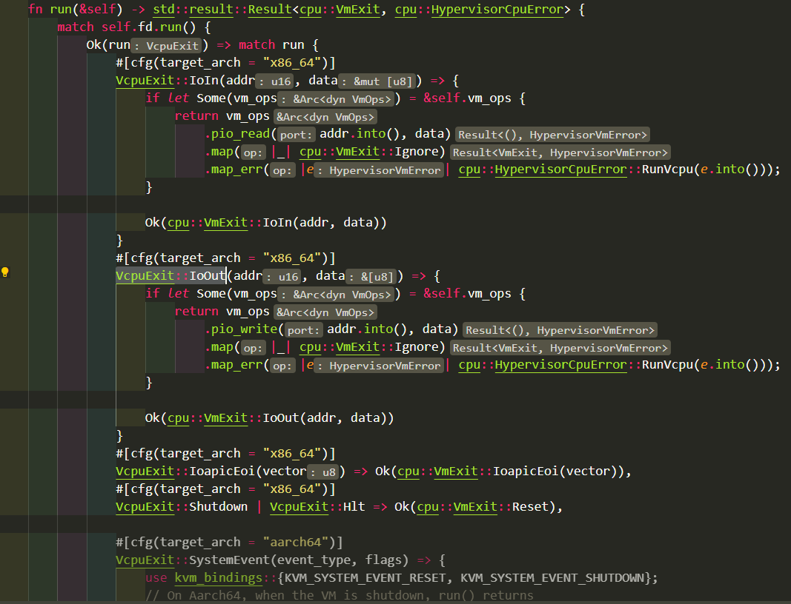

- [命令记录](#命令记录)
  - [命令行启动](#命令行启动)
  - [ch-remote启动](#ch-remote启动)
- [启动](#启动)
  - [可选参数](#可选参数)
- [rest API](#rest-api)
  - [ping](#ping)
  - [dump vm info](#dump-vm-info)
  - [reboot shutdown](#reboot-shutdown)
  - [其他](#其他)
- [guest kernel启动打印](#guest-kernel启动打印)
- [gdb调试](#gdb调试)
  - [rust-gdb](#rust-gdb)
- [测试场景: vm内virtio-net网口ping对应的tap口](#测试场景-vm内virtio-net网口ping对应的tap口)
  - [gdb观察](#gdb观察)
    - [ping是否会触发VM exit -- 否](#ping是否会触发vm-exit----否)
    - [vmm后端怎么工作](#vmm后端怎么工作)
    - [写文件是否会触发VM exit -- 否](#写文件是否会触发vm-exit----否)
    - [lspci是否会触发VM exit -- 是](#lspci是否会触发vm-exit----是)
- [最小化启动](#最小化启动)
- [参考集成](#参考集成)
- [release过程](#release过程)

# 命令记录

## 命令行启动
```sh
bin/cloud-hypervisor --seccomp false --api-socket clh.sock --cpus boot=2 --memory size=2048M,shared=on --kernel kernel/vmlinux.bin --initramfs rootfs/boot/rootfs.cpio.gz --cmdline "console=hvc0 config_overlay=linux_shell_only=1 init=/init"
```

## ch-remote启动
```sh
# 先启动主程序, 主程序等待命令
bin/cloud-hypervisor --seccomp false --api-socket clh.sock

# create
bin/ch-remote --api-socket clh.sock create << EOF
{
     "cpus":{"boot_vcpus":2, "max_vcpus":4},
     "memory":{"size":2147483648, "shared":true},
     "kernel":{"path":"/work/kernel/vmlinux.bin"},
     "cmdline":{"args":"console=ttyS0 console=hvc0 config_overlay=linux_shell_only=1 init=/init"},
     "initramfs":{"path":"/work/rootfs/boot/rootfs.cpio.gz"},
     "console":{"mode":"Pty"},
     "serial":{"file":"/work/run/serial", "mode":"File"}
}
EOF

# boot
bin/ch-remote --api-socket clh.sock boot

# 访问pty, 先找到是pty几
socat -,rawer,escape=29 /dev/pts/2

# shutdown
bin/ch-remote --api-socket clh.sock shutdown
```

# 启动
```sh
# virt-customize需要这个
apt install libguestfs-tools
# 默认ubuntu的cloud image是没有默认用户的, 也没有root密码
# 用下面的命令配置一个
sudo virt-customize -a focal-server-cloudimg-amd64.img --root-password password:ubuntu

wget https://cloud-images.ubuntu.com/focal/current/focal-server-cloudimg-amd64.img

qemu-img convert -p -f qcow2 -O raw focal-server-cloudimg-amd64.img focal-server-cloudimg-amd64.raw

wget https://github.com/cloud-hypervisor/rust-hypervisor-firmware/releases/download/0.4.0/hypervisor-fw
```

启动示例:
```sh
$ sudo setcap cap_net_admin+ep ./cloud-hypervisor/target/release/cloud-hypervisor

# 如果有权限问题, 把/dev/kvm的other设为读写
# 或者加入kvm组
sudo chmod o+rw /dev/kvm

$ ./cloud-hypervisor/target/release/cloud-hypervisor \
    --kernel ./hypervisor-fw \
    --disk path=focal-server-cloudimg-amd64.raw \
    --cpus boot=4 \
    --memory size=1024M \
    --net "tap=,mac=,ip=,mask="
```

## 可选参数
```sh
cloud-hypervisor -h
    --api-socket /path/to/uds
    --kernel
    --cmdline
    --console
    --cpus
    --device
    --disk
    --event-monitor
    --fs
    --initramfs
    --log-file
    --memory
    --memory-zone
    --net
    --numa
    --platform
    --pmem
    --restore
    --rng
    --seccomp
    --serial
    --vsock
    --watchdog
```

# rest API
## ping
```sh
curl --unix-socket /tmp/clh.sock -i -X GET 'http://localhost/api/v1/vmm.ping'
```

## dump vm info
假设使用`--api-socket /tmp/clh.sock`启动clh
```sh
curl --unix-socket /tmp/clh.sock -i -X GET 'http://localhost/api/v1/vm.info' -H 'Accept: application/json' | tail -1 | jq .
```

列表如下:
```json
{
  "config": {
    "cpus": {
      "boot_vcpus": 1,
      "max_vcpus": 1,
      "topology": null,
      "kvm_hyperv": false,
      "max_phys_bits": 46,
      "affinity": null,
      "features": {}
    },
    "memory": {
      "size": 1073741824,
      "mergeable": false,
      "hotplug_method": "Acpi",
      "hotplug_size": null,
      "hotplugged_size": null,
      "shared": false,
      "hugepages": false,
      "hugepage_size": null,
      "prefault": false,
      "zones": null
    },
    "kernel": {
      "path": "./hypervisor-fw"
    },
    "initramfs": null,
    "cmdline": {
      "args": ""
    },
    "disks": [
      {
        "path": "focal-server-cloudimg-amd64.raw",
        "readonly": false,
        "direct": false,
        "iommu": false,
        "num_queues": 1,
        "queue_size": 128,
        "vhost_user": false,
        "vhost_socket": null,
        "poll_queue": true,
        "rate_limiter_config": null,
        "id": "_disk0",
        "disable_io_uring": false,
        "pci_segment": 0
      }
    "net": [
      {
        "tap": null,
        "ip": "192.168.249.1",
        "mask": "255.255.255.0",
        "mac": "2e:cc:5f:b8:cd:dc",
        "host_mac": "82:22:4f:c3:21:da",
        "iommu": false,
        "num_queues": 2,
        "queue_size": 256,
        "vhost_user": false,
        "vhost_socket": null,
        "vhost_mode": "Client",
        "id": "_net1",
        "fds": null,
        "rate_limiter_config": null,
        "pci_segment": 0
      }
    ],
    "rng": {
      "src": "/dev/urandom",
      "iommu": false
    },
    "balloon": null,
    "fs": null,
    "pmem": null,
    "serial": {
      "file": null,
      "mode": "Null",
      "iommu": false
    },
    "console": {
      "file": null,
      "mode": "Tty",
      "iommu": false
    },
    "devices": null,
    "user_devices": null,
    "vdpa": null,
    "vsock": null,
    "iommu": false,
    "sgx_epc": null,
    "numa": null,
    "watchdog": false,
    "platform": null
  },
  "state": "Running",
  "memory_actual_size": 1073741824,
  "device_tree": {
    "__rng": {
      "id": "__rng",
      "resources": [],
      "parent": "_virtio-pci-__rng",
      "children": [],
      "pci_bdf": null
    },
    "_disk0": {
      "id": "_disk0",
      "resources": [],
      "parent": "_virtio-pci-_disk0",
      "children": [],
      "pci_bdf": null
    },
    "_net1": {
      "id": "_net1",
      "resources": [],
      "parent": "_virtio-pci-_net1",
      "children": [],
      "pci_bdf": null
    },
    "_virtio-pci-__console": {
      "id": "_virtio-pci-__console",
      "resources": [
        {
          "PciBar": {
            "index": 0,
            "base": 70364448686080,
            "size": 524288,
            "type_": "Mmio64",
            "prefetchable": false
          }
        }
      ],
      "parent": null,
      "children": [
        "__console"
      ],
      "pci_bdf": "0000:00:01.0"
    },
    "__serial": {
      "id": "__serial",
      "resources": [],
      "parent": null,
      "children": [],
      "pci_bdf": null
    },
    "_virtio-pci-_disk0": {
      "id": "_virtio-pci-_disk0",
      "resources": [
        {
          "PciBar": {
            "index": 0,
            "base": 3891789824,
            "size": 524288,
            "type_": "Mmio32",
            "prefetchable": false
          }
        }
      ],
      "parent": null,
      "children": [
        "_disk0"
      ],
      "pci_bdf": "0000:00:02.0"
    },
    "_virtio-pci-_net1": {
      "id": "_virtio-pci-_net1",
      "resources": [
        {
          "PciBar": {
            "index": 0,
            "base": 70364448161792,
            "size": 524288,
            "type_": "Mmio64",
            "prefetchable": false
          }
        }
      ],
      "parent": null,
      "children": [
        "_net1"
      ],
      "pci_bdf": "0000:00:03.0"
    },
    "__console": {
      "id": "__console",
      "resources": [],
      "parent": "_virtio-pci-__console",
      "children": [],
      "pci_bdf": null
    },
    "__ioapic": {
      "id": "__ioapic",
      "resources": [],
      "parent": null,
      "children": [],
      "pci_bdf": null
    },
    "_virtio-pci-__rng": {
      "id": "_virtio-pci-__rng",
      "resources": [
        {
          "PciBar": {
            "index": 0,
            "base": 70364447637504,
            "size": 524288,
            "type_": "Mmio64",
            "prefetchable": false
          }
        }
      ],
      "parent": null,
      "children": [
        "__rng"
      ],
      "pci_bdf": "0000:00:04.0"
    }
  }
}

```

## reboot shutdown
```sh
curl --unix-socket /tmp/cloud-hypervisor.sock -i -X PUT 'http://localhost/api/v1/vm.reboot'
curl --unix-socket /tmp/cloud-hypervisor.sock -i -X PUT 'http://localhost/api/v1/vm.shutdown'
```

## 其他
比如暂停, 恢复, add net, add disk, remove device, dump counters等等都支持.
例如:
```sh
curl --unix-socket /tmp/clh.sock -i -X GET 'http://localhost/api/v1/vm.counters'
```

# guest kernel启动打印
以ubuntu的云镜像为例:
```
Command line: BOOT_IMAGE=/boot/vmlinuz-5.4.0-113-generic root=LABEL=cloudimg-rootfs ro console=tty1 console=ttyS0
BIOS-provided physical RAM map
efi: EFI v2.80 by

Hypervisor detected: KVM
clocksource: kvm-clock
tsc: Detected 2394.454 MHz processor

Zone ranges:
    DMA      [mem 0x0000000000001000-0x0000000000ffffff]
    DMA32    [mem 0x0000000001000000-0x000000003fffffff]
    Normal   empty
    Device   empty
Early memory node ranges
    node   0: [mem 0x0000000000001000-0x000000000009ffff]
    node   0: [mem 0x000000000013f000-0x000000003fffffff]
Initmem setup node 0 [mem 0x0000000000001000-0x000000003fffffff]

On node 0 totalpages: 261984 //1G

Booting paravirtualized kernel on KVM //guest kernel知道自己是在KVM上启动的
NR_IRQS: 524544, nr_irqs: 256, preallocated irqs: 0
printk: console [tty1] enabled
printk: console [ttyS0] enabled

LSM: Security Framework initializing
Yama: becoming mindful.
AppArmor: AppArmor initialized

PCI host bridge to bus 0000:00
pci_bus 0000:00: root bus resource [mem 0xe8000000-0xe80fffff]
pci_bus 0000:00: root bus resource [mem 0xc0000000-0xe7ffffff window]
pci_bus 0000:00: root bus resource [mem 0x100000000-0x3ffeffffffff window]
pci_bus 0000:00: root bus resource [io  0x0000-0x0cf7 window]
pci_bus 0000:00: root bus resource [io  0x0d00-0xffff window]
pci_bus 0000:00: root bus resource [bus 00]
pci 0000:00:00.0: [8086:0d57] type 00 class 0x060000 //INTEL
pci 0000:00:01.0: [1af4:1043] type 00 class 0xffff00 //virtio
pci 0000:00:01.0: reg 0x10: [mem 0x3ffefff80000-0x3ffeffffffff 64bit] //资源已经分配好
pci 0000:00:02.0: [1af4:1042] type 00 class 0x018000
pci 0000:00:02.0: reg 0x10: [mem 0xe7f80000-0xe7ffffff]
pci 0000:00:03.0: [1af4:1041] type 00 class 0x020000
pci 0000:00:03.0: reg 0x10: [mem 0x3ffefff00000-0x3ffefff7ffff 64bit]
pci 0000:00:04.0: [1af4:1044] type 00 class 0xffff00
pci 0000:00:04.0: reg 0x10: [mem 0x3ffeffe80000-0x3ffeffefffff 64bit]
pci_bus 0000:00: on NUMA node 0

iommu: Default domain type: Translated

PCI: Using ACPI for IRQ routing
PCI: pci_cache_line_size set to 64 bytes

tcpip协议栈初始化

virtio-pci 0000:00:01.0: enabling device (0000 -> 0002)
virtio-pci 0000:00:02.0: enabling device (0000 -> 0002)
virtio-pci 0000:00:03.0: enabling device (0000 -> 0002)
virtio-pci 0000:00:04.0: enabling device (0000 -> 0002)

Serial: 8250/16550 driver, 32 ports, IRQ sharing enabled

loop, tun, vfio, usb, i2c驱动初始化

systemd开始工作
一堆的audit打印...
```

# gdb调试
用上面的命令启动hypervisor后, 用gdb调试:
```sh
gdb cloud-hypervisor -p 18294
Reading symbols from cloud-hypervisor...done
(gdb) b mmio_read
Breakpoint 1 at 0x7f766eb1d1ee: file vmm/src/vm.rs, line 384.
(gdb) b mmio_write
Breakpoint 2 at 0x7f766eb1d3a1: file vmm/src/vm.rs, line 391.
(gdb) info b
Num     Type           Disp Enb Address            What
1       breakpoint     keep y   0x00007f766eb1d1ee in <vmm::vm::VmOpsHandler as hypervisor::vm::VmOps>::mmio_read at vmm/src/vm.rs:384
2       breakpoint     keep y   0x00007f766eb1d3a1 in <vmm::vm::VmOpsHandler as hypervisor::vm::VmOps>::mmio_write at vmm/src/vm.rs:391

(gdb) b src/kvm/mod.rs:1145
Breakpoint 4 at 0x7f766f2759d7: file hypervisor/src/kvm/mod.rs, line 1145.

//只对thread 4打断点
(gdb) b kvm_ioctls::ioctls::vcpu::VcpuFd::run thread 4
```

## rust-gdb
参考https://bitshifter.github.io/rr+rust/index.html#1

需要在root用户下安装rust. 我从普通用户拷贝`~/.cargo`和`~/.rustp`好像也能用.
```sh
# su root
~/.cargo/bin/rust-gdb -p 19507
b kvm_ioctls::ioctls::vcpu::VcpuFd::run
```

# 测试场景: vm内virtio-net网口ping对应的tap口
启动hypervisor后, VM内有virtio-net网口:
```sh
root@ubuntu:~# ethtool -i ens3
driver: virtio_net
version: 1.0.0
bus-info: 0000:00:03.0
```
查看pci拓扑:
注: lspci执行过程中, 会频繁的触发vm exit, 断点表面是VM在做`VcpuExit::IoOut`
```sh
root@ubuntu:~# lspci
00:00.0 Host bridge: Intel Corporation Device 0d57
00:01.0 Unassigned class [ffff]: Red Hat, Inc. Virtio console (rev 01)
00:02.0 Mass storage controller: Red Hat, Inc. Virtio block device (rev 01)
00:03.0 Ethernet controller: Red Hat, Inc. Virtio network device (rev 01)
00:04.0 Unassigned class [ffff]: Red Hat, Inc. Virtio RNG (rev 01)
```

同时, hypervisor会在host上创建一个网口`vmtap0`, 并配置IP`192.168.249.1/24`

默认vm的ens3是down的, 下面配置其为up, ip为192.168.249.2
```sh
ip link set up dev ens3
ip addr add 192.168.249.2/24 dev ens3
```
此时可以ping通`vmtap0`:
```sh
ping 192.168.249.1
```

## gdb观察
设断点:
```sh
# su root
~/.cargo/bin/rust-gdb -p 19507
b kvm_ioctls::ioctls::vcpu::VcpuFd::run
```
这里的`kvm_ioctls::ioctls::vcpu::VcpuFd::run`是下面代码:  
  
  
是KVM_RUN的循环主体.

### ping是否会触发VM exit -- 否
一直ping, 同时做gdb观察
gdb设置上面的断点后, continue执行, 除了第一次continue后会触发断点, 后面不管怎么ping, 都没有触发断点.
说明:
* virtio-net在ping的过程中, VM并没有exit, VM一直"全速"运行
* 因为VM没有exit, 也就没有mmio_read, mmio_write等触发VMM后端的动作; 就是说guest driver在收发报文的时候, 对vring的操作, 对bar寄存器的操作, 统统没有触发mmio exit.

### vmm后端怎么工作
前面看到, ping的过程中没有观察到VM exit, 那VMM后端如何响应guest driver的读写寄存器请求的呢?
会不会在其他代码路径下面调用了寄存器访问的函数呢?

先看看有没有人调用mmio_write和mmio_read
```
(gdb) b mmio_read
(gdb) b mmio_write
```
注:
用`b vmm::vm::VmOpsHandler::mmio_read`是不认的.
用这样的语法gdb可以认:
```
(gdb) b <vmm::vm::VmOpsHandler as hypervisor::vm::VmOps>::mmio_read
```

继续在VM里ping, 没有触发断点.

再增加
```
(gdb) b vm_device::bus::Bus::read
(gdb) b vm_device::bus::Bus::write
```
依旧没触发.

看看有没有认调用`VirtioPciDevice`的read:
```
b <virtio_devices::transport::pci_device::VirtioPciDevice as vm_device::bus::BusDevice>::read
b <virtio_devices::transport::pci_device::VirtioPciDevice as vm_device::bus::BusDevice>::write
```
还是没有触发

继续看pci的读写bar操作:
```
b <virtio_devices::transport::pci_device::VirtioPciDevice as pci::device::PciDevice>::read_bar
b <virtio_devices::transport::pci_device::VirtioPciDevice as pci::device::PciDevice>::write_bar
```
还是没有触发

至此, VM exit路径没有触发virtio-net后端的动作.

所以, 到这里很清楚了, **virtio-net设备在工作的时候, 完全不需要在VM exit和VM enter之间进行切换.** guest driver和vmm device在virtio ring的协议下, 通过ioeventfd和irqfd来互相"通知", 在VM不exit的情况下, 完成报文的交互.
见`cloud-hypervisor/net_util/src/queue_pair.rs`的`process_tx()`和`process_rx()`函数.

再次确认, `pci::device::PciDevice::read_bar/write_bar`并没有在virtio-net报文交换的过程中被调用.

### 写文件是否会触发VM exit -- 否
```sh
echo abc > abc.txt
sync
//执行的很快
dd if=/dev/zero of=out.dd bs=1M count=4
4194304 bytes (4.2 MB, 4.0 MiB) copied, 0.0129554 s, 324 MB/s
```

### lspci是否会触发VM exit -- 是
在vm里面执行`lspci`, 可以看到断点被触发:
```
(gdb) bt
#0  kvm_ioctls::ioctls::vcpu::VcpuFd::run
#1  0x00007fee2b19b9c5 in <hypervisor::kvm::KvmVcpu as hypervisor::cpu::Vcpu>::run
#2  0x00007fee2aca1b45 in vmm::cpu::Vcpu::run
#3  0x00007fee2ac7f5cb in vmm::cpu::CpuManager::start_vcpu::{{closure}}::{{closure}} ()
#4  0x00007fee2acd51bb in std::panicking::try::do_call
#5  0x00007fee2acd5c5b in __rust_try
#6  0x00007fee2acd46e1 in std::panicking::try
#7  0x00007fee2ab64211 in std::panic::catch_unwind
#8  0x00007fee2ac7eaf4 in vmm::cpu::CpuManager::start_vcpu::{{closure}}
#9  0x00007fee2aa607c3 in std::sys_common::backtrace::__rust_begin_short_backtrace
#10 0x00007fee2a9cbde0 in std::thread::Builder::spawn_unchecked_::{{closure}}::{{closure}}
#11 0x00007fee2acdc7c4 in <core::panic::unwind_safe::AssertUnwindSafe<F>
#12 0x00007fee2acd50a2 in std::panicking::try::do_call
#13 0x00007fee2acd5c5b in __rust_try
#14 0x00007fee2acd44e7 in std::panicking::try
#15 0x00007fee2ab64254 in std::panic::catch_unwind
#16 0x00007fee2a9cafb3 in std::thread::Builder::spawn_unchecked_::{{closure}}
#17 0x00007fee2a82f74f in core::ops::function::FnOnce::call_once{{vtable-shim}}
#18 0x00007fee2b423ff3 in <alloc::boxed::Box<F,A> as core::ops::function::FnOnce<Args>>::call_once
#19 <alloc::boxed::Box<F,A> as core::ops::function::FnOnce<Args>>::call_once
#20 std::sys::unix::thread::Thread::new::thread_start
#21 0x00007fee2b44c2e5 in start
#22 0x00007fee2b44d3d9 in __clone

(gdb) n
(gdb) n
(gdb) finish
(gdb) n
1147                    VcpuExit::IoIn(addr, data) => {
```
最后跟下来vm在做`VcpuExit::IoIn`和`VcpuExit::IoOut`, vmm调用对应的`pio_read`和`pio_write`来响应.
注: lspci没有触发mmio相关的调用, 只有pio.

# 最小化启动
https://bl.ocks.org/gdamjan/1f260b58eb9fb1ba62d2234958582405
https://alpinelinux.org/downloads/

# 参考集成
见: cloud-hypervisor/scripts/run_integration_tests_x86_64.sh

# release过程
```yaml
jobs:
    steps:
      - name: Code checkout
        uses: actions/checkout@v2
      - name: Install musl-gcc
        run: sudo apt install -y musl-tools //需要musl-tools
        
      - name: Install Rust toolchain (x86_64-unknown-linux-gnu) //gnu target是动态链接
        uses: actions-rs/toolchain@v1
        with:
            toolchain: "1.60"
            target: x86_64-unknown-linux-gnu
      - name: Install Rust toolchain (x86_64-unknown-linux-musl) //musl target是静态链接
        uses: actions-rs/toolchain@v1
        with:
            toolchain: "1.60"
            target: x86_64-unknown-linux-musl
      - name: Build
        uses: actions-rs/cargo@v1
        with:
            toolchain: "1.60"
            command: build
            args: --all --release --target=x86_64-unknown-linux-gnu
      - name: Static Build
        uses: actions-rs/cargo@v1
        with:
            toolchain: "1.60"
            command: build
            args: --all --release --target=x86_64-unknown-linux-musl
      - name: Strip cloud-hypervisor binaries
        run: strip target/*/release/cloud-hypervisor //strip

      - name: Install Rust toolchain (aarch64-unknown-linux-musl) //aarch64 musl
        uses: actions-rs/toolchain@v1
        with:
            toolchain: "1.60"
            target: aarch64-unknown-linux-musl
            override: true
      - name: Static Build (AArch64)
        uses: actions-rs/cargo@v1
        with:
            use-cross: true
            command: build
            args: --all --release --target=aarch64-unknown-linux-musl

      - name: Upload static cloud-hypervisor //上传asset
        id: upload-release-static-cloud-hypervisor
        uses: actions/upload-release-asset@v1
        env:
          GITHUB_TOKEN: ${{ secrets.GITHUB_TOKEN }}
        with:
          upload_url: ${{ steps.create_release.outputs.upload_url }}
          asset_path: target/x86_64-unknown-linux-musl/release/cloud-hypervisor
          asset_name: cloud-hypervisor-static
          asset_content_type: application/octet-stream
```
