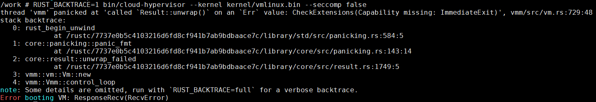

- [cloud hypervisor无法启动](#cloud-hypervisor无法启动)
  - [会是什么原因](#会是什么原因)
    - [检查kvm是否nested](#检查kvm是否nested)
    - [enable nested KVM](#enable-nested-kvm)
    - [不是nested没开](#不是nested没开)
    - [升级kernel](#升级kernel)
- [编译virtiofsd](#编译virtiofsd)
  - [target是musl也不总是完全的静态链接](#target是musl也不总是完全的静态链接)
  - [如何静态链接virtiofsd](#如何静态链接virtiofsd)

# cloud hypervisor无法启动
直接启动会报错:  
  
看提示已经能够显示出错的具体代码位置了.

加上`RUST_BACKTRACE=1`会更具体:  
  

又提示`RUST_BACKTRACE=full`会更详细:  
  

可以看到:
* rust的调用层级很多, 和go有的一拼
* `RUST_BACKTRACE=1`会过滤掉最近的0到12层调用栈, 这些都是`rust_begin_unwind`的内部流程, 一般用户不需要关心
* 真正出问题的是`vmm::vm::Vm::new`, 即`RUST_BACKTRACE=full`时的第16层调用栈, 很奇怪的是在调用栈里没提示是哪一行. 但调用栈打印之前就有打印提示出错文件和行号:`vmm/src/vm.rs:729:48`
  
* unwrap出错会直接panic
* 用环境变量`RUST_BACKTRACE=`这招和go很像`GOTRACEBACK=`

## 会是什么原因
突然想到这个机器本来就是kvm的虚拟机, 是否是kvm嵌套没打开呢?
参考:https://docs.fedoraproject.org/en-US/quick-docs/using-nested-virtualization-in-kvm/

### 检查kvm是否nested
```sh
cat /sys/module/kvm_intel/parameters/nested
```
果然这个机器显示`N`

### enable nested KVM
To enable nested virtualization for Intel processors:
1. Shut down all running VMs and unload the `kvm_probe` module:
```
sudo modprobe -r kvm_intel
```
2. Activate the nesting feature:
```
sudo modprobe kvm_intel nested=1
```
3. Nested virtualization is enabled until the host is rebooted. To enable it permanently, add the following line to the `/etc/modprobe.d/kvm.conf` file:
```
options kvm_intel nested=1
```

AMD的CPU把上面的`kvm_intel`改成`kvm_amd`

### 不是nested没开
按照上面的方法, 重新加载`kvm_intel`并使能`nested=1`, 也成功了.
但问题依旧.  
那估计就是kernel版本太低了:  
`Linux spine.novalocal 3.10.0-1160.2.2.el7.x86_64`
[不支持`KVM_CAP_IMMEDIATE_EXIT`功能](https://patchwork.ozlabs.org/project/qemu-devel/patch/20170227124551.8673-14-pbonzini@redhat.com/)
 
`https://github.com/rust-vmm/kvm-ioctls/src/cap.rs`
```
ImmediateExit = KVM_CAP_IMMEDIATE_EXIT,
```

### 升级kernel
centos 7的kernel比较老, 直接用标准方式升级版本还是3.10.
下面用epel升级kernel
```
yum --enablerepo=elrepo-kernel install kernel-lt
```
改grub默认从新kernel启动, 启动后版本是:
```
$ uname -a
Linux spine.novalocal 5.4.207-1.el7.elrepo.x86_64 #1 SMP Tue Jul 19 10:40:55 EDT 2022 x86_64 x86_64 x86_64 GNU/Linux
```

使用新kernel问题解决!

# 编译virtiofsd
virtiofsd是rust版本的daemon进程, 用来通过viriofs协议和VM共享host目录.
```
git clone https://gitlab.com/virtio-fs/virtiofsd
cargo build --release
```
错误:
```
/usr/bin/ld: cannot find -lseccomp
/usr/bin/ld: cannot find -lcap-ng
collect2: error: ld returned 1 exit status
```

解决:
```
sudo apt install libseccomp-dev libcap-ng-dev
```
## target是musl也不总是完全的静态链接
比如这个virtiofsd, 用了musl libc之后, libc的部分是静态链接的. 但还是引用了libseccomp和libcap

## 如何静态链接virtiofsd
virtiofsd的官方repo就可以编译出完全静态的二进制, 它是如何做到的?
见`https://gitlab.com/virtio-fs/virtiofsd/-/blob/main/.gitlab-ci.yml`
```sh
apk add libcap-ng-static libseccomp-static musl-dev
RUSTFLAGS='-C target-feature=+crt-static -C link-self-contained=yes' LIBSECCOMP_LINK_TYPE=static LIBSECCOMP_LIB_PATH=/usr/lib LIBCAPNG_LINK_TYPE=static LIBCAPNG_LIB_PATH=/usr/lib cargo build --release --target x86_64-unknown-linux-musl
```