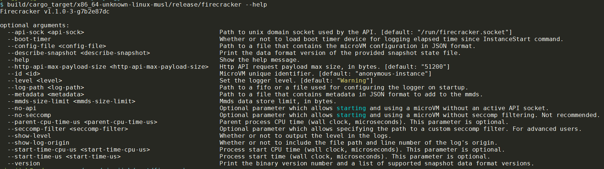
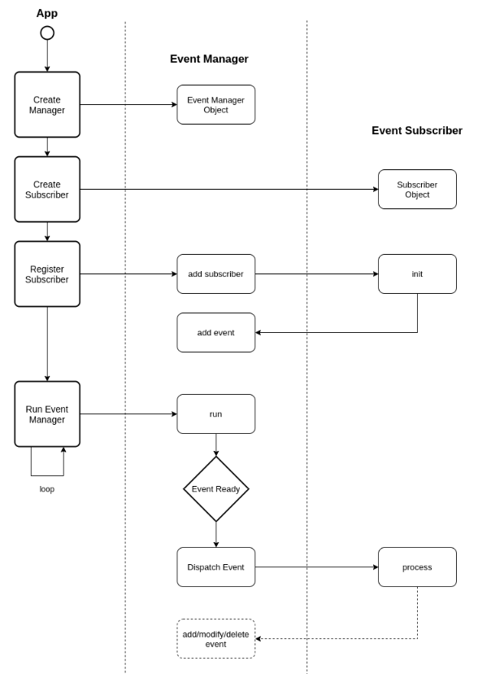
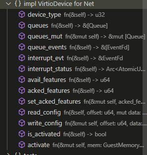

firecracker是最终的可执行文件:  
  

- [run\_without\_api流程](#run_without_api流程)
  - [build\_microvm\_from\_json](#build_microvm_from_json)
- [event manager](#event-manager)
- [aarch64 物理内存layout](#aarch64-物理内存layout)
- [devices::Bus](#devicesbus)
- [底层serial](#底层serial)
  - [用法](#用法)
  - [Serial结构体](#serial结构体)
  - [三个Trait](#三个trait)
  - [自定义Error](#自定义error)
  - [用NoEvents的实例化的Serial](#用noevents的实例化的serial)
  - [driver在哪里读写?](#driver在哪里读写)
- [SerialWrapper](#serialwrapper)
  - [从stdin读输入发给guest流程](#从stdin读输入发给guest流程)
  - [实现了BusDevice的按地址读写的trait](#实现了busdevice的按地址读写的trait)
- [attach\_virtio\_device](#attach_virtio_device)
  - [vm.register\_ioevent(queue\_evt, \&io\_addr, i  as  u32)](#vmregister_ioeventqueue_evt-io_addr-i--as--u32)
  - [vm.register\_irqfd](#vmregister_irqfd)
  - [kvm的irq相关API](#kvm的irq相关api)
    - [KVM\_CREATE\_IRQCHIP](#kvm_create_irqchip)
    - [KVM\_SET\_GSI\_ROUTING](#kvm_set_gsi_routing)
    - [KVM\_IRQFD](#kvm_irqfd)
    - [KVM\_CREATE\_DEVICE](#kvm_create_device)
      - [都有哪些可以被create](#都有哪些可以被create)
    - [ARM gic v3](#arm-gic-v3)
      - [KVM\_DEV\_ARM\_VGIC\_GRP\_ADDR](#kvm_dev_arm_vgic_grp_addr)
  - [MmioTransport](#mmiotransport)
    - [impl MmioTransport](#impl-mmiotransport)
    - [实现BusDevice](#实现busdevice)
  - [device](#device)
    - [device的状态有](#device的状态有)
    - [IrqTrigger](#irqtrigger)
    - [VirtioDevice trait](#virtiodevice-trait)
  - [VirtIO设备框图](#virtio设备框图)
  - [virtIO net](#virtio-net)
    - [Net实现了VirtioDevice](#net实现了virtiodevice)
    - [Net还实现了MutEventSubscriber](#net还实现了muteventsubscriber)

# run_without_api流程
这里重点考察`build/cargo_target/x86_64-unknown-linux-musl/release/firecracker --no-api --config-file myvmconfig.json`方式运行的firecracker  
myvmconfig.json内容如下:
```json
{
  "boot-source": {
    "kernel_image_path": "build/kernel/linux-5.10/vmlinux-5.10-x86_64.bin",
    "boot_args": "console=ttyS0 reboot=k panic=1 pci=off",
    "initrd_path": null
  },
  "drives": [
    {
      "drive_id": "rootfs",
      "path_on_host": "build/rootfs/bionic.rootfs.ext4",
      "is_root_device": true,
      "partuuid": null,
      "is_read_only": false,
      "cache_type": "Unsafe",
      "io_engine": "Sync",
      "rate_limiter": null
    }
  ],
  "machine-config": {
    "vcpu_count": 2,
    "mem_size_mib": 1024,
    "smt": false,
    "track_dirty_pages": false
  },
  "balloon": null,
  "network-interfaces": [],
  "vsock": null,
  "logger": null,
  "metrics": null,
  "mmds-config": null
}
```
经过前面的命令行参数解析, 最后调用
```rust
run_without_api(
    &seccomp_filters, //这个是seccomp的bpf代码
    vmm_config_json, //这个是配置文件的字符串
    instance_info,
    boot_timer_enabled,
    mmds_size_limit,
    metadata_json.as_deref(),
)
```

这个函数先从json构建vmm, 然后在循环里run:
```rust
fn run_without_api(
    seccomp_filters: &BpfThreadMap,
    config_json: Option<String>,
    instance_info: InstanceInfo,
    bool_timer_enabled: bool,
    mmds_size_limit: usize,
    metadata_json: Option<&str>,
) -> FcExitCode {
    let mut event_manager = EventManager::new().expect("Unable to create EventManager");

    // Create the firecracker metrics object responsible for periodically printing metrics.
    let firecracker_metrics = Arc::new(Mutex::new(metrics::PeriodicMetrics::new()));
    event_manager.add_subscriber(firecracker_metrics.clone());

    // Build the microVm. We can ignore VmResources since it's not used without api.
    let (_, vmm) = match build_microvm_from_json(
        seccomp_filters,
        &mut event_manager,
        // Safe to unwrap since '--no-api' requires this to be set.
        config_json.unwrap(),
        instance_info,
        bool_timer_enabled,
        mmds_size_limit,
        metadata_json,
    ) {
        Ok((res, vmm)) => (res, vmm),
        Err(exit_code) => return exit_code,
    };

    // Start the metrics.
    firecracker_metrics
        .lock()
        .expect("Poisoned lock")
        .start(metrics::WRITE_METRICS_PERIOD_MS);

    // Run the EventManager that drives everything in the microVM.
    loop {
        event_manager
            .run()
            .expect("Failed to start the event manager");

        if let Some(exit_code) = vmm.lock().unwrap().shutdown_exit_code() {
            return exit_code;
        }
    }
}
```
build_microvm_from_json就用到了核心模块vmm `firecracker/src/vmm/src`

## build_microvm_from_json
```rust
build_microvm_from_json
    //根据json填充VmResources结构体并初始化
    let mut vm_resources = VmResources::from_json()
    let vmm = vmm::builder::build_microvm_for_boot(&vm_resources)
        //建立guest内存, 思路是在host上mmap, 并记录内存region到变量
        let guest_memory = create_guest_memory()
            //在x86上, 0-768M是内存, 768M到4G是MMIO, 4G以上还是内存
            let arch_mem_regions = arch::arch_memory_regions(mem_size)
            vm_memory::create_guest_memory(&arch_mem_regions)
                为每个region mmap一个region
                    //先mmap一个大的size, size=原size+2个page, 属性是libc::PROT_NONE
                    // Map the guarded range to PROT_NONE
                    let guard_addr = unsafe {
                        libc::mmap(
                            std::ptr::null_mut(),
                            guarded_size,
                            libc::PROT_NONE,
                            libc::MAP_ANONYMOUS | libc::MAP_PRIVATE | libc::MAP_NORESERVE,
                            -1,
                            0,
                        )
                    };

                    //再在刚刚map的region里面, 用原size map一个读写region
                    // Inside the protected range, starting with guard_addr + PAGE_SIZE,
                    // map the requested range with received protection and flags
                    let region_addr = unsafe {
                        libc::mmap(
                            region_start_addr as *mut libc::c_void, //前面返回的addr加个page
                            size,
                            prot,
                            flags | libc::MAP_FIXED,
                            fd,
                            offset as libc::off_t,
                        )
                    };
                    
                //最后build MmapRegion并返回, 用的是https://github.com/rust-vmm/vm-memory
                //到这里好像只是生成GuestMemoryMmap数据结果, 并没有实际操作啥
        //加载linux 内核, 代码在firecracker/src/vmm/src/builder.rs
        let entry_addr = load_kernel(boot_config, &guest_memory)?;
            let kernel_file = 先open kernel文件
            //使用了https://github.com/rust-vmm/linux-loader
            //下面的Loader在x86上是ELF, 在ARM上是PE
            //把kernel_file加载到guest_memory
            let entry_addr = Loader::load::<std::fs::File, GuestMemoryMmap>(
                            &guest_memory, &kernel_file, arch::get_kernel_start())
                            //上面这个get_kernel_start()在x86上是1MB, aarch64上是2GB
                            //先读elf header, 解析所有program header到
                            let mut phdrs: Vec<elf::Elf64_Phdr> = vec![];
                            for 每个phdr
                                //写入guest内存, 似乎只是写入host上mmap的内存. 可能后面会用kvm的api把这些内存映射成guest内存
                                guest_mem.read_exact_from(mem_offset, kernel_image, phdr.p_filesz as usize)
                                
        //从guest_memory find 一个region, 并写入initrd的内容;
        //在我们的配置里, initrd是null
        let initrd = load_initrd_from_config(boot_config, &guest_memory)?;

        //重写cmdline, 再原基础上增加virtio等配置

        //创建VM
        let (mut vmm, mut vcpus) = create_vmm_and_vcpus(
            instance_info,
            event_manager,
            guest_memory,
            None,
            track_dirty_pages,
            vcpu_config.vcpu_count,
        )?;
            // Set up Kvm Vm and register memory regions.
            //调用kvm-ioctls
            let mut vm = setup_kvm_vm(&guest_memory, track_dirty_pages)?;
                //open /dev/kvm, 然后ioctl KVM_CREATE_VM
                let mut vm = Vm::new()
                vm.memory_init()
                    //每个region调用 ioctl KVM_SET_USER_MEMORY_REGION
            
            //MMIO_MEM_START在x86上是(4G-768M), 在aarch64上是1G
            //IRQ_BASE到IRQ_MAX在x86上是5到23, 在aarch64上是32到128
            //这里说的是virtio设备用的irq号范围
            //mmio_device_manager包括mmio_base, irq, 和bus
            let mmio_device_manager = MMIODeviceManager::new(arch::MMIO_MEM_START, (arch::IRQ_BASE, arch::IRQ_MAX));
                //IrqManager是管理(first..last)irq范围的简单结构体
                IrqManager::new()
                //device的bus是个BtreeMap组织的按地址空间划分的设备的集合
                devices::Bus::new()

            //创建中断控制器
            setup_interrupt_controller(&mut  vm)?;
                //x86上是ioctl KVM_CREATE_IRQCHIP
                //aarch64上是GICv2::create(vm, vcpu_count)
                vm.setup_irqchip()
            //新建个eventfd
            let vcpus_exit_evt = EventFd::new(libc::EFD_NONBLOCK)
            vcpus = create_vcpus(&vm, vcpu_count, &vcpus_exit_evt)
                //for里创建n个vCPU, ioctl KVM_CREATE_VCPU
                let vcpu = Vcpu::new()
                vcpu.kvm_vcpu.init(vm.fd())
            set_stdout_nonblocking();
            // servial device是pio设备, 在x86上有, aarch64上没有
            let serial_device = setup_serial_device(event_manager, stdin, stdout)
                //由Serial device写1产生event
                let interrupt_evt = EventFdTrigger::new(EventFd::new(EFD_NONBLOCK))
                //表示in buffer ready
                let kick_stdin_read_evt = EventFdTrigger::new(EventFd::new(EFD_NONBLOCK))
                //SerialWrapper是event和Servial的桥梁
                let serial = SerialWrapper {
                    serial: Serial::with_events(
                        interrupt_evt,
                        SerialEventsWrapper {
                            metrics: METRICS.uart.clone(),
                            buffer_ready_event_fd: Some(kick_stdin_read_evt),
                        },
                        out,
                    ),
                    input: Some(input),
                }
                //加入event manager, 最后的event loop里面会监听stdin和kick_stdin_read_evt fd
                event_manager.add_subscriber(serial.clone());

            //只有x86有pio device, 把上面的serial_device加入到pio_device_manager
            let pio_device_manager = create_pio_dev_manager_with_legacy_devices(&vm, serial_device, reset_evt)

            let vmm = Vmm {
                events_observer: Some(Box::new(SerialStdin::get())),
                instance_info: instance_info.clone(),
                shutdown_exit_code: None,
                vm,
                guest_memory,
                uffd,
                vcpus_handles: Vec::new(),
                vcpus_exit_evt,
                mmio_device_manager,
                #[cfg(target_arch = "x86_64")]
                pio_device_manager,
            };
            //最后返回vmm, vcpus
            Ok((vmm, vcpus))

        //这个是给测试用的, kernel启动完成后, test版本的init会直接写/dev/mem某个地址魔术字(123)
        attach_boot_timer_device(&mu vmm, request_ts)?;
            let boot_timer = devices::pseudo::BootTimer::new(request_ts);
            //在mmio里面分配地址空间, 所谓的注册就是按地址空间assign设备, 设备有读写函数
            vmm.mmio_device_manager.register_mmio_boot_timer(boot_timer)
        //目前balloon设备没使能
        attach_balloon_device(&mut  vmm, &mut  boot_cmdline, balloon, event_manager)?;
            attach_virtio_device(event_manager, vmm, id, balloon.clone(), cmdline)
                event_manager.add_subscriber(device.clone());
                let device = MmioTransport::new(vmm.guest_memory().clone(), device);
                //分配mmio地址范围, 注册到mmio manager; 并修改cmdline
                vmm.mmio_device_manager.register_mmio_virtio_for_boot(vmm.vm.fd(), id, device, cmdline)

        //可能有多个virtio块设备
        attach_block_devices(
            &mut vmm,
            &mut boot_cmdline,
            vm_resources.block.list.iter(),
            event_manager,
        )?;
            for 每个 block
                //如果是root device, 就增加cmdline "root=/dev/vda"或"root=PARTUUID=partuuid"
                //见下面的函数分析
                attach_virtio_device(event_manager, vmm, id, block.clone(), cmdline)?;

        //可能有多个virtio net设备
        attach_net_devices(
            &mut vmm,
            &mut boot_cmdline,
            vm_resources.net_builder.iter(),
            event_manager,
        )?;

        //对应virtio socket device
        //guest可以通过AF_VSOCK通过vsock device和host的AF_UNIX socket通信
        attach_unixsock_vsock_device(&mut vmm, &mut boot_cmdline, unix_vsock, event_manager)?;
        configure_system_for_boot(
            &vmm,
            vcpus.as_mut(),
            vcpu_config,
            entry_addr,
            &initrd,
            boot_cmdline,
        )?;

        //启动vcpu到pause状态
        // Move vcpus to their own threads and start their state machine in the 'Paused' state.
        vmm.start_vcpus(
            vcpus,
            seccomp_filters
                .get("vcpu")
                .ok_or_else(|| MissingSeccompFilters("vcpu".to_string()))?
                .clone(),
        )
            //给每个vcpu起个thread
            thread::Builder::new().spawn(move || {
                //Runs the vCPU in KVM context in a loop. Handles KVM_EXITs then goes back in.
                //run的逻辑是执行StateMachine循环
                //state machine从paused开始
                self.run(filter);
                    //状态机循环
                    while let Some(state_fn) = state_machine.function {
                        // Run the current state handler, and get the next one.
                            state_machine = state_fn(machine);
                    }
            })

        //使能seccomp
        seccompiler::apply_filter()

        // The vcpus start off in the `Paused` state, let them run.
        vmm.resume_vm().map_err(Internal)?;
            self.mmio_device_manager.kick_devices();
            //对每个vCPU send event

        let vmm = Arc::new(Mutex::new(vmm));
        event_manager.add_subscriber(vmm.clone());
```

VmResources定义如下:
一个VMM就由block vsock balloon net等builder构成
```rust
#[derive(Default)]
pub struct VmResources {
    /// The vCpu and memory configuration for this microVM.
    vm_config: VmConfig,
    /// The boot configuration for this microVM.
    boot_config: Option<BootConfig>,
    /// The block devices.
    pub block: BlockBuilder,
    /// The vsock device.
    pub vsock: VsockBuilder,
    /// The balloon device.
    pub balloon: BalloonBuilder,
    /// The network devices builder.
    pub net_builder: NetBuilder,
    /// The optional Mmds data store.
    // This is initialised on demand (if ever used), so that we don't allocate it unless it's
    // actually used.
    pub mmds: Option<Arc<Mutex<Mmds>>>,
    /// Data store limit for the mmds.
    pub mmds_size_limit: usize,
    /// Whether or not to load boot timer device.
    pub boot_timer: bool,
}
```

# event manager
`https://github.com/rust-vmm/event-manager`
使用了epoll机制的事件驱动库  
  

基本上是个epoll的event loop, event subscriber注册的时候掉哟init, 在loop里有对应的event就调用process.

# aarch64 物理内存layout
```rust
//      ==== Address map in use in ARM development systems today ====
//
//              - 32-bit -              - 36-bit -          - 40-bit -
//1024GB    +                   +                      +-------------------+     <- 40-bit
//          |                                           | DRAM              |
//          ~                   ~                       ~                   ~
//          |                                           |                   |
//          |                                           |                   |
//          |                                           |                   |
//          |                                           |                   |
//544GB     +                   +                       +-------------------+
//          |                                           | Hole or DRAM      |
//          |                                           |                   |
//512GB     +                   +                       +-------------------+
//          |                                           |       Mapped      |
//          |                                           |       I/O         |
//          ~                   ~                       ~                   ~
//          |                                           |                   |
//256GB     +                   +                       +-------------------+
//          |                                           |       Reserved    |
//          ~                   ~                       ~                   ~
//          |                                           |                   |
//64GB      +                   +-----------------------+-------------------+   <- 36-bit
//          |                   |                   DRAM                    |
//          ~                   ~                   ~                       ~
//          |                   |                                           |
//          |                   |                                           |
//34GB      +                   +-----------------------+-------------------+
//          |                   |                  Hole or DRAM             |
//32GB      +                   +-----------------------+-------------------+
//          |                   |                   Mapped I/O              |
//          ~                   ~                       ~                   ~
//          |                   |                                           |
//16GB      +                   +-----------------------+-------------------+
//          |                   |                   Reserved                |
//          ~                   ~                       ~                   ~
//4GB       +-------------------+-----------------------+-------------------+   <- 32-bit
//          |           2GB of DRAM                                         |
//          |                                                               |
//2GB       +-------------------+-----------------------+-------------------+
//          |                           Mapped I/O                          |
//1GB       +-------------------+-----------------------+-------------------+
//          |                          ROM & RAM & I/O                      |
//0GB       +-------------------+-----------------------+-------------------+   0
//              - 32-bit -              - 36-bit -              - 40-bit -
//
// Taken from (http://infocenter.arm.com/help/topic/com.arm.doc.den0001c/DEN0001C_principles_of_arm_memory_maps.pdf).

/// Start of RAM on 64 bit ARM.
pub const DRAM_MEM_START: u64 = 0x8000_0000; // 2 GB.
/// The maximum RAM size.
pub const DRAM_MEM_MAX_SIZE: u64 = 0x00FF_8000_0000; // 1024 - 2 = 1022G.

/// Kernel command line maximum size.
/// As per `arch/arm64/include/uapi/asm/setup.h`.
pub const CMDLINE_MAX_SIZE: usize = 2048;

/// Maximum size of the device tree blob as specified in https://www.kernel.org/doc/Documentation/arm64/booting.txt.
pub const FDT_MAX_SIZE: usize = 0x20_0000;

// As per virt/kvm/arm/vgic/vgic-kvm-device.c we need
// the number of interrupts our GIC will support to be:
// * bigger than 32
// * less than 1023 and
// * a multiple of 32.
/// The highest usable SPI on aarch64.
pub const IRQ_MAX: u32 = 128;

/// First usable interrupt on aarch64.
pub const IRQ_BASE: u32 = 32;

/// Below this address will reside the GIC, above this address will reside the MMIO devices.
pub const MAPPED_IO_START: u64 = 1 << 30; // 1 GB
```

# devices::Bus
一个device都对应一段地址空间, 一个bus包括多个device, 按BtreeMap组织, key是device的地址范围, value是BusDevice
```rust
/// A device container for routing reads and writes over some address space.
///
/// This doesn't have any restrictions on what kind of device or address space this applies to. The
/// only restriction is that no two devices can overlap in this address space.
#[derive(Clone, Default)]
pub struct Bus {
    //bus下面是BtreeMap管理的device
    devices: BTreeMap<BusRange, Arc<Mutex<dyn BusDevice>>>,
}
```

Bus有get_device, insert, read, write方法.
read和write的基本逻辑是通过地址来判断是哪个device, 然后lock这个设备, 然后read/write
比如:
```rust
    /// Reads data from the device that owns the range containing `addr` and puts it into `data`.
    ///
    /// Returns true on success, otherwise `data` is untouched.
    pub fn read(&self, addr: u64, data: &mut [u8]) -> bool {
        //self.get_device(addr)返回(offset,dev), offset就是"设备内"偏移地址
        if let Some((offset, dev)) = self.get_device(addr) {
            // OK to unwrap as lock() failing is a serious error condition and should panic.
            dev.lock()
                .expect("Failed to acquire device lock")
                .read(offset, data);
            true
        } else {
            false
        }
    }
```

# 底层serial
`vm-superio-0.5.0/src/serial.rs`
serial是个泛型的结构体:
> The serial console emulation is done by emulating a serial COM port.
Each serial COM port (COM1-4) has an associated Port I/O address base and 12 registers mapped into 8 consecutive Port I/O locations (with the first one being the base). This structure emulates the registers that make sense for UART 16550 (and below) and helps in the interaction between the driver and device by using a [`Trigger`](https://docs.rs/vm_superio/0.5.0/vm_superio/trait.Trigger.html) object for notifications. It also writes the guest's output to an `out` Write object.

serial模拟了UART的16550的12个寄存器

## 用法
```rust
use std::io::{sink, Error, Result};
use std::ops::Deref;
use vm_superio::Trigger;
use vm_superio::Serial;
use vmm_sys_util::eventfd::EventFd;

struct EventFdTrigger(EventFd);
impl Trigger for EventFdTrigger {
    type E = Error;

    fn trigger(&self) -> Result<()> {
        self.write(1)
    }
}
impl Deref for EventFdTrigger {
    type Target = EventFd;
    fn deref(&self) -> &Self::Target {
        &self.0
    }
}
impl EventFdTrigger {
    pub fn new(flag: i32) -> Self {
        EventFdTrigger(EventFd::new(flag).unwrap())
    }
    pub fn try_clone(&self) -> Self {
        EventFdTrigger((**self).try_clone().unwrap())
    }
}

let intr_evt = EventFdTrigger::new(libc::EFD_NONBLOCK);
let mut serial = Serial::new(intr_evt.try_clone(), Vec::new());
// std::io::Sink can be used if user is not interested in guest's output.
let serial_with_sink = Serial::new(intr_evt, sink());

// Write 0x01 to THR register.
serial.write(0, 0x01).unwrap();
// Read from RBR register.
let value = serial.read(0);

// Send more bytes to the guest in one shot.
let input = &[b'a', b'b', b'c'];
// Before enqueuing bytes we first check if there is enough free space
// in the FIFO.
if serial.fifo_capacity() >= input.len() {
    serial.enqueue_raw_bytes(input).unwrap();
}
```

## Serial结构体
这是个泛型, 需要用三个trait: Trigger, SerialEvents, Write来实例化.
```rust
pub struct Serial<T: Trigger, EV: SerialEvents, W: Write> {
    // Some UART registers.
    baud_divisor_low: u8,
    baud_divisor_high: u8,
    interrupt_enable: u8,
    interrupt_identification: u8,
    line_control: u8,
    line_status: u8,
    modem_control: u8,
    modem_status: u8,
    scratch: u8,
    // This is the buffer that is used for achieving the Receiver register
    // functionality in FIFO mode. Reading from RBR will return the oldest
    // unread byte from the RX FIFO.
    in_buffer: VecDeque<u8>,

    // Used for notifying the driver about some in/out events.
    interrupt_evt: T,
    events: EV,
    out: W,
}
```

## 三个Trait
```rust
pub trait SerialEvents {
    /// The driver reads data from the input buffer.
    fn buffer_read(&self);
    /// The driver successfully wrote one byte to serial output.
    fn out_byte(&self);
    /// An error occurred while writing a byte to serial output resulting in a lost byte.
    fn tx_lost_byte(&self);
    /// This event can be used by the consumer to re-enable events coming from
    /// the serial input.
    fn in_buffer_empty(&self);
}

//一般都是EventFD, 用于trigger通知guest driver?
pub trait Trigger {
    /// Underlying type for the potential error conditions returned by `Self::trigger`.
    type E;

    /// Trigger an event.
    fn trigger(&self) -> Result<(), Self::E>;
}

//Write就是io哪个Write
```

## 自定义Error
```rust
/// Errors encountered while handling serial console operations.
#[derive(Debug)]
pub enum Error<E> {
    /// Failed to trigger interrupt.
    Trigger(E),
    /// Couldn't write/flush to the given destination.
    IOError(io::Error),
    /// No space left in FIFO.
    FullFifo,
}
```

## 用NoEvents的实例化的Serial
NoEvents结构体就是实现了一个啥也不干的SerialEvents
```rust
pub struct NoEvents;

impl SerialEvents for NoEvents {
    fn buffer_read(&self) {}
    fn out_byte(&self) {}
    fn tx_lost_byte(&self) {}
    fn in_buffer_empty(&self) {}
}
```
一个更具体的实例化:
```rust
impl<T: Trigger, W: Write> Serial<T, NoEvents, W> {
    /// Creates a new `Serial` instance which writes the guest's output to
    /// `out` and uses `trigger` object to notify the driver about new
    /// events.
    ///
    /// # Arguments
    /// * `trigger` - The Trigger object that will be used to notify the driver
    ///               about events.
    /// * `out` - An object for writing guest's output to. In case the output
    ///           is not of interest,
    ///           [std::io::Sink](https://doc.rust-lang.org/std/io/struct.Sink.html)
    ///           can be used here.
    ///
    /// # Example
    ///
    /// You can see an example of how to use this function in the
    /// [`Example` section from `Serial`](struct.Serial.html#example).
    pub fn new(trigger: T, out: W) -> Serial<T, NoEvents, W> {
        Self::with_events(trigger, NoEvents, out)
    }
}
```
同样的`Serial<T: Trigger, EV: SerialEvents, W: Write>`是范围更大的泛型:
```rust
impl<T: Trigger, EV: SerialEvents, W: Write> Serial<T, EV, W> {
    /// Creates a new `Serial` instance which writes the guest's output to
    /// `out`, uses `trigger` object to notify the driver about new
    /// events, and invokes the `serial_evts` implementation of `SerialEvents`
    /// during operation.
    ///
    /// # Arguments
    /// * `trigger` - The `Trigger` object that will be used to notify the driver
    ///               about events.
    /// * `serial_evts` - The `SerialEvents` implementation used to track the occurrence
    ///                   of significant events in the serial operation logic.
    /// * `out` - An object for writing guest's output to. In case the output
    ///           is not of interest,
    ///           [std::io::Sink](https://doc.rust-lang.org/std/io/struct.Sink.html)
    ///           can be used here.
    pub fn with_events(trigger: T, serial_evts: EV, out: W) -> Self {
        //用了很多const定义个u8的常量, 比如DEFAULT_BAUD_DIVISOR_LOW是0x0C
        Serial {
            baud_divisor_low: DEFAULT_BAUD_DIVISOR_LOW,
            baud_divisor_high: DEFAULT_BAUD_DIVISOR_HIGH,
            interrupt_enable: DEFAULT_INTERRUPT_ENABLE,
            interrupt_identification: DEFAULT_INTERRUPT_IDENTIFICATION,
            line_control: DEFAULT_LINE_CONTROL,
            line_status: DEFAULT_LINE_STATUS,
            modem_control: DEFAULT_MODEM_CONTROL,
            modem_status: DEFAULT_MODEM_STATUS,
            scratch: DEFAULT_SCRATCH,
            in_buffer: VecDeque::new(),
            interrupt_evt: trigger,
            events: serial_evts,
            out,
        }
    }
    
    /// Provides a reference to the interrupt event object.
    pub fn interrupt_evt(&self) -> &T {
        &self.interrupt_evt
    }

    /// Provides a reference to the serial events object.
    pub fn events(&self) -> &EV {
        &self.events
    }

    //具体操作, 私有方法, 基本上是对结构体的各field进行操作
    fn is_dlab_set(&self) -> bool {
        (self.line_control & LCR_DLAB_BIT) != 0
    }

    //还有很多, 省略
    
    //读写函数, 谁来读写? driver
    
    //write不是io Write的格式, offset是预定义的常量表中的常量
    
    /// Handles a write request from the driver at `offset` offset from the
    /// base Port I/O address.
    ///
    /// # Arguments
    /// * `offset` - The offset that will be added to the base PIO address
    ///              for writing to a specific register.
    /// * `value` - The byte that should be written.
    ///
    /// # Example
    ///
    /// You can see an example of how to use this function in the
    /// [`Example` section from `Serial`](struct.Serial.html#example).
    pub fn write(&mut self, offset: u8, value: u8) -> Result<(), Error<T::E>> {
        match offset {
            DLAB_LOW_OFFSET if self.is_dlab_set() => self.baud_divisor_low = value,
            DLAB_HIGH_OFFSET if self.is_dlab_set() => self.baud_divisor_high = value,
            //关键路径, 每次写入一个字节; 写到stdout
            DATA_OFFSET => {
                let res = self
                        .out //重点是这里, 这个out一般是stdout, guest driver的write, 通过这里的Serial Device(Self), 写到stdout
                        .write_all(&[value])
                        .map_err(Error::IOError)
                        .and_then(|_| self.out.flush().map_err(Error::IOError))
                        .map(|_| self.events.out_byte())
                        .map_err(|err| {
                            self.events.tx_lost_byte();
                            err
                        });
                    // Because we cannot block the driver, the THRE interrupt is sent
                    // irrespective of whether we are able to write the byte or not
                    self.thr_empty_interrupt().map_err(Error::Trigger)?;
                    return res;
            }
            _ => {}
        }
        Ok(())
    }

    //读的逻辑是从self.in_buffer pop出一个字节, 返回给调用者.
    
    /// Handles a read request from the driver at `offset` offset from the
    /// base Port I/O address.
    ///
    /// Returns the read value.
    ///
    /// # Arguments
    /// * `offset` - The offset that will be added to the base PIO address
    ///              for reading from a specific register.
    ///
    /// # Example
    ///
    /// You can see an example of how to use this function in the
    /// [`Example` section from `Serial`](struct.Serial.html#example).
    pub fn read(&mut self, offset: u8) -> u8 {
        match offset {
            DLAB_LOW_OFFSET if self.is_dlab_set() => self.baud_divisor_low,
            DLAB_HIGH_OFFSET if self.is_dlab_set() => self.baud_divisor_high,
            DATA_OFFSET => {
                // Here we emulate the reset method for when RDA interrupt
                // was raised (i.e. read the receive buffer and clear the
                // interrupt identification register and RDA bit when no
                // more data is available).
                self.del_interrupt(IIR_RDA_BIT);
                let byte = self.in_buffer.pop_front().unwrap_or_default();
                if self.in_buffer.is_empty() {
                    self.clear_lsr_rda_bit();
                    self.events.in_buffer_empty();
                }
                self.events.buffer_read();
                byte
            }
            LCR_OFFSET => self.line_control,
            MCR_OFFSET => self.modem_control,
            LSR_OFFSET => self.line_status,
            _ => 0,
        }
    }

    /// Returns how much space is still available in the FIFO.
    ///
    /// # Example
    ///
    /// You can see an example of how to use this function in the
    /// [`Example` section from `Serial`](struct.Serial.html#example).
    #[inline]
    pub fn fifo_capacity(&self) -> usize {
        FIFO_SIZE - self.in_buffer.len()
    }

    /// Helps in sending more bytes to the guest in one shot, by storing
    /// `input` bytes in UART buffer and letting the driver know there is
    /// some pending data to be read by setting RDA bit and its corresponding
    /// interrupt when not already triggered.
    ///
    /// # Arguments
    /// * `input` - The data to be sent to the guest.
    ///
    /// # Returns
    ///
    /// The function returns the number of bytes it was able to write to the fifo,
    /// or `FullFifo` error when the fifo is full. Users can use
    /// [`fifo_capacity`](#method.fifo_capacity) before calling this function
    /// to check the available space.
    ///
    /// # Example
    ///
    /// You can see an example of how to use this function in the
    /// [`Example` section from `Serial`](struct.Serial.html#example).
    pub fn enqueue_raw_bytes(&mut self, input: &[u8]) -> Result<usize, Error<T::E>> {
        let mut write_count = 0;
        if !self.is_in_loop_mode() {
            if self.fifo_capacity() == 0 {
                return Err(Error::FullFifo);
            }
            write_count = std::cmp::min(self.fifo_capacity(), input.len());
            if write_count > 0 {
                self.in_buffer.extend(&input[0..write_count]);
                self.set_lsr_rda_bit();
                //就是给Self.interrupt_evt这个eventfd写1
                self.received_data_interrupt().map_err(Error::Trigger)?;
            }
        }
        Ok(write_count)
    }
}
```

## driver在哪里读写?
待续

# SerialWrapper
SerialWrapper包括了底层Serial设备和input
SerialWrapper: `firecracker/src/devices/src/legacy/serial.rs`
底层Serial: `vm-superio-0.5.0/src/serial.rs`
```rust
pub struct SerialWrapper<T: Trigger, EV: SerialEvents, W: Write> {
    pub serial: Serial<T, EV, W>,
    pub input: Option<Box<dyn ReadableFd + Send>>,
}
```
这个结构体是Serial device和event loop之间的桥梁.
之间用eventfd来通知
```
Host                VMM                        Guest
stdin/stdout        Serial设备 read/write      driver
```
具体来讲, guest driver通过BusDevice向Serial设备发出读写请求, VMM调用Serial设备的read/write函数来完成响应并在某些情况下触发中断通知(可能是给PioManager), 比如在给in_buffer读到data后产生received_data_interrupt. Serial结构体来维护UART16550的硬件的寄存器level的行为. 


## 从stdin读输入发给guest流程
SerialWrapper的`<EventFdTrigger, SerialEventsWrapper, W>`的实例实现了recv_bytes
```rust
impl<W: Write> SerialWrapper<EventFdTrigger, SerialEventsWrapper, W> {
    fn recv_bytes(&mut self) -> io::Result<usize> {
        let avail_cap = self.serial.fifo_capacity();

        if let Some(input) = self.input.as_mut() {
            let mut out = vec![0u8; avail_cap]; //指定cap的vec
            //从stdin读
            let count = input.read(&mut out)?; //看来&mut Vec<u8>能当作&mut [u8]
            if count > 0 {
                self.serial
                    //这个有点讲究了, raw_input并不是底层Serial的方法, 而是本文件定义的trait
                    //底层调用的是Servial设备的enqueue_raw_bytes方法, 往底层Servial的in_buffer填数据
                    .raw_input(&out[..count])
                    .map_err(|_| io::Error::from_raw_os_error(libc::ENOBUFS))?;
            }

            return Ok(count);
        }

        Err(io::Error::from_raw_os_error(libc::ENOTTY))
    }
}
```

这个recv_bytes被MutEventSubscriber trait调用, SerialWrapper也实现了MutEventSubscriber
里面的process就调用了recv_bytes
具体没怎么看懂
```rust
impl<W: std::io::Write> MutEventSubscriber
    for SerialWrapper<EventFdTrigger, SerialEventsWrapper, W>
{
    //process会在发生event的时候被调用, 传入event和ops用来表示event类型和维护event
    //可能有多个fd的源头, 但都共用这一个process函数.
    /// Handle events on the serial input fd.
    fn process(&mut self, event: Events, ops: &mut EventOps) {
        #[inline]
        fn unregister_source<T: AsRawFd>(ops: &mut EventOps, source: &T) {
            match ops.remove(Events::new(source, EventSet::IN)) {
                Ok(_) => (),
                Err(_) => error!("Could not unregister source fd: {}", source.as_raw_fd()),
            }
        }

        let input_fd = self.serial_input_fd();
        let buffer_ready_fd = self.buffer_ready_evt_fd();
        if input_fd < 0 || buffer_ready_fd < 0 {
            error!("Serial does not have a configured input source.");
            return;
        }

        if buffer_ready_fd == event.fd() {
            match self.consume_buffer_ready_event() {
                Ok(_) => (),
                Err(err) => {
                    error!("Detach serial device input source due to error in consuming the buffer ready event: {:?}", err);
                    unregister_source(ops, &input_fd);
                    unregister_source(ops, &buffer_ready_fd);
                    return;
                }
            }
        }

        // We expect to receive: `EventSet::IN`, `EventSet::HANG_UP` or
        // `EventSet::ERROR`. To process all these events we just have to
        // read from the serial input.
        match self.recv_bytes() {
            Ok(count) => {
                // Handle EOF if the event came from the input source.
                if input_fd == event.fd() && count == 0 {
                    unregister_source(ops, &input_fd);
                    unregister_source(ops, &buffer_ready_fd);
                    warn!("Detached the serial input due to peer close/error.");
                }
            }
            Err(e) => {
                match e.raw_os_error() {
                    Some(errno) if errno == libc::ENOBUFS => {
                        unregister_source(ops, &input_fd);
                    }
                    //这里是none-block read没东西的时候会返回EAGAIN或者EWOULDBLOCK, 都差不多
                    Some(errno) if errno == libc::EWOULDBLOCK => {
                        self.handle_ewouldblock(ops);
                    }
                    Some(errno) if errno == libc::ENOTTY => {
                        error!("The serial device does not have the input source attached.");
                        unregister_source(ops, &input_fd);
                        unregister_source(ops, &buffer_ready_fd);
                    }
                    Some(_) | None => {
                        // Unknown error, detach the serial input source.
                        unregister_source(ops, &input_fd);
                        unregister_source(ops, &buffer_ready_fd);
                        warn!("Detached the serial input due to peer close/error.");
                    }
                }
            }
        }
    }

    /// Initial registration of pollable objects.
    /// If serial input is present, register the serial input FD as readable.
    fn init(&mut self, ops: &mut EventOps) {
        //input就是stdin, buffer_ready_event_fd就是前面的kick_stdin_read_evt这个eventfd
        if self.input.is_some() && self.serial.events().buffer_ready_event_fd.is_some() {
            let serial_fd = self.serial_input_fd();
            let buf_ready_evt = self.buffer_ready_evt_fd();
            if serial_fd != -1 {
                //实际上是把stdin加到epoll
                if let Err(e) = ops.add(Events::new(&serial_fd, EventSet::IN)) {
                    warn!("Failed to register serial input fd: {}", e);
                }
            }
            //这个实际上是kick_stdin_read_evt这个eventfd
            if let Err(e) = ops.add(Events::new(&buf_ready_evt, EventSet::IN)) {
                warn!("Failed to register serial buffer ready event: {}", e);
            }
        }
    }
}
```

## 实现了BusDevice的按地址读写的trait
按总线地址读写, 最终转化为设备内偏移地址读写
```rust
impl<W: Write + Send> BusDevice
    for SerialWrapper<EventFdTrigger, SerialEventsWrapper, W>
{
    //读是从内部in_buffer读
    fn read(&mut self, offset: u64, data: &mut [u8]) {
        if data.len() != 1 {
            self.serial.events().metrics.missed_read_count.inc();
            return;
        }
        data[0] = self.serial.read(offset as u8);
    }

    //写是写到stdout
    fn write(&mut self, offset: u64, data: &[u8]) {
        if data.len() != 1 {
            self.serial.events().metrics.missed_write_count.inc();
            return;
        }
        if let Err(e) = self.serial.write(offset as u8, data[0]) {
            // Counter incremented for any handle_write() error.
            error!("Failed the write to serial: {:?}", e);
            self.serial.events().metrics.error_count.inc();
        }
    }
}
```

# attach_virtio_device
```rust
/// Attaches a VirtioDevice device to the device manager and event manager.
fn attach_virtio_device<T: VirtioDevice + MutEventSubscriber>(
    event_manager: &mut EventManager,
    vmm: &mut Vmm,
    id: String,
    device: Arc<Mutex<T>>,
    cmdline: &mut LoaderKernelCmdline,
) -> std::result::Result<(), StartMicrovmError> {
    use self::StartMicrovmError::*;

    //注册事件订阅
    event_manager.add_subscriber(device.clone());

    let device = MmioTransport::new(vmm.guest_memory().clone(), device);
    vmm.mmio_device_manager
        .register_mmio_virtio_for_boot(vmm.vm.fd(), id, device, cmdline)
            //分配mmio的addr len和irq资源, 策略是依次顺序分配
            let mmio_slot = self.allocate_new_slot(1)?;
            self.register_mmio_virtio(vm, device_id, mmio_device, &mmio_slot)?;
                let locked_device = mmio_device.locked_device();
                identifier = (DeviceType::Virtio(locked_device.device_type()), device_id);
                //对每个queue
                for (i, queue_evt) in locked_device.queue_events().iter().enumerate()
                    //NOTIFY_REG_OFFSET是0x50, 加上slot.addr这个mmio device的base地址
                    //注意, 并不是所有的mmio设备的地址空间访问都会触发event, 这个io_addr只是特定地址, 用来notify device的.
                    let io_addr = IoEventAddress::Mmio(slot.addr + u64::from(devices::virtio::NOTIFY_REG_OFFSET));
                    //这个queue_evt是每个queue的eventfd, 写io_addr就会触发event, 说明guest driver要通知device来干活了
                    //调用了kvm的ioctl
                    vm.register_ioevent(queue_evt, &io_addr, i as u32) //写这指定地址的时候发event到queue_evt
                vm.register_irqfd() //注册中断注入guest的eventfd和irq号, 调用kvm ioctl KVM_IRQFD; 意思是只要这个eventfd被写入, 内核的kvm模块就会给guest发指定的irq号中断.
                register_mmio_device()
}
```


## vm.register_ioevent(queue_evt, &io_addr, i  as  u32)
三个参数如下:
> `fd` - `EventFd` which will be signaled. When signaling, the usual `vmexit` to userspace is prevented.  
`addr` - Address being written to.  
`datamatch` - Limits signaling `fd` to only the cases where the value being written is equal to this parameter. The size of `datamatch` is important and it must match the expected size of the guest's write.

guest驱动需要某种方法来通知device, kvm的ioeventfd就是干这个用的. 用eventfd的好处是这个guest driver到device的通知不需要vmexit.

> Registers an event to be signaled whenever a certain address is written to. When signaling, the usual `vmexit` to userspace is prevented.

对应KVM的`KVM_IOEVENTFD`  
> This ioctl attaches or detaches an ioeventfd to a legal pio/mmio address within the guest. A guest write in the registered address will signal the provided event instead of triggering an exit.

> If datamatch flag is set, the event will be signaled only if the written value to the registered address is equal to datamatch in struct kvm_ioeventfd.

注意: 这个对每个queue都调用了`vm.register_ioevent(queue_evt, &io_addr, i as u32)`, 作用是给`io_addr`地址绑定一个`queue_evt`, 当driver写`i`到这个`io_aadr`地址的时候, signal给`queue_evt`.
但问题是, 如果是多个queue, 多个`queue_evt`都"绑定"到同一个`io_addr`.  
我猜测这个API是支持多个一个地址对应多个eventfd的, 可能由datamatch的值来区分这个signal发送到哪个eventfd

## vm.register_irqfd
`vm.register_irqfd(locked_device.interrupt_evt(), slot.irqs[0])`
调用kvm的ioctl的`KVM_IRQFD`(见下面)
IRQFD是device写eventfd, 通过kvm触发guest中断的机制.

## kvm的irq相关API
https://www.kernel.org/doc/html/latest/virt/kvm/api.html

### KVM_CREATE_IRQCHIP
Creates an interrupt controller model in the kernel. On x86, creates a virtual ioapic, a virtual PIC (two PICs, nested), and sets up future vcpus to have a local APIC. IRQ routing for GSIs 0-15 is set to both PIC and IOAPIC; GSI 16-23 only go to the IOAPIC. On arm64, a GICv2 is created. Any other GIC versions require the usage of KVM_CREATE_DEVICE, which also supports creating a GICv2. Using KVM_CREATE_DEVICE is preferred over KVM_CREATE_IRQCHIP for GICv2. On s390, a dummy irq routing table is created.

### KVM_SET_GSI_ROUTING
Sets the GSI routing table entries, overwriting any previously set entries.

### KVM_IRQFD
Allows setting an eventfd to directly trigger a guest interrupt. kvm_irqfd.fd specifies the file descriptor to use as the eventfd and kvm_irqfd.gsi specifies the irqchip pin toggled by this event. When an event is triggered on the eventfd, an interrupt is injected into the guest using the specified gsi pin. The irqfd is removed using the KVM_IRQFD_FLAG_DEASSIGN flag, specifying both kvm_irqfd.fd and kvm_irqfd.gsi.

With KVM_CAP_IRQFD_RESAMPLE, KVM_IRQFD supports a de-assert and notify mechanism allowing emulation of level-triggered, irqfd-based interrupts. When KVM_IRQFD_FLAG_RESAMPLE is set the user must pass an additional eventfd in the kvm_irqfd.resamplefd field. When operating in resample mode, posting of an interrupt through kvm_irq.fd asserts the specified gsi in the irqchip. When the irqchip is resampled, such as from an EOI, the gsi is de-asserted and the user is notified via kvm_irqfd.resamplefd. It is the user’s responsibility to re-queue the interrupt if the device making use of it still requires service. Note that closing the resamplefd is not sufficient to disable the irqfd. The KVM_IRQFD_FLAG_RESAMPLE is only necessary on assignment and need not be specified with KVM_IRQFD_FLAG_DEASSIGN.

On arm64, gsi routing being supported, the following can happen:

*   in case no routing entry is associated to this gsi, injection fails
*   in case the gsi is associated to an irqchip routing entry, irqchip.pin + 32 corresponds to the injected SPI ID.
*   in case the gsi is associated to an MSI routing entry, the MSI message and device ID are translated into an LPI (support restricted to GICv3 ITS in-kernel emulation).

### KVM_CREATE_DEVICE
Creates an emulated device in the kernel. The file descriptor returned in fd can be used with KVM_SET/GET/HAS_DEVICE_ATTR.

If the KVM_CREATE_DEVICE_TEST flag is set, only test whether the device type is supported (not necessarily whether it can be created in the current vm).

Individual devices should not define flags. Attributes should be used for specifying any behavior that is not implied by the device type number.

#### 都有哪些可以被create
*   [Devices](https://www.kernel.org/doc/html/latest/virt/kvm/devices/index.html)
    *   [ARM Virtual Interrupt Translation Service (ITS)](https://www.kernel.org/doc/html/latest/virt/kvm/devices/arm-vgic-its.html)
    *   [ARM Virtual Generic Interrupt Controller v2 (VGIC)](https://www.kernel.org/doc/html/latest/virt/kvm/devices/arm-vgic.html)
    *   [ARM Virtual Generic Interrupt Controller v3 and later (VGICv3)](https://www.kernel.org/doc/html/latest/virt/kvm/devices/arm-vgic-v3.html)
    *   [MPIC interrupt controller](https://www.kernel.org/doc/html/latest/virt/kvm/devices/mpic.html)
    *   [FLIC (floating interrupt controller)](https://www.kernel.org/doc/html/latest/virt/kvm/devices/s390_flic.html)
    *   [Generic vcpu interface](https://www.kernel.org/doc/html/latest/virt/kvm/devices/vcpu.html)
    *   [VFIO virtual device](https://www.kernel.org/doc/html/latest/virt/kvm/devices/vfio.html)
    *   [Generic vm interface](https://www.kernel.org/doc/html/latest/virt/kvm/devices/vm.html)
    *   [XICS interrupt controller](https://www.kernel.org/doc/html/latest/virt/kvm/devices/xics.html)
    *   [POWER9 eXternal Interrupt Virtualization Engine (XIVE Gen1)](https://www.kernel.org/doc/html/latest/virt/kvm/devices/xive.html)
    
### ARM gic v3
Only one VGIC instance may be instantiated through this API. The created VGIC will act as the VM interrupt controller, requiring emulated user-space devices to inject interrupts to the VGIC instead of directly to CPUs. It is not possible to create both a GICv3 and GICv2 on the same VM.

Creating a guest GICv3 device requires a host GICv3 as well.

#### KVM_DEV_ARM_VGIC_GRP_ADDR
定义了vgic寄存器在guest物理地址空间的基地址
* KVM_VGIC_V3_ADDR_TYPE_DIST (rw, 64-bit)
Base address in the guest physical address space of the GICv3 distributor register mappings. Only valid for KVM_DEV_TYPE_ARM_VGIC_V3. This address needs to be 64K aligned and the region covers 64 KByte.

* KVM_VGIC_V3_ADDR_TYPE_REDIST (rw, 64-bit)
Base address in the guest physical address space of the GICv3 redistributor register mappings. There are two 64K pages for each VCPU and all of the redistributor pages are contiguous. Only valid for KVM_DEV_TYPE_ARM_VGIC_V3. This address needs to be 64K aligned.

## MmioTransport
mplements the MMIO transport for virtio devices.

This requires 3 points of installation to work with a VM:

1.  Mmio reads and writes must be sent to this device at what is referred to here as MMIO base.
2.  `Mmio::queue_evts` must be installed at `virtio::NOTIFY_REG_OFFSET` offset from the MMIO base. Each event in the array must be signaled if the index is written at that offset.
3.  `Mmio::interrupt_evt` must signal an interrupt that the guest driver is listening to when it is written to.

Typically one page (4096 bytes) of MMIO address space is sufficient to handle this transport and inner virtio device.

对应的结构体:
```rust
pub struct MmioTransport {
    device: Arc<Mutex<dyn VirtioDevice>>,
    // The register where feature bits are stored.
    pub(crate) features_select: u32,
    // The register where features page is selected.
    pub(crate) acked_features_select: u32,
    pub(crate) queue_select: u32,
    pub(crate) device_status: u32,
    pub(crate) config_generation: u32,
    mem: GuestMemoryMmap,
    pub(crate) interrupt_status: Arc<AtomicUsize>,
}
```
### impl MmioTransport
```rust
impl MmioTransport {
    /// Constructs a new MMIO transport for the given virtio device.
    pub fn new(mem: GuestMemoryMmap, device: Arc<Mutex<dyn VirtioDevice>>) -> MmioTransport {
        //这里小知识点: device.lock()返回的是mutexGuard, 它会在生命周期结束后自动调用unlock. 
        //不用担心一直会lock, 因为device.lock()的生命周期只有下面一行
        //这行结束了其实就已经unlock了.
        //-- 确认, 不要怀疑. 根本原因是做为临时变量的mutexGuard在本行就已经消亡, 编译器自动插入了unlock()
        let interrupt_status = device.lock().expect("Poisoned lock").interrupt_status();

        //new这个结构体
        MmioTransport {
            device,
            features_select: 0,
            acked_features_select: 0,
            queue_select: 0,
            device_status: device_status::INIT,
            config_generation: 0,
            mem,
            interrupt_status,
        }
    }
    
    pub fn locked_device(&self) -> MutexGuard<dyn VirtioDevice + static> {
        self.device.lock().expect("Poisoned lock")
    }
    // Gets the encapsulated VirtioDevice.
    pub fn device(&self) -> Arc<Mutex<dyn VirtioDevice>> {
        self.device.clone()
    }
    fn check_device_status(&self, set: u32, clr: u32) -> bool {
        self.device_status & (set | clr) == set
    }
    fn are_queues_valid(&self) -> bool {
        self.locked_device()
            .queues()
            .iter()
            .all(|q| q.is_valid(&self.mem))
    }
    //注意到泛型U, 并没有约束;
    //这里的意思是入参d的类型是U, 表示默认值.
    fn with_queue<U, F>(&self, d: U, f: F) -> U
    where
        F: FnOnce(&Queue) -> U,
    {
        match self
            .locked_device()
            .queues()
            .get(self.queue_select as usize)
        {
            Some(queue) => f(queue),
            None => d,
        }
    }
    fn with_queue_mut<F: FnOnce(&mut Queue)>(&mut self, f: F) -> bool {
        if let Some(queue) = self
            .locked_device()
            .queues_mut()
            .get_mut(self.queue_select as usize)
        {
            f(queue);
            true
        } else {
            false
        }
    }
    fn update_queue_field<F: FnOnce(&mut Queue)>(&mut self, f: F) {
        if self.check_device_status(
            device_status::FEATURES_OK,
            device_status::DRIVER_OK | device_status::FAILED,
        ) {
            self.with_queue_mut(f);
        } else {
            warn!(
                "update virtio queue in invalid state 0x{:x}",
                self.device_status
            );
        }
    }
    fn reset(&mut self) {
        重置结构体"寄存器"
    }
    //根据VirtIO Spec 1.0, section 2.1.1 and 3.1.1
    //在device的write里面调用, 实际上是给guest的driver用的
    fn set_device_status(&mut self, status: u32) {
    }
}
```

### 实现BusDevice
根据virtIO规范MMIO transport方式:  
https://docs.oasis-open.org/virtio/virtio/v1.2/csd01/virtio-v1.2-csd01.html#x1-1650002
```rust
impl BusDevice for MmioTransport {
    fn read(&mut self, offset: u64, data: &mut [u8]) {
        match offset {
            0x00..=0xff if data.len() == 4 => {
                let v = match offset {
                    0x0 => MMIO_MAGIC_VALUE,
                    0x04 => MMIO_VERSION,
                    0x08 => self.locked_device().device_type(),
                    0x0c => VENDOR_ID, // vendor id
                    0x10 => { //32bit的feature flag
                        let mut features = self
                            .locked_device()
                            .avail_features_by_page(self.features_select);
                        if self.features_select == 1 {
                            features |= 0x1; // enable support of VirtIO Version 1
                        }
                        features
                    }
                    //对已经选中的queue(QueueSel), 读出queue内元素个数; Reading from the register returns the maximum size (number of elements) of the queue the device is ready to process or zero (0x0) if the queue is not available.
                    0x34 => self.with_queue(0, |q| u32::from(q.get_max_size())),
                    //对已经选中的queue, 写1表示ready. 读是读上一次的值
                    0x44 => self.with_queue(0, |q| q.ready as u32),
                    //中断状态寄存器, 要么是Used Buffer Notification(bit 0), 要么是Configuration Change Notification(bit 1)
                    0x60 => self.interrupt_status.load(Ordering::SeqCst) as u32,
                    //设备状态寄存器.
                    0x70 => self.device_status,
                    //配置空间原子性寄存器, 两次读的一样就是原子的?
                    0xfc => self.config_generation,
                    _ => {
                        warn!("unknown virtio mmio register read: 0x{:x}", offset);
                        return;
                    }
                };
                byte_order::write_le_u32(data, v); //注意这里, 使用byte_order的小端写
            }
            0x100..=0xfff => self.locked_device().read_config(offset - 0x100, data),
            _ => {
                warn!(
                    "invalid virtio mmio read: 0x{:x}:0x{:x}",
                    offset,
                    data.len()
                );
            }
        };
    }

    fn write(&mut self, offset: u64, data: &[u8]) {
        fn hi(v: &mut GuestAddress, x: u32) {
            *v = (*v & 0xffff_ffff) | (u64::from(x) << 32)
        }

        fn lo(v: &mut GuestAddress, x: u32) {
            *v = (*v & !0xffff_ffff) | u64::from(x)
        }

        match offset {
            0x00..=0xff if data.len() == 4 => {
                let v = byte_order::read_le_u32(data); //按小端方式理解data
                match offset {
                    //Device (host) features word selection. 写这个寄存器选择feature flag
                    0x14 => self.features_select = v,
                    //Flags representing device features understood and activated by the driver
                    0x20 => {
                        if self.check_device_status(
                            device_status::DRIVER,
                            device_status::FEATURES_OK | device_status::FAILED,
                        ) {
                            self.locked_device()
                                .ack_features_by_page(self.acked_features_select, v);
                        } else {
                            warn!(
                                "ack virtio features in invalid state 0x{:x}",
                                self.device_status
                            );
                        }
                    }
                    //Activated (guest) features word selection
                    0x24 => self.acked_features_select = v,
                    //这个就是QueueSel, 也叫Virtual queue index, 从0开始
                    0x30 => self.queue_select = v,
                    //Virtual queue size
                    0x38 => self.update_queue_field(|q| q.size = v as u16),
                    //queue read
                    //Writing one (0x1) to this register notifies the device that it can execute requests from this virtual queue.
                    0x44 => self.update_queue_field(|q| q.ready = v == 1),
                    //中断应答
                    0x64 => {
                        if self.check_device_status(device_status::DRIVER_OK, 0) {
                            self.interrupt_status
                                .fetch_and(!(v as usize), Ordering::SeqCst);
                        }
                    }
                    //Device status: Writing non-zero values to this register sets the status flags, indicating the driver progress
                    0x70 => self.set_device_status(v),
                    //Virtual queue’s Descriptor Area 64 bit long physical address
                    0x80 => self.update_queue_field(|q| lo(&mut q.desc_table, v)),
                    0x84 => self.update_queue_field(|q| hi(&mut q.desc_table, v)),
                    //Virtual queue’s Driver Area 64 bit long physical address
                    0x90 => self.update_queue_field(|q| lo(&mut q.avail_ring, v)),
                    0x94 => self.update_queue_field(|q| hi(&mut q.avail_ring, v)),
                    //Virtual queue’s Device Area 64 bit long physical address
                    0xa0 => self.update_queue_field(|q| lo(&mut q.used_ring, v)),
                    0xa4 => self.update_queue_field(|q| hi(&mut q.used_ring, v)),
                    _ => {
                        warn!("unknown virtio mmio register write: 0x{:x}", offset);
                    }
                }
            }
            0x100..=0xfff => {
                if self.check_device_status(device_status::DRIVER, device_status::FAILED) {
                    self.locked_device().write_config(offset - 0x100, data)
                } else {
                    warn!("can not write to device config data area before driver is ready");
                }
            }
            _ => {
                warn!(
                    "invalid virtio mmio write: 0x{:x}:0x{:x}",
                    offset,
                    data.len()
                );
            }
        }
    }
}
```

## device
### device的状态有
```rust
/// Enum that indicates if a VirtioDevice is inactive or has been activated
/// and memory attached to it.
pub enum DeviceState {
    Inactive,
    Activated(GuestMemoryMmap),
}
```
这个enum也有方法, 其中`mem()`方法返回GuestmemoryMmap
```rust
impl DeviceState {
    /// Checks if the device is activated.
    pub fn is_activated(&self) -> bool {
        match self {
            DeviceState::Inactive => false,
            DeviceState::Activated(_) => true,
        }
    }

    /// Gets the memory attached to the device if it is activated.
    pub fn mem(&self) -> Option<&GuestMemoryMmap> {
        match self {
            DeviceState::Activated(ref mem) => Some(mem),
            DeviceState::Inactive => None,
        }
    }
}
```

### IrqTrigger
IrqTrigger包含一个eventFd叫`irq_evt`, `trigger_irq`方法就是写这个eventFd.
```rust
/// Helper struct that is responsible for triggering guest IRQs
pub struct IrqTrigger {
    pub(crate) irq_status: Arc<AtomicUsize>,
    pub(crate) irq_evt: EventFd,
}

impl IrqTrigger {
    pub fn new() -> std::io::Result<Self> {
        Ok(Self {
            irq_status: Arc::new(AtomicUsize::new(0)),
            irq_evt: EventFd::new(libc::EFD_NONBLOCK)?,
        })
    }

    pub fn trigger_irq(&self, irq_type: IrqType) -> std::result::Result<(), std::io::Error> {
        let irq = match irq_type {
            IrqType::Config => VIRTIO_MMIO_INT_CONFIG,
            IrqType::Vring => VIRTIO_MMIO_INT_VRING,
        };
        //irq状态
        self.irq_status.fetch_or(irq as usize, Ordering::SeqCst);
        //eventfd写1
        self.irq_evt.write(1).map_err(|e| {
            error!("Failed to send irq to the guest: {:?}", e);
            e
        })?;

        Ok(())
    }
}
```

### VirtioDevice trait
```rust
/// Trait for virtio devices to be driven by a virtio transport.
///
/// The lifecycle of a virtio device is to be moved to a virtio transport, which will then query the
/// device. The virtio devices needs to create queues, events and event fds for interrupts and expose
/// them to the transport via get_queues/get_queue_events/get_interrupt/get_interrupt_status fns.
pub trait VirtioDevice: AsAny + Send {
    /// Get the available features offered by device.
    fn avail_features(&self) -> u64;

    /// Get acknowledged features of the driver.
    fn acked_features(&self) -> u64;

    /// Set acknowledged features of the driver.
    /// This function must maintain the following invariant:
    /// - self.avail_features() & self.acked_features() = self.get_acked_features()
    fn set_acked_features(&mut self, acked_features: u64);

    fn has_feature(&self, feature: u64) -> bool {
        (self.acked_features() & 1 << feature) != 0
    }

    /// The virtio device type.
    fn device_type(&self) -> u32;

    /// Returns the device queues.
    fn queues(&self) -> &[Queue];

    /// Returns a mutable reference to the device queues.
    fn queues_mut(&mut self) -> &mut [Queue];

    /// Returns the device queues event fds.
    fn queue_events(&self) -> &[EventFd];

    /// Returns the device interrupt eventfd.
    fn interrupt_evt(&self) -> &EventFd;

    /// Returns the current device interrupt status.
    fn interrupt_status(&self) -> Arc<AtomicUsize>;

    /// The set of feature bits shifted by `page * 32`.
    fn avail_features_by_page(&self, page: u32) -> u32 {
        let avail_features = self.avail_features();
        match page {
            // Get the lower 32-bits of the features bitfield.
            0 => avail_features as u32,
            // Get the upper 32-bits of the features bitfield.
            1 => (avail_features >> 32) as u32,
            _ => {
                warn!("Received request for unknown features page.");
                0u32
            }
        }
    }

    /// Acknowledges that this set of features should be enabled.
    fn ack_features_by_page(&mut self, page: u32, value: u32) {
        let mut v = match page {
            0 => u64::from(value),
            1 => u64::from(value) << 32,
            _ => {
                warn!("Cannot acknowledge unknown features page: {}", page);
                0u64
            }
        };

        // Check if the guest is ACK'ing a feature that we didn't claim to have.
        let avail_features = self.avail_features();
        let unrequested_features = v & !avail_features;
        if unrequested_features != 0 {
            warn!("Received acknowledge request for unknown feature: {:x}", v);
            // Don't count these features as acked.
            v &= !unrequested_features;
        }
        self.set_acked_features(self.acked_features() | v);
    }

    /// Reads this device configuration space at `offset`.
    fn read_config(&self, offset: u64, data: &mut [u8]);

    /// Writes to this device configuration space at `offset`.
    fn write_config(&mut self, offset: u64, data: &[u8]);

    /// Performs the formal activation for a device, which can be verified also with `is_activated`.
    fn activate(&mut self, mem: GuestMemoryMmap) -> ActivateResult;

    /// Checks if the resources of this device are activated.
    fn is_activated(&self) -> bool;

    /// Optionally deactivates this device and returns ownership of the guest memory map, interrupt
    /// event, and queue events.
    fn reset(&mut self) -> Option<(EventFd, Vec<EventFd>)> {
        None
    }
}
```

## VirtIO设备框图
  

## virtIO net
virtIO net的定义很复杂
```rust
pub struct Net {
    pub(crate) id: String,

    pub tap: Tap, //对接的tap设备

    pub(crate) avail_features: u64,
    pub(crate) acked_features: u64,

    pub(crate) queues: Vec<Queue>,
    pub(crate) queue_evts: Vec<EventFd>,

    pub(crate) rx_rate_limiter: RateLimiter,
    pub(crate) tx_rate_limiter: RateLimiter,

    pub(crate) rx_deferred_frame: bool,
    rx_deferred_irqs: bool,

    rx_bytes_read: usize,
    rx_frame_buf: [u8; MAX_BUFFER_SIZE],

    tx_iovec: Vec<(GuestAddress, usize)>,
    tx_frame_buf: [u8; MAX_BUFFER_SIZE],

    pub(crate) irq_trigger: IrqTrigger, //中断触发, 里面是eventfd

    pub(crate) config_space: ConfigSpace,
    pub(crate) guest_mac: Option<MacAddr>,

    pub(crate) device_state: DeviceState,
    pub(crate) activate_evt: EventFd,

    pub mmds_ns: Option<MmdsNetworkStack>,

    #[cfg(test)]
    pub(crate) mocks: Mocks,
}
```

Net实现了很多方法, 比如交换tap设备和queue的数据:
```rust
impl Net {
    new_with_tap()
    id()
    guest_mac()
    iface_name()
    mmds_ns()
    signal_used_queue() {self.irq_trigger.trigger_irq()}
    signal_rx_used_queue()
    do_write_frame_to_guest(
    write_frame_to_guest()
    read_from_mmds_or_tap()
    //处理从tap设备来的数据, 然后给guest发irq: 
    //self.signal_used_queue() -> self.irq_trigger.trigger_irq(IrqType::Vring) 还是写eventfd
    process_rx() 
    handle_deferred_frame()
    resume_rx()
    process_tx()
    read_tap()
    process_rx_queue_event()
    process_tap_rx_event()
    process_tx_queue_event()
    process_virtio_queues()
}
```

### Net实现了VirtioDevice
相对比较薄的一层, 实现了下面的方法:  
  

### Net还实现了MutEventSubscriber
```rust
impl MutEventSubscriber for Net {
    fn process(&mut self, event: Events, ops: &mut EventOps) {
        let source = event.fd();
        let event_set = event.event_set();

        // TODO: also check for errors. Pending high level discussions on how we want
        // to handle errors in devices.
        let supported_events = EventSet::IN;
        if !supported_events.contains(event_set) {
            warn!(
                "Received unknown event: {:?} from source: {:?}",
                event_set, source
            );
            return;
        }

        if self.is_activated() {
            let virtq_rx_ev_fd = self.queue_evts[RX_INDEX].as_raw_fd();
            let virtq_tx_ev_fd = self.queue_evts[TX_INDEX].as_raw_fd();
            let rx_rate_limiter_fd = self.rx_rate_limiter.as_raw_fd();
            let tx_rate_limiter_fd = self.tx_rate_limiter.as_raw_fd();
            let tap_fd = self.tap.as_raw_fd();
            let activate_fd = self.activate_evt.as_raw_fd();

            // Looks better than C style if/else if/else.
            match source {
                _ if source == virtq_rx_ev_fd => self.process_rx_queue_event(),
                _ if source == tap_fd => self.process_tap_rx_event(), //tap设备来数据了
                _ if source == virtq_tx_ev_fd => self.process_tx_queue_event(),
                _ if source == rx_rate_limiter_fd => self.process_rx_rate_limiter_event(),
                _ if source == tx_rate_limiter_fd => self.process_tx_rate_limiter_event(),
                _ if activate_fd == source => self.process_activate_event(ops),
                _ => {
                    warn!("Net: Spurious event received: {:?}", source);
                    METRICS.net.event_fails.inc();
                }
            }
        } else {
            warn!(
                "Net: The device is not yet activated. Spurious event received: {:?}",
                source
            );
        }
    }

    fn init(&mut self, ops: &mut EventOps) {
        // This function can be called during different points in the device lifetime:
        //  - shortly after device creation,
        //  - on device activation (is-activated already true at this point),
        //  - on device restore from snapshot.
        if self.is_activated() {
            self.register_runtime_events(ops);
        } else {
            self.register_activate_event(ops);
        }
    }
}
```
