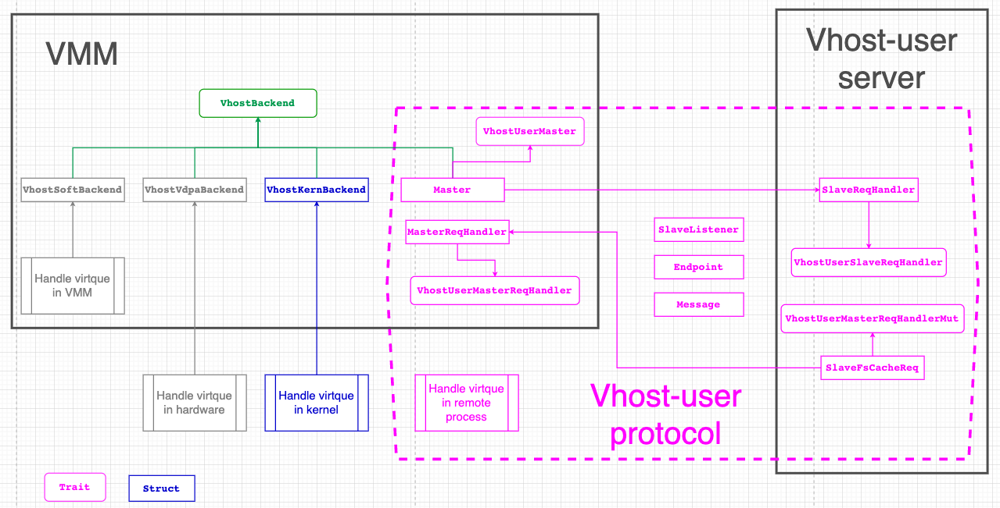
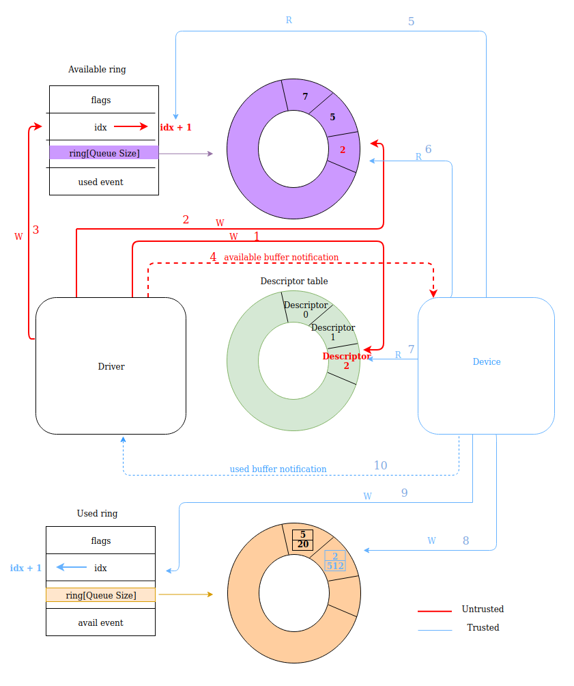
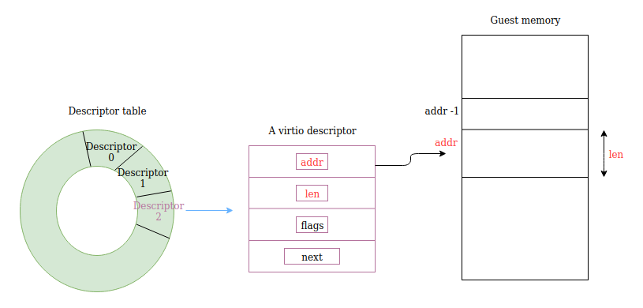

这里记录一下virtiofsd用到的重要的vhost库

- [vhost](#vhost)
- [vhost-user-backend](#vhost-user-backend)
- [virtio-queue](#virtio-queue)
  - [设备侧使用virtio queue](#设备侧使用virtio-queue)
  - [通知](#通知)
  - [数据传输](#数据传输)
  - [描述符格式](#描述符格式)
  - [vqueue对象](#vqueue对象)
  - [其他抽象](#其他抽象)
  - [通知抑制](#通知抑制)
- [vm-memory](#vm-memory)
  - [地址空间抽象](#地址空间抽象)
  - [VM物理地址空间](#vm物理地址空间)
  - [`mmap`实现了`GuestMemory`](#mmap实现了guestmemory)


# [vhost](https://crates.io/crates/vhost)
vhost库支持三种使用方式:
* vhost: linux 内核实现的
* vhost-user: 用户态实现的
* vDPA: 硬件实现的

架构图:
  

在vhost场景下  
virtio设备在linux kernel里面, vmm通过ioctl管理这个virtio设备, 比如说vhost-net, vhost-scsi, vhost-vsock. 建立好vqueue之后, guest的driver和host kernel的vhost-net直接交换数据, 没有通过vmm, 没有syscall.

在vhost-user场景下  
VMM里面的Master负责建立vqueue, 使用vqueue的是slave. master和slave之间通过unix socket来通信, 在virtiofsd的实现里, 这个socket由slave来listen.

因为vhost-user使用的是trait抽象, 这个库并不依赖底层的vhost-user实现.

# [vhost-user-backend](https://crates.io/crates/vhost-user-backend)
这个crate依赖
* vhost
* virtio-bindings
* virtio-queue

vhost-user-backend实现了vhost-user协议的service框架, 用户可以用它实现vhost-user的服务. 提供的API如下
* daemon控制对象(`VhostUserDaemon`), 用于开始/停止daemon
* vhost-user backend trait(`VhostUserBackendMut`), 用来处理vhost-user控制消息和virtio消息
* 访问vqueue的trait(`VringT`), 有三个实现`VringState`, `VringMutex` and `VringRwLock`.

# [virtio-queue](https://crates.io/crates/virtio-queue)
virtio规范里定义了两类vqueue的格式, split和packed. 这里只支持split模式.

virtio-queue这个crate是给virtio device用的, 比如virtio-blk, 或者virtio-vsock. 

## 设备侧使用virtio queue
virtio设备需要有类似物理设备的寄存器, 包括下面的信息:
* 设备状态"寄存器"
* 功能bit flag
* 通知"寄存器"
* 一个或多个vqueue

在split模式下, vqueue包括三部分:
* 描述符表
* available ring
* used ring

在启动VM之前, VMM会做下面的配置:
1. 初始化vqueue
2. 注册本device到MMIO总线, 这样guest driver可以通过MMIO读写这个设备
3. 注册关联的fd来进行中断注入, 即device通知driver一些event

VM启动后, guest driver就开始和VMM模拟的device来交互了:
* 协商支持的feature
* 协商vqueue参数, 比如size, 状态, 地址等
* 激活vqueue, VMM可以在这里才创建vqueue的handler线程开始干活

## 通知
vqueue的操作逻辑是guest driver产生descriptor, vmm的virtio device handler来消费descriptor. descriptor用链表管理.一方操作完成后, 要通知另外一方. 在KVM辅助下, 
* 比如driver通知device, 就是写个notification地址, 这个地址在初始化的时候就已经被KVM关联到了ioevent fd, 那么写地址相当于写fd, 这个fd在VMM的device代码里有handler监听, 通知就过去了.
* device通知driver叫中断注入, 也是通过KVM关联的irqfd完成的.

## 数据传输
  
按照上图所示, 数据流程如下:
1. driver有数据(buffer)要写, driver准备descriptor, driver写descriptor到绿色descriptor table, 得到index
2. driver写上面得到的index到紫色available ring
3. driver更新available ring的idx
4. driver通知device
5. device先读available ring 的idx
6. device从avaliable ring的idx得到descriptor的index
7. device从descriptor table读index对应的descriptor
8. device消费完这个descriptor之后, 比如把数据发送到tap设备, device写used ring. 内容包括刚才这个descriptor的idx和已经写了的字节数
9. device更新used ring的idx
10. deice发used buffer事件通知到driver

## 描述符格式
上面绿色ring存储的是描述符, 描述符有4个域:
* addr: 指向真正的数据buffer
* len: 数据buffer的长度
* flag: 一些有用的flag, 比如buffer是不是device writable
* next: 指向下个描述符

  

## vqueue对象
* Queue → it is used for the single-threaded context.
* QueueSync → it is used for the multi-threaded context, and is simply a wrapper over an `Arc<Mutex<Queue>>`.
* QueueState -> 用于保存和回复queue状态

## 其他抽象
* Descriptor → which mostly offers accessors for the members of the Descriptor.
* DescriptorChain → provides accessors for the DescriptorChain’s members and an Iterator implementation for iterating over the DescriptorChain, there is also an abstraction for iterators over just the device readable or just the device writable descriptors (DescriptorChainRwIter).
* AvailIter - is a consuming iterator over all available descriptor chain heads in the queue.

## 通知抑制
有时候不需要每个动作都通知. 比如当driver 处理used ring期间, 就不需要再收到device发来的used buffer事件. 规范里通知抑制是这样描述的:
-   [Used Buffer Notification Suppression](https://docs.oasis-open.org/virtio/virtio/v1.1/csprd01/virtio-v1.1-csprd01.html#x1-400007),
-   [Available Buffer Notification Suppression](https://docs.oasis-open.org/virtio/virtio/v1.1/csprd01/virtio-v1.1-csprd01.html#x1-4800010).

vQueue用下面的步骤来处理available ring:
1. device 先关闭通知来让driver直到device正在处理available ring, 此时device不想要事件. device调用`Queue::disable_notification`来关闭通知.
2. device用AvailIter 来处理available ring
3. device调用`Queue::enable_notification`来打开通知

下面这段没看明白, vqueue还能用在driver端? driver端不是在guest里面的driver吗?
> On the driver side, the `Queue` provides the `needs_notification` method which should be used each time the device adds a new entry to the used ring. Depending on the `used_event` value and on the last used value (`signalled_used`), `needs_notification` returns true to let the device know it should send a notification to the guest.


# [vm-memory](https://crates.io/crates/vm-memory)
VMM里面的各种组件, 比如boot loader, 各种virtio backend, 都需要访问VM的物理地址. 这个vm-memory提供了trait抽象, 把VM内存的提供者和消费者分离开来.  
vm-memory的设计原则:
* 给使用者定义了访问VM物理内存的API
* 但没给提供者定义如何提供物理内存的API, 这样提供者实现的时候更灵活

## 地址空间抽象
-   `AddressValue`: stores the raw value of an address. Typically `u32`, `u64` or `usize` are used to store the raw value.
-   `Address`: implementation of `AddressValue`.
-   `Bytes`: trait for volatile access to memory. The `Bytes` trait can be parameterized with types that represent addresses, in order to enforce that addresses are used with the right "kind" of volatile memory.
-   `VolatileMemory`: basic implementation of volatile access to memory. Implements `Bytes<usize>`.

这里只定义了消费地址空间的方法, 并没有定义管理地址空间(create, delete, insert, remove)的方法

## VM物理地址空间
* `GuestAddress`: represents a guest physical address (GPA). guest物理地址空间, 应该就是u64
* `GuestMemoryRegion`: represents a continuous region of the VM memory. 连续的地址区间
* `GuestMemory`: represents a collection of `GuestMemoryRegion` objects. 
  -   hide the detail of accessing physical addresses (for example complex hierarchical structures).
  -   map an address request to a `GuestMemoryRegion` object and relay the request to it.
  -   handle cases where an access request is spanning two or more `GuestMemoryRegion` objects.

## `mmap`实现了`GuestMemory`
这里的`mmap`实现, 把VM的物理地址mapping到当前进程.
* `MmapRegion`: implementation of mmap a continuous range of physical memory with methods for accessing the mapped memory.
* `GuestRegionMmap`: implementation of `GuestMemoryRegion` providing a wrapper used to map VM's physical address into a `(mmap_region, offset)` tuple
* `GuestMemoryMmap`: implementation of `GuestMemory` that manages a collection of `GuestRegionMmap` objects for a VM.

使用时
```rust
let guest_memory_mmap: GuestMemoryMmap = ...
let addr: GuestAddress = ...
let buf = &mut [0u8; 5];
let result = guest_memory_mmap.write(buf, addr);
```